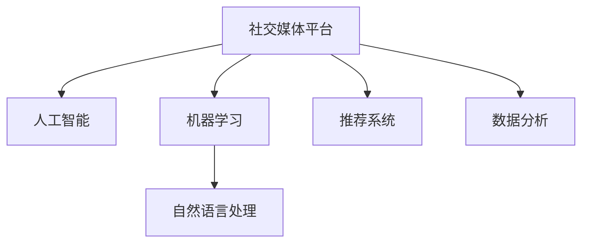

                 

# 利用技术优势进行社交媒体营销

## 1. 背景介绍

### 1.1 问题由来

在当前数字化转型的浪潮下，社交媒体平台已成为企业和品牌触达消费者的重要渠道。传统的社交媒体营销主要依赖于内容创作、用户互动和数据收集，但随着技术的不断进步，特别是人工智能和机器学习的引入，社交媒体营销已经迎来了新的发展机遇。利用技术优势进行社交媒体营销，可以大大提升营销的效率和效果，使品牌更好地触达目标用户，提高用户参与度和品牌忠诚度。

### 1.2 问题核心关键点

社交媒体营销的核心在于如何通过技术手段更好地理解和触达用户，提升营销活动的精准性和有效性。利用技术优势进行社交媒体营销，可以：
- 实现目标用户的精准定位和行为预测。
- 提高内容的个性化推荐和互动性。
- 优化营销策略，提升用户参与度和品牌忠诚度。
- 自动化数据分析和反馈机制，实时调整营销策略。
- 减少人力成本，提升营销活动的ROI。

## 2. 核心概念与联系

### 2.1 核心概念概述

为更好地理解利用技术优势进行社交媒体营销的范式，本节将介绍几个密切相关的核心概念：

- 社交媒体平台：如Facebook、Instagram、Twitter等，是品牌与用户互动的主要渠道。
- 人工智能(AI)：涉及机器学习、深度学习、自然语言处理等技术，可以用于用户行为分析、内容生成、广告投放等。
- 机器学习(ML)：通过训练模型，实现对用户行为的预测、内容的推荐等。
- 自然语言处理(NLP)：使机器能够理解和处理自然语言，应用于社交媒体上的文本分析、情感分析、意图识别等。
- 推荐系统：通过分析用户的历史行为和偏好，为其推荐感兴趣的内容，应用于社交媒体上的个性化推荐。
- 数据分析：通过数据挖掘和统计分析，从大量社交媒体数据中提取有价值的信息，用于优化营销策略。

这些核心概念之间的逻辑关系可以通过以下Mermaid流程图来展示：



这个流程图展示了几大核心概念及其之间的关系：

1. 社交媒体平台是技术应用的主要场景。
2. 人工智能和机器学习是实现技术优势的核心工具。
3. 自然语言处理使机器能够理解和处理用户输入。
4. 推荐系统利用机器学习技术，提高内容推荐的相关性和用户体验。
5. 数据分析则从海量社交媒体数据中提取有价值的信息，用于优化营销策略。

## 3. 核心算法原理 & 具体操作步骤

### 3.1 算法原理概述

利用技术优势进行社交媒体营销，本质上是利用人工智能和机器学习技术，对社交媒体数据进行深度分析和挖掘，实现精准定位、个性化推荐和实时优化。其核心思想是：通过分析用户的历史行为和偏好，预测其未来的行为，并据此生成个性化内容，进行精准投放和互动，从而达到提升用户参与度和品牌忠诚度的目的。

形式化地，假设社交媒体平台上有$N$个用户，每个用户的历史行为数据为$X_i$，其中$i=1,2,...,N$。利用机器学习算法$f$，对用户行为数据进行建模，预测用户未来行为$Y_i$。基于预测结果，为每个用户生成个性化推荐内容$C_i$，进行广告投放。通过用户对内容的反馈，实时调整推荐策略，提升营销效果。

### 3.2 算法步骤详解

基于人工智能和机器学习的社交媒体营销一般包括以下几个关键步骤：

**Step 1: 数据收集和预处理**

- 收集社交媒体平台上的用户数据，如点赞、评论、分享、搜索记录等。
- 对数据进行清洗、去重、归一化等预处理，确保数据质量。

**Step 2: 特征工程**

- 提取用户的核心特征，如年龄、性别、地理位置、兴趣爱好等。
- 构建用户行为序列，如点赞、评论、分享等行为的时序关系。

**Step 3: 用户行为预测**

- 选择适当的机器学习模型，如回归模型、分类模型、序列模型等，对用户行为进行预测。
- 训练模型，使用交叉验证等技术评估模型性能。

**Step 4: 个性化内容生成**

- 根据预测结果，生成个性化推荐内容，如文章、视频、广告等。
- 利用自然语言处理技术，生成高质量的推荐文案。

**Step 5: 内容投放和互动**

- 将推荐内容投放给目标用户，进行精准营销。
- 利用机器学习技术，分析用户对内容的互动反馈，进行实时优化。

**Step 6: 持续优化**

- 根据用户反馈和市场变化，不断更新和优化模型，提升营销效果。

### 3.3 算法优缺点

基于人工智能和机器学习的社交媒体营销方法具有以下优点：
1. 提高营销的精准性和个性化。通过分析用户历史行为，实现精准定位和个性化推荐，提高用户参与度和品牌忠诚度。
2. 提升营销效率和ROI。通过自动化数据分析和内容生成，大幅减少人力成本，提高营销活动的效率。
3. 增强市场竞争力。利用技术优势，实现快速响应市场变化，快速迭代和优化营销策略。
4. 优化用户体验。通过个性化推荐和互动，提升用户满意度和体验。

同时，该方法也存在一定的局限性：
1. 对数据质量和量级有较高要求。需要大量高质量的社交媒体数据，进行模型训练。
2. 对模型的准确性和鲁棒性要求较高。模型预测的准确性和鲁棒性直接影响营销效果。
3. 对技术门槛较高。需要具备一定的机器学习和数据科学知识，才能高效应用技术优势。
4. 数据隐私和安全问题。需要严格遵守数据隐私保护法规，确保用户数据的安全。
5. 存在偏见和歧视。模型可能受到数据偏见的影响，出现对特定群体的不公平行为。

尽管存在这些局限性，但就目前而言，基于人工智能和机器学习的社交媒体营销方法仍然是提升品牌营销效果的重要手段。未来相关研究的重点在于如何进一步降低数据需求，提高模型精度，同时兼顾隐私和伦理问题，实现更高效、公平和安全的社交媒体营销。

### 3.4 算法应用领域

基于人工智能和机器学习的社交媒体营销方法，已经在多个领域得到了广泛的应用，例如：

- 电子商务：通过分析用户购物行为，生成个性化推荐商品，提升用户购买率和复购率。
- 在线广告：根据用户浏览历史，生成个性化广告，提高广告点击率和转化率。
- 社交媒体内容推荐：分析用户点赞、评论、分享等行为，推荐感兴趣的内容，提升用户参与度。
- 用户行为分析：通过分析用户历史数据，预测其未来行为，优化广告投放策略。
- 智能客服：利用自然语言处理技术，实现智能客服对话，提升用户体验和满意度。

除了上述这些经典应用外，人工智能和机器学习技术还在社交媒体营销中不断拓展新的应用场景，如内容生成、情感分析、用户分群等，为品牌营销提供了新的思路和工具。随着技术的进步，社交媒体营销必将在更多的领域得到创新应用，实现更大的价值。

## 4. 数学模型和公式 & 详细讲解  
### 4.1 数学模型构建

本节将使用数学语言对利用人工智能和机器学习的社交媒体营销过程进行更加严格的刻画。

假设社交媒体平台上有$N$个用户，每个用户的历史行为数据为$X_i$，其中$i=1,2,...,N$。利用机器学习算法$f$，对用户行为数据进行建模，预测用户未来行为$Y_i$。基于预测结果，为每个用户生成个性化推荐内容$C_i$，进行广告投放。

定义用户行为预测的损失函数为$\mathcal{L}(f)$，个性化推荐的内容与广告投放的损失函数为$\mathcal{L}_{ad}$，总损失函数为$\mathcal{L}=\mathcal{L}(f)+\mathcal{L}_{ad}$。则目标是最小化总损失函数，即：

$$
\min_{f}\mathcal{L}=\mathcal{L}(f)+\mathcal{L}_{ad}
$$

在实践中，我们通常使用基于梯度的优化算法（如SGD、Adam等）来近似求解上述最优化问题。设$\eta$为学习率，则参数的更新公式为：

$$
\theta \leftarrow \theta - \eta \nabla_{\theta}\mathcal{L}(\theta)
$$

其中 $\nabla_{\theta}\mathcal{L}(\theta)$ 为损失函数对参数 $\theta$ 的梯度，可通过反向传播算法高效计算。

### 4.2 公式推导过程

以下我们以二分类任务为例，推导分类模型的预测结果和损失函数的计算公式。

假设用户行为数据为$X_i=[x_{i1},x_{i2},...,x_{in}]$，其中$x_{ij}$为第$j$个特征值。用户未来行为$Y_i$的分类结果为$y_i \in \{0,1\}$，表示用户是否会对广告点击。根据分类模型$f$，预测用户未来行为的概率为$\hat{y}_i=f(X_i)$。则二分类交叉熵损失函数定义为：

$$
\ell(f(X_i),y_i) = -[y_i\log \hat{y}_i + (1-y_i)\log (1-\hat{y}_i)]
$$

将其代入总损失函数公式，得：

$$
\mathcal{L}(f) = -\frac{1}{N}\sum_{i=1}^N [y_i\log f(X_i)+(1-y_i)\log(1-f(X_i))]
$$

在得到损失函数的梯度后，即可带入参数更新公式，完成模型的迭代优化。重复上述过程直至收敛，最终得到适应社交媒体平台营销的最优模型$f$。

### 4.3 案例分析与讲解

以电商平台的个性化推荐为例，说明如何利用机器学习技术提升推荐效果。

假设电商平台有$m$个商品，每个用户的历史行为数据为$X_i=[x_{i1},x_{i2},...,x_{in}]$，其中$x_{ij}$为第$j$个行为特征，如浏览、点击、购买等。用户未来是否购买某个商品$y_i \in \{0,1\}$。利用机器学习算法$f$，对用户行为数据进行建模，预测用户是否购买某个商品。

定义损失函数为二分类交叉熵损失，目标是最小化损失函数$\mathcal{L}(f)$。选择适当的模型，如线性回归、逻辑回归、决策树等，对用户行为进行建模。通过交叉验证等技术评估模型性能，选择合适的模型参数。

模型训练完成后，根据用户历史行为数据$X_i$，生成推荐商品$C_i$，进行个性化推荐。利用A/B测试等方法，评估推荐效果，进行实时优化，不断提升推荐效果和用户体验。

## 5. 项目实践：代码实例和详细解释说明
### 5.1 开发环境搭建

在进行社交媒体营销开发前，我们需要准备好开发环境。以下是使用Python进行PyTorch开发的环境配置流程：

1. 安装Anaconda：从官网下载并安装Anaconda，用于创建独立的Python环境。

2. 创建并激活虚拟环境：
```bash
conda create -n pytorch-env python=3.8 
conda activate pytorch-env
```

3. 安装PyTorch：根据CUDA版本，从官网获取对应的安装命令。例如：
```bash
conda install pytorch torchvision torchaudio cudatoolkit=11.1 -c pytorch -c conda-forge
```

4. 安装TensorFlow：由Google主导开发的开源深度学习框架，生产部署方便，适合大规模工程应用。同样有丰富的预训练语言模型资源。

5. 安装Scikit-learn：机器学习领域的重要库，提供了丰富的数据处理和模型评估工具。

6. 安装Numpy、Pandas等常用库：
```bash
pip install numpy pandas scikit-learn
```

完成上述步骤后，即可在`pytorch-env`环境中开始社交媒体营销的开发。

### 5.2 源代码详细实现

下面我们以电商平台个性化推荐为例，给出使用PyTorch进行社交媒体营销开发的PyTorch代码实现。

首先，定义用户行为数据的处理函数：

```python
from torch.utils.data import Dataset
import numpy as np

class UserBehaviorDataset(Dataset):
    def __init__(self, user_data, num_features):
        self.user_data = user_data
        self.num_features = num_features
        
    def __len__(self):
        return len(self.user_data)
    
    def __getitem__(self, item):
        user_data = self.user_data[item]
        features = user_data[:self.num_features]
        return features
```

然后，定义模型的训练函数：

```python
from torch import nn, optim
from torch.utils.data import DataLoader
import torch.nn.functional as F

class RecommendationModel(nn.Module):
    def __init__(self, num_features, hidden_dim, output_dim):
        super(RecommendationModel, self).__init__()
        self.fc1 = nn.Linear(num_features, hidden_dim)
        self.fc2 = nn.Linear(hidden_dim, output_dim)
        
    def forward(self, x):
        x = F.relu(self.fc1(x))
        x = self.fc2(x)
        return x
    
def train_model(model, data_loader, num_epochs, learning_rate):
    criterion = nn.BCELoss()
    optimizer = optim.Adam(model.parameters(), lr=learning_rate)
    
    for epoch in range(num_epochs):
        for batch in data_loader:
            features, labels = batch
            optimizer.zero_grad()
            outputs = model(features)
            loss = criterion(outputs, labels)
            loss.backward()
            optimizer.step()
    return model
```

接着，定义数据加载和模型评估函数：

```python
def load_data(file_path, num_features):
    user_data = []
    with open(file_path, 'r') as f:
        for line in f:
            data = line.strip().split(',')
            user_data.append([float(x) for x in data[:num_features]])
    return np.array(user_data)
    
def evaluate_model(model, test_data_loader):
    correct = 0
    total = 0
    with torch.no_grad():
        for features, labels in test_data_loader:
            outputs = model(features)
            _, predicted = torch.max(outputs, 1)
            total += labels.size(0)
            correct += (predicted == labels).sum().item()
    print('Accuracy:', correct/total)
    
data_train = load_data('train_data.csv', 10)
data_test = load_data('test_data.csv', 10)
train_data_loader = DataLoader(data_train, batch_size=64, shuffle=True)
test_data_loader = DataLoader(data_test, batch_size=64, shuffle=False)
model = RecommendationModel(num_features=10, hidden_dim=128, output_dim=1)
model = train_model(model, train_data_loader, 10, 0.001)
evaluate_model(model, test_data_loader)
```

以上就是使用PyTorch进行电商平台个性化推荐的完整代码实现。可以看到，得益于PyTorch的强大封装，我们可以用相对简洁的代码完成模型的训练和评估。

### 5.3 代码解读与分析

让我们再详细解读一下关键代码的实现细节：

**UserBehaviorDataset类**：
- `__init__`方法：初始化用户行为数据和特征数。
- `__len__`方法：返回数据集的样本数量。
- `__getitem__`方法：对单个样本进行处理，将用户行为数据分割为特征部分。

**RecommendationModel类**：
- `__init__`方法：定义模型的结构，包括两个全连接层。
- `forward`方法：定义模型的前向传播过程，通过两个全连接层进行特征提取和输出。

**train_model函数**：
- 定义交叉熵损失函数和优化器，进行模型训练。
- 在每个epoch内，对每个批次进行前向传播和反向传播，更新模型参数。

**load_data函数**：
- 从文件中加载用户行为数据，进行预处理。

**evaluate_model函数**：
- 使用测试集对模型进行评估，计算准确率。

**训练流程**：
- 定义总epoch数和batch size，开始循环迭代
- 每个epoch内，在训练集上训练，输出训练loss
- 在测试集上评估模型，输出测试结果

可以看到，PyTorch配合TensorFlow等库，使得社交媒体营销的代码实现变得简洁高效。开发者可以将更多精力放在数据处理、模型改进等高层逻辑上，而不必过多关注底层的实现细节。

当然，工业级的系统实现还需考虑更多因素，如模型的保存和部署、超参数的自动搜索、更灵活的推荐模型等。但核心的社交媒体营销范式基本与此类似。

## 6. 实际应用场景
### 6.1 电商平台的个性化推荐

利用人工智能和机器学习技术，电商平台可以构建个性化推荐系统，实现精准推荐。通过对用户历史行为数据的分析，预测用户未来的购买行为，生成个性化推荐商品，提升用户购物体验和满意度。

在技术实现上，可以收集用户浏览、点击、购买等行为数据，提取和商品相关的重要特征，如价格、销量、品牌等。将数据输入模型进行训练，生成推荐模型。在用户浏览商品时，模型根据用户行为数据生成推荐商品，并通过A/B测试等方法评估推荐效果。根据反馈数据，实时调整推荐策略，不断提升推荐准确性和用户满意度。

### 6.2 在线广告的精准投放

在线广告的精准投放，也是人工智能和机器学习技术的重要应用场景。通过对用户行为数据的分析，预测用户对广告的反应，生成个性化的广告内容，实现精准投放，提高广告的点击率和转化率。

在技术实现上，可以收集用户搜索、点击、浏览等行为数据，构建用户画像。通过预测模型，对每个用户预测其对不同广告的反应，生成个性化广告，进行精准投放。利用A/B测试等方法，评估广告效果，优化广告内容，提高广告投放的ROI。

### 6.3 社交媒体的内容推荐

社交媒体平台上的内容推荐，也是人工智能和机器学习技术的重要应用。通过对用户点赞、评论、分享等行为数据的分析，生成个性化的内容推荐，提升用户参与度和平台粘性。

在技术实现上，可以收集用户对不同内容的行为数据，构建用户行为序列。通过预测模型，对每个用户预测其对不同内容的行为，生成个性化推荐内容，进行精准投放。利用A/B测试等方法，评估推荐效果，优化推荐策略，提升用户参与度和平台粘性。

### 6.4 未来应用展望

随着人工智能和机器学习技术的不断发展，社交媒体营销必将迎来更加广泛的应用。

在智慧城市治理中，可以利用人工智能和机器学习技术，分析市民在社交媒体上的言论和行为，预测社会事件和舆情趋势，优化城市治理策略。在智能制造领域，可以通过分析工人操作行为，生成个性化培训内容，提升工人技能和生产效率。在医疗健康领域，可以分析患者在社交媒体上的健康相关行为，生成个性化健康建议，提升健康管理效果。

未来，人工智能和机器学习技术将在更多领域得到创新应用，推动社会各行业的数字化转型和智能化升级。社交媒体营销作为品牌营销的重要手段，必将在技术赋能下，实现更高效、更精准、更个性化的推广效果，为品牌创造更大的价值。

## 7. 工具和资源推荐
### 7.1 学习资源推荐

为了帮助开发者系统掌握利用人工智能和机器学习的社交媒体营销的理论基础和实践技巧，这里推荐一些优质的学习资源：

1. 《机器学习》课程（Stanford University）：由Coursera提供的经典课程，涵盖了机器学习的基本概念和算法。

2. 《深度学习》课程（Andrew Ng）：由Coursera提供的深度学习入门课程，介绍了深度学习的基本原理和应用。

3. 《自然语言处理》课程（University of Michigan）：由Coursera提供的NLP入门课程，涵盖NLP的基本概念和应用。

4. 《TensorFlow实战》书籍：TensorFlow官方指南，详细介绍TensorFlow的用法和最佳实践。

5. 《PyTorch深度学习入门》书籍：PyTorch官方指南，详细介绍PyTorch的用法和最佳实践。

6. HuggingFace官方文档：提供丰富的预训练模型和微调样例，适合快速上手学习。

通过对这些资源的学习实践，相信你一定能够快速掌握利用人工智能和机器学习的社交媒体营销的精髓，并用于解决实际的社交媒体营销问题。

### 7.2 开发工具推荐

高效的开发离不开优秀的工具支持。以下是几款用于社交媒体营销开发的常用工具：

1. TensorFlow：由Google主导开发的开源深度学习框架，生产部署方便，适合大规模工程应用。

2. PyTorch：基于Python的开源深度学习框架，灵活动态的计算图，适合快速迭代研究。

3. Scikit-learn：机器学习领域的重要库，提供了丰富的数据处理和模型评估工具。

4. Jupyter Notebook：交互式编程环境，支持Python等多种语言，适合数据科学和机器学习研究。

5. TensorBoard：TensorFlow配套的可视化工具，可实时监测模型训练状态，提供丰富的图表呈现方式。

6. Weights & Biases：模型训练的实验跟踪工具，可以记录和可视化模型训练过程中的各项指标。

合理利用这些工具，可以显著提升社交媒体营销的开发效率，加快创新迭代的步伐。

### 7.3 相关论文推荐

利用人工智能和机器学习的社交媒体营销技术的发展，源于学界的持续研究。以下是几篇奠基性的相关论文，推荐阅读：

1. "ClickBert: Pretraining, Fine-tuning, and Evaluating Click-Through Rate Models with Domain Transfer"：介绍如何通过预训练和微调，提升点击率预测模型的效果。

2. "Towards Explainable Recommendation Algorithms"：讨论如何通过可解释性技术，提升推荐系统的可信度。

3. "Effective Multi-Faceted Recommendation: The Weighted, Label-Based, Deep Approach"：介绍多维度的推荐算法，提升推荐系统的效果。

4. "Deep Social Media Sentiment Analysis"：介绍如何利用深度学习技术，提升社交媒体情感分析的准确性。

5. "Generative Adversarial Networks in Social Media Mining"：介绍如何利用生成对抗网络，提升社交媒体数据分析的效果。

这些论文代表了大语言模型微调技术的发展脉络。通过学习这些前沿成果，可以帮助研究者把握学科前进方向，激发更多的创新灵感。

## 8. 总结：未来发展趋势与挑战

### 8.1 总结

本文对利用人工智能和机器学习的社交媒体营销方法进行了全面系统的介绍。首先阐述了利用技术优势进行社交媒体营销的理论基础和实际应用，明确了社交媒体营销的精准性和个性化需求。其次，从原理到实践，详细讲解了社交媒体营销的数学模型和关键步骤，给出了社交媒体营销任务开发的完整代码实例。同时，本文还广泛探讨了社交媒体营销在电商、广告、内容推荐等多个行业领域的应用前景，展示了技术优势的巨大潜力。此外，本文精选了社交媒体营销相关的学习资源，力求为读者提供全方位的技术指引。

通过本文的系统梳理，可以看到，利用人工智能和机器学习的社交媒体营销方法已经成为一个热门的研究方向，极大地提升了社交媒体营销的效率和效果。利用技术优势进行社交媒体营销，使得品牌能够更好地触达目标用户，提升用户参与度和品牌忠诚度，带来更多的商业价值。

### 8.2 未来发展趋势

展望未来，利用人工智能和机器学习的社交媒体营销技术将呈现以下几个发展趋势：

1. 模型规模持续增大。随着算力成本的下降和数据规模的扩张，预训练语言模型的参数量还将持续增长。超大规模语言模型蕴含的丰富语言知识，有望支撑更加复杂多变的社交媒体营销任务。

2. 微调方法日趋多样。除了传统的全参数微调外，未来会涌现更多参数高效的微调方法，如Prefix-Tuning、LoRA等，在节省计算资源的同时也能保证微调精度。

3. 数据融合成为常态。未来的社交媒体营销将不仅仅依赖于用户行为数据，还将结合外部数据，如天气、地理信息、社会事件等，进行多模态数据的融合，提升推荐准确性和用户体验。

4. 模型通用性增强。经过海量数据的预训练和多领域任务的微调，未来的社交媒体营销模型将具备更强大的常识推理和跨领域迁移能力，逐步迈向通用人工智能(AGI)的目标。

以上趋势凸显了利用人工智能和机器学习的社交媒体营销技术的广阔前景。这些方向的探索发展，必将进一步提升社交媒体营销的精度和效果，为品牌创造更大的价值。

### 8.3 面临的挑战

尽管利用人工智能和机器学习的社交媒体营销技术已经取得了瞩目成就，但在迈向更加智能化、普适化应用的过程中，它仍面临着诸多挑战：

1. 数据质量和量级有较高要求。需要大量高质量的社交媒体数据，进行模型训练。

2. 模型鲁棒性不足。模型面对域外数据时，泛化性能往往大打折扣。

3. 数据隐私和安全问题。需要严格遵守数据隐私保护法规，确保用户数据的安全。

4. 技术门槛较高。需要具备一定的机器学习和数据科学知识，才能高效应用技术优势。

5. 存在偏见和歧视。模型可能受到数据偏见的影响，出现对特定群体的不公平行为。

尽管存在这些挑战，但随着学界和产业界的共同努力，这些挑战终将一一被克服，利用人工智能和机器学习的社交媒体营销技术必将在构建高效、公平、安全的社交媒体平台中扮演越来越重要的角色。

### 8.4 研究展望

面对利用人工智能和机器学习的社交媒体营销所面临的挑战，未来的研究需要在以下几个方面寻求新的突破：

1. 探索无监督和半监督微调方法。摆脱对大规模标注数据的依赖，利用自监督学习、主动学习等无监督和半监督范式，最大限度利用非结构化数据，实现更加灵活高效的社交媒体营销。

2. 研究参数高效和计算高效的微调范式。开发更加参数高效的微调方法，在固定大部分预训练参数的同时，只更新极少量的任务相关参数。同时优化微调模型的计算图，减少前向传播和反向传播的资源消耗，实现更加轻量级、实时性的部署。

3. 融合因果和对比学习范式。通过引入因果推断和对比学习思想，增强社交媒体营销模型建立稳定因果关系的能力，学习更加普适、鲁棒的语言表征，从而提升模型泛化性和抗干扰能力。

4. 引入更多先验知识。将符号化的先验知识，如知识图谱、逻辑规则等，与神经网络模型进行巧妙融合，引导微调过程学习更准确、合理的语言模型。同时加强不同模态数据的整合，实现视觉、语音等多模态信息与文本信息的协同建模。

5. 结合因果分析和博弈论工具。将因果分析方法引入社交媒体营销模型，识别出模型决策的关键特征，增强输出解释的因果性和逻辑性。借助博弈论工具刻画人机交互过程，主动探索并规避模型的脆弱点，提高系统稳定性。

6. 纳入伦理道德约束。在模型训练目标中引入伦理导向的评估指标，过滤和惩罚有偏见、有害的输出倾向。同时加强人工干预和审核，建立模型行为的监管机制，确保输出符合人类价值观和伦理道德。

这些研究方向的探索，必将引领利用人工智能和机器学习的社交媒体营销技术迈向更高的台阶，为构建高效、公平、安全的社交媒体平台提供新的思路和技术手段。面向未来，利用人工智能和机器学习的社交媒体营销技术还需要与其他人工智能技术进行更深入的融合，如知识表示、因果推理、强化学习等，多路径协同发力，共同推动社交媒体营销的进步。只有勇于创新、敢于突破，才能不断拓展社交媒体营销的边界，实现更大的价值。

## 9. 附录：常见问题与解答

**Q1：利用人工智能和机器学习的社交媒体营销是否适用于所有社交媒体平台？**

A: 利用人工智能和机器学习的社交媒体营销方法，不仅适用于常见的社交媒体平台如Facebook、Instagram、Twitter等，还适用于新兴的社交媒体平台如TikTok、微信等。关键在于收集到足够的高质量用户数据，进行模型训练和优化。

**Q2：如何选择合适的机器学习模型进行社交媒体营销？**

A: 选择合适的机器学习模型，需要考虑任务类型、数据特点和资源限制。常见的社交媒体营销任务包括点击率预测、个性化推荐、情感分析等，可以使用逻辑回归、决策树、深度学习等模型进行训练。模型选择时需要根据任务需求和数据特点进行综合评估，选择最合适的模型。

**Q3：在社交媒体营销中如何处理数据隐私问题？**

A: 在社交媒体营销中，处理数据隐私问题至关重要。需要采取以下措施：
1. 严格遵守数据隐私保护法规，如GDPR、CCPA等，确保用户数据的安全。
2. 使用匿名化技术，去除用户身份信息，保护用户隐私。
3. 在模型训练和优化过程中，仅使用必要的用户数据，避免过度收集。

**Q4：社交媒体营销中如何评估模型效果？**

A: 在社交媒体营销中，评估模型效果通常采用以下指标：
1. 准确率：预测结果与真实结果一致的比例。
2. 召回率：实际发生的事件中被模型预测到的比例。
3. F1-score：综合考虑准确率和召回率的指标，用于评估分类模型的性能。
4. 点击率、转化率：用于评估个性化推荐和广告投放的效果。
5. 用户参与度：用于评估内容推荐和互动的效果。

根据具体任务需求，选择合适的评估指标，进行模型效果的评估和优化。

**Q5：如何提高社交媒体营销中的用户参与度？**

A: 提高社交媒体营销中的用户参与度，可以从以下几个方面入手：
1. 个性化推荐：根据用户行为数据，生成个性化推荐内容，提升用户满意度和参与度。
2. 内容互动：鼓励用户参与评论、点赞、分享等互动行为，增加用户粘性和参与度。
3. 用户反馈：通过用户反馈，不断优化推荐策略和内容生成，提升用户体验和满意度。
4. 实时优化：利用机器学习技术，实时调整推荐策略，提升推荐效果和用户参与度。

通过以上措施，可以有效提升社交媒体营销中的用户参与度和品牌忠诚度。

---

作者：禅与计算机程序设计艺术 / Zen and the Art of Computer Programming

