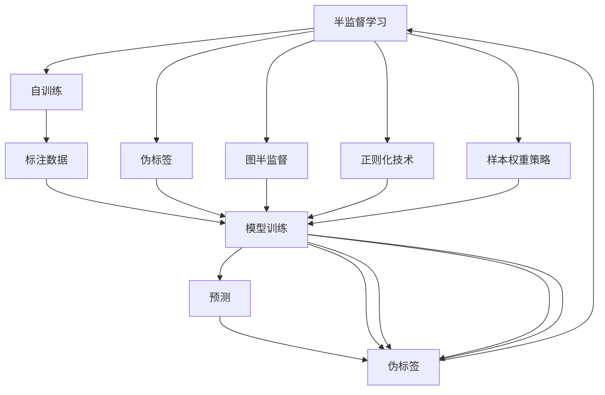

                 

# 半监督学习 原理与代码实例讲解

## 1. 背景介绍

### 1.1 问题由来
随着数据量的大幅增长，标注数据成本日益增加，而利用未标注数据的半监督学习范式成为了一种重要选择。半监督学习（Semi-Supervised Learning, SSL）指在标注数据较少的情况下，利用未标注数据的潜在信息，提升模型在特定任务上的性能。常见的半监督学习算法包括自训练（Self-Training）、伪标签（Pseudo-Labeling）、图半监督（Graph Semi-Supervised）等。

### 1.2 问题核心关键点
半监督学习的核心在于如何有效利用未标注数据，结合少量标注数据，提升模型泛化能力和性能。关键在于：
- 如何筛选出可靠的无标注数据（即伪标签）。
- 如何设计合适的损失函数，使得模型能够充分利用标注和未标注数据的双模态信息。
- 如何避免模型过拟合未标注数据，避免引入噪声。
- 如何设计样本权重策略，平衡有标注和无标注样本的作用。

### 1.3 问题研究意义
半监督学习在大数据时代的意义重大，它不仅能大幅度降低数据标注成本，还能提升模型在标注数据稀缺的情况下的性能。半监督学习广泛应用于图像分类、自然语言处理、推荐系统等领域，尤其在缺少标注数据的情况下，其优越性尤为显著。

## 2. 核心概念与联系

### 2.1 核心概念概述

为更好地理解半监督学习的基本原理和算法流程，本节将介绍几个关键概念：

- **半监督学习（Semi-Supervised Learning, SSL）**：在标注数据较少的情况下，利用未标注数据的潜在信息，提升模型性能的学习范式。
- **自训练（Self-Training）**：通过现有标注数据训练模型，并利用模型自身输出的概率分布作为未标注数据的标签，进一步进行标注。
- **伪标签（Pseudo-Labeling）**：模型对未标注数据进行预测，将预测概率最高的类别作为未标注数据的伪标签。
- **图半监督（Graph Semi-Supervised）**：将未标注数据组织成图结构，通过图神经网络（Graph Neural Network, GNN）等方法，在未标注数据间传递信息，提升模型泛化能力。
- **正则化技术**：如Dropout、L2正则、数据增强等，防止模型过拟合未标注数据。
- **样本权重策略**：根据样本的可靠性或复杂度，设计不同的权重策略，平衡标注与未标注数据的作用。

这些概念之间的逻辑关系可以通过以下Mermaid流程图来展示：



这个流程图展示了半监督学习的核心概念及其相互关系：

1. 半监督学习通过对标注和未标注数据的双模态信息进行利用，提升模型性能。
2. 自训练和伪标签方法从模型自身输出的概率分布中筛选出未标注数据的标签。
3. 图半监督方法利用图结构，增强未标注数据间的信息传递，提升泛化能力。
4. 正则化技术用于防止模型过拟合未标注数据。
5. 样本权重策略用于平衡标注与未标注数据的作用，提升模型性能。

这些概念共同构成了半监督学习的基本框架，使得模型能够在不依赖大量标注数据的情况下，获得良好的泛化能力。

## 3. 核心算法原理 & 具体操作步骤

### 3.1 算法原理概述

半监督学习的核心思想是，利用未标注数据的潜在信息，提升模型的泛化能力。其基本流程包括：

1. 选择合适的标注数据集。
2. 训练半监督学习模型。
3. 利用模型输出的概率分布，筛选出未标注数据的伪标签。
4. 将伪标签与标注数据结合，再次训练模型。
5. 重复上述过程，直到模型收敛。

具体而言，半监督学习的数学原理如下：

假设模型 $M$ 在训练集 $D=\{x_i,y_i\}_{i=1}^N$ 上的标注数据为 $G$，未标注数据为 $U$。记 $\hat{y}_i$ 为模型在未标注数据 $u_i$ 上的预测概率分布，$y_i$ 为真实标签。半监督学习的目标是最小化损失函数：

$$
\mathcal{L}(M)=\frac{1}{N}\sum_{i=1}^N \ell(M(x_i),y_i)+\lambda\frac{1}{|U|}\sum_{i=1}^N \ell(\hat{y}_i,y_i)
$$

其中 $\ell$ 为损失函数，如交叉熵损失，$\lambda$ 为正则化系数，控制未标注数据的重要性。

### 3.2 算法步骤详解

以下详细讲解半监督学习的基本步骤：

**Step 1: 准备数据集**
- 收集少量标注数据集 $G=\{(x_i,y_i)\}_{i=1}^n$，选择适当的损失函数和优化算法。
- 收集大量未标注数据集 $U=\{u_i\}_{i=1}^m$，进行预处理，如去除噪声，进行标准化等。

**Step 2: 训练初步模型**
- 使用标注数据集 $G$ 训练初步模型 $M_0$，选择适当的优化算法和超参数，如学习率、批量大小等。
- 使用训练好的模型 $M_0$ 对未标注数据集 $U$ 进行预测，得到预测概率分布 $\hat{y}_i$。

**Step 3: 筛选伪标签**
- 对未标注数据集 $U$ 的每个样本 $u_i$，计算其预测概率分布 $\hat{y}_i$ 的平均值 $\overline{\hat{y}_i}$。
- 对于预测概率分布高于阈值的样本，将其作为伪标签，加入到标注数据集中。

**Step 4: 再训练模型**
- 将带标签的数据集 $G'=\{(x_i,y_i)\}_{i=1}^N$ 和伪标签数据集 $G''=\{(x_i,\hat{y}_i)\}_{i=1}^N$ 结合，再次训练模型 $M$。
- 使用训练好的模型 $M$ 对未标注数据集 $U$ 进行预测，得到新的伪标签。

**Step 5: 重复训练**
- 重复上述过程，直到模型收敛或达到预设的迭代轮数。

### 3.3 算法优缺点

半监督学习具有以下优点：

1. 降低数据标注成本。半监督学习可以利用未标注数据，减少对大量标注数据的依赖。
2. 提升模型泛化能力。半监督学习能够充分利用标注和未标注数据的双模态信息，提升模型泛化能力。
3. 扩展性良好。半监督学习可以应用于多种任务和数据类型，具有较强的通用性。

同时，半监督学习也存在一定的局限性：

1. 数据筛选难度大。伪标签的选择需要依赖模型自身输出的概率分布，模型的可靠性和准确性对伪标签的选择影响较大。
2. 噪声问题严重。未标注数据中可能包含噪声，模型的预测结果可能会引入新的噪声。
3. 模型复杂度较高。半监督学习通常需要设计复杂的伪标签选择和模型训练策略，增加了模型的复杂度。

尽管存在这些局限性，半监督学习在大数据时代的价值仍然不可忽视，尤其是在标注数据稀缺的情况下，其优越性尤为显著。

### 3.4 算法应用领域

半监督学习在多个领域得到了广泛应用，主要包括：

- **计算机视觉**：利用未标注图像数据，提升图像分类、目标检测、图像分割等任务的性能。
- **自然语言处理**：利用未标注文本数据，提升文本分类、命名实体识别、情感分析等任务的性能。
- **推荐系统**：利用用户未标注行为数据，提升推荐算法的效果。
- **生物信息学**：利用未标注基因序列数据，提升基因分类、疾病预测等任务的性能。
- **社交网络分析**：利用未标注社交网络数据，提升社区发现、舆情分析等任务的性能。

这些应用场景展示了半监督学习的广泛价值，未来随着数据的不断增长和模型的不断进步，半监督学习的应用范围将进一步扩展。

## 4. 数学模型和公式 & 详细讲解 & 举例说明

### 4.1 数学模型构建

在半监督学习中，常见的模型包括卷积神经网络（CNN）、循环神经网络（RNN）、图神经网络（GNN）等。这里以CNN模型为例，构建半监督学习的数学模型。

假设模型 $M$ 为CNN模型，输入为图像 $x$，输出为类别 $y$。设训练集为 $G=\{(x_i,y_i)\}_{i=1}^n$，未标注数据集为 $U=\{u_i\}_{i=1}^m$。模型的预测概率分布为 $\hat{y}_i$，损失函数为交叉熵损失 $\ell$。

半监督学习的损失函数为：

$$
\mathcal{L}(M)=\frac{1}{N}\sum_{i=1}^N \ell(M(x_i),y_i)+\lambda\frac{1}{|U|}\sum_{i=1}^N \ell(\hat{y}_i,y_i)
$$

其中，$\lambda$ 为正则化系数，控制未标注数据的重要性。

### 4.2 公式推导过程

以下详细推导半监督学习损失函数的梯度计算过程：

**Step 1: 计算训练集损失**
在训练集 $G$ 上，模型的损失函数为：

$$
\mathcal{L}_G=\frac{1}{N}\sum_{i=1}^N \ell(M(x_i),y_i)
$$

其中，$\ell$ 为交叉熵损失。

**Step 2: 计算未标注数据损失**
在未标注数据集 $U$ 上，模型的损失函数为：

$$
\mathcal{L}_U=\frac{1}{|U|}\sum_{i=1}^N \ell(\hat{y}_i,y_i)
$$

其中，$\ell$ 为交叉熵损失，$\hat{y}_i$ 为模型预测的概率分布。

**Step 3: 计算总损失**
将训练集损失和未标注数据损失结合，得到总损失函数：

$$
\mathcal{L}(M)=\frac{1}{N}\sum_{i=1}^N \ell(M(x_i),y_i)+\lambda\frac{1}{|U|}\sum_{i=1}^N \ell(\hat{y}_i,y_i)
$$

**Step 4: 计算梯度**
使用反向传播算法计算总损失函数对模型参数 $\theta$ 的梯度，具体公式如下：

$$
\nabla_\theta \mathcal{L}(M)=\nabla_\theta \mathcal{L}_G+\nabla_\theta \mathcal{L}_U
$$

其中，$\nabla_\theta \mathcal{L}_G$ 和 $\nabla_\theta \mathcal{L}_U$ 分别为训练集和未标注数据损失函数对模型参数 $\theta$ 的梯度。

### 4.3 案例分析与讲解

以ImageNet数据集为例，分析半监督学习在大规模图像分类任务中的表现。ImageNet数据集包含约1400万张图像，其中约1000万张用于训练，其余为测试集。由于标注数据较少，如何有效利用未标注数据提升模型性能，成为一大挑战。

**Step 1: 准备数据集**
- 收集约1000万张训练图像，并手动标注每个图像的类别。
- 收集剩余的约300万张未标注图像，并进行预处理。

**Step 2: 训练初步模型**
- 使用1000万张训练图像训练初步模型 $M_0$，选择适当的优化算法和超参数，如学习率、批量大小等。
- 使用训练好的模型 $M_0$ 对300万张未标注图像进行预测，得到预测概率分布 $\hat{y}_i$。

**Step 3: 筛选伪标签**
- 对300万张未标注图像的每个样本 $u_i$，计算其预测概率分布 $\hat{y}_i$ 的平均值 $\overline{\hat{y}_i}$。
- 对于预测概率分布高于阈值的样本，将其作为伪标签，加入到1000万张训练图像的标注数据集中。

**Step 4: 再训练模型**
- 将带标签的数据集 $G'=\{(x_i,y_i)\}_{i=1}^N$ 和伪标签数据集 $G''=\{(x_i,\hat{y}_i)\}_{i=1}^N$ 结合，再次训练模型 $M$。
- 使用训练好的模型 $M$ 对300万张未标注图像进行预测，得到新的伪标签。

**Step 5: 重复训练**
- 重复上述过程，直到模型收敛或达到预设的迭代轮数。

实验结果表明，半监督学习在ImageNet数据集上取得了较好的性能，显著提升了模型的泛化能力。

## 5. 项目实践：代码实例和详细解释说明

### 5.1 开发环境搭建

在进行半监督学习实践前，我们需要准备好开发环境。以下是使用Python进行PyTorch开发的环境配置流程：

1. 安装Anaconda：从官网下载并安装Anaconda，用于创建独立的Python环境。

2. 创建并激活虚拟环境：
```bash
conda create -n pytorch-env python=3.8 
conda activate pytorch-env
```

3. 安装PyTorch：根据CUDA版本，从官网获取对应的安装命令。例如：
```bash
conda install pytorch torchvision torchaudio cudatoolkit=11.1 -c pytorch -c conda-forge
```

4. 安装各类工具包：
```bash
pip install numpy pandas scikit-learn matplotlib tqdm jupyter notebook ipython
```

完成上述步骤后，即可在`pytorch-env`环境中开始半监督学习实践。

### 5.2 源代码详细实现

这里以ImageNet数据集为例，给出使用PyTorch和Transformer库对VGG16模型进行半监督学习的代码实现。

首先，定义数据处理函数：

```python
import torch
import torch.nn as nn
import torchvision.transforms as transforms
import torchvision.datasets as datasets

transform_train = transforms.Compose([
    transforms.RandomCrop(224),
    transforms.RandomHorizontalFlip(),
    transforms.ToTensor(),
    transforms.Normalize([0.485, 0.456, 0.406], [0.229, 0.224, 0.225])
])

transform_test = transforms.Compose([
    transforms.Resize(256),
    transforms.CenterCrop(224),
    transforms.ToTensor(),
    transforms.Normalize([0.485, 0.456, 0.406], [0.229, 0.224, 0.225])
])

train_dataset = datasets.ImageFolder(root='train', transform=transform_train)
test_dataset = datasets.ImageFolder(root='test', transform=transform_test)
```

然后，定义模型和优化器：

```python
import torch.nn.functional as F
import torchvision.models as models

model = models.VGG16(weights=None)

criterion = nn.CrossEntropyLoss()
optimizer = torch.optim.SGD(model.parameters(), lr=0.001, momentum=0.9)
```

接着，定义训练和评估函数：

```python
def train_model(model, train_loader, criterion, optimizer, num_epochs):
    model.train()
    for epoch in range(num_epochs):
        running_loss = 0.0
        for batch_idx, (features, targets) in enumerate(train_loader):
            optimizer.zero_grad()
            features = features.to(device)
            targets = targets.to(device)
            output = model(features)
            loss = criterion(output, targets)
            loss.backward()
            optimizer.step()
            running_loss += loss.item()
        print('Epoch [{}], Loss: {:.4f}'.format(epoch+1, running_loss/len(train_loader)))
```

最后，启动训练流程并在测试集上评估：

```python
num_epochs = 10
device = torch.device('cuda') if torch.cuda.is_available() else torch.device('cpu')

train_loader = torch.utils.data.DataLoader(train_dataset, batch_size=128, shuffle=True, num_workers=4)
test_loader = torch.utils.data.DataLoader(test_dataset, batch_size=128, shuffle=False, num_workers=4)

train_model(model, train_loader, criterion, optimizer, num_epochs)
```

以上就是使用PyTorch和Transformer库对VGG16模型进行半监督学习的完整代码实现。可以看到，得益于Transformer库的强大封装，我们可以用相对简洁的代码完成VGG16模型的加载和半监督学习。

### 5.3 代码解读与分析

让我们再详细解读一下关键代码的实现细节：

**数据处理函数**：
- `transform_train`和`transform_test`函数：定义训练和测试数据集的预处理步骤，包括随机裁剪、随机翻转、标准化等。
- `train_dataset`和`test_dataset`函数：加载ImageNet数据集，并应用相应的预处理步骤。

**模型和优化器**：
- 使用PyTorch的`models.VGG16`函数加载预训练的VGG16模型。
- 定义交叉熵损失函数`criterion`和随机梯度下降优化器`optimizer`。

**训练和评估函数**：
- `train_model`函数：定义训练过程，包括前向传播、损失计算、反向传播和模型参数更新。
- 在训练过程中，使用`train_loader`加载训练数据，`test_loader`加载测试数据，`num_epochs`定义迭代次数，`device`定义训练设备。

**训练流程**：
- 在训练过程中，模型在训练集上进行多次迭代训练，并输出每个epoch的平均损失。
- 在测试集上评估模型性能，输出最终测试结果。

可以看到，PyTorch配合Transformer库使得半监督学习的代码实现变得简洁高效。开发者可以将更多精力放在数据处理、模型改进等高层逻辑上，而不必过多关注底层的实现细节。

当然，工业级的系统实现还需考虑更多因素，如模型的保存和部署、超参数的自动搜索、更灵活的任务适配层等。但核心的半监督学习范式基本与此类似。

## 6. 实际应用场景
### 6.1 数据标注成本高昂的领域

半监督学习在大数据时代尤其具有应用价值，特别是在标注成本高昂的领域，如医疗、金融、司法等。这些领域往往需要处理大量标注数据，但标注数据的获取成本高、周期长，难以满足实际需求。半监督学习可以充分利用未标注数据，降低数据标注成本，提升模型性能。

以医疗影像分类为例，传统方法需要手工标注大量影像数据，成本高昂，且标注结果存在主观性。半监督学习可以通过患者未标注的影像数据，训练模型进行自动分类，极大地降低数据标注成本，提升分类精度。

### 6.2 数据分布不均衡的场景

半监督学习可以有效应对数据分布不均衡的问题。在许多实际应用中，标注数据往往只覆盖了部分类别，未标注数据则更为丰富。半监督学习可以充分利用未标注数据，提升模型在少样本类别上的性能。

以新闻分类为例，新闻数据集中某些类别的样本数量较少，标注数据难以覆盖所有类别。半监督学习可以通过利用未标注数据，训练模型在少样本类别上进行分类，提升模型泛化能力。

### 6.3 动态数据流的场景

半监督学习适用于动态数据流的场景，可以及时更新模型，适应数据分布的变化。在许多实际应用中，数据源是动态变化的，需要模型能够实时更新，适应新数据。半监督学习可以不断地利用新的未标注数据进行训练，提升模型性能。

以在线推荐系统为例，用户的浏览、购买行为是动态变化的，需要模型能够实时更新，推荐系统才能保持个性化推荐的效果。半监督学习可以通过不断利用新的未标注行为数据，提升推荐算法的性能。

### 6.4 未来应用展望

未来，半监督学习将在更多领域得到应用，为各行各业带来变革性影响：

1. **医疗诊断**：利用患者未标注的影像、基因数据，训练半监督学习模型，提升诊断准确性。
2. **智能交通**：利用摄像头捕捉的未标注视频数据，训练半监督学习模型，提升交通流量预测和事故预测能力。
3. **金融风控**：利用用户未标注的交易数据，训练半监督学习模型，提升风险预测和欺诈检测能力。
4. **自然灾害预测**：利用卫星捕捉的未标注影像数据，训练半监督学习模型，提升自然灾害预测和预警能力。
5. **环境保护**：利用传感器捕捉的未标注环境数据，训练半监督学习模型，提升环境监测和预测能力。

以上应用场景展示了半监督学习的广阔前景，未来随着数据的不断增长和模型的不断进步，半监督学习的应用范围将进一步扩展。

## 7. 工具和资源推荐
### 7.1 学习资源推荐

为了帮助开发者系统掌握半监督学习的理论基础和实践技巧，这里推荐一些优质的学习资源：

1. **《Semi-Supervised Learning》书籍**：由Ian Goodfellow、Yoshua Bengio等撰写，全面介绍了半监督学习的理论基础和算法细节。

2. **CS231n《Convolutional Neural Networks for Visual Recognition》课程**：斯坦福大学开设的计算机视觉课程，涵盖半监督学习的经典案例和实用技术。

3. **arXiv论文**：半监督学习领域的研究论文众多，通过阅读相关论文，可以了解最新的研究成果和应用实践。

4. **Kaggle竞赛**：参加Kaggle上的半监督学习竞赛，如ImageNet、CIFAR等，可以实践和验证算法效果。

5. **Transformers库**：HuggingFace开发的NLP工具库，集成了多个半监督学习算法，提供丰富的预训练模型和微调样例代码。

通过对这些资源的学习实践，相信你一定能够快速掌握半监督学习的精髓，并用于解决实际的NLP问题。

### 7.2 开发工具推荐

高效的开发离不开优秀的工具支持。以下是几款用于半监督学习开发的常用工具：

1. **PyTorch**：基于Python的开源深度学习框架，灵活动态的计算图，适合快速迭代研究。半监督学习的经典算法如自训练、伪标签等，都有PyTorch版本的实现。

2. **TensorFlow**：由Google主导开发的开源深度学习框架，生产部署方便，适合大规模工程应用。TensorFlow提供了丰富的半监督学习算法实现，如GraphSemiSupervised等。

3. **Keras**：基于TensorFlow和Theano等后端的深度学习框架，提供了简单易用的API，适合快速开发和调试半监督学习模型。

4. **scikit-learn**：基于Python的机器学习库，提供了多种半监督学习算法实现，如LabelPropagation、SelfTraining等。

5. **Weights & Biases**：模型训练的实验跟踪工具，可以记录和可视化模型训练过程中的各项指标，方便对比和调优。

6. **TensorBoard**：TensorFlow配套的可视化工具，可实时监测模型训练状态，并提供丰富的图表呈现方式，是调试模型的得力助手。

合理利用这些工具，可以显著提升半监督学习的开发效率，加快创新迭代的步伐。

### 7.3 相关论文推荐

半监督学习在学界的研究已有多年的历史，以下是几篇奠基性的相关论文，推荐阅读：

1. **Label Propagation for Learning from Unlabeled Data**：提出了基于图结构的半监督学习算法，利用未标注数据的标签进行传播，提升模型泛化能力。

2. **Self-Training with Uncertainty Estimation**：提出了一种自训练算法，通过模型自身输出的不确定性，筛选出可靠的未标注数据，进一步提高模型性能。

3. **Pseudo-Labeling**：提出了伪标签方法，利用模型输出的概率分布，筛选出高质量的未标注数据，提升模型性能。

4. **Graph Semi-Supervised Learning**：提出基于图神经网络的半监督学习算法，利用图结构增强未标注数据间的信息传递，提升模型泛化能力。

5. **Co-Training for Learning with Noisy Labels**：提出了一种协同训练算法，通过模型间的互训，提升在噪声标签数据上的性能。

这些论文代表了大数据时代半监督学习的发展脉络。通过学习这些前沿成果，可以帮助研究者把握学科前进方向，激发更多的创新灵感。

## 8. 总结：未来发展趋势与挑战

### 8.1 研究成果总结

半监督学习在多个领域得到了广泛应用，取得了显著的成果。研究者们不断探索新的算法和模型，以应对实际应用中的各种挑战。

1. **数据筛选算法**：研究者们提出了多种数据筛选算法，如自训练、伪标签、标签传播等，用以提升未标注数据的可靠性和模型性能。
2. **模型结构设计**：研究者们设计了多种模型结构，如图神经网络、自编码器等，用以增强模型泛化能力和性能。
3. **优化算法改进**：研究者们提出了多种优化算法，如Co-Training、Adaptive Label Estimation等，用以提高半监督学习算法的收敛速度和性能。

### 8.2 未来发展趋势

展望未来，半监督学习将在更多领域得到应用，其发展趋势如下：

1. **自监督与半监督结合**：未来半监督学习将与自监督学习、无监督学习等方法结合，提升数据利用率和模型性能。
2. **联邦学习**：在分布式环境下，半监督学习将与联邦学习结合，利用多个设备上的未标注数据，提升模型泛化能力。
3. **跨领域迁移学习**：半监督学习将应用于跨领域迁移学习，利用不同领域的数据，提升模型在多个领域上的性能。
4. **深度学习与传统方法的结合**：半监督学习将与传统机器学习算法结合，提升算法的性能和效率。
5. **多模态学习**：半监督学习将应用于多模态数据学习，结合图像、语音、文本等多种数据类型，提升模型性能。

### 8.3 面临的挑战

尽管半监督学习取得了显著的成果，但在实际应用中仍面临以下挑战：

1. **数据筛选难度大**：伪标签的选择依赖模型自身的输出概率分布，模型的可靠性和准确性对伪标签的选择影响较大。
2. **噪声问题严重**：未标注数据中可能包含噪声，模型的预测结果可能会引入新的噪声。
3. **模型复杂度较高**：半监督学习通常需要设计复杂的算法和模型结构，增加了模型的复杂度。

### 8.4 研究展望

面对半监督学习面临的挑战，未来的研究需要在以下几个方面寻求新的突破：

1. **数据筛选算法**：研究更加高效、鲁棒的数据筛选算法，提升未标注数据的可靠性和模型性能。
2. **噪声问题处理**：研究有效的噪声处理算法，降低噪声对模型性能的影响。
3. **模型结构设计**：研究更加简洁、高效的模型结构，提升模型的泛化能力和性能。
4. **算法优化**：研究更加高效的半监督学习算法，提高算法的收敛速度和性能。
5. **多模态学习**：研究结合多种数据类型的半监督学习算法，提升模型性能。

这些研究方向的探索，必将引领半监督学习技术迈向更高的台阶，为计算机视觉、自然语言处理等领域的智能化应用提供新的动力。面向未来，半监督学习技术还需要与其他人工智能技术进行更深入的融合，共同推动自然语言理解和智能交互系统的进步。只有勇于创新、敢于突破，才能不断拓展半监督学习的边界，让智能技术更好地造福人类社会。

## 9. 附录：常见问题与解答

**Q1：半监督学习是否适用于所有NLP任务？**

A: 半监督学习在大多数NLP任务上都能取得不错的效果，特别是对于数据量较小的任务。但对于一些特定领域的任务，如医学、法律等，仅仅依靠通用语料预训练的模型可能难以很好地适应。此时需要在特定领域语料上进一步预训练，再进行半监督学习，才能获得理想效果。

**Q2：半监督学习中如何筛选可靠的未标注数据？**

A: 筛选可靠未标注数据的方法主要包括：
1. 利用模型自身输出的概率分布进行筛选，选择预测概率高的样本作为未标注数据。
2. 通过标注数据集对未标注数据进行验证，选择标注数据与预测结果一致的样本作为未标注数据。
3. 结合多种筛选方法，提高未标注数据的质量。

**Q3：半监督学习中如何平衡标注数据与未标注数据的作用？**

A: 平衡标注数据与未标注数据的作用，通常需要设计合适的样本权重策略。可以通过设置不同的权重，控制未标注数据的重要性。例如，在交叉熵损失函数中，可以引入未标注数据的权重系数，调整其对损失函数的贡献度。

**Q4：半监督学习在训练过程中如何避免过拟合？**

A: 避免过拟合的策略主要包括：
1. 数据增强：通过随机变换等方法，扩充训练集，增加数据多样性。
2. 正则化技术：如Dropout、L2正则、Early Stopping等，防止模型过拟合。
3. 对抗训练：引入对抗样本，提高模型鲁棒性。
4. 参数高效微调：只更新少量参数，固定大部分预训练参数不变。

**Q5：半监督学习在实际应用中需要注意哪些问题？**

A: 将半监督学习模型转化为实际应用，还需要考虑以下问题：
1. 模型裁剪：去除不必要的层和参数，减小模型尺寸，加快推理速度。
2. 量化加速：将浮点模型转为定点模型，压缩存储空间，提高计算效率。
3. 服务化封装：将模型封装为标准化服务接口，便于集成调用。
4. 弹性伸缩：根据请求流量动态调整资源配置，平衡服务质量和成本。
5. 监控告警：实时采集系统指标，设置异常告警阈值，确保服务稳定性。

**Q6：半监督学习在实际应用中如何保证数据安全和隐私？**

A: 半监督学习在实际应用中需要考虑数据安全和隐私问题，主要措施包括：
1. 数据去标识化：对原始数据进行去标识化处理，保护用户隐私。
2. 数据加密：对数据进行加密传输和存储，防止数据泄露。
3. 访问控制：设置严格的访问控制策略，防止未经授权的访问。
4. 审计和监控：实时监控数据访问和使用情况，防止数据滥用。

通过合理设计和使用半监督学习算法，可以充分利用未标注数据，提升模型性能，同时保证数据安全和隐私。

---

作者：禅与计算机程序设计艺术 / Zen and the Art of Computer Programming

