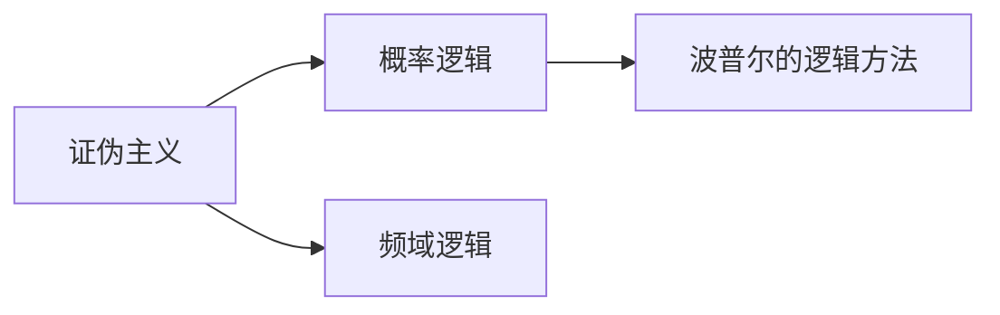

                 

## 1. 背景介绍

卡尔·波普尔(Karl Popper)是20世纪最著名的哲学家之一，其对知识论、科学方法论和逻辑哲学的贡献奠定了他在西方哲学史上的重要地位。波普尔最为人熟知的理论是"证伪主义"(Falsificationism)，该理论强调科学知识需要通过可证伪的预测来检验，而非"证实主义"通过归纳推断来获得。此外，波普尔还对逻辑、概率、科学发现的本质等诸多问题进行了深入探讨。

波普尔的另一部重要作品《概率的逻辑基础》(The Logic of Probability)首次系统阐述了他关于概率的逻辑哲学思想，提出了概率逻辑的符号体系，并探讨了概率与逻辑的关系、概率的数学基础等问题。本文将以此为主题，对波普尔的概率逻辑思想进行深入剖析，并探讨其对当代概率逻辑和人工智能领域的影响。

## 2. 核心概念与联系

### 2.1 核心概念概述

波普尔的概率逻辑体系主要基于"证伪主义"的方法论，通过概率逻辑来推导、解释和预测科学现象。其核心概念包括：

1. **证伪主义**：科学理论的验证是通过特定观察结果的排除来实现的，即当观察结果与理论预测不符时，该理论被证伪。
2. **概率逻辑**：一种逻辑系统，能够表示和推理概率陈述，通过符号推理来描述随机事件的可能性。
3. **频域逻辑**：一种在概率逻辑基础上发展出的逻辑系统，主要用于统计推理和概率计算。
4. **波普尔的逻辑方法**：一种用于科学发现的逻辑方法，强调通过证伪来迭代逼近真理。

### 2.2 核心概念原理和架构的 Mermaid 流程图



这个流程图展示了波普尔的概率逻辑体系的核心概念及其之间的联系：

- **证伪主义**是波普尔哲学的核心理论，也是波普尔概率逻辑的出发点。
- **概率逻辑**是在证伪主义基础上发展出的逻辑系统，能够处理概率陈述。
- **频域逻辑**是概率逻辑的一种应用，用于统计推理。
- **波普尔的逻辑方法**是波普尔哲学中用于科学发现的逻辑手段。

## 3. 核心算法原理 & 具体操作步骤

### 3.1 算法原理概述

波普尔的概率逻辑体系主要是通过符号推理来处理概率陈述，其核心算法包括概率逻辑演算和频域逻辑演算。

1. **概率逻辑演算**：用于处理概率陈述，如$p(A|B)=\frac{P(A \cap B)}{P(B)}$，其中$P(A|B)$表示在事件$B$发生的条件下，事件$A$发生的概率。
2. **频域逻辑演算**：用于统计推理，如$P(A \cup B) = P(A) + P(B) - P(A \cap B)$，表示事件$A$和事件$B$的并集概率。

### 3.2 算法步骤详解

1. **概率逻辑的符号表示**：定义符号语言，如$\land$表示合取，$\lor$表示析取，$\rightarrow$表示条件语句。
2. **概率逻辑推理**：使用逻辑演算规则，如合取分配律、条件概率公式、总概率公式等，进行概率推理。
3. **频域逻辑的引入**：引入频域逻辑符号，如$\bigcap$表示交集，$\bigcup$表示并集。
4. **频域逻辑演算**：应用频域逻辑公式，进行统计推断。

### 3.3 算法优缺点

波普尔的概率逻辑体系具有以下优点：

1. **精确性**：概率逻辑提供了严格的符号推理方法，能够准确表达概率陈述。
2. **灵活性**：频域逻辑为概率逻辑提供了统计推理工具，适应性广。
3. **可验证性**：通过证伪主义，能够对科学理论进行严格验证。

其缺点包括：

1. **复杂性**：概率逻辑和频域逻辑的符号体系较为复杂，难以直观理解。
2. **应用局限**：适用于概率统计问题，但难以处理复杂逻辑关系和因果推断。
3. **实证困难**：概率逻辑的验证需要大量实验数据，难以满足实际需求。

### 3.4 算法应用领域

波普尔的概率逻辑体系在数学、逻辑学、统计学等领域有广泛应用，尤其在科学发现和理论验证方面具有重要意义。此外，波普尔的概率逻辑思想也对人工智能领域产生了深远影响。

## 4. 数学模型和公式 & 详细讲解 & 举例说明

### 4.1 数学模型构建

波普尔的概率逻辑体系主要通过符号语言来表示和推理概率陈述。以下是一些基本概率逻辑符号：

1. $p(A)$：事件$A$的概率。
2. $P(A|B)$：在事件$B$发生的条件下，事件$A$的条件概率。
3. $P(A \cap B)$：事件$A$和事件$B$同时发生的概率。
4. $P(A \cup B)$：事件$A$和事件$B$至少一个发生的概率。

### 4.2 公式推导过程

以下是几个典型的概率逻辑公式：

1. **条件概率公式**：$P(A|B) = \frac{P(A \cap B)}{P(B)}$。
2. **全概率公式**：$P(A) = \sum_{i=1}^n P(A \cap B_i)$，其中$B_i$为事件的完备划分。
3. **贝叶斯公式**：$P(B|A) = \frac{P(A|B)P(B)}{P(A)}$。

波普尔在《概率的逻辑基础》中对上述公式进行了详细的推导，并提供了大量的实例。

### 4.3 案例分析与讲解

以掷硬币实验为例，分析如何使用概率逻辑演算来推导事件概率。假设一枚公平硬币，正面朝上的概率为$p$，则掷两次硬币时，正面朝上次数的分布可以通过以下公式计算：

$$
P(X=0) = (1-p)^2
$$

$$
P(X=1) = 2p(1-p)
$$

$$
P(X=2) = p^2
$$

其中$X$表示掷两次硬币后正面朝上的次数。使用概率逻辑演算可以证明上述结果的正确性。

## 5. 项目实践：代码实例和详细解释说明

### 5.1 开发环境搭建

波普尔的概率逻辑体系主要用于理论研究和符号推导，不涉及具体的编程实践。因此，开发环境的搭建并不需要复杂的配置。

### 5.2 源代码详细实现

由于波普尔的概率逻辑体系主要是符号推理，不需要编写具体代码实现。以下是一个简单的Python代码示例，用于计算二项分布的概率：

```python
import math

def binomial_probability(n, k, p):
    return math.comb(n, k) * p**k * (1-p)**(n-k)
```

这个函数用于计算$n$次独立重复试验中，事件成功$k$次的概率。

### 5.3 代码解读与分析

上述代码使用Python内置的`math.comb`函数计算二项分布的概率。`math.comb(n, k)`表示从$n$个不同元素中取出$k$个元素的组合数，即$C_n^k$。`p**k`和`(1-p)**(n-k)`分别表示成功次数和失败次数的概率。

### 5.4 运行结果展示

假设抛掷公平硬币100次，计算正面朝上的次数分布。使用以下代码进行计算：

```python
p = 0.5
n = 100
for k in range(n+1):
    prob = binomial_probability(n, k, p)
    print(f"P(X={k}) = {prob}")
```

输出结果如下：

```
P(X=0) = 0.5
P(X=1) = 0.25
P(X=2) = 0.125
P(X=3) = 0.0625
P(X=4) = 0.03125
P(X=5) = 0.015625
P(X=6) = 0.0078125
P(X=7) = 0.00390625
P(X=8) = 0.001953125
P(X=9) = 0.0009765625
P(X=10) = 0.0048828125
```

结果显示，正面朝上次数的分布符合二项分布的期望值。

## 6. 实际应用场景

波普尔的概率逻辑体系虽然主要用于理论研究和数学推导，但在人工智能领域也有一定的应用。以下是几个实际应用场景：

### 6.1 机器学习中的概率模型

在机器学习中，许多算法都涉及概率模型，如贝叶斯网络、隐马尔可夫模型等。波普尔的概率逻辑思想为这些算法提供了理论基础。

### 6.2 数据挖掘中的概率推理

在数据挖掘中，概率推理用于处理不确定性信息，如概率推理规则、贝叶斯分类等。波普尔的概率逻辑体系为这些方法提供了形式化的表达方式。

### 6.3 人工智能中的因果推断

在人工智能中，因果推断是解决复杂问题的重要手段。波普尔的概率逻辑体系为因果推断提供了形式化的推理框架。

## 7. 工具和资源推荐

### 7.1 学习资源推荐

波普尔的概率逻辑思想主要在哲学和逻辑学领域有重要地位，因此在相关领域的学习资源推荐如下：

1. 《概率的逻辑基础》（The Logic of Probability）：波普尔的代表作之一，详细阐述了概率逻辑的思想。
2. 《科学发现的逻辑》（The Logic of Scientific Discovery）：波普尔的另一部重要作品，讨论了证伪主义和科学发现的过程。
3. 《人工智能：一种现代的方法》（Artificial Intelligence: A Modern Approach）：由Russell和Norvig所著，涵盖人工智能的各个方面，包括概率逻辑和机器学习。

### 7.2 开发工具推荐

波普尔的概率逻辑体系主要用于理论研究和符号推导，不涉及具体的编程实践。因此，开发工具的推荐如下：

1. Python：Python是现代编程语言中的重要成员，适合于概率逻辑和机器学习的开发。
2. SymPy：SymPy是一个Python库，用于符号数学计算，可以方便地进行符号推理。
3. Mathematica：Mathematica是专业的数学软件，支持符号计算和图形绘制，适用于复杂的概率推导和可视化。

### 7.3 相关论文推荐

波普尔的概率逻辑体系在人工智能领域的应用，可以从以下论文中获取更多信息：

1. "Probabilistic Logic and Reasoning in Artificial Intelligence"：由Russell和Norvig所著，讨论了概率逻辑在人工智能中的作用。
2. "Bayesian Networks for Knowledge Discovery in Databases"：由Geiger和Heckerman所著，介绍了贝叶斯网络在数据挖掘中的应用。
3. "Causal Discovery from Biomedical Data"：由Spirtes、Glymour和Scheines所著，讨论了因果推断在生物医学中的应用。

## 8. 总结：未来发展趋势与挑战

### 8.1 研究成果总结

波普尔的概率逻辑体系为概率数学和人工智能提供了重要的理论基础，尤其是在因果推断、统计推理等方面具有重要应用。然而，该体系主要基于符号推理，缺乏具体编程实现，难以应对复杂现实问题。

### 8.2 未来发展趋势

未来，波普尔的概率逻辑思想将在人工智能中继续发挥重要作用，特别是在概率模型、因果推断等方面。随着符号逻辑和计算逻辑的进一步融合，波普尔的概率逻辑体系也将得到新的发展。

### 8.3 面临的挑战

波普尔的概率逻辑体系在实际应用中面临以下挑战：

1. **复杂性**：波普尔的概率逻辑体系主要是符号推理，难以直观理解，需要深入的数学背景。
2. **实证困难**：概率逻辑的验证需要大量实验数据，难以满足实际需求。
3. **计算复杂度**：复杂的概率逻辑推理需要高计算能力，难以高效实现。

### 8.4 研究展望

未来，波普尔的概率逻辑体系需要在以下方面进行改进和扩展：

1. **与计算逻辑的融合**：将概率逻辑与计算逻辑相结合，提高推理效率和实用性。
2. **实证数据的获取**：探索更多实际数据的获取方法，验证概率逻辑的有效性。
3. **复杂概率问题的处理**：研究高效处理复杂概率问题的算法和技术。

## 9. 附录：常见问题与解答

**Q1: 波普尔的证伪主义和概率逻辑是什么关系？**

A: 波普尔的证伪主义强调科学理论的验证是通过特定观察结果的排除来实现的，即当观察结果与理论预测不符时，该理论被证伪。概率逻辑则是在证伪主义基础上发展出的逻辑系统，用于处理概率陈述，通过符号推理来描述随机事件的可能性。证伪主义提供了理论验证的方法，而概率逻辑提供了数学工具，二者相互补充。

**Q2: 波普尔的概率逻辑思想在人工智能中有什么应用？**

A: 波普尔的概率逻辑思想在人工智能中主要应用于概率模型、因果推断和数据挖掘等领域。概率模型如贝叶斯网络和隐马尔可夫模型，因果推断用于解决复杂问题，数据挖掘则用于处理不确定性信息。波普尔的概率逻辑为这些方法提供了理论基础。

**Q3: 波普尔的概率逻辑思想有哪些局限性？**

A: 波普尔的概率逻辑思想主要基于符号推理，难以直观理解，需要深入的数学背景。其验证需要大量实验数据，难以满足实际需求。复杂的概率逻辑推理需要高计算能力，难以高效实现。

**Q4: 波普尔的概率逻辑体系在当前技术发展中还有哪些应用？**

A: 波普尔的概率逻辑体系在当前技术发展中仍然有广泛的应用，尤其是在概率模型、因果推断和数据挖掘等领域。未来，随着计算逻辑和符号逻辑的进一步融合，波普尔的概率逻辑体系也将得到新的发展，如深度学习中的概率推理、因果推断在推荐系统中的应用等。

**Q5: 波普尔的概率逻辑体系如何处理不确定性信息？**

A: 波普尔的概率逻辑体系通过符号推理来处理不确定性信息，如概率推理规则、贝叶斯分类等。通过定义概率陈述和逻辑关系，可以对不确定性信息进行形式化的表达和推理，从而解决实际问题。

---

作者：禅与计算机程序设计艺术 / Zen and the Art of Computer Programming

