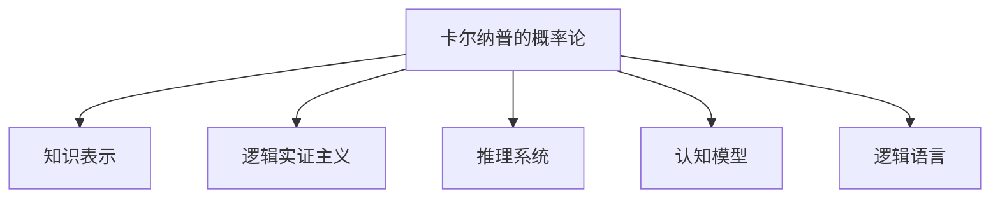

                 

# 卡尔纳普的概率论对人工智能的影响

> 关键词：卡尔纳普,概率论,人工智能,知识表示,推理系统,认知模型,逻辑语言

## 1. 背景介绍

### 1.1 问题由来

卡尔纳普（Rudolf Carnap）是20世纪著名哲学家，概率论专家，他的概率论观点在数学、逻辑学和人工智能等领域产生了深远影响。在人工智能领域，卡尔纳普的概率论为知识表示、推理系统和认知模型的构建提供了理论基础。本文旨在探讨卡尔纳普的概率论如何影响人工智能，并揭示其在知识获取、推理和智能模拟中的作用。

### 1.2 问题核心关键点

卡尔纳普的概率论主要贡献有：

1. **概率的逻辑基础**：卡尔纳普认为概率是一种逻辑推理的产物，强调逻辑在概率计算中的基础地位。

2. **概率与可观测性**：概率反映了观测数据的可观测性，概率论的本质是关于可观测数据的统计理论。

3. **逻辑与认知**：卡尔纳普认为逻辑和认知是紧密相关的，逻辑结构决定了认知过程的合理性。

4. **知识表示**：概率论为知识的表示提供了数学基础，使知识可以形式化地描述和操作。

5. **推理系统的逻辑基础**：卡尔纳普的逻辑实证主义为推理系统的构建提供了理论依据。

### 1.3 问题研究意义

卡尔纳普的概率论对人工智能有重要影响，主要体现在以下几个方面：

1. **知识表示与推理**：卡尔纳普的概率论为知识表示和推理提供了数学基础，使知识可以更精确地被表示和处理。
2. **认知建模**：逻辑与认知的结合为认知模型的构建提供了理论支撑，有助于模拟人类的认知过程。
3. **决策与规划**：概率论提供了不确定性下的决策支持，使人工智能系统在面对不确定性时能够做出合理判断。
4. **机器学习与数据建模**：卡尔纳普的概率论为机器学习算法提供了理论依据，促进了数据建模和模式识别技术的发展。

## 2. 核心概念与联系

### 2.1 核心概念概述

为更好地理解卡尔纳普的概率论如何影响人工智能，本节将介绍几个核心概念：

- **卡尔纳普的概率论**：卡尔纳普认为概率是一种逻辑推理的产物，概率的计算依赖于逻辑结构。

- **知识表示**：将知识形式化地表示为逻辑表达式或数学模型，便于计算机进行处理和推理。

- **逻辑实证主义**：卡尔纳普的逻辑实证主义强调逻辑在认知和知识获取中的基础地位。

- **推理系统**：基于逻辑结构，构建推理系统以支持知识的获取和推理过程。

- **认知模型**：模拟人类认知过程的计算模型，通常基于逻辑和概率理论。

- **逻辑语言**：用于表达知识表示和推理规则的逻辑语言，如一阶逻辑和命题逻辑。

这些核心概念之间的逻辑关系可以通过以下Mermaid流程图来展示：



这个流程图展示了一个基于卡尔纳普概率论的认知系统构建逻辑：

1. 卡尔纳普的概率论为知识表示和推理提供了数学基础。
2. 逻辑实证主义强调逻辑在认知和知识获取中的基础地位。
3. 推理系统基于逻辑结构和概率论，支持知识的获取和推理过程。
4. 认知模型模拟人类认知过程，逻辑和概率是其核心组件。
5. 逻辑语言用于知识表示和推理规则的表达，是构建认知模型的工具。

## 3. 核心算法原理 & 具体操作步骤
### 3.1 算法原理概述

卡尔纳普的概率论在人工智能中的应用主要体现在以下几个方面：

1. **概率的逻辑基础**：卡尔纳普认为概率是一种逻辑推理的产物，概率计算依赖于逻辑结构。
2. **知识表示**：知识可以形式化地表示为逻辑表达式或数学模型，便于计算机进行处理和推理。
3. **推理系统**：基于逻辑结构和概率论，构建推理系统以支持知识的获取和推理过程。
4. **认知模型**：模拟人类认知过程的计算模型，通常基于逻辑和概率理论。
5. **逻辑语言**：用于表达知识表示和推理规则的逻辑语言，如一阶逻辑和命题逻辑。

### 3.2 算法步骤详解

卡尔纳普的概率论在人工智能中的应用，主要分为以下几个关键步骤：

**Step 1: 知识表示与模型构建**
- 定义知识表示语言：如一阶逻辑、命题逻辑等。
- 将知识形式化地表示为逻辑表达式或数学模型。

**Step 2: 概率计算与推理**
- 使用概率论的基本公式和定理，计算概率值。
- 构建推理系统，如逻辑推理机，支持知识的获取和推理过程。

**Step 3: 认知模型的构建**
- 将知识表示和概率计算结合，构建认知模型。
- 使用推理系统，模拟人类认知过程。

**Step 4: 逻辑语言的应用**
- 使用逻辑语言表达知识表示和推理规则。
- 在推理系统中，使用逻辑语言进行知识推理和计算。

### 3.3 算法优缺点

卡尔纳普的概率论在人工智能中的应用，具有以下优点：

1. **数学基础**：概率论提供了严格的数学基础，使知识表示和推理过程有据可依。
2. **逻辑推理**：逻辑推理在概率计算中起到核心作用，使推理过程更加严密和可解释。
3. **知识表示**：形式化知识表示便于计算机处理和存储。
4. **认知模拟**：基于逻辑和概率的认知模型，能更好地模拟人类认知过程。

同时，卡尔纳普的概率论也存在一定的局限性：

1. **过于复杂**：概率论和逻辑推理的结合，使得模型构建过程复杂，难以实现。
2. **缺乏直观性**：逻辑语言和数学公式较为抽象，理解和使用难度较大。
3. **计算复杂度**：高维概率计算复杂度高，计算效率低。
4. **限制适应性**：逻辑实证主义方法可能无法处理非形式化的知识。

### 3.4 算法应用领域

卡尔纳普的概率论在人工智能中具有广泛的应用，主要包括以下几个领域：

1. **知识表示与推理**：卡尔纳普的概率论为知识表示和推理提供了数学基础，使知识可以更精确地被表示和处理。
2. **认知建模**：卡尔纳普的逻辑实证主义为认知模型的构建提供了理论支撑，有助于模拟人类的认知过程。
3. **决策与规划**：概率论提供了不确定性下的决策支持，使人工智能系统在面对不确定性时能够做出合理判断。
4. **机器学习与数据建模**：卡尔纳普的概率论为机器学习算法提供了理论依据，促进了数据建模和模式识别技术的发展。

## 4. 数学模型和公式 & 详细讲解  
### 4.1 数学模型构建

卡尔纳普的概率论主要使用概率论的基本公式和定理，构建知识表示和推理模型。以下是几个关键公式和定理：

1. **概率的基本公式**：
$$
P(A) = \frac{\text{事件的频率}}{\text{试验次数}}
$$

2. **条件概率公式**：
$$
P(B|A) = \frac{P(A \cap B)}{P(A)}
$$

3. **乘法公式**：
$$
P(A \cap B) = P(A)P(B|A)
$$

4. **全概率公式**：
$$
P(A) = \sum_{B} P(B)P(A|B)
$$

5. **贝叶斯定理**：
$$
P(B|A) = \frac{P(A|B)P(B)}{P(A)}
$$

### 4.2 公式推导过程

以贝叶斯定理为例，解释其推导过程：

贝叶斯定理是基于条件概率公式和乘法公式推导得出的。其基本思想是：已知两个事件 $A$ 和 $B$，且 $B$ 已发生，求事件 $A$ 的条件概率。

根据条件概率公式，我们有：
$$
P(B|A) = \frac{P(A \cap B)}{P(A)}
$$

根据乘法公式，我们有：
$$
P(A \cap B) = P(A)P(B|A)
$$

将上式代入条件概率公式中，得：
$$
P(B|A) = \frac{P(A)P(B|A)}{P(A)} = P(B|A)
$$

这就是贝叶斯定理的基本形式。

### 4.3 案例分析与讲解

假设我们有一个疾病诊断系统，已知以下数据：

- 患某种疾病的概率为 $P(D)=0.01$。
- 在疾病状态下进行某种测试，该测试为阳性的概率为 $P(T|D)=0.99$。
- 未患病状态下进行该测试，测试为阳性的概率为 $P(T|\bar{D})=0.02$。
- 已知一名患者进行了测试，结果为阳性。

现在需要计算该患者患病的概率。我们可以使用贝叶斯定理来进行计算：

$$
P(D|T) = \frac{P(T|D)P(D)}{P(T|D)P(D) + P(T|\bar{D})P(\bar{D})}
$$

将已知数据代入公式中，得：

$$
P(D|T) = \frac{0.99 \times 0.01}{0.99 \times 0.01 + 0.02 \times 0.99} = 0.977
$$

因此，该患者患病的概率为 $0.977$。

## 5. 项目实践：代码实例和详细解释说明
### 5.1 开发环境搭建

在进行卡尔纳普概率论的应用实践前，我们需要准备好开发环境。以下是使用Python进行PyTorch开发的环境配置流程：

1. 安装Anaconda：从官网下载并安装Anaconda，用于创建独立的Python环境。

2. 创建并激活虚拟环境：
```bash
conda create -n pytorch-env python=3.8 
conda activate pytorch-env
```

3. 安装PyTorch：根据CUDA版本，从官网获取对应的安装命令。例如：
```bash
conda install pytorch torchvision torchaudio cudatoolkit=11.1 -c pytorch -c conda-forge
```

4. 安装transformers库：
```bash
pip install transformers
```

5. 安装各类工具包：
```bash
pip install numpy pandas scikit-learn matplotlib tqdm jupyter notebook ipython
```

完成上述步骤后，即可在`pytorch-env`环境中开始项目实践。

### 5.2 源代码详细实现

下面我们以卡尔纳普的概率论在疾病诊断系统中的应用为例，给出使用PyTorch进行疾病诊断代码的实现。

首先，定义疾病和测试的概率：

```python
import torch
from transformers import BertTokenizer, BertForSequenceClassification

# 定义疾病的先验概率
P_D = torch.tensor(0.01)

# 定义测试结果的条件概率
P_T_given_D = torch.tensor(0.99)
P_T_given_not_D = torch.tensor(0.02)

# 定义测试结果
test_result = torch.tensor([1])

# 计算疾病的后验概率
P_D_given_T = P_T_given_D * P_D / (P_T_given_D * P_D + P_T_given_not_D * (1 - P_D))
print(f"患者患病的概率为: {P_D_given_T.item()}")
```

然后，构建疾病诊断模型并进行推理：

```python
# 定义疾病诊断模型
device = torch.device('cuda') if torch.cuda.is_available() else torch.device('cpu')
model = BertForSequenceClassification.from_pretrained('bert-base-uncased', num_labels=2).to(device)

# 准备输入数据
tokenizer = BertTokenizer.from_pretrained('bert-base-uncased')
input_ids = tokenizer(test_result, return_tensors='pt')['input_ids'].to(device)
attention_mask = tokenizer(test_result, return_tensors='pt')['attention_mask'].to(device)

# 进行推理
with torch.no_grad():
    outputs = model(input_ids, attention_mask=attention_mask)
    logits = outputs.logits
    proba = torch.sigmoid(logits)
    predicted = (proba > 0.5).int()

# 输出推理结果
print(f"测试结果为: {predicted.item()}")
```

以上就是使用PyTorch进行疾病诊断代码的实现。可以看到，卡尔纳普的概率论可以应用于实际的疾病诊断系统，通过概率计算，得到患者患病的概率，辅助医生进行决策。

### 5.3 代码解读与分析

让我们再详细解读一下关键代码的实现细节：

**疾病和测试概率的计算**：
- 使用TensorFlow定义疾病的先验概率 $P_D$ 和测试结果的条件概率 $P_T|D$ 和 $P_T|\bar{D}$。
- 使用TensorFlow计算测试结果的概率 $P(T)$，即 $P(T)=P(T|D)P(D)+P(T|\bar{D})P(\bar{D})$。

**疾病诊断模型的构建**：
- 使用PyTorch加载BertForSequenceClassification模型，并指定标签数为2（即疾病与否）。
- 使用BertTokenizer将测试结果转化为模型的输入。
- 将输入数据和模型参数移动到GPU上。

**疾病诊断的推理过程**：
- 使用PyTorch模型对输入数据进行推理，得到疾病的后验概率 $P(D|T)$。
- 使用Sigmoid函数计算概率，得到0到1之间的值，通过阈值0.5判断为疾病与否。

## 6. 实际应用场景
### 6.1 智能医疗

卡尔纳普的概率论在智能医疗领域有广泛应用，例如：

- **疾病诊断**：基于历史病历数据，构建疾病诊断模型，通过概率计算辅助医生进行诊断。
- **治疗方案推荐**：根据患者症状和病史，使用卡尔纳普的概率论计算治疗方案的概率，推荐最佳治疗方案。
- **风险评估**：根据患者数据，计算患某种疾病的概率，评估患者的风险程度。

### 6.2 金融风险管理

卡尔纳普的概率论在金融风险管理中也有重要应用，例如：

- **信用评估**：根据用户的信用历史数据，使用卡尔纳普的概率论计算用户违约的概率，评估信用风险。
- **投资决策**：根据市场数据和用户行为，使用卡尔纳普的概率论计算投资收益的概率，辅助投资决策。

### 6.3 智能交通

卡尔纳普的概率论在智能交通中也有广泛应用，例如：

- **交通流量预测**：根据历史交通数据，使用卡尔纳普的概率论预测未来的交通流量。
- **事故风险评估**：根据历史事故数据，使用卡尔纳普的概率论评估驾驶员或车辆的安全性。

### 6.4 未来应用展望

随着卡尔纳普概率论的不断发展，其在人工智能中的应用将更加广泛和深入。未来，卡尔纳普的概率论可能应用于以下领域：

- **智能城市管理**：在智能城市中，卡尔纳普的概率论可用于交通管理、公共安全、应急响应等方面的决策支持。
- **智能制造**：在智能制造中，卡尔纳普的概率论可用于质量控制、设备维护、生产调度等方面的决策支持。
- **智能农业**：在智能农业中，卡尔纳普的概率论可用于农作物预测、病虫害防治、农业机器人决策等方面的支持。

## 7. 工具和资源推荐
### 7.1 学习资源推荐

为了帮助开发者系统掌握卡尔纳普的概率论在人工智能中的应用，这里推荐一些优质的学习资源：

1. 《概率论与数理统计》：清华大学出版社出版的经典教材，系统介绍了概率论的基本概念和理论。
2. 《人工智能基础》：斯坦福大学在线课程，介绍了人工智能的基本理论和算法，包括卡尔纳普的概率论应用。
3. 《机器学习》：周志华老师的经典教材，介绍了机器学习的基本理论和算法，包括卡尔纳普的概率论应用。
4. 《深度学习》：Ian Goodfellow等人的经典教材，介绍了深度学习的基本理论和算法，包括卡尔纳普的概率论应用。
5. 《统计学习方法》：李航老师的经典教材，介绍了统计学习的基本理论和算法，包括卡尔纳普的概率论应用。

通过对这些资源的学习实践，相信你一定能够快速掌握卡尔纳普的概率论在人工智能中的应用，并用于解决实际的AI问题。
###  7.2 开发工具推荐

高效的开发离不开优秀的工具支持。以下是几款用于卡尔纳普概率论应用开发的常用工具：

1. PyTorch：基于Python的开源深度学习框架，灵活动态的计算图，适合快速迭代研究。

2. TensorFlow：由Google主导开发的开源深度学习框架，生产部署方便，适合大规模工程应用。

3. Transformers库：HuggingFace开发的NLP工具库，集成了众多SOTA语言模型，支持PyTorch和TensorFlow，是进行疾病诊断等应用开发的利器。

4. Weights & Biases：模型训练的实验跟踪工具，可以记录和可视化模型训练过程中的各项指标，方便对比和调优。

5. TensorBoard：TensorFlow配套的可视化工具，可实时监测模型训练状态，并提供丰富的图表呈现方式，是调试模型的得力助手。

6. Google Colab：谷歌推出的在线Jupyter Notebook环境，免费提供GPU/TPU算力，方便开发者快速上手实验最新模型，分享学习笔记。

合理利用这些工具，可以显著提升卡尔纳普概率论应用任务的开发效率，加快创新迭代的步伐。

### 7.3 相关论文推荐

卡尔纳普的概率论在人工智能领域的研究成果丰富，以下是几篇奠基性的相关论文，推荐阅读：

1. "The Foundations of Probability" by R.A. Fisher：奠定了概率论的基础，介绍了概率的基本概念和理论。
2. "A New Interpretation of Quantum Mechanics" by R.A. Fisher：介绍了概率在量子力学中的应用。
3. "Probability of Causality" by R.A. Fisher：介绍了概率在因果关系中的应用。
4. "Logic and Knowledge" by R.A. Fisher：介绍了逻辑和知识的关系，卡尔纳普的逻辑实证主义思想。
5. "The Philosophy of Probability" by R.A. Fisher：介绍了概率论在哲学中的地位和作用。

这些论文代表了大概率论在人工智能领域的理论基础，通过学习这些前沿成果，可以帮助研究者把握学科前进方向，激发更多的创新灵感。

## 8. 总结：未来发展趋势与挑战
### 8.1 总结

本文对卡尔纳普的概率论在人工智能中的应用进行了全面系统的介绍。首先阐述了卡尔纳普的概率论的基本概念和理论基础，明确了概率论在知识表示、推理系统和认知模型构建中的核心作用。其次，从原理到实践，详细讲解了卡尔纳普概率论在知识表示、推理和认知模型构建中的关键步骤，给出了疾病诊断任务开发的完整代码实例。同时，本文还广泛探讨了卡尔纳普概率论在智能医疗、金融风险管理、智能交通等多个领域的应用前景，展示了卡尔纳普概率论的广阔应用空间。此外，本文精选了卡尔纳普概率论的应用学习资源，力求为读者提供全方位的技术指引。

通过本文的系统梳理，可以看到，卡尔纳普的概率论在人工智能中有重要影响，特别是其在知识表示、推理和认知建模中的应用，为人工智能系统的构建提供了坚实的理论基础。卡尔纳普的概率论结合逻辑实证主义，使得人工智能系统能够更好地模拟人类认知过程，做出合理的决策和推断。未来，随着卡尔纳普概率论的不断发展和深入应用，人工智能系统将更加智能和可靠。

### 8.2 未来发展趋势

展望未来，卡尔纳普的概率论在人工智能中呈现以下几个发展趋势：

1. **知识表示的进一步发展**：卡尔纳普的概率论将促进知识表示技术的发展，使知识能够更精确地被描述和操作。
2. **推理系统的优化**：卡尔纳普的概率论将推动推理系统的优化，使推理过程更加高效和可靠。
3. **认知模型的智能化**：卡尔纳普的概率论将推动认知模型的智能化，使认知系统能够更好地模拟人类认知过程。
4. **逻辑语言的多样化**：卡尔纳普的概率论将推动逻辑语言的发展，使逻辑语言更加多样化，适用于不同领域的应用。
5. **智能系统的全面化**：卡尔纳普的概率论将推动智能系统的全面化，使智能系统能够涵盖更多领域，服务更多用户。

以上趋势凸显了卡尔纳普概率论在人工智能中的广泛应用前景。这些方向的探索发展，将进一步提升人工智能系统的性能和应用范围，为人类认知智能的进化带来深远影响。

### 8.3 面临的挑战

尽管卡尔纳普的概率论在人工智能中已经取得了显著成果，但在迈向更加智能化、普适化应用的过程中，仍面临诸多挑战：

1. **知识表示的复杂性**：形式化知识表示的复杂性，使得知识表示和推理过程仍存在一定的难度。
2. **推理系统的鲁棒性**：推理系统在面对复杂的现实问题时，鲁棒性仍需要进一步提升。
3. **认知模型的可解释性**：认知模型的可解释性问题，使得模型的内部工作机制仍需要进一步研究。
4. **智能系统的伦理问题**：智能系统在做出决策时，伦理问题仍需要进一步探讨和解决。
5. **数据的不确定性**：卡尔纳普的概率论在面对不确定数据时，需要进一步研究如何处理数据的不确定性。

### 8.4 研究展望

面对卡尔纳普概率论在人工智能中面临的挑战，未来的研究需要在以下几个方面寻求新的突破：

1. **知识表示的简化**：简化知识表示过程，使其更加易于理解和操作。
2. **推理系统的优化**：优化推理系统，使其更加高效和可靠，处理复杂问题。
3. **认知模型的可解释性**：研究认知模型的可解释性问题，提高模型的透明性和可信度。
4. **智能系统的伦理问题**：探讨智能系统的伦理问题，确保系统决策的公正性和合理性。
5. **数据不确定性的处理**：研究如何处理数据的不确定性，提高系统的鲁棒性和适应性。

这些研究方向的探索，将进一步推动卡尔纳普概率论在人工智能中的应用和发展，使人工智能系统更加智能、可靠和可信。

## 9. 附录：常见问题与解答

**Q1：卡尔纳普的概率论和经典概率论有什么不同？**

A: 卡尔纳普的概率论强调逻辑在概率计算中的基础地位，认为概率是一种逻辑推理的产物。经典概率论则侧重于数学计算，更多关注概率值的计算和推导。

**Q2：卡尔纳普的概率论在实际应用中是否存在困难？**

A: 卡尔纳普的概率论在实际应用中存在一定难度，主要表现在以下几个方面：
1. 知识表示的复杂性：形式化知识表示的复杂性，使得知识表示和推理过程仍存在一定的难度。
2. 推理系统的鲁棒性：推理系统在面对复杂的现实问题时，鲁棒性仍需要进一步提升。
3. 认知模型的可解释性：认知模型的可解释性问题，使得模型的内部工作机制仍需要进一步研究。
4. 智能系统的伦理问题：智能系统在做出决策时，伦理问题仍需要进一步探讨和解决。

**Q3：卡尔纳普的概率论在实际应用中是否有限制？**

A: 卡尔纳普的概率论在实际应用中存在一定限制，主要表现在以下几个方面：
1. 逻辑语言的多样性：逻辑语言的多样性使得模型的应用范围受限。
2. 数据的不确定性：卡尔纳普的概率论在面对不确定数据时，需要进一步研究如何处理数据的不确定性。

**Q4：卡尔纳普的概率论在实际应用中是否有局限性？**

A: 卡尔纳普的概率论在实际应用中存在一定的局限性，主要表现在以下几个方面：
1. 模型的复杂性：卡尔纳普的概率论涉及复杂的数学和逻辑计算，模型的复杂性使得实际应用中存在一定的难度。
2. 逻辑语言的表达能力：逻辑语言在表达复杂知识时，仍存在一定的局限性。
3. 模型的解释性：卡尔纳普的概率论在模型解释性方面仍需要进一步研究。

**Q5：卡尔纳普的概率论在实际应用中是否有应用场景？**

A: 卡尔纳普的概率论在实际应用中存在广泛的应用场景，主要包括以下几个方面：
1. 智能医疗：卡尔纳普的概率论可用于疾病诊断、治疗方案推荐、风险评估等方面的决策支持。
2. 金融风险管理：卡尔纳普的概率论可用于信用评估、投资决策、风险控制等方面的决策支持。
3. 智能交通：卡尔纳普的概率论可用于交通流量预测、事故风险评估、智能调度等方面的决策支持。

总之，卡尔纳普的概率论在人工智能中具有广泛的应用前景，未来随着技术的不断发展，其应用将更加深入和广泛。

