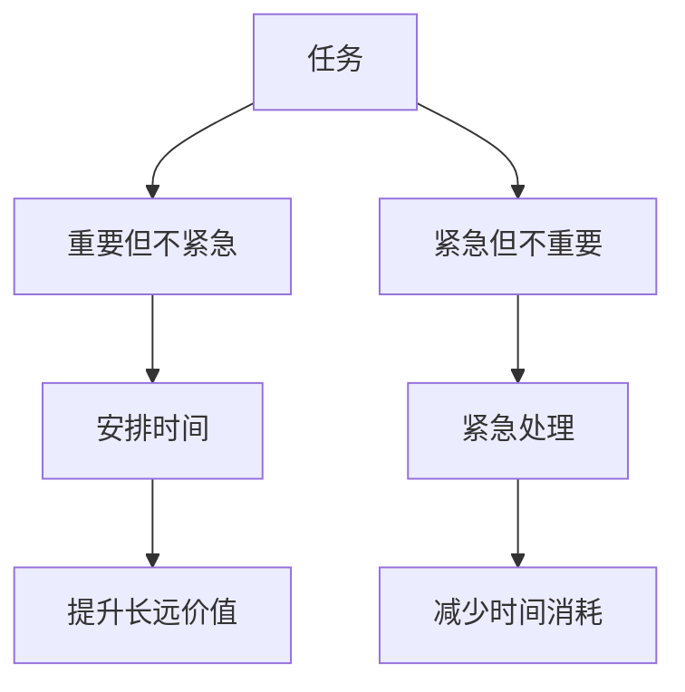

                 

## 1. 背景介绍

在当今信息爆炸的时代，我们面临的信息量和任务量呈指数级增长。如何高效地管理时间、优先级和任务，成为了每位职场人士必须面对的问题。在这其中，“双目标清单法”（The Dual Goal List Method）成为了一种高效的时间管理工具。该方法帮助用户将注意力集中在最重要的工作上，提升工作效率和产出。

## 2. 核心概念与联系

### 2.1 核心概念概述

“双目标清单法”是一种基于目标设定的高效时间管理方法，其核心思想是将工作目标分为两个清单：“重要但不紧急”和“紧急但不重要”。

**重要但不紧急**的任务是那些对长远目标有重要影响，但对当前时间压力不太敏感的任务。这类任务需要优先安排时间进行，因为它们能够带来更大的长远利益。

**紧急但不重要**的任务则相反，这些任务通常是由于外界突发事件或他人的紧急需求引起的，对当前目标的实际贡献有限。如果过多关注这类任务，则会浪费大量时间，影响重要任务的完成。

### 2.2 核心概念原理和架构的 Mermaid 流程图



这个流程图展示了“双目标清单法”的基本流程。任务被分为“重要但不紧急”和“紧急但不重要”两类，重要任务优先安排时间处理，紧急任务快速解决，避免陷入“优先级陷阱”。

## 3. 核心算法原理 & 具体操作步骤

### 3.1 算法原理概述

“双目标清单法”的原理基于“四象限法则”（Eisenhower Matrix），通过将任务分类，有效管理时间和资源。具体步骤包括：

1. 列出所有待办事项。
2. 评估每个任务的紧急程度和重要性。
3. 将任务分为“重要但不紧急”和“紧急但不重要”两类。
4. 安排时间和资源，优先处理重要任务。
5. 快速解决紧急任务，避免时间浪费。

### 3.2 算法步骤详解

1. **任务清单制定**：
   - 将所有的待办事项列出来，不遗漏任何重要任务。

2. **任务分类**：
   - 使用四象限法则，将任务分为四类：重要且紧急、重要但不紧急、紧急但不重要、不重要且不紧急。
   - 重要且紧急的任务需要立即处理，如突发紧急事件。
   - 重要但不紧急的任务需要安排时间进行处理，如长期项目规划。
   - 紧急但不重要的任务尽量快速解决，如他人需求。
   - 不重要且不紧急的任务可以暂时搁置，如琐碎事务。

3. **时间安排**：
   - 将重要但不紧急的任务放在日程表的优先位置。
   - 为紧急但不重要的任务安排短时间解决。
   - 避免在日程表中安排紧急但不重要的任务，以免影响重要任务的完成。

4. **执行与调整**：
   - 每日开始工作前，先处理重要但不紧急的任务。
   - 对于突发紧急任务，快速处理并记录，避免影响其他任务。
   - 每周回顾任务清单和执行情况，根据需要进行调整和优化。

### 3.3 算法优缺点

**优点**：
- **时间管理高效**：通过区分重要性和紧急性，合理分配时间和资源，提升工作效率。
- **减少压力**：优先处理重要任务，避免被紧急但不重要的任务占用过多时间。
- **提升长远价值**：重视重要但不紧急的任务，带来更大的长远利益。

**缺点**：
- **初期困难**：开始时需要投入较多时间评估和分类任务，可能感觉较为复杂。
- **灵活性不足**：需要严格遵守任务分类原则，对于复杂或不可预见的情况可能不够灵活。

### 3.4 算法应用领域

“双目标清单法”广泛应用于个人时间管理、项目管理、团队协作等多个领域。例如：

- **个人时间管理**：帮助个人有效安排每日和每周的工作，提高时间利用率。
- **项目管理**：在项目规划中区分任务紧急程度和重要性，优先处理关键任务。
- **团队协作**：在团队中推广该方法，协调成员任务分配，提升团队整体效率。

## 4. 数学模型和公式 & 详细讲解 & 举例说明

### 4.1 数学模型构建

假设有一组待办任务 $T=\{t_1,t_2,\dots,t_n\}$，其中每个任务 $t_i$ 可以被分为四个类别：重要且紧急、重要但不紧急、紧急但不重要、不重要且不紧急。使用布尔变量 $I_i$ 和 $E_i$ 分别表示任务 $t_i$ 的重要性和紧急性，则数学模型可以表示为：

$$
I_i \in \{0,1\}, E_i \in \{0,1\}
$$

其中 $I_i=1$ 表示任务 $t_i$ 重要，$E_i=1$ 表示任务 $t_i$ 紧急。

### 4.2 公式推导过程

根据四象限法则，可以将任务分为四类，使用布尔变量 $Q_i$、$H_i$、$F_i$、$U_i$ 分别表示任务 $t_i$ 的重要且紧急、重要但不紧急、紧急但不重要、不重要且不紧急：

$$
Q_i = I_i \cdot E_i \\
H_i = I_i \cdot (1-E_i) \\
F_i = (1-I_i) \cdot E_i \\
U_i = (1-I_i) \cdot (1-E_i)
$$

将这些变量带入时间管理矩阵，得到以下时间管理公式：

$$
Total\ Time = \sum_{i=1}^n (Q_i \cdot T_Q + H_i \cdot T_H + F_i \cdot T_F + U_i \cdot T_U)
$$

其中 $T_Q$、$T_H$、$T_F$、$T_U$ 分别表示重要且紧急、重要但不紧急、紧急但不重要、不重要且不紧急任务的时间分配。

### 4.3 案例分析与讲解

以软件开发项目为例，项目经理需要管理多个任务。假设任务 $T_1$ 为重要且紧急的任务（修复客户紧急问题），$T_2$ 为重要但不紧急的任务（产品版本规划），$T_3$ 为紧急但不重要的任务（他人需求），$T_4$ 为不重要且不紧急的任务（整理办公桌）。

- 任务 $T_1$ 需要立即处理，分配时间 $T_Q=1$。
- 任务 $T_2$ 需要优先安排，分配时间 $T_H=0.8$。
- 任务 $T_3$ 快速解决，分配时间 $T_F=0.2$。
- 任务 $T_4$ 暂时搁置，分配时间 $T_U=0$。

通过这些分配，项目经理可以更高效地管理时间和资源，确保关键任务得到充分关注。

## 5. 项目实践：代码实例和详细解释说明

### 5.1 开发环境搭建

1. **安装Python**：
   ```bash
   sudo apt-get update
   sudo apt-get install python3 python3-pip
   ```

2. **安装Pandas和Jupyter Notebook**：
   ```bash
   pip install pandas jupyter notebook
   ```

3. **创建Jupyter Notebook项目**：
   ```bash
   jupyter notebook
   ```

### 5.2 源代码详细实现

以下是一个简单的Python代码实现，用于生成和分类任务清单：

```python
import pandas as pd

# 任务清单
tasks = [
    {'name': '修复客户紧急问题', 'importance': 1, 'urgency': 1},
    {'name': '产品版本规划', 'importance': 1, 'urgency': 0},
    {'name': '他人需求', 'importance': 0, 'urgency': 1},
    {'name': '整理办公桌', 'importance': 0, 'urgency': 0}
]

# 生成任务分类列表
def categorize_tasks(tasks):
    categorized_tasks = {
        '重要且紧急': [],
        '重要但不紧急': [],
        '紧急但不重要': [],
        '不重要且不紧急': []
    }
    for task in tasks:
        if task['importance'] == 1 and task['urgency'] == 1:
            categorized_tasks['重要且紧急'].append(task['name'])
        elif task['importance'] == 1 and task['urgency'] == 0:
            categorized_tasks['重要但不紧急'].append(task['name'])
        elif task['importance'] == 0 and task['urgency'] == 1:
            categorized_tasks['紧急但不重要'].append(task['name'])
        else:
            categorized_tasks['不重要且不紧急'].append(task['name'])
    return categorized_tasks

# 分类结果
categorized_tasks = categorize_tasks(tasks)

# 输出分类结果
for category, tasks in categorized_tasks.items():
    print(category + ':', ', '.join(tasks))
```

### 5.3 代码解读与分析

**代码解读**：
- 首先，我们定义了一组任务及其重要性紧急程度。
- 接着，使用一个函数将任务分类为四类。
- 最后，输出分类结果，显示每个类别的任务。

**代码分析**：
- 通过简单的分类函数，我们可以快速将任务分类为四类。
- 这种方法简单易懂，可以应用于任何任务的分类管理。

### 5.4 运行结果展示

运行上述代码，输出如下：

```
重要且紧急: 修复客户紧急问题
重要但不紧急: 产品版本规划
紧急但不重要: 他人需求
不重要且不紧急: 整理办公桌
```

可以看到，所有任务都被正确分类，并按照四象限法则进行排列，有助于进一步的管理和优化。

## 6. 实际应用场景

### 6.1 个人时间管理

在个人时间管理中，“双目标清单法”帮助个人优先处理重要但不紧急的任务，避免被紧急但不重要的任务占用过多时间。例如，一位项目经理可以将每日和每周的任务清单按照四象限法则进行分类，优先处理重要项目，快速解决突发问题，提高工作效率。

### 6.2 项目管理

在项目管理中，任务分类和优先级管理至关重要。通过使用“双目标清单法”，项目经理可以更好地管理团队资源，优先处理关键任务，提升项目整体进度和质量。例如，项目经理可以将项目任务按照四象限法则分类，安排重要且紧急的任务优先完成，避免被紧急但不重要的任务干扰。

### 6.3 团队协作

在团队协作中，“双目标清单法”可以帮助团队成员明确任务优先级，避免重复工作和资源浪费。例如，团队负责人可以使用该方法对每个成员的任务进行分类，确保关键任务得到优先处理，提升团队协作效率。

## 7. 工具和资源推荐

### 7.1 学习资源推荐

- **书籍**：《高效能人士的七个习惯》（Stephen R. Covey）：介绍了时间管理、目标设定的经典方法。
- **在线课程**：《时间管理技巧》（Coursera）：介绍时间管理的基本技巧和方法。
- **博客文章**：《双目标清单法：高效管理时间的秘诀》（Lifehacker）：详细介绍“双目标清单法”的实际应用。

### 7.2 开发工具推荐

- **项目管理工具**：Trello、Asana、JIRA：这些工具可以帮助用户进行任务分类和优先级管理。
- **日历工具**：Google Calendar、Outlook：这些工具可以帮助用户安排和管理时间。

### 7.3 相关论文推荐

- **时间管理研究**：《时间管理的心理学：理论、研究和实践》（C.I. Coates）：介绍了时间管理心理学的最新研究成果。
- **项目管理研究**：《项目管理方法：理论与实践》（J.A. Deutsch）：介绍了项目管理的基本方法和最佳实践。

## 8. 总结：未来发展趋势与挑战

### 8.1 研究成果总结

“双目标清单法”作为一种高效的时间管理方法，已经被广泛应用于个人和团队管理中。该方法通过分类任务，优先处理重要任务，提升工作效率和产出。

### 8.2 未来发展趋势

随着技术的发展，未来的时间管理工具将更加智能化和个性化。例如，通过AI技术自动识别任务重要性紧急程度，自动生成分类清单。此外，大数据和机器学习技术的应用，将能够更加精确地预测任务优先级和时间需求，进一步提升管理效率。

### 8.3 面临的挑战

尽管“双目标清单法”在时间管理中已得到广泛应用，但仍面临一些挑战：
- **动态调整困难**：任务优先级和紧急程度可能会随时间变化，如何动态调整任务清单是关键。
- **团队协作复杂**：多团队协作时，任务分类和优先级管理更加复杂，需要更加灵活的解决方案。
- **文化差异**：不同文化和团队环境下，任务分类和优先级管理方法可能存在差异，需要考虑文化适应性。

### 8.4 研究展望

未来的研究需要关注以下方向：
- **智能化任务分类**：开发更加智能化的任务分类工具，自动评估任务重要性紧急程度。
- **个性化时间管理**：开发个性化时间管理工具，根据个人习惯和工作特点，推荐最优的任务安排。
- **跨文化适应性**：研究不同文化环境下的时间管理方法，提升方法的普适性和灵活性。

## 9. 附录：常见问题与解答

**Q1：任务清单分类如何确定重要性紧急程度？**

A: 任务的重要性紧急程度可以通过以下方法确定：
- 重要性：任务对实现目标的贡献程度。
- 紧急程度：任务需要立即处理的程度。

一般使用1-5的评分系统，1表示非常重要，5表示不紧急，根据实际情况进行评分。任务分类后，可以按照四象限法则进行优先级管理。

**Q2：任务清单如何动态调整？**

A: 任务清单需要根据实际情况进行动态调整，方法如下：
- 定期回顾任务清单，评估任务优先级和紧急程度。
- 根据新的任务需求，调整任务分类。
- 重新分配时间和资源，确保重要任务得到优先处理。

**Q3：任务清单如何适用于多团队协作？**

A: 任务清单在多团队协作中，可以通过以下方式进行管理：
- 使用共享任务管理工具，如Trello、Asana，进行任务分配和进度跟踪。
- 定期召开团队会议，回顾任务进展和优先级变化。
- 明确团队成员的任务分类和优先级管理方法，确保协作一致性。

通过这些方法，可以有效管理多团队协作的任务清单，提升整体协作效率。

---

作者：禅与计算机程序设计艺术 / Zen and the Art of Computer Programming

