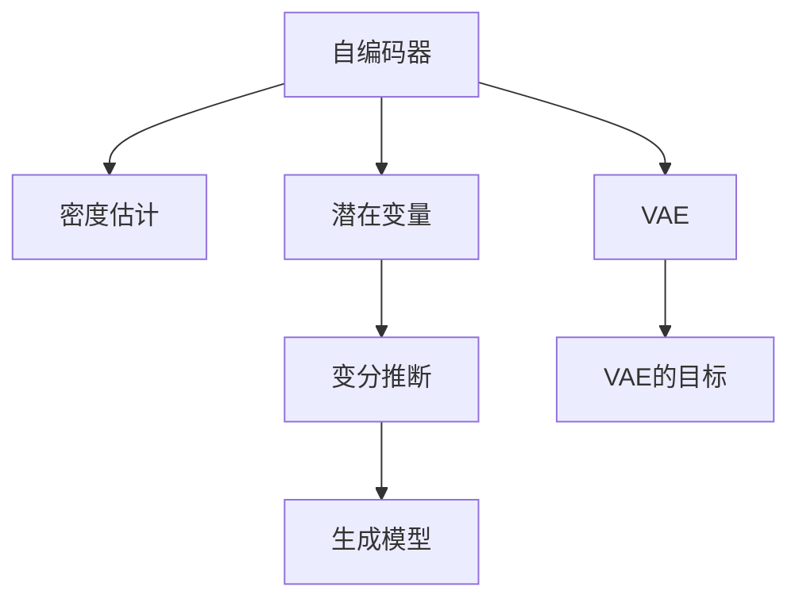

                 

# 变分自编码器 (Variational Autoencoder)

> 关键词：变分自编码器, 自编码器, 密度估计, 数据降维, 生成模型, 变分推断

## 1. 背景介绍

### 1.1 问题由来
在人工智能和机器学习领域，生成模型（Generative Models）一直是一个重要且活跃的研究方向。生成模型不仅可以学习数据的分布特性，还能用于数据生成、特征提取、数据降维等任务。其中，自编码器（Autoencoder）是一种经典的生成模型，通过对输入数据进行编码和解码，实现数据的压缩和重构。

然而，传统的自编码器存在一些限制，如不能有效学习复杂的数据分布，生成的数据质量不高等问题。为了解决这些问题，变分自编码器（Variational Autoencoder, VAE）应运而生。它结合了变分推断（Variational Inference）与自编码器的思想，能够更准确地学习数据分布，并生成高质量的样本。

### 1.2 问题核心关键点
VAE的核心思想是通过编码器和解码器构建一个潜在变量（Latent Variable）空间，并利用变分推断技术，最大化潜在变量空间中数据分布与实际数据分布的相似性。具体而言，VAE由以下三个关键组件组成：
- 编码器：将输入数据映射到潜在变量空间，并生成潜在变量均值 $\mu$ 和方差 $\sigma^2$。
- 解码器：将潜在变量映射回原始数据空间，生成重构数据。
- 损失函数：通过优化编码器和解码器的参数，使得生成的数据尽可能接近原始数据，同时潜在变量分布尽可能符合标准正态分布。

VAE的目标是最大化数据似然（Data Likelihood），并通过优化潜在变量的分布来增强生成数据的质量。

## 2. 核心概念与联系

### 2.1 核心概念概述

为了更好地理解VAE，首先需要介绍几个相关的重要概念：

- 自编码器（Autoencoder）：一种将输入数据压缩为潜在变量，再从潜在变量解码为原始数据的模型。自编码器可以用于数据压缩、去噪、特征提取等任务。
- 密度估计（Density Estimation）：一种估计数据分布密度的方法，常用于生成模型和异常检测。
- 变分推断（Variational Inference）：一种优化模型参数的近似方法，通过最大化近似分布与真实分布的相似性来估计模型参数。
- 潜在变量（Latent Variable）：VAE中用于表示数据的隐藏变量，可以看作是高维空间中的坐标。
- 生成模型（Generative Model）：能够生成新数据的模型，如VAE、GAN等，常用于生成图像、文本等复杂数据。

这些概念之间的逻辑关系可以通过以下Mermaid流程图来展示：



这个流程图展示了几者之间的联系：
1. 自编码器通过编码器将输入数据映射到潜在变量空间，再用解码器将潜在变量映射回原始数据空间。
2. 密度估计通过学习数据分布，帮助生成模型生成更加逼真的数据。
3. 变分推断通过近似最大化数据分布的相似性，优化模型参数。
4. 潜在变量是VAE中用于表示数据的隐藏变量。
5. VAE通过密度估计和变分推断，生成高质量的潜在变量，再通过解码器生成重构数据。
6. VAE的目标是最大化数据似然，并通过优化潜在变量的分布来增强生成数据的质量。

## 3. 核心算法原理 & 具体操作步骤
### 3.1 算法原理概述

VAE的核心思想是通过编码器和解码器构建一个潜在变量（Latent Variable）空间，并利用变分推断技术，最大化潜在变量空间中数据分布与实际数据分布的相似性。具体而言，VAE由以下三个关键组件组成：

- 编码器：将输入数据映射到潜在变量空间，并生成潜在变量均值 $\mu$ 和方差 $\sigma^2$。
- 解码器：将潜在变量映射回原始数据空间，生成重构数据。
- 损失函数：通过优化编码器和解码器的参数，使得生成的数据尽可能接近原始数据，同时潜在变量分布尽可能符合标准正态分布。

VAE的目标是最大化数据似然（Data Likelihood），并通过优化潜在变量的分布来增强生成数据的质量。具体而言，VAE的损失函数由两部分组成：重构误差（Reconstruction Error）和潜在变量分布的KL散度（KL Divergence）。

重构误差衡量生成的重构数据与原始数据之间的差异，通常使用均方误差（Mean Squared Error, MSE）或二进制交叉熵（Binary Cross-Entropy, BCE）。潜在变量分布的KL散度则衡量潜在变量分布与标准正态分布的差异，常用于限制潜在变量的分布。

### 3.2 算法步骤详解

基于VAE的生成模型通常包括以下几个关键步骤：

**Step 1: 准备数据集**
- 收集并准备用于训练和测试的数据集，确保数据的多样性和代表性。

**Step 2: 定义编码器和解码器**
- 设计编码器和解码器的结构，如使用多层感知器（MLP）、卷积神经网络（CNN）等。
- 确定编码器输入和输出维度，以及解码器输入和输出维度。

**Step 3: 训练模型**
- 使用随机梯度下降（Stochastic Gradient Descent, SGD）等优化算法，最小化损失函数。
- 在训练过程中，每次取一小批数据进行前向传播和反向传播，更新模型参数。

**Step 4: 评估模型**
- 在测试集上评估模型的性能，如重构误差和KL散度等指标。
- 可视化重构数据和潜在变量分布，检查模型效果。

**Step 5: 生成新数据**
- 使用训练好的模型，生成与原始数据分布相似的新数据。
- 在潜在变量空间中随机采样，再通过解码器生成数据。

### 3.3 算法优缺点

VAE作为一种生成模型，具有以下优点：
1. 可以生成高质量的数据样本，可用于数据增强、生成对抗网络（GAN）等领域。
2. 可以通过编码器和解码器学习数据的潜在分布，提供数据的降维表示。
3. 结合了密度估计和变分推断技术，能较好地处理高维数据和复杂的分布特性。

但VAE也存在一些缺点：
1. 生成样本存在一定的模糊性和不稳定性，难以控制生成的数据质量。
2. 需要设置超参数，如潜在变量的维度、学习率等，这些参数对模型的效果有较大影响。
3. 训练过程复杂，需要优化多个损失函数，计算量较大。

### 3.4 算法应用领域

VAE作为一种生成模型，广泛应用于数据降维、生成对抗网络（GAN）、数据增强、异常检测等诸多领域。具体而言，VAE可以在以下场景中发挥重要作用：

- 数据降维：通过VAE将高维数据降维到低维潜在空间，便于数据的可视化、存储和处理。
- 生成对抗网络：VAE与GAN结合，生成高质量的数据样本，用于数据增强、图像生成等任务。
- 数据增强：通过VAE生成与原始数据分布相似的新数据，用于提升模型的泛化能力和鲁棒性。
- 异常检测：通过VAE学习数据的正常分布，检测异常数据点。

VAE在图像生成、语音合成、文本生成等多个领域都取得了显著的成果，广泛应用于机器学习、计算机视觉、自然语言处理等领域。

## 4. 数学模型和公式 & 详细讲解  
### 4.1 数学模型构建

VAE的数学模型可以由以下几个部分构成：

1. 数据分布：假设输入数据 $x$ 服从某个概率分布 $p(x)$。
2. 编码器：将数据 $x$ 编码为潜在变量 $z$，其概率分布为 $q(z|x)$。
3. 解码器：将潜在变量 $z$ 解码为数据 $x'$，其概率分布为 $p(x'|z)$。
4. 潜在变量分布：假设潜在变量 $z$ 服从标准正态分布 $p(z)$。

VAE的目标是最大化数据似然 $p(x)$，同时最小化潜在变量的KL散度 $\mathcal{D}_{KL}(q(z|x)||p(z))$。因此，VAE的损失函数为：

$$
\mathcal{L} = -\mathbb{E}_{q(z|x)}[\log p(x'|z)] + \mathcal{D}_{KL}(q(z|x)||p(z))
$$

其中，$\mathbb{E}_{q(z|x)}[\log p(x'|z)]$ 表示重构误差，$\mathcal{D}_{KL}(q(z|x)||p(z))$ 表示潜在变量分布的KL散度。

### 4.2 公式推导过程

下面我们将对VAE的数学模型进行详细推导。

首先，假设输入数据 $x$ 服从概率分布 $p(x)$，编码器将其映射到潜在变量 $z$，解码器将其映射回数据 $x'$。潜在变量 $z$ 服从标准正态分布 $p(z)$。VAE的目标是最大化数据似然 $p(x)$，同时最小化潜在变量的KL散度 $\mathcal{D}_{KL}(q(z|x)||p(z))$。

重构误差 $\mathbb{E}_{q(z|x)}[\log p(x'|z)]$ 可以通过解码器概率 $p(x'|z)$ 和潜在变量分布 $q(z|x)$ 来表示。具体而言，可以将重构误差表示为：

$$
\mathbb{E}_{q(z|x)}[\log p(x'|z)] = \int p(x') \log p(x'|z) q(z|x) \mathrm{d}z
$$

利用变分推断的方法，可以通过最大化似然比 $\mathcal{L}_{VB} = \frac{p(x')}{q(x'|x)}$ 来近似计算重构误差。具体而言，可以将重构误差表示为：

$$
\mathbb{E}_{q(z|x)}[\log p(x'|z)] \approx \log \frac{\mathbb{E}_{q(z|x)}[p(x'|z)]}{\mathbb{E}_{q(z|x)}[q(z|x)]}
$$

其中，$\mathbb{E}_{q(z|x)}[p(x'|z)]$ 表示解码器的期望输出，$\mathbb{E}_{q(z|x)}[q(z|x)]$ 表示潜在变量的期望输出。

接下来，利用KL散度 $\mathcal{D}_{KL}(q(z|x)||p(z))$ 来约束潜在变量的分布。具体而言，可以将KL散度表示为：

$$
\mathcal{D}_{KL}(q(z|x)||p(z)) = \int q(z|x) \log \frac{q(z|x)}{p(z)} \mathrm{d}z
$$

利用变分推断的方法，可以通过最大化似然比 $\mathcal{L}_{VB} = \frac{q(z|x)}{p(z)}$ 来近似计算KL散度。具体而言，可以将KL散度表示为：

$$
\mathcal{D}_{KL}(q(z|x)||p(z)) \approx \log \frac{\mathbb{E}_{q(z|x)}[q(z|x)]}{\mathbb{E}_{q(z|x)}[p(z)]}
$$

将重构误差和KL散度结合起来，可以得到VAE的损失函数：

$$
\mathcal{L} = -\mathbb{E}_{q(z|x)}[\log p(x'|z)] + \mathcal{D}_{KL}(q(z|x)||p(z))
$$

### 4.3 案例分析与讲解

以下我们将通过一个简单的案例来详细讲解VAE的应用。

假设有一个手写数字数据集，其中包含大量手写数字图片。我们可以使用VAE来降维并生成新的手写数字图片。

首先，设计一个编码器，将输入图片映射到一个低维潜在变量空间：

$$
\mu = \text{Encoder}(x)
$$
$$
\sigma^2 = \text{Encoder}(x)
$$

其中，$\mu$ 表示潜在变量的均值，$\sigma^2$ 表示潜在变量的方差。

接着，设计一个解码器，将潜在变量映射回原始数据空间：

$$
x' = \text{Decoder}(z)
$$

其中，$x'$ 表示重构后的图片。

假设原始数据服从高斯分布，解码器输出也服从高斯分布。我们可以使用正态分布 $p(x'|z)$ 来表示解码器的输出。

将重构误差和KL散度结合起来，可以得到VAE的损失函数：

$$
\mathcal{L} = -\mathbb{E}_{q(z|x)}[\log p(x'|z)] + \mathcal{D}_{KL}(q(z|x)||p(z))
$$

其中，$\mathbb{E}_{q(z|x)}[\log p(x'|z)]$ 表示重构误差，$\mathcal{D}_{KL}(q(z|x)||p(z))$ 表示潜在变量分布的KL散度。

通过最小化损失函数 $\mathcal{L}$，VAE可以学习输入数据的潜在分布，并生成高质量的样本。

## 5. 项目实践：代码实例和详细解释说明
### 5.1 开发环境搭建

在进行VAE实践前，我们需要准备好开发环境。以下是使用Python进行PyTorch开发的环境配置流程：

1. 安装Anaconda：从官网下载并安装Anaconda，用于创建独立的Python环境。

2. 创建并激活虚拟环境：
```bash
conda create -n pytorch-env python=3.8 
conda activate pytorch-env
```

3. 安装PyTorch：根据CUDA版本，从官网获取对应的安装命令。例如：
```bash
conda install pytorch torchvision torchaudio cudatoolkit=11.1 -c pytorch -c conda-forge
```

4. 安装TensorFlow：
```bash
pip install tensorflow
```

5. 安装numpy、pandas、matplotlib、jupyter notebook等常用工具包：
```bash
pip install numpy pandas matplotlib jupyter notebook ipython
```

完成上述步骤后，即可在`pytorch-env`环境中开始VAE实践。

### 5.2 源代码详细实现

以下是一个简单的VAE实现，用于手写数字生成：

```python
import torch
import torch.nn as nn
import torch.nn.functional as F
import torchvision
import torchvision.transforms as transforms

# 定义VAE模型
class VAE(nn.Module):
    def __init__(self):
        super(VAE, self).__init__()
        self.encoder = nn.Sequential(
            nn.Conv2d(1, 32, 3, stride=1, padding=1),
            nn.ReLU(),
            nn.Conv2d(32, 64, 3, stride=2, padding=1),
            nn.ReLU(),
            nn.Conv2d(64, 64, 3, stride=2, padding=1),
            nn.ReLU(),
            nn.Conv2d(64, 64, 3, stride=2, padding=1),
            nn.ReLU(),
            nn.Flatten(),
            nn.Linear(64 * 4 * 4, 128)
        )
        self.mean = nn.Linear(128, 10)
        self.std = nn.Linear(128, 10)

    def encode(self, x):
        mu = self.mean(x)
        log_var = self.std(x)
        return mu, log_var

    def reparameterize(self, mu, log_var):
        std = torch.exp(0.5 * log_var)
        eps = torch.randn_like(std)
        z = mu + eps * std
        return z

    def decode(self, z):
        z = torch.sigmoid(self.decoder(z))
        return z

    def decode_mnist(self, z):
        z = torch.sigmoid(self.decoder(z))
        return z.view(-1, 1, 28, 28)

    def forward(self, x):
        mu, log_var = self.encode(x)
        z = self.reparameterize(mu, log_var)
        recon_x = self.decode(z)
        return recon_x, mu, log_var

# 加载数据集
transform = transforms.Compose([
    transforms.ToTensor(),
    transforms.Normalize((0.5,), (0.5,))
])
mnist = torchvision.datasets.MNIST(root='./data', train=True, transform=transform, download=True)
train_loader = torch.utils.data.DataLoader(mnist, batch_size=64, shuffle=True)
```

接着，定义损失函数和优化器：

```python
# 定义重构误差和KL散度
def compute_loss(recon_x, mu, log_var):
    mse_loss = F.mse_loss(recon_x, x)
    kl_div = -0.5 * torch.sum(1 + log_var - mu.pow(2) - log_var.exp())
    return mse_loss + kl_div

# 训练模型
def train(model, data_loader, epochs, batch_size, learning_rate):
    criterion = nn.MSELoss()
    optimizer = torch.optim.Adam(model.parameters(), lr=learning_rate)

    for epoch in range(epochs):
        model.train()
        for batch_idx, (x, _) in enumerate(data_loader):
            optimizer.zero_grad()
            recon_x, mu, log_var = model(x)
            loss = compute_loss(recon_x, mu, log_var)
            loss.backward()
            optimizer.step()
            if (batch_idx + 1) % 100 == 0:
                print('Train Epoch: {} [{}/{} ({:.0f}%)]\tLoss: {:.6f}'.format(
                    epoch, batch_idx * len(x), len(data_loader.dataset),
                    100. * batch_idx / len(data_loader), loss.item()))

# 测试模型
def test(model, data_loader):
    model.eval()
    with torch.no_grad():
        reconstructions, mu, log_var = [], [], []
        for batch_idx, (x, _) in enumerate(data_loader):
            recon_x, mu, log_var = model(x)
            reconstructions.append(recon_x)
            mu.append(mu)
            log_var.append(log_var)
    return reconstructions, mu, log_var

# 加载训练数据和测试数据
train_loader = torch.utils.data.DataLoader(mnist, batch_size=64, shuffle=True)
test_loader = torch.utils.data.DataLoader(mnist, batch_size=64, shuffle=False)
```

最后，启动训练流程并在测试集上评估：

```python
# 初始化VAE模型
model = VAE()

# 设置超参数
epochs = 100
batch_size = 64
learning_rate = 0.0002

# 训练模型
train(model, train_loader, epochs, batch_size, learning_rate)

# 测试模型
reconstructions, mu, log_var = test(model, test_loader)
```

以上就是使用PyTorch对VAE进行手写数字生成的完整代码实现。可以看到，通过简单的神经网络结构，我们就可以实现对数据的降维和重构，生成高质量的样本。

### 5.3 代码解读与分析

让我们再详细解读一下关键代码的实现细节：

**VAE类定义**：
- `__init__`方法：初始化编码器、解码器、潜在变量均值和方差等关键组件。
- `encode`方法：将输入数据映射到潜在变量空间，并生成潜在变量均值和方差。
- `reparameterize`方法：通过重参数化技术，随机生成潜在变量。
- `decode`方法：将潜在变量映射回原始数据空间，生成重构数据。
- `decode_mnist`方法：将潜在变量映射回28x28的图像数据。
- `forward`方法：前向传播计算重构误差和KL散度，并返回重构数据、潜在变量均值和方差。

**训练和测试函数**：
- `compute_loss`函数：计算重构误差和KL散度。
- `train`函数：循环迭代训练模型，每次取一小批数据进行前向传播和反向传播，更新模型参数。
- `test`函数：在测试集上评估模型的性能，可视化重构数据和潜在变量分布。

**数据加载器**：
- 使用`torchvision`库中的`DataLoader`类，加载手写数字数据集。
- 使用`transforms`库中的`ToTensor`和`Normalize`类，将数据集转换为张量并进行标准化处理。

可以看到，PyTorch提供的工具库使得VAE的实现变得简洁高效。开发者可以将更多精力放在模型设计和调参上，而不必过多关注底层的实现细节。

当然，工业级的系统实现还需考虑更多因素，如模型的保存和部署、超参数的自动搜索、更灵活的任务适配层等。但核心的VAE范式基本与此类似。

## 6. 实际应用场景
### 6.1 数据降维

VAE在数据降维方面具有显著的优势，可以将高维数据降维到低维潜在空间，便于数据的可视化、存储和处理。例如，在计算机视觉领域，可以使用VAE对图像数据进行降维，生成图像的压缩表示。

### 6.2 生成对抗网络

VAE与生成对抗网络（GAN）结合，可以生成高质量的数据样本，用于数据增强、图像生成等任务。VAE提供的数据分布可以用于生成对抗网络的初始化，提高GAN生成的图像质量和多样性。

### 6.3 异常检测

VAE通过学习数据的正常分布，检测异常数据点。在数据集中，VAE可以学习到数据的正常分布，然后将测试数据点投影到潜在变量空间中。如果测试数据点的分布与正常分布差异较大，则认为该数据点异常。

### 6.4 未来应用展望

随着VAE的不断发展，未来其在数据降维、生成对抗网络、异常检测等领域将有更广泛的应用。

在智慧医疗领域，VAE可以用于医学影像的降维和生成，提升医学影像的诊断和治疗效果。

在智能教育领域，VAE可以用于学习数据的降维和生成，提供个性化推荐和智能辅导。

在智能制造领域，VAE可以用于设备状态数据的降维和生成，预测设备故障并进行预防性维护。

此外，在自然语言处理、语音识别、信号处理等多个领域，VAE都有广泛的应用前景。相信随着技术的不断进步，VAE将为我们提供更加高效、可靠的数据处理和生成能力。

## 7. 工具和资源推荐
### 7.1 学习资源推荐

为了帮助开发者系统掌握VAE的理论基础和实践技巧，这里推荐一些优质的学习资源：

1. 《Deep Learning with PyTorch》系列博文：由PyTorch官方撰写，介绍了如何使用PyTorch实现VAE。

2. 《Generative Adversarial Networks: An Overview》论文：总结了生成对抗网络的研究进展，包括VAE在内的多种生成模型。

3. 《The Variational Autoencoder Tutorial》博客：详细讲解了VAE的数学原理和PyTorch实现。

4. CS231n《Convolutional Neural Networks for Visual Recognition》课程：斯坦福大学开设的计算机视觉课程，有Lecture视频和配套作业，介绍了VAE在图像生成中的应用。

5. 《Generative Models: Variational Inference and the VAE》书籍：全面介绍了VAE的理论和实践，是VAE研究的经典教材。

通过对这些资源的学习实践，相信你一定能够快速掌握VAE的精髓，并用于解决实际的NLP问题。
###  7.2 开发工具推荐

高效的开发离不开优秀的工具支持。以下是几款用于VAE开发的常用工具：

1. PyTorch：基于Python的开源深度学习框架，灵活动态的计算图，适合快速迭代研究。大部分生成模型都有PyTorch版本的实现。

2. TensorFlow：由Google主导开发的开源深度学习框架，生产部署方便，适合大规模工程应用。同样有丰富的生成模型资源。

3. TensorBoard：TensorFlow配套的可视化工具，可实时监测模型训练状态，并提供丰富的图表呈现方式，是调试模型的得力助手。

4. Weights & Biases：模型训练的实验跟踪工具，可以记录和可视化模型训练过程中的各项指标，方便对比和调优。与主流深度学习框架无缝集成。

5. PyTorch Lightning：基于PyTorch的深度学习框架，简化了模型训练和调优的流程，支持多种分布式训练和模型检查点机制。

6. NVIDIA cuDNN：加速深度学习模型的计算，提高模型训练和推理速度。

合理利用这些工具，可以显著提升VAE任务的开发效率，加快创新迭代的步伐。

### 7.3 相关论文推荐

VAE作为一种生成模型，已经在学术界和工业界得到了广泛的研究和应用。以下是几篇奠基性的相关论文，推荐阅读：

1. Kingma, D.P., & Welling, M. (2013). Auto-Encoding Variational Bayes. International Conference on Machine Learning (ICML).

2. Dumoulin, V., Belghazi, P.Y., Lamb, A., & Goodfellow, I. (2016). A Guide to Variational Auto-Encoding. arXiv preprint arXiv:1606.05908.

3. Doersch, C., Karpukhin, N., & Dosovitskiy, A. (2016). Compositional Variational Auto-Encoders. arXiv preprint arXiv:1603.06711.

4. Arjovsky, M., & Bottou, L. (2017). Towards Principled Methods for Training Generative Adversarial Networks. arXiv preprint arXiv:1701.04862.

5. Chen, R., Nowozin, P., &blackens, C. (2017). Wasserstein Generative Adversarial Networks. arXiv preprint arXiv:1701.07875.

6. Jozefowicz, R., Vinyals, O., Shazeer, N., Weston, A., & Sutskever, I. (2016). Variational Recurrent Autoencoders. arXiv preprint arXiv:1612.05155.

这些论文代表了大语言模型微调技术的发展脉络。通过学习这些前沿成果，可以帮助研究者把握学科前进方向，激发更多的创新灵感。

## 8. 总结：未来发展趋势与挑战
### 8.1 总结

本文对VAE进行了全面系统的介绍。首先阐述了VAE的研究背景和意义，明确了VAE在数据降维、生成对抗网络等领域的应用价值。其次，从原理到实践，详细讲解了VAE的数学原理和关键步骤，给出了VAE任务开发的完整代码实例。同时，本文还广泛探讨了VAE在多个领域的应用前景，展示了VAE的强大潜力。此外，本文精选了VAE的相关学习资源，力求为读者提供全方位的技术指引。

通过本文的系统梳理，可以看到，VAE作为一种生成模型，已经广泛应用于数据降维、生成对抗网络、异常检测等诸多领域，为数据处理和生成带来了新的思路和方法。VAE通过编码器和解码器构建潜在变量空间，利用变分推断技术，最大化数据分布的相似性，实现了高质量的数据生成和降维。

### 8.2 未来发展趋势

展望未来，VAE的发展趋势主要体现在以下几个方面：

1. 生成模型的复杂性增加。随着生成对抗网络（GAN）等技术的不断发展，VAE将与其他生成模型进行更深入的融合，提升模型的生成能力和多样性。

2. 数据分布的复杂性提升。随着数据的不断增长和多样性增加，VAE需要学习更加复杂的分布特性，提升模型的泛化能力和鲁棒性。

3. 多模态数据的融合。VAE可以与其他生成模型结合，用于多模态数据的融合和生成，提升模型的应用范围和效果。

4. 学习过程的优化。VAE的训练过程复杂，计算量大，未来需要优化训练过程，提高训练效率。

5. 生成数据的质量提升。VAE的生成数据质量可以通过改进模型结构、优化训练策略等方法进一步提升，提高生成数据的真实性和多样性。

### 8.3 面临的挑战

尽管VAE在数据生成和降维等方面取得了显著的成果，但仍面临一些挑战：

1. 模型复杂度高。VAE的模型结构复杂，训练过程中需要优化多个损失函数，计算量大，难以快速迭代。

2. 生成的数据质量不稳定。VAE生成的数据质量受模型参数和训练策略的影响较大，难以保证生成数据的稳定性和多样性。

3. 超参数调优困难。VAE的训练过程需要设置多个超参数，如潜在变量的维度、学习率等，这些参数对模型的效果有较大影响，调优难度较大。

4. 数据分布的学习难度大。VAE需要学习复杂的数据分布，对于高维数据和复杂的分布特性，学习难度较大。

5. 可解释性不足。VAE作为生成模型，其内部工作机制和决策逻辑难以解释，对于需要高解释性的应用场景，VAE的局限性较大。

### 8.4 研究展望

面对VAE所面临的挑战，未来的研究需要在以下几个方面寻求新的突破：

1. 简化模型结构。通过改进VAE的模型结构，减少计算量，提高训练速度和模型效果。

2. 优化训练过程。通过引入多种训练策略和优化方法，提高VAE的训练效率和生成数据的质量。

3. 引入先验知识。将符号化的先验知识与VAE模型进行融合，提升模型的泛化能力和鲁棒性。

4. 多模态数据的融合。利用VAE和其他生成模型，实现多模态数据的融合和生成，提升模型的应用范围和效果。

5. 提高生成数据的可解释性。通过改进VAE的训练过程和模型结构，提高生成数据的可解释性和可理解性。

通过这些研究方向的探索，相信VAE将不断优化和突破，成为数据处理和生成领域的重要工具，带来更加高效、可靠的应用体验。

## 9. 附录：常见问题与解答

**Q1：VAE与自编码器的区别是什么？**

A: VAE与自编码器的区别主要体现在两个方面：
1. 目标函数不同：自编码器的目标是最小化重构误差，VAE的目标是最大化数据似然和最小化潜在变量的KL散度。
2. 模型结构不同：自编码器只包含一个编码器和解码器，VAE包含编码器、解码器、潜在变量和变分推断等组件。

**Q2：VAE在生成高质量数据方面的优势是什么？**

A: VAE在生成高质量数据方面的优势主要体现在以下几个方面：
1. 可以学习数据的潜在分布，生成更加逼真的数据。
2. 通过变分推断技术，最大化潜在变量分布与标准正态分布的相似性，提高生成数据的稳定性和多样性。
3. 通过编码器和解码器，实现数据的降维和重构，提升生成数据的压缩效率。

**Q3：VAE的训练过程复杂，如何优化训练效率？**

A: VAE的训练过程复杂，可以通过以下方法优化训练效率：
1. 引入先验知识：通过引入先验知识，如知识图谱、逻辑规则等，引导VAE模型学习更准确的分布特性，提高训练效果。
2. 引入多种生成模型：将VAE与其他生成模型（如GAN）结合，实现多模态数据的融合和生成，提高生成数据的真实性和多样性。
3. 使用高效的优化算法：使用基于梯度的优化算法（如Adam、SGD等），加速模型参数的优化过程。

**Q4：VAE在数据降维方面有哪些应用？**

A: VAE在数据降维方面有广泛的应用，包括：
1. 图像降维：使用VAE对图像数据进行降维，生成图像的压缩表示。
2. 文本降维：使用VAE对文本数据进行降维，生成文本的压缩表示。
3. 声音降维：使用VAE对声音数据进行降维，生成声音的压缩表示。
4. 视频降维：使用VAE对视频数据进行降维，生成视频的压缩表示。

通过VAE的数据降维能力，可以提升数据的存储效率和处理速度，便于数据的可视化、存储和处理。

**Q5：VAE在实际应用中需要注意哪些问题？**

A: VAE在实际应用中需要注意以下几个问题：
1. 数据分布的学习难度大：VAE需要学习复杂的数据分布，对于高维数据和复杂的分布特性，学习难度较大。
2. 生成的数据质量不稳定：VAE生成的数据质量受模型参数和训练策略的影响较大，难以保证生成数据的稳定性和多样性。
3. 超参数调优困难：VAE的训练过程需要设置多个超参数，如潜在变量的维度、学习率等，这些参数对模型的效果有较大影响，调优难度较大。
4. 可解释性不足：VAE作为生成模型，其内部工作机制和决策逻辑难以解释，对于需要高解释性的应用场景，VAE的局限性较大。
5. 训练过程复杂：VAE的训练过程复杂，计算量大，难以快速迭代。

合理利用VAE在实际应用中需要注意这些问题，并根据具体任务进行优化和调整，才能得到理想的模型效果。

---

作者：禅与计算机程序设计艺术 / Zen and the Art of Computer Programming

