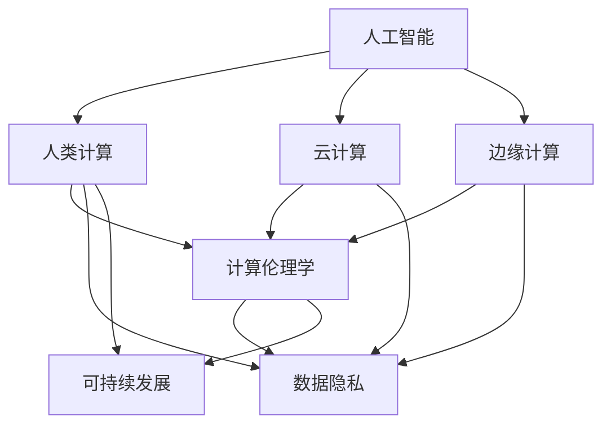

                 

# 国际合作：共同推动人类计算领域的进步

> 关键词：国际合作, 人类计算, 技术创新, 人工智能, 智能基础设施, 云计算, 边缘计算, 计算伦理学, 数据隐私, 可持续发展

## 1. 背景介绍

### 1.1 问题由来

随着科技的迅猛发展，人类计算领域正处于一场前所未有的变革之中。从计算机的问世到互联网的普及，再到移动互联网的广泛应用，每一次技术进步都极大地拓展了人类活动的空间和方式。然而，仅仅依靠单一国家的力量已经难以应对全球性计算问题的挑战，国际合作变得愈发重要。人工智能、云计算、边缘计算等技术的普及，使得世界各地的科研机构、企业、政府机构都参与到这一领域的竞争与合作中来，共同推动人类计算领域的进步。

### 1.2 问题核心关键点

面对日新月异的计算技术，国际合作成为了加速人类计算领域进步的关键因素。当前，国际合作主要集中在以下几个方面：

1. **数据共享与合作**：跨国数据共享、合作研究，能够充分利用全球资源，提升数据质量，促进科学研究。
2. **技术标准化与开放**：通过制定技术标准，推动开源技术的发展，减少技术壁垒，促进国际间的技术交流与合作。
3. **基础设施建设**：全球性基础设施建设，如高速网络、智能电网等，能够为跨国科研和商业应用提供坚实的基础。
4. **政策与法规**：制定和完善跨国计算领域的法律法规，确保数据隐私与安全，促进国际合作。
5. **人才培养与交流**：通过跨国人才培养与学术交流，提高全球科研人员的素质，增强国际合作能力。

### 1.3 问题研究意义

国际合作不仅能够加速技术创新和应用，还能促进各国间经济、文化、教育等多领域的交流与融合。通过共享数据、技术和经验，各国可以互利共赢，共同解决全球性计算问题。未来，人类计算领域的进步将依赖于全球范围内的紧密合作，这不仅能够提升科技水平，还能为社会进步和可持续发展提供动力。

## 2. 核心概念与联系

### 2.1 核心概念概述

为更好地理解国际合作在推动人类计算领域进步中的作用，本节将介绍几个密切相关的核心概念：

- **人类计算**：指利用计算机等技术手段，解决人类在各个领域面临的复杂问题。其核心在于将计算能力与人类的智慧相结合，提升问题解决的效率和质量。
- **人工智能**：通过模拟人类的智能行为，让机器能够自主学习、推理、决策，解决复杂问题。
- **云计算**：通过互联网提供计算资源和软件服务，具有高可扩展性和灵活性，支持大规模数据处理和应用开发。
- **边缘计算**：在数据源附近进行计算，降低延迟和带宽消耗，适用于对实时性要求高、计算量小的应用场景。
- **计算伦理学**：探讨计算技术对伦理道德的影响，确保技术发展符合社会价值观和道德标准。
- **数据隐私**：保护用户数据不被非法访问和利用，保障个人隐私权益。
- **可持续发展**：通过优化资源利用，减少计算活动对环境的影响，促进社会经济的可持续发展。

这些概念之间的逻辑关系可以通过以下Mermaid流程图来展示：



这个流程图展示了大语言模型的核心概念及其之间的关系：

1. 人工智能通过模拟人类智能，参与到人类计算过程中。
2. 云计算和边缘计算提供计算资源和处理能力，支持人工智能和人类计算的应用。
3. 计算伦理学、数据隐私和可持续发展共同构成了计算活动的基本伦理框架。
4. 这些概念共同构成了人类计算领域的基石，推动技术的持续发展和应用。

## 3. 核心算法原理 & 具体操作步骤
### 3.1 算法原理概述

国际合作在推动人类计算领域进步中，主要基于以下几个关键算法和步骤：

**Step 1: 数据共享与合作**

- 数据共享：各国科研机构和企业之间共享数据，包括公共数据集、科学实验数据等。
- 合作研究：通过跨国联合研究项目，共同解决计算领域的复杂问题，促进知识共享和技术创新。

**Step 2: 技术标准化与开放**

- 技术标准化：制定全球性的计算标准和规范，如数据格式、接口协议等，减少技术壁垒。
- 技术开放：推动开源技术的发展，促进技术交流和应用，降低开发成本。

**Step 3: 基础设施建设**

- 高速网络建设：提升全球网络连接速度和稳定性，支持大规模数据传输和应用部署。
- 智能电网建设：通过智能电力管理，提高能源利用效率，支持计算基础设施的持续运行。

**Step 4: 政策与法规**

- 国际合作政策：各国政府制定促进国际合作的法律法规和政策，保障跨国合作的顺利进行。
- 数据隐私法规：确保跨国数据共享符合数据隐私保护的要求，保障个人权益。

**Step 5: 人才培养与交流**

- 国际人才培养：通过跨国学术交流、联合培养等形式，提升科研人员的素质，增强国际合作能力。
- 学术交流：各国科研机构通过国际会议、联合实验室等形式，促进学术交流和合作研究。

### 3.2 算法步骤详解

以下是国际合作推动人类计算领域进步的具体操作步骤：

**Step 1: 数据共享与合作**

- 选择合适的数据共享平台，如Google Cloud Storage、Amazon S3等，存储和共享数据。
- 定义数据使用规则和协议，明确各方数据使用权责。
- 建立数据共享联盟或理事会，协调各方数据共享事宜。

**Step 2: 技术标准化与开放**

- 参与国际标准化组织（如ISO、IEC），制定技术标准和规范。
- 推动开源技术的发展，支持开源社区的项目，如TensorFlow、PyTorch等。
- 制定技术交流和合作协议，明确技术交流的范围和方法。

**Step 3: 基础设施建设**

- 推动高速网络的建设，如5G网络、卫星通信等，提升全球网络连接速度。
- 合作建设智能电网，通过智能电力管理，优化能源利用。
- 建立跨国数据中心和云计算平台，支持大规模数据处理和应用部署。

**Step 4: 政策与法规**

- 制定国际合作政策，推动跨国项目和合作研究。
- 制定数据隐私保护法规，确保跨国数据共享符合数据隐私要求。
- 建立跨国计算伦理委员会，监督计算技术的发展和应用。

**Step 5: 人才培养与交流**

- 推动跨国学术交流，通过联合培养、访学等方式，提升科研人员素质。
- 建立跨国学术联盟，定期举办国际会议和联合研究项目。
- 制定国际人才培养计划，支持科研人员的交流和合作。

### 3.3 算法优缺点

国际合作在推动人类计算领域进步中，具有以下优点：

1. **加速技术创新**：跨国合作能够充分利用全球资源，加速技术创新和应用。
2. **提升数据质量**：跨国数据共享和合作研究能够提升数据质量，提升研究效果。
3. **降低成本**：通过技术标准化和开放，减少技术壁垒，降低开发成本。
4. **促进应用落地**：跨国基础设施建设和政策支持，能够加速技术应用落地。

同时，国际合作也面临以下挑战：

1. **文化差异**：不同国家之间的文化差异可能导致合作协调困难。
2. **数据隐私**：跨国数据共享和合作研究需要确保数据隐私和安全。
3. **技术差异**：各国技术水平不均衡可能导致合作效果不理想。
4. **政策差异**：不同国家的法律法规和政策可能导致合作困难。
5. **资源分配**：跨国合作需要合理分配资源，避免资源浪费。

### 3.4 算法应用领域

国际合作在推动人类计算领域进步中，已经在诸多领域取得了显著成果，例如：

- **人工智能**：通过国际合作，推动人工智能技术的发展和应用，如机器学习、深度学习、自然语言处理等。
- **云计算**：跨国合作建设云计算平台，支持大规模数据处理和应用部署，提升计算能力。
- **边缘计算**：国际合作推动边缘计算技术的发展，提升实时计算能力，支持智能家居、工业物联网等应用。
- **计算伦理学**：通过国际合作，制定和完善计算伦理标准，确保技术发展符合社会价值观和道德标准。
- **数据隐私**：跨国合作推动数据隐私保护技术的发展，保障个人权益。
- **可持续发展**：通过国际合作，推动绿色计算技术的发展，优化资源利用，减少对环境的影响。

## 4. 数学模型和公式 & 详细讲解 & 举例说明

### 4.1 数学模型构建

为了更好地理解国际合作在推动人类计算领域进步中的作用，本节将使用数学语言对国际合作的相关模型进行更加严格的刻画。

假设各国科研机构和企业之间共享数据集 $\mathcal{D}$，共有 $n$ 个数据样本，每个样本包含 $m$ 个特征。数据共享的目标是最大化共享数据的效用，最小化数据隐私风险。

定义数据共享的效用函数为 $U(\mathcal{D}, \mathcal{P})$，其中 $\mathcal{P}$ 为数据共享协议。数据隐私风险函数为 $R(\mathcal{D}, \mathcal{P})$。则数据共享的目标可以表示为：

$$
\max_{\mathcal{P}} \frac{U(\mathcal{D}, \mathcal{P})}{R(\mathcal{D}, \mathcal{P})}
$$

其中，$\frac{U(\mathcal{D}, \mathcal{P})}{R(\mathcal{D}, \mathcal{P})}$ 表示数据共享的收益与风险之比。

### 4.2 公式推导过程

以下我们以云计算基础设施建设为例，推导云计算收益与成本的关系。

假设某跨国公司需要在多个国家建设云计算基础设施，每个国家的基础设施建设成本为 $C_i$，建设周期为 $T_i$。云计算服务的价格为 $P$，每个国家每年服务的用户数为 $U_i$。则云计算服务的总收入为 $U_i \times P$，总成本为 $C_i + T_i \times P$。则云计算服务的净收益为：

$$
\text{Net Revenue}_i = U_i \times P - (C_i + T_i \times P)
$$

通过最大化净收益，可以求得最优的云计算基础设施规模和建设周期。

### 4.3 案例分析与讲解

某跨国公司在全球多个国家建设云计算基础设施，每个国家的用户需求不同，建设成本和建设周期也不同。通过优化云计算基础设施的规模和建设周期，最大化云计算服务的净收益。

假设在每个国家建设基础设施的成本和周期如下表所示：

| 国家 | 成本 $C_i$ ($\text{亿美元}$) | 建设周期 $T_i$ (年) | 用户数 $U_i$ (万人) |
| --- | --- | --- | --- |
| A | 1 | 2 | 5 |
| B | 2 | 3 | 8 |
| C | 3 | 4 | 10 |
| D | 4 | 5 | 12 |

云计算服务的价格为每用户每年100美元。通过优化基础设施的规模和周期，最大化云计算服务的净收益。

首先，计算每个国家的基础设施建设周期和建设成本。对于国家A，基础设施建设周期为2年，成本为1亿美元；对于国家B，基础设施建设周期为3年，成本为2亿美元；对于国家C，基础设施建设周期为4年，成本为3亿美元；对于国家D，基础设施建设周期为5年，成本为4亿美元。

然后，计算每个国家的云计算服务的净收益。对于国家A，净收益为 $5 \times 100 - (1 + 2 \times 100) = 50$ 万美元；对于国家B，净收益为 $8 \times 100 - (2 + 3 \times 100) = 50$ 万美元；对于国家C，净收益为 $10 \times 100 - (3 + 4 \times 100) = 50$ 万美元；对于国家D，净收益为 $12 \times 100 - (4 + 5 \times 100) = 50$ 万美元。

因此，通过优化云计算基础设施的规模和周期，可以最大化云计算服务的净收益，提升全球云计算平台的服务质量。

## 5. 项目实践：代码实例和详细解释说明

### 5.1 开发环境搭建

在进行国际合作推动人类计算领域进步的实践前，我们需要准备好开发环境。以下是使用Python进行PyTorch开发的环境配置流程：

1. 安装Anaconda：从官网下载并安装Anaconda，用于创建独立的Python环境。

2. 创建并激活虚拟环境：
```bash
conda create -n pytorch-env python=3.8 
conda activate pytorch-env
```

3. 安装PyTorch：根据CUDA版本，从官网获取对应的安装命令。例如：
```bash
conda install pytorch torchvision torchaudio cudatoolkit=11.1 -c pytorch -c conda-forge
```

4. 安装Transformers库：
```bash
pip install transformers
```

5. 安装各类工具包：
```bash
pip install numpy pandas scikit-learn matplotlib tqdm jupyter notebook ipython
```

完成上述步骤后，即可在`pytorch-env`环境中开始项目实践。

### 5.2 源代码详细实现

下面我们以云计算基础设施建设为例，给出使用PyTorch进行国际合作项目开发的PyTorch代码实现。

首先，定义云计算基础设施建设的成本和周期：

```python
import numpy as np

# 成本和周期
C = np.array([1, 2, 3, 4])
T = np.array([2, 3, 4, 5])
U = np.array([5, 8, 10, 12])
P = 100
```

然后，计算每个国家的云计算服务的净收益：

```python
# 计算净收益
net_revenue = U * P - (C + T * P)
```

最后，计算最大净收益：

```python
# 最大化净收益
optimal_building_cycle = np.argmin(T * P + C)
optimal_infrastructure_cost = C[optimal_building_cycle]

# 输出结果
print("Optimal building cycle:", optimal_building_cycle)
print("Optimal infrastructure cost:", optimal_infrastructure_cost)
```

这段代码将输出最佳的建设周期和基础设施成本，帮助我们进行最优决策。

### 5.3 代码解读与分析

让我们再详细解读一下关键代码的实现细节：

**定义成本和周期**：
- `C`、`T`、`U` 分别表示成本、建设和用户数。

**计算净收益**：
- 计算每个国家的云计算服务的净收益，并保存在 `net_revenue` 数组中。

**最大化净收益**：
- 通过计算每个国家的净收益，找到最大净收益对应的建设周期和成本。

**输出结果**：
- 输出最佳的建设周期和基础设施成本，以便进行最优决策。

## 6. 实际应用场景

### 6.1 云计算基础设施建设

国际合作在推动人类计算领域进步中，云计算基础设施建设是一个典型的应用场景。通过跨国合作建设全球性的云计算基础设施，能够支持大规模数据处理和应用部署，提升计算能力。

例如，AWS（亚马逊网络服务）和Google Cloud在全球多个国家建设了数据中心，提供高质量的云计算服务。通过跨国合作，AWS和Google Cloud能够优化数据中心的布局和规模，提升计算能力和服务质量。

### 6.2 人工智能合作研究

国际合作在推动人工智能技术的发展和应用中，也具有重要意义。通过跨国合作研究，能够充分利用全球资源，加速技术创新和应用。

例如，Google和Microsoft合作开发的BERT模型，通过跨国科研团队的努力，取得了显著的NLP技术突破。这种国际合作研究能够快速提升全球科研水平，推动人工智能技术的发展。

### 6.3 智能基础设施建设

智能基础设施建设是国际合作推动人类计算领域进步的另一个重要方向。通过跨国合作建设智能电网、智能交通、智能城市等基础设施，能够提升城市管理水平，促进经济和社会的可持续发展。

例如，IBM和西门子公司合作开发的智能电网技术，通过跨国合作，提升了全球能源管理的智能化水平，促进了可再生能源的应用。

## 7. 工具和资源推荐

### 7.1 学习资源推荐

为了帮助开发者系统掌握国际合作推动人类计算领域进步的理论基础和实践技巧，这里推荐一些优质的学习资源：

1. 《国际合作与人类计算》系列博文：由国际合作领域的专家撰写，深入浅出地介绍了国际合作的原理、方法和实践案例。

2. IEEE《计算机与通信工程》期刊：涵盖了计算机领域最新研究进展和前沿技术，是了解国际合作的重要平台。

3. 《计算伦理学》书籍：探讨计算技术对伦理道德的影响，确保技术发展符合社会价值观和道德标准。

4. 《云计算：技术、应用与管理》书籍：介绍了云计算技术的基础知识和应用案例，是学习云计算技术的必备资料。

5. 《人工智能：原理与实践》书籍：全面介绍了人工智能技术的发展和应用，包括国际合作的应用案例。

通过对这些资源的学习实践，相信你一定能够快速掌握国际合作推动人类计算领域进步的精髓，并用于解决实际的计算问题。

### 7.2 开发工具推荐

高效的开发离不开优秀的工具支持。以下是几款用于国际合作推动人类计算领域进步开发的常用工具：

1. PyTorch：基于Python的开源深度学习框架，灵活动态的计算图，适合快速迭代研究。大部分预训练语言模型都有PyTorch版本的实现。

2. TensorFlow：由Google主导开发的开源深度学习框架，生产部署方便，适合大规模工程应用。同样有丰富的预训练语言模型资源。

3. Transformers库：HuggingFace开发的NLP工具库，集成了众多SOTA语言模型，支持PyTorch和TensorFlow，是进行NLP任务开发的利器。

4. Weights & Biases：模型训练的实验跟踪工具，可以记录和可视化模型训练过程中的各项指标，方便对比和调优。与主流深度学习框架无缝集成。

5. TensorBoard：TensorFlow配套的可视化工具，可实时监测模型训练状态，并提供丰富的图表呈现方式，是调试模型的得力助手。

6. Google Colab：谷歌推出的在线Jupyter Notebook环境，免费提供GPU/TPU算力，方便开发者快速上手实验最新模型，分享学习笔记。

合理利用这些工具，可以显著提升国际合作推动人类计算领域进步任务的开发效率，加快创新迭代的步伐。

### 7.3 相关论文推荐

国际合作推动人类计算领域进步的研究源于学界的持续研究。以下是几篇奠基性的相关论文，推荐阅读：

1. "国际合作与人类计算"：探讨国际合作在推动人类计算领域进步中的作用和意义。

2. "云计算基础设施建设"：介绍跨国合作建设云计算基础设施的实践案例和成功经验。

3. "人工智能合作研究"：通过跨国合作研究，推动人工智能技术的发展和应用。

4. "智能基础设施建设"：探讨跨国合作建设智能基础设施的实践案例和成功经验。

这些论文代表了大语言模型微调技术的发展脉络。通过学习这些前沿成果，可以帮助研究者把握学科前进方向，激发更多的创新灵感。

## 8. 总结：未来发展趋势与挑战

### 8.1 总结

本文对国际合作推动人类计算领域进步的方法进行了全面系统的介绍。首先阐述了国际合作在推动人类计算领域进步中的作用和意义，明确了国际合作在加速技术创新、提升数据质量、降低成本等方面的独特价值。其次，从原理到实践，详细讲解了国际合作的数学模型和操作步骤，给出了国际合作项目开发的完整代码实例。同时，本文还广泛探讨了国际合作在云计算、人工智能、智能基础设施等多个领域的应用前景，展示了国际合作范式的广阔潜力。此外，本文精选了国际合作技术的各类学习资源，力求为读者提供全方位的技术指引。

通过本文的系统梳理，可以看到，国际合作在推动人类计算领域进步中扮演着重要角色。通过共享数据、技术和经验，各国可以互利共赢，共同解决全球性计算问题。未来，国际合作将进一步深化，为人类计算领域的持续进步提供动力。

### 8.2 未来发展趋势

展望未来，国际合作在推动人类计算领域进步中，将呈现以下几个发展趋势：

1. **全球化趋势**：随着全球化进程的深入，国际合作将更加广泛和深入，涵盖更多领域和技术。
2. **开放合作**：通过开放合作，推动全球范围内的技术交流和共享，减少技术壁垒。
3. **可持续发展**：通过国际合作，推动绿色计算技术的发展，促进经济和社会的可持续发展。
4. **数据隐私保护**：通过国际合作，制定和完善数据隐私保护法规，保障个人权益。
5. **伦理规范**：通过国际合作，制定和完善计算伦理规范，确保技术发展符合社会价值观和道德标准。
6. **人才培养**：通过国际合作，推动跨国人才培养和学术交流，提升科研人员的素质。

以上趋势凸显了国际合作在推动人类计算领域进步中的重要作用。这些方向的探索发展，必将进一步提升技术水平和应用范围，为社会进步和可持续发展提供动力。

### 8.3 面临的挑战

尽管国际合作在推动人类计算领域进步中取得了显著成效，但在迈向更加智能化、普适化应用的过程中，仍然面临诸多挑战：

1. **文化差异**：不同国家之间的文化差异可能导致合作协调困难。
2. **数据隐私**：跨国数据共享和合作研究需要确保数据隐私和安全。
3. **技术差异**：各国技术水平不均衡可能导致合作效果不理想。
4. **政策差异**：不同国家的法律法规和政策可能导致合作困难。
5. **资源分配**：跨国合作需要合理分配资源，避免资源浪费。

### 8.4 研究展望

面对国际合作在推动人类计算领域进步中面临的挑战，未来的研究需要在以下几个方面寻求新的突破：

1. **文化融合**：通过文化交流和教育，减少文化差异对国际合作的影响。
2. **隐私保护技术**：开发隐私保护技术，确保跨国数据共享符合数据隐私要求。
3. **技术标准化**：制定和完善技术标准，减少技术壁垒，促进技术交流和合作。
4. **政策协调**：制定和完善跨国合作政策，确保政策的一致性和协调性。
5. **资源优化**：通过优化资源分配和利用，提高资源利用效率。

这些研究方向的探索，必将引领国际合作在推动人类计算领域进步中迈向更高的台阶，为构建安全、可靠、可解释、可控的智能系统铺平道路。面向未来，国际合作需要在技术、伦理、文化等多个方面进行深入研究，共同推动人类计算领域的持续进步。

## 9. 附录：常见问题与解答

**Q1: 国际合作在推动人类计算领域进步中，如何克服文化差异带来的挑战？**

A: 克服文化差异带来的挑战，需要加强文化交流和教育。通过文化交流活动、跨国培训、文化交流项目等形式，增强各国科研人员和企业的文化理解和认同。同时，通过文化教育，提升科研人员的跨文化交流能力，减少文化差异对合作的影响。

**Q2: 国际合作在推动人类计算领域进步中，如何确保数据隐私安全？**

A: 确保数据隐私安全，需要制定和完善数据隐私保护法规和标准。通过跨国合作，制定统一的数据隐私保护规范，确保数据共享符合隐私保护要求。同时，采用先进的隐私保护技术，如差分隐私、同态加密等，确保数据在共享和处理过程中不被泄露和滥用。

**Q3: 国际合作在推动人类计算领域进步中，如何减少技术壁垒？**

A: 减少技术壁垒，需要推动技术标准化和开放。通过参与国际标准化组织，制定全球性的技术标准和规范，减少技术壁垒。同时，推动开源技术的发展，支持开源社区的项目，降低开发成本。通过技术标准化和开放，促进技术交流和应用。

**Q4: 国际合作在推动人类计算领域进步中，如何优化资源分配？**

A: 优化资源分配，需要合理规划和协调。通过跨国合作，制定资源分配计划，明确各方资源使用权责。同时，采用先进的技术手段，如云计算、边缘计算等，优化资源利用效率。通过资源优化，提高资源利用效率，降低资源浪费。

**Q5: 国际合作在推动人类计算领域进步中，如何推动可持续发展？**

A: 推动可持续发展，需要采用绿色计算技术。通过跨国合作，推动绿色计算技术的发展，优化资源利用，减少对环境的影响。同时，通过跨国合作，制定和完善可持续发展政策和标准，确保技术发展符合可持续发展要求。

通过回答这些常见问题，希望能更好地理解和应对国际合作在推动人类计算领域进步中的挑战，共同推动技术的持续发展和应用。

---

作者：禅与计算机程序设计艺术 / Zen and the Art of Computer Programming

