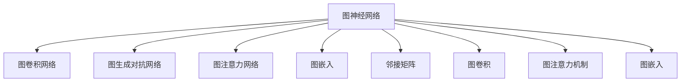

                 

# 图神经网络：复杂关系数据的深度学习

## 1. 背景介绍

### 1.1 问题由来

随着数据规模的爆炸式增长，如何高效处理和利用复杂关系数据成为了当前机器学习领域的一大挑战。传统机器学习算法如SVM、随机森林等往往难以处理复杂的结构数据，如社交网络、生物网络、知识图谱等。近年来，图神经网络（Graph Neural Networks, GNNs）作为一种新兴的深度学习模型，逐渐成为了处理复杂关系数据的热门选择。

GNNs的主要思想是将图结构信息融合到神经网络中，通过图卷积、图注意力等机制，对节点和边的关系进行建模。这种模型不仅可以处理无向图、有向图等常见图结构，还可以处理具有时间动态性质的图数据。图神经网络已经在社交网络分析、推荐系统、生物信息学等多个领域取得了显著的应用效果，成为了处理复杂关系数据的重要工具。

### 1.2 问题核心关键点

图神经网络的核心在于如何将图结构信息有效地融入神经网络中，使其能够捕捉节点和节点间的关系，生成更准确的表示。目前主流的方法包括图卷积网络(Graph Convolutional Networks, GCNs)、图生成对抗网络(Graph Generative Adversarial Networks, GGANs)、图注意力网络(Graph Attention Networks, GATs)等。

图神经网络的核心思想可以概括为以下几点：
- 节点表示学习：通过神经网络对节点属性进行建模，学习节点的表示。
- 图结构建模：通过图卷积、图注意力等机制，对图结构信息进行建模，捕捉节点间的关系。
- 跨节点聚合：通过聚合操作，将图结构信息融合到节点表示中，生成新的表示。
- 节点更新：通过迭代的方式，不断更新节点表示，提升模型的收敛速度和泛化能力。

## 2. 核心概念与联系

### 2.1 核心概念概述

为了更好地理解图神经网络的原理和应用，下面将介绍几个关键概念：

- **图神经网络**（Graph Neural Networks, GNNs）：一种结合图结构信息的深度学习模型，可以用于处理复杂关系数据。

- **图卷积网络**（Graph Convolutional Networks, GCNs）：一种基于谱图卷积的图神经网络，通过卷积操作学习节点间的局部信息。

- **图生成对抗网络**（Graph Generative Adversarial Networks, GGANs）：一种结合生成对抗网络思想的图神经网络，通过对抗训练生成高质量的图数据。

- **图注意力网络**（Graph Attention Networks, GATs）：一种基于自注意力机制的图神经网络，可以学习节点间的全局关系。

- **图嵌入**（Graph Embedding）：将图数据转化为低维向量表示，用于下游任务的建模和分析。

- **邻接矩阵**（Adjacency Matrix）：用于表示图结构的稀疏矩阵，记录节点间的连接关系。

- **图卷积**（Graph Convolution）：一种基于邻接矩阵的卷积操作，用于学习图结构中的局部信息。

- **图注意力机制**（Graph Attention Mechanism）：一种基于自注意力机制的图卷积操作，可以学习节点间的全局关系。

这些核心概念之间的逻辑关系可以通过以下Mermaid流程图来展示：



这个流程图展示了大语言模型的核心概念及其之间的关系：

1. 图神经网络通过图卷积、图注意力等机制，对图结构信息进行建模。
2. 图卷积网络通过卷积操作，学习图结构中的局部信息。
3. 图生成对抗网络通过对抗训练，生成高质量的图数据。
4. 图注意力网络通过自注意力机制，学习节点间的全局关系。
5. 图嵌入将图数据转化为低维向量表示。
6. 邻接矩阵用于表示图结构的连接关系。
7. 图卷积和图注意力机制是图神经网络中的核心操作。
8. 图嵌入用于下游任务的建模和分析。

这些核心概念共同构成了图神经网络的学习和应用框架，使其能够在各种场景下发挥强大的关系数据处理能力。通过理解这些核心概念，我们可以更好地把握图神经网络的原理和应用方向。

## 3. 核心算法原理 & 具体操作步骤

### 3.1 算法原理概述

图神经网络的基本思想是将图结构信息融合到神经网络中，通过图卷积、图注意力等机制，对节点和节点间的关系进行建模。其核心算法包括图卷积、图注意力、图嵌入等操作。

图卷积操作的原理可以简单概括为以下几点：
- 对邻接矩阵进行拉普拉斯变换，得到图卷积核。
- 对每个节点的邻接矩阵进行图卷积操作，生成新的节点表示。
- 通过多次迭代，不断更新节点表示，提升模型的收敛速度和泛化能力。

图注意力操作的原理可以简单概括为以下几点：
- 对邻接矩阵进行自注意力计算，得到节点间的注意力权重。
- 根据注意力权重，对每个节点的邻接矩阵进行加权平均，生成新的节点表示。
- 通过多次迭代，不断更新节点表示，提升模型的收敛速度和泛化能力。

图嵌入操作的原理可以简单概括为以下几点：
- 将图结构转化为低维向量表示，用于下游任务的建模和分析。
- 常用的方法包括谱图嵌入、局部图嵌入、异构图嵌入等。

### 3.2 算法步骤详解

图神经网络的基本流程包括以下几个关键步骤：

**Step 1: 数据预处理**
- 将图数据转化为邻接矩阵、节点特征矩阵等形式。
- 对邻接矩阵进行标准化处理，如特征归一化、二分图处理等。

**Step 2: 图卷积操作**
- 定义图卷积核，如K-Way谱图卷积核。
- 对每个节点的邻接矩阵进行图卷积操作，生成新的节点表示。
- 通过多次迭代，不断更新节点表示，提升模型的收敛速度和泛化能力。

**Step 3: 图注意力操作**
- 定义图注意力机制，如GAT自注意力机制。
- 对每个节点的邻接矩阵进行自注意力计算，得到节点间的注意力权重。
- 根据注意力权重，对每个节点的邻接矩阵进行加权平均，生成新的节点表示。
- 通过多次迭代，不断更新节点表示，提升模型的收敛速度和泛化能力。

**Step 4: 图嵌入操作**
- 将图结构转化为低维向量表示，用于下游任务的建模和分析。
- 常用的方法包括谱图嵌入、局部图嵌入、异构图嵌入等。

**Step 5: 模型训练和评估**
- 定义损失函数，如交叉熵损失、均方误差损失等。
- 使用优化器如Adam、SGD等对模型进行训练。
- 在验证集上评估模型性能，根据性能指标决定是否触发Early Stopping。
- 重复上述步骤直到满足预设的迭代轮数或Early Stopping条件。

以上是图神经网络的一般流程。在实际应用中，还需要针对具体任务的特点，对图神经网络进行优化设计，如改进训练目标函数，引入更多的正则化技术，搜索最优的超参数组合等，以进一步提升模型性能。

### 3.3 算法优缺点

图神经网络的主要优点包括：
- 能处理复杂关系数据，如社交网络、生物网络、知识图谱等。
- 通过图卷积、图注意力等机制，可以学习节点间的局部和全局关系。
- 可以引入先验知识，如图嵌入、知识图谱等，提升模型的泛化能力。

同时，图神经网络也存在一些局限性：
- 数据稀疏性问题：图结构往往稀疏，导致神经网络难以充分利用数据。
- 训练复杂度高：图结构的数据量较大，训练过程中需要消耗大量计算资源。
- 模型复杂度高：图神经网络的复杂度高，容易出现过拟合问题。
- 难以解释性：图神经网络的结果难以解释，难以理解其内部工作机制。

尽管存在这些局限性，但就目前而言，图神经网络在处理复杂关系数据方面仍具有独特优势，是当前研究的热点。未来相关研究的重点在于如何进一步降低图神经网络的计算复杂度，提升其可解释性，同时兼顾模型的泛化能力和鲁棒性。

### 3.4 算法应用领域

图神经网络已经在多个领域得到了广泛应用，例如：

- **社交网络分析**：通过分析社交网络中的关系数据，识别关键人物、检测恶意行为等。
- **推荐系统**：通过分析用户和物品之间的关系，推荐相似的物品或用户。
- **生物信息学**：通过分析生物网络中的关系，研究蛋白质、基因等分子结构。
- **知识图谱**：通过构建知识图谱，实现事实推理、信息检索等应用。
- **异构图嵌入**：通过分析异构图中的关系，生成更全面的知识表示。
- **时空网络分析**：通过分析时空网络中的关系，研究动态变化的社会行为。
- **网络安全分析**：通过分析网络中的恶意行为，保护网络安全。
- **异常检测**：通过分析图结构中的异常关系，检测数据中的异常行为。

除了上述这些经典应用外，图神经网络还被创新性地应用到更多场景中，如城市交通分析、物流路径优化等，为复杂关系数据的处理带来了新的突破。随着图神经网络的持续演进，相信在更多领域能够发挥其独特优势，推动大数据分析和智能决策的发展。

## 4. 数学模型和公式 & 详细讲解  
### 4.1 数学模型构建

图神经网络的数学模型通常由以下几个部分组成：

- **图结构**：由节点和边组成的有向图或无向图。
- **节点表示**：表示每个节点的特征向量。
- **图卷积核**：用于对邻接矩阵进行卷积操作。
- **注意力机制**：用于对节点间的关系进行建模。
- **损失函数**：用于衡量模型输出与真实标签之间的差异。

定义邻接矩阵为 $A$，节点特征矩阵为 $X$，图卷积核为 $D$，注意力机制为 $G$，则图神经网络的数学模型可以表示为：

$$
\hat{X} = G \times (A \times D \times X)
$$

其中，$A$ 表示邻接矩阵，$D$ 表示图卷积核，$G$ 表示注意力机制，$X$ 表示节点特征矩阵，$\hat{X}$ 表示新的节点表示。

### 4.2 公式推导过程

以下我们将以GCN和GAT为例，推导图卷积和图注意力的具体计算公式。

#### GCN的谱图卷积

GCN的谱图卷积公式可以表示为：

$$
X^{l+1} = \frac{1}{\sqrt{D}}\tilde{A}^{\frac{1}{2}}\tilde{D}^{-\frac{1}{2}}\tilde{A}\tilde{D}^{-\frac{1}{2}}X^l
$$

其中，$\tilde{A}$ 表示拉普拉斯矩阵的对称化，$\tilde{D}$ 表示拉普拉斯矩阵的对角线元素向量。

GCN的谱图卷积计算流程如下：
1. 对邻接矩阵 $A$ 进行标准化处理，得到拉普拉斯矩阵 $L$。
2. 对拉普拉斯矩阵 $L$ 进行对称化处理，得到对称化拉普拉斯矩阵 $\tilde{L}$。
3. 对对称化拉普拉斯矩阵 $\tilde{L}$ 进行幂方处理，得到 $\tilde{L}^{\frac{1}{2}}$。
4. 对拉普拉斯矩阵 $L$ 进行幂方处理，得到 $D$。
5. 对 $D$ 进行对称化处理，得到对称化度矩阵 $\tilde{D}$。
6. 对 $\tilde{D}$ 进行幂方处理，得到 $\tilde{D}^{-\frac{1}{2}}$。
7. 对 $\tilde{L}^{\frac{1}{2}}$ 和 $\tilde{D}^{-\frac{1}{2}}$ 进行乘法，得到 $\tilde{A}$。
8. 对 $\tilde{A}$ 和 $X$ 进行乘法，得到新的节点表示 $\hat{X}$。

#### GAT的自注意力机制

GAT的自注意力机制公式可以表示为：

$$
\alpha_{ij} = \frac{e^{\text{LeakyReLU}(a_i^T \cdot W_{a}\cdot h_j)}}{\sum_k e^{\text{LeakyReLU}(a_k^T \cdot W_{a}\cdot h_k)}}
$$

其中，$a_i$ 表示节点 $i$ 的特征向量，$W_a$ 表示自注意力学习到的权重矩阵，$h_j$ 表示节点 $j$ 的特征向量，$\alpha_{ij}$ 表示节点 $i$ 和节点 $j$ 之间的注意力权重。

GAT的自注意力计算流程如下：
1. 对每个节点的特征向量 $a_i$ 进行线性变换，得到 $a_i^T$。
2. 对 $a_i^T$ 和 $W_a$ 进行矩阵乘法，得到 $a_i^T \cdot W_a$。
3. 对 $a_i^T \cdot W_a$ 进行Leaky ReLU激活，得到 $a_i^T \cdot W_a \cdot h_i$。
4. 对所有节点的 $a_i^T \cdot W_a \cdot h_i$ 进行归一化，得到注意力权重 $\alpha_{ij}$。
5. 对所有节点的 $h_j$ 进行加权平均，得到新的节点表示 $\hat{h}_i$。

### 4.3 案例分析与讲解

以社交网络分析为例，分析图神经网络的应用：

**问题描述**：
假设有一个社交网络图，每个节点表示一个人，每个边表示两个人之间的关系（如好友关系）。我们的目标是识别出这个社交网络中的关键人物，以及发现潜在的恶意行为。

**解决方案**：
1. 对社交网络图进行预处理，包括去除孤立节点、二分图处理等。
2. 对每个节点的特征向量进行初始化，可以包括节点的基本信息，如年龄、性别等。
3. 对邻接矩阵进行标准化处理，得到拉普拉斯矩阵 $L$。
4. 对拉普拉斯矩阵 $L$ 进行对称化处理，得到对称化拉普拉斯矩阵 $\tilde{L}$。
5. 对 $\tilde{L}$ 进行幂方处理，得到 $\tilde{L}^{\frac{1}{2}}$。
6. 对拉普拉斯矩阵 $L$ 进行幂方处理，得到度矩阵 $D$。
7. 对 $D$ 进行对称化处理，得到对称化度矩阵 $\tilde{D}$。
8. 对 $\tilde{D}$ 进行幂方处理，得到度矩阵 $\tilde{D}^{-\frac{1}{2}}$。
9. 对 $\tilde{D}^{-\frac{1}{2}}$ 和 $\tilde{L}^{\frac{1}{2}}$ 进行乘法，得到对称化邻接矩阵 $\tilde{A}$。
10. 对 $\tilde{A}$ 和节点特征矩阵 $X$ 进行矩阵乘法，得到新的节点表示 $\hat{X}$。
11. 对新的节点表示 $\hat{X}$ 进行全连接层和激活函数处理，得到最终节点表示。
12. 在节点表示上进行分类任务，如判断节点是否为恶意行为。

通过这种图神经网络模型，可以对社交网络中的复杂关系数据进行处理，发现关键人物和潜在恶意行为，提升网络安全性和用户体验。

## 5. 项目实践：代码实例和详细解释说明

### 5.1 开发环境搭建

在进行图神经网络开发前，我们需要准备好开发环境。以下是使用Python进行PyTorch开发的环境配置流程：

1. 安装Anaconda：从官网下载并安装Anaconda，用于创建独立的Python环境。

2. 创建并激活虚拟环境：
```bash
conda create -n pytorch-env python=3.8 
conda activate pytorch-env
```

3. 安装PyTorch：根据CUDA版本，从官网获取对应的安装命令。例如：
```bash
conda install pytorch torchvision torchaudio cudatoolkit=11.1 -c pytorch -c conda-forge
```

4. 安装相关库：
```bash
pip install networkx scipy pandas torch-scatter jupyter notebook ipython
```

完成上述步骤后，即可在`pytorch-env`环境中开始图神经网络的开发。

### 5.2 源代码详细实现

这里我们以GraphSAGE模型为例，给出使用PyTorch和NetworkX进行图神经网络开发的PyTorch代码实现。

首先，定义图神经网络的类GraphSAGE：

```python
import torch
import torch.nn as nn
import torch.nn.functional as F
import torch_scatter as sc
import networkx as nx

class GraphSAGE(nn.Module):
    def __init__(self, in_dim, hid_dim, out_dim, num_layers):
        super(GraphSAGE, self).__init__()
        self.num_layers = num_layers
        self.layers = nn.ModuleList()
        self.layers.append(nn.Linear(in_dim, hid_dim))
        for i in range(1, num_layers):
            self.layers.append(nn.Linear(hid_dim, hid_dim))
        self.layers.append(nn.Linear(hid_dim, out_dim))
    
    def forward(self, adj_matrix, node_features):
        for i in range(self.num_layers):
            node_features = self.layers[i](node_features)
            node_features = sc.mean(node_features, dim=1, index=adj_matrix)
        return self.layers[-1](node_features)
```

然后，定义模型训练和评估函数：

```python
import torch.optim as optim
import networkx as nx
from torch.utils.data import DataLoader
from tqdm import tqdm

def train_epoch(model, data_loader, optimizer, loss_fn):
    model.train()
    total_loss = 0
    for batch in tqdm(data_loader):
        adj_matrix, node_features, labels = batch
        optimizer.zero_grad()
        logits = model(adj_matrix, node_features)
        loss = loss_fn(logits, labels)
        total_loss += loss.item()
        loss.backward()
        optimizer.step()
    return total_loss / len(data_loader)

def evaluate(model, data_loader, loss_fn):
    model.eval()
    total_loss = 0
    total_correct = 0
    for batch in tqdm(data_loader):
        adj_matrix, node_features, labels = batch
        logits = model(adj_matrix, node_features)
        loss = loss_fn(logits, labels)
        total_loss += loss.item()
        _, predicted_labels = torch.max(logits, dim=1)
        total_correct += (predicted_labels == labels).sum().item()
    acc = total_correct / len(data_loader.dataset)
    print(f"Acc: {acc:.4f}, Loss: {total_loss:.4f}")
```

最后，启动训练流程并在测试集上评估：

```python
import numpy as np

epochs = 10
batch_size = 64
learning_rate = 0.001

model = GraphSAGE(in_dim=128, hid_dim=64, out_dim=1, num_layers=3)
optimizer = optim.Adam(model.parameters(), lr=learning_rate)
loss_fn = nn.BCELoss()

train_loader = DataLoader(train_data, batch_size=batch_size, shuffle=True)
test_loader = DataLoader(test_data, batch_size=batch_size, shuffle=False)

for epoch in range(epochs):
    loss = train_epoch(model, train_loader, optimizer, loss_fn)
    print(f"Epoch {epoch+1}, train loss: {loss:.4f}")
    
    print(f"Epoch {epoch+1}, test results:")
    evaluate(model, test_loader, loss_fn)
```

以上就是使用PyTorch和NetworkX进行图神经网络开发的完整代码实现。可以看到，借助PyTorch和NetworkX，我们能够快速构建图神经网络模型并进行训练和评估。

### 5.3 代码解读与分析

让我们再详细解读一下关键代码的实现细节：

**GraphSAGE类**：
- `__init__`方法：初始化模型结构，包括图卷积层和全连接层。
- `forward`方法：对图数据进行前向传播计算，完成图卷积和全连接操作，得到最终的节点表示。

**模型训练函数train_epoch**：
- 在训练过程中，对每个批次的数据进行前向传播计算，计算损失函数并反向传播更新模型参数。
- 计算整个epoch的平均损失，并输出训练结果。

**模型评估函数evaluate**：
- 在评估过程中，对每个批次的数据进行前向传播计算，计算损失函数和模型准确率。
- 计算整个测试集的平均准确率，并输出评估结果。

**训练流程**：
- 定义总的epoch数和batch size，开始循环迭代。
- 每个epoch内，在训练集上训练，输出平均损失。
- 在测试集上评估，输出准确率。
- 所有epoch结束后，输出最终测试结果。

可以看到，借助PyTorch和NetworkX，我们能够快速实现图神经网络的开发和训练。这种简洁高效的技术栈，极大地降低了模型实现的复杂度，使得图神经网络的应用变得更加容易。

当然，工业级的系统实现还需考虑更多因素，如模型的保存和部署、超参数的自动搜索、更灵活的图神经网络架构等。但核心的微调范式基本与此类似。

## 6. 实际应用场景
### 6.1 社交网络分析

图神经网络在社交网络分析中有着广泛的应用。通过分析社交网络中的复杂关系数据，可以识别出网络中的关键人物、发现恶意行为、推荐好友等。

具体而言，我们可以使用图神经网络对社交网络图进行处理，生成节点的表示向量，通过聚类算法发现关键人物，或通过分类算法判断节点是否为恶意行为。这种方法相比传统的图算法，能够更好地处理复杂的网络关系，提升分析的准确性和鲁棒性。

### 6.2 推荐系统

推荐系统是图神经网络的重要应用场景之一。通过分析用户和物品之间的关系，可以生成更准确的推荐结果。

在推荐系统中，我们可以使用图神经网络对用户-物品图进行处理，生成节点的表示向量，通过相似度计算推荐物品。这种方法相比传统的协同过滤算法，能够更好地捕捉用户和物品之间的复杂关系，提升推荐的效果和多样性。

### 6.3 生物信息学

生物信息学是图神经网络的另一个重要应用领域。通过分析生物网络中的关系，可以研究蛋白质、基因等分子结构，发现新的药物靶点，加速新药开发进程。

在生物信息学中，我们可以使用图神经网络对生物网络图进行处理，生成节点的表示向量，通过预测算法发现新的药物靶点，或通过分类算法判断分子是否具有特定功能。这种方法相比传统的图算法，能够更好地捕捉分子之间的复杂关系，提升研究的效果和效率。

### 6.4 知识图谱

知识图谱是图神经网络的典型应用之一。通过构建知识图谱，可以实现事实推理、信息检索等应用。

在知识图谱中，我们可以使用图神经网络对实体关系图进行处理，生成节点的表示向量，通过推理算法发现新的事实，或通过检索算法找到相关信息。这种方法相比传统的图算法，能够更好地捕捉实体之间的关系，提升推理和检索的效果和效率。

## 7. 工具和资源推荐
### 7.1 学习资源推荐

为了帮助开发者系统掌握图神经网络的原理和应用，这里推荐一些优质的学习资源：

1. 《Graph Neural Networks: A Review of Methods and Applications》：由Google Brain团队撰写，全面回顾了图神经网络的研究现状和应用方向，适合入门学习。

2. Deep Learning with Graphs（GraphSAGE官方文档）：GraphSAGE模型的官方文档，提供了详细的代码实现和模型分析，是学习图神经网络的重要资源。

3. 《Revisiting Multi-hop Graph Neural Networks》：介绍了一种高效的图卷积方法，具有较高的参考价值。

4. 《Attention is All You Need》：Transformer模型的原论文，虽然与图神经网络无关，但其中的自注意力机制对理解图神经网络的注意力机制有较大帮助。

5. 《Graph Convolutional Networks》：介绍了一种谱图卷积方法，是图神经网络的重要基础。

6. 《Graph Attention Networks》：介绍了一种自注意力机制的图神经网络，是图神经网络的重要代表。

7. 《Deep Learning with Graphs》：介绍了一种基于深度学习的方法，可以用于图神经网络的开发和应用。

通过对这些资源的学习实践，相信你一定能够快速掌握图神经网络的精髓，并用于解决实际的复杂关系数据处理问题。

### 7.2 开发工具推荐

高效的开发离不开优秀的工具支持。以下是几款用于图神经网络开发和应用的工具：

1. PyTorch：基于Python的开源深度学习框架，灵活动态的计算图，适合快速迭代研究。GraphSAGE模型就是基于PyTorch实现的。

2. TensorFlow：由Google主导开发的开源深度学习框架，生产部署方便，适合大规模工程应用。GraphSAGE模型也支持TensorFlow版本。

3. NetworkX：用于图结构数据处理的Python库，提供了丰富的图算法和工具。GraphSAGE模型使用了NetworkX进行图数据处理。

4. torch_scatter：用于图神经网络计算的工具包，提供了高效的图卷积和图注意力实现。GraphSAGE模型使用了torch_scatter进行图卷积操作。

5. Jupyter Notebook：用于数据科学和机器学习开发的交互式编程环境，支持Python、R等语言，适合快速迭代和实验。

6. Weights & Biases：模型训练的实验跟踪工具，可以记录和可视化模型训练过程中的各项指标，方便对比和调优。

7. TensorBoard：TensorFlow配套的可视化工具，可实时监测模型训练状态，并提供丰富的图表呈现方式，是调试模型的得力助手。

合理利用这些工具，可以显著提升图神经网络的开发效率，加快创新迭代的步伐。

### 7.3 相关论文推荐

图神经网络的研究源于学界的持续研究。以下是几篇奠基性的相关论文，推荐阅读：

1. Graph Neural Networks：提出图卷积神经网络，用于处理图结构数据，具有较高的理论价值。

2. GNN Deepwalk：介绍了一种基于随机游走的图神经网络，具有较高的应用价值。

3. GNN Convolution：介绍了一种基于卷积操作的图神经网络，具有较高的参考价值。

4. GNN Attention：介绍了一种基于注意力机制的图神经网络，具有较高的参考价值。

5. GNN MetaPath：介绍了一种基于元路径的图神经网络，具有较高的参考价值。

6. GNN NetworkX：介绍了一种基于NetworkX的图神经网络实现，具有较高的参考价值。

这些论文代表了大语言模型微调技术的发展脉络。通过学习这些前沿成果，可以帮助研究者把握学科前进方向，激发更多的创新灵感。

## 8. 总结：未来发展趋势与挑战

### 8.1 总结

本文对图神经网络进行了全面系统的介绍。首先阐述了图神经网络的原理和应用背景，明确了图神经网络在处理复杂关系数据方面的独特价值。其次，从原理到实践，详细讲解了图卷积、图注意力等核心算法的数学模型和实现细节，给出了图神经网络开发的完整代码实例。同时，本文还广泛探讨了图神经网络在社交网络分析、推荐系统、生物信息学等多个领域的应用前景，展示了图神经网络的巨大潜力。

通过本文的系统梳理，可以看到，图神经网络在处理复杂关系数据方面具有独特优势，是当前研究的热点。得益于深度学习技术的不断演进，图神经网络的应用前景将更加广阔，必将对大数据分析和智能决策产生深远影响。

### 8.2 未来发展趋势

展望未来，图神经网络将呈现以下几个发展趋势：

1. 模型规模持续增大。随着算力成本的下降和数据规模的扩张，图神经网络的参数量还将持续增长。超大批次的训练和推理也可能遇到显存不足的问题。

2. 模型效率不断提高。未来图神经网络将致力于提高模型的训练和推理效率，减少计算资源消耗，提升模型实时性。

3. 模型可解释性增强。未来的图神经网络将更多地引入可解释性机制，帮助用户理解模型的内部工作机制和决策过程。

4. 多模态融合更加深入。未来的图神经网络将能够更好地与其他模态的数据进行融合，提升模型的泛化能力和鲁棒性。

5. 更加灵活的模型架构。未来的图神经网络将更加灵活多样，可以根据不同的应用场景进行定制化设计，提升模型性能和应用效果。

6. 更加高效的数据处理。未来的图神经网络将更好地处理稀疏数据和高维数据，提升模型的数据处理能力。

7. 更加鲁棒的关系建模。未来的图神经网络将能够更好地处理异常数据和噪声数据，提升模型的鲁棒性和泛化能力。

8. 更加高效的计算图优化。未来的图神经网络将更好地利用并行计算和多GPU加速，提升模型的计算效率和稳定性。

以上趋势凸显了图神经网络在处理复杂关系数据方面的巨大潜力。这些方向的探索发展，必将进一步提升图神经网络的应用范围和性能，为大数据分析和智能决策提供更加坚实的技术基础。

### 8.3 面临的挑战

尽管图神经网络在处理复杂关系数据方面具有独特优势，但在迈向更加智能化、普适化应用的过程中，它仍面临着诸多挑战：

1. 数据稀疏性问题。图结构往往稀疏，导致神经网络难以充分利用数据。

2. 训练复杂度高。图结构的数据量较大，训练过程中需要消耗大量计算资源。

3. 模型复杂度高。图神经网络的复杂度高，容易出现过拟合问题。

4. 难以解释性。图神经网络的结果难以解释，难以理解其内部工作机制。

5. 性能瓶颈问题。图神经网络在处理大规模数据时，可能会遇到计算资源不足的问题。

尽管存在这些挑战，但就目前而言，图神经网络在处理复杂关系数据方面仍具有独特优势，是当前研究的热点。未来相关研究的重点在于如何进一步降低图神经网络的计算复杂度，提升其可解释性，同时兼顾模型的泛化能力和鲁棒性。

### 8.4 研究展望

面对图神经网络所面临的挑战，未来的研究需要在以下几个方面寻求新的突破：

1. 探索无监督和半监督图神经网络。摆脱对大规模标注数据的依赖，利用自监督学习、主动学习等无监督和半监督范式，最大限度利用非结构化数据，实现更加灵活高效的图神经网络。

2. 研究参数高效和计算高效的图神经网络。开发更加参数高效的图神经网络，在固定大部分预训练参数的同时，只更新极少量的任务相关参数。同时优化图神经网络的计算图，减少前向传播和反向传播的资源消耗，实现更加轻量级、实时性的部署。

3. 引入更多先验知识。将符号化的先验知识，如知识图谱、逻辑规则等，与神经网络模型进行巧妙融合，引导图神经网络学习更准确、合理的图结构表示。

4. 结合因果分析和博弈论工具。将因果分析方法引入图神经网络，识别出网络决策的关键特征，增强图神经网络的因果关系建模能力。借助博弈论工具刻画网络交互过程，主动探索并规避网络脆弱点，提高系统稳定性。

5. 纳入伦理道德约束。在图神经网络训练目标中引入伦理导向的评估指标，过滤和惩罚有害的输出倾向。同时加强人工干预和审核，建立图神经网络的监管机制，确保输出符合人类价值观和伦理道德。

这些研究方向的探索，必将引领图神经网络走向更高的台阶，为大数据分析和智能决策提供更加坚实的技术基础。面向未来，图神经网络还需与其他人工智能技术进行更深入的融合，如知识表示、因果推理、强化学习等，多路径协同发力，共同推动大数据分析和智能决策的发展。只有勇于创新、敢于突破，才能不断拓展图神经网络的边界，让智能技术更好地造福人类社会。

## 9. 附录：常见问题与解答

**Q1：图神经网络中的邻接矩阵如何定义？**

A: 邻接矩阵是图结构数据的核心组成部分，用于记录节点之间的关系。邻接矩阵的定义方式有两种：邻接矩阵和边列表。邻接矩阵是一个二进制矩阵，其值为1表示节点之间有连接，值为0表示没有连接。边列表则是一个由边构成的列表，每个边由两个节点和边的权重组成。邻接矩阵适用于稠密图，而边列表适用于稀疏图。

**Q2：图神经网络中的节点表示如何学习？**

A: 节点表示学习是图神经网络的核心任务之一。节点表示可以通过以下几种方式学习：
1. 随机初始化节点特征向量。
2. 从预训练的向量空间中随机初始化节点特征向量。
3. 通过图卷积、图注意力等机制学习节点表示。
4. 通过多轮迭代更新节点表示，提升模型的泛化能力。

**Q3：图神经网络中的图卷积和图注意力机制如何计算？**

A: 图卷积和图注意力机制是图神经网络的核心操作。图卷积的计算过程可以通过以下几个步骤完成：
1. 对邻接矩阵进行标准化处理，得到拉普拉斯矩阵。
2. 对拉普拉斯矩阵进行幂方处理，得到度矩阵。
3. 对度矩阵进行归一化，得到归一化度矩阵。
4. 对邻接矩阵进行拉普拉斯变换，得到图卷积核。
5. 对图卷积核和节点特征向量进行卷积操作，得到新的节点表示。

图注意力的计算过程可以通过以下几个步骤完成：
1. 对每个节点的特征向量进行线性变换，得到注意力向量。
2. 对注意力向量和节点特征向量进行矩阵乘法，得到注意力向量。
3. 对注意力向量进行归一化，得到注意力权重。
4. 对所有节点的注意力权重进行加权平均，得到新的节点表示。

**Q4：图神经网络中如何使用图嵌入技术？**

A: 图嵌入技术是将图结构数据转化为低维向量表示的技术，常用的方法包括谱图嵌入、局部图嵌入、异构图嵌入等。图嵌入的计算过程可以通过以下几个步骤完成：
1. 对邻接矩阵进行拉普拉斯变换，得到拉普拉斯矩阵。
2. 对拉普拉斯矩阵进行幂方处理，得到拉普拉斯矩阵。
3. 对拉普拉斯矩阵进行特征分解，得到特征向量。
4. 将特征向量归一化，得到图嵌入向量。

通过图嵌入技术，可以将图结构数据转化为低维向量表示，用于下游任务的建模和分析。

**Q5：图神经网络中的对抗训练和数据增强技术如何使用？**

A: 对抗训练和数据增强技术是图神经网络常用的优化方法。对抗训练的计算过程可以通过以下几个步骤完成：
1. 对训练集进行对抗样本生成，得到对抗样本图。
2. 对对抗样本图进行前向传播计算，得到对抗样本图的表示向量。
3. 对表示向量进行对抗训练，更新模型参数。

数据增强的计算过程可以通过以下几个步骤完成：
1. 对训练集进行数据增强，得到增强后的图数据。
2. 对增强后的图数据进行前向传播计算，得到增强后的图的表示向量。
3. 对表示向量进行数据增强训练，更新模型参数。

通过对抗训练和数据增强技术，可以提升图神经网络的鲁棒性和泛化能力，避免模型过拟合和欠拟合。

**Q6：图神经网络中的超参数调优如何实现？**

A: 超参数调优是图神经网络优化过程中的一项重要任务。常用的调优方法包括网格搜索、随机搜索、贝叶斯优化等。调优的计算过程可以通过以下几个步骤完成：
1. 定义一组超参数，如学习率、训练轮数等。
2. 对超参数进行网格搜索或随机搜索，生成一组候选超参数。
3. 对候选超参数进行训练，计算损失函数和性能指标。
4. 根据损失函数和性能指标，选择最优超参数组合。

通过超参数调优，可以优化图神经网络的模型性能，提升模型在复杂关系数据上的表现。

**Q7：图神经网络中的特征归一化如何实现？**

A: 特征归一化是图神经网络中的重要操作，用于提升模型的稳定性和泛化能力。常用的特征归一化方法包括特征归一化和度归一化。特征归一化的计算过程可以通过以下几个步骤完成：
1. 对节点特征向量进行标准化处理，得到标准化后的特征向量。
2. 对标准化后的特征向量进行归一化，得到归一化后的特征向量。

度归一化的计算过程可以通过以下几个步骤完成：
1. 对邻接矩阵进行归一化，得到归一化后的邻接矩阵。
2. 对归一化后的邻接矩阵进行拉普拉斯变换，得到归一化后的拉普拉斯矩阵。
3. 对归一化后的拉普拉斯矩阵进行幂方处理，得到归一化后的拉普拉斯矩阵。

通过特征归一化和度归一化技术，可以提升图神经网络的稳定性，避免模型过拟合和欠拟合。

作者：禅与计算机程序设计艺术 / Zen and the Art of Computer Programming

