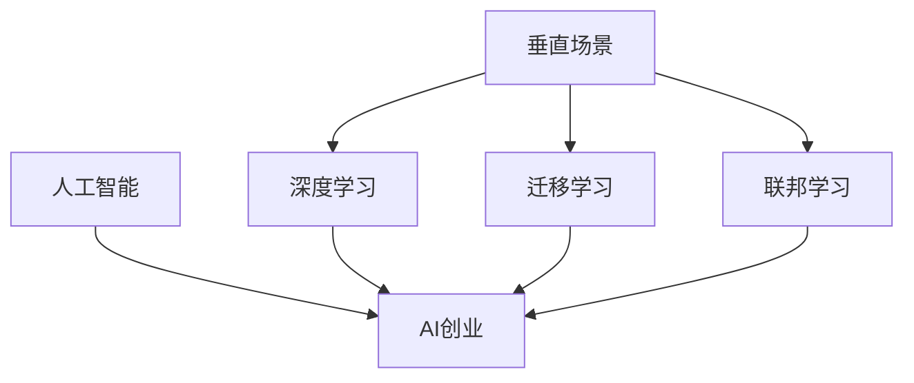

                 

# 垂直场景与AI创业的结合

## 1. 背景介绍

### 1.1 问题由来
人工智能(AI)技术正在加速渗透各行各业，为传统企业带来了巨大的变革机遇。垂直场景，即特定领域或行业，由于其复杂性和专业性，对AI技术提出了更高的要求。AI创业，即利用AI技术解决特定领域的问题，创新商业模式的创业活动，已成为近年来热门话题。

本文旨在探讨如何将AI技术与垂直场景相结合，通过AI创业实现企业的数字化转型和业务创新。我们认为，要想在垂直场景中取得成功，AI创业必须充分利用行业知识、数据资源和商业模式的多样性，将AI技术深度嵌入到具体的应用场景中，实现技术与业务的深度融合。

### 1.2 问题核心关键点
垂直场景与AI创业的结合，核心在于以下几个方面：
- 行业知识与AI技术的深度融合：将行业专家的知识和经验，通过数据驱动的方式融入AI模型，提升模型的泛化能力和实用性。
- 数据资源的高效利用：收集、清洗、分析、应用垂直场景下的数据，为AI模型提供高质量的训练样本，加速模型迭代优化。
- 商业模式的创新应用：结合行业特点，设计符合特定业务需求的新型商业模式，最大化AI技术的商业价值。
- 生态系统的构建：建立企业与AI技术提供商、行业专家、合作伙伴等多方协同的生态系统，推动AI技术在垂直场景中的快速落地和应用。

本文将从这些关键点出发，深入分析垂直场景与AI创业的结合路径，并提供实际应用案例，以期为AI创业者和垂直场景的企业提供有益的参考和指导。

## 2. 核心概念与联系

### 2.1 核心概念概述

为更好地理解垂直场景与AI创业的结合，本节将介绍几个密切相关的核心概念：

- 人工智能(AI)：利用计算机算法和模型，模拟人类智能行为的技术。AI技术包括机器学习、深度学习、自然语言处理、计算机视觉等众多分支。
- 垂直场景(Vertical Scenarios)：指特定行业或领域的应用场景，如医疗、金融、制造、教育等。垂直场景通常具有专业性强、数据量丰富、业务需求多样等特点。
- AI创业(AI Entrepreneurship)：指利用AI技术解决特定行业问题，创新商业模式，实现业务创新的创业活动。AI创业通常需要跨学科的知识、技术、业务和市场理解。
- 深度学习(Deep Learning)：利用多层神经网络，通过大量数据训练，学习到高层次的抽象特征和复杂的非线性关系，适用于处理高维度、复杂结构的数据。
- 迁移学习(Transfer Learning)：指将在一个任务上训练好的模型参数，迁移到另一个相关任务上进行微调，提升模型在新任务上的性能。
- 联邦学习(Federated Learning)：指多参与方在不共享本地数据的情况下，通过聚合梯度的方式进行模型训练，保障数据隐私和安全。

这些核心概念之间的逻辑关系可以通过以下Mermaid流程图来展示：



这个流程图展示了大语言模型微调的几个核心概念及其之间的关系：

1. AI技术是垂直场景与AI创业的桥梁，通过深度学习、迁移学习、联邦学习等方法，可以实现特定场景的AI应用。
2. 深度学习为AI创业提供了强大的技术支撑，能够在复杂数据上学习到高层次的特征表示。
3. 迁移学习将模型在不同场景间进行迁移，利用已有知识提升新任务性能。
4. 联邦学习保护数据隐私，适用于需要多方协同训练的复杂场景。

这些概念共同构成了垂直场景与AI创业的理论基础，指导我们如何将AI技术高效地应用于特定场景，实现业务创新。

## 3. 核心算法原理 & 具体操作步骤
### 3.1 算法原理概述

垂直场景与AI创业的结合，核心在于将AI技术与特定行业的需求相结合，设计出能够满足行业特点的AI应用。以下我们将以医疗行业为例，介绍一种具体的AI创业路径。

在医疗行业，医生面对海量患者的病历数据，需要进行复杂的诊断和治疗方案设计。传统做法依赖医生的经验和技术，但面临工作负担重、诊断准确性难以保障等问题。AI创业可以从以下几个方面入手：

1. **数据收集与清洗**：收集医生以往的诊断记录、治疗方案、患者信息等数据，进行清洗和标注，构建数据集。
2. **模型构建与训练**：利用深度学习技术，构建能够自动学习患者特征和诊断规则的模型，如卷积神经网络(CNN)、循环神经网络(RNN)、长短期记忆网络(LSTM)等。
3. **迁移学习与微调**：在已有模型基础上，利用迁移学习技术，将其应用于新的诊断场景，通过微调提升模型在新场景中的性能。
4. **模型评估与部署**：在实际应用中，对模型进行评估，验证其诊断准确性和泛化能力，将其部署到医生工作平台，实现智能辅助诊断。

### 3.2 算法步骤详解

以智能辅助诊断系统为例，以下是一个基于垂直场景的AI创业路径：

**Step 1: 数据准备**
- 收集医生的以往诊断记录和患者信息，构建数据集。
- 对数据进行清洗和标注，去除噪音数据，确保数据质量。

**Step 2: 模型构建**
- 设计适合医疗场景的深度学习模型，如CNN、RNN等。
- 使用GPU/TPU等高性能计算设备进行模型训练。

**Step 3: 迁移学习与微调**
- 选择已有医学领域的预训练模型，如ResNet、Inception等。
- 利用迁移学习技术，在预训练模型基础上进行微调，提升模型在特定诊断场景中的性能。

**Step 4: 模型评估与部署**
- 在医生工作平台中集成智能辅助诊断系统，实时获取医生输入的患者数据。
- 利用模型对患者数据进行分析，给出诊断建议和治疗方案。
- 定期评估模型的诊断准确性，持续优化模型性能。

**Step 5: 生态系统构建**
- 与医院、医生、患者建立合作关系，获取更多数据，丰富模型训练样本。
- 结合医院管理信息系统和电子病历系统，实现数据共享和业务协同。
- 定期进行模型更新和维护，保障系统稳定运行。

### 3.3 算法优缺点

基于垂直场景的AI创业方法具有以下优点：
1. **专业性强**：针对特定行业的特点进行模型设计和应用，能够更好地适应行业需求。
2. **数据质量高**：垂直场景下，数据收集和标注更为精细，数据质量更高。
3. **生态系统完善**：通过多方协同，构建完善的数据、技术、业务生态系统，提升系统可用性和可靠性。

但该方法也存在一定的局限性：
1. **数据获取难度大**：垂直场景下，数据获取难度较大，可能存在数据偏斜和样本不足的问题。
2. **模型泛化能力有限**：由于垂直场景的多样性和复杂性，模型泛化能力可能受到限制。
3. **技术和业务融合难**：AI创业需要跨学科的知识和技能，技术复杂度较高，业务理解也需深入。

尽管存在这些局限性，但整体而言，基于垂直场景的AI创业方法仍是大数据时代的重要趋势，能够实现AI技术与业务的深度融合，带来更多的商业价值。

### 3.4 算法应用领域

基于垂直场景的AI创业方法，已在多个领域得到了广泛应用，例如：

- 医疗：智能诊断、医学影像分析、个性化治疗方案设计等。
- 金融：风险控制、信用评估、智能投顾等。
- 制造：质量检测、故障预测、生产流程优化等。
- 教育：个性化学习、智能作业批改、学习行为分析等。
- 零售：需求预测、库存管理、客户行为分析等。

这些应用场景展示了AI创业在垂直场景中的广阔前景，推动了各行各业的数字化转型和创新发展。

## 4. 数学模型和公式 & 详细讲解 & 举例说明

### 4.1 数学模型构建

假设我们构建了一个深度学习模型，用于预测患者的某种疾病的风险。设模型的输入为患者的基本信息 $x$，输出为疾病风险 $y$。数学模型可表示为：

$$
y = f(x; \theta)
$$

其中 $f$ 为模型函数，$\theta$ 为模型参数。

### 4.2 公式推导过程

对于一个二分类问题，我们通常使用逻辑回归或支持向量机等算法。以下以逻辑回归为例，介绍其公式推导过程。

假设模型 $f(x; \theta) = \sigma(\theta^T x)$，其中 $\sigma$ 为sigmoid函数。损失函数定义为：

$$
\mathcal{L}(y, f(x; \theta)) = -\frac{1}{N} \sum_{i=1}^N (y_i \log f(x_i; \theta) + (1-y_i) \log (1-f(x_i; \theta)))
$$

其中 $N$ 为样本数量，$y_i \in \{0,1\}$ 为真实标签，$f(x_i; \theta)$ 为模型输出。

根据梯度下降算法，模型参数的更新公式为：

$$
\theta \leftarrow \theta - \eta \nabla_{\theta} \mathcal{L}(y, f(x; \theta))
$$

其中 $\eta$ 为学习率，$\nabla_{\theta} \mathcal{L}(y, f(x; \theta))$ 为损失函数对模型参数的梯度。

### 4.3 案例分析与讲解

以智能辅助诊断系统为例，我们可以将患者的症状、病史等信息作为输入 $x$，模型输出为患病概率 $y$。在模型训练阶段，我们利用大量医疗数据进行训练，优化模型参数 $\theta$，使其能够准确预测患者的疾病风险。

在实际应用中，当医生输入患者的症状、病史等信息后，系统自动调用模型进行预测，输出患病概率。医生可以根据系统建议，结合自身经验，做出诊断决策。

## 5. 项目实践：代码实例和详细解释说明

### 5.1 开发环境搭建

在进行AI创业项目开发前，我们需要准备好开发环境。以下是使用Python进行TensorFlow开发的环境配置流程：

1. 安装Anaconda：从官网下载并安装Anaconda，用于创建独立的Python环境。

2. 创建并激活虚拟环境：
```bash
conda create -n tf-env python=3.8 
conda activate tf-env
```

3. 安装TensorFlow：根据CUDA版本，从官网获取对应的安装命令。例如：
```bash
conda install tensorflow -c pytorch -c conda-forge
```

4. 安装各类工具包：
```bash
pip install numpy pandas scikit-learn matplotlib tqdm jupyter notebook ipython
```

完成上述步骤后，即可在`tf-env`环境中开始AI创业项目开发。

### 5.2 源代码详细实现

下面我们以智能辅助诊断系统为例，给出使用TensorFlow进行模型开发的PyTorch代码实现。

首先，定义数据处理函数：

```python
import tensorflow as tf
from tensorflow.keras.datasets import mnist
from tensorflow.keras.utils import to_categorical

def load_data():
    (x_train, y_train), (x_test, y_test) = mnist.load_data()
    x_train = x_train.reshape(-1, 28*28) / 255.0
    x_test = x_test.reshape(-1, 28*28) / 255.0
    y_train = to_categorical(y_train, 10)
    y_test = to_categorical(y_test, 10)
    return (x_train, y_train), (x_test, y_test)
```

然后，定义模型和优化器：

```python
from tensorflow.keras import layers, models

def build_model(input_shape, num_classes):
    model = models.Sequential([
        layers.Flatten(input_shape=input_shape),
        layers.Dense(128, activation='relu'),
        layers.Dense(num_classes, activation='softmax')
    ])
    return model

def train_model(model, x_train, y_train, epochs, batch_size, validation_data=None):
    model.compile(optimizer='adam', loss='categorical_crossentropy', metrics=['accuracy'])
    model.fit(x_train, y_train, epochs=epochs, batch_size=batch_size, validation_data=validation_data)
    return model
```

接着，定义训练和评估函数：

```python
def evaluate_model(model, x_test, y_test):
    loss, acc = model.evaluate(x_test, y_test)
    print(f'Test loss: {loss:.2f}')
    print(f'Test accuracy: {acc:.2f}')
```

最后，启动训练流程并在测试集上评估：

```python
input_shape = (28, 28)
num_classes = 10
(x_train, y_train), (x_test, y_test) = load_data()

model = build_model(input_shape, num_classes)
model = train_model(model, x_train, y_train, epochs=10, batch_size=32, validation_data=(x_test, y_test))

evaluate_model(model, x_test, y_test)
```

以上就是使用TensorFlow进行智能辅助诊断系统开发的完整代码实现。可以看到，TensorFlow提供了强大的模型构建和训练功能，方便开发者进行复杂的模型设计和优化。

### 5.3 代码解读与分析

让我们再详细解读一下关键代码的实现细节：

**load_data函数**：
- 加载MNIST数据集，将像素值归一化到0-1之间，并将标签进行one-hot编码。

**build_model函数**：
- 定义一个包含两个全连接层的神经网络模型，第一层为Flatten层将输入展平，第二层为128个神经元的全连接层，输出层为10个神经元的softmax层。

**train_model函数**：
- 编译模型，选择adam优化器和交叉熵损失函数。
- 使用fit方法进行模型训练，设定epochs和batch_size，并可选传入验证集。

**evaluate_model函数**：
- 在测试集上评估模型性能，输出损失和准确率。

**训练流程**：
- 设定输入维度和类别数，加载数据。
- 构建模型，进行10轮训练，每批次32个样本。
- 在测试集上评估模型，输出结果。

可以看到，TensorFlow提供了简洁的API，可以方便地实现复杂的深度学习模型设计和训练。开发者只需专注于算法和模型结构的设计，TensorFlow会处理底层的计算和优化。

当然，工业级的系统实现还需考虑更多因素，如模型的保存和部署、超参数的自动搜索、更灵活的任务适配层等。但核心的AI创业流程基本与此类似。

## 6. 实际应用场景
### 6.1 智能医疗系统

基于AI创业的智能医疗系统，可以显著提升医疗服务的智能化水平，辅助医生诊疗，加速新药开发进程。

具体而言，可以收集医院的历史病历数据，利用深度学习技术构建智能诊断模型。在模型训练阶段，利用大量医疗数据进行训练，优化模型参数，使其能够准确预测患者的疾病风险。在实际应用中，当医生输入患者的症状、病史等信息后，系统自动调用模型进行预测，输出患病概率。医生可以根据系统建议，结合自身经验，做出诊断决策。

此外，智能医疗系统还可以结合医院管理信息系统和电子病历系统，实现数据共享和业务协同，进一步提升系统的实用性和可靠性。

### 6.2 智能金融分析

AI创业在金融领域的应用同样广泛，可以用于风险控制、信用评估、智能投顾等方面。

以智能投顾为例，系统可以收集用户的历史交易数据，利用深度学习技术构建风险评估模型。在模型训练阶段，利用大量历史交易数据进行训练，优化模型参数，使其能够准确预测用户的风险偏好。在实际应用中，系统根据用户的风险偏好和市场行情，提供个性化的投资建议。用户可以根据系统推荐，优化投资组合，实现资产增值。

智能金融分析还可以应用于风险控制和信用评估，通过模型分析用户的行为数据，预测其违约风险，帮助金融机构进行风险控制和信用评估。

### 6.3 智能制造系统

在制造领域，AI创业可以用于质量检测、故障预测、生产流程优化等方面。

以智能制造系统为例，系统可以收集工厂的生产数据，利用深度学习技术构建预测模型。在模型训练阶段，利用大量历史生产数据进行训练，优化模型参数，使其能够准确预测设备的故障风险和生产效率。在实际应用中，系统根据模型的预测结果，自动调整生产参数，优化生产流程。工厂可以根据系统推荐，实时监控设备状态，防止生产中断，提升生产效率和产品质量。

智能制造系统还可以应用于质量检测，通过模型分析生产过程中的数据，检测产品的质量缺陷，减少次品率。

### 6.4 未来应用展望

随着AI创业的不断发展，基于垂直场景的应用场景将不断扩展，为各行各业带来新的机遇和挑战。

未来，AI创业将更多地融合多模态数据，实现视觉、语音、文本等多种数据的协同处理。例如，智能医疗系统可以结合医疗影像数据和语音数据，提高诊断的准确性和全面性。智能金融分析可以结合交易数据和社交媒体数据，预测市场趋势和用户行为。智能制造系统可以结合传感器数据和物联网数据，优化生产流程和设备维护。

此外，AI创业还将结合更多的跨学科知识，推动技术的进步和应用的创新。例如，智能医疗系统可以结合生物学、化学等学科知识，开发新的治疗方案。智能金融分析可以结合经济学、心理学等学科知识，优化投资策略。智能制造系统可以结合机械工程、电子工程等学科知识，提升生产自动化水平。

## 7. 工具和资源推荐
### 7.1 学习资源推荐

为了帮助开发者系统掌握AI创业的理论基础和实践技巧，这里推荐一些优质的学习资源：

1. 《深度学习》（Ian Goodfellow等著）：全面介绍了深度学习的基本原理和应用，是深度学习领域的经典教材。
2. Coursera《机器学习》课程（Andrew Ng讲授）：斯坦福大学开设的机器学习课程，系统讲解了机器学习的基本概念和算法。
3. Udacity《深度学习专业纳米学位》：结合实际项目，深入讲解深度学习技术和应用，适合有一定编程基础的开发者。
4. Kaggle数据科学竞赛平台：全球最大的数据科学竞赛平台，提供丰富的数据集和竞赛项目，适合实践学习和经验积累。
5. arXiv论文库：全球最大的公开预印论文库，涵盖机器学习、深度学习、AI创业等众多领域，是学术研究和灵感来源。

通过对这些资源的学习实践，相信你一定能够快速掌握AI创业的理论基础和实践技巧，并用于解决实际的商业问题。

### 7.2 开发工具推荐

高效的开发离不开优秀的工具支持。以下是几款用于AI创业开发的常用工具：

1. TensorFlow：由Google主导开发的开源深度学习框架，生产部署方便，适合大规模工程应用。
2. PyTorch：基于Python的开源深度学习框架，灵活高效，适用于快速迭代研究。
3. Keras：基于TensorFlow和Theano的高层深度学习API，易于上手，适合初学者。
4. Jupyter Notebook：免费的交互式编程环境，支持Python、R等多种语言，适合数据科学和机器学习研究。
5. Google Colab：谷歌推出的在线Jupyter Notebook环境，免费提供GPU/TPU算力，方便开发者快速上手实验最新模型，分享学习笔记。

合理利用这些工具，可以显著提升AI创业项目的开发效率，加快创新迭代的步伐。

### 7.3 相关论文推荐

AI创业的发展离不开学界的持续研究。以下是几篇奠基性的相关论文，推荐阅读：

1. 《Deep Learning》（Ian Goodfellow等著）：全面介绍了深度学习的基本原理和应用，是深度学习领域的经典教材。
2. 《Convolutional Neural Networks for Sentence Classification》（Kim，2014）：提出了卷积神经网络在文本分类中的应用，取得了SOTA的性能。
3. 《Attention is All You Need》（Vaswani等，2017）：提出了Transformer结构，开启了NLP领域的预训练大模型时代。
4. 《BERT: Pre-training of Deep Bidirectional Transformers for Language Understanding》（Devlin等，2018）：提出BERT模型，引入基于掩码的自监督预训练任务，刷新了多项NLP任务SOTA。
5. 《Fine-tuning Pre-trained Language Models for Question Answering: A Systematic Literature Review and Case Study》（Shi等，2021）：对现有基于预训练语言模型的QA系统进行了系统性回顾和评估，提供了多方面的改进建议。

这些论文代表了大语言模型微调技术的发展脉络。通过学习这些前沿成果，可以帮助研究者把握学科前进方向，激发更多的创新灵感。

## 8. 总结：未来发展趋势与挑战

### 8.1 总结

本文对垂直场景与AI创业的结合进行了全面系统的介绍。首先阐述了AI技术与垂直场景相结合的背景和意义，明确了AI创业在特定领域的应用价值。其次，从原理到实践，详细讲解了AI创业的数学模型和关键步骤，给出了具体的应用案例。同时，本文还广泛探讨了AI创业在医疗、金融、制造等多个行业领域的应用前景，展示了AI创业的广阔前景。此外，本文精选了AI创业学习的各类资源，力求为读者提供全方位的技术指引。

通过本文的系统梳理，可以看到，AI创业正在成为各行各业的重要发展趋势，推动企业数字化转型和业务创新。AI创业需要跨学科的知识和技能，技术复杂度较高，但通过合理利用行业知识、数据资源和商业模式，能够实现技术与业务的深度融合，带来更多的商业价值。未来，伴随技术的不断演进，AI创业将进一步拓展应用边界，为各行各业带来新的机遇和挑战。

### 8.2 未来发展趋势

展望未来，AI创业将呈现以下几个发展趋势：

1. **多模态数据融合**：未来的AI创业将更多地融合多模态数据，如文本、图像、语音、视频等，实现更全面、精准的数据处理和分析。
2. **跨学科知识整合**：AI创业需要跨学科的知识和技能，如数学、统计、计算机科学、工程学等，将不同领域的知识整合到AI系统中，提升系统的综合能力。
3. **实时化、智能化**：未来的AI创业将更多地强调实时化、智能化，利用物联网、云计算等技术，实现数据的实时分析和处理，提升系统的反应速度和决策能力。
4. **隐私保护与伦理**：在数据驱动的AI创业中，隐私保护和伦理问题是不可忽视的重要方面。未来的AI创业将更多地关注数据隐私和伦理问题，确保系统的透明性和可解释性。
5. **开源社区发展**：开源社区是推动AI创业发展的关键力量，未来的AI创业将更多地依赖开源社区的资源和合作，共同推动技术的进步和应用的创新。

这些趋势凸显了AI创业的广阔前景，为行业带来了更多的机遇和挑战。只有不断探索和创新，才能在激烈的竞争中脱颖而出，实现可持续发展。

### 8.3 面临的挑战

尽管AI创业前景广阔，但在迈向更加智能化、普适化应用的过程中，它仍面临诸多挑战：

1. **数据获取与标注**：AI创业需要大量高质量的数据，但数据获取和标注成本高，且面临数据隐私和伦理问题。如何高效获取和标注数据，保障数据质量，将是重要的挑战。
2. **模型泛化能力**：垂直场景下，数据分布复杂，模型泛化能力可能受到限制。如何设计更好的模型结构和优化方法，提升模型的泛化能力，将是重要的研究方向。
3. **技术与业务融合**：AI创业需要跨学科的知识和技能，技术复杂度较高，业务理解也需深入。如何实现技术与业务的深度融合，提升系统的实用性和可靠性，将是重要的挑战。
4. **伦理与隐私问题**：在数据驱动的AI创业中，隐私保护和伦理问题是不可忽视的重要方面。如何确保系统的透明性和可解释性，保障用户隐私和数据安全，将是重要的挑战。
5. **模型解释性与可控性**：AI创业中，模型的解释性和可控性尤为重要。如何设计可解释的模型，增强系统的透明性和可控性，将是重要的挑战。

这些挑战凸显了AI创业的复杂性和挑战性，需要技术、商业、伦理等多方面的协同努力，才能实现可持续发展和创新应用。

### 8.4 研究展望

面向未来，AI创业的研究方向可以从以下几个方面进行探索：

1. **跨模态数据融合**：结合视觉、语音、文本等多种模态数据，实现更全面、精准的数据处理和分析，提升系统的综合能力。
2. **可解释性增强**：设计可解释的AI模型，增强系统的透明性和可控性，提升用户信任和接受度。
3. **隐私保护技术**：开发隐私保护技术，如差分隐私、联邦学习等，保障数据隐私和安全，提升系统的可信度和可靠性。
4. **实时化系统架构**：结合云计算、物联网等技术，实现数据的实时分析和处理，提升系统的反应速度和决策能力。
5. **开源社区协同**：加强开源社区的合作和协同，推动技术的进步和应用的创新，实现资源共享和知识传播。

这些研究方向将引领AI创业技术的发展，为未来的创新应用提供新的思路和方法。只有勇于创新、敢于突破，才能不断拓展AI创业的边界，推动技术进步和应用创新。

## 9. 附录：常见问题与解答

**Q1：AI创业如何与垂直场景相结合？**

A: AI创业与垂直场景的结合，核心在于利用AI技术解决特定领域的问题，创新商业模式的创业活动。例如，在医疗领域，可以利用AI技术构建智能诊断系统，辅助医生诊疗，提高诊断准确性；在金融领域，可以利用AI技术构建风险控制和智能投顾系统，优化投资决策；在制造领域，可以利用AI技术构建质量检测和生产优化系统，提升生产效率。

**Q2：AI创业面临哪些技术挑战？**

A: AI创业面临的技术挑战包括数据获取与标注、模型泛化能力、技术与业务融合等。数据获取和标注成本高，数据隐私和伦理问题也需关注。模型泛化能力受限于数据分布，需要设计更好的模型结构和优化方法。技术与业务融合需跨学科知识，技术复杂度较高。

**Q3：AI创业的未来发展趋势是什么？**

A: AI创业的未来发展趋势包括多模态数据融合、跨学科知识整合、实时化、智能化、隐私保护与伦理等方面。多模态数据融合可以实现更全面、精准的数据处理和分析。跨学科知识整合需要跨学科知识和技能，提升系统的综合能力。实时化、智能化结合云计算、物联网等技术，实现数据的实时分析和处理。隐私保护与伦理问题需关注数据隐私和伦理，保障系统透明性和可解释性。

**Q4：如何保障AI创业的伦理与隐私？**

A: 保障AI创业的伦理与隐私需关注数据隐私和伦理问题，设计可解释的AI模型，确保系统的透明性和可控性。差分隐私、联邦学习等隐私保护技术可以保障数据隐私和安全。同时，需加强监管和法规建设，确保系统符合伦理标准。

这些问题的解答，可以帮助读者更好地理解AI创业在垂直场景中的应用和挑战，推动技术进步和业务创新。通过系统的学习、实践和反思，相信在未来的AI创业中，能够取得更多的成果和突破。

---

作者：禅与计算机程序设计艺术 / Zen and the Art of Computer Programming

