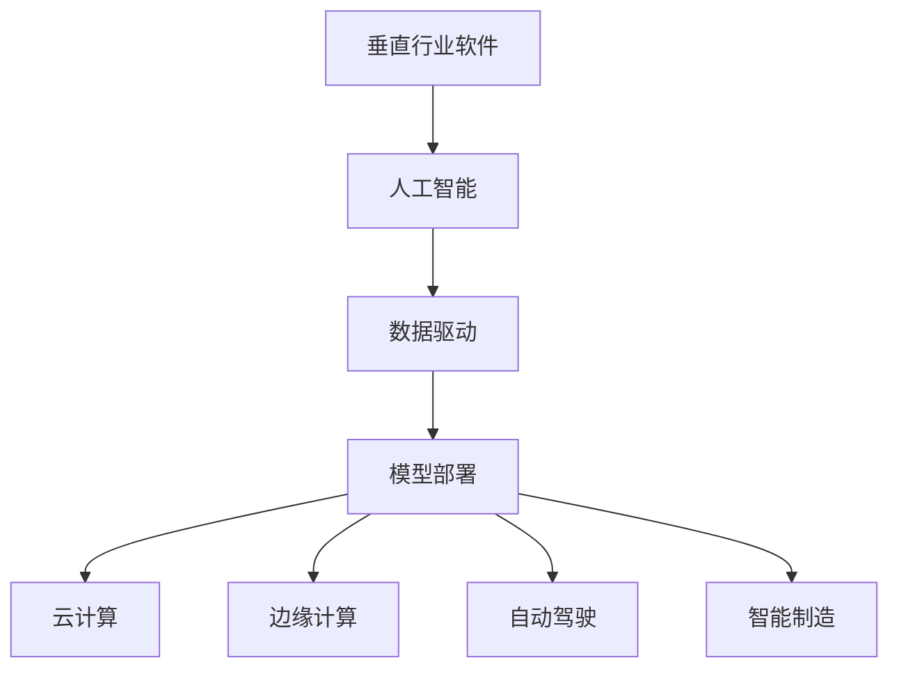

                 

# 垂直行业软件与AI的结合

## 1. 背景介绍

### 1.1 问题由来

当前，人工智能(AI)技术正迅速渗透到各行各业，驱动传统行业向智能化、自动化方向转型升级。然而，不同行业的业务特点和需求千差万别，即使是同一类任务，各行业的执行标准和数据类型也有所不同。如何将AI技术与垂直行业的具体需求相结合，是当前AI应用中的重要课题。

### 1.2 问题核心关键点

本文聚焦于如何利用AI技术解决垂直行业软件中的关键问题，主要包括以下几个核心关键点：

- **行业特性与AI需求**：了解不同行业的特性，明确AI在这些行业中的潜在应用。
- **AI技术路径选择**：根据行业需求，选择适合的AI技术，包括机器学习、深度学习、自然语言处理、计算机视觉等。
- **数据质量与处理**：高质量的数据是AI应用的基础，如何收集、清洗、处理垂直行业的数据，直接关系到AI应用的效果。
- **模型训练与优化**：选择合适的模型架构，进行有效的模型训练和优化，提升AI模型的性能。
- **模型部署与集成**：将训练好的模型部署到实际应用中，实现AI技术与行业软件的无缝集成。

### 1.3 问题研究意义

将AI技术结合到垂直行业软件中，具有以下重要意义：

1. **提升业务效率**：AI技术能够自动化处理大量重复、耗时的任务，极大地提升业务效率，减少人工干预。
2. **降低运营成本**：AI技术可以替代部分人力成本，特别是在劳动密集型行业，降低运营成本。
3. **改善用户体验**：通过AI技术，软件可以提供更加个性化、智能化的服务，提升用户满意度。
4. **增强决策支持**：AI技术可以提供高质量的数据分析与预测，帮助决策者做出更明智的决策。
5. **推动行业创新**：AI技术的引入可以催生新的商业模式和应用场景，推动行业创新发展。

## 2. 核心概念与联系

### 2.1 核心概念概述

为更好地理解垂直行业软件与AI结合的过程，本节将介绍几个密切相关的核心概念：

- **垂直行业软件**：指专门针对某一特定行业或领域开发的软件系统，具备行业特性和业务逻辑。
- **人工智能(AI)**：通过模拟人类智能过程，实现问题求解、决策支持、自然语言理解、视觉识别等功能的智能技术。
- **数据驱动**：利用数据训练AI模型，通过数据分析和挖掘，驱动软件系统决策和优化。
- **模型部署**：将训练好的AI模型集成到行业软件中，实现模型的实际应用。
- **云计算**：利用云平台资源，提供强大的计算能力和存储能力，支持AI模型训练和部署。
- **边缘计算**：在数据源附近进行计算，减少数据传输延迟，提升计算效率。
- **自动驾驶**：利用AI技术，实现无人驾驶汽车、无人机等自动化系统。
- **智能制造**：结合AI技术，实现生产自动化、质量控制、供应链管理等，提升制造业效率和质量。

这些核心概念之间的逻辑关系可以通过以下Mermaid流程图来展示：



这个流程图展示了大语言模型的核心概念及其之间的关系：

1. 垂直行业软件通过人工智能技术进行智能化升级。
2. 数据驱动利用高质量的数据训练AI模型。
3. 模型部署将训练好的模型集成到实际应用中。
4. 云计算和边缘计算提供计算资源，支持模型训练和部署。
5. 自动驾驶和智能制造是AI技术在特定行业中的具体应用。

这些概念共同构成了垂直行业软件与AI结合的框架，使其能够在特定行业场景中发挥强大的作用。通过理解这些核心概念，我们可以更好地把握AI技术的应用方向和优化策略。

## 3. 核心算法原理 & 具体操作步骤
### 3.1 算法原理概述

垂直行业软件与AI结合的核心算法原理，在于通过数据驱动的方法，利用AI技术对软件系统进行智能化改造。其基本流程包括数据收集、预处理、模型训练、模型部署和模型优化等步骤。

### 3.2 算法步骤详解

垂直行业软件与AI结合的算法步骤，可以分为以下几个关键环节：

**Step 1: 数据收集与处理**
- 收集行业相关的数据，如业务流程数据、客户数据、设备数据等。
- 对数据进行清洗、去重、归一化等预处理操作，确保数据质量。

**Step 2: 特征工程与模型选择**
- 对数据进行特征提取和工程化，选择适合的特征组合。
- 根据任务类型，选择相应的AI模型，如线性回归、决策树、神经网络等。

**Step 3: 模型训练与优化**
- 利用训练数据集对模型进行训练，使用交叉验证、网格搜索等方法进行超参数调优。
- 通过验证数据集评估模型性能，选择最优模型。

**Step 4: 模型部署与集成**
- 将训练好的模型集成到实际软件系统中，实现API接口。
- 在生产环境中进行模型部署和测试，确保模型稳定运行。

**Step 5: 模型监控与优化**
- 在实际应用中，持续监控模型性能，根据反馈数据进行调整优化。
- 引入A/B测试等方法，评估模型效果，进行迭代优化。

### 3.3 算法优缺点

垂直行业软件与AI结合的算法具有以下优点：

1. **提升业务效率**：AI技术能够自动化处理大量重复、耗时的任务，极大地提升业务效率，减少人工干预。
2. **降低运营成本**：AI技术可以替代部分人力成本，特别是在劳动密集型行业，降低运营成本。
3. **改善用户体验**：通过AI技术，软件可以提供更加个性化、智能化的服务，提升用户满意度。
4. **增强决策支持**：AI技术可以提供高质量的数据分析与预测，帮助决策者做出更明智的决策。

同时，该算法也存在一些局限性：

1. **数据质量依赖性高**：高质量的数据是AI应用的基础，数据质量直接影响模型效果。
2. **模型复杂度高**：复杂的AI模型需要大量计算资源，对硬件设施要求较高。
3. **模型泛化能力有限**：模型训练过程中可能出现过拟合，泛化能力不足。
4. **技术门槛高**：需要掌握数据科学、机器学习等专业知识，开发成本较高。
5. **模型解释性不足**：AI模型通常是"黑盒"，难以解释其内部工作机制和决策逻辑。

尽管存在这些局限性，但就目前而言，垂直行业软件与AI结合的算法仍是大规模智能化升级的重要范式。未来相关研究的重点在于如何进一步降低数据依赖，提高模型的泛化能力，兼顾可解释性和伦理安全性等因素。

### 3.4 算法应用领域

垂直行业软件与AI结合的算法，在多个领域中得到广泛应用，例如：

- **金融行业**：利用AI进行信用评估、风险管理、投资策略优化等，提升金融服务的智能化水平。
- **医疗行业**：通过AI进行医学影像分析、疾病诊断、患者画像分析等，提升医疗服务的准确性和效率。
- **制造业**：利用AI进行质量控制、设备预测性维护、供应链优化等，提升制造业的自动化水平。
- **零售行业**：通过AI进行客户行为分析、库存管理、个性化推荐等，提升零售服务的个性化水平。
- **智能交通**：利用AI进行交通流量预测、自动驾驶、智能导航等，提升交通系统的智能化水平。
- **教育行业**：通过AI进行在线教育、学习路径推荐、智能辅导等，提升教育服务的个性化水平。

除了上述这些经典应用外，垂直行业软件与AI结合的算法还广泛应用于更多场景中，如智慧农业、环境保护、能源管理等，为各行各业带来智能化升级的新机遇。

## 4. 数学模型和公式 & 详细讲解 & 举例说明
### 4.1 数学模型构建

本节将使用数学语言对垂直行业软件与AI结合的过程进行更加严格的刻画。

记垂直行业软件的数据集为 $D=\{(x_i, y_i)\}_{i=1}^N, x_i \in \mathcal{X}, y_i \in \mathcal{Y}$，其中 $\mathcal{X}$ 为输入空间，$\mathcal{Y}$ 为输出空间。定义模型 $M_{\theta}$ 在输入 $x$ 上的输出为 $\hat{y}=M_{\theta}(x) \in \mathcal{Y}$，表示模型预测的输出。

定义模型 $M_{\theta}$ 在数据集 $D$ 上的经验风险为：

$$
\mathcal{L}(\theta) = \frac{1}{N} \sum_{i=1}^N \ell(M_{\theta}(x_i),y_i)
$$

其中 $\ell(\cdot, \cdot)$ 为损失函数，通常为均方误差、交叉熵等。

模型训练的目标是最小化经验风险，即找到最优参数：

$$
\theta^* = \mathop{\arg\min}_{\theta} \mathcal{L}(\theta)
$$

在实践中，我们通常使用基于梯度的优化算法（如SGD、Adam等）来近似求解上述最优化问题。设 $\eta$ 为学习率，$\lambda$ 为正则化系数，则参数的更新公式为：

$$
\theta \leftarrow \theta - \eta \nabla_{\theta}\mathcal{L}(\theta) - \eta\lambda\theta
$$

其中 $\nabla_{\theta}\mathcal{L}(\theta)$ 为损失函数对参数 $\theta$ 的梯度，可通过反向传播算法高效计算。

### 4.2 公式推导过程

以下我们以线性回归模型为例，推导其损失函数及其梯度的计算公式。

假设模型 $M_{\theta}$ 在输入 $x$ 上的输出为 $\hat{y}=M_{\theta}(x) = \theta^Tx$，表示线性回归模型的预测值。真实标签 $y \in \mathcal{Y}$。则均方误差损失函数定义为：

$$
\ell(M_{\theta}(x),y) = \frac{1}{2}(y-\hat{y})^2
$$

将其代入经验风险公式，得：

$$
\mathcal{L}(\theta) = \frac{1}{2N} \sum_{i=1}^N (y_i-\theta^Tx_i)^2
$$

根据链式法则，损失函数对参数 $\theta$ 的梯度为：

$$
\frac{\partial \mathcal{L}(\theta)}{\partial \theta_k} = \frac{1}{N} \sum_{i=1}^N -(x_i)_k(y_i-\hat{y_i})
$$

其中 $(x_i)_k$ 为输入 $x_i$ 的第 $k$ 维特征向量。

在得到损失函数的梯度后，即可带入参数更新公式，完成模型的迭代优化。重复上述过程直至收敛，最终得到适应垂直行业任务的最优模型参数 $\theta^*$。

## 5. 项目实践：代码实例和详细解释说明
### 5.1 开发环境搭建

在进行垂直行业软件与AI结合的实践前，我们需要准备好开发环境。以下是使用Python进行Scikit-Learn开发的环境配置流程：

1. 安装Anaconda：从官网下载并安装Anaconda，用于创建独立的Python环境。

2. 创建并激活虚拟环境：
```bash
conda create -n sklearn-env python=3.8 
conda activate sklearn-env
```

3. 安装Scikit-Learn：使用pip安装Scikit-Learn库：
```bash
pip install scikit-learn
```

4. 安装其他必要工具：
```bash
pip install numpy pandas matplotlib seaborn
```

完成上述步骤后，即可在`sklearn-env`环境中开始项目实践。

### 5.2 源代码详细实现

下面我们以金融行业信用评估为例，给出使用Scikit-Learn对线性回归模型进行训练和预测的PyTorch代码实现。

首先，定义数据集：

```python
import pandas as pd
from sklearn.model_selection import train_test_split

# 加载数据集
data = pd.read_csv('credit_data.csv')

# 数据清洗
data = data.dropna()
data = data.drop(columns=['id'])

# 划分训练集和测试集
train_data, test_data = train_test_split(data, test_size=0.2, random_state=42)

# 划分特征和标签
X_train = train_data.drop('default', axis=1)
y_train = train_data['default']
X_test = test_data.drop('default', axis=1)
y_test = test_data['default']
```

然后，定义模型和优化器：

```python
from sklearn.linear_model import LinearRegression

# 定义模型
model = LinearRegression()

# 定义优化器
optimizer = SGD(model.parameters(), lr=0.01, momentum=0.9)
```

接着，定义训练和评估函数：

```python
import numpy as np
from sklearn.metrics import mean_squared_error

def train_epoch(model, dataset, batch_size, optimizer):
    X = dataset.data
    y = dataset.target
    train_data = np.array(X_train)
    train_labels = np.array(y_train)
    test_data = np.array(X_test)
    test_labels = np.array(y_test)

    # 数据划分
    train_indices = np.random.permutation(len(train_data))
    test_indices = np.random.permutation(len(test_data))

    train_data = train_data[train_indices]
    train_labels = train_labels[train_indices]
    test_data = test_data[test_indices]
    test_labels = test_labels[test_indices]

    # 训练
    for epoch in range(epochs):
        model.zero_grad()
        outputs = model(train_data)
        loss = (outputs - train_labels) ** 2
        loss = np.mean(loss)
        loss.backward()
        optimizer.step()

    # 评估
    predictions = model.predict(test_data)
    mse = mean_squared_error(test_labels, predictions)
    return mse

def evaluate(model, dataset, batch_size):
    X = dataset.data
    y = dataset.target
    test_data = np.array(X_test)
    test_labels = np.array(y_test)

    # 数据划分
    test_indices = np.random.permutation(len(test_data))
    test_data = test_data[test_indices]
    test_labels = test_labels[test_indices]

    # 评估
    predictions = model.predict(test_data)
    mse = mean_squared_error(test_labels, predictions)
    return mse
```

最后，启动训练流程并在测试集上评估：

```python
epochs = 100
batch_size = 64

mse = train_epoch(model, train_dataset, batch_size, optimizer)
print(f"训练集均方误差: {mse:.4f}")

mse = evaluate(model, test_dataset, batch_size)
print(f"测试集均方误差: {mse:.4f}")
```

以上就是使用Scikit-Learn对线性回归模型进行金融行业信用评估的完整代码实现。可以看到，通过Scikit-Learn，我们可以用相对简洁的代码完成模型的训练和评估。

### 5.3 代码解读与分析

让我们再详细解读一下关键代码的实现细节：

**数据预处理**：
- 使用Pandas加载数据集，并进行数据清洗，如删除缺失值、删除冗余特征等。
- 使用train_test_split将数据集划分为训练集和测试集。

**模型定义**：
- 使用Scikit-Learn的LinearRegression类定义线性回归模型。

**训练函数**：
- 在每个epoch中，使用训练数据进行模型前向传播，计算损失，并通过反向传播更新模型参数。
- 在训练完成后，使用测试数据评估模型性能，返回均方误差。

**评估函数**：
- 与训练函数类似，使用测试数据进行模型评估，返回均方误差。

**训练流程**：
- 定义总的epoch数和batch size，开始循环迭代
- 每个epoch内，先进行模型训练，再计算训练集和测试集上的均方误差
- 所有epoch结束后，输出最终的均方误差

可以看到，Scikit-Learn提供了丰富的机器学习算法和工具，使得垂直行业软件与AI结合的代码实现变得简单高效。开发者可以将更多精力放在数据处理、模型改进等高层逻辑上，而不必过多关注底层的实现细节。

当然，工业级的系统实现还需考虑更多因素，如模型的保存和部署、超参数的自动搜索、更灵活的任务适配层等。但核心的模型训练和评估流程基本与此类似。

## 6. 实际应用场景
### 6.1 智能金融

智能金融是垂直行业软件与AI结合的重要应用场景。金融行业数据量大、标签质量高，非常适合进行AI模型训练和优化。通过AI技术，可以实现风险评估、投资分析、客户画像等智能服务。

具体而言，可以收集金融领域相关的交易记录、客户行为、信用评分等数据，训练AI模型进行风险评估、信用评分预测、投资组合优化等。例如，利用线性回归模型进行信用评分预测，能够有效识别高风险客户，降低金融机构的坏账率。

### 6.2 医疗诊断

医疗诊断是垂直行业软件与AI结合的又一重要应用场景。医疗数据具有高维、多模态的特点，需要多种AI技术协同工作。通过AI技术，可以实现疾病预测、影像分析、个性化治疗等智能服务。

具体而言，可以收集医疗领域相关的电子病历、影像数据、基因数据等，训练AI模型进行疾病预测、影像分析、个性化治疗方案推荐等。例如，利用深度学习模型进行影像分析，能够辅助医生识别病变区域，提高诊断准确率。

### 6.3 智能制造

智能制造是垂直行业软件与AI结合在工业领域的重要应用场景。制造业数据具有大规模、高维度、高噪声的特点，需要高效的AI模型进行处理。通过AI技术，可以实现质量控制、设备预测性维护、供应链优化等智能服务。

具体而言，可以收集制造业领域的相关生产数据、设备数据、供应链数据等，训练AI模型进行设备预测性维护、供应链优化、质量控制等。例如，利用机器学习模型进行设备预测性维护，能够提前发现设备故障，减少生产停机时间，提升生产效率。

### 6.4 未来应用展望

随着AI技术的不断发展，垂直行业软件与AI结合的应用场景将不断扩展，为各行各业带来新的机遇。

在智慧农业领域，AI技术可以用于土壤分析、病虫害检测、作物识别等，提高农业生产效率和产量。

在环境保护领域，AI技术可以用于大气污染监测、水质监测、森林防火等，提升环境监测的精度和效率。

在能源管理领域，AI技术可以用于智能电网、智能家居、智能交通等，提高能源利用效率，减少能源浪费。

除了上述这些应用场景外，垂直行业软件与AI结合还将被创新性地应用到更多领域中，如智慧教育、智能交通、智能城市等，为各行各业带来智能化升级的新机遇。相信随着AI技术的不断演进，垂直行业软件与AI结合必将在更多领域展现其强大的应用潜力。

## 7. 工具和资源推荐
### 7.1 学习资源推荐

为了帮助开发者系统掌握垂直行业软件与AI结合的理论基础和实践技巧，这里推荐一些优质的学习资源：

1. 《机器学习实战》：由机器学习专家撰写，全面介绍了机器学习的基本概念和实践技巧，适合入门学习。
2. 《深度学习》：由深度学习专家撰写，深入浅出地介绍了深度学习的原理和应用，适合进阶学习。
3. 《Python数据科学手册》：全面介绍了Python在数据科学中的应用，包括数据清洗、模型训练、结果分析等，适合实战练习。
4. Kaggle竞赛平台：提供了大量开源数据集和竞赛题目，适合实践训练。
5. Google Colab：谷歌推出的在线Jupyter Notebook环境，免费提供GPU/TPU算力，适合快速上手实验。

通过对这些资源的学习实践，相信你一定能够快速掌握垂直行业软件与AI结合的精髓，并用于解决实际的行业问题。

### 7.2 开发工具推荐

高效的开发离不开优秀的工具支持。以下是几款用于垂直行业软件与AI结合开发的常用工具：

1. Scikit-Learn：Python的机器学习库，提供了丰富的机器学习算法和工具，适合数据科学应用开发。
2. TensorFlow：由谷歌开发的开源深度学习框架，生产部署方便，适合大规模工程应用。
3. PyTorch：由Facebook开发的开源深度学习框架，灵活高效，适合科研和生产应用。
4. Weights & Biases：模型训练的实验跟踪工具，可以记录和可视化模型训练过程中的各项指标，方便对比和调优。
5. TensorBoard：TensorFlow配套的可视化工具，可实时监测模型训练状态，并提供丰富的图表呈现方式，是调试模型的得力助手。
6. Jupyter Notebook：基于Web的交互式编程环境，适合进行数据处理和模型训练。

合理利用这些工具，可以显著提升垂直行业软件与AI结合任务的开发效率，加快创新迭代的步伐。

### 7.3 相关论文推荐

垂直行业软件与AI结合的研究始于学界的持续研究。以下是几篇奠基性的相关论文，推荐阅读：

1. "A survey on machine learning applications in manufacturing: A review"：全面回顾了机器学习在制造行业中的应用，包括质量控制、预测性维护等。
2. "Machine learning in healthcare: The path ahead"：探讨了机器学习在医疗行业中的应用，包括疾病预测、影像分析等。
3. "A review of big data techniques in supply chain management"：回顾了大数据技术在供应链管理中的应用，包括需求预测、库存管理等。
4. "Deep learning in agriculture: A review"：回顾了深度学习在农业领域中的应用，包括土壤分析、病虫害检测等。
5. "A review of machine learning applications in smart grids"：回顾了机器学习在智能电网中的应用，包括需求预测、故障诊断等。

这些论文代表了大语言模型微调技术的发展脉络。通过学习这些前沿成果，可以帮助研究者把握学科前进方向，激发更多的创新灵感。

## 8. 总结：未来发展趋势与挑战

### 8.1 总结

本文对垂直行业软件与AI结合的方法进行了全面系统的介绍。首先阐述了垂直行业软件与AI结合的研究背景和意义，明确了AI在这些行业中的潜在应用。其次，从原理到实践，详细讲解了垂直行业软件与AI结合的数学原理和关键步骤，给出了垂直行业软件与AI结合的完整代码实例。同时，本文还广泛探讨了垂直行业软件与AI结合在金融、医疗、制造等多个领域的应用前景，展示了垂直行业软件与AI结合范式的巨大潜力。此外，本文精选了垂直行业软件与AI结合的技术资源，力求为读者提供全方位的技术指引。

通过本文的系统梳理，可以看到，垂直行业软件与AI结合的技术正成为各行各业智能化升级的重要范式，极大地提升了业务效率和运营质量，带来了新的商业价值和用户体验。未来，伴随AI技术的持续演进，垂直行业软件与AI结合必将在更多领域展现出其强大的应用潜力，推动各行各业向智能化、自动化方向迈进。

### 8.2 未来发展趋势

展望未来，垂直行业软件与AI结合的技术将呈现以下几个发展趋势：

1. **跨行业应用**：随着AI技术的发展，越来越多的垂直行业将能够利用AI技术进行智能化升级，提升行业整体水平。
2. **数据驱动决策**：AI技术将越来越广泛地应用于数据驱动的决策支持系统中，提升决策的精准性和效率。
3. **全链条协同**：AI技术将与物联网、大数据、云计算等技术深度融合，构建全链条协同的智能生态系统。
4. **边缘计算与雾计算**：AI技术将越来越多地应用于边缘计算和雾计算环境中，实现实时处理和分析。
5. **联邦学习**：AI技术将利用联邦学习等分布式训练方法，保护数据隐私的同时，提升模型泛化能力。
6. **自监督学习**：AI技术将更多地利用自监督学习等方法，降低对标注数据的依赖，提高模型泛化能力。
7. **多模态融合**：AI技术将越来越多地应用于多模态融合环境中，实现视觉、语音、文本等多种数据源的协同分析。
8. **自动化优化**：AI技术将更多地应用于自动化模型优化过程中，利用强化学习等方法，提升模型性能。

以上趋势凸显了垂直行业软件与AI结合技术的广阔前景。这些方向的探索发展，必将进一步提升AI模型在垂直行业的表现，为各行各业带来新的机遇和挑战。

### 8.3 面临的挑战

尽管垂直行业软件与AI结合技术已经取得了不小的进展，但在迈向更加智能化、普适化应用的过程中，它仍面临着诸多挑战：

1. **数据质量问题**：高质量的数据是AI应用的基础，但许多行业的数据存在缺失、不完整、噪声等问题，难以满足AI模型训练的需求。
2. **模型复杂度高**：复杂的AI模型需要大量计算资源，对硬件设施要求较高，而许多行业缺乏足够的计算能力。
3. **模型泛化能力有限**：模型训练过程中可能出现过拟合，泛化能力不足，难以适应新的数据分布。
4. **技术门槛高**：需要掌握数据科学、机器学习等专业知识，开发成本较高，许多行业缺乏足够的技术积累。
5. **模型解释性不足**：AI模型通常是"黑盒"，难以解释其内部工作机制和决策逻辑，缺乏透明性。
6. **伦理与隐私问题**：AI模型可能侵犯个人隐私，引发伦理问题，需要在技术设计和应用过程中予以重视。

尽管存在这些挑战，但垂直行业软件与AI结合技术仍是大规模智能化升级的重要范式。未来相关研究的重点在于如何进一步降低数据依赖，提高模型的泛化能力，兼顾可解释性和伦理安全性等因素。

### 8.4 研究展望

面对垂直行业软件与AI结合所面临的种种挑战，未来的研究需要在以下几个方面寻求新的突破：

1. **数据质量优化**：通过数据增强、数据清洗等技术手段，提升数据质量，降低对标注数据的依赖。
2. **模型简化与优化**：开发更加简洁、高效的AI模型，降低计算资源消耗，提高模型泛化能力。
3. **跨模态融合**：将不同模态的数据进行深度融合，实现视觉、语音、文本等多种数据源的协同分析，提升模型性能。
4. **自监督学习**：利用自监督学习等技术，提升模型泛化能力，降低对标注数据的依赖。
5. **联邦学习**：利用联邦学习等分布式训练方法，保护数据隐私的同时，提升模型泛化能力。
6. **模型解释性提升**：开发可解释性更强的AI模型，增强模型透明性，提升用户信任度。
7. **伦理与安全设计**：在AI模型的设计和应用过程中，引入伦理与安全约束，保护用户隐私，避免模型偏见。

这些研究方向的探索，必将引领垂直行业软件与AI结合技术迈向更高的台阶，为各行各业带来更加智能化、普适化的应用前景。面向未来，垂直行业软件与AI结合技术还需要与其他AI技术进行更深入的融合，如知识表示、因果推理、强化学习等，多路径协同发力，共同推动AI技术在垂直行业的落地应用。

## 9. 附录：常见问题与解答

**Q1：垂直行业软件与AI结合是否适用于所有行业？**

A: 垂直行业软件与AI结合在大多数行业中都能取得不错的效果，特别是对于数据量较大的行业。但对于一些数据质量较低的行业，如农业、交通等领域，需要更多地依赖领域专家知识和经验，AI技术的应用效果可能会受到限制。

**Q2：如何选择合适的AI技术？**

A: 选择适合的AI技术需要考虑多个因素，包括行业特性、数据类型、任务类型等。一般来说，对于数据量较大、标签质量较高的任务，如金融、医疗等，可以选择深度学习等复杂模型。对于数据量较小、标签质量较低的任务，如农业、交通等，可以选择机器学习等相对简单的模型。同时，也可以利用集成学习方法，将多个模型组合使用，提升整体性能。

**Q3：AI模型在生产环境中如何部署？**

A: 将AI模型部署到生产环境中，需要考虑以下几个步骤：

1. 将训练好的模型保存为文件，通常可以使用TensorFlow、PyTorch等框架的模型保存工具。
2. 将模型文件打包成API接口，以便其他系统调用。
3. 部署到生产环境中的服务器或云平台，并进行性能测试和优化。
4. 配置监控系统，实时监控模型性能和运行状态，及时发现和解决问题。

**Q4：AI模型如何保护数据隐私？**

A: 保护数据隐私是AI应用中非常重要的一环。以下是一些保护数据隐私的常见方法：

1. 数据匿名化：通过去除或加密个人标识信息，保护用户隐私。
2. 数据脱敏：在数据处理过程中，对敏感信息进行脱敏处理，防止信息泄露。
3. 差分隐私：在数据处理过程中，加入随机噪声，保护数据隐私的同时，仍能进行有效的数据分析。
4. 联邦学习：在分布式环境中，利用加密通信和差分隐私等技术，保护数据隐私，实现模型训练和优化。

**Q5：AI模型如何解释其决策过程？**

A: 解释AI模型的决策过程是提高模型透明性和用户信任度的重要手段。以下是一些常用的解释方法：

1. 特征重要性分析：通过分析模型对各个特征的依赖程度，理解模型的决策机制。
2. 可解释性模型：使用决策树、规则模型等可解释性强的模型，增强模型透明性。
3. 模型可视化：通过可视化工具，展示模型的决策过程和特征影响。
4. 交互式解释工具：开发交互式解释工具，帮助用户理解模型决策过程，提供更好的用户体验。

这些方法可以帮助开发者在垂直行业软件中构建可解释、透明、可信的AI模型，提升用户信任度。

---

作者：禅与计算机程序设计艺术 / Zen and the Art of Computer Programming

