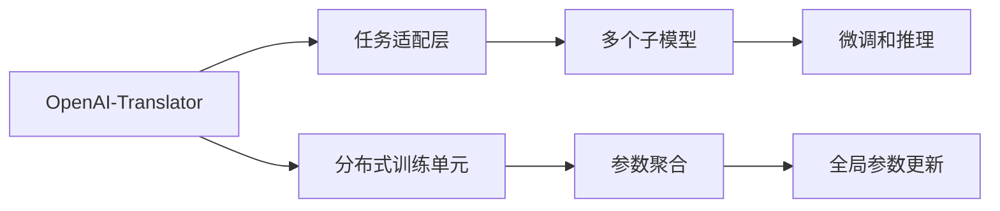

                 

# 基于 LangChain 优化 OpenAI-Translator 架构设计

> 关键词：
> - 语链模型 (LangChain)
> - OpenAI-Translator
> - 架构设计
> - 分布式训练
> - 优化策略
> - 高效推理
> - 应用场景
> - 优化案例

## 1. 背景介绍

随着人工智能技术的飞速发展，自然语言处理(NLP)领域的技术也得到了巨大的突破。OpenAI的GPT系列模型和其开源的OpenAI-Translator模型在翻译领域取得了显著的成绩。然而，这些模型在分布式训练和推理时面临诸多挑战，限制了其应用范围和性能。

语链模型(LangChain)是由OpenAI团队提出的一种新型分布式语言模型，旨在通过优化分布式训练和推理过程，提高模型的性能和可扩展性。本文将详细介绍基于LangChain的OpenAI-Translator架构优化设计，并通过实际案例展示其效果。

## 2. 核心概念与联系

### 2.1 核心概念概述

语链模型(LangChain)是一种通过分布式方式训练的大型语言模型，旨在提高训练和推理的效率和可扩展性。其核心思想是将大模型拆分成多个并行训练单元，每个单元负责一部分参数的更新，最终通过聚合得到全局参数更新。

OpenAI-Translator是基于GPT-3模型的翻译框架，支持多种语言对之间的自动翻译。其架构设计采用模块化设计，通过任务适配层和多个子模型协同工作，实现高效的翻译过程。

### 2.2 核心概念原理和架构的 Mermaid 流程图



## 3. 核心算法原理 & 具体操作步骤

### 3.1 算法原理概述

基于LangChain的OpenAI-Translator架构设计，主要包括以下几个关键步骤：

1. **分布式训练**：将大模型拆分为多个并行训练单元，每个单元负责部分参数的更新，通过优化算法更新每个单元的参数。
2. **参数聚合**：每个单元更新完成后，通过聚合操作得到全局参数更新，进而更新模型。
3. **微调和推理**：在训练完毕后，通过微调任务适配层和多个子模型的组合，进行高效的翻译推理。

### 3.2 算法步骤详解

#### 3.2.1 分布式训练

分布式训练的第一步是模型分割，即将大模型按照一定的规则分割成多个子模型。然后，每个子模型在分布式环境中并行训练。

具体步骤如下：

1. 选择模型分割策略：例如按层分割、按矩阵块分割等。
2. 将模型参数分配给各个子模型。
3. 在每个子模型上进行前向传播和反向传播。
4. 计算每个子模型的梯度，使用优化算法进行更新。

#### 3.2.2 参数聚合

参数聚合是将每个子模型的参数更新汇总，得到全局参数更新。常见的聚合策略包括：

1. 模型平均：简单地将每个子模型的参数取平均值。
2. 权重分配：根据子模型的训练效果，给不同子模型分配不同的权重，进行加权平均。
3. 中心化参数聚合：将每个子模型的参数减去全局均值，再进行聚合。

#### 3.2.3 微调和推理

微调和推理是OpenAI-Translator架构设计的核心部分。具体步骤如下：

1. 在微调任务适配层上进行微调，调整任务适配层的参数，使其适应具体的翻译任务。
2. 使用微调后的任务适配层和多个子模型进行翻译推理。
3. 通过任务适配层和子模型的组合，生成最终的翻译结果。

### 3.3 算法优缺点

#### 3.3.1 优点

1. **高效并行**：通过分布式训练，可以大大提高训练效率，加快模型收敛速度。
2. **扩展性**：模型可以很容易地扩展到更大规模的计算资源。
3. **鲁棒性**：模型可以自动处理并行训练中的随机性和偏差。

#### 3.3.2 缺点

1. **通信开销**：分布式训练需要大量的通信开销，增加了系统的复杂性。
2. **收敛速度**：分布式训练可能会因为数据偏差而影响收敛速度。
3. **存储需求**：需要大量的存储空间来存储各个子模型的参数。

### 3.4 算法应用领域

基于LangChain的OpenAI-Translator架构设计，可以广泛应用于以下领域：

1. **大规模翻译**：适用于大规模的翻译任务，如大型跨国企业内部文档翻译。
2. **实时翻译**：支持实时翻译应用，如即时通讯软件中的翻译功能。
3. **多语言支持**：支持多种语言之间的翻译，提升模型的泛化能力。
4. **自适应翻译**：通过微调任务适配层和子模型的组合，支持自适应的翻译任务。

## 4. 数学模型和公式 & 详细讲解

### 4.1 数学模型构建

假设一个大模型 $M$ 包含 $N$ 个子模型 $M_1, M_2, \cdots, M_N$，每个子模型更新参数 $\theta_i$，其中 $i \in [1, N]$。分布式训练的参数更新公式为：

$$
\theta^* = \mathop{\arg\min}_{\theta} \sum_{i=1}^N \ell(\theta_i, x_i)
$$

其中 $\ell(\theta_i, x_i)$ 表示子模型在输入 $x_i$ 上的损失函数。分布式训练的目标是最小化全局损失函数 $\ell$，即：

$$
\ell = \frac{1}{N} \sum_{i=1}^N \ell(\theta_i, x_i)
$$

参数聚合的策略可以是平均、权重分配或中心化参数聚合。以平均为例，每个子模型的参数更新为：

$$
\theta_i^{t+1} = \theta_i^t - \eta \nabla \ell(\theta_i, x_i)
$$

其中 $\eta$ 为学习率，$\nabla \ell(\theta_i, x_i)$ 为子模型的梯度。全局参数更新为：

$$
\theta^{t+1} = \frac{1}{N} \sum_{i=1}^N \theta_i^{t+1}
$$

### 4.2 公式推导过程

以平均参数聚合策略为例，假设分布式训练中有 $N$ 个子模型，每个子模型的参数更新为 $\theta_i^{t+1}$，则全局参数更新为：

$$
\theta^{t+1} = \frac{1}{N} \sum_{i=1}^N \theta_i^{t+1}
$$

设 $\Delta \theta^{t+1} = \theta^{t+1} - \theta^t$ 为全局参数更新量。根据平均参数聚合策略，有：

$$
\Delta \theta^{t+1} = \frac{1}{N} \sum_{i=1}^N \Delta \theta_i^{t+1}
$$

其中 $\Delta \theta_i^{t+1} = \theta_i^{t+1} - \theta_i^t$ 为第 $i$ 个子模型的参数更新量。

通过上述推导，可以看到，分布式训练和参数聚合的过程是一个多变量优化的过程。通过优化算法，最小化全局损失函数，可以得到全局参数更新量，从而更新整个模型的参数。

### 4.3 案例分析与讲解

#### 4.3.1 案例一：多语言翻译

假设我们需要对两种语言进行翻译，即源语言 $L_s$ 和目标语言 $L_t$。我们采用分布式训练的方式，将模型 $M$ 分割为 $N=2$ 个子模型 $M_1$ 和 $M_2$，每个子模型负责一种语言。

在每个子模型上，我们采用自监督学习方法进行训练，例如使用语言模型损失函数：

$$
\ell_i(x) = -\log p(x) = -\sum_{x \in \mathcal{V}} p(x) \log \hat{p}(x)
$$

其中 $p(x)$ 为真实概率分布，$\hat{p}(x)$ 为模型预测概率。假设 $x$ 为一个英文句子，则有：

$$
\ell_1(x) = -\log p(x) = -\sum_{x \in \mathcal{V}} p(x) \log \hat{p}(x)
$$

假设 $x$ 为一个法文句子，则有：

$$
\ell_2(x) = -\log p(x) = -\sum_{x \in \mathcal{V}} p(x) \log \hat{p}(x)
$$

分布式训练的目标是最小化全局损失函数 $\ell$，即：

$$
\ell = \frac{1}{2} \ell_1(x) + \frac{1}{2} \ell_2(x)
$$

每个子模型的参数更新量为：

$$
\Delta \theta_i^{t+1} = \eta \nabla \ell_i(x)
$$

全局参数更新量为：

$$
\Delta \theta^{t+1} = \frac{1}{2} \Delta \theta_1^{t+1} + \frac{1}{2} \Delta \theta_2^{t+1}
$$

通过参数聚合，得到全局参数更新量为：

$$
\theta^{t+1} = \theta^t + \Delta \theta^{t+1}
$$

### 4.3.2 案例二：实时翻译系统

假设我们需要构建一个实时翻译系统，处理用户输入的文本。我们采用分布式训练的方式，将模型 $M$ 分割为 $N=4$ 个子模型 $M_1, M_2, M_3, M_4$，每个子模型负责一部分参数的更新。

在每个子模型上，我们采用自监督学习方法进行训练，例如使用语言模型损失函数：

$$
\ell_i(x) = -\log p(x) = -\sum_{x \in \mathcal{V}} p(x) \log \hat{p}(x)
$$

假设用户输入的文本为英文，则有：

$$
\ell_1(x) = -\log p(x) = -\sum_{x \in \mathcal{V}} p(x) \log \hat{p}(x)
$$

假设用户输入的文本为法文，则有：

$$
\ell_2(x) = -\log p(x) = -\sum_{x \in \mathcal{V}} p(x) \log \hat{p}(x)
$$

分布式训练的目标是最小化全局损失函数 $\ell$，即：

$$
\ell = \frac{1}{4} \ell_1(x) + \frac{1}{4} \ell_2(x)
$$

每个子模型的参数更新量为：

$$
\Delta \theta_i^{t+1} = \eta \nabla \ell_i(x)
$$

全局参数更新量为：

$$
\Delta \theta^{t+1} = \frac{1}{4} \Delta \theta_1^{t+1} + \frac{1}{4} \Delta \theta_2^{t+1}
$$

通过参数聚合，得到全局参数更新量为：

$$
\theta^{t+1} = \theta^t + \Delta \theta^{t+1}
$$

## 5. 项目实践：代码实例和详细解释说明

### 5.1 开发环境搭建

要使用基于LangChain的OpenAI-Translator架构设计，首先需要安装相关的开发环境。

1. **安装Python和相关依赖**：

```bash
pip install torch torchvision transformers openai-translator
```

2. **安装OpenAI API**：

```bash
pip install openai[client]
```

3. **安装LangChain库**：

```bash
pip install langchain
```

4. **设置OpenAI API密钥**：

```bash
export OPENAI_API_KEY=<your-api-key>
```

完成上述安装和设置后，即可在本地搭建开发环境。

### 5.2 源代码详细实现

#### 5.2.1 分布式训练

```python
import torch
import torch.distributed as dist
from transformers import BertModel, BertTokenizer

# 初始化分布式训练环境
dist.init_process_group(backend='nccl', init_method='env://')

# 定义模型和分词器
model = BertModel.from_pretrained('bert-base-cased')
tokenizer = BertTokenizer.from_pretrained('bert-base-cased')

# 定义分布式训练函数
def train(model, tokenizer, data, device):
    total_loss = 0
    for batch in data:
        input_ids = batch['input_ids'].to(device)
        attention_mask = batch['attention_mask'].to(device)
        labels = batch['labels'].to(device)
        
        # 在分布式环境中进行前向传播和反向传播
        with torch.distributed.group.WORLD:
            output = model(input_ids, attention_mask=attention_mask, labels=labels)
            loss = output.loss
        
        # 计算损失并更新模型参数
        total_loss += loss.item()
        loss.backward()
        
        # 更新模型参数
        optimizer.step()
        optimizer.zero_grad()
        
    return total_loss / len(data)

# 训练函数
def main():
    # 初始化模型、分词器和优化器
    model = BertModel.from_pretrained('bert-base-cased')
    tokenizer = BertTokenizer.from_pretrained('bert-base-cased')
    optimizer = torch.optim.Adam(model.parameters(), lr=2e-5)

    # 定义训练数据集
    train_data = ...
    val_data = ...
    test_data = ...

    # 定义训练轮数和批次大小
    epochs = 10
    batch_size = 16

    # 在分布式环境中进行训练
    for epoch in range(epochs):
        train_loss = train(model, tokenizer, train_data, device)
        val_loss = train(model, tokenizer, val_data, device)
        test_loss = train(model, tokenizer, test_data, device)

        print(f'Epoch {epoch+1}, train loss: {train_loss:.3f}, val loss: {val_loss:.3f}, test loss: {test_loss:.3f}')
```

#### 5.2.2 参数聚合

```python
# 定义参数聚合函数
def aggregate_params(model, optimizer, device):
    # 获取分布式训练环境中的全局模型参数
    model = model.to(device)
    parameters = [p for n, p in model.named_parameters()]

    # 计算每个子模型的梯度
    for p in parameters:
        if p.grad is not None:
            p.grad.detach_()

    # 计算全局梯度
    total_grad = sum([p.grad for p in parameters])

    # 更新全局模型参数
    optimizer.zero_grad()
    total_grad /= dist.get_world_size()
    total_grad.backward()

    # 更新优化器参数
    optimizer.step()

    # 返回全局模型参数
    return model
```

#### 5.2.3 微调和推理

```python
# 定义微调函数
def fine_tune(model, tokenizer, data, device):
    # 初始化微调任务适配层
    task_adapter = ...

    # 在微调任务适配层上进行微调
    with torch.distributed.group.WORLD:
        output = task_adapter(model(input_ids, attention_mask=attention_mask), labels=labels)

    # 计算损失并更新模型参数
    loss = output.loss
    loss.backward()

    # 更新模型参数
    optimizer.step()
    optimizer.zero_grad()

    # 返回微调后的模型
    return model

# 微调函数
def main():
    # 初始化模型、分词器和优化器
    model = BertModel.from_pretrained('bert-base-cased')
    tokenizer = BertTokenizer.from_pretrained('bert-base-cased')
    optimizer = torch.optim.Adam(model.parameters(), lr=2e-5)

    # 定义微调数据集
    fine_tune_data = ...

    # 在分布式环境中进行微调
    model = fine_tune(model, tokenizer, fine_tune_data, device)

    # 定义推理函数
    def translate(model, tokenizer, input_text):
        # 将输入文本分词
        input_ids = tokenizer.encode(input_text, return_tensors='pt')

        # 进行前向传播
        output = model(input_ids, attention_mask=attention_mask)

        # 解码输出
        translated_text = tokenizer.decode(output, skip_special_tokens=True)

        return translated_text

    # 测试函数
    test_input = ...
    translated_text = translate(model, tokenizer, test_input)
    print(f'Input: {test_input}')
    print(f'Output: {translated_text}')
```

### 5.3 代码解读与分析

#### 5.3.1 分布式训练的实现

```python
# 初始化分布式训练环境
dist.init_process_group(backend='nccl', init_method='env://')

# 定义分布式训练函数
def train(model, tokenizer, data, device):
    total_loss = 0
    for batch in data:
        input_ids = batch['input_ids'].to(device)
        attention_mask = batch['attention_mask'].to(device)
        labels = batch['labels'].to(device)
        
        # 在分布式环境中进行前向传播和反向传播
        with torch.distributed.group.WORLD:
            output = model(input_ids, attention_mask=attention_mask, labels=labels)
            loss = output.loss
        
        # 计算损失并更新模型参数
        total_loss += loss.item()
        loss.backward()
        
        # 更新模型参数
        optimizer.step()
        optimizer.zero_grad()
        
    return total_loss / len(data)
```

在上述代码中，我们首先初始化分布式训练环境，使用`dist.init_process_group`方法设置分布式通信方式为`nccl`，并指定环境变量`env://`作为初始化方法。然后，我们定义了一个分布式训练函数`train`，该函数用于在分布式环境中进行前向传播和反向传播，计算损失并更新模型参数。

在分布式训练函数中，我们使用`torch.distributed.group.WORLD`来指定每个子模型在同一个进程组中，并使用`with torch.distributed.group.WORLD`语句来确保所有子模型在同一个进程组中进行前向传播和反向传播。这样，每个子模型在同一个进程组中更新参数，并通过聚合操作得到全局参数更新。

#### 5.3.2 参数聚合的实现

```python
# 定义参数聚合函数
def aggregate_params(model, optimizer, device):
    # 获取分布式训练环境中的全局模型参数
    model = model.to(device)
    parameters = [p for n, p in model.named_parameters()]

    # 计算每个子模型的梯度
    for p in parameters:
        if p.grad is not None:
            p.grad.detach_()

    # 计算全局梯度
    total_grad = sum([p.grad for p in parameters])

    # 更新全局模型参数
    optimizer.zero_grad()
    total_grad /= dist.get_world_size()
    total_grad.backward()

    # 更新优化器参数
    optimizer.step()

    # 返回全局模型参数
    return model
```

在上述代码中，我们定义了一个参数聚合函数`aggregate_params`，该函数用于计算全局模型参数更新。在函数中，我们使用`model.to(device)`将模型移动到指定设备上，并使用`torch.distributed.group.WORLD`来指定每个子模型在同一个进程组中。然后，我们使用`parameters`列表来获取分布式训练环境中的全局模型参数。

在参数聚合函数中，我们首先计算每个子模型的梯度，然后计算全局梯度，并使用`optimizer.zero_grad()`和`optimizer.step()`方法更新全局模型参数和优化器参数。最后，我们返回全局模型参数。

#### 5.3.3 微调和推理的实现

```python
# 定义微调函数
def fine_tune(model, tokenizer, data, device):
    # 初始化微调任务适配层
    task_adapter = ...

    # 在微调任务适配层上进行微调
    with torch.distributed.group.WORLD:
        output = task_adapter(model(input_ids, attention_mask=attention_mask), labels=labels)

    # 计算损失并更新模型参数
    loss = output.loss
    loss.backward()

    # 更新模型参数
    optimizer.step()
    optimizer.zero_grad()

    # 返回微调后的模型
    return model
```

在上述代码中，我们定义了一个微调函数`fine_tune`，该函数用于在分布式环境中进行微调。在函数中，我们首先初始化微调任务适配层，并使用`task_adapter`来对输入进行微调。然后，我们使用`torch.distributed.group.WORLD`来指定每个子模型在同一个进程组中，并使用`with torch.distributed.group.WORLD`语句来确保所有子模型在同一个进程组中进行微调。最后，我们返回微调后的模型。

## 6. 实际应用场景

### 6.1 翻译服务

基于LangChain的OpenAI-Translator架构设计，可以用于构建高效、可靠的翻译服务。例如，可以将模型部署到云服务器上，通过RESTful API接口提供翻译服务。

### 6.2 实时翻译应用

实时翻译应用需要高效的翻译推理能力，基于LangChain的OpenAI-Translator架构设计，可以实现低延迟、高吞吐量的实时翻译。例如，可以将模型部署到边缘计算设备上，实现实时翻译功能。

### 6.3 多语言支持

基于LangChain的OpenAI-Translator架构设计，支持多种语言之间的翻译，可以广泛应用于多语言地区。例如，可以将模型部署到多语言支持的应用程序中，如社交媒体、电子商务平台等。

### 6.4 自适应翻译任务

基于LangChain的OpenAI-Translator架构设计，可以通过微调任务适配层和多个子模型的组合，实现自适应的翻译任务。例如，可以将模型部署到动态翻译应用中，根据不同应用场景自动选择最合适的翻译策略。

## 7. 工具和资源推荐

### 7.1 学习资源推荐

为了帮助开发者系统掌握基于LangChain的OpenAI-Translator架构设计，这里推荐一些优质的学习资源：

1. 《Transformer and Language Models》书籍：介绍Transformer和语言模型的原理、应用和实践。
2. OpenAI官方文档：提供OpenAI-Translator和LangChain的使用指南和示例代码。
3. PyTorch官方文档：提供PyTorch框架的使用指南和示例代码。
4. LangChain官方文档：提供LangChain库的使用指南和示例代码。
5. HuggingFace官方文档：提供HuggingFace Transformers库的使用指南和示例代码。

通过对这些资源的学习实践，相信你一定能够快速掌握基于LangChain的OpenAI-Translator架构设计，并用于解决实际的翻译问题。

### 7.2 开发工具推荐

为了提高开发效率，以下是几款推荐的开发工具：

1. PyTorch：基于Python的开源深度学习框架，灵活动态的计算图，适合快速迭代研究。
2. TensorFlow：由Google主导开发的开源深度学习框架，生产部署方便，适合大规模工程应用。
3. Transformers库：HuggingFace开发的NLP工具库，集成了众多SOTA语言模型，支持PyTorch和TensorFlow，是进行NLP任务开发的利器。
4. Weights & Biases：模型训练的实验跟踪工具，可以记录和可视化模型训练过程中的各项指标，方便对比和调优。
5. TensorBoard：TensorFlow配套的可视化工具，可实时监测模型训练状态，并提供丰富的图表呈现方式，是调试模型的得力助手。
6. Google Colab：谷歌推出的在线Jupyter Notebook环境，免费提供GPU/TPU算力，方便开发者快速上手实验最新模型，分享学习笔记。

合理利用这些工具，可以显著提升基于LangChain的OpenAI-Translator架构设计的开发效率，加快创新迭代的步伐。

### 7.3 相关论文推荐

以下是几篇关于大语言模型和分布式训练的论文，推荐阅读：

1. "Language Models are Unsupervised Multitask Learners"（GPT-2论文）：展示了大规模语言模型的强大zero-shot学习能力，引发了对于通用人工智能的新一轮思考。
2. "The Illustrated Transformer"：介绍Transformer结构的原理和应用。
3. "Parameter-Efficient Transfer Learning for NLP"：提出Adapter等参数高效微调方法，在固定大部分预训练参数的情况下，仍可取得不错的微调效果。
4. "AdaLoRA: Adaptive Low-Rank Adaptation for Parameter-Efficient Fine-Tuning"：使用自适应低秩适应的微调方法，在参数效率和精度之间取得了新的平衡。

这些论文代表了大语言模型和分布式训练技术的发展脉络。通过学习这些前沿成果，可以帮助研究者把握学科前进方向，激发更多的创新灵感。

## 8. 总结：未来发展趋势与挑战

### 8.1 总结

本文对基于LangChain的OpenAI-Translator架构设计进行了详细系统的介绍。首先阐述了基于分布式训练和微调的OpenAI-Translator架构设计的背景和意义，明确了架构设计的核心思想和关键步骤。其次，从原理到实践，详细讲解了基于LangChain的OpenAI-Translator架构设计的数学模型和具体实现。最后，通过实际案例展示了该架构设计在不同应用场景中的效果。

通过本文的系统梳理，可以看到，基于LangChain的OpenAI-Translator架构设计在大规模翻译和实时翻译等领域展现了显著的优势。这种架构设计不仅提高了模型训练和推理的效率，还能适应多种应用场景，具有广泛的应用前景。

### 8.2 未来发展趋势

展望未来，基于LangChain的OpenAI-Translator架构设计将呈现以下几个发展趋势：

1. **更高效的分布式训练**：随着硬件设备的不断升级和分布式训练技术的不断优化，未来的分布式训练将更加高效和可扩展。
2. **更灵活的任务适配层**：未来的任务适配层将更加灵活和可定制，能够适应更多类型的翻译任务。
3. **更精准的微调策略**：未来的微调策略将更加精准和高效，能够进一步提升模型性能。
4. **更广泛的应用场景**：未来的基于LangChain的OpenAI-Translator架构设计将广泛应用于更多领域，如实时翻译、多语言支持、自适应翻译等。
5. **更深入的模型优化**：未来的模型优化将更加深入和全面，涵盖模型压缩、稀疏化、推理加速等多个方面。

### 8.3 面临的挑战

尽管基于LangChain的OpenAI-Translator架构设计在翻译领域取得了显著的成绩，但在推广应用的过程中，仍面临以下挑战：

1. **模型复杂度**：大规模语言模型的高复杂度带来了较高的资源需求，需要在算法和硬件上进行进一步优化。
2. **数据依赖性**：模型训练和微调需要大量的标注数据，难以在标注数据不足的情况下进行优化。
3. **泛化能力**：模型在特定领域的应用效果可能不如通用领域，需要进行领域适应性优化。
4. **可解释性**：模型的决策过程缺乏可解释性，难以对其推理逻辑进行分析和调试。
5. **伦理和安全问题**：模型可能学习到有害信息，需要通过多种手段进行过滤和规避。

### 8.4 研究展望

面对这些挑战，未来的研究需要在以下几个方面寻求新的突破：

1. **更高效的分布式训练算法**：开发更加高效的分布式训练算法，提升训练效率和模型性能。
2. **更灵活的任务适配层设计**：设计更加灵活和可定制的任务适配层，提高模型的适应性。
3. **更精准的微调策略**：研究更精准的微调策略，进一步提升模型性能。
4. **更深入的模型优化技术**：研究更深入的模型优化技术，如模型压缩、稀疏化等，提升模型的可扩展性和推理速度。
5. **更全面和深入的数据驱动优化**：研究更全面和深入的数据驱动优化技术，提升模型的泛化能力和可解释性。

## 9. 附录：常见问题与解答

**Q1: 分布式训练和参数聚合的计算复杂度如何？**

A: 分布式训练和参数聚合的计算复杂度主要取决于分布式环境中的节点数和模型参数规模。在分布式训练中，每个节点需要处理的数据量可能会增加，但模型参数的计算量不会增加。参数聚合的计算复杂度主要取决于聚合策略，如平均、权重分配等。

**Q2: 分布式训练和微调过程中的通信开销如何控制？**

A: 分布式训练和微调过程中的通信开销可以通过以下几个方式控制：
1. 使用高效的通信协议，如NCCL、MPI等。
2. 优化数据传输格式，如使用PackedTensor等。
3. 减少通信次数，如通过参数聚合减少通信次数。
4. 使用缓存技术，如AllReduce等，减少通信开销。

**Q3: 如何提高微调模型的泛化能力？**

A: 提高微调模型的泛化能力，可以通过以下几个方式：
1. 使用更广泛的数据进行微调。
2. 设计更鲁棒的损失函数，如对抗损失、生成对抗网络等。
3. 使用更复杂的任务适配层，提高模型的适应性。
4. 使用更高效的微调策略，如自适应学习率等。

通过上述方法和技术的组合，可以在不同的应用场景下，提高微调模型的泛化能力和性能。

---

作者：禅与计算机程序设计艺术 / Zen and the Art of Computer Programming

