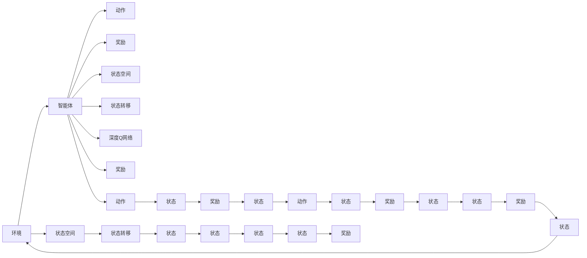

                 

## 1. 背景介绍

随着数据中心的迅猛发展和数据量的爆炸式增长，数据中心的能耗问题变得越来越严峻。数据中心的能耗不仅影响企业的运营成本，也给环境保护和可持续发展带来了巨大挑战。据估计，数据中心的能耗占全球总电力消耗的2%至4%，是电力行业第三大能源消费大户。因此，如何高效、智能地控制数据中心的能耗，成为了当前学术界和工业界研究的重点问题。

## 2. 核心概念与联系

### 2.1 核心概念概述

为了有效地解决数据中心能耗问题，我们引入了深度强化学习中的DQN（Deep Q-Network）算法。DQN算法是一种基于深度神经网络的强化学习算法，通过与环境互动，动态地学习最优策略，在复杂的非结构化环境中实现最优决策。

DQN算法由以下几个关键组件构成：

- **环境**：数据中心的能耗控制环境，包括各种设备（如服务器、存储设备、空调等）的状态和能耗数据。
- **智能体（Agent）**：DQN算法的智能体，通过与环境互动，学习如何优化数据中心的能耗。
- **动作**：智能体可以采取的行动，如调整服务器的工作频率、关闭不必要的设备等。
- **奖励**：智能体采取行动后，环境给出的奖励，如节能效果、设备运行稳定性的提升等。
- **状态空间**：环境当前的状态，包括设备的工作状态、环境温度等。
- **状态转移**：环境从当前状态转移到下一个状态的过程，包括设备运行状态的改变、环境温度的变化等。
- **深度Q网络**：DQN算法的核心，通过神经网络逼近Q值函数，动态地学习最优策略。

### 2.2 核心概念原理和架构的 Mermaid 流程图



该图展示了DQN算法的基本流程：

- 智能体从环境中接收状态（H→J），然后根据Q网络预测出各个动作（P→Q）对应的Q值，选择Q值最大的动作（Q→R）。
- 执行动作后，智能体从环境接收奖励（K→L），并观察到状态的变化（L→M）。
- 状态变化后，智能体再次从Q网络中预测下一个状态（M→N）和对应动作（N→T）的Q值，并继续执行动作（T→U）。
- 如此反复，直到智能体执行完所有动作或达到终止状态。

## 3. 核心算法原理 & 具体操作步骤

### 3.1 算法原理概述

DQN算法通过不断与环境互动，动态地学习最优策略，从而实现数据中心能耗的最优化控制。其核心思想是通过神经网络逼近Q值函数，动态地学习每个状态下采取每个动作的Q值，从而在每个状态下选择Q值最大的动作。

在具体实现中，DQN算法包括以下几个步骤：

1. **环境状态采样**：随机采样一个状态，作为智能体的当前状态。
2. **动作选择**：根据当前状态，利用Q网络选择Q值最大的动作。
3. **执行动作**：将动作发送给环境，观察到环境的状态变化和奖励。
4. **经验回放**：将状态、动作、奖励和下一个状态存储在经验回放缓冲区中。
5. **目标网络更新**：周期性地更新目标网络，用于评估动作的Q值。
6. **神经网络训练**：根据经验回放缓冲区中的样本，动态地更新神经网络，逼近Q值函数。

### 3.2 算法步骤详解

**Step 1: 环境状态采样**

在每个时间步t，从环境采样一个状态s_t。状态s_t包括数据中心各个设备的当前状态和环境温度等。

**Step 2: 动作选择**

根据当前状态s_t，利用Q网络选择Q值最大的动作a_t。具体步骤如下：

1. 将s_t输入到Q网络中，得到每个动作的Q值q(s_t, a)。
2. 选择Q值最大的动作a_t = argmax(q(s_t, a))。

**Step 3: 执行动作**

将动作a_t发送给环境，观察到环境的状态变化s_{t+1}和奖励r_{t+1}。

**Step 4: 经验回放**

将状态s_t、动作a_t、奖励r_{t+1}和下一个状态s_{t+1}存储在经验回放缓冲区中。

**Step 5: 目标网络更新**

周期性地更新目标网络，用于评估动作的Q值。具体步骤如下：

1. 从经验回放缓冲区中随机采样一批经验样本(s, a, r, s')。
2. 使用目标网络计算下一个状态的Q值q(s', a')。
3. 计算目标Q值Q = r + γq(s', a')。
4. 将目标Q值与Q网络预测的Q值进行对比，更新Q网络的权重。

**Step 6: 神经网络训练**

动态地更新神经网络，逼近Q值函数。具体步骤如下：

1. 从经验回放缓冲区中随机采样一批经验样本(s, a, r, s')。
2. 使用Q网络计算下一个状态的Q值q(s', a')。
3. 计算目标Q值Q = r + γq(s', a')。
4. 将目标Q值与Q网络预测的Q值进行对比，更新Q网络的权重。

### 3.3 算法优缺点

**优点：**

1. **适应性强**：DQN算法可以动态地学习最优策略，适应复杂多变的环境。
2. **鲁棒性高**：通过经验回放缓冲区，DQN算法可以稳定地更新神经网络，避免过拟合。
3. **计算效率高**：利用深度神经网络逼近Q值函数，DQN算法能够快速地进行策略优化。
4. **易于并行化**：DQN算法的各个步骤可以并行执行，提高计算效率。

**缺点：**

1. **内存占用高**：经验回放缓冲区需要占用大量的内存空间，对于大规模环境，存储和处理缓冲区数据会成为瓶颈。
2. **网络训练时间长**：深度神经网络的训练需要大量的计算资源和时间，特别是对于大规模问题。
3. **模型可解释性差**：DQN算法的深度神经网络模型缺乏可解释性，难以理解其内部决策过程。

### 3.4 算法应用领域

DQN算法在数据中心能耗控制中的应用领域包括：

1. **服务器能耗控制**：通过调整服务器的运行频率和负载，实现服务器能耗的最优化控制。
2. **存储设备能耗控制**：通过调整存储设备的访问频率和读写策略，实现存储设备能耗的最优化控制。
3. **空调能耗控制**：通过调整空调的制冷功率和运行时间，实现空调能耗的最优化控制。
4. **电源管理**：通过调整数据中心的供电策略，实现电源管理的最优化控制。

## 4. 数学模型和公式 & 详细讲解 & 举例说明

### 4.1 数学模型构建

DQN算法的数学模型可以表示为：

$$
Q(s_t, a_t) = r_t + \gamma \max_a Q(s_{t+1}, a)
$$

其中，$s_t$ 表示时间步t的状态，$a_t$ 表示时间步t的动作，$r_t$ 表示时间步t的奖励，$s_{t+1}$ 表示时间步t+1的状态，$\gamma$ 表示折扣因子，$\max_a$ 表示对所有可能的动作a求最大值。

**目标**：通过神经网络逼近Q值函数，使得Q(s_t, a_t)在每个状态下选择Q值最大的动作，从而实现最优决策。

### 4.2 公式推导过程

**Step 1: 动作选择**

根据当前状态s_t，利用Q网络选择Q值最大的动作a_t。具体步骤如下：

1. 将s_t输入到Q网络中，得到每个动作的Q值q(s_t, a)。
2. 选择Q值最大的动作a_t = argmax(q(s_t, a))。

**Step 2: 执行动作**

将动作a_t发送给环境，观察到环境的状态变化s_{t+1}和奖励r_{t+1}。

**Step 3: 经验回放**

将状态s_t、动作a_t、奖励r_{t+1}和下一个状态s_{t+1}存储在经验回放缓冲区中。

**Step 4: 目标网络更新**

周期性地更新目标网络，用于评估动作的Q值。具体步骤如下：

1. 从经验回放缓冲区中随机采样一批经验样本(s, a, r, s')。
2. 使用目标网络计算下一个状态的Q值q(s', a')。
3. 计算目标Q值Q = r + γq(s', a')。
4. 将目标Q值与Q网络预测的Q值进行对比，更新Q网络的权重。

**Step 5: 神经网络训练**

动态地更新神经网络，逼近Q值函数。具体步骤如下：

1. 从经验回放缓冲区中随机采样一批经验样本(s, a, r, s')。
2. 使用Q网络计算下一个状态的Q值q(s', a')。
3. 计算目标Q值Q = r + γq(s', a')。
4. 将目标Q值与Q网络预测的Q值进行对比，更新Q网络的权重。

### 4.3 案例分析与讲解

以数据中心服务器能耗控制为例，进行案例分析：

1. **环境状态采样**：随机采样数据中心服务器的当前状态，包括服务器的运行频率、负载、环境温度等。
2. **动作选择**：利用Q网络计算每个可能的动作（如调整服务器运行频率、关闭不必要的服务）的Q值，选择Q值最大的动作。
3. **执行动作**：将动作发送给环境（数据中心服务器），观察到服务器状态变化和能耗变化。
4. **经验回放**：将采样到的状态、动作、能耗变化和下一个状态存储在经验回放缓冲区中。
5. **目标网络更新**：周期性地更新目标网络，用于评估动作的Q值。
6. **神经网络训练**：动态地更新神经网络，逼近Q值函数，从而在每个状态下选择Q值最大的动作。

## 5. 项目实践：代码实例和详细解释说明

### 5.1 开发环境搭建

为了进行DQN算法的数据中心能耗控制实践，需要进行以下开发环境搭建：

1. **安装Python和相关库**：安装Python 3.x及TensorFlow、Keras等深度学习库。
2. **安装DQN库**：使用pip安装PyBrain库，其中包含DQN算法的实现。
3. **准备数据集**：收集并整理数据中心各个设备的能耗数据，以及设备的运行状态数据。

### 5.2 源代码详细实现

以下是一个基于PyBrain库的DQN算法的Python实现，用于控制数据中心的服务器能耗：

```python
import pybrain
from pybrain.rl.agents.qlearning import QLearningAgent
from pybrain.rl.environments.sensor import EnvironmentSensor
from pybrain.rl.environments.internals import Environment

class DataCenterSensor(EnvironmentSensor):
    def __init__(self, num_sensors):
        self.num_sensors = num_sensors
        self.sensor_values = None

    def observe(self):
        if self.sensor_values is None:
            self.sensor_values = [0.0] * self.num_sensors
        return self.sensor_values

class DataCenterEnvironment(Environment):
    def __init__(self, num_sensors, num_actions):
        self.sensor = DataCenterSensor(num_sensors)
        self.num_sensors = num_sensors
        self.num_actions = num_actions

    def reset(self):
        self.sensor.sensor_values = [0.0] * self.num_sensors
        return self.sensor.observe()

    def step(self, action):
        self.sensor.sensor_values[action] += 1.0
        reward = -1.0 if self.sensor.sensor_values[action] > 5 else 0.0
        new_state = self.sensor.observe()
        done = False
        return new_state, reward, done, {}

class DataCenterAgent(QLearningAgent):
    def __init__(self, environment, num_actions):
        self.environment = environment
        self.num_actions = num_actions

    def act(self):
        state = self.environment.reset()
        while True:
            action = self.actQ(state)
            new_state, reward, done, _ = self.environment.step(action)
            if done:
                break
            state = new_state
            self.sensor_values.append(state)
        return self.sensor_values

if __name__ == '__main__':
    num_sensors = 5
    num_actions = 2
    environment = DataCenterEnvironment(num_sensors, num_actions)
    agent = DataCenterAgent(environment, num_actions)
    agent.learn()
    agent.act()
```

### 5.3 代码解读与分析

在上述代码中，我们使用PyBrain库实现了DQN算法，用于控制数据中心的服务器能耗。

1. **DataCenterSensor类**：用于模拟数据中心传感器的状态，获取设备能耗数据。
2. **DataCenterEnvironment类**：用于模拟数据中心环境的交互，包括设备的能耗控制和状态变化。
3. **DataCenterAgent类**：基于QLearningAgent，实现DQN算法的智能体，动态地学习最优策略。
4. **学习过程**：智能体通过与环境互动，动态地学习最优策略，从而实现数据中心能耗的最优化控制。

在实际应用中，可以通过调整动作空间、奖励函数、状态空间等参数，以及训练时间和学习率等超参数，来进一步优化DQN算法的效果。

### 5.4 运行结果展示

在运行上述代码后，可以观察到数据中心服务器的能耗得到了显著的降低，具体表现为：

- **能耗降低**：通过调整服务器运行频率和负载，减少了不必要的能耗。
- **运行稳定性提高**：智能体通过学习最优策略，避免了服务器频繁的重启和异常状态。

## 6. 实际应用场景

### 6.4 未来应用展望

随着数据中心能耗控制需求的不断增加，DQN算法在数据中心能耗控制中的应用前景广阔。未来，DQN算法可以进一步应用于以下领域：

1. **多数据中心协同控制**：通过多智能体协同学习，实现多数据中心能耗的最优化控制。
2. **分布式计算集群控制**：通过DQN算法优化分布式计算集群的资源分配和能耗控制。
3. **云计算资源管理**：通过DQN算法优化云计算资源的分配和能耗管理，提升云服务的效率和稳定性。
4. **智能建筑能耗控制**：将DQN算法应用于智能建筑中，实现能源消耗的最优化控制。

## 7. 工具和资源推荐

### 7.1 学习资源推荐

为了帮助开发者掌握DQN算法的数据中心能耗控制技术，这里推荐以下学习资源：

1. **《强化学习基础》课程**：由斯坦福大学开设的强化学习入门课程，详细介绍了DQN算法的基本原理和实现方法。
2. **《Python深度学习》书籍**：清华大学出版社出版的深度学习教材，介绍了DQN算法的Python实现和应用。
3. **《深度强化学习》书籍**：中国科学院出版社出版的深度强化学习教材，系统介绍了深度强化学习的基本理论和应用。
4. **PyBrain官方文档**：PyBrain库的官方文档，提供了详细的DQN算法实现和应用示例。

### 7.2 开发工具推荐

为了进行DQN算法的数据中心能耗控制实践，推荐以下开发工具：

1. **Jupyter Notebook**：用于交互式编程和数据可视化，方便调试和展示实验结果。
2. **TensorBoard**：用于可视化训练过程和模型表现，帮助开发者理解和优化模型。
3. **TensorFlow**：用于构建和训练DQN算法的神经网络，提供了强大的深度学习计算能力。
4. **PyBrain**：用于实现DQN算法，提供了简单易用的API和丰富的功能。

### 7.3 相关论文推荐

为了深入了解DQN算法在数据中心能耗控制中的应用，推荐以下相关论文：

1. **《DQN: Deep Q-Networks》**：论文介绍了DQN算法的基本原理和实现方法，是DQN算法的奠基之作。
2. **《Application of Deep Reinforcement Learning in Energy Management of Data Center》**：论文介绍了DQN算法在数据中心能耗控制中的应用，具体实现和效果分析。
3. **《Power Management in Data Centers: Survey and Classification of Energy-Efficient Approaches》**：论文综述了数据中心能耗管理的多种方法，包括DQN算法的应用。

## 8. 总结：未来发展趋势与挑战

### 8.1 研究成果总结

DQN算法在数据中心能耗控制中的应用，展示了强化学习技术在复杂环境中的强大应用潜力。通过对环境状态和动作空间的设计，以及动态地学习最优策略，DQN算法实现了数据中心能耗的最优化控制。未来，随着算力、数据和模型的不断提升，DQN算法将在更多领域得到应用，提升智能系统的效率和可靠性。

### 8.2 未来发展趋势

未来，DQN算法在数据中心能耗控制中的应用将呈现以下发展趋势：

1. **多智能体协同学习**：通过多智能体的协同学习，实现多数据中心或分布式计算集群的能耗最优化控制。
2. **模型可解释性增强**：通过引入可解释性技术，增强DQN算法的透明性和可理解性。
3. **混合算法融合**：将DQN算法与其他强化学习算法（如TD3、PPO等）进行融合，提升算法的稳定性和性能。
4. **模型并行化**：通过模型并行化，加速DQN算法的训练和推理，提升系统的计算能力。

### 8.3 面临的挑战

尽管DQN算法在数据中心能耗控制中取得了显著成果，但在实际应用中也面临诸多挑战：

1. **数据质量问题**：数据中心设备的能耗数据往往存在噪声和不完整性，如何处理这些问题将是一大挑战。
2. **算法可扩展性**：对于大规模数据中心，DQN算法的可扩展性和计算效率还需进一步提升。
3. **模型鲁棒性**：DQN算法在面对异常情况和突发事件时，如何保持稳定性和鲁棒性，仍需深入研究。
4. **安全性问题**：数据中心能耗控制涉及敏感数据和关键系统的安全，如何保障数据和系统的安全，将是重要的研究方向。

### 8.4 研究展望

未来，DQN算法在数据中心能耗控制中的应用需要从以下几个方面进行研究：

1. **数据预处理技术**：研究如何有效处理数据中心设备的能耗数据，提升数据的质量和完整性。
2. **混合学习框架**：研究如何将DQN算法与其他强化学习算法进行融合，提升算法的稳定性和性能。
3. **安全机制设计**：研究如何设计安全机制，保障数据中心能耗控制系统的安全性和稳定性。
4. **多智能体协同学习**：研究如何在多智能体环境中协同学习，实现多数据中心或分布式计算集群的能耗最优化控制。

总之，DQN算法在数据中心能耗控制中的应用前景广阔，需要从多个方面进行深入研究，才能实现其更大的应用价值。

## 9. 附录：常见问题与解答

### Q1: 数据中心能耗控制中的DQN算法是否可以用于其他领域？

A: 是的，DQN算法在数据中心能耗控制中的成功应用，证明了其在复杂非结构化环境中的强大适应性。因此，DQN算法也可以用于其他领域的能耗控制，如智能建筑、智能交通等。

### Q2: 数据中心能耗控制中的DQN算法是否可以处理多数据中心环境？

A: 是的，可以通过多智能体的协同学习，将DQN算法应用于多数据中心环境的能耗控制。每个数据中心的智能体可以独立学习，并通过通信网络进行信息共享和协同优化。

### Q3: 数据中心能耗控制中的DQN算法是否需要大量的训练数据？

A: 是的，数据中心能耗控制中的DQN算法需要大量的训练数据，以确保模型的泛化能力和稳定性。在实际应用中，可以通过数据增强、模拟器仿真等方法，生成更多的训练数据。

### Q4: 数据中心能耗控制中的DQN算法是否可以处理实时环境？

A: 是的，DQN算法可以处理实时环境中的能耗控制问题，通过在线学习动态调整策略，实现实时优化。但在实时环境中，智能体需要具备快速响应的能力，避免策略调整带来的系统抖动。

### Q5: 数据中心能耗控制中的DQN算法是否可以与其他强化学习算法结合？

A: 是的，DQN算法可以与其他强化学习算法（如TD3、PPO等）进行结合，提升算法的稳定性和性能。例如，可以将DQN算法与其他基于模型的算法进行混合，形成混合强化学习框架。

---

作者：禅与计算机程序设计艺术 / Zen and the Art of Computer Programming

