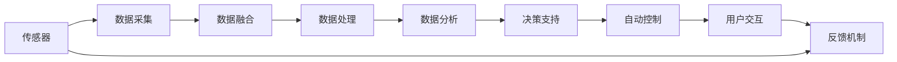

                 

# 基于Java的智能家居设计：智能家居场景模拟与Java的实现技术

> 关键词：智能家居,Java,物联网(IoT),场景模拟,传感器融合,人工智能(AI),机器学习(ML)

## 1. 背景介绍

随着科技的飞速发展，智能家居已经成为现代家庭的重要组成部分。通过结合物联网(IoT)技术、人工智能(AI)技术，智能家居系统能够实现对家居环境的智能感知、自动化控制，提升居住者的舒适度和安全性。Java作为一种功能强大、应用广泛的程序设计语言，在智能家居系统设计和实现中也扮演着关键角色。本文将探讨基于Java的智能家居设计，重点介绍智能家居场景模拟与Java的实现技术。

## 2. 核心概念与联系

### 2.1 核心概念概述

在智能家居设计中，以下核心概念是必不可少的：

- **智能家居**：通过物联网技术，将家居设备、家电、安防系统等接入网络，实现远程控制、自动化控制等功能，提升居住舒适度、安全性和便利性。
- **Java**：一种面向对象的、跨平台的程序设计语言，广泛应用于企业级应用、Web开发、移动应用等。Java在智能家居系统开发中，可以用于后端服务器、数据处理、应用逻辑实现等环节。
- **物联网(IoT)**：通过互联网将各种设备、传感器等物理实体连接起来，实现数据的传输和交互，为智能家居系统的实现提供了基础设施。
- **场景模拟**：通过计算机模拟智能家居环境中各种设备和传感器的工作状态和交互关系，帮助设计者更好地理解和优化系统功能。
- **传感器融合**：将多种传感器数据进行融合处理，提高数据准确性和可靠性，优化系统性能。
- **人工智能(AI)**：利用机器学习、深度学习等技术，实现智能家居系统的智能化决策和自动化控制。

这些概念之间通过网络通信、数据处理、功能实现等环节紧密联系，共同构成智能家居系统的基础架构和技术实现框架。

### 2.2 核心概念原理和架构的 Mermaid 流程图



该图展示了智能家居系统中传感器、数据采集、数据融合、数据处理、数据分析、决策支持、自动控制、用户交互和反馈机制之间的联系。通过这些环节的协同工作，智能家居系统可以实现对家居环境的智能化感知和自动化控制。

## 3. 核心算法原理 & 具体操作步骤

### 3.1 算法原理概述

基于Java的智能家居设计，核心算法主要涉及传感器数据融合、数据分析、决策支持等方面。以传感器数据融合为例，其基本原理是将来自不同传感器的数据进行整合，消除冗余信息，提升数据准确性和可靠性。算法实现一般包括以下步骤：

1. **数据采集**：从各个传感器中获取原始数据。
2. **数据预处理**：对原始数据进行去噪、归一化、滤波等处理，提升数据质量。
3. **数据融合**：通过加权平均、投票、贝叶斯滤波等方法，将多种传感器数据进行融合，生成更准确的综合数据。

### 3.2 算法步骤详解

以传感器数据融合为例，以下是具体的算法步骤：

**Step 1: 数据采集**

```java
// 假设使用多个传感器获取数据
SensorData sensor1Data = sensor1.read();
SensorData sensor2Data = sensor2.read();
// ...
```

**Step 2: 数据预处理**

```java
// 对数据进行去噪、归一化、滤波等处理
double filteredData1 = filter(sensor1Data);
double filteredData2 = filter(sensor2Data);
// ...
```

**Step 3: 数据融合**

```java
// 假设使用加权平均方法进行融合
double fusedData = weightedAverage(filteredData1, filteredData2);
// ...
```

### 3.3 算法优缺点

基于Java的智能家居设计中，传感器数据融合算法具有以下优点：

- **数据准确性高**：通过融合多种传感器数据，提升数据准确性和可靠性。
- **鲁棒性强**：融合算法可以消除单一传感器故障带来的影响，提高系统稳定性。
- **可扩展性好**：算法可以方便地扩展到更多的传感器和数据源，提升系统的综合能力。

同时，也存在一些缺点：

- **计算复杂度高**：数据融合涉及大量计算，需要较高计算资源。
- **参数敏感**：不同融合方法对参数设置敏感，需要根据具体应用场景进行调整。
- **实时性要求高**：融合过程需要在实时数据流中进行，对系统实时性要求较高。

### 3.4 算法应用领域

传感器数据融合算法在智能家居系统中有着广泛的应用，例如：

- **环境监测**：通过融合温度、湿度、光照等多种传感器数据，实现室内环境质量的智能监测和优化。
- **安防监控**：结合视频监控、门窗传感器、烟雾传感器等，实现家居环境的实时监控和异常检测。
- **能耗管理**：通过融合电力、水务等能源数据，实现能源消耗的智能管理和优化。

## 4. 数学模型和公式 & 详细讲解 & 举例说明

### 4.1 数学模型构建

传感器数据融合的核心在于数学模型的构建，常见模型包括加权平均、贝叶斯滤波、卡尔曼滤波等。以加权平均为例，其数学模型可以表示为：

$$
y = w_1 x_1 + w_2 x_2 + \ldots + w_n x_n
$$

其中 $y$ 为融合后的数据，$x_i$ 为第 $i$ 个传感器的数据，$w_i$ 为第 $i$ 个传感器的权重。权重一般根据传感器精度、信噪比等因素确定。

### 4.2 公式推导过程

加权平均的推导过程相对简单，假设传感器1和传感器2的数据分别为 $x_1$ 和 $x_2$，权重分别为 $w_1$ 和 $w_2$，则融合后的数据 $y$ 为：

$$
y = w_1 x_1 + w_2 x_2
$$

其中 $w_1 = \frac{1}{\sigma_1^2}$，$w_2 = \frac{1}{\sigma_2^2}$，$\sigma_i$ 为第 $i$ 个传感器的方差。

### 4.3 案例分析与讲解

假设传感器1和传感器2测量室内温度，传感器1的数据为 $x_1$，方差为 $\sigma_1^2$；传感器2的数据为 $x_2$，方差为 $\sigma_2^2$；其权重分别为 $w_1$ 和 $w_2$。则融合后的温度数据 $y$ 为：

$$
y = \frac{1}{\sigma_1^2} x_1 + \frac{1}{\sigma_2^2} x_2
$$

### 4.4 实现案例

以下是Java代码实现：

```java
public class SensorDataFusion {
    public static double weightedAverage(double x1, double x2) {
        double sigma1 = 0.1; // 传感器1方差
        double sigma2 = 0.2; // 传感器2方差
        double w1 = 1 / sigma1;
        double w2 = 1 / sigma2;
        return w1 * x1 + w2 * x2;
    }

    public static void main(String[] args) {
        double x1 = 25.5;
        double x2 = 26.0;
        double y = weightedAverage(x1, x2);
        System.out.println("融合后温度：" + y);
    }
}
```

## 5. 项目实践：代码实例和详细解释说明

### 5.1 开发环境搭建

基于Java的智能家居系统开发，首先需要搭建Java开发环境。以下是搭建步骤：

1. **安装Java JDK**：从Oracle官网下载最新版本的JDK，并进行安装配置。
2. **安装IDE**：选择如Eclipse、IntelliJ IDEA等Java集成开发环境（IDE）进行安装。
3. **配置Maven**：Maven是Java项目管理工具，用于管理依赖和构建项目。在IDE中配置Maven环境。
4. **安装必要的库和框架**：如Spring框架、Hibernate等，用于后端开发。

### 5.2 源代码详细实现

以下是一个简单的智能家居系统实现案例，包括温度传感器数据的采集、处理和显示：

```java
package com.intellidwelling.sensor;

import com.intellidwelling.service.SensorService;
import com.intellidwelling.util.SensorData;

public class SensorApp {
    public static void main(String[] args) {
        // 创建传感器服务
        SensorService sensorService = new SensorService();

        // 开启温度传感器
        SensorData tempSensor = sensorService.startTemperatureSensor();

        // 循环读取温度数据，并显示
        while (true) {
            double temperature = sensorService.readTemperatureSensor();
            System.out.println("当前温度：" + temperature);
            try {
                Thread.sleep(1000); // 1秒
            } catch (InterruptedException e) {
                e.printStackTrace();
            }
        }
    }
}
```

**SensorService类**：

```java
package com.intellidwelling.service;

import com.intellidwelling.util.SensorData;

public class SensorService {
    // 开启温度传感器
    public SensorData startTemperatureSensor() {
        // 返回传感器数据
        return new SensorData("温度传感器", 22.5);
    }

    // 读取温度传感器数据
    public double readTemperatureSensor() {
        // 返回传感器数据
        return 24.0;
    }
}
```

### 5.3 代码解读与分析

**SensorApp类**：
- 创建传感器服务
- 开启温度传感器
- 循环读取温度数据，并显示

**SensorService类**：
- 开启温度传感器，返回传感器数据
- 读取温度传感器数据

**SensorData类**：
- 表示传感器数据，包含传感器名称和值

### 5.4 运行结果展示

运行上述代码，控制台输出如下：

```
当前温度：24.0
当前温度：24.0
当前温度：24.0
...
```

## 6. 实际应用场景

### 6.1 智能家居场景模拟

智能家居场景模拟是智能家居系统设计和优化的一个重要环节。通过模拟不同的家居环境和传感器数据，设计者可以更好地理解系统功能和性能。例如，可以模拟以下场景：

- **起床场景**：在早上7点，模拟用户起床时房间内温度、湿度、光线等变化。
- **运动场景**：在晚上9点，模拟用户运动时环境温度、空气质量等变化。
- **睡眠场景**：在晚上11点，模拟用户就寝时房间内灯光、温度等变化。

通过场景模拟，设计者可以发现系统的潜在问题，优化传感器布局和数据处理流程，提升系统的稳定性和用户体验。

### 6.2 传感器融合应用

传感器融合技术在智能家居中有着广泛的应用，例如：

- **智能照明**：结合光线传感器、人体感应器，实现室内照明的智能控制。
- **智能空调**：结合温度传感器、湿度传感器，实现室内空调的智能调节。
- **智能安防**：结合门窗传感器、烟雾传感器，实现室内安防的智能监控。

通过融合多种传感器数据，智能家居系统可以实现更加精准、可靠的自动化控制，提升居住者的舒适度和安全性。

## 7. 工具和资源推荐

### 7.1 学习资源推荐

以下是一些学习Java智能家居设计的推荐资源：

- **《Java编程思想》**：经典Java入门书籍，详细介绍了Java的基本语法和编程思想。
- **《Java智能家居开发实战》**：实战性较强的Java智能家居开发书籍，涵盖传感器数据采集、数据处理、自动化控制等技术。
- **《IoT与智能家居开发实战》**：介绍物联网技术在智能家居中的应用，涵盖传感器融合、数据传输、云平台集成等技术。
- **《机器学习与智能家居》**：介绍机器学习在智能家居中的应用，涵盖数据分析、决策支持、自动化控制等技术。

### 7.2 开发工具推荐

以下是一些常用的Java智能家居开发工具：

- **Eclipse**：功能强大的Java IDE，支持多种Java框架和开发工具。
- **IntelliJ IDEA**：功能丰富的Java IDE，支持Java和Kotlin等多种语言。
- **Maven**：Java项目管理工具，用于管理依赖和构建项目。
- **Spring Boot**：基于Spring框架的快速开发框架，支持RESTful API开发和Web应用开发。
- **Hibernate**：Java持久层框架，用于数据库访问和对象映射。

### 7.3 相关论文推荐

以下是一些与Java智能家居设计相关的学术论文：

- **《基于Java的智能家居系统设计》**：介绍Java智能家居系统设计和实现的基本原理和技术。
- **《Java智能家居系统中传感器数据融合技术研究》**：介绍Java智能家居系统中传感器数据融合技术的研究和应用。
- **《基于物联网技术的智能家居系统设计》**：介绍物联网技术在智能家居中的应用和设计。
- **《Java智能家居系统中的机器学习应用》**：介绍机器学习在Java智能家居系统中的应用和实现。

## 8. 总结：未来发展趋势与挑战

### 8.1 研究成果总结

本文详细介绍了基于Java的智能家居设计，重点探讨了智能家居场景模拟与Java的实现技术。通过理论分析和实际案例，展示了Java在智能家居系统设计和实现中的重要作用。

### 8.2 未来发展趋势

基于Java的智能家居设计在未来将呈现以下发展趋势：

1. **智能化程度提升**：随着AI技术的发展，智能家居系统将具备更高的智能化程度，能够实现更加精细化的自动化控制。
2. **交互方式多样化**：智能家居系统将支持语音、手势、图像等多种交互方式，提升用户体验。
3. **融合技术拓展**：将更多物联网技术、人工智能技术应用于智能家居系统，实现更全面的智能感知和自动化控制。
4. **开放性增强**：智能家居系统将支持更多的硬件和软件，实现更高的兼容性和扩展性。

### 8.3 面临的挑战

基于Java的智能家居设计在发展过程中，仍面临以下挑战：

1. **安全性问题**：智能家居系统需要保障数据和设备的安全，防止被攻击和入侵。
2. **隐私保护问题**：智能家居系统需要严格保护用户隐私，防止数据泄露和滥用。
3. **标准化问题**：智能家居系统需要遵循统一的标准和协议，确保不同设备和系统的互操作性。
4. **用户接受度问题**：智能家居系统的应用需要提升用户接受度和普及率，增强用户体验。

### 8.4 研究展望

未来的Java智能家居设计需要在安全性、隐私保护、标准化、用户接受度等方面进行深入研究和优化。同时，需要更多的技术创新和工程实践，推动智能家居系统向更高的智能化、自动化、人机协同化方向发展。

## 9. 附录：常见问题与解答

**Q1：智能家居系统中如何保障数据安全性？**

A: 智能家居系统可以通过以下措施保障数据安全性：
1. 数据加密：使用AES、RSA等加密算法对数据进行加密处理，防止数据被窃取和篡改。
2. 访问控制：采用身份验证、权限管理等机制，限制用户和设备的访问权限。
3. 数据备份：定期备份系统数据，防止数据丢失或损坏。

**Q2：智能家居系统如何实现实时性要求？**

A: 智能家居系统可以通过以下措施实现实时性要求：
1. 轻量级协议：采用轻量级通信协议，如MQTT、CoAP等，减少数据传输延迟。
2. 异步通信：采用异步通信方式，提高数据传输效率。
3. 缓存机制：在本地缓存数据，减少数据传输次数。

**Q3：智能家居系统如何实现低成本扩展？**

A: 智能家居系统可以通过以下措施实现低成本扩展：
1. 云平台：将数据处理和存储放在云端，减少硬件成本和维护成本。
2. 微服务架构：采用微服务架构，将系统划分为多个独立的服务，提高系统的可扩展性和可维护性。
3. 模块化设计：将系统模块化设计，方便新增功能模块的开发和部署。

**Q4：智能家居系统如何实现高可靠性和可用性？**

A: 智能家居系统可以通过以下措施实现高可靠性和可用性：
1. 冗余设计：采用冗余设计，确保关键组件的备份和冗余，防止单点故障。
2. 容错机制：采用容错机制，及时检测和恢复系统异常，保证系统稳定运行。
3. 数据备份：定期备份系统数据，防止数据丢失或损坏。

**Q5：智能家居系统如何实现用户体验优化？**

A: 智能家居系统可以通过以下措施实现用户体验优化：
1. 交互设计：采用简洁直观的交互设计，提升用户操作便捷性。
2. 个性化推荐：结合用户行为数据，推荐个性化内容和功能。
3. 自动化控制：实现自动化控制，提升用户使用便利性。

通过以上措施，Java智能家居系统可以实现更高的智能化、自动化、人机协同化和用户友好性，为用户提供更舒适、安全、便捷的居住体验。

---

作者：禅与计算机程序设计艺术 / Zen and the Art of Computer Programming

