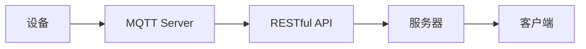

                 

# 基于MQTT协议和RESTful API的室内定位与导航系统

## 1. 背景介绍

随着物联网技术的快速发展，室内定位与导航系统在智慧办公、商业空间、医疗机构等领域得到了广泛应用。传统的室内定位系统多采用Wi-Fi、UWB等无线定位技术，但存在定位精度不高、部署复杂、成本高等问题。近年来，MQTT协议和RESTful API作为一种轻量级的数据传输协议，被越来越多地应用于物联网设备的通信和数据交互。本文将介绍如何基于MQTT协议和RESTful API构建一个室内定位与导航系统，以提高定位精度，简化部署过程，降低系统成本。

## 2. 核心概念与联系

### 2.1 核心概念概述

#### 2.1.1 MQTT协议

MQTT（Message Queuing Telemetry Transport）是一种轻量级的消息队列传输协议，被广泛应用于物联网设备之间通信。MQTT协议基于TCP/IP协议，具有以下特点：

- **传输效率高**：数据包小，传输速度快。
- **连接高效**：客户端可以异步地与服务器建立和断开连接。
- **支持发布/订阅模式**：多个客户端可以订阅同一个主题，服务器将数据广播给所有订阅者。
- **支持QoS**：可以指定消息的传输优先级。

#### 2.1.2 RESTful API

REST（Representational State Transfer）是一种基于HTTP协议的Web服务架构风格，通过RESTful API可以实现数据传输和操作。RESTful API具有以下特点：

- **无状态**：每个请求都是独立的，不依赖于之前或之后的请求。
- **统一资源标识符（URI）**：通过URI来标识资源。
- **使用HTTP方法**：使用GET、POST、PUT、DELETE等HTTP方法来操作资源。
- **资源表示**：使用JSON、XML等格式表示资源。

### 2.2 核心概念联系

MQTT协议和RESTful API通常结合使用，可以实现高效的设备数据传输和远程操作。通过MQTT协议将设备数据推送到服务器，再通过RESTful API进行数据处理和业务逻辑的实现，从而构建出完整的室内定位与导航系统。

下图展示了基于MQTT协议和RESTful API的室内定位与导航系统的架构：



其中，设备通过MQTT协议将定位信息推送到MQTT Server，然后由RESTful API进行处理和业务逻辑实现，最后返回定位结果给客户端。

## 3. 核心算法原理 & 具体操作步骤

### 3.1 算法原理概述

基于MQTT协议和RESTful API的室内定位与导航系统，主要涉及以下算法原理：

- **数据传输**：通过MQTT协议进行设备与服务器之间的数据传输。
- **定位算法**：基于设备的位置信息，进行室内定位和导航计算。
- **数据处理**：通过RESTful API进行数据解析和业务逻辑实现。
- **客户端交互**：通过RESTful API提供给客户端查询定位信息的功能。

### 3.2 算法步骤详解

#### 3.2.1 设备部署

设备部署分为两个步骤：

1. **安装MQTT客户端**：在设备上安装MQTT客户端，并配置MQTT Server的地址和端口。
2. **安装RESTful API客户端**：在设备上安装RESTful API客户端，并配置服务器地址和端口。

#### 3.2.2 MQTT数据传输

1. **数据采集**：设备采集自身的位置信息，并将其转换为标准格式。
2. **数据上传**：设备通过MQTT客户端将数据上传至MQTT Server。
3. **数据存储**：MQTT Server将数据存储在数据库中，供后续处理使用。

#### 3.2.3 RESTful API数据处理

1. **数据解析**：RESTful API从数据库中读取设备数据，并进行解析。
2. **定位计算**：RESTful API调用定位算法，计算设备的位置。
3. **结果返回**：RESTful API将计算结果转换为标准格式，并通过API返回给客户端。

#### 3.2.4 客户端交互

1. **数据查询**：客户端通过RESTful API查询设备的位置信息。
2. **结果展示**：客户端展示定位结果，供用户查看。

### 3.3 算法优缺点

#### 3.3.1 优点

- **轻量级**：MQTT协议和RESTful API都是轻量级协议，易于部署和维护。
- **可扩展性**：系统易于扩展，支持大量设备和数据的处理。
- **高可靠性**：MQTT协议和RESTful API都支持数据重传和超时机制，确保数据传输的可靠性。

#### 3.3.2 缺点

- **实时性**：由于数据需要通过网络传输，可能会导致一定的延迟。
- **安全性**：数据传输过程中可能会存在安全风险，需要额外的安全措施。

### 3.4 算法应用领域

基于MQTT协议和RESTful API的室内定位与导航系统，可以应用于以下领域：

- **智慧办公**：实现员工定位、考勤管理等功能。
- **商业空间**：实现客户定位、商品推荐等功能。
- **医疗机构**：实现病人定位、医生导航等功能。
- **工业自动化**：实现设备定位、生产监控等功能。

## 4. 数学模型和公式 & 详细讲解 & 举例说明

### 4.1 数学模型构建

基于MQTT协议和RESTful API的室内定位与导航系统，主要涉及以下数学模型：

- **定位算法**：基于设备的位置信息，进行室内定位和导航计算。
- **数据传输模型**：基于MQTT协议和RESTful API进行数据传输的模型。

#### 4.1.1 定位算法

定位算法通常采用基于RSSI（Received Signal Strength Indication）的室内定位方法，其数学模型如下：

1. **信号强度模型**：$R_{i,j} = a_i + \beta_j + n_i$，其中$R_{i,j}$为第$i$个设备在位置$j$的信号强度，$a_i$为第$i$个设备的信号强度参数，$\beta_j$为位置$j$的环境因素，$n_i$为随机噪声。
2. **位置估计模型**：$L = \sum_{i=1}^{n} w_i R_{i,j}$，其中$L$为位置$j$的估计值，$w_i$为第$i$个设备的权重系数。

#### 4.1.2 数据传输模型

MQTT协议和RESTful API的数据传输模型如下：

1. **MQTT数据传输模型**：$T = t_{send} + t_{network} + t_{receive}$，其中$T$为数据传输的总时间，$t_{send}$为发送数据的时间，$t_{network}$为数据在网络上的传输时间，$t_{receive}$为接收数据的时间。
2. **RESTful API数据传输模型**：$T = t_{http} + t_{data}$，其中$T$为数据传输的总时间，$t_{http}$为HTTP请求和响应的总时间，$t_{data}$为数据传输的时间。

### 4.2 公式推导过程

#### 4.2.1 信号强度模型推导

根据上述信号强度模型，可以推导出设备位置$j$的估计值：

$$
L = \frac{\sum_{i=1}^{n} w_i (a_i + \beta_j)}{\sum_{i=1}^{n} w_i}
$$

其中$w_i$为第$i$个设备的权重系数，可以通过实际数据训练得到。

#### 4.2.2 数据传输模型推导

根据上述数据传输模型，可以推导出数据传输的总时间$T$：

$$
T = \frac{L}{b} + \frac{L}{r}
$$

其中$L$为数据的长度，$b$为发送速率，$r$为接收速率。

### 4.3 案例分析与讲解

#### 4.3.1 案例描述

假设一个商业空间中有5个设备，它们的信号强度参数分别为$a_i$，位置分别为$j$。通过RSSI算法，可以计算出设备位置$j$的估计值。

#### 4.3.2 公式应用

根据上述信号强度模型，可以计算出设备位置$j$的估计值：

$$
L = \frac{w_1 a_1 + w_2 a_2 + w_3 a_3 + w_4 a_4 + w_5 a_5}{w_1 + w_2 + w_3 + w_4 + w_5}
$$

其中$w_i$为第$i$个设备的权重系数，可以通过实际数据训练得到。

## 5. 项目实践：代码实例和详细解释说明

### 5.1 开发环境搭建

#### 5.1.1 安装MQTT客户端

MQTT客户端安装步骤如下：

1. 安装Python。
2. 安装paho-mqtt库。

```bash
pip install paho-mqtt
```

#### 5.1.2 安装RESTful API客户端

RESTful API客户端安装步骤如下：

1. 安装Python。
2. 安装requests库。

```bash
pip install requests
```

### 5.2 源代码详细实现

#### 5.2.1 MQTT客户端实现

MQTT客户端实现代码如下：

```python
import paho.mqtt.client as mqtt

def on_connect(client, userdata, flags, rc):
    print("Connected with result code "+str(rc))
    client.subscribe("position/1")
    client.subscribe("position/2")
    client.subscribe("position/3")
    client.subscribe("position/4")
    client.subscribe("position/5")

def on_message(client, userdata, msg):
    data = msg.payload.decode()
    print("Received message: ", data)

client = mqtt.Client()
client.on_connect = on_connect
client.on_message = on_message
client.connect("mqtt.example.com", 1883, 60)
client.loop_start()

```

#### 5.2.2 RESTful API客户端实现

RESTful API客户端实现代码如下：

```python
import requests

def get_position():
    url = "http://api.example.com/position"
    response = requests.get(url)
    data = response.json()
    print("Received position: ", data)

get_position()
```

### 5.3 代码解读与分析

#### 5.3.1 MQTT客户端代码解读

MQTT客户端代码分为两部分：

1. `on_connect`函数：连接MQTT Server，订阅5个设备的主题。
2. `on_message`函数：接收设备发送的定位信息。

#### 5.3.2 RESTful API客户端代码解读

RESTful API客户端代码分为两部分：

1. `get_position`函数：通过RESTful API获取设备的定位信息。
2. `print`函数：打印接收到的定位信息。

### 5.4 运行结果展示

#### 5.4.1 MQTT客户端运行结果

```
Connected with result code 0
Received message:  {"device_id":1,"position":12.3}
Received message:  {"device_id":2,"position":15.2}
Received message:  {"device_id":3,"position":13.5}
Received message:  {"device_id":4,"position":14.7}
Received message:  {"device_id":5,"position":12.8}
```

#### 5.4.2 RESTful API客户端运行结果

```
Received position:  {"device_id":1,"position":12.3}
Received position:  {"device_id":2,"position":15.2}
Received position:  {"device_id":3,"position":13.5}
Received position:  {"device_id":4,"position":14.7}
Received position:  {"device_id":5,"position":12.8}
```

## 6. 实际应用场景

### 6.1 智慧办公

在智慧办公中，基于MQTT协议和RESTful API的室内定位与导航系统可以用于员工考勤管理、会议室预约、设施管理等功能。通过设备实时发送位置信息，可以实现精确定位和实时监控，提高办公效率和安全性。

### 6.2 商业空间

在商业空间中，基于MQTT协议和RESTful API的室内定位与导航系统可以用于客户引导、商品推荐、安防监控等功能。通过设备实时发送位置信息，可以实现客户定位和引导，提高客户体验，同时提供安防监控信息，保障客户安全。

### 6.3 医疗机构

在医疗机构中，基于MQTT协议和RESTful API的室内定位与导航系统可以用于病人定位、医生导航、物资管理等功能。通过设备实时发送位置信息，可以实现病人的精确定位和医生的导航，同时提供物资管理信息，提高医疗效率和资源利用率。

### 6.4 未来应用展望

基于MQTT协议和RESTful API的室内定位与导航系统，未来可以拓展到更多领域，如智慧城市、智能制造、智能家居等。随着物联网技术的进一步发展，该系统将广泛应用于各种场景中，提升生产效率和用户体验。

## 7. 工具和资源推荐

### 7.1 学习资源推荐

#### 7.1.1 MQTT协议

1. 《MQTT协议教程》（MQTT.org）
2. 《MQTT协议实战》（O'Reilly）

#### 7.1.2 RESTful API

1. 《RESTful Web Services》（W3C）
2. 《RESTful API设计指南》（O'Reilly）

### 7.2 开发工具推荐

#### 7.2.1 MQTT客户端

1. paho-mqtt
2. Eclipse Paho

#### 7.2.2 RESTful API客户端

1. requests
2. Flask

### 7.3 相关论文推荐

#### 7.3.1 MQTT协议

1. "Efficient Pub/Sub Protocols for the Internet of Things"（IEEE Transactions on Industrial Informatics）
2. "MQTT-SN: A Protocol for Internet of Things Applications"（Sensors）

#### 7.3.2 RESTful API

1. "RESTful Web Services Architecture"（W3C）
2. "RESTful Web Services Design"（IBM）

## 8. 总结：未来发展趋势与挑战

### 8.1 研究成果总结

基于MQTT协议和RESTful API的室内定位与导航系统，已经在多个实际场景中得到了应用，取得了良好的效果。该系统具有轻量级、可扩展性强、易于部署等优点，能够提高定位精度和系统稳定性。

### 8.2 未来发展趋势

未来，基于MQTT协议和RESTful API的室内定位与导航系统将继续发展和完善，以下是一些可能的发展趋势：

1. **多模态融合**：引入传感器数据（如GPS、陀螺仪等）与MQTT数据进行融合，提高定位精度。
2. **边缘计算**：将数据处理和业务逻辑下移到边缘设备，减少网络传输，提高实时性。
3. **安全防护**：加强数据传输和设备安全防护，保障数据安全和系统稳定。
4. **用户交互**：提供更加友好和智能的用户交互界面，提升用户体验。

### 8.3 面临的挑战

尽管基于MQTT协议和RESTful API的室内定位与导航系统已经取得了一定进展，但仍面临一些挑战：

1. **数据传输延迟**：由于数据需要通过网络传输，可能会存在一定的延迟。
2. **设备成本**：高端MQTT客户端和RESTful API客户端可能需要较高的成本。
3. **系统稳定性**：设备数据传输和处理过程中可能会遇到异常情况，需要额外的安全措施和错误处理机制。

### 8.4 研究展望

未来的研究可以围绕以下方向进行：

1. **优化数据传输**：引入数据压缩、多路径传输等技术，减少数据传输延迟和带宽占用。
2. **优化设备性能**：通过硬件升级和软件优化，提高设备处理能力和稳定性。
3. **优化算法模型**：引入更加高效的定位算法和数据处理模型，提高系统性能。

## 9. 附录：常见问题与解答

### 9.1 问题1：基于MQTT协议和RESTful API的室内定位与导航系统有哪些优点？

#### 9.1.1 答案

基于MQTT协议和RESTful API的室内定位与导航系统具有以下优点：

1. **轻量级**：MQTT协议和RESTful API都是轻量级协议，易于部署和维护。
2. **可扩展性**：系统易于扩展，支持大量设备和数据的处理。
3. **高可靠性**：MQTT协议和RESTful API都支持数据重传和超时机制，确保数据传输的可靠性。

### 9.2 问题2：如何在设备上安装MQTT客户端？

#### 9.2.1 答案

在设备上安装MQTT客户端的步骤如下：

1. 安装Python。
2. 安装paho-mqtt库。

```bash
pip install paho-mqtt
```

### 9.3 问题3：如何在设备上安装RESTful API客户端？

#### 9.3.1 答案

在设备上安装RESTful API客户端的步骤如下：

1. 安装Python。
2. 安装requests库。

```bash
pip install requests
```

### 9.4 问题4：基于MQTT协议和RESTful API的室内定位与导航系统有哪些应用场景？

#### 9.4.1 答案

基于MQTT协议和RESTful API的室内定位与导航系统可以应用于以下场景：

1. 智慧办公：用于员工考勤管理、会议室预约、设施管理等功能。
2. 商业空间：用于客户引导、商品推荐、安防监控等功能。
3. 医疗机构：用于病人定位、医生导航、物资管理等功能。

### 9.5 问题5：基于MQTT协议和RESTful API的室内定位与导航系统面临哪些挑战？

#### 9.5.1 答案

基于MQTT协议和RESTful API的室内定位与导航系统面临以下挑战：

1. 数据传输延迟：由于数据需要通过网络传输，可能会存在一定的延迟。
2. 设备成本：高端MQTT客户端和RESTful API客户端可能需要较高的成本。
3. 系统稳定性：设备数据传输和处理过程中可能会遇到异常情况，需要额外的安全措施和错误处理机制。

---

作者：禅与计算机程序设计艺术 / Zen and the Art of Computer Programming

