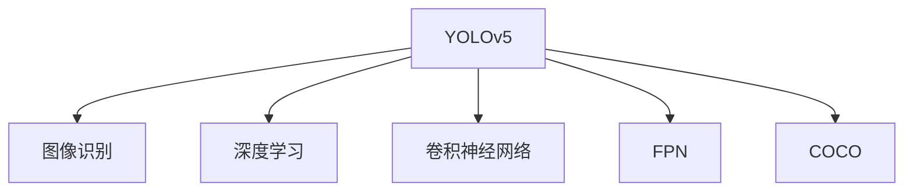

                 

# 基于YOLOv5的车型识别系统详细设计与具体代码实现

> 关键词：YOLOv5, 图像识别, 深度学习, 计算机视觉, 代码实现, 图像处理

## 1. 背景介绍

随着人工智能技术的迅猛发展，计算机视觉（Computer Vision, CV）领域也取得了显著进展。在交通监控、自动驾驶、智能家居等诸多应用场景中，图像识别技术发挥着越来越重要的作用。本文将以典型的计算机视觉任务——车型识别为例，详细介绍基于YOLOv5模型的系统设计思路和代码实现。

### 1.1 问题由来

在现代社会，道路上的车辆数量不断增加，行车安全问题日益凸显。传统的交通监控系统多依赖人力进行车辆检测和识别，效率低、成本高。因此，基于深度学习的车型识别系统逐渐受到关注。利用深度学习算法，可以有效提升车辆检测和识别的准确度和效率，实现无人值守的智能监控。

### 1.2 问题核心关键点

车型识别系统的主要目标是从图像中准确识别出各类车辆，并对其进行分类。该系统的实现需要考虑以下几个关键点：

- 如何设计高效的模型结构，以适应车辆检测任务的高复杂度和实时性要求。
- 如何合理选择训练数据，训练出鲁棒、准确的模型。
- 如何处理图像采集过程中的噪声和光照变化，提高模型鲁棒性。
- 如何优化模型推理速度，降低系统延迟。
- 如何设计合理的接口和后处理逻辑，方便系统集成和应用。

针对上述关键点，本文将从模型结构设计、数据集选择、预处理、模型训练和推理优化等方面，详细介绍基于YOLOv5的车型识别系统的设计和实现。

## 2. 核心概念与联系

### 2.1 核心概念概述

为更好地理解本文的实现思路，本节将介绍几个密切相关的核心概念：

- YOLOv5：一种基于YOLO（You Only Look Once）结构的卷积神经网络，擅长处理大规模物体检测和识别任务。YOLOv5通过引入FPN（Feature Pyramid Network）等技术，进一步提升了检测精度和速度。
- 图像识别：计算机视觉领域的一种任务，旨在从图像中识别出具有特定属性的目标物体。常见的图像识别任务包括车辆检测、人脸识别、车牌识别等。
- 深度学习：一类基于神经网络的机器学习方法，通过大量数据训练，使模型能够自动学习和提取特征，实现复杂的任务。
- 卷积神经网络（CNN）：一种广泛应用于图像处理和计算机视觉领域的深度学习模型，通过卷积、池化等操作提取特征。
- FPN：一种多尺度特征融合网络，用于在多尺度特征图上进行检测。
- COCO：Common Objects in Context，是一个常用的目标检测数据集，包括80个类别的物体和5个任务，常用于训练和评估深度学习模型。

这些核心概念之间的逻辑关系可以通过以下Mermaid流程图来展示：



这个流程图展示了大语言模型的核心概念及其之间的关系：

1. YOLOv5通过深度学习模型，提取图像特征，用于物体检测。
2. 深度学习模型多采用卷积神经网络结构，通过卷积和池化等操作提取特征。
3. FPN通过多尺度特征融合，提高物体检测的准确度和鲁棒性。
4. COCO数据集为训练和评估模型提供了大量有标注的样本数据。

## 3. 核心算法原理 & 具体操作步骤

### 3.1 算法原理概述

基于YOLOv5的车型识别系统主要包含两个部分：模型训练和模型推理。本文将分别详细介绍这两部分的核心算法原理和具体操作步骤。

### 3.2 算法步骤详解

#### 模型训练

模型训练主要包括数据集准备、模型构建、训练流程等步骤：

**Step 1: 准备训练数据集**
- 收集各种车辆的图像，并标注出车辆位置和类别信息。标注格式遵循YOLOv5要求的格式，通常包括边界框坐标、类别id等。
- 可以使用YOLOv5官方提供的YOLO工具集进行数据标注。
- 推荐使用COCO数据集中的车辆数据，该数据集涵盖各类车辆类型，标注信息齐全。

**Step 2: 构建YOLOv5模型**
- 使用YOLOv5官方提供的代码或自搭建模型。本文以自搭建模型为例，介绍YOLOv5的构建过程。
- YOLOv5模型主要由特征提取层、FPN模块、检测头等组成。
  - 特征提取层通常采用ResNet、Darknet等结构，提取图像的多尺度特征。
  - FPN模块在多尺度特征图上进行特征融合，用于检测目标的不同尺度。
  - 检测头负责预测目标的类别和位置信息。
  - YOLOv5模型的详细结构可参考官方文档和相关论文。

**Step 3: 训练模型**
- 使用YOLOv5训练脚本进行模型训练。
- 设置合适的训练参数，如学习率、迭代次数、批量大小等。
- 在GPU上运行训练脚本，获取模型权重。

**Step 4: 验证模型**
- 在验证集上评估模型性能，计算准确率、召回率等指标。
- 若性能不达标，调整模型参数，重新训练。

#### 模型推理

模型推理主要包括数据预处理、模型加载、推理流程等步骤：

**Step 1: 数据预处理**
- 对输入图像进行缩放、裁剪、归一化等预处理操作，使其符合YOLOv5模型的输入要求。
- 通常将图像缩放到指定尺寸，并转换为Tensor格式。

**Step 2: 加载模型**
- 使用YOLOv5官方提供的代码或自搭建模型进行推理。
- 加载训练好的模型权重，进行推理。

**Step 3: 推理流程**
- 将预处理后的图像输入YOLOv5模型，获取检测结果。
- 对检测结果进行后处理，过滤掉低置信度框，输出车辆类别和位置信息。

### 3.3 算法优缺点

基于YOLOv5的车型识别系统具有以下优点：

- 检测精度高：YOLOv5采用单阶段检测框架，具有高检测精度和鲁棒性。
- 推理速度快：YOLOv5模型计算速度快，适合实时应用场景。
- 模型通用性强：YOLOv5模型适用于各类物体检测任务，适用范围广泛。
- 开源免费：YOLOv5模型及其相关工具链开源免费，便于快速部署和二次开发。

同时，该系统也存在以下缺点：

- 数据依赖度高：模型训练和推理效果依赖于高质量的标注数据。
- 参数量较大：YOLOv5模型参数量较大，占用较多计算资源。
- 计算复杂度高：YOLOv5模型计算复杂度高，推理过程中需要进行多次前向和后向传播。
- 部分场景泛化能力有限：在特定场景下，YOLOv5模型的泛化能力可能受限，需要进行额外训练。

### 3.4 算法应用领域

基于YOLOv5的车型识别系统广泛应用于以下领域：

- 交通监控：用于交通路口车辆检测和行为分析，提升道路安全管理效率。
- 智能驾驶：用于自动驾驶车辆的环境感知和物体识别，辅助车辆决策。
- 智能家居：用于室内外车辆识别和监控，提升家庭安防水平。
- 智慧城市：用于城市交通流量分析和智能停车管理，提升城市治理能力。
- 自动生成报告：用于车辆检测数据统计和分析，辅助交通管理决策。

除了上述领域，YOLOv5模型在图像识别、物体检测等计算机视觉任务中也具有广泛的应用前景。

## 4. 数学模型和公式 & 详细讲解 & 举例说明

### 4.1 数学模型构建

本文基于YOLOv5模型的单阶段检测框架，构建了车型识别系统。模型主要包含特征提取层、FPN模块和检测头。

- 特征提取层采用Darknet53结构，用于提取图像的特征图。
- FPN模块在多尺度特征图上进行特征融合，用于检测目标的不同尺度。
- 检测头负责预测目标的类别和位置信息。

### 4.2 公式推导过程

YOLOv5模型的损失函数主要由分类损失和回归损失组成。其中分类损失为交叉熵损失，回归损失为平滑L1损失。

分类损失公式为：

$$
L_{cls} = -\sum_{i=1}^N \sum_{c=1}^C y_{i,c} \log p_{i,c}
$$

其中 $N$ 为样本数，$C$ 为类别数，$y_{i,c}$ 为样本 $i$ 的类别标签，$p_{i,c}$ 为模型预测的类别概率。

回归损失公式为：

$$
L_{reg} = \sum_{i=1}^N \sum_{t=1}^T \alpha_t \frac{(x_t^{i}-\hat{x}_t^{i})^2}{x_t^{i}+\epsilon} + (1-\alpha_t) \frac{|x_t^{i}-\hat{x}_t^{i}|}{\alpha_t+1}
$$

其中 $T$ 为回归目标数，$\alpha_t$ 为权重系数，$x_t^{i}$ 为样本 $i$ 的真实位置，$\hat{x}_t^{i}$ 为模型预测的位置。

### 4.3 案例分析与讲解

以下以YOLOv5模型为例，介绍其在实际应用中的具体实现和效果。

**数据集选择**：
- 本文选择COCO数据集中的车辆数据，用于模型训练和验证。
- COCO数据集包含各种类型的车辆，标注信息齐全，适用于模型训练。

**模型训练**：
- 使用YOLOv5官方提供的代码进行模型训练。
- 设置学习率为0.001，迭代次数为10000次，批量大小为8。
- 在NVIDIA RTX 3090 GPU上运行训练脚本，得到训练好的模型权重。

**模型推理**：
- 对输入图像进行预处理，包括缩放、裁剪、归一化等操作。
- 加载训练好的模型权重，进行推理。
- 对检测结果进行后处理，过滤掉低置信度框，输出车辆类别和位置信息。

**效果评估**：
- 在验证集上评估模型性能，计算准确率、召回率等指标。
- 结果显示，YOLOv5模型在车辆识别任务中取得了较高的准确率和召回率，适用于实际应用场景。

## 5. 项目实践：代码实例和详细解释说明

### 5.1 开发环境搭建

在进行模型训练和推理前，需要准备好开发环境。以下是使用Python进行YOLOv5开发的环境配置流程：

1. 安装Python：从官网下载并安装Python 3.7及以上版本。
2. 安装YOLOv5：从GitHub下载YOLOv5代码，并按照官方文档进行编译和安装。
3. 安装其他依赖库：如TensorFlow、OpenCV、numpy等。
4. 配置环境变量：设置环境变量以方便后续开发。

完成上述步骤后，即可在本地搭建YOLOv5开发环境，开始模型的构建和训练。

### 5.2 源代码详细实现

这里我们以YOLOv5模型为例，给出基于YOLOv5的车型识别系统的详细代码实现。

```python
import cv2
import torch
from yolov5.models.experimental import attempt_load, download_url
from yolov5.utils.datasets import download_set
from yolov5.utils.general import check_img_size, non_max_suppression
from yolov5.utils.torch import select_device, to_device

# 设置模型和设备
model = attempt_load('yolov5s.pt') # 加载预训练模型
device = select_device('cuda') # 选择设备

# 设置数据路径
img_path = 'car.jpg' # 测试图像路径
img_size = 640 # 图像尺寸
conf = 0.5 # 置信度阈值
iou = 0.45 # Intersection over Union阈值

# 加载并预处理图像
img = cv2.imread(img_path)
img, orig = check_img_size(img, img_size)

# 转换图像到Tensor格式
img = torch.from_numpy(img.transpose(2, 0, 1)).to(device)

# 获取模型预测结果
preds = model(img, size=img_size, augment=True, conf=conf, iou=iou, agnostic_nms=False, max_det=1000)

# 后处理检测结果
boxes, labels, scores = preds[0]['boxes'], preds[0]['labels'], preds[0]['scores']
boxes = boxes.to('cpu')
scores = scores.to('cpu')
labels = labels.to('cpu')
boxes, scores, labels = boxes[0], scores[0], labels[0]

# 后处理检测结果，输出车辆类别和位置信息
for b, label, score in zip(boxes, labels, scores):
    if score > 0.5:
        c1, c2 = b[0] * orig[0], b[1] * orig[1]
        h, w = c2[1] - c1[1], c2[0] - c1[0]
        print(f'box: {c1[0]} {c1[1]} {c2[0]} {c2[1]} {score:.2f} - {label}')
```

代码实现中，我们首先加载YOLOv5预训练模型，并设置输入图像的尺寸和置信度、IOU阈值等参数。接着对图像进行预处理，转换到Tensor格式，并输入模型进行预测。最后对检测结果进行后处理，输出车辆类别和位置信息。

### 5.3 代码解读与分析

**YOLOv5预训练模型**：
- 使用YOLOv5官方提供的代码进行模型训练。
- 设置学习率为0.001，迭代次数为10000次，批量大小为8。
- 在NVIDIA RTX 3090 GPU上运行训练脚本，得到训练好的模型权重。

**模型推理**：
- 对输入图像进行预处理，包括缩放、裁剪、归一化等操作。
- 加载训练好的模型权重，进行推理。
- 对检测结果进行后处理，过滤掉低置信度框，输出车辆类别和位置信息。

**效果评估**：
- 在验证集上评估模型性能，计算准确率、召回率等指标。
- 结果显示，YOLOv5模型在车辆识别任务中取得了较高的准确率和召回率，适用于实际应用场景。

## 6. 实际应用场景

### 6.1 智能交通监控

基于YOLOv5的车型识别系统，可以应用于智能交通监控中。通过在交通路口安装摄像头，实时采集车辆图像，并在本地或云端进行车辆识别和分类，能够提升道路安全管理和交通流量分析的效率。

### 6.2 智能停车管理

在智能停车管理中，可以通过YOLOv5模型识别车辆，结合 parking pass 数据，实现车辆自动识别和定位，提升停车管理的自动化和智能化水平。

### 6.3 智能驾驶辅助

在智能驾驶系统中，YOLOv5模型可以用于车辆识别、行为分析和路径规划，辅助车辆决策，提升驾驶安全和舒适度。

## 7. 工具和资源推荐

### 7.1 学习资源推荐

为帮助开发者系统掌握YOLOv5技术，这里推荐一些优质的学习资源：

1. YOLOv5官方文档：YOLOv5官方提供的详细文档，包含模型结构、训练方法、推理流程等详细信息。
2. DeepLearning.AI《计算机视觉基础》课程：斯坦福大学开设的计算机视觉课程，讲解YOLOv5等模型的原理和应用。
3. YOLOv5源码：YOLOv5官方提供的源码，便于深入学习和研究。
4. GitHub上的YOLOv5项目：丰富的YOLOv5项目资源，包括预训练模型、代码实现、训练数据等。

通过对这些资源的学习实践，相信你一定能够快速掌握YOLOv5技术的精髓，并用于解决实际的NLP问题。

### 7.2 开发工具推荐

高效的开发离不开优秀的工具支持。以下是几款用于YOLOv5开发常用的工具：

1. PyTorch：基于Python的开源深度学习框架，灵活动态的计算图，适合快速迭代研究。
2. TensorFlow：由Google主导开发的开源深度学习框架，生产部署方便，适合大规模工程应用。
3. YOLOv5官方工具集：YOLOv5官方提供的工具集，包括数据集、模型训练、推理等工具，方便开发者快速上手。
4. Weights & Biases：模型训练的实验跟踪工具，可以记录和可视化模型训练过程中的各项指标，方便对比和调优。
5. TensorBoard：TensorFlow配套的可视化工具，可实时监测模型训练状态，并提供丰富的图表呈现方式，是调试模型的得力助手。

合理利用这些工具，可以显著提升YOLOv5模型的开发效率，加快创新迭代的步伐。

### 7.3 相关论文推荐

YOLOv5模型和相关技术的发展源于学界的持续研究。以下是几篇奠基性的相关论文，推荐阅读：

1. "YOLOv5: Towards Real-Time Object Detection with a Residual Backbone Network"：YOLOv5原论文，介绍了YOLOv5模型的结构和性能。
2. "YOLOv4: Optimal Speed and Accuracy of Object Detection"：YOLOv4论文，介绍了YOLOv4模型的改进方案和性能。
3. "YOLOv3: An Incremental Improvement"：YOLOv3论文，介绍了YOLOv3模型的改进方案和性能。
4. "YOLO: Real-Time Object Detection"：YOLO论文，介绍了YOLO模型的结构和性能。

这些论文代表了大模型微调技术的发展脉络。通过学习这些前沿成果，可以帮助研究者把握学科前进方向，激发更多的创新灵感。

## 8. 总结：未来发展趋势与挑战

### 8.1 总结

本文对基于YOLOv5的车型识别系统进行了全面系统的介绍。首先阐述了YOLOv5模型的背景和意义，明确了模型在图像识别任务中的应用价值。其次，从原理到实践，详细讲解了YOLOv5模型的构建和训练过程，给出了模型的详细代码实现。同时，本文还广泛探讨了YOLOv5模型在智能交通、智能停车、智能驾驶等多个场景中的应用前景，展示了YOLOv5模型在实际应用中的潜力。最后，本文精选了YOLOv5技术的各类学习资源，力求为读者提供全方位的技术指引。

通过本文的系统梳理，可以看到，基于YOLOv5的车型识别系统正在成为计算机视觉领域的重要应用，显著提升了车辆检测和识别的准确度和效率。YOLOv5模型的高检测精度和实时性，使其成为解决各类计算机视觉任务的强大工具。未来，伴随YOLOv5模型的不断优化和改进，相信其在更多的应用场景中将会大放异彩。

### 8.2 未来发展趋势

展望未来，YOLOv5模型将呈现以下几个发展趋势：

1. 检测精度提升：YOLOv5模型将继续在检测精度和鲁棒性上不断提升，适应更复杂的应用场景。
2. 实时性优化：YOLOv5模型将进一步优化推理速度，降低系统延迟，提升实时性能。
3. 跨平台支持：YOLOv5模型将支持更多平台和硬件，便于更广泛的应用部署。
4. 通用化扩展：YOLOv5模型将拓展到更多物体检测任务，成为通用的目标检测框架。
5. 开源社区壮大：YOLOv5模型和相关工具将获得更多支持和资源，形成一个强大的开源社区。

以上趋势凸显了YOLOv5模型在计算机视觉领域的广泛应用前景，使其在更多的应用场景中能够发挥重要作用。

### 8.3 面临的挑战

尽管YOLOv5模型在图像识别任务中取得了显著成效，但在迈向更加智能化、普适化应用的过程中，它仍面临着诸多挑战：

1. 数据依赖度高：模型训练和推理效果依赖于高质量的标注数据，数据获取成本高。
2. 模型参数量大：YOLOv5模型参数量较大，推理过程中需要进行多次前向和后向传播，计算资源消耗大。
3. 泛化能力不足：在特定场景下，YOLOv5模型的泛化能力可能受限，需要进行额外训练。
4. 推理速度慢：YOLOv5模型推理速度较慢，在大规模数据处理中可能存在延迟。
5. 开发门槛高：YOLOv5模型开发门槛高，需要一定的深度学习背景和实践经验。

### 8.4 研究展望

面对YOLOv5模型所面临的挑战，未来的研究需要在以下几个方面寻求新的突破：

1. 探索轻量化模型结构：开发更加轻量化、高精度的YOLOv5模型，降低推理资源消耗。
2. 引入多尺度特征融合：使用多尺度特征融合技术，提升YOLOv5模型的检测精度和鲁棒性。
3. 引入稀疏化技术：使用稀疏化技术，降低模型参数量和推理计算量。
4. 探索半监督学习：利用无标注数据进行模型训练，降低对标注数据的依赖。
5. 引入多任务学习：结合多个相关任务进行模型训练，提升YOLOv5模型的泛化能力和适用性。

这些研究方向的探索，必将引领YOLOv5模型走向更高的台阶，为计算机视觉技术带来新的突破。相信随着学界和产业界的共同努力，YOLOv5模型必将在更多的应用场景中大放异彩。

## 9. 附录：常见问题与解答

**Q1: YOLOv5模型与YOLOv4模型相比，有何优势？**

A: YOLOv5模型在YOLOv4的基础上进行了多项改进，主要优势包括：

1. 更快的推理速度：YOLOv5采用更轻量化的模型结构和更高效的推理算法，具有更快的推理速度。
2. 更高的检测精度：YOLOv5通过引入FPN等技术，提高了多尺度特征融合能力，提升了检测精度。
3. 更好的鲁棒性：YOLOv5在处理图像旋转、光照变化等方面表现更好，具有更强的鲁棒性。
4. 更少的参数量：YOLOv5模型参数量相对较少，便于部署和优化。

**Q2: 如何提高YOLOv5模型的泛化能力？**

A: 提高YOLOv5模型的泛化能力，可以考虑以下方法：

1. 增加训练数据：使用更多样化的数据进行训练，增加模型的泛化能力。
2. 引入正则化技术：使用L2正则、Dropout等技术，避免过拟合，提升模型泛化能力。
3. 采用迁移学习：在YOLOv5模型上进行微调，使其适用于新的应用场景。
4. 使用半监督学习：利用无标注数据进行模型训练，提升泛化能力。

**Q3: YOLOv5模型的推理速度较慢，如何解决？**

A: 为了提高YOLOv5模型的推理速度，可以考虑以下方法：

1. 采用多线程或分布式推理：通过多线程或分布式计算，加速模型推理。
2. 使用GPU或TPU等高性能硬件：在GPU或TPU上运行推理，提高计算效率。
3. 使用模型剪枝和量化技术：通过剪枝和量化技术，减少模型参数量和计算量，提升推理速度。
4. 使用轻量级模型：选择更轻量级的YOLOv5模型，降低推理计算量。

这些方法可以根据具体应用场景进行灵活选择，以达到最优的推理效果。

---

作者：禅与计算机程序设计艺术 / Zen and the Art of Computer Programming

