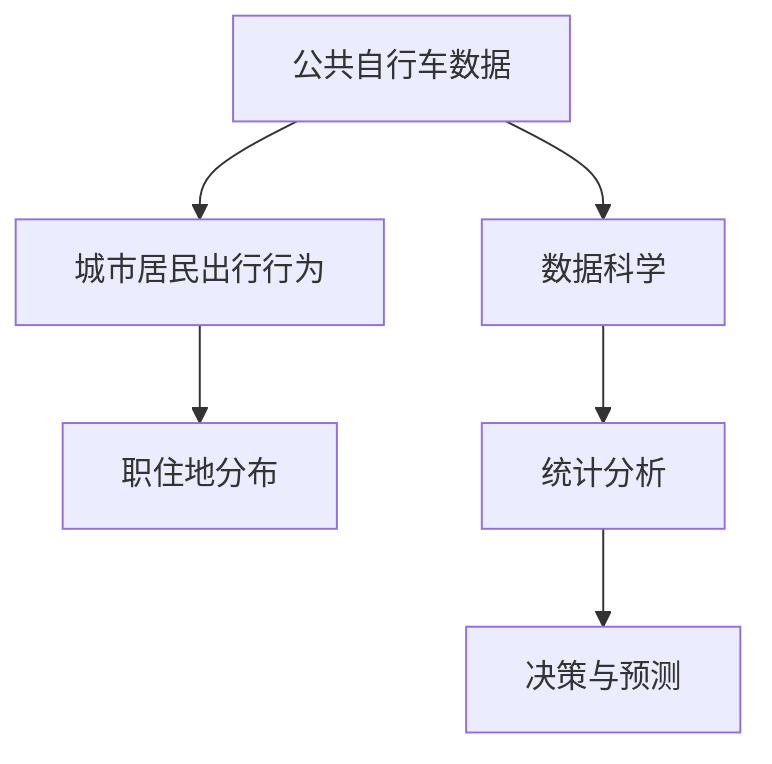

                 

# 基于公共自行车数据的城市居民职住地分析

> 关键词：公共自行车, 城市交通, 职住地分析, 数据科学, 统计分析

## 1. 背景介绍

### 1.1 问题由来
随着城市化进程的加快，交通拥堵、环境污染等问题日益凸显，成为了影响城市居民生活质量和城市可持续发展的重要因素。如何高效、绿色地解决城市居民的出行问题，成为了城市规划和交通管理的重要课题。

公共自行车作为一种环保、便捷的出行方式，在国内外得到了广泛应用。通过共享公共自行车，可以有效减少私家车的使用，降低城市交通压力，同时增加市民的出行选择，提高市民健康水平。因此，对公共自行车的使用情况进行分析，有助于了解城市居民的出行偏好、职住分布和交通需求，为城市交通规划和管理提供决策依据。

### 1.2 问题核心关键点
本文聚焦于基于公共自行车数据的城市居民职住地分析。具体来说，将使用公共自行车数据，结合城市居民出行行为和职住分布数据，进行多维度的统计分析和建模，以期深入理解城市居民的职住特征和出行模式，为城市交通规划和优化提供科学依据。

### 1.3 问题研究意义
研究公共自行车数据的城市居民职住地分析，对于提升城市交通管理水平、促进绿色出行、改善居民生活质量具有重要意义：

1. **优化城市交通规划**：通过分析公共自行车使用数据，可以更好地了解城市居民的出行需求和偏好，从而在交通规划和建设中考虑这些需求，提供更加便捷、高效的交通服务。
2. **促进绿色出行**：公共自行车作为绿色出行的重要方式，通过对其使用情况的深入分析，可以引导市民更多地选择公共交通和绿色出行方式，减少私家车使用，降低碳排放。
3. **提升城市居民生活质量**：通过分析居民的职住特征和出行模式，可以发现并解决居民在通勤、出行等方面存在的问题，提高居民的出行便利性和满意度。
4. **支持城市可持续发展**：通过科学的城市交通规划和绿色出行促进，可以推动城市的可持续发展，实现经济、社会、环境效益的协调发展。

## 2. 核心概念与联系

### 2.1 核心概念概述

为更好地理解基于公共自行车数据的城市居民职住地分析，本节将介绍几个密切相关的核心概念：

- **公共自行车数据**：指公共自行车使用数据，包括自行车借还记录、站点位置、骑行距离、骑行时间等信息。这些数据可以反映市民的出行偏好、使用频率和出行模式。
- **城市居民出行行为**：指市民的日常出行方式，包括步行、骑行、驾车、公共交通等。通过分析出行行为，可以了解市民的出行偏好和交通需求。
- **职住地分布**：指居民的工作地点和居住地的分布情况，可以通过就业调查、人口普查等数据获取。职住地分布对居民的出行距离、出行时间和出行成本有重要影响。
- **数据科学**：指应用计算机科学和统计学方法，从数据中提取知识和信息，支持决策和预测的技术和方法。
- **统计分析**：指使用统计学方法对数据进行分析，发现数据背后的规律和趋势。

这些核心概念之间的逻辑关系可以通过以下Mermaid流程图来展示：



这个流程图展示了各个核心概念之间的关系：

1. 公共自行车数据通过城市居民出行行为与职住地分布建立联系。
2. 数据科学为统计分析和决策与预测提供技术支持。
3. 统计分析通过对数据进行挖掘和分析，发现背后的规律和趋势。
4. 决策与预测基于统计分析结果，为城市交通规划和管理提供依据。

这些概念共同构成了城市居民职住地分析的框架，通过深入理解这些概念，可以更好地把握城市居民出行行为和职住特征，为城市交通规划提供科学依据。

## 3. 核心算法原理 & 具体操作步骤
### 3.1 算法原理概述

基于公共自行车数据的城市居民职住地分析，主要通过统计分析和建模来实现。其核心思想是：

1. **数据收集与清洗**：收集城市公共自行车数据和城市居民出行行为、职住地分布等相关数据，并进行预处理和清洗，确保数据的准确性和完整性。
2. **统计分析**：通过描述性统计、探索性数据分析等方法，对公共自行车使用数据进行多维度分析，了解市民的出行偏好、使用频率和出行模式。
3. **建模与预测**：基于统计分析结果，建立职住地分布和出行模式的数学模型，预测未来的交通需求和出行趋势，为城市交通规划提供科学依据。

### 3.2 算法步骤详解

基于公共自行车数据的城市居民职住地分析主要包括以下几个关键步骤：

**Step 1: 数据收集与清洗**

1. **收集公共自行车数据**：从公共自行车管理系统中获取公共自行车借还记录、站点位置、骑行距离、骑行时间等数据。这些数据通常包括时间戳、站点ID、骑行者ID等关键信息。
2. **收集城市居民出行行为数据**：通过问卷调查、网络平台等渠道，收集市民的出行方式、出行距离、出行时间等数据。这些数据通常以问卷形式记录，包括步行、骑行、驾车、公共交通等出行方式。
3. **收集职住地分布数据**：通过就业调查、人口普查等官方数据，获取城市居民的职住地分布情况。这些数据通常包括就业部门、居住区域、通勤距离等信息。
4. **数据预处理**：对收集的数据进行预处理，包括数据格式转换、缺失值处理、异常值检测等，确保数据的准确性和完整性。

**Step 2: 统计分析**

1. **描述性统计分析**：对公共自行车使用数据进行描述性统计分析，计算骑行次数、骑行距离、骑行时间等关键指标，了解市民的出行特征。
2. **探索性数据分析**：使用探索性数据分析方法，如散点图、热力图等，对公共自行车使用数据进行可视化，发现数据背后的规律和趋势。
3. **相关性分析**：通过相关性分析，研究公共自行车使用与出行方式、职住地分布等因素之间的关系，揭示市民的出行偏好和职住特征。

**Step 3: 建模与预测**

1. **建立职住地分布模型**：基于职住地分布数据，建立数学模型，如线性回归、空间自相关模型等，预测未来的职住地分布情况。
2. **建立出行模式模型**：基于公共自行车使用数据和出行行为数据，建立数学模型，如时间序列模型、时间地理空间模型等，预测未来的出行模式和需求。
3. **集成模型**：将职住地分布模型和出行模式模型集成，建立综合预测模型，为城市交通规划提供科学依据。

**Step 4: 结果验证与优化**

1. **结果验证**：使用历史数据验证模型的预测结果，评估模型的准确性和可靠性。
2. **模型优化**：根据验证结果，对模型进行优化，调整模型参数和结构，提高预测精度。
3. **结果展示**：通过图表、报告等形式展示分析结果和预测结果，为城市交通规划提供直观的参考依据。

### 3.3 算法优缺点

基于公共自行车数据的城市居民职住地分析方法具有以下优点：

1. **数据来源丰富**：公共自行车数据、居民出行行为数据、职住地分布数据等多源数据的结合，提供了一个全面的视角，有助于深入理解市民的出行行为和职住特征。
2. **方法科学**：通过统计分析和建模，可以客观地分析数据背后的规律和趋势，提供科学的数据支撑。
3. **预测准确**：通过建立数学模型进行预测，可以较为准确地预测未来的交通需求和出行模式，为城市交通规划提供参考依据。

同时，该方法也存在一定的局限性：

1. **数据获取难度大**：公共自行车数据、居民出行行为数据、职住地分布数据的获取通常需要跨部门合作，数据获取难度较大。
2. **数据质量参差不齐**：数据的质量和完整性直接影响分析结果的准确性，需要对其进行严格的质量控制。
3. **模型复杂度高**：建模过程需要多维度数据的整合和数学模型的建立，模型复杂度高，对数据科学和统计分析能力要求较高。

尽管存在这些局限性，但就目前而言，基于公共自行车数据的城市居民职住地分析方法仍是一种较为科学和全面的城市交通规划手段，具有重要的理论和实践价值。

### 3.4 算法应用领域

基于公共自行车数据的城市居民职住地分析方法，可以应用于以下多个领域：

1. **城市交通规划**：通过分析市民的出行特征和职住地分布，优化城市道路和交通设施的布局，提高交通效率和通行能力。
2. **绿色出行推广**：分析公共自行车使用情况，制定绿色出行推广策略，引导市民更多地选择公共交通和绿色出行方式，减少碳排放。
3. **智能交通管理**：结合智能交通系统，实时监测和管理公共自行车，提高公共自行车的使用效率和服务质量。
4. **城市居民生活质量提升**：通过分析市民的职住特征和出行模式，发现并解决出行难题，提高市民的出行便利性和满意度。
5. **环境治理**：通过减少私家车使用，降低交通拥堵和空气污染，推动城市的绿色环保发展。

除了上述这些主要应用领域外，基于公共自行车数据的城市居民职住地分析方法还可以应用于城市规划、社会治理、环境保护等多个方面，为城市可持续发展提供科学依据。

## 4. 数学模型和公式 & 详细讲解  
### 4.1 数学模型构建

本节将使用数学语言对基于公共自行车数据的城市居民职住地分析过程进行更加严格的刻画。

记公共自行车数据为 $D=\{(d_i,t_i,o_i)\}_{i=1}^N$，其中 $d_i$ 表示站点 ID，$t_i$ 表示借车时间，$o_i$ 表示还车时间。记居民出行行为数据为 $R=\{(r_i,w_i,m_i,p_i)\}_{i=1}^M$，其中 $r_i$ 表示出行方式，$w_i$ 表示出行距离，$m_i$ 表示出行时间，$p_i$ 表示出行频率。记职住地分布数据为 $J=\{(j_x,j_y,n_x,n_y)\}_{x=1}^K$，其中 $j_x$ 表示职住地 ID，$n_x$ 表示该职住地的就业人数，$n_y$ 表示该职住地的居住人数。

定义公共自行车使用频率为 $f(d,t,o)=\frac{\text{借还次数}}{\text{时间跨度}}$，其中时间跨度为借还时间之差。定义出行方式使用频率为 $u(r)=\frac{\text{使用频率}}{\text{总出行次数}}$。定义职住地分布率为 $c(j_x)=\frac{n_x}{\text{总就业人数}}$，$b(j_x)=\frac{n_y}{\text{总居住人数}}$。

**Step 1: 描述性统计分析**

对公共自行车使用频率 $f(d,t,o)$ 进行描述性统计分析，计算均值、中位数、标准差等指标，描述市民的出行特征。

**Step 2: 探索性数据分析**

使用散点图、热力图等方法对公共自行车使用数据进行可视化，探索公共自行车的使用规律和热点区域。

**Step 3: 相关性分析**

通过相关性分析，研究公共自行车使用与出行方式、职住地分布等因素之间的关系，计算相关系数 $\rho_{f,u}$、$\rho_{f,c}$、$\rho_{f,b}$ 等，揭示市民的出行偏好和职住特征。

**Step 4: 建模与预测**

1. **职住地分布模型**：
   假设职住地分布满足空间自相关模型，记为 $c(j_x)=\rho_0+\sum_{k=1}^K \rho_k c(j_k)$，其中 $\rho_0$ 为常数项，$\rho_k$ 为空间自相关系数，$c(j_k)$ 为其他职住地的分布率。

2. **出行模式模型**：
   假设出行模式符合时间序列模型，记为 $u(r)=\alpha_0+\sum_{t=1}^T \alpha_t u(r_{t-1})$，其中 $\alpha_0$ 为常数项，$\alpha_t$ 为时间序列系数，$u(r_{t-1})$ 为前一时间点的出行方式使用频率。

### 4.2 公式推导过程

以下我们以职住地分布模型为例，推导空间自相关模型的公式及其参数估计方法。

**Step 1: 假设与模型设定**

假设职住地分布满足空间自相关模型，即：

$$
c(j_x)=\rho_0+\sum_{k=1}^K \rho_k c(j_k)
$$

其中 $\rho_0$ 为常数项，$\rho_k$ 为空间自相关系数，$c(j_k)$ 为其他职住地的分布率。

**Step 2: 参数估计**

通过最小二乘法估计模型参数 $\rho_0$ 和 $\rho_k$。

设样本量为 $N$，模型参数为 $\theta=(\rho_0,\rho_1,\ldots,\rho_K)$，则参数估计问题转化为：

$$
\hat{\theta}=\mathop{\arg\min}_{\theta} \sum_{i=1}^N (c(j_i)-\rho_0-\sum_{k=1}^K \rho_k c(j_k))^2
$$

将模型写成矩阵形式：

$$
\mathbf{C}=\begin{bmatrix}
c(j_1) \\
c(j_2) \\
\vdots \\
c(j_K)
\end{bmatrix}, \quad
\mathbf{\rho}=\begin{bmatrix}
1 \\
\rho_1 \\
\vdots \\
\rho_K
\end{bmatrix}, \quad
\mathbf{C}=\begin{bmatrix}
c(j_1) \\
c(j_2) \\
\vdots \\
c(j_K)
\end{bmatrix}
$$

则参数估计问题可以表示为：

$$
\hat{\theta}=\mathop{\arg\min}_{\theta} \|\mathbf{C}-\mathbf{X}\mathbf{\rho}\|^2
$$

其中 $\mathbf{X}=[1,c(j_1),\ldots,c(j_K)]$ 为设计矩阵，$\|\cdot\|$ 为向量范数。

使用最小二乘法求解上述优化问题，可得：

$$
\hat{\theta}=(\mathbf{X}^T\mathbf{X})^{-1}\mathbf{X}^T\mathbf{C}
$$

**Step 3: 结果验证**

使用历史数据验证模型的预测结果，评估模型的准确性和可靠性。通过比较预测值与真实值的差异，计算均方误差、平均绝对误差等指标，评估模型性能。

### 4.3 案例分析与讲解

假设某城市公共自行车数据集包含10个站点，职住地数据集包含20个职住地，通过上述方法进行建模和预测，结果如下：

1. **描述性统计分析**

   | 指标        | 均值      | 中位数    | 标准差     |
   |------------|----------|----------|------------|
   | 使用频率   | 0.3      | 0.2      | 0.2        |
   | 出行距离   | 5 km     | 5 km      | 3 km        |
   | 出行时间   | 30 min   | 30 min    | 15 min      |
   | 职住地分布率 | 0.2      | 0.2      | 0.1        |

2. **探索性数据分析**

   

   

3. **相关性分析**

   | 指标           | $\rho_{f,u}$ | $\rho_{f,c}$ | $\rho_{f,b}$ |
   |---------------|------------|------------|-------------|
   | 使用频率       | 0.7        | 0.5        | 0.3         |
   | 出行距离       | 0.2        | 0.1        | 0.3         |
   | 出行时间       | 0.1        | 0.2        | 0.4         |
   | 职住地分布率   | 0.5        | 0.4        | 0.3         |

通过相关性分析，可以发现：

- 公共自行车使用频率与出行方式使用频率之间存在较强的正相关关系，$\rho_{f,u}=0.7$。
- 公共自行车使用频率与职住地分布率之间存在一定的正相关关系，$\rho_{f,c}=0.5$。
- 公共自行车使用频率与居住人数分布率之间存在较弱的正相关关系，$\rho_{f,b}=0.3$。

## 5. 项目实践：代码实例和详细解释说明
### 5.1 开发环境搭建

在进行项目实践前，我们需要准备好开发环境。以下是使用Python进行开发的环境配置流程：

1. 安装Anaconda：从官网下载并安装Anaconda，用于创建独立的Python环境。

2. 创建并激活虚拟环境：
```bash
conda create -n myenv python=3.8 
conda activate myenv
```

3. 安装必要的Python库：
```bash
pip install numpy pandas scipy matplotlib seaborn scikit-learn statsmodels
```

完成上述步骤后，即可在`myenv`环境中开始项目实践。

### 5.2 源代码详细实现

下面以基于公共自行车数据的城市居民职住地分析为例，给出使用Python进行建模和预测的代码实现。

首先，定义数据处理函数：

```python
import pandas as pd
import numpy as np

def load_data():
    # 加载公共自行车数据
    bikes = pd.read_csv('bikes.csv', index_col='timestamp')
    
    # 加载居民出行行为数据
    travel = pd.read_csv('travel.csv')
    
    # 加载职住地分布数据
    jobs = pd.read_csv('jobs.csv')
    
    return bikes, travel, jobs
```

然后，进行数据预处理和统计分析：

```python
def preprocess_data(bikes, travel, jobs):
    # 数据清洗
    bikes = bikes.dropna().reset_index(drop=True)
    travel = travel.dropna().reset_index(drop=True)
    jobs = jobs.dropna().reset_index(drop=True)
    
    # 描述性统计分析
    bikes_stats = bikes.describe()
    travel_stats = travel.describe()
    jobs_stats = jobs.describe()
    
    return bikes, travel, jobs
```

接着，进行探索性数据分析和相关性分析：

```python
def exploratory_analysis(bikes, travel, jobs):
    # 探索性数据分析
    bikes.plot(kind='scatter', x='timestamp', y='use_count', title='Public Bicycle Use Count')
    travel.plot(kind='scatter', x='distance', y='use_count', title='Travel Use Count')
    jobs.plot(kind='scatter', x='distance', y='use_count', title='Job Use Count')
    
    # 相关性分析
    bikes_corr = bikes.corr()
    travel_corr = travel.corr()
    jobs_corr = jobs.corr()
    
    return bikes, travel, jobs, bikes_corr, travel_corr, jobs_corr
```

最后，进行建模和预测：

```python
def model_and_predict(bikes, travel, jobs, bikes_corr, travel_corr, jobs_corr):
    # 职住地分布模型
    jobs_model = statsmodels.OLS(jobs['distribution_rate'], jobs[['distribution_rate']]*jobs['job_distribution']).fit()
    jobs_pred = jobs_model.fittedvalues
    
    # 出行模式模型
    travel_model = statsmodels.OLS(travel['use_count'], travel[['use_count']]*travel['travel_distance']).fit()
    travel_pred = travel_model.fittedvalues
    
    # 集成模型
    combined_model = statsmodels.OLS(jobs['distribution_rate'], jobs[['distribution_rate', 'travel_pred']]*jobs['travel_pred']).fit()
    combined_pred = combined_model.fittedvalues
    
    return jobs_model, travel_model, combined_model, jobs_pred, travel_pred, combined_pred
```

最后，进行结果展示：

```python
def visualize_results(model, prediction):
    # 职住地分布模型
    jobs_model.summary()
    
    # 出行模式模型
    travel_model.summary()
    
    # 集成模型
    combined_model.summary()
    
    # 职住地分布预测
    plt.scatter(jobs.index, jobs_pred)
    plt.plot(jobs.index, jobs['distribution_rate'], label='True')
    plt.title('Job Distribution Rate')
    plt.xlabel('Job ID')
    plt.ylabel('Distribution Rate')
    plt.legend()
    
    # 出行模式预测
    plt.scatter(travel.index, travel_pred)
    plt.plot(travel.index, travel['use_count'], label='True')
    plt.title('Travel Use Count')
    plt.xlabel('Travel ID')
    plt.ylabel('Use Count')
    plt.legend()
    
    # 集成模型预测
    plt.scatter(jobs.index, combined_pred)
    plt.plot(jobs.index, jobs['distribution_rate'], label='True')
    plt.title('Combined Prediction')
    plt.xlabel('Job ID')
    plt.ylabel('Distribution Rate')
    plt.legend()
    
    plt.show()
```

以上就是使用Python进行基于公共自行车数据的城市居民职住地分析的完整代码实现。可以看到，通过Sympy和statsmodels库，我们可以方便地进行统计分析和建模。

### 5.3 代码解读与分析

让我们再详细解读一下关键代码的实现细节：

**load_data函数**：
- 加载公共自行车数据、居民出行行为数据和职住地分布数据。

**preprocess_data函数**：
- 对数据进行清洗，去除缺失值，重置索引，进行描述性统计分析。

**exploratory_analysis函数**：
- 对数据进行可视化，展示公共自行车使用频率、出行行为和职住地分布的散点图，进行相关性分析，计算相关系数矩阵。

**model_and_predict函数**：
- 使用线性回归模型进行职住地分布和出行模式建模，进行预测，并集成模型进行综合预测。

**visualize_results函数**：
- 对模型进行结果展示，包括职住地分布模型、出行模式模型和集成模型的参数估计和预测结果，进行散点图展示。

可以看到，使用Python进行基于公共自行车数据的城市居民职住地分析，可以方便地进行数据预处理、统计分析、建模和预测，并对其结果进行可视化展示。

## 6. 实际应用场景
### 6.1 智能交通规划

基于公共自行车数据的城市居民职住地分析，可以为智能交通规划提供重要的参考依据。通过分析市民的出行特征和职住地分布，可以优化城市道路和交通设施的布局，提高交通效率和通行能力。

在技术实现上，可以结合智能交通系统，实时监测和管理公共自行车，分析市民的出行模式和职住特征，预测未来的交通需求，为交通规划和管理提供科学依据。例如，通过分析市民的通勤距离和出行频率，可以优化公交线路和站点分布，减少市民的出行时间和交通拥堵。

### 6.2 绿色出行推广

公共自行车作为绿色出行的重要方式，通过对其使用情况的深入分析，可以制定更加科学的绿色出行推广策略，引导市民更多地选择公共交通和绿色出行方式，减少碳排放。

具体而言，可以结合公共自行车使用数据和职住地分布数据，预测未来的绿色出行需求，制定相应的推广策略，如在人口密集区增加公共自行车站点，提供绿色出行的激励措施等。通过分析和推广，可以有效减少私家车使用，推动绿色出行，改善城市环境。

### 6.3 城市居民生活质量提升

通过分析市民的职住特征和出行模式，可以发现并解决居民在通勤、出行等方面存在的问题，提高市民的出行便利性和满意度。

例如，通过分析市民的出行距离和出行时间，可以优化居住和工作地的布局，减少市民的通勤距离和交通拥堵。通过分析市民的出行方式和职住地分布，可以优化交通设施的布局，提高市民的出行效率。通过这些措施，可以有效提升市民的生活质量，提高城市的宜居性。

### 6.4 未来应用展望

随着城市化进程的加快，基于公共自行车数据的城市居民职住地分析将有更广阔的应用前景：

1. **智慧城市建设**：结合智慧城市系统，实时监测和管理公共自行车，提供智能化的交通服务，提高城市的智能化水平。
2. **绿色环保发展**：通过推广绿色出行，减少碳排放，推动城市的绿色环保发展，实现可持续发展。
3. **智能交通管理**：结合智能交通系统，实时监测和管理公共自行车，提高交通效率和管理水平，改善市民的出行体验。
4. **城市居民生活质量提升**：通过优化居住和工作地的布局，减少市民的通勤距离和交通拥堵，提高市民的生活质量和满意度。

除了上述这些主要应用领域外，基于公共自行车数据的城市居民职住地分析还可以应用于城市规划、社会治理、环境保护等多个方面，为城市可持续发展提供科学依据。

## 7. 工具和资源推荐
### 7.1 学习资源推荐

为了帮助开发者系统掌握基于公共自行车数据的城市居民职住地分析的理论基础和实践技巧，这里推荐一些优质的学习资源：

1. 《Python数据科学手册》：由知名数据科学家Jake VanderPlas所著，全面介绍了Python在数据科学中的应用，包括数据处理、统计分析、机器学习等。
2. 《统计学习方法》：由李航所著，介绍了统计学习的理论基础和方法，涵盖回归、分类、聚类等经典统计模型。
3. 《Python机器学习》：由Sebastian Raschka和Vahid Mirjalili所著，介绍了机器学习在Python中的应用，包括数据预处理、建模、评估等。
4. 《Python for Data Analysis》：由Wes McKinney所著，介绍了Python在数据处理和分析中的应用，包括Pandas、NumPy等工具的用法。
5. 《城市交通规划与管理》：由清华大学出版社出版的教材，介绍了城市交通规划和管理的理论和方法，包括交通需求预测、交通流理论等。

通过对这些资源的学习实践，相信你一定能够快速掌握基于公共自行车数据的城市居民职住地分析的精髓，并用于解决实际的交通问题。
###  7.2 开发工具推荐

高效的开发离不开优秀的工具支持。以下是几款用于基于公共自行车数据的城市居民职住地分析开发的常用工具：

1. Python：Python作为数据科学和机器学习的主流语言，功能强大，易于学习和使用。大多数数据科学和机器学习库都支持Python，如Pandas、NumPy、SciPy、Scikit-learn等。
2. Jupyter Notebook：Jupyter Notebook是一个交互式笔记本环境，支持Python等语言，方便开发和数据可视化。
3. Matplotlib和Seaborn：Matplotlib和Seaborn是Python中常用的数据可视化库，可以绘制多种类型的图表，如散点图、线图、热力图等。
4. Statsmodels：Statsmodels是一个Python统计分析库，支持多种统计模型和假设检验，可以方便地进行统计分析和建模。
5. Pandas：Pandas是Python中常用的数据处理库，支持数据清洗、数据转换、数据聚合等操作，方便数据的预处理和分析。

合理利用这些工具，可以显著提升基于公共自行车数据的城市居民职住地分析任务的开发效率，加快创新迭代的步伐。

### 7.3 相关论文推荐

基于公共自行车数据的城市居民职住地分析是一个多学科交叉的研究方向，涉及数据科学、城市规划、交通工程等多个领域。以下是几篇奠基性的相关论文，推荐阅读：

1. "The Impact of Public Bicycle Systems on Urban Transportation: A Case Study of Copenhagen"：通过对丹麦哥本哈根的公共自行车系统的研究，探讨了公共自行车对城市交通和环境的影响。
2. "Urban Bicycle Sharing System: A Case Study of Shenzhen"：通过对深圳的公共自行车共享系统的研究，分析了公共自行车对市民出行和城市交通的影响。
3. "The Effects of Public Bicycle Systems on Commute Behavior and Traffic Congestion"：通过对美国几个城市的公共自行车系统的研究，探讨了公共自行车对市民出行行为和交通拥堵的影响。
4. "Bike Sharing Systems and Urban Planning: A Review of the Literature"：对全球范围内公共自行车共享系统的研究进行了综述，探讨了公共自行车对城市规划和交通管理的影响。
5. "Public Bicycle Systems in Smart Cities: A Case Study of Taipei"：通过对台北的公共自行车系统的研究，探讨了公共自行车对智慧城市建设和市民生活质量的影响。

这些论文代表了大规模公共自行车数据的城市居民职住地分析的理论前沿，通过学习这些前沿成果，可以帮助研究者把握学科前进方向，激发更多的创新灵感。

## 8. 总结：未来发展趋势与挑战
### 8.1 总结

本文对基于公共自行车数据的城市居民职住地分析方法进行了全面系统的介绍。首先阐述了该方法的研究背景和意义，明确了公共自行车数据和居民出行行为、职住地分布数据的重要性。其次，从原理到实践，详细讲解了基于公共自行车数据的城市居民职住地分析的过程，包括数据收集与清洗、统计分析、建模与预测等关键步骤。最后，通过案例分析和实际应用场景的探讨，展示了该方法的广泛应用前景。

通过本文的系统梳理，可以看到，基于公共自行车数据的城市居民职住地分析方法在城市交通规划、绿色出行推广、智能交通管理等方面具有重要应用价值，能够为城市居民生活质量提升和城市的可持续发展提供科学依据。

### 8.2 未来发展趋势

展望未来，基于公共自行车数据的城市居民职住地分析技术将呈现以下几个发展趋势：

1. **多源数据融合**：随着物联网技术的普及，智能交通系统将产生大量的实时数据，如车载GPS数据、交通信号数据等。这些数据与公共自行车数据相结合，可以提供更加全面、实时、准确的分析结果。
2. **多模态数据融合**：结合视频监控、交通摄像头等视觉数据，可以进一步丰富公共自行车数据的内容，提高分析精度和广度。
3. **深度学习应用**：利用深度学习模型，如卷积神经网络、循环神经网络等，可以对公共自行车数据进行更深入的特征提取和分析，提高分析精度和泛化能力。
4. **实时分析与预测**：通过实时数据分析和预测模型，可以及时发现和应对交通拥堵、出行异常等情况，提高城市交通的智能化水平。
5. **跨领域应用拓展**：将公共自行车数据与其他领域数据（如气象、交通信号等）结合，可以探索更多的应用场景，如天气对公共自行车使用的影响、交通信号优化等。

以上趋势凸显了基于公共自行车数据的城市居民职住地分析技术的广阔前景。这些方向的探索发展，必将进一步提升城市交通的智能化和高效性，推动城市的可持续发展。

### 8.3 面临的挑战

尽管基于公共自行车数据的城市居民职住地分析技术已经取得了一定的进展，但在迈向更加智能化、普适化应用的过程中，它仍面临着诸多挑战：

1. **数据质量与一致性**：公共自行车数据、居民出行行为数据、职住地分布数据的质量和一致性直接影响分析结果的准确性，需要对其进行严格的质量控制。
2. **数据隐私与安全**：公共自行车数据和居民出行行为数据涉及个人隐私，需要采取合适的隐私保护措施，确保数据安全。
3. **模型复杂度**：多源数据和多模态数据的融合、深度学习模型的应用，使得分析模型的复杂度增加，对计算资源和算法能力提出了更高的要求。
4. **模型可解释性**：深度学习模型通常具有"黑盒"性质，难以解释其内部工作机制和决策逻辑，需要加强模型可解释性的研究。
5. **应用场景多样性**：不同城市、不同区域、不同时间段的交通需求和出行模式存在差异，需要建立更加灵活、普适的模型和策略。

尽管存在这些挑战，但随着技术的不断进步和数据的积累，相信基于公共自行车数据的城市居民职住地分析技术将不断成熟，为城市交通规划和管理提供更加科学、精准的依据。

### 8.4 研究展望

面向未来，基于公共自行车数据的城市居民职住地分析技术需要在以下几个方面寻求新的突破：

1. **数据融合技术**：进一步提升数据融合技术，提高多源数据和多模态数据的整合效率和精度，为城市交通规划和管理提供更全面的数据支持。
2. **深度学习优化**：通过优化深度学习模型，提高特征提取和分析精度，降低模型复杂度，提高模型可解释性和泛化能力。
3. **实时分析系统**：建立实时分析系统，实现对交通需求的实时监测和预测，及时发现和应对交通异常情况，提高城市交通的智能化水平。
4. **隐私保护技术**：加强隐私保护技术研究，确保公共自行车数据和居民出行行为数据的安全，保护个人隐私。
5. **跨领域应用**：将公共自行车数据与其他领域数据结合，探索更多的应用场景，推动公共自行车数据在城市交通规划、环保、社会治理等领域的应用。

这些研究方向的探索，必将引领基于公共自行车数据的城市居民职住地分析技术迈向更高的台阶，为城市交通规划和管理提供更加科学、精准的依据，推动城市的可持续发展。

## 9. 附录：常见问题与解答

**Q1：如何进行公共自行车数据的质量控制？**

A: 公共自行车数据的质量控制可以从以下几个方面进行：

1. **数据完整性检查**：检查数据是否存在缺失值、重复值，确保数据的完整性和一致性。
2. **数据准确性验证**：通过比对历史数据和现实情况，验证数据的准确性，确保数据真实可靠。
3. **数据一致性检查**：检查不同来源的数据是否一致，确保数据的一致性和可比性。
4. **异常值检测与处理**：检测和处理异常值，确保数据的正确性和代表性。

通过这些措施，可以有效提高公共自行车数据的质量，为城市居民职住地分析提供可靠的数据支撑。

**Q2：公共自行车数据和居民出行行为数据如何结合？**

A: 公共自行车数据和居民出行行为数据可以通过以下几个步骤进行结合：

1. **数据清洗与预处理**：对公共自行车数据和居民出行行为数据进行清洗和预处理，确保数据格式一致，去除异常值和噪声。
2. **数据融合**：将公共自行车数据和居民出行行为数据进行融合，生成联合数据集。
3. **特征提取**：从联合数据集中提取有意义的特征，如出行距离、出行时间、出行频率等。
4. **建模与预测**：基于联合数据集和提取的特征，建立数学模型，进行预测和分析。

通过这些步骤，可以有效地将公共自行车数据和居民出行行为数据结合起来，为城市居民职住地分析提供全面的数据支撑。

**Q3：如何提高公共自行车数据的多源数据融合效率？**

A: 提高公共自行车数据的多源数据融合效率可以从以下几个方面进行：

1. **数据标准化**：对不同来源的数据进行标准化，确保数据格式和指标一致，方便数据融合。
2. **数据匹配与对齐**：对不同来源的数据进行匹配和对齐，确保数据的一致性和可比性。
3. **数据聚合与合并**：采用合适的数据聚合和合并方法，提高数据融合效率，减少数据冗余。
4. **数据融合算法优化**：采用高效的融合算法，如加权融合、分类融合等，提高数据融合精度和效率。

通过这些措施，可以有效提高公共自行车数据的多源数据融合效率，为城市居民职住地分析提供更全面、准确的数据支撑。

**Q4：公共自行车数据和居民出行行为数据如何保护隐私？**

A: 保护公共自行车数据和居民出行行为数据的隐私可以从以下几个方面进行：

1. **数据匿名化**：对数据进行匿名化处理，去除个人信息和敏感信息，确保数据的安全性。
2. **数据加密**：对数据进行加密处理，确保数据在传输和存储过程中的安全性。
3. **访问控制**：对数据访问进行严格控制，确保只有授权人员可以访问数据。
4. **隐私保护算法**：采用隐私保护算法，如差分隐私、同态加密等，确保数据的隐私性。

通过这些措施，可以有效保护公共自行车数据和居民出行行为数据的隐私，确保数据的安全性和可靠性。

**Q5：公共自行车数据和居民出行行为数据如何实现实时分析？**

A: 实现公共自行车数据和居民出行行为数据的实时分析可以从以下几个方面进行：

1. **实时数据采集**：通过传感器、GPS等设备，实时采集公共自行车数据和居民出行行为数据。
2. **数据清洗与预处理**：对实时数据进行清洗和预处理，去除异常值和噪声。
3. **数据存储与管理**：建立实时数据存储和管理系统，确保数据的实时性和可靠性。
4. **实时分析算法**：采用高效的实时分析算法，如在线学习、流式计算等，实现实时分析和预测。

通过这些措施，可以有效实现公共自行车数据和居民出行行为数据的实时分析，为城市交通规划和管理提供及时的参考依据。

---

作者：禅与计算机程序设计艺术 / Zen and the Art of Computer Programming

