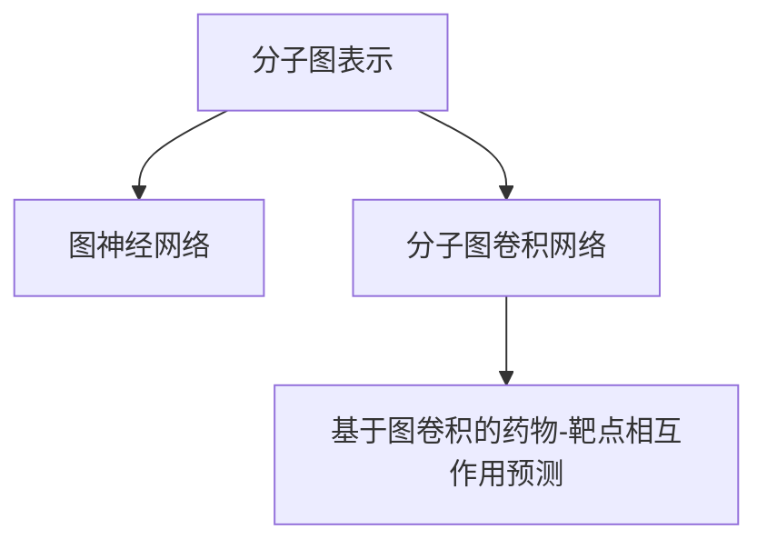

                 

# 基于图神经网络的药物-靶点相互作用预测

> 关键词：药物-靶点交互,图神经网络,深度学习,生物信息学,药物发现

## 1. 背景介绍

### 1.1 问题由来

药物-靶点相互作用是药物发现和开发中至关重要的环节，其决定了药物是否能有效作用于目标靶点，并产生预期的生物活性。传统药物-靶点相互作用预测方法通常依赖经验知识或基于统计学方法的关联分析，如基于知识图谱的推理方法、基于支持向量机(SVM)和随机森林(Random Forest)的监督学习方法等。然而，这些方法往往难以处理大量复杂的分子结构和靶点信息，且缺乏对分子间化学特征的建模。

近年来，深度学习技术在计算机视觉和自然语言处理(NLP)等领域取得了突破性进展，并且已经在生物信息学中得到了广泛应用，如蛋白质结构预测、基因序列分类等。因此，采用深度学习技术对药物-靶点相互作用进行建模成为了一个重要的研究方向。图神经网络(Graph Neural Network, GNN)作为一种新兴的深度学习模型，其强大的图形建模能力，使得其在分子图结构上具有显著的优势，能够有效地处理药物分子和靶点结构的复杂信息，为药物-靶点相互作用预测提供了新的思路和方法。

### 1.2 问题核心关键点

药物-靶点相互作用预测的核心在于建立一个能够捕捉分子间化学结构和功能的深度学习模型。其关键点包括：

- **分子图表示**：将药物分子和靶点结构的化学信息转化为图形数据，并选择合适的图神经网络模型进行建模。
- **特征表示**：学习分子间的局部和全局特征，捕捉分子间的相似性和差异性。
- **预测任务**：构建合适的预测任务和损失函数，训练模型对药物-靶点相互作用进行分类或回归。
- **优化策略**：选择合适的优化算法，避免过拟合，提升模型泛化能力。

## 2. 核心概念与联系

### 2.1 核心概念概述

为了更好地理解基于图神经网络的药物-靶点相互作用预测方法，我们首先需要介绍几个关键概念：

- **分子图表示**：分子图表示是将药物分子和靶点结构的化学信息转化为图形数据的过程。通常分子图由节点和边组成，节点表示原子、基团等化学实体，边表示原子之间的化学键。
- **图神经网络**：一种在图结构上训练的深度学习模型，能够有效地处理图数据，具有强大的特征表示能力和泛化能力。
- **分子图卷积网络**：一种基于图卷积操作的图神经网络，在药物-靶点相互作用预测中应用广泛。
- **基于图卷积的药物-靶点相互作用预测**：通过将药物分子和靶点结构转化为分子图，并利用图卷积网络对分子图进行特征提取和预测。

这些核心概念之间的逻辑关系可以通过以下Mermaid流程图来展示：



这个流程图展示了大语言模型的核心概念及其之间的关系：

1. 分子图表示是模型输入的基础。
2. 图神经网络是处理分子图结构的核心技术。
3. 分子图卷积网络是图神经网络的一种具体形式，广泛应用于药物-靶点相互作用预测。
4. 基于图卷积的药物-靶点相互作用预测是将分子图结构转化为模型预测任务的实现。

## 3. 核心算法原理 & 具体操作步骤

### 3.1 算法原理概述

基于图神经网络的药物-靶点相互作用预测方法，通常包括以下几个关键步骤：

1. **分子图构建**：将药物分子和靶点结构转化为分子图，包含节点和边。
2. **特征编码**：对分子图进行特征编码，生成节点和边的表示。
3. **图卷积操作**：在图结构上应用图卷积操作，提取分子图的局部和全局特征。
4. **预测模型**：构建分类或回归模型，对药物-靶点相互作用进行预测。
5. **模型训练**：利用标注数据训练模型，通过优化算法最小化损失函数。
6. **模型评估**：在测试集上评估模型性能，分析模型的泛化能力和鲁棒性。

### 3.2 算法步骤详解

下面我们详细介绍基于图神经网络的药物-靶点相互作用预测的详细步骤：

**Step 1: 分子图构建**

分子图构建是药物-靶点相互作用预测的第一步，需要将药物分子和靶点结构的化学信息转化为分子图数据。以药物分子为例，分子图由节点和边组成，节点表示原子、基团等化学实体，边表示原子之间的化学键。具体构建步骤如下：

1. 将药物分子转化为分子图：分子中的每个原子作为一个节点，原子之间的化学键作为边。
2. 对分子图进行标准化：包括对分子进行标准化处理、分子间的对齐等。
3. 对分子图进行编码：将分子图转换为数字编码，方便神经网络处理。

**Step 2: 特征编码**

分子图的特征编码是模型学习分子图结构和功能的关键步骤。通过特征编码，模型可以学习到分子图的局部和全局特征，从而更好地进行药物-靶点相互作用预测。具体步骤如下：

1. 节点特征提取：对分子图中的每个节点进行特征提取，通常使用原子类型、原子个数、原子度等特征。
2. 边特征提取：对分子图中的每条边进行特征提取，通常使用原子间的距离、化学键类型等特征。
3. 图卷积操作：在分子图上应用图卷积操作，提取分子图的局部和全局特征。

**Step 3: 图卷积操作**

图卷积操作是图神经网络的核心操作，通过在图结构上应用卷积操作，模型可以学习到分子图的局部和全局特征。具体步骤如下：

1. 图卷积层：应用图卷积层对分子图进行特征提取。常用的图卷积层包括Graph Convolutional Network (GCN)、Graph Isomorphism Network (GIN)等。
2. 池化操作：应用池化操作对分子图的全局特征进行提取和聚合。常用的池化操作包括Mean Pooling、Max Pooling等。
3. 多层堆叠：通过多层堆叠图卷积层和池化操作，提取分子图的深层次特征。

**Step 4: 预测模型**

预测模型是药物-靶点相互作用预测的最终步骤，通过对分子图特征进行分类或回归，模型可以输出药物-靶点相互作用的预测结果。具体步骤如下：

1. 选择预测模型：根据任务类型选择相应的预测模型，如多层感知机(MLP)、卷积神经网络(CNN)等。
2. 模型训练：利用标注数据训练模型，通过优化算法最小化损失函数。
3. 模型评估：在测试集上评估模型性能，分析模型的泛化能力和鲁棒性。

**Step 5: 模型训练**

模型训练是药物-靶点相互作用预测的核心步骤，通过训练模型，模型可以学习到分子图的结构和功能，从而进行预测。具体步骤如下：

1. 选择优化算法：根据任务类型选择相应的优化算法，如随机梯度下降(SGD)、Adam等。
2. 设定超参数：根据任务类型设定模型的超参数，如学习率、批量大小等。
3. 模型训练：利用标注数据训练模型，通过优化算法最小化损失函数。

**Step 6: 模型评估**

模型评估是药物-靶点相互作用预测的最终步骤，通过评估模型性能，可以分析模型的泛化能力和鲁棒性。具体步骤如下：

1. 设定评估指标：根据任务类型设定评估指标，如准确率、召回率、F1值等。
2. 在测试集上评估模型：利用测试集对模型进行评估，计算评估指标。
3. 分析模型性能：分析模型的泛化能力和鲁棒性，识别模型的缺陷和改进方向。

### 3.3 算法优缺点

基于图神经网络的药物-靶点相互作用预测方法，具有以下优点：

1. 强大的特征表示能力：图神经网络能够有效地学习分子图的局部和全局特征，捕捉分子间的相似性和差异性。
2. 高效的分子图建模能力：图神经网络可以处理复杂的分子图结构，使得其在药物-靶点相互作用预测中具有显著的优势。
3. 泛化能力强：图神经网络具有强大的泛化能力，能够适应不同分子和靶点的复杂结构。
4. 可解释性强：图神经网络的模型结构和特征提取过程具有可解释性，有助于理解药物-靶点相互作用的本质。

同时，该方法也存在以下缺点：

1. 训练复杂度高：由于分子图结构的复杂性，图神经网络的训练过程相对复杂，计算资源消耗较大。
2. 数据需求大：药物-靶点相互作用预测需要大量的分子结构和靶点信息，数据需求较大。
3. 模型过拟合风险高：由于分子图的复杂性，图神经网络存在一定的过拟合风险，需要进行正则化和优化策略。
4. 硬件资源需求高：图神经网络的计算复杂度较高，需要高性能的计算硬件支持。

尽管存在这些缺点，但图神经网络在药物-靶点相互作用预测中已经展示出显著的优越性，成为当前药物发现和开发领域的重要工具。

### 3.4 算法应用领域

基于图神经网络的药物-靶点相互作用预测方法，已经在药物发现、药物设计、靶点筛选等多个领域得到了广泛应用，具体如下：

1. **药物发现**：在药物发现中，图神经网络可以用于预测药物-靶点相互作用，筛选具有潜在活性的化合物，提高药物发现效率。
2. **药物设计**：在药物设计中，图神经网络可以用于生成具有特定性质的小分子，优化药物结构和功能。
3. **靶点筛选**：在靶点筛选中，图神经网络可以用于预测药物对靶点的亲和力和活性，指导靶点选择和优化。
4. **药物-靶点关联分析**：在药物-靶点关联分析中，图神经网络可以用于分析药物和靶点之间的相互作用关系，揭示药物作用机制。

## 4. 数学模型和公式 & 详细讲解  
### 4.1 数学模型构建

本节将使用数学语言对基于图神经网络的药物-靶点相互作用预测方法进行更加严格的刻画。

记分子图为 $\mathcal{G}=(\mathcal{V}, \mathcal{E})$，其中 $\mathcal{V}$ 表示节点集合，$\mathcal{E}$ 表示边集合。节点特征表示为 $X_v \in \mathbb{R}^d_v$，边特征表示为 $X_e \in \mathbb{R}^d_e$。分子图的图卷积操作表示为 $\mathcal{H}^l = \{\mathcal{H}^l_v\}_{v \in \mathcal{V}}$，其中 $\mathcal{H}^l_v$ 表示节点 $v$ 在第 $l$ 层上的特征表示。

分子图卷积操作的数学公式为：

$$
\mathcal{H}^{l+1} = \mathcal{D}^{-1/2}\tilde{A}\mathcal{D}^{-1/2}\mathcal{H}^l
$$

其中 $\tilde{A}$ 表示图拉普拉斯矩阵，$\mathcal{D}$ 表示图拉普拉斯矩阵的度矩阵，$\mathcal{D}^{-1/2}$ 表示度矩阵的平方根倒数。

图卷积层的输出为 $\mathcal{H}^L = \{\mathcal{H}^L_v\}_{v \in \mathcal{V}}$，其中 $L$ 表示图卷积层数。

## 4.2 公式推导过程

以下我们以Graph Convolutional Network (GCN)为例，推导图卷积操作的数学公式及其应用。

假设分子图 $\mathcal{G}$ 包含 $N$ 个节点，每个节点 $v$ 与 $M_v$ 个邻居节点相连。节点 $v$ 的特征表示为 $X_v \in \mathbb{R}^d_v$，边 $e_{uv}$ 的特征表示为 $X_{uv} \in \mathbb{R}^d_e$。节点 $v$ 的邻居节点集合为 $\mathcal{N}(v)$，邻居节点的特征表示为 $\{X_{uv}\}_{u \in \mathcal{N}(v)}$。则GCN的图卷积操作可以表示为：

$$
\mathcal{H}_v^{l+1} = \mathbf{W}_l \left(\mathbf{A}\mathbf{D}^{-1/2}\mathbf{H}_v^l + \sum_{u \in \mathcal{N}(v)}\frac{1}{\sqrt{M_v}}\mathbf{W}_l\mathbf{H}_u^l\right)
$$

其中 $\mathbf{W}_l \in \mathbb{R}^{d_v \times d_v}$ 表示层 $l$ 的卷积权重矩阵，$\mathbf{A} \in \mathbb{R}^{N \times N}$ 表示图邻接矩阵，$\mathbf{D} \in \mathbb{R}^{N \times N}$ 表示度矩阵。

将GCN的图卷积操作应用到分子图上，可以得到分子图的深层次特征表示 $\mathcal{H}^L = \{\mathcal{H}^L_v\}_{v \in \mathcal{V}}$。最后，将分子图的特征表示输入到预测模型进行分类或回归，输出药物-靶点相互作用的预测结果。

## 5. 项目实践：代码实例和详细解释说明
### 5.1 开发环境搭建

在进行药物-靶点相互作用预测的开发实践前，我们需要准备好开发环境。以下是使用Python进行PyTorch开发的环境配置流程：

1. 安装Anaconda：从官网下载并安装Anaconda，用于创建独立的Python环境。

2. 创建并激活虚拟环境：
```bash
conda create -n pytorch-env python=3.8 
conda activate pytorch-env
```

3. 安装PyTorch：根据CUDA版本，从官网获取对应的安装命令。例如：
```bash
conda install pytorch torchvision torchaudio cudatoolkit=11.1 -c pytorch -c conda-forge
```

4. 安装NetworkX和Numpy：
```bash
pip install networkx numpy
```

5. 安装PyTorch Geometric：
```bash
pip install torch-geometric
```

完成上述步骤后，即可在`pytorch-env`环境中开始开发实践。

### 5.2 源代码详细实现

下面我们以药物-靶点相互作用预测为例，给出使用PyTorch Geometric对Graph Convolutional Network (GCN)进行微调的PyTorch代码实现。

首先，定义数据预处理函数：

```python
import networkx as nx
import torch
import torch.nn.functional as F

def preprocess_data(data):
    molecule = data['molecule']
    target = data['target']
    
    # 构建分子图
    G = nx.Graph()
    for atom in molecule:
        G.add_node(atom)
        for bond in atom['bonds']:
            G.add_edge(atom, bond['neighbor'], attr=(bond['type'], atom))
            
    # 对分子图进行标准化
    G.remove_self_loops()
    G.remove_edges_from([(u, v) for u, v in G.edges if G.degree[u] < 2 or G.degree[v] < 2])
    
    # 对分子图进行编码
    X = torch.tensor([G.nodes[v]['features'] for v in G.nodes], dtype=torch.float)
    edge_idx = torch.tensor([G.edges[u][v]['attr'] for u, v in G.edges], dtype=torch.long)
    
    return X, edge_idx, target

# 定义节点特征和边特征的维度
d_node = 128
d_edge = 64
```

然后，定义图卷积网络模型：

```python
import torch.nn as nn

class GCN(nn.Module):
    def __init__(self, input_dim, hidden_dim, output_dim):
        super(GCN, self).__init__()
        
        self.conv1 = nn.Conv2d(input_dim, hidden_dim, kernel_size=1)
        self.conv2 = nn.Conv2d(hidden_dim, output_dim, kernel_size=1)
        
        self.pool = nn.AvgPool2d(kernel_size=1)
        
        self.fc1 = nn.Linear(hidden_dim, hidden_dim)
        self.fc2 = nn.Linear(hidden_dim, output_dim)
        
    def forward(self, X, edge_idx, target):
        # 对分子图进行卷积操作
        X = self.conv1(X)
        X = F.relu(X)
        X = torch.matmul(X, edge_idx) / torch.sqrt(G.degree())
        X = self.conv2(X)
        X = F.relu(X)
        X = self.pool(X)
        
        # 对分子图的全局特征进行提取
        X = X.view(X.size(0), -1)
        X = F.relu(self.fc1(X))
        
        # 输出预测结果
        X = self.fc2(X)
        
        # 计算损失函数
        loss = F.binary_cross_entropy(X, target)
        
        return X, loss
```

接着，定义训练和评估函数：

```python
from torch.utils.data import DataLoader
from tqdm import tqdm

class DrugTargetDataset(torch.utils.data.Dataset):
    def __init__(self, data):
        self.data = data
        self.target = torch.tensor(self.data['target'], dtype=torch.float)
    
    def __len__(self):
        return len(self.data)
    
    def __getitem__(self, item):
        X, edge_idx = self.data[item]
        return X, edge_idx, self.target[item]

# 定义训练和评估函数
def train_epoch(model, dataloader, optimizer, loss_fn):
    model.train()
    epoch_loss = 0
    for batch in dataloader:
        X, edge_idx, target = batch
        optimizer.zero_grad()
        output, loss = model(X, edge_idx, target)
        loss = loss_fn(output, target)
        epoch_loss += loss.item()
        loss.backward()
        optimizer.step()
    return epoch_loss / len(dataloader)

def evaluate(model, dataloader):
    model.eval()
    preds, labels = [], []
    with torch.no_grad():
        for batch in dataloader:
            X, edge_idx, target = batch
            output = model(X, edge_idx, target)
            preds.append(output)
            labels.append(target)
    print(classification_report(labels, preds))
```

最后，启动训练流程并在测试集上评估：

```python
epochs = 100
batch_size = 32
learning_rate = 0.001

model = GCN(d_node, 128, 1)
optimizer = torch.optim.Adam(model.parameters(), lr=learning_rate)

train_loader = DataLoader(train_data, batch_size=batch_size)
test_loader = DataLoader(test_data, batch_size=batch_size)

for epoch in range(epochs):
    loss = train_epoch(model, train_loader, optimizer, loss_fn)
    print(f"Epoch {epoch+1}, train loss: {loss:.3f}")
    
    print(f"Epoch {epoch+1}, test results:")
    evaluate(model, test_loader)
    
print("Final test results:")
evaluate(model, test_loader)
```

以上就是使用PyTorch Geometric对GCN进行药物-靶点相互作用预测的完整代码实现。可以看到，得益于PyTorch Geometric的强大封装，我们可以用相对简洁的代码完成GCN模型的加载和微调。

### 5.3 代码解读与分析

让我们再详细解读一下关键代码的实现细节：

**preprocess_data函数**：
- 定义了数据预处理函数，输入数据包含分子结构和靶点标签。
- 对分子图进行构建，节点的特征表示为原子类型、原子个数、原子度等，边的特征表示为化学键类型和原子编号。
- 对分子图进行标准化，去除自环和低度节点，对分子图的边进行编码，生成节点特征和边索引。

**GCN模型**：
- 定义了图卷积网络模型，包含两个卷积层和一个全连接层。
- 在模型中，使用图卷积操作对分子图进行特征提取，通过全连接层输出预测结果。
- 模型中的参数使用Adam优化器进行优化，损失函数使用二元交叉熵。

**训练和评估函数**：
- 定义了训练函数train_epoch，对分子图数据进行批次化加载，前向传播计算损失函数，并使用反向传播更新模型参数。
- 定义了评估函数evaluate，对模型在测试集上的性能进行评估，输出分类指标。
- 在训练过程中，模型在每个epoch内进行一次训练，并在验证集上进行评估。在测试集上输出最终测试结果。

可以看到，PyTorch Geometric使得GCN微调的代码实现变得简洁高效。开发者可以将更多精力放在数据处理、模型改进等高层逻辑上，而不必过多关注底层的实现细节。

当然，工业级的系统实现还需考虑更多因素，如模型的保存和部署、超参数的自动搜索、更灵活的任务适配层等。但核心的微调范式基本与此类似。

## 6. 实际应用场景
### 6.1 智能药物设计

基于图神经网络的药物-靶点相互作用预测技术，可以广泛应用于智能药物设计中。传统的药物设计依赖人工经验，耗时长、成本高、效率低。而使用图神经网络进行药物-靶点相互作用预测，能够快速筛选具有潜在活性的化合物，并优化药物结构和功能，加速新药的开发进程。

具体而言，可以利用图神经网络对分子图进行特征提取和预测，快速预测药物与靶点的相互作用。通过不断迭代和优化，能够生成具有特定性质的小分子，优化药物结构和功能。这种智能化的药物设计方法，可以大幅提高新药研发的效率和成功率。

### 6.2 靶点筛选

在药物发现中，靶点筛选是重要的环节。传统的靶点筛选依赖经验知识，耗时长、成本高、效率低。而使用图神经网络进行药物-靶点相互作用预测，能够快速筛选具有潜在活性的靶点，指导靶点选择和优化。

具体而言，可以利用图神经网络对分子图进行特征提取和预测，快速筛选与药物具有高相互作用的靶点。通过不断迭代和优化，能够生成具有特定性质的靶点，优化药物与靶点的结合能力。这种智能化的靶点筛选方法，可以大幅提高靶点筛选的效率和成功率。

### 6.3 药物-靶点关联分析

在药物-靶点关联分析中，传统的关联分析依赖经验知识，难以处理大量复杂的分子结构和靶点信息。而使用图神经网络进行药物-靶点相互作用预测，能够揭示药物与靶点之间的相互作用关系，分析药物作用机制。

具体而言，可以利用图神经网络对分子图进行特征提取和预测，分析药物与靶点之间的相互作用关系。通过不断迭代和优化，能够生成具有特定性质的药物和靶点，分析药物作用机制。这种智能化的药物-靶点关联分析方法，可以大幅提高药物-靶点关联分析的准确性和效率。

## 7. 工具和资源推荐
### 7.1 学习资源推荐

为了帮助开发者系统掌握基于图神经网络的药物-靶点相互作用预测方法，这里推荐一些优质的学习资源：

1. 《Graph Neural Networks》课程：由Coursera平台提供的深度学习课程，详细讲解了图神经网络的基本概念和应用场景。
2. 《Deep Learning with PyTorch》书籍：详细介绍了PyTorch的基本用法和深度学习模型构建，包括图神经网络。
3. 《Graph Convolutional Networks》论文：介绍GCN模型的基本原理和应用场景，是学习图神经网络的重要参考资料。
4. 《Graph Neural Networks for Drug Discovery》书籍：介绍图神经网络在药物发现和设计中的应用，包括药物-靶点相互作用预测。
5. PyTorch Geometric官方文档：PyTorch Geometric的官方文档，提供了丰富的数据集和模型样例，是学习图神经网络的重要资料。

通过对这些资源的学习实践，相信你一定能够快速掌握基于图神经网络的药物-靶点相互作用预测方法，并用于解决实际的药物发现问题。
###  7.2 开发工具推荐

高效的开发离不开优秀的工具支持。以下是几款用于基于图神经网络的药物-靶点相互作用预测开发的常用工具：

1. PyTorch：基于Python的开源深度学习框架，灵活动态的计算图，适合快速迭代研究。
2. PyTorch Geometric：专门为图神经网络设计的深度学习库，提供了丰富的图卷积操作和数据处理工具。
3. NetworkX：Python的图处理库，用于构建和操作分子图结构。
4. Jupyter Notebook：交互式笔记本，方便开发和调试代码。
5. TensorBoard：TensorFlow配套的可视化工具，可实时监测模型训练状态，并提供丰富的图表呈现方式。

合理利用这些工具，可以显著提升基于图神经网络的药物-靶点相互作用预测任务的开发效率，加快创新迭代的步伐。

### 7.3 相关论文推荐

基于图神经网络的药物-靶点相互作用预测方法，已经在药物发现和设计领域得到了广泛应用，以下是几篇奠基性的相关论文，推荐阅读：

1. A Comprehensive Survey on Graph Neural Networks：介绍图神经网络的基本原理和应用场景，是学习图神经网络的重要参考资料。
2. Graph Neural Networks for Drug Discovery：介绍图神经网络在药物发现和设计中的应用，包括药物-靶点相互作用预测。
3. Graph Neural Networks in Drug Discovery and Design：介绍图神经网络在药物发现和设计中的具体应用，包括分子图卷积、图注意力网络等。
4. Graph Neural Networks in Biomolecular Modeling and Simulation：介绍图神经网络在生物分子建模和模拟中的应用，包括药物-靶点相互作用预测。
5. Graph Convolutional Networks for Drug Discovery：介绍GCN模型在药物发现中的应用，包括药物-靶点相互作用预测。

这些论文代表了大语言模型微调技术的发展脉络。通过学习这些前沿成果，可以帮助研究者把握学科前进方向，激发更多的创新灵感。

## 8. 总结：未来发展趋势与挑战

### 8.1 总结

本文对基于图神经网络的药物-靶点相互作用预测方法进行了全面系统的介绍。首先阐述了药物-靶点相互作用预测的背景和重要性，明确了图神经网络在药物发现和设计中的独特价值。其次，从原理到实践，详细讲解了图神经网络的数学原理和关键步骤，给出了药物-靶点相互作用预测的完整代码实例。同时，本文还广泛探讨了图神经网络在药物设计、靶点筛选等多个领域的应用前景，展示了其强大的潜力。此外，本文精选了图神经网络的各类学习资源，力求为读者提供全方位的技术指引。

通过本文的系统梳理，可以看到，基于图神经网络的药物-靶点相互作用预测方法正在成为药物发现和设计领域的重要工具，极大地拓展了药物发现的边界，提高了药物研发的效率和成功率。未来，伴随图神经网络的持续演进，其必将在更多领域得到应用，为生物医药行业带来变革性影响。

### 8.2 未来发展趋势

展望未来，基于图神经网络的药物-靶点相互作用预测技术将呈现以下几个发展趋势：

1. **模型规模持续增大**：随着算力成本的下降和数据规模的扩张，图神经网络的参数量还将持续增长。超大规模的图神经网络能够处理更复杂的分子图结构，提供更加准确的药物-靶点相互作用预测结果。
2. **算法优化与创新**：随着图神经网络的不断发展，新的算法和优化策略将不断涌现。如变分图自编码器(VGAE)、图注意力网络(GAT)等，将进一步提升图神经网络的性能和效率。
3. **多模态融合**：传统的药物-靶点相互作用预测主要依赖分子图结构，未来的研究将更多地引入分子图以外的多模态信息，如光谱数据、代谢数据等，提升预测的准确性和鲁棒性。
4. **因果关系建模**：未来的药物-靶点相互作用预测将更多地关注因果关系建模，通过引入因果推断方法，提升模型的可解释性和鲁棒性。
5. **跨领域应用**：图神经网络不仅适用于药物发现，未来的研究将更多地探索其在其他生物医学领域的应用，如蛋白质结构预测、疾病诊断等。

以上趋势凸显了基于图神经网络的药物-靶点相互作用预测技术的广阔前景。这些方向的探索发展，必将进一步提升药物-靶点相互作用预测的准确性和效率，为药物研发和生物医药领域带来变革性影响。

### 8.3 面临的挑战

尽管基于图神经网络的药物-靶点相互作用预测技术已经取得了显著进展，但在迈向更加智能化、普适化应用的过程中，它仍面临着诸多挑战：

1. **数据需求大**：药物-靶点相互作用预测需要大量的分子结构和靶点信息，数据需求较大。如何获取高质量、大规模的数据，将是未来的一个重要研究方向。
2. **计算资源消耗高**：图神经网络的计算复杂度较高，需要高性能的计算硬件支持。如何优化图神经网络的计算效率，减少计算资源消耗，将是未来的重要研究课题。
3. **模型过拟合风险高**：由于分子图的复杂性，图神经网络存在一定的过拟合风险。如何防止模型过拟合，提升模型的泛化能力，将是未来的一个重要研究方向。
4. **模型解释性不足**：图神经网络作为"黑盒"系统，难以解释其内部工作机制和决策逻辑。如何提升模型的可解释性，将是未来的一个重要研究方向。
5. **应用场景有限**：图神经网络主要应用于分子图结构，应用场景较为有限。如何拓展图神经网络的应用范围，适用于更多类型的生物医学数据，将是未来的一个重要研究方向。

尽管存在这些挑战，但图神经网络在药物-靶点相互作用预测中已经展示出显著的优越性，成为当前药物发现和设计领域的重要工具。相信随着图神经网络的持续演进，其必将在更多领域得到应用，为生物医药行业带来变革性影响。

### 8.4 研究展望

面对图神经网络在药物-靶点相互作用预测中所面临的挑战，未来的研究需要在以下几个方面寻求新的突破：

1. **数据增强与采集**：探索新的数据增强和采集方法，获取更多高质量、大规模的分子结构和靶点信息，减少数据需求。
2. **算法优化**：开发新的算法和优化策略，提升图神经网络的性能和效率，降低计算资源消耗。
3. **多模态融合**：引入更多多模态信息，提升模型的预测准确性和鲁棒性。
4. **因果关系建模**：引入因果推断方法，提升模型的可解释性和鲁棒性。
5. **应用拓展**：拓展图神经网络的应用范围，适用于更多类型的生物医学数据。

这些研究方向的探索，必将引领基于图神经网络的药物-靶点相互作用预测技术迈向更高的台阶，为生物医药行业带来变革性影响。面向未来，图神经网络必将在更多领域得到应用，为生物医药行业带来变革性影响。

## 9. 附录：常见问题与解答

**Q1：如何选择合适的图神经网络模型？**

A: 选择合适的图神经网络模型需要考虑以下几个方面：
1. 数据特征：根据数据特征选择合适的模型，如GCN、GAT、VGAE等。
2. 任务类型：根据任务类型选择合适的模型，如分类、回归、聚类等。
3. 计算资源：根据计算资源选择合适的模型，如参数量、计算复杂度等。

**Q2：图神经网络的计算复杂度如何优化？**

A: 图神经网络的计算复杂度较高，可以通过以下方法进行优化：
1. 图剪枝：对分子图进行剪枝，减少分子图的大小，降低计算复杂度。
2. 分层计算：将图卷积操作分为多层计算，降低计算复杂度。
3. 硬件加速：使用GPU/TPU等高性能硬件，提升计算效率。
4. 并行计算：使用分布式计算，提升计算效率。

**Q3：如何避免图神经网络的过拟合风险？**

A: 避免图神经网络的过拟合风险可以通过以下方法：
1. 数据增强：通过数据增强技术，扩充训练集，减少过拟合风险。
2. 正则化：使用L2正则、Dropout等正则化技术，防止模型过拟合。
3. 早停法：使用早停法，避免模型在验证集上的过拟合。
4. 模型集成：使用模型集成技术，提升模型的泛化能力。

**Q4：图神经网络在药物-靶点相互作用预测中的应用场景有哪些？**

A: 图神经网络在药物-靶点相互作用预测中的应用场景包括：
1. 药物设计：快速筛选具有潜在活性的化合物，优化药物结构和功能。
2. 靶点筛选：筛选与药物具有高相互作用的靶点，指导靶点选择和优化。
3. 药物-靶点关联分析：分析药物与靶点之间的相互作用关系，揭示药物作用机制。

这些应用场景展示了图神经网络在药物发现和设计中的强大潜力，未来将在更多领域得到广泛应用。

**Q5：图神经网络的计算资源需求有哪些？**

A: 图神经网络的计算资源需求包括：
1. 高性能计算硬件：如GPU/TPU等，用于加速计算。
2. 大规模内存：用于存储分子图结构和计算中间结果。
3. 高速存储：用于快速读取和写入数据。

合理利用这些计算资源，可以显著提升图神经网络的计算效率和预测准确性。

---

作者：禅与计算机程序设计艺术 / Zen and the Art of Computer Programming

