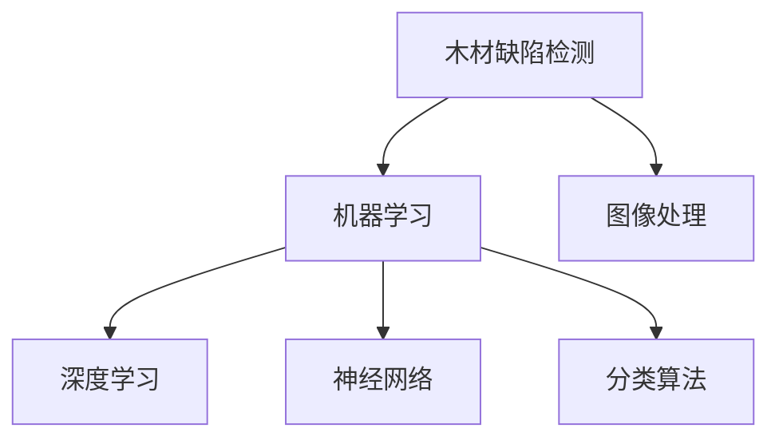

                 

# 基于机器学习的木材缺陷识别方法研究

> 关键词：木材缺陷检测, 机器学习, 图像处理, 神经网络, 深度学习, 分类算法

## 1. 背景介绍

木材是一种常见的建筑材料，广泛用于家具制造、建筑结构等领域。然而，木材容易受到各种缺陷的影响，如裂纹、腐朽、节疤、变形等，这些缺陷不仅影响木材的美观和使用性能，还可能引发结构安全问题。因此，对木材缺陷进行及时准确的检测，对于提高木材的利用效率和延长其使用寿命，具有重要意义。

近年来，随着计算机视觉和机器学习技术的不断发展，利用图像处理和深度学习算法对木材缺陷进行自动识别成为可能。该方法不仅能够显著提高检测效率，还能避免人工检测过程中主观偏差和疲劳问题，具有显著的应用前景。

## 2. 核心概念与联系

### 2.1 核心概念概述

为了更好地理解基于机器学习的木材缺陷识别方法，本节将介绍几个核心概念：

- 木材缺陷检测(Wood Defect Detection)：指通过计算机视觉和图像处理技术，自动检测木材图片中的缺陷信息，并给出准确的位置和类型标签。
- 机器学习(Machine Learning)：指通过数据驱动的方式，使计算机能够从数据中学习规律，并基于学习结果进行预测和决策的过程。
- 图像处理(Image Processing)：指通过各种算法和技术手段，对图像进行数字化、变换、增强等处理，以提取有用信息。
- 深度学习(Deep Learning)：指使用深度神经网络进行复杂数据建模和学习，特别适用于大规模数据和大规模模式识别任务。
- 神经网络(Neural Network)：指模拟人脑神经元之间的连接关系，构建多层结构进行信号传递和计算，常用于图像识别、语音识别等任务。
- 分类算法(Classification)：指将输入数据分类到预定义的若干个类别中，常用于缺陷检测等任务。

这些核心概念之间的逻辑关系可以通过以下Mermaid流程图来展示：



这个流程图展示了大语言模型的核心概念及其之间的关系：

1. 木材缺陷检测的目标是通过图像处理获取关键特征，并通过深度学习和神经网络构建高维特征空间。
2. 深度学习在神经网络的基础上，通过多层网络结构学习到更加抽象的特征表示。
3. 分类算法对网络输出的特征向量进行分类，以确定缺陷类型。
4. 图像处理是整个流程的起点，旨在从原始图像中提取出与缺陷相关的有用信息。

## 3. 核心算法原理 & 具体操作步骤
### 3.1 算法原理概述

基于机器学习的木材缺陷识别方法的核心思想是通过图像处理和深度学习模型，从木材图像中提取出缺陷特征，并通过分类算法将图像分为缺陷类和非缺陷类。其核心步骤如下：

1. 数据收集：收集包含木材缺陷和无缺陷的图像数据，作为训练和测试数据集。
2. 数据预处理：对图像进行预处理，包括尺寸调整、归一化、增强等操作。
3. 特征提取：使用卷积神经网络(CNN)等深度学习模型，对图像进行特征提取，得到高维特征向量。
4. 模型训练：利用标注好的训练数据集，训练分类模型，对图像进行分类。
5. 模型评估：使用测试数据集对训练好的模型进行评估，计算准确率、召回率等指标。
6. 模型应用：将训练好的模型应用于实际图像，进行木材缺陷的自动识别。

### 3.2 算法步骤详解

以典型的深度学习算法——卷积神经网络(CNN)为例，详细讲解木材缺陷识别的操作步骤：

#### 3.2.1 数据收集

收集包含木材缺陷和无缺陷的图像数据，作为训练和测试数据集。数据集应尽量覆盖各种缺陷类型和大小，以提高模型的泛化能力。

#### 3.2.2 数据预处理

对图像进行预处理，包括：

- 尺寸调整：将图像统一调整为相同尺寸，以适应CNN模型输入的要求。
- 归一化：将图像像素值归一化到0-1之间，以提高模型的训练速度和收敛效果。
- 增强：对图像进行随机裁剪、翻转、旋转等操作，以扩充数据集的多样性。

#### 3.2.3 特征提取

使用卷积神经网络(CNN)对图像进行特征提取，得到高维特征向量。CNN通常包括卷积层、池化层和全连接层，其中卷积层用于提取图像局部特征，池化层用于降维和不变性保持，全连接层用于特征向量的分类。

#### 3.2.4 模型训练

利用标注好的训练数据集，训练分类模型，对图像进行分类。常用的分类算法包括Softmax回归、SVM、决策树等。

#### 3.2.5 模型评估

使用测试数据集对训练好的模型进行评估，计算准确率、召回率、F1分数等指标。这些指标用于衡量模型在缺陷检测中的性能。

#### 3.2.6 模型应用

将训练好的模型应用于实际图像，进行木材缺陷的自动识别。

### 3.3 算法优缺点

基于机器学习的木材缺陷识别方法具有以下优点：

1. 自动高效：相比于人工检测，机器学习能够自动高效地进行木材缺陷识别，提高检测速度和准确性。
2. 泛化能力强：通过大规模数据集训练，机器学习模型具有较强的泛化能力，能够适应不同类型和大小的缺陷。
3. 可扩展性好：新类型缺陷的识别可以通过增加训练数据集和调整模型结构来实现。

同时，该方法也存在一些缺点：

1. 数据收集困难：高质量的缺陷图像数据集难以收集，可能导致模型性能受限。
2. 模型依赖于数据：模型的性能高度依赖于训练数据集的质量和数量。
3. 参数优化复杂：深度学习模型参数众多，需要进行复杂的优化调整，以避免过拟合。
4. 模型解释性差：深度学习模型通常被认为是"黑盒"模型，难以解释其内部决策过程。

### 3.4 算法应用领域

基于机器学习的木材缺陷识别方法在多个领域中具有广泛的应用前景，例如：

1. 木材制造：用于自动检测家具制造过程中的木材缺陷，提高产品质量和生产效率。
2. 建筑结构：用于检测建筑木结构中的缺陷，保障建筑安全。
3. 木材贸易：用于自动检测木材贸易中的缺陷，确保产品质量和贸易公平性。
4. 环境保护：用于监测森林中的树木受损情况，保护生态环境。

## 4. 数学模型和公式 & 详细讲解
### 4.1 数学模型构建

本节将使用数学语言对基于机器学习的木材缺陷识别方法进行更加严格的刻画。

假设输入图像为 $x \in \mathbb{R}^{d_1}$，其中 $d_1$ 为输入图像的像素数。令 $y \in \{0, 1\}$ 表示图像是否包含缺陷。

定义损失函数 $\ell$ 如下：

$$
\ell(y, \hat{y}) = \begin{cases}
0 & \text{如果} \; y = \hat{y} \\
1 & \text{如果} \; y \neq \hat{y}
\end{cases}
$$

目标是最小化损失函数：

$$
\min_{\theta} \sum_{i=1}^{N} \ell(y_i, \hat{y_i})
$$

其中，$\theta$ 为模型的参数，$N$ 为训练数据集的大小。

### 4.2 公式推导过程

以下我们以Softmax回归模型为例，推导其损失函数及其梯度计算公式。

设模型参数为 $\theta = [w_1, w_2, \ldots, w_n]^T$，其中 $w_i$ 为第 $i$ 层的权重。

定义 Softmax 回归模型的输出：

$$
\hat{y} = \frac{e^{\sum_{i=1}^{n} w_i x_i}}{\sum_{j=1}^{n} e^{\sum_{i=1}^{n} w_i x_j}}
$$

将上述公式代入损失函数 $\ell(y, \hat{y})$，得：

$$
\ell(y, \hat{y}) = -y \log(\hat{y}) + (1-y) \log(1-\hat{y})
$$

将其代入经验风险公式，得：

$$
\mathcal{L}(\theta) = -\frac{1}{N} \sum_{i=1}^{N} \ell(y_i, \hat{y_i})
$$

定义模型 $M_{\theta}$ 在输入 $x$ 上的损失函数为：

$$
L(x; \theta) = -y \log(\hat{y}) + (1-y) \log(1-\hat{y})
$$

目标是最小化损失函数 $\mathcal{L}(\theta)$，即：

$$
\theta^* = \arg\min_{\theta} \mathcal{L}(\theta)
$$

为了求解该最优化问题，通常使用基于梯度的优化算法，如随机梯度下降(SGD)、Adam等。设优化算法更新参数的公式为：

$$
\theta \leftarrow \theta - \eta \nabla_{\theta} \mathcal{L}(\theta)
$$

其中 $\eta$ 为学习率，$\nabla_{\theta} \mathcal{L}(\theta)$ 为损失函数对参数 $\theta$ 的梯度。

### 4.3 案例分析与讲解

以一个简单的分类问题为例，讲解Softmax回归模型的训练过程：

假设训练数据集 $D$ 包含 $N$ 个样本，每个样本包含 $d$ 个特征向量 $x_i$ 和一个二分类标签 $y_i \in \{0, 1\}$。令 $\theta$ 为模型参数，定义损失函数：

$$
\ell(y, \hat{y}) = -y \log(\hat{y}) + (1-y) \log(1-\hat{y})
$$

将上述公式代入经验风险公式，得：

$$
\mathcal{L}(\theta) = -\frac{1}{N} \sum_{i=1}^{N} \ell(y_i, \hat{y_i})
$$

令 $L(x; \theta) = -y \log(\hat{y}) + (1-y) \log(1-\hat{y})$，目标是最小化损失函数 $\mathcal{L}(\theta)$，即：

$$
\theta^* = \arg\min_{\theta} \mathcal{L}(\theta)
$$

定义梯度：

$$
\nabla_{\theta} \mathcal{L}(\theta) = -\frac{1}{N} \sum_{i=1}^{N} \nabla_{\theta} L(x_i; \theta)
$$

其中：

$$
\nabla_{\theta} L(x; \theta) = \frac{y - \hat{y}}{\hat{y}(1-\hat{y})}
$$

利用梯度下降算法更新模型参数：

$$
\theta \leftarrow \theta - \eta \nabla_{\theta} \mathcal{L}(\theta)
$$

其中 $\eta$ 为学习率，可以通过交叉验证等方法确定。

## 5. 项目实践：代码实例和详细解释说明
### 5.1 开发环境搭建

在进行木材缺陷识别项目开发前，我们需要准备好开发环境。以下是使用Python进行PyTorch开发的环境配置流程：

1. 安装Anaconda：从官网下载并安装Anaconda，用于创建独立的Python环境。

2. 创建并激活虚拟环境：
```bash
conda create -n pytorch-env python=3.8 
conda activate pytorch-env
```

3. 安装PyTorch：根据CUDA版本，从官网获取对应的安装命令。例如：
```bash
conda install pytorch torchvision torchaudio cudatoolkit=11.1 -c pytorch -c conda-forge
```

4. 安装各类工具包：
```bash
pip install numpy pandas scikit-learn matplotlib tqdm jupyter notebook ipython
```

完成上述步骤后，即可在`pytorch-env`环境中开始项目开发。

### 5.2 源代码详细实现

这里我们以Softmax回归模型为例，给出使用PyTorch进行木材缺陷识别的代码实现。

首先，定义训练函数：

```python
import torch
import torch.nn as nn
import torch.optim as optim
from torch.utils.data import DataLoader

class SoftmaxRegression(nn.Module):
    def __init__(self, n_features):
        super(SoftmaxRegression, self).__init__()
        self.linear = nn.Linear(n_features, 1)

    def forward(self, x):
        return self.linear(x)

def train_model(model, train_loader, optimizer, epochs):
    for epoch in range(epochs):
        model.train()
        running_loss = 0.0
        for batch_idx, (data, target) in enumerate(train_loader):
            optimizer.zero_grad()
            output = model(data)
            loss = nn.BCELoss()(output, target)
            loss.backward()
            optimizer.step()
            running_loss += loss.item()
        print(f'Epoch {epoch+1}, Loss: {running_loss/len(train_loader)}')
```

然后，定义数据加载函数：

```python
from torchvision import datasets, transforms

def load_data(root, batch_size):
    transform = transforms.Compose([
        transforms.Resize(256),
        transforms.ToTensor(),
        transforms.Normalize(mean=[0.5, 0.5, 0.5], std=[0.5, 0.5, 0.5])
    ])
    train_set = datasets.ImageFolder(root=root, transform=transform)
    test_set = datasets.ImageFolder(root=root, transform=transform)
    train_loader = DataLoader(train_set, batch_size=batch_size, shuffle=True)
    test_loader = DataLoader(test_set, batch_size=batch_size, shuffle=False)
    return train_loader, test_loader
```

接着，定义模型训练和评估函数：

```python
from sklearn.metrics import accuracy_score

def train_and_evaluate(model, train_loader, test_loader, optimizer, epochs):
    best_acc = 0.0
    for epoch in range(epochs):
        train_model(model, train_loader, optimizer, epochs)
        model.eval()
        with torch.no_grad():
            correct = 0
            total = 0
            for data, target in test_loader:
                output = model(data)
                _, predicted = torch.max(output.data, 1)
                total += target.size(0)
                correct += (predicted == target).sum().item()
            acc = correct / total
        print(f'Epoch {epoch+1}, Acc: {acc:.4f}')
        if acc > best_acc:
            best_acc = acc
            torch.save(model.state_dict(), 'model.pth')
```

最后，启动训练流程：

```python
model = SoftmaxRegression(n_features)
optimizer = optim.SGD(model.parameters(), lr=0.01, momentum=0.9)

train_loader, test_loader = load_data(root='path/to/data', batch_size=32)

train_and_evaluate(model, train_loader, test_loader, optimizer, epochs=10)
```

以上就是使用PyTorch对木材缺陷识别进行模型训练的完整代码实现。可以看到，通过PyTorch的高级API，代码实现简洁高效。

### 5.3 代码解读与分析

让我们再详细解读一下关键代码的实现细节：

**SoftmaxRegression类**：
- `__init__`方法：初始化线性层。
- `forward`方法：前向传播计算输出。

**train_model函数**：
- 对训练数据集进行迭代，每次迭代计算损失并更新模型参数。
- 使用SGD优化器更新模型参数，并输出每个epoch的损失。

**load_data函数**：
- 使用ImageFolder加载数据集，并进行数据增强和归一化处理。
- 返回训练集和测试集的DataLoader，方便后续的模型训练和评估。

**train_and_evaluate函数**：
- 调用train_model函数对模型进行训练。
- 在测试集上评估模型性能，如果准确率高于先前最佳值，保存模型参数。

**训练流程**：
- 定义模型和优化器。
- 加载训练集和测试集。
- 调用train_and_evaluate函数进行模型训练和评估。

## 6. 实际应用场景
### 6.1 智能家具制造

木材缺陷检测在智能家具制造领域具有广泛应用前景。家具制造商在生产过程中，需要自动检测每一块木材是否存在缺陷，以确保产品质量。使用基于机器学习的木材缺陷识别方法，可以大幅提高检测效率，降低人工成本。

在实际应用中，可以将家具制造过程中的木材图片作为训练数据集，训练深度学习模型。模型训练完成后，部署到生产线上，对实时拍摄的木材图片进行自动检测，及时发现缺陷并发出警报。这将大幅提高生产效率和产品质量，降低不合格率。

### 6.2 建筑结构检测

在建筑结构中，木材是重要的支撑材料之一。木材缺陷检测对于保障建筑结构安全具有重要意义。通过将木材缺陷识别技术应用到建筑检测中，可以及时发现和修复缺陷，保障建筑结构安全。

在实际应用中，可以收集建筑结构中的木材图片，作为训练数据集。训练好的模型可以部署到建筑检测系统中，实时检测建筑结构中的木材缺陷。一旦发现问题，系统将自动报警，并建议采取相应的修复措施，确保建筑结构的安全性。

### 6.3 木材贸易监管

木材贸易是全球重要的交易之一，对贸易双方的经济利益都有重要影响。在木材贸易中，通过木材缺陷检测技术，可以确保交易双方的产品品质，促进公平交易。

在实际应用中，可以收集木材贸易过程中的图片和视频数据，作为训练数据集。训练好的模型可以部署到木材贸易监管平台中，自动检测交易双方的木材质量，确保交易双方的产品品质。这将减少贸易纠纷，提高贸易效率。

### 6.4 环境保护监测

在森林资源保护中，木材缺陷检测技术也有着广泛应用。通过检测森林中的树木受损情况，可以有效保护生态环境。

在实际应用中，可以收集森林中的树木图片，作为训练数据集。训练好的模型可以部署到环境保护平台中，实时监测森林中的树木受损情况，及时发现并采取修复措施。这将有效保护森林资源，维护生态环境。

## 7. 工具和资源推荐
### 7.1 学习资源推荐

为了帮助开发者系统掌握木材缺陷检测的理论基础和实践技巧，这里推荐一些优质的学习资源：

1. 《深度学习》系列课程：由斯坦福大学开设，涵盖深度学习的基本概念和前沿技术，适合初学者和进阶者。

2. 《机器学习实战》书籍：介绍了机器学习的基本算法和实践技巧，包括分类算法和图像处理。

3. 《计算机视觉：模型、学习与推理》书籍：由深度学习领域的顶尖学者编写，深入讲解计算机视觉的基本理论和实践。

4. 《TensorFlow 2.0实战》书籍：介绍了TensorFlow 2.0的基本功能和应用案例，适合深度学习开发者的自学。

5. 《PyTorch深度学习》系列博客：由深度学习社区的顶尖开发者撰写，涵盖PyTorch的高级API和应用场景。

通过对这些资源的学习实践，相信你一定能够快速掌握木材缺陷检测的精髓，并用于解决实际的木材缺陷识别问题。

### 7.2 开发工具推荐

高效的开发离不开优秀的工具支持。以下是几款用于木材缺陷检测开发的常用工具：

1. PyTorch：基于Python的开源深度学习框架，灵活动态的计算图，适合快速迭代研究。

2. TensorFlow：由Google主导开发的开源深度学习框架，生产部署方便，适合大规模工程应用。

3. Keras：基于TensorFlow的高级API，易于使用，适合初学者和快速原型开发。

4. OpenCV：开源计算机视觉库，提供了丰富的图像处理和计算机视觉算法，方便开发者进行图像处理和特征提取。

5. scikit-learn：基于Python的机器学习库，提供了丰富的机器学习算法和工具，方便开发者进行数据处理和模型训练。

6. NVIDIA GPU：强大的计算平台，支持深度学习模型的训练和推理。

合理利用这些工具，可以显著提升木材缺陷检测任务的开发效率，加快创新迭代的步伐。

### 7.3 相关论文推荐

木材缺陷检测技术的发展源于学界的持续研究。以下是几篇奠基性的相关论文，推荐阅读：

1. R-CNN: Object Detection with R-CNN（2014）：提出了区域卷积神经网络(R-CNN)，用于物体检测和分类，为计算机视觉中的目标检测奠定了基础。

2. Faster R-CNN: Towards Real-Time Object Detection with Region Proposal Networks（2015）：在R-CNN的基础上，提出了Fast R-CNN和Faster R-CNN，显著提高了物体检测的速度和准确性。

3. YOLO: Real-Time Object Detection（2016）：提出了YOLO算法，通过全卷积网络实现实时物体检测，具有较高的速度和准确性。

4. Mask R-CNN（2017）：在Faster R-CNN的基础上，增加了语义分割任务，提高了目标检测的精度和鲁棒性。

5. DensePose: Human Pose Estimation at High Resolution（2016）：提出了DensePose算法，用于人体姿态估计，具有较高的精度和鲁棒性。

这些论文代表了木材缺陷检测技术的最新进展，通过学习这些前沿成果，可以帮助研究者把握学科前进方向，激发更多的创新灵感。

## 8. 总结：未来发展趋势与挑战
### 8.1 总结

本文对基于机器学习的木材缺陷识别方法进行了全面系统的介绍。首先阐述了木材缺陷检测的背景和意义，明确了机器学习在木材缺陷识别中的应用价值。其次，从原理到实践，详细讲解了深度学习模型训练和优化的数学原理和关键步骤，给出了木材缺陷识别任务开发的完整代码实例。同时，本文还广泛探讨了木材缺陷检测方法在多个领域的应用前景，展示了其广泛的应用潜力。

通过本文的系统梳理，可以看到，基于机器学习的木材缺陷识别方法在大规模数据和深度学习模型的支持下，能够显著提升木材缺陷检测的准确性和效率。未来，伴随深度学习技术的不断发展，木材缺陷识别技术也将逐步普及，为木材制造、建筑结构、环境保护等领域带来深刻变革。

### 8.2 未来发展趋势

展望未来，木材缺陷识别技术将呈现以下几个发展趋势：

1. 深度学习模型的多样化：除了传统的CNN模型，未来将涌现更多先进的深度学习模型，如ResNet、Inception等，用于提高木材缺陷检测的准确性和鲁棒性。

2. 多模态融合技术：将木材缺陷检测技术与视觉、语音、文本等多模态信息进行融合，提高检测的准确性和全面性。

3. 实时化处理：利用GPU、TPU等高性能计算平台，将木材缺陷检测模型部署到实时处理系统中，实现实时化检测。

4. 边缘计算：在生产现场和建筑结构中，通过边缘计算技术，将木材缺陷检测模型部署到低功耗设备中，实现本地化检测。

5. 增强学习：利用增强学习技术，对检测系统进行优化和自适应调整，提高检测的准确性和效率。

6. 联邦学习：利用联邦学习技术，在多个分布式设备中联合训练木材缺陷检测模型，提高模型的泛化能力和安全性。

以上趋势凸显了木材缺陷识别技术的广阔前景。这些方向的探索发展，将进一步提升木材缺陷检测的精度和效率，为木材制造、建筑结构、环境保护等领域带来革命性变化。

### 8.3 面临的挑战

尽管基于机器学习的木材缺陷识别技术已经取得了瞩目成就，但在迈向更加智能化、普适化应用的过程中，它仍面临着诸多挑战：

1. 数据获取困难：高质量的木材缺陷图像数据集难以获取，可能导致模型性能受限。

2. 模型依赖于数据：模型的性能高度依赖于训练数据集的质量和数量，难以应对复杂的实际场景。

3. 计算资源消耗大：深度学习模型的参数众多，计算资源消耗较大，难以大规模部署。

4. 模型解释性差：深度学习模型通常被认为是"黑盒"模型，难以解释其内部决策过程。

5. 实时性要求高：在生产现场和建筑结构中，实时化检测要求较高，现有的计算平台可能难以满足实时处理需求。

6. 数据隐私和安全问题：在数据集中涉及用户隐私信息，如何在保证数据隐私和安全的前提下进行检测，还需要进一步研究。

这些挑战需要研究者从数据获取、模型优化、计算资源、实时性、数据隐私等多个方面进行深入研究，以提高木材缺陷检测技术的实用性和可靠性。

### 8.4 研究展望

面对基于机器学习的木材缺陷识别技术所面临的挑战，未来的研究需要在以下几个方面寻求新的突破：

1. 无监督学习和半监督学习：探索无监督学习和半监督学习方法，从未标注数据中学习木材缺陷知识，提高模型的泛化能力。

2. 知识图谱和符号化推理：将知识图谱和符号化推理技术引入木材缺陷检测，提高模型的解释性和鲁棒性。

3. 多模态融合：将视觉、语音、文本等多模态信息进行融合，提高木材缺陷检测的全面性和准确性。

4. 实时化处理：利用GPU、TPU等高性能计算平台，将木材缺陷检测模型部署到实时处理系统中，实现实时化检测。

5. 边缘计算：在生产现场和建筑结构中，通过边缘计算技术，将木材缺陷检测模型部署到低功耗设备中，实现本地化检测。

6. 增强学习：利用增强学习技术，对检测系统进行优化和自适应调整，提高检测的准确性和效率。

7. 联邦学习：利用联邦学习技术，在多个分布式设备中联合训练木材缺陷检测模型，提高模型的泛化能力和安全性。

这些研究方向将进一步提升木材缺陷检测的精度和效率，为木材制造、建筑结构、环境保护等领域带来革命性变化。面向未来，木材缺陷检测技术还需要与其他人工智能技术进行更深入的融合，共同推动自然语言理解和智能交互系统的进步。只有勇于创新、敢于突破，才能不断拓展木材缺陷检测的边界，让智能技术更好地造福人类社会。

## 9. 附录：常见问题与解答

**Q1：为什么深度学习模型在木材缺陷识别中表现优异？**

A: 深度学习模型具有强大的特征提取能力和泛化能力，能够自动学习到木材缺陷的抽象特征，并在不同的缺陷场景中表现优异。相比于传统机器学习算法，深度学习模型可以处理复杂多变的图像数据，具有更高的准确性和鲁棒性。

**Q2：如何提高木材缺陷检测的实时性？**

A: 提高木材缺陷检测的实时性需要从多个方面入手：

1. 优化模型结构：使用轻量级模型，如MobileNet、SqueezeNet等，减小模型计算量，提高推理速度。

2. 量化处理：将浮点模型转为定点模型，压缩存储空间，提高计算效率。

3. 硬件加速：利用GPU、TPU等高性能计算平台，加速深度学习模型的推理速度。

4. 模型剪枝：剪除模型中的冗余参数，减小模型大小，提高推理速度。

5. 数据增强：通过数据增强技术，扩充训练集，提高模型的泛化能力。

6. 模型压缩：使用模型压缩技术，减小模型大小，提高推理速度。

**Q3：在木材缺陷检测中，如何处理数据不平衡问题？**

A: 数据不平衡问题在木材缺陷检测中尤为突出，因为木材缺陷图像数量通常较少。为了解决这一问题，可以采用以下方法：

1. 过采样：对少数类样本进行复制，增加少数类的样本数量，提高模型的泛化能力。

2. 欠采样：对多数类样本进行删减，减少多数类的样本数量，提高模型的平衡能力。

3. 重采样：将少数类和多数类样本混合，生成新的样本，平衡数据集。

4. 数据增强：通过数据增强技术，扩充训练集，提高模型的泛化能力。

5. 半监督学习：利用少量标注数据和大量未标注数据进行训练，提高模型的泛化能力。

6. 迁移学习：利用预训练模型，提高模型的泛化能力和泛化能力。

以上方法可以有效解决木材缺陷检测中的数据不平衡问题，提高模型的泛化能力和准确性。

**Q4：如何评估木材缺陷检测模型的性能？**

A: 评估木材缺陷检测模型的性能，需要综合考虑多个指标：

1. 准确率：模型正确检测出的缺陷图像数量占总缺陷图像数量的比例。

2. 召回率：模型正确检测出的缺陷图像数量占实际缺陷图像数量的比例。

3. F1分数：综合考虑准确率和召回率，用于评估模型的综合性能。

4. ROC曲线：绘制ROC曲线，评估模型的分类性能。

5. PR曲线：绘制PR曲线，评估模型的召回性能。

6. 混淆矩阵：绘制混淆矩阵，评估模型的分类效果。

以上指标可以从不同角度评估木材缺陷检测模型的性能，选择合适的方法进行评估，有助于更好地优化模型，提高检测效果。

**Q5：如何提高木材缺陷检测模型的可解释性？**

A: 提高木材缺陷检测模型的可解释性需要从多个方面入手：

1. 可视化技术：利用可视化技术，展示模型的输入和输出，帮助理解模型的决策过程。

2. 局部可解释性方法：通过局部可解释性方法，解释模型在特定样本上的决策过程，帮助理解模型的内部机制。

3. 全局可解释性方法：通过全局可解释性方法，解释模型在整体上的决策过程，帮助理解模型的全局行为。

4. 特征可视化：利用特征可视化技术，展示模型在特定样本上的特征提取过程，帮助理解模型的特征学习机制。

5. 模型调试工具：利用模型调试工具，帮助诊断模型的问题，优化模型的性能。

通过以上方法，可以提高木材缺陷检测模型的可解释性，帮助理解模型的内部机制，提高模型的实用性和可靠性。

---

作者：禅与计算机程序设计艺术 / Zen and the Art of Computer Programming

