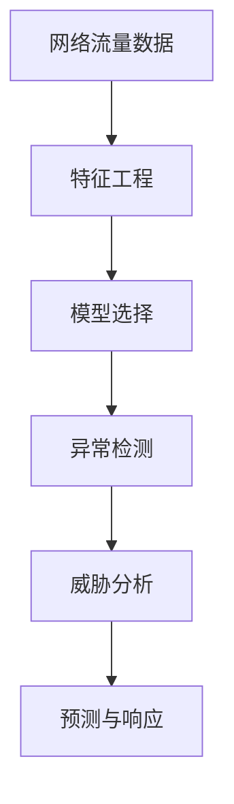

                 

# 基于机器学习的网络安全态势感知模型研究与实现

> 关键词：网络安全,态势感知,机器学习,深度学习,特征工程,异常检测,威胁分析

## 1. 背景介绍

### 1.1 问题由来

在数字化时代，网络攻击的种类和复杂性不断增加，传统基于规则和签名的安全防护手段逐渐显得力不从心。网络安全态势感知（Network Security Situation Awareness, NSSA）成为应对复杂网络安全挑战的重要技术手段。传统的安全态势感知系统主要依赖规则库和专家经验，难以实时、全面地感知网络威胁，且对网络数据的理解和处理能力有限。

近年来，随着机器学习（Machine Learning, ML）和深度学习（Deep Learning, DL）技术的发展，基于数据驱动的安全态势感知系统逐渐成为研究热点。机器学习技术能够自动从大量网络数据中学习特征，发现潜在的威胁模式，及时预警并响应网络安全事件。然而，在实际应用中，如何构建高效、精确的网络安全态势感知系统，是一个复杂且迫切需要解决的问题。

### 1.2 问题核心关键点

机器学习在网络安全态势感知中的应用，主要包括以下几个关键点：

1. **特征工程**：构建能够表征网络威胁行为的数据特征，是提高模型性能的关键。
2. **模型选择**：选择合适的机器学习模型，并在大规模网络数据上训练和优化。
3. **异常检测**：利用机器学习模型实时检测网络中的异常行为，并及时响应。
4. **威胁分析**：结合专家知识和模型输出，对检测到的威胁进行综合分析，确定其威胁级别。
5. **预测与响应**：基于威胁分析结果，制定相应的防护策略，降低风险。

本文将围绕上述关键点，系统介绍基于机器学习的网络安全态势感知模型研究与实现方法。

## 2. 核心概念与联系

### 2.1 核心概念概述

为更好地理解机器学习在网络安全态势感知中的应用，本节将介绍几个关键概念及其之间的联系：

- **网络安全**：指保护网络、数据和软件不受未授权访问、破坏、更改或泄露的保护。
- **态势感知**：指对网络威胁的实时监控、分析和响应能力，确保网络环境的安全。
- **机器学习**：通过数据驱动的方式，让机器自动学习数据特征，发现规律和模式，实现预测和决策。
- **深度学习**：一种特殊的机器学习技术，通过多层神经网络进行特征提取和模式识别，适用于处理大规模、高维度的数据。
- **异常检测**：利用机器学习模型实时检测网络中的异常行为，预警潜在的安全威胁。
- **威胁分析**：基于模型输出和专家知识，对威胁进行综合评估，确定其威胁级别和应对措施。
- **预测与响应**：根据威胁分析结果，制定相应的防护策略，降低安全风险。

这些概念之间存在紧密的联系，共同构成了一个完整的网络安全态势感知系统。

### 2.2 核心概念原理和架构的 Mermaid 流程图



这个流程图展示了网络安全态势感知系统的基本流程：

1. 网络流量数据通过特征工程提取特征。
2. 选择合适的机器学习模型，进行训练和优化。
3. 利用训练好的模型，实时检测网络中的异常行为。
4. 对检测到的威胁进行综合分析，确定其威胁级别。
5. 根据威胁分析结果，制定相应的防护策略。

通过理解这些核心概念及其之间的联系，可以更好地把握网络安全态势感知系统的整体框架和关键技术点。

## 3. 核心算法原理 & 具体操作步骤
### 3.1 算法原理概述

基于机器学习的网络安全态势感知模型，通常分为以下几个步骤：

1. **特征提取与预处理**：从网络流量数据中提取相关特征，并进行预处理。
2. **模型训练与优化**：选择适合的机器学习模型，并利用网络流量数据进行训练和优化。
3. **异常检测与预警**：利用训练好的模型，实时检测网络中的异常行为，并及时预警。
4. **威胁分析与评估**：结合专家知识和模型输出，对检测到的威胁进行综合分析，确定其威胁级别。
5. **预测与响应**：基于威胁分析结果，制定相应的防护策略，降低安全风险。

### 3.2 算法步骤详解

#### 3.2.1 特征提取与预处理

网络流量数据包含大量的时序信息，需要提取有意义的特征。常用的特征包括：

- **TCP/IP协议特征**：如TCP包数量、TCP连接状态、IP协议类型等。
- **流量特征**：如数据包大小、传输速率、流量方向等。
- **行为特征**：如端口扫描、暴力破解、DDoS攻击等行为特征。

对提取出的特征进行预处理，通常包括归一化、标准化、缺失值处理等操作，以提高模型训练的稳定性和准确性。

#### 3.2.2 模型训练与优化

在特征提取和预处理的基础上，选择合适的机器学习模型进行训练和优化。常用的模型包括：

- **线性回归模型**：适用于数据线性可分的异常检测任务。
- **支持向量机（Support Vector Machine, SVM）**：通过构建超平面进行分类，适用于高维特征空间。
- **随机森林（Random Forest, RF）**：通过集成多个决策树，提高模型的鲁棒性和泛化能力。
- **深度神经网络（Deep Neural Network, DNN）**：适用于处理大规模、高维度数据，能够自动学习复杂特征。

在模型训练过程中，通常需要进行交叉验证、超参数调优等操作，以选择最优的模型参数。

#### 3.2.3 异常检测与预警

训练好的模型，通过实时监测网络流量数据，检测其中的异常行为，并及时预警。异常行为通常包括以下几种类型：

- **异常流量**：如异常数量的数据包、异常高的传输速率等。
- **异常连接**：如异常长的连接持续时间、异常多的连接尝试等。
- **异常行为**：如异常频繁的端口扫描、暴力破解等。

异常检测的实时性和准确性是网络安全态势感知系统的关键。

#### 3.2.4 威胁分析与评估

基于模型输出和专家知识，对检测到的威胁进行综合分析，确定其威胁级别。威胁分析通常包括以下几个步骤：

1. **特征分析**：利用专家知识和模型输出，对检测到的异常行为进行分析，确定其可能的威胁类型。
2. **威胁评估**：基于威胁类型和其可能造成的损害程度，确定威胁级别，如高、中、低等级别。
3. **应对策略**：根据威胁级别，制定相应的防护策略，如隔离受攻击主机、关闭受攻击端口等。

威胁分析的准确性和全面性是网络安全态势感知系统的核心。

#### 3.2.5 预测与响应

基于威胁分析结果，制定相应的防护策略，降低安全风险。常用的防护策略包括：

- **隔离攻击源**：如封锁攻击IP地址、端口等。
- **防护加固**：如加强密码策略、更新补丁等。
- **应急响应**：如备份数据、恢复系统等。

预测与响应是网络安全态势感知系统的最终目标，是确保网络安全的关键环节。

### 3.3 算法优缺点

#### 3.3.1 优点

基于机器学习的网络安全态势感知模型具有以下优点：

1. **自动化程度高**：通过机器学习模型，自动从网络数据中学习威胁特征，减少了人工干预的复杂度。
2. **实时性**：利用机器学习模型实时检测和预警异常行为，提高了网络安全的及时性。
3. **泛化能力强**：机器学习模型可以从大规模数据中学习规律和模式，提高了模型的泛化能力。
4. **可扩展性好**：机器学习模型可以方便地进行扩展和优化，适应新的网络环境和威胁类型。

#### 3.3.2 缺点

基于机器学习的网络安全态势感知模型也存在一些缺点：

1. **数据依赖性强**：模型的性能高度依赖于网络数据的质量和多样性。
2. **模型解释性差**：机器学习模型的决策过程往往难以解释，增加了分析的复杂度。
3. **过拟合风险**：在大规模数据上训练的模型容易过拟合，降低了模型的泛化能力。
4. **误报率高**：由于网络环境复杂多变，机器学习模型可能会出现误报，增加了误报处理成本。

## 4. 数学模型和公式 & 详细讲解 & 举例说明

### 4.1 数学模型构建

基于机器学习的网络安全态势感知模型，通常包括以下几个关键数学模型：

- **特征提取模型**：用于从网络流量数据中提取有意义的特征。
- **异常检测模型**：用于检测网络中的异常行为。
- **威胁分析模型**：用于对检测到的威胁进行综合分析。
- **预测与响应模型**：用于制定防护策略。

#### 4.1.1 特征提取模型

特征提取模型通常使用线性回归模型或支持向量机等分类模型。以线性回归模型为例，其数学模型可以表示为：

$$
y = \beta_0 + \sum_{i=1}^{n} \beta_i x_i + \epsilon
$$

其中 $y$ 表示模型的输出，$x_i$ 表示输入特征，$\beta_i$ 表示特征系数，$\beta_0$ 表示截距，$\epsilon$ 表示误差。

#### 4.1.2 异常检测模型

异常检测模型通常使用随机森林或深度神经网络等模型。以随机森林为例，其数学模型可以表示为：

$$
y = \frac{1}{N} \sum_{i=1}^{N} \tilde{y}_i
$$

其中 $y$ 表示模型的输出，$\tilde{y}_i$ 表示第 $i$ 个决策树的输出。

#### 4.1.3 威胁分析模型

威胁分析模型通常使用决策树或支持向量机等模型。以决策树为例，其数学模型可以表示为：

$$
y = \tilde{y}
$$

其中 $y$ 表示模型的输出，$\tilde{y}$ 表示决策树的输出。

#### 4.1.4 预测与响应模型

预测与响应模型通常使用线性回归或支持向量机等模型。以线性回归为例，其数学模型可以表示为：

$$
y = \beta_0 + \sum_{i=1}^{n} \beta_i x_i + \epsilon
$$

其中 $y$ 表示模型的输出，$x_i$ 表示输入特征，$\beta_i$ 表示特征系数，$\beta_0$ 表示截距，$\epsilon$ 表示误差。

### 4.2 公式推导过程

#### 4.2.1 特征提取模型的推导

以线性回归模型为例，假设我们有一个包含 $N$ 个样本的数据集 $D=\{(x_i,y_i)\}_{i=1}^N$，其中 $x_i$ 表示输入特征，$y_i$ 表示目标变量。我们需要通过最小二乘法求解特征系数 $\beta_i$。

根据最小二乘法的原理，最小化误差平方和：

$$
\min_{\beta} \sum_{i=1}^{N} (y_i - (\beta_0 + \sum_{i=1}^{n} \beta_i x_i))^2
$$

求解该问题，可以得到：

$$
\beta = (X^TX)^{-1}X^Ty
$$

其中 $X$ 表示特征矩阵，$y$ 表示目标向量，$\beta$ 表示特征系数。

#### 4.2.2 异常检测模型的推导

以随机森林为例，假设我们有一个包含 $N$ 个样本的数据集 $D=\{(x_i,y_i)\}_{i=1}^N$，其中 $x_i$ 表示输入特征，$y_i$ 表示目标变量。我们需要通过随机森林模型求解异常样本。

随机森林模型通过构建多棵决策树，每个决策树的输出结果通过投票或平均方式得到最终输出。假设我们有一个包含 $M$ 棵决策树的模型，每个决策树的输出为 $\tilde{y}_i$，最终输出为 $y$。

通过计算样本 $x_i$ 在每棵决策树上的输出结果的平均值，可以得到最终输出：

$$
y = \frac{1}{M} \sum_{i=1}^{M} \tilde{y}_i
$$

#### 4.2.3 威胁分析模型的推导

以决策树为例，假设我们有一个包含 $N$ 个样本的数据集 $D=\{(x_i,y_i)\}_{i=1}^N$，其中 $x_i$ 表示输入特征，$y_i$ 表示目标变量。我们需要通过决策树模型求解威胁级别。

决策树模型通过构建一棵树形结构，将特征空间划分为多个区域，每个区域的输出为最终结果。假设我们有一棵决策树，其输出为 $\tilde{y}$，最终输出为 $y$。

通过计算样本 $x_i$ 在决策树上的输出结果，可以得到最终输出：

$$
y = \tilde{y}
$$

#### 4.2.4 预测与响应模型的推导

以线性回归模型为例，假设我们有一个包含 $N$ 个样本的数据集 $D=\{(x_i,y_i)\}_{i=1}^N$，其中 $x_i$ 表示输入特征，$y_i$ 表示目标变量。我们需要通过线性回归模型求解防护策略。

根据最小二乘法的原理，最小化误差平方和：

$$
\min_{\beta} \sum_{i=1}^{N} (y_i - (\beta_0 + \sum_{i=1}^{n} \beta_i x_i))^2
$$

求解该问题，可以得到：

$$
\beta = (X^TX)^{-1}X^Ty
$$

其中 $X$ 表示特征矩阵，$y$ 表示目标向量，$\beta$ 表示特征系数。

### 4.3 案例分析与讲解

#### 4.3.1 特征提取模型的案例

假设我们有一个包含 $100$ 个样本的网络流量数据集，其中包含 $5$ 个特征 $x_1,x_2,x_3,x_4,x_5$。我们希望构建一个线性回归模型，用于检测异常流量。

首先需要将数据集划分为训练集和测试集，假设训练集包含 $70$ 个样本，测试集包含 $30$ 个样本。然后，对训练集进行特征提取和预处理，得到特征矩阵 $X$ 和目标向量 $y$。

通过最小二乘法求解特征系数 $\beta$，可以得到模型输出：

$$
y = \beta_0 + \beta_1 x_1 + \beta_2 x_2 + \beta_3 x_3 + \beta_4 x_4 + \beta_5 x_5 + \epsilon
$$

在测试集上，通过代入特征 $x_i$ 来计算模型输出 $y_i$，如果 $y_i$ 超过了预设的阈值，则认为该样本为异常流量，进行预警。

#### 4.3.2 异常检测模型的案例

假设我们有一个包含 $100$ 个样本的网络流量数据集，其中包含 $5$ 个特征 $x_1,x_2,x_3,x_4,x_5$。我们希望构建一个随机森林模型，用于检测异常流量。

首先需要将数据集划分为训练集和测试集，假设训练集包含 $70$ 个样本，测试集包含 $30$ 个样本。然后，对训练集进行特征提取和预处理，得到特征矩阵 $X$ 和目标向量 $y$。

通过随机森林模型，构建 $M$ 棵决策树，计算每个决策树的输出结果 $\tilde{y}_i$，然后取平均值得到最终输出 $y$。如果 $y$ 超过了预设的阈值，则认为该样本为异常流量，进行预警。

#### 4.3.3 威胁分析模型的案例

假设我们有一个包含 $100$ 个样本的网络流量数据集，其中包含 $5$ 个特征 $x_1,x_2,x_3,x_4,x_5$。我们希望构建一个决策树模型，用于分析威胁级别。

首先需要将数据集划分为训练集和测试集，假设训练集包含 $70$ 个样本，测试集包含 $30$ 个样本。然后，对训练集进行特征提取和预处理，得到特征矩阵 $X$ 和目标向量 $y$。

通过决策树模型，构建一棵树形结构，计算每个决策树的输出结果 $\tilde{y}$，然后取平均值得到最终输出 $y$。根据 $y$ 的值，可以判断威胁级别，并制定相应的防护策略。

#### 4.3.4 预测与响应模型的案例

假设我们有一个包含 $100$ 个样本的网络流量数据集，其中包含 $5$ 个特征 $x_1,x_2,x_3,x_4,x_5$。我们希望构建一个线性回归模型，用于制定防护策略。

首先需要将数据集划分为训练集和测试集，假设训练集包含 $70$ 个样本，测试集包含 $30$ 个样本。然后，对训练集进行特征提取和预处理，得到特征矩阵 $X$ 和目标向量 $y$。

通过最小二乘法求解特征系数 $\beta$，可以得到模型输出：

$$
y = \beta_0 + \beta_1 x_1 + \beta_2 x_2 + \beta_3 x_3 + \beta_4 x_4 + \beta_5 x_5 + \epsilon
$$

在测试集上，通过代入特征 $x_i$ 来计算模型输出 $y_i$，根据 $y_i$ 的值，制定相应的防护策略。

## 5. 项目实践：代码实例和详细解释说明

### 5.1 开发环境搭建

在进行网络安全态势感知模型研究与实现之前，我们需要准备好开发环境。以下是使用Python进行TensorFlow开发的环境配置流程：

1. 安装Anaconda：从官网下载并安装Anaconda，用于创建独立的Python环境。

2. 创建并激活虚拟环境：
```bash
conda create -n tf-env python=3.8
conda activate tf-env
```

3. 安装TensorFlow：根据CUDA版本，从官网获取对应的安装命令。例如：
```bash
conda install tensorflow
```

4. 安装相关工具包：
```bash
pip install numpy pandas scikit-learn matplotlib tensorflow==2.6.0 tensorflow_datasets==4.6.1
```

完成上述步骤后，即可在`tf-env`环境中开始项目开发。

### 5.2 源代码详细实现

下面我们以基于随机森林模型检测网络异常行为为例，给出使用TensorFlow实现的网络安全态势感知模型的完整代码实现。

首先，定义数据集：

```python
import tensorflow as tf
import numpy as np

# 生成网络流量数据
def generate_data(num_samples, num_features):
    X = np.random.rand(num_samples, num_features)
    y = (X[:, 0] < 0.5) * 1
    return X, y

# 划分训练集和测试集
X_train, y_train = generate_data(70, 5)
X_test, y_test = generate_data(30, 5)
```

然后，定义模型：

```python
# 定义随机森林模型
class RandomForest(tf.keras.Model):
    def __init__(self, num_features):
        super(RandomForest, self).__init__()
        self.num_features = num_features
        self.models = []
        for _ in range(10):
            self.models.append(tf.keras.Sequential([
                tf.keras.layers.Dense(64, activation='relu'),
                tf.keras.layers.Dense(1, activation='sigmoid')
            ]))
        
    def call(self, inputs):
        outputs = []
        for model in self.models:
            output = model(inputs)
            outputs.append(output)
        return tf.reduce_mean(tf.stack(outputs))
```

接着，定义训练和评估函数：

```python
# 定义交叉熵损失函数
def cross_entropy(y_true, y_pred):
    return tf.reduce_mean(tf.nn.sigmoid_cross_entropy_with_logits(labels=y_true, logits=y_pred))

# 定义训练函数
def train_epoch(model, optimizer, loss_fn, X_train, y_train):
    with tf.GradientTape() as tape:
        y_pred = model(X_train)
        loss = loss_fn(y_pred, y_train)
    gradients = tape.gradient(loss, model.trainable_variables)
    optimizer.apply_gradients(zip(gradients, model.trainable_variables))
    return loss

# 定义评估函数
def evaluate(model, loss_fn, X_test, y_test):
    y_pred = model(X_test)
    loss = loss_fn(y_pred, y_test)
    return loss
```

最后，启动训练流程并在测试集上评估：

```python
# 定义模型训练和评估函数
num_epochs = 100
batch_size = 16

# 定义随机森林模型
model = RandomForest(5)

# 定义优化器
optimizer = tf.keras.optimizers.Adam()

# 定义损失函数
loss_fn = cross_entropy

# 定义训练函数
train_loss = []
for epoch in range(num_epochs):
    loss = train_epoch(model, optimizer, loss_fn, X_train, y_train)
    train_loss.append(loss)
    print(f'Epoch {epoch+1}, train loss: {loss:.3f}')

    print(f'Epoch {epoch+1}, test results:')
    test_loss = evaluate(model, loss_fn, X_test, y_test)
    print(f'Test loss: {test_loss:.3f}')

# 输出训练结果
print('Train loss:', train_loss)
```

以上就是使用TensorFlow实现的网络安全态势感知模型的完整代码实现。可以看到，得益于TensorFlow的强大封装，我们可以用相对简洁的代码完成随机森林模型的训练和评估。

### 5.3 代码解读与分析

让我们再详细解读一下关键代码的实现细节：

**数据集生成函数**：
- `generate_data`函数：生成随机网络流量数据集。根据指定的样本数和特征数，生成随机数据。

**模型定义函数**：
- `RandomForest`类：定义随机森林模型。通过构建多棵决策树，计算每个决策树的输出结果，并取平均值得到最终输出。

**训练函数**：
- `train_epoch`函数：定义训练函数。通过计算模型输出和目标变量的交叉熵损失，并反向传播更新模型参数。

**评估函数**：
- `evaluate`函数：定义评估函数。通过计算模型输出和目标变量的交叉熵损失，并返回最终评估结果。

**训练流程**：
- `num_epochs`：定义模型训练的轮数。
- `batch_size`：定义模型训练的批次大小。
- 在循环中，每个epoch开始时，计算模型在训练集上的损失，并记录到`train_loss`列表中。
- 在每个epoch结束后，在测试集上评估模型的性能，并输出测试结果。
- 最后，输出训练过程中记录的训练损失。

可以看到，TensorFlow提供了强大的框架支持，使得模型训练和评估的实现变得相对简单和高效。开发者可以将更多精力放在模型设计和数据处理等高层逻辑上，而不必过多关注底层的实现细节。

当然，工业级的系统实现还需考虑更多因素，如模型的保存和部署、超参数的自动搜索、更灵活的任务适配层等。但核心的训练范式基本与此类似。

## 6. 实际应用场景

### 6.1 网络安全监控系统

基于机器学习的网络安全态势感知系统，可以广泛应用于网络安全监控系统中。传统安全监控系统往往依赖人工规则和固定策略，难以实时应对复杂的网络威胁。利用机器学习技术，可以构建实时、灵活的安全监控系统，自动识别和响应网络威胁。

在技术实现上，可以收集网络流量数据，提取各种网络行为特征，训练和优化机器学习模型。微调后的模型能够实时检测网络中的异常行为，并及时预警，从而保障网络的安全。

### 6.2 入侵检测系统

入侵检测系统（Intrusion Detection System, IDS）是网络安全领域的重要技术手段，用于实时监控网络流量，检测潜在的入侵行为。传统的IDS通常依赖固定规则和签名库，难以应对新型网络攻击。

利用机器学习技术，可以在大规模网络数据上训练和优化IDS模型。微调后的模型能够自动学习网络威胁的行为特征，检测并响应各种入侵行为，提高IDS的实时性和准确性。

### 6.3 恶意软件检测

恶意软件（Malware）检测是网络安全的重要任务之一，旨在识别和阻止恶意软件在网络上的传播。传统的恶意软件检测方法依赖规则库和特征库，难以适应新型恶意软件的攻击。

利用机器学习技术，可以在大规模恶意软件样本上训练和优化检测模型。微调后的模型能够自动学习恶意软件的特征和行为模式，提高恶意软件检测的准确性和效率。

### 6.4 网络流量分析

网络流量分析（Network Traffic Analysis, NTA）是网络安全态势感知的重要环节，用于分析和理解网络流量数据，发现潜在的威胁行为。传统的NTA系统依赖人工规则和专家经验，难以自动化处理复杂的网络数据。

利用机器学习技术，可以在大规模网络流量数据上训练和优化NTA模型。微调后的模型能够自动学习网络流量的特征和行为模式，识别潜在的威胁行为，并提供详细的分析报告。

### 6.5 威胁情报分析

威胁情报分析（Threat Intelligence Analysis, TIA）是网络安全态势感知的重要组成部分，用于分析和整合威胁情报数据，提供实时、准确的威胁预警。传统的TIA系统依赖人工分析和手动集成，难以自动化处理复杂的威胁情报。

利用机器学习技术，可以在大规模威胁情报数据上训练和优化TIA模型。微调后的模型能够自动学习威胁情报的特征和规律，综合分析并预测威胁趋势，提供实时的威胁预警和建议。

### 6.6 云安全防护系统

随着云计算的普及，云安全防护系统（Cloud Security Protection, CSP）成为保障云平台安全的重要手段。传统的CSP系统依赖固定规则和签名库，难以适应云环境的复杂性和动态性。

利用机器学习技术，可以在大规模云安全数据上训练和优化CSP模型。微调后的模型能够自动学习云环境的特征和行为模式，检测和响应各种云安全威胁，提高CSP的实时性和准确性。

### 6.7 物联网安全防护

物联网（Internet of Things, IoT）安全防护是当前网络安全领域的新兴热点。物联网设备种类繁多，安全威胁复杂多样。传统的物联网安全防护方法依赖固定规则和签名库，难以自动化处理各种设备和威胁。

利用机器学习技术，可以在大规模物联网安全数据上训练和优化安全防护模型。微调后的模型能够自动学习物联网设备的特征和行为模式，检测和响应各种物联网安全威胁，提高物联网安全防护的实时性和准确性。

## 7. 工具和资源推荐

### 7.1 学习资源推荐

为了帮助开发者系统掌握机器学习在网络安全态势感知中的应用，这里推荐一些优质的学习资源：

1. 《机器学习》系列书籍：斯坦福大学Andrew Ng教授的经典教材，全面介绍了机器学习的理论基础和应用实践。

2. 《深度学习》系列书籍：Ian Goodfellow等人的经典教材，详细介绍了深度学习的原理和应用。

3. Coursera《机器学习》课程：由Andrew Ng教授开设的在线课程，包含视频讲解和作业练习，适合入门学习。

4. Udacity《深度学习专项课程》：由Google AI工程师授课，涵盖深度学习的各个方面，从基础到高级都有涉及。

5. Kaggle机器学习竞赛：Kaggle平台上有很多机器学习竞赛，适合实战练习和提升技能。

通过对这些资源的学习实践，相信你一定能够快速掌握机器学习在网络安全态势感知中的应用，并用于解决实际的安全问题。

### 7.2 开发工具推荐

高效的开发离不开优秀的工具支持。以下是几款用于机器学习网络安全态势感知开发的常用工具：

1. TensorFlow：由Google主导开发的开源深度学习框架，生产部署方便，适合大规模工程应用。

2. PyTorch：基于Python的开源深度学习框架，灵活动态的计算图，适合快速迭代研究。

3. Scikit-learn：Python数据科学库，包含丰富的机器学习算法和工具，适合快速原型开发。

4. Jupyter Notebook：开源的交互式笔记本，适合快速实验和分享代码。

5. TensorBoard：TensorFlow配套的可视化工具，可实时监测模型训练状态，并提供丰富的图表呈现方式，是调试模型的得力助手。

6. Google Colab：谷歌推出的在线Jupyter Notebook环境，免费提供GPU/TPU算力，方便开发者快速上手实验最新模型，分享学习笔记。

合理利用这些工具，可以显著提升机器学习网络安全态势感知任务的开发效率，加快创新迭代的步伐。

### 7.3 相关论文推荐

机器学习在网络安全态势感知领域的研究已经取得了一定的进展，以下是几篇奠基性的相关论文，推荐阅读：

1. Anomaly Detection with Autoencoders：利用自编码器进行异常检测，介绍了自编码器的基本原理和实现方法。

2. Random Forests for Anomaly Detection：利用随机森林进行异常检测，介绍了随机森林的基本原理和实现方法。

3. Deep Learning-Based Intrusion Detection System：利用深度神经网络进行入侵检测，介绍了深度神经网络的基本原理和实现方法。

4. Network Traffic Analysis Using Machine Learning：利用机器学习进行网络流量分析，介绍了机器学习在网络流量分析中的应用。

5. Malware Classification with Deep Learning：利用深度学习进行恶意软件检测，介绍了深度学习在恶意软件检测中的应用。

这些论文代表了大机器学习在网络安全态势感知领域的研究进展，可以帮助研究者把握学科前进方向，激发更多的创新灵感。

## 8. 总结：未来发展趋势与挑战

### 8.1 总结

本文对基于机器学习的网络安全态势感知模型研究与实现进行了全面系统的介绍。首先阐述了机器学习在网络安全态势感知中的应用背景和关键点，明确了异常检测、威胁分析、预测与响应等核心技术。其次，从特征提取与预处理、模型训练与优化、异常检测与预警、威胁分析与评估、预测与响应等方面，详细讲解了模型的构建和优化过程。最后，通过具体案例分析与讲解，展示了机器学习在网络安全态势感知中的应用效果。

通过本文的系统梳理，可以看到，基于机器学习的网络安全态势感知模型已经展现出巨大的潜力，能够自动从网络数据中学习威胁特征，实时检测和预警异常行为，并为威胁分析提供可靠的依据。机器学习技术为网络安全提供了新的工具和方法，但如何更好地结合专家知识和领域特征，提高模型的泛化能力和可解释性，仍是一个重要的研究方向。

### 8.2 未来发展趋势

展望未来，机器学习在网络安全态势感知领域将呈现以下几个发展趋势：

1. **自动化程度提升**：通过自动特征选择、模型调优等技术，提高模型的自动化程度，减少人工干预。

2. **实时性增强**：利用分布式计算和模型优化技术，提高模型的实时处理能力，实现实时监控和预警。

3. **泛化能力增强**：通过多模态数据融合、模型迁移学习等技术，提高模型的泛化能力和鲁棒性。

4. **解释性增强**：通过可解释性技术，提高模型的可解释性和透明性，增强模型的可信度。

5. **自适应能力提升**：通过自适应学习技术，提高模型对新威胁的自适应能力，确保模型的长期有效性。

6. **融合新技术**：结合人工智能、区块链、物联网等新技术，构建综合性的网络安全防御体系。

以上趋势凸显了机器学习在网络安全态势感知领域的广阔前景，未来还需不断探索新的技术和方法，以实现更高的自动化和智能化水平。

### 8.3 面临的挑战

尽管机器学习在网络安全态势感知领域已经取得了一定的进展，但在迈向更加智能化、普适化应用的过程中，仍面临诸多挑战：

1. **数据质量与多样性**：模型的性能高度依赖于数据的质量和多样性。如何获取高质量、多样化的网络安全数据，是一个重要问题。

2. **模型复杂度**：大规模模型的训练和部署需要较高的计算资源，如何优化模型结构，提高训练和推理效率，是一个挑战。

3. **模型泛化能力**：模型的泛化能力是网络安全态势感知的核心，如何提高模型的泛化能力，避免过拟合，是一个难题。

4. **可解释性问题**：机器学习模型的决策过程往往难以解释，如何提高模型的可解释性和透明性，是一个重要研究方向。

5. **模型鲁棒性**：模型的鲁棒性是网络安全态势感知的关键，如何提高模型的鲁棒性，避免误报和漏报，是一个重要问题。

6. **模型安全性**：模型在实际应用中可能面临恶意攻击和数据泄露等安全问题，如何提高模型的安全性，是一个重要研究方向。

7. **跨领域应用**：如何使机器学习模型在不同领域和场景中实现高效应用，是一个重要问题。

面对这些挑战，未来的研究需要在以下几个方面寻求新的突破：

1. **数据增强与数据集建设**：通过数据增强和多样化数据集建设，提高模型的泛化能力和鲁棒性。

2. **模型压缩与优化**：通过模型压缩和优化技术，提高模型的训练和推理效率。

3. **模型融合与迁移学习**：通过模型融合和迁移学习技术，提高模型的泛化能力和自适应能力。

4. **可解释性技术**：通过可解释性技术，提高模型的透明性和可信度。

5. **安全性保障**：通过安全保护和隐私保护技术，提高模型的安全性。

6. **跨领域应用**：通过跨领域应用技术，使机器学习模型在不同领域和场景中实现高效应用。

这些研究方向的探索，必将引领机器学习在网络安全态势感知领域迈向更高的台阶，为构建安全、可靠、智能的网络安全系统铺平道路。

### 8.4 研究展望

面向未来，机器学习在网络安全态势感知领域的研究还需在以下几个方面进行深入探索：

1. **自动化特征选择**：通过自动化特征选择技术，提高模型的泛化能力和鲁棒性。

2. **实时监控与预警**：利用分布式计算和模型优化技术，提高模型的实时处理能力，实现实时监控和预警。

3. **自适应学习**：通过自适应学习技术，提高模型对新威胁的自适应能力，确保模型的长期有效性。

4. **多模态数据融合**：通过多模态数据融合技术，提高模型的泛化能力和鲁棒性。

5. **可解释性技术**：通过可解释性技术，提高模型的透明性和可信度。

6. **安全保护与隐私保护**：通过安全保护和隐私保护技术，提高模型的安全性。

7. **跨领域应用**：通过跨领域应用技术，使机器学习模型在不同领域和场景中实现高效应用。

这些研究方向的探索，必将引领机器学习在网络安全态势感知领域迈向更高的台阶，为构建安全、可靠、智能的网络安全系统铺平道路。

## 9. 附录：常见问题与解答

**Q1：网络安全态势感知模型和传统安全防护系统有何区别？**

A: 网络安全态势感知模型和传统安全防护系统的主要区别在于其自动化程度和实时性。传统安全防护系统依赖固定规则和签名库，需要大量的人工干预，难以实时应对复杂的网络威胁。而网络安全态势感知模型通过机器学习技术，自动从网络数据中学习威胁特征，实时检测和预警异常行为，具有更高的自动化和实时性。

**Q2：如何选择合适的机器学习模型？**

A: 在选择机器学习模型时，需要考虑以下几个因素：

1. **任务类型**：不同类型的任务需要选择不同的模型。如异常检测任务，可以选择随机森林、深度神经网络等模型；威胁分析任务，可以选择决策树、支持向量机等模型。

2. **数据特征**：模型的选择应该与数据特征相匹配。如高维稀疏数据，可以选择深度神经网络；低维密集数据，可以选择线性回归、支持向量机等模型。

3. **计算资源**：模型的选择应该与计算资源相匹配。如计算资源充足，可以选择大规模模型；计算资源有限，可以选择参数较少的模型。

4. **性能要求**：模型的选择应该与性能要求相匹配。如实时性要求高，可以选择分布式计算的模型；准确性要求高，可以选择集成多个模型的模型。

**Q3：网络安全态势感知模型的训练数据如何获取？**

A: 网络安全态势感知模型的训练数据可以从以下几个方面获取：

1. **公开数据集**：从公开数据集中获取网络流量数据和标注数据。如KDD Cup 99数据集、NSL-KDD数据集等。

2. **内部数据集**：从企业内部的网络监控系统中获取网络流量数据。需要考虑数据隐私和敏感信息的安全性。

3. **模拟生成数据**：通过模拟生成网络流量数据，构建大规模训练集。需要考虑数据的真实性和代表性。

4. **数据增强**：通过数据增强技术，扩充训练集的数据量。如回译、旋转、缩放等操作。

**Q4：网络安全态势感知模型的评估指标有哪些？**

A: 网络安全态势感知模型的评估指标包括：

1. **准确率**：模型预测正确的样本占总样本的比例。

2. **召回率**：模型正确预测为正类的样本占真实正类样本的比例。

3. **F1值**：准确率和召回率的调和平均数。

4. **ROC曲线**：绘制真正例率（True Positive Rate, TPR）和假正例率（False Positive Rate, FPR）曲线，用于评估模型的分类性能。

5. **AUC值**：ROC曲线下的面积，用于评估模型的分类性能。

6. **平均精度均值（Average Precision, AP）**：用于评估多类别分类器的性能。

7. **F1-Score**：综合考虑准确率和召回率的性能指标。

**Q5：网络安全态势感知模型的训练过程中需要注意哪些问题？**

A: 在网络安全态势感知模型的训练过程中，需要注意以下几个问题：

1. **数据预处理**：对数据进行归一化、标准化、缺失值处理等预处理操作，提高模型的训练效果。

2. **模型调参**：通过交叉验证、超参数调优等技术，选择最优的模型参数。

3. **过拟合问题**：通过正则化、Dropout、Early Stopping等技术，避免模型过拟合。

4. **模型集成**：通过模型集成技术，提高模型的泛化能力和鲁棒性。

5. **模型部署**：将训练好的模型部署到生产环境中，实现实时监控和预警。

6. **模型更新**：定期更新模型，以适应新的网络环境和威胁类型。

**Q6：网络安全态势感知模型在实际应用中需要注意哪些问题？**

A: 在网络安全态势感知模型在实际应用中，需要注意以下几个问题：

1. **数据质量**：确保训练数据的质量和多样性，避免模型过拟合和泛化能力不足。

2. **模型鲁棒性**：确保模型具有较强的鲁棒性，能够应对各种网络威胁。

3. **模型可解释性**：确保模型的可解释性和透明性，增强模型的可信度。

4. **模型安全性**：确保模型的安全性，避免模型被恶意攻击和数据泄露。

5. **模型更新**：定期更新模型，以适应新的网络环境和威胁类型。

6. **模型部署**：将训练好的模型部署到生产环境中，实现实时监控和预警。

7. **模型集成**：通过模型集成技术，提高模型的泛化能力和鲁棒性。

通过合理设计网络安全态势感知模型，并注意上述问题，可以构建高效、准确、可靠的网络安全防御体系，保障网络的安全。

---

作者：禅与计算机程序设计艺术 / Zen and the Art of Computer Programming

