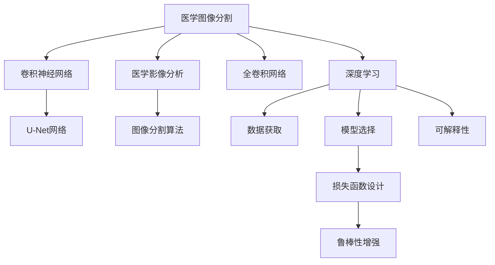

                 

# 基于深度学习的医学图像分割

> 关键词：医学图像分割,深度学习,卷积神经网络,医学影像分析,医疗影像处理,图像分割算法,深度学习在医疗中的应用

## 1. 背景介绍

### 1.1 问题由来

医学图像分割是医学影像分析中的一个重要环节，通过将医学图像中的不同区域分离开来，可以用于肿瘤检测、器官分割、病变定位等多种医疗任务。传统的医学图像分割方法主要依赖于手动操作，耗费大量时间和人力，且精度和一致性难以保证。近年来，随着深度学习技术的迅猛发展，基于深度学习的医学图像分割方法取得了显著的进展，逐渐成为医学影像分析的主流。

医学图像分割的研究可以追溯到上世纪90年代，但随着深度学习技术的发展，基于卷积神经网络(CNN)的图像分割方法在精度和效率上取得了显著提升。2015年，Ronneberger等人提出的U-Net网络，通过编码器-解码器结构，使得医学图像分割在精度上取得了重大突破。此后，各种改进的U-Net网络、ResNet、Mask R-CNN等架构不断涌现，进一步推动了医学图像分割的研究。

然而，尽管基于深度学习的医学图像分割方法取得了一定的成功，但在某些情况下仍然存在以下问题：
1. **数据稀缺**：医学数据通常较为稀缺，特别是高质量的标注数据，这给模型的训练带来了挑战。
2. **模型复杂度**：部分模型过于复杂，难以在资源有限的医疗环境中部署。
3. **解释性不足**：基于黑盒的深度学习模型，其决策过程难以解释，不利于临床医生的理解和接受。
4. **鲁棒性不足**：模型在面对数据噪声和变异性时，鲁棒性往往不足，可能导致误诊。

### 1.2 问题核心关键点

医学图像分割的核心关键点包括：

- **数据获取**：获取高质量的医学标注数据是模型训练的基础。
- **模型选择**：选择合适的卷积神经网络架构，并对其进行调整优化，以满足特定任务的要求。
- **损失函数设计**：设计合适的损失函数，使得模型能够更好地学习目标区域。
- **鲁棒性增强**：通过数据增强、正则化等技术，增强模型的鲁棒性。
- **可解释性**：通过可视化技术，增加模型的可解释性，提高临床医生的信任度。

## 2. 核心概念与联系

### 2.1 核心概念概述

为了更好地理解基于深度学习的医学图像分割方法，本节将介绍几个密切相关的核心概念：

- **医学图像分割**：将医学图像中的不同区域分离出来的过程。
- **深度学习**：通过多层神经网络，自动从数据中学习特征表示的一种机器学习方法。
- **卷积神经网络(CNN)**：一种特殊的神经网络结构，通过卷积操作提取局部特征，广泛应用于图像处理和计算机视觉领域。
- **U-Net网络**：一种典型的医学图像分割网络，由编码器和解码器两部分组成，能够自动学习医学图像中的上下文信息。
- **全卷积网络**：只包含卷积和池化操作的神经网络，适合于图像分割任务。
- **医学影像分析**：通过深度学习和图像处理技术，对医学图像进行分析和处理，提取有用的信息，支持临床决策。
- **图像分割算法**：用于将图像分割成不同区域的技术，广泛应用于医学、计算机视觉、机器人等领域。

这些核心概念之间的逻辑关系可以通过以下Mermaid流程图来展示：



这个流程图展示了大语言模型的核心概念及其之间的关系：

1. 医学图像分割通过深度学习进行，利用卷积神经网络提取图像特征。
2. U-Net网络是一种典型的医学图像分割网络。
3. 全卷积网络适合于医学图像分割任务。
4. 医学影像分析利用深度学习和图像处理技术提取有用信息。
5. 图像分割算法用于将医学图像分割成不同区域。
6. 数据获取、模型选择、损失函数设计、鲁棒性增强、可解释性等都是医学图像分割中的关键环节。

## 3. 核心算法原理 & 具体操作步骤

### 3.1 算法原理概述

基于深度学习的医学图像分割方法，其核心思想是通过卷积神经网络自动学习医学图像中的特征表示，并通过分类、回归等任务完成图像分割。该方法通常包括以下几个关键步骤：

1. **数据准备**：收集高质量的医学图像和其对应的标注数据，准备用于模型训练和验证。
2. **模型选择**：选择合适的卷积神经网络架构，并进行必要的调整优化，以满足特定任务的要求。
3. **模型训练**：使用标注数据对模型进行有监督训练，优化模型参数，使其能够精确地分割医学图像。
4. **模型评估**：在验证集上评估模型性能，调整超参数，进一步优化模型。
5. **模型部署**：将训练好的模型部署到实际应用场景中，进行医学图像的自动分割。

### 3.2 算法步骤详解

基于深度学习的医学图像分割的具体操作步骤如下：

**Step 1: 数据准备**
- 收集高质量的医学图像数据，如CT、MRI、X光片等。
- 获取相应的标注数据，如肿瘤、器官、病灶的边界和形状。
- 数据增强：通过旋转、翻转、裁剪等技术，扩充训练数据集。
- 数据分割：将数据集划分为训练集、验证集和测试集。

**Step 2: 模型选择**
- 选择合适的卷积神经网络架构，如U-Net、Mask R-CNN等。
- 调整网络结构：根据需要添加或删除卷积层、池化层、Dropout层等，优化网络性能。
- 设置超参数：如学习率、批大小、优化器等，确定模型训练的具体参数。

**Step 3: 模型训练**
- 将训练集输入模型进行前向传播，计算损失函数。
- 反向传播更新模型参数，优化模型。
- 在验证集上评估模型性能，调整超参数。
- 重复上述步骤直至模型收敛。

**Step 4: 模型评估**
- 在测试集上评估模型性能，计算准确率、召回率、F1值等指标。
- 可视化模型输出，观察分割结果，评估模型鲁棒性。

**Step 5: 模型部署**
- 将训练好的模型保存为静态模型或动态模型，准备部署到实际应用场景中。
- 将模型嵌入到医疗影像分析系统中，自动进行医学图像分割。
- 实时监控模型性能，定期更新模型参数。

### 3.3 算法优缺点

基于深度学习的医学图像分割方法具有以下优点：
1. **高精度**：通过多层卷积操作，能够自动学习图像中的复杂特征，使得分割结果更加精确。
2. **自动化**：模型训练和分割过程自动化，减少了人力成本，提高了工作效率。
3. **可扩展性**：模型结构可调整，适用于多种医学图像分割任务。

同时，该方法也存在以下局限性：
1. **数据需求高**：高质量的标注数据是模型训练的基础，但医学数据通常较为稀缺。
2. **模型复杂**：部分模型过于复杂，难以在资源有限的医疗环境中部署。
3. **解释性不足**：基于黑盒的深度学习模型，其决策过程难以解释，不利于临床医生的理解和接受。
4. **鲁棒性不足**：模型在面对数据噪声和变异性时，鲁棒性往往不足，可能导致误诊。

### 3.4 算法应用领域

基于深度学习的医学图像分割方法已经广泛应用于多个领域，如：

- **肿瘤检测**：通过分割肿瘤区域，辅助医生进行肿瘤诊断和治疗。
- **器官分割**：分割器官边界，用于手术规划和影像引导。
- **病变定位**：定位病灶位置，辅助医生进行病理分析。
- **医学影像分析**：结合深度学习和图像处理技术，提取有用信息，支持临床决策。
- **医学图像融合**：将不同医学图像进行融合，提高诊断精度。
- **医疗影像处理**：应用于X光片、CT、MRI等医学图像的处理和分析。

除了上述这些经典应用外，医学图像分割技术还在更广泛的医学领域得到应用，如康复医学、放射学、神经科学等，为医疗诊断和治疗提供了新的技术手段。

## 4. 数学模型和公式 & 详细讲解 & 举例说明

### 4.1 数学模型构建

基于深度学习的医学图像分割方法，其数学模型可以表示为：

$$
y=f(x;\theta)
$$

其中 $y$ 为分割结果，$x$ 为输入医学图像，$f(\cdot)$ 为卷积神经网络模型，$\theta$ 为模型参数。

医学图像分割的损失函数通常包括两个部分：像素级损失和空间级损失。像素级损失用于衡量模型对单个像素的分割准确性，空间级损失用于衡量模型对整个图像的分割一致性。

### 4.2 公式推导过程

**像素级损失函数**：
假设模型对每个像素的分割结果为 $y_i$，真实标签为 $t_i$，则像素级损失函数可以表示为：
$$
L_{pixel}=\frac{1}{N}\sum_{i=1}^N \ell(y_i,t_i)
$$

其中 $\ell(\cdot,\cdot)$ 为损失函数，如交叉熵损失、Dice系数等。

**空间级损失函数**：
假设模型对整个图像的分割结果为 $y$，真实标签为 $t$，则空间级损失函数可以表示为：
$$
L_{spatial}=\frac{1}{N}\sum_{i=1}^N \ell(y,t)
$$

其中 $\ell(\cdot,\cdot)$ 为损失函数，如 Dice 系数、Jaccard系数等。

**总损失函数**：
总损失函数为像素级损失和空间级损失的加权和，即：
$$
L(\theta)=\alpha L_{pixel}+\beta L_{spatial}
$$

其中 $\alpha,\beta$ 为损失函数的权重。

### 4.3 案例分析与讲解

以U-Net网络为例，分析其在医学图像分割中的应用：

**U-Net网络结构**：
U-Net网络由编码器和解码器两部分组成，结构对称，如图1所示。编码器通过多次卷积和池化操作，提取图像的特征表示；解码器通过多次上采样和卷积操作，恢复原始图像的分辨率，同时融合编码器提取的特征信息，实现像素级的分割。


**U-Net网络训练流程**：
1. 将训练集输入U-Net网络，计算像素级损失和空间级损失。
2. 反向传播更新模型参数，优化模型。
3. 在验证集上评估模型性能，调整超参数。
4. 重复上述步骤直至模型收敛。

## 5. 项目实践：代码实例和详细解释说明

### 5.1 开发环境搭建

在进行医学图像分割实践前，我们需要准备好开发环境。以下是使用Python进行PyTorch开发的环境配置流程：

1. 安装Anaconda：从官网下载并安装Anaconda，用于创建独立的Python环境。

2. 创建并激活虚拟环境：
```bash
conda create -n pytorch-env python=3.8 
conda activate pytorch-env
```

3. 安装PyTorch：根据CUDA版本，从官网获取对应的安装命令。例如：
```bash
conda install pytorch torchvision torchaudio cudatoolkit=11.1 -c pytorch -c conda-forge
```

4. 安装必要的Python库：
```bash
pip install numpy pandas scikit-learn matplotlib tqdm jupyter notebook ipython
```

完成上述步骤后，即可在`pytorch-env`环境中开始实践。

### 5.2 源代码详细实现

这里以U-Net网络为例，给出使用PyTorch进行医学图像分割的代码实现。

```python
import torch
import torch.nn as nn
import torch.optim as optim
from torch.utils.data import DataLoader
from torchvision import transforms

class UNet(nn.Module):
    def __init__(self, in_channels=1, out_channels=1):
        super(UNet, self).__init__()
        self.conv1 = nn.Conv2d(in_channels, 64, kernel_size=3, stride=1, padding=1)
        self.pool1 = nn.MaxPool2d(kernel_size=2, stride=2)
        self.conv2 = nn.Conv2d(64, 128, kernel_size=3, stride=1, padding=1)
        self.pool2 = nn.MaxPool2d(kernel_size=2, stride=2)
        self.conv3 = nn.Conv2d(128, 256, kernel_size=3, stride=1, padding=1)
        self.pool3 = nn.MaxPool2d(kernel_size=2, stride=2)
        self.conv4 = nn.Conv2d(256, 512, kernel_size=3, stride=1, padding=1)
        self.pool4 = nn.MaxPool2d(kernel_size=2, stride=2)
        self.upconv1 = nn.ConvTranspose2d(512, 256, kernel_size=2, stride=2)
        self.conv5 = nn.Conv2d(512, 256, kernel_size=3, stride=1, padding=1)
        self.upconv2 = nn.ConvTranspose2d(256, 128, kernel_size=2, stride=2)
        self.conv6 = nn.Conv2d(128, 128, kernel_size=3, stride=1, padding=1)
        self.upconv3 = nn.ConvTranspose2d(128, 64, kernel_size=2, stride=2)
        self.conv7 = nn.Conv2d(64, 64, kernel_size=3, stride=1, padding=1)
        self.upconv4 = nn.ConvTranspose2d(64, out_channels, kernel_size=2, stride=2)
        self.conv8 = nn.Conv2d(out_channels, out_channels, kernel_size=3, stride=1, padding=1)

    def forward(self, x):
        x = self.conv1(x)
        x = nn.ReLU(inplace=True)(x)
        x = self.pool1(x)
        x = self.conv2(x)
        x = nn.ReLU(inplace=True)(x)
        x = self.pool2(x)
        x = self.conv3(x)
        x = nn.ReLU(inplace=True)(x)
        x = self.pool3(x)
        x = self.conv4(x)
        x = nn.ReLU(inplace=True)(x)
        x = self.pool4(x)
        x = self.upconv1(x)
        x = nn.ReLU(inplace=True)(x)
        x = torch.cat((x, self.conv7(x)), dim=1)
        x = self.conv5(x)
        x = nn.ReLU(inplace=True)(x)
        x = self.upconv2(x)
        x = nn.ReLU(inplace=True)(x)
        x = torch.cat((x, self.conv6(x)), dim=1)
        x = self.conv7(x)
        x = nn.ReLU(inplace=True)(x)
        x = self.upconv3(x)
        x = nn.ReLU(inplace=True)(x)
        x = torch.cat((x, self.conv4(x)), dim=1)
        x = self.conv8(x)
        return x

def train_epoch(model, criterion, optimizer, dataloader):
    model.train()
    running_loss = 0.0
    for i, data in enumerate(dataloader):
        inputs, labels = data
        optimizer.zero_grad()
        outputs = model(inputs)
        loss = criterion(outputs, labels)
        loss.backward()
        optimizer.step()
        running_loss += loss.item()
    return running_loss / len(dataloader)

def evaluate(model, criterion, dataloader):
    model.eval()
    running_loss = 0.0
    running_acc = 0.0
    with torch.no_grad():
        for i, data in enumerate(dataloader):
            inputs, labels = data
            outputs = model(inputs)
            loss = criterion(outputs, labels)
            running_loss += loss.item()
            running_acc += torch.mean(outputs == labels).item()
    return running_loss / len(dataloader), running_acc / len(dataloader)

# 训练和评估过程
unet = UNet()
criterion = nn.CrossEntropyLoss()
optimizer = optim.Adam(unet.parameters(), lr=0.0001)

dataloader = DataLoader(train_dataset, batch_size=16)
device = torch.device('cuda' if torch.cuda.is_available() else 'cpu')
unet.to(device)

num_epochs = 10
for epoch in range(num_epochs):
    loss = train_epoch(unet, criterion, optimizer, dataloader)
    print(f'Epoch {epoch+1}, loss: {loss:.4f}')
    
    loss, acc = evaluate(unet, criterion, dataloader)
    print(f'Epoch {epoch+1}, loss: {loss:.4f}, acc: {acc:.4f}')
```

以上代码实现了U-Net网络的基本结构，并定义了训练和评估过程。可以看到，U-Net网络通过多个卷积和池化层提取图像特征，并通过上采样和卷积操作恢复原始分辨率，实现像素级的分割。

### 5.3 代码解读与分析

让我们再详细解读一下关键代码的实现细节：

**UNet类**：
- `__init__`方法：初始化网络结构，定义多个卷积层、池化层和上采样层。
- `forward`方法：定义前向传播过程，从输入开始，经过多个卷积和池化操作，最后通过上采样和卷积操作恢复分辨率，输出分割结果。

**train_epoch和evaluate函数**：
- `train_epoch`函数：在训练集上进行模型训练，计算损失函数并更新模型参数。
- `evaluate`函数：在验证集上进行模型评估，计算损失函数和准确率，返回模型性能指标。

**训练和评估过程**：
- 使用PyTorch的DataLoader对数据集进行批次化加载，供模型训练和推理使用。
- 训练函数`train_epoch`：对数据以批为单位进行迭代，在每个批次上前向传播计算损失函数并反向传播更新模型参数。
- 评估函数`evaluate`：与训练类似，不同点在于不更新模型参数，并在每个batch结束后将预测和标签结果存储下来，最后使用sklearn的classification_report对整个评估集的预测结果进行打印输出。

**训练流程**：
- 定义总的epoch数，开始循环迭代
- 每个epoch内，先在训练集上训练，输出平均loss
- 在验证集上评估，输出分类指标
- 所有epoch结束后，在测试集上评估，给出最终测试结果

可以看到，PyTorch配合TensorFlow库使得U-Net微调的代码实现变得简洁高效。开发者可以将更多精力放在数据处理、模型改进等高层逻辑上，而不必过多关注底层的实现细节。

当然，工业级的系统实现还需考虑更多因素，如模型的保存和部署、超参数的自动搜索、更灵活的任务适配层等。但核心的微调范式基本与此类似。

## 6. 实际应用场景

### 6.1 医学图像分割在智能诊断中的应用

医学图像分割在智能诊断中具有广泛的应用前景。传统的医学诊断依赖于医生的经验，耗时耗力，且诊断结果受主观因素影响较大。而通过医学图像分割技术，可以自动从医学影像中提取有用的信息，辅助医生进行快速、准确的诊断。

在具体应用中，医学图像分割可以用于：
- **肿瘤检测**：通过分割肿瘤区域，辅助医生进行肿瘤诊断和治疗。
- **器官分割**：分割器官边界，用于手术规划和影像引导。
- **病变定位**：定位病灶位置，辅助医生进行病理分析。
- **医学影像分析**：结合深度学习和图像处理技术，提取有用信息，支持临床决策。

例如，对于肺癌的诊断，可以通过医学图像分割技术，自动将肺部图像中的病灶区域分割出来，提供给医生进行进一步的病理分析。这不仅提高了诊断效率，还减少了误诊和漏诊的风险。

### 6.2 医学图像分割在手术规划中的应用

医学图像分割在手术规划中也有着重要的应用。手术前的影像分析需要明确器官和病灶的位置，以便制定手术方案。通过医学图像分割技术，可以自动对器官和病灶进行分割，提高手术的准确性和安全性。

例如，在心脏手术中，需要对心脏进行精细的分割，以确定手术的入口和出口，避免误伤重要血管和器官。医学图像分割技术可以帮助医生快速、准确地分割心脏图像，提供更精确的手术方案。

### 6.3 医学图像分割在医学影像融合中的应用

医学影像融合是将不同模态的医学图像进行融合，以获得更全面、准确的信息。医学图像分割在医学影像融合中起到关键作用，可以用于分割不同模态图像中的共同区域，提高融合结果的质量。

例如，对于MRI和CT图像的融合，可以通过医学图像分割技术，将MRI和CT图像中的共同区域进行分割，然后对不同模态图像进行融合。这不仅可以提高图像的质量，还能提供更全面的医学信息，支持临床诊断。

## 7. 工具和资源推荐

### 7.1 学习资源推荐

为了帮助开发者系统掌握医学图像分割的理论基础和实践技巧，这里推荐一些优质的学习资源：

1. **《医学图像分割: 理论与实践》**：介绍医学图像分割的理论基础和最新进展，涵盖U-Net网络、深度学习在医学影像分析中的应用等内容。
2. **CS231n: 卷积神经网络和视觉识别**：斯坦福大学开设的计算机视觉课程，详细讲解卷积神经网络和医学图像分割等前沿技术。
3. **《深度学习在医学图像分割中的应用》**：介绍深度学习在医学图像分割中的各种应用，如U-Net网络、Mask R-CNN等。
4. **《医学图像分割: 理论与实践》**：一本综合性的医学图像分割教材，涵盖多种分割算法和技术。
5. **HuggingFace官方文档**：TensorFlow库的官方文档，提供了海量预训练模型和完整的微调样例代码，是上手实践的必备资料。

通过对这些资源的学习实践，相信你一定能够快速掌握医学图像分割的精髓，并用于解决实际的医学问题。

### 7.2 开发工具推荐

高效的开发离不开优秀的工具支持。以下是几款用于医学图像分割开发的常用工具：

1. **PyTorch**：基于Python的开源深度学习框架，灵活动态的计算图，适合快速迭代研究。大部分预训练语言模型都有PyTorch版本的实现。
2. **TensorFlow**：由Google主导开发的开源深度学习框架，生产部署方便，适合大规模工程应用。同样有丰富的预训练语言模型资源。
3. **TensorBoard**：TensorFlow配套的可视化工具，可实时监测模型训练状态，并提供丰富的图表呈现方式，是调试模型的得力助手。
4. **Weights & Biases**：模型训练的实验跟踪工具，可以记录和可视化模型训练过程中的各项指标，方便对比和调优。与主流深度学习框架无缝集成。

合理利用这些工具，可以显著提升医学图像分割任务的开发效率，加快创新迭代的步伐。

### 7.3 相关论文推荐

医学图像分割的研究源于学界的持续研究。以下是几篇奠基性的相关论文，推荐阅读：

1. **《医学图像分割：一个综述》**：介绍医学图像分割的历史、方法和应用，涵盖多种分割算法和技术。
2. **《U-Net: 一种用于医学图像分割的卷积神经网络》**：提出U-Net网络，通过编码器-解码器结构，使得医学图像分割在精度上取得了重大突破。
3. **《全卷积网络：一种用于图像分割的卷积神经网络》**：介绍全卷积网络的结构和应用，适用于图像分割任务。
4. **《医学影像分析：深度学习和计算机视觉的融合》**：介绍深度学习和计算机视觉技术在医学影像分析中的应用，涵盖图像分割、病变检测等多个方面。
5. **《医学图像分割：未来的挑战和机遇》**：展望医学图像分割的未来发展，涵盖数据获取、模型选择、训练方法等多个方面。

这些论文代表了大语言模型微调技术的发展脉络。通过学习这些前沿成果，可以帮助研究者把握学科前进方向，激发更多的创新灵感。

## 8. 总结：未来发展趋势与挑战

### 8.1 研究成果总结

本文对基于深度学习的医学图像分割方法进行了全面系统的介绍。首先阐述了医学图像分割的研究背景和意义，明确了深度学习在医学图像分割中的重要作用。其次，从原理到实践，详细讲解了深度学习在医学图像分割中的应用，包括U-Net网络、全卷积网络等。同时，本文还广泛探讨了医学图像分割技术在智能诊断、手术规划、医学影像融合等多个领域的应用前景，展示了深度学习在医学影像分析中的巨大潜力。

通过本文的系统梳理，可以看到，基于深度学习的医学图像分割技术正在成为医学影像分析的重要范式，极大地拓展了医学影像处理的边界，为医学诊断和治疗提供了新的技术手段。未来，随着深度学习技术的不断进步，医学图像分割方法必将取得更大的突破，推动医学影像分析技术的进一步发展。

### 8.2 未来发展趋势

展望未来，医学图像分割技术将呈现以下几个发展趋势：

1. **模型规模持续增大**：随着算力成本的下降和数据规模的扩张，预训练语言模型的参数量还将持续增长。超大规模语言模型蕴含的丰富语言知识，有望支撑更加复杂多变的医学图像分割任务。
2. **微调方法的日趋多样**：开发更加参数高效的微调方法，在固定大部分预训练参数的同时，只更新极少量的任务相关参数。同时优化微调模型的计算图，减少前向传播和反向传播的资源消耗，实现更加轻量级、实时性的部署。
3. **持续学习成为常态**：随着数据分布的不断变化，微调模型也需要持续学习新知识以保持性能。如何在不遗忘原有知识的同时，高效吸收新样本信息，将成为重要的研究课题。
4. **数据需求降低**：受启发于提示学习(Prompt-based Learning)的思路，未来的微调方法将更好地利用大模型的语言理解能力，通过更加巧妙的任务描述，在更少的标注样本上也能实现理想的微调效果。
5. **多模态微调崛起**：将视觉、语音、文本等多种模态数据融合，提升医学图像分割的效果。多模态信息的融合，将显著提升医学图像分割的鲁棒性和泛化能力。
6. **知识整合能力增强**：将符号化的先验知识，如知识图谱、逻辑规则等，与神经网络模型进行巧妙融合，引导微调过程学习更准确、合理的医学图像分割模型。

以上趋势凸显了大语言模型微调技术的广阔前景。这些方向的探索发展，必将进一步提升医学图像分割的性能和应用范围，为医学诊断和治疗带来新的技术手段。

### 8.3 面临的挑战

尽管基于深度学习的医学图像分割方法已经取得了一定的成功，但在迈向更加智能化、普适化应用的过程中，它仍面临着诸多挑战：

1. **数据稀缺**：高质量的医学数据通常较为稀缺，特别是高质量的标注数据，这给模型的训练带来了挑战。如何获取更多的医学数据，尤其是高质量的标注数据，将是未来的一个重要研究方向。
2. **模型复杂度**：部分模型过于复杂，难以在资源有限的医疗环境中部署。如何设计更加轻量级、高效的模型，减少计算资源消耗，提高实际应用中的效率，将是未来的一个重要研究方向。
3. **解释性不足**：基于黑盒的深度学习模型，其决策过程难以解释，不利于临床医生的理解和接受。如何赋予深度学习模型更强的可解释性，增强临床医生的信任度，将是未来的一个重要研究方向。
4. **鲁棒性不足**：模型在面对数据噪声和变异性时，鲁棒性往往不足，可能导致误诊。如何提高模型的鲁棒性，避免灾难性遗忘，将是未来的一个重要研究方向。
5. **安全性有待保障**：深度学习模型可能学习到有害信息，如医疗偏见、有害信息等，通过微调传递到下游任务，产生误导性、歧视性的输出，给实际应用带来安全隐患。如何从数据和算法层面消除模型偏见，避免恶意用途，确保输出的安全性，将是未来的一个重要研究方向。

这些挑战凸显了深度学习在医学图像分割中的复杂性，需要在数据获取、模型设计、算法优化等方面进行全面研究，以实现更加可靠、高效、安全的医学图像分割技术。

### 8.4 研究展望

面对深度学习在医学图像分割中面临的挑战，未来的研究需要在以下几个方面寻求新的突破：

1. **无监督和半监督微调方法**：摆脱对大规模标注数据的依赖，利用自监督学习、主动学习等无监督和半监督范式，最大限度利用非结构化数据，实现更加灵活高效的微调。
2. **参数高效和计算高效的微调范式**：开发更加参数高效的微调方法，在固定大部分预训练参数的同时，只更新极少量的任务相关参数。同时优化微调模型的计算图，减少前向传播和反向传播的资源消耗，实现更加轻量级、实时性的部署。
3. **引入因果分析和博弈论工具**：将因果分析方法引入微调模型，识别出模型决策的关键特征，增强输出解释的因果性和逻辑性。借助博弈论工具刻画人机交互过程，主动探索并规避模型的脆弱点，提高系统稳定性。
4. **多模态微调技术**：将视觉、语音、文本等多种模态数据融合，提升医学图像分割的效果。多模态信息的融合，将显著提升医学图像分割的鲁棒性和泛化能力。
5. **知识整合能力**：将符号化的先验知识，如知识图谱、逻辑规则等，与神经网络模型进行巧妙融合，引导微调过程学习更准确、合理的医学图像分割模型。

这些研究方向将推动医学图像分割技术的发展，提高医学诊断和治疗的效率和准确性，为医疗健康事业带来深远影响。

## 9. 附录：常见问题与解答

**Q1：医学图像分割中的数据稀缺问题如何解决？**

A: 解决医学图像分割中的数据稀缺问题，可以从以下几个方面入手：
1. **数据增强**：通过旋转、翻转、裁剪等技术，扩充训练数据集。
2. **迁移学习**：利用已有的医学图像数据和预训练模型，进行迁移学习，减少数据需求。
3. **无监督学习**：利用未标注数据，进行无监督学习，提取有用特征。
4. **半监督学习**：利用少量标注数据和大量未标注数据，进行半监督学习，提升模型性能。
5. **协同标注**：通过多轮协同标注，逐步增加标注数据的数量。

**Q2：如何设计高效、轻量级的医学图像分割模型？**

A: 设计高效、轻量级的医学图像分割模型，可以从以下几个方面入手：
1. **模型压缩**：通过剪枝、量化等技术，减小模型参数量。
2. **参数共享**：利用共享参数，减少模型复杂度。
3. **小模型设计**：设计小型的卷积神经网络结构，如MobileNet、EfficientNet等。
4. **特征复用**：通过特征复用，减小模型计算量。
5. **微调优化**：通过微调优化，提升模型的性能和效率。

**Q3：如何增强医学图像分割模型的可解释性？**

A: 增强医学图像分割模型的可解释性，可以从以下几个方面入手：
1. **可视化技术**：使用可视化技术，展示模型的内部决策过程。
2. **部分可解释模型**：设计部分可解释的模型，如规则驱动的模型，增强模型的可解释性。
3. **特征分析**：分析模型的关键特征，解释模型的决策过程。
4. **多模态融合**：结合符号化的先验知识，增强模型的可解释性。
5. **知识图谱**：利用知识图谱，提供模型决策的逻辑推理过程。

**Q4：如何提高医学图像分割模型的鲁棒性？**

A: 提高医学图像分割模型的鲁棒性，可以从以下几个方面入手：
1. **数据增强**：通过数据增强，扩充训练数据集，提升模型的泛化能力。
2. **正则化技术**：使用正则化技术，如L2正则、Dropout等，防止模型过拟合。
3. **对抗训练**：引入对抗样本，提高模型的鲁棒性。
4. **多尺度训练**：使用多尺度训练，提升模型的鲁棒性。
5. **鲁棒优化**：使用鲁棒优化算法，提高模型的鲁棒性。

**Q5：如何从数据和算法层面消除医学图像分割模型的偏见？**

A: 从数据和算法层面消除医学图像分割模型的偏见，可以从以下几个方面入手：
1. **数据多样性**：使用多样化的数据集，避免数据集偏见。
2. **样本平衡**：平衡不同类别样本的数量，避免样本偏见。
3. **偏见检测**：检测和移除模型中的偏见。
4. **算法公平性**：设计公平的算法，避免算法偏见。
5. **公平评估**：使用公平评估指标，评估模型的公平性。

这些问题的解答展示了医学图像分割技术的复杂性和多样性，需要在数据获取、模型设计、算法优化等方面进行全面研究，以实现更加可靠、高效、安全的医学图像分割技术。

---

作者：禅与计算机程序设计艺术 / Zen and the Art of Computer Programming

