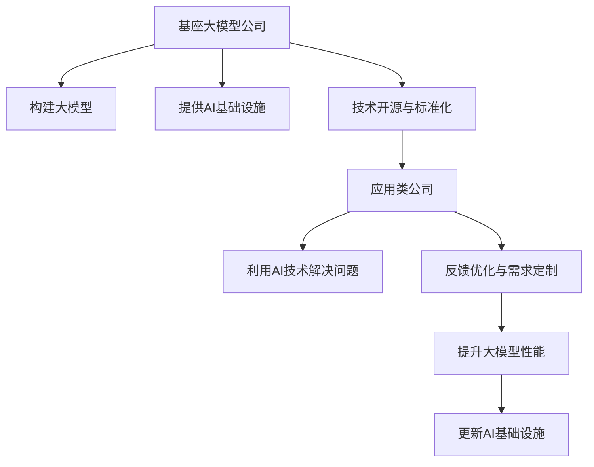

                 

# 基座大模型公司 vs 纯应用类公司：角色与目标之别

## 1. 背景介绍

在当今数字化和智能化的浪潮中，人工智能(AI)技术正成为各行各业提升效率、优化决策、创造价值的关键驱动力。伴随着技术的飞速发展，涌现出了两大类公司：基座大模型公司与应用类公司。前者专注于打造基础性、普适性的AI模型和平台，后者则侧重于特定领域的AI应用创新和定制化解决方案。本文将深入探讨这两类公司的角色与目标，分析其在AI发展中的定位与作用，并展望未来发展趋势与挑战。

## 2. 核心概念与联系

### 2.1 核心概念概述

- **基座大模型公司**：专注于构建并推广大型预训练模型（如GPT、BERT、DALL·E等）和AI基础设施（如深度学习框架、云计算平台、数据集等），旨在为广泛的应用场景提供通用且高效的AI计算能力。
- **纯应用类公司**：聚焦于利用AI技术解决具体行业问题，如自然语言处理(NLP)、计算机视觉(CV)、语音识别(SR)等，提供定制化的产品和服务。

这两类公司在AI技术的研发、应用和推广中扮演着不同的角色，但又紧密联系在一起。基座大模型公司提供底层技术和基础设施，为应用类公司提供了技术基础和工具支持；而应用类公司则通过实践验证和发展AI技术的潜力，推动技术进步和应用落地。

### 2.2 核心概念原理和架构的 Mermaid 流程图

## 3. 核心算法原理 & 具体操作步骤

### 3.1 算法原理概述

基座大模型公司与应用类公司各自承担的角色和目标，决定了它们在算法原理和技术路径上的差异。

**基座大模型公司**：
- **目标**：打造能够处理大规模、复杂任务的通用AI模型，如自然语言理解、图像识别、生成等。
- **核心算法**：采用预训练和微调技术，利用大规模无标签数据进行自监督学习，并在特定任务上进行微调，以提升模型的通用性和泛化能力。
- **技术特点**：注重模型架构和训练策略的设计，如Transformer、Attention机制、自适应学习率等。

**纯应用类公司**：
- **目标**：针对具体行业需求，开发出高性能、高精度的定制化AI应用，解决特定问题。
- **核心算法**：基于特定任务的自定义模型训练，优化算法以适应具体应用场景，如数据增强、迁移学习、对抗训练等。
- **技术特点**：强调模型优化和应用集成，如模型压缩、迁移学习、端到端系统等。

### 3.2 算法步骤详解

**基座大模型公司**：
1. **数据收集与预处理**：构建大规模数据集，进行清洗、标注等预处理工作。
2. **模型构建与训练**：设计并训练通用大模型，如BERT、GPT、ViT等，利用自监督学习任务进行预训练，并在下游任务上进行微调。
3. **基础设施建设**：开发深度学习框架、云计算平台等，提供高效计算和存储支持。
4. **技术开源与标准化**：发布模型和工具的代码库，制定行业标准和规范。
5. **持续迭代与优化**：收集用户反馈，进行模型更新和改进。

**纯应用类公司**：
1. **需求调研与分析**：了解行业痛点和用户需求，确定应用场景。
2. **模型设计与定制**：根据需求设计定制模型，选择合适的大模型进行微调或重训。
3. **算法优化与集成**：优化算法，集成到应用系统中，确保性能和稳定性。
4. **产品开发与测试**：开发产品原型，进行用户测试和反馈收集。
5. **市场推广与部署**：推出产品，进入市场，进行持续优化和迭代。

### 3.3 算法优缺点

**基座大模型公司**：
- **优点**：
  - 通用性强，适用于多种任务和场景。
  - 技术领先，推动了AI领域的基础研究和技术进步。
  - 基础设施完善，提供高效计算和存储支持。
- **缺点**：
  - 模型复杂度高，训练和推理成本高。
  - 模型的通用性可能导致特定任务性能不足。
  - 开源和标准化工作可能面临协调和兼容性问题。

**纯应用类公司**：
- **优点**：
  - 高度定制化，针对具体应用场景效果显著。
  - 能够快速响应市场和用户需求，产品迭代快。
  - 应用落地能力强，有助于推动AI技术的商业化和产业化。
- **缺点**：
  - 依赖性强，对基座大模型公司依赖较大。
  - 技术研发成本高，需要持续投入。
  - 模型优化和算法集成复杂度较高。

### 3.4 算法应用领域

**基座大模型公司**：
- 自然语言处理：BERT、GPT系列等大模型在文本分类、情感分析、机器翻译等领域得到广泛应用。
- 计算机视觉：DALL·E、ViT等模型在图像识别、图像生成、视觉问答等领域表现出色。
- 语音识别：基于大模型的语音识别技术在智能音箱、智能助手等应用中发挥重要作用。

**纯应用类公司**：
- 医疗健康：AI辅助诊断、医疗影像分析等应用，提升医疗服务质量。
- 金融服务：智能投顾、风险管理等应用，优化金融决策。
- 教育科技：智能辅导、作业批改等应用，提升教育效果。
- 自动驾驶：基于大模型的环境感知和决策系统，推动自动驾驶技术发展。
- 零售电商：推荐系统、智能客服等应用，提升用户体验和转化率。

## 4. 数学模型和公式 & 详细讲解 & 举例说明

### 4.1 数学模型构建

基座大模型公司与应用类公司在数学模型构建上也有明显差异：

**基座大模型公司**：
- 主要采用Transformer架构，结合自监督学习任务（如掩码语言模型、下一句预测等）进行预训练。
- 预训练损失函数通常采用交叉熵、对数似然等，旨在最大化模型在无标签数据上的预测能力。

**纯应用类公司**：
- 通常基于特定任务的自定义模型构建，如多任务学习、对抗训练、迁移学习等。
- 任务特定的损失函数，如分类任务的交叉熵、回归任务的均方误差等，优化模型在特定任务上的表现。

### 4.2 公式推导过程

以BERT模型为例，其预训练损失函数为：

$$
\mathcal{L}_{pre} = -\frac{1}{N} \sum_{i=1}^{N} (y \log P(y|x) + (1-y) \log(1-P(y|x)))
$$

其中，$P(y|x)$ 表示模型对输入 $x$ 进行预测时，预测结果为 $y$ 的概率，$y$ 为真实标签。

微调的损失函数则根据具体任务而定，如分类任务：

$$
\mathcal{L}_{finetune} = -\frac{1}{N} \sum_{i=1}^{N} (y_i \log \hat{y}_i + (1-y_i) \log(1-\hat{y}_i))
$$

其中，$\hat{y}_i$ 为模型对输入 $x_i$ 的预测结果，$y_i$ 为真实标签。

### 4.3 案例分析与讲解

**BERT微调实例**：
假设我们有一个情感分析任务的数据集，包含正负情感标注。可以采用如下步骤进行微调：
1. 加载预训练的BERT模型。
2. 将数据集分为训练集和验证集。
3. 定义微调模型的输出层和损失函数，如线性分类器+交叉熵损失。
4. 设置微调参数，如学习率、优化器等。
5. 在训练集上执行梯度下降，最小化损失函数。
6. 在验证集上评估模型性能，防止过拟合。
7. 最终在测试集上评估微调模型的效果。

## 5. 项目实践：代码实例和详细解释说明

### 5.1 开发环境搭建

**基座大模型公司**：
- 安装Python、PyTorch、TensorFlow等深度学习框架。
- 配置GPU/TPU等高性能计算设备。
- 部署深度学习云平台，如AWS、Google Cloud等。

**纯应用类公司**：
- 安装Python、TensorFlow、Keras等框架。
- 配置GPU/TPU，优化计算资源。
- 开发端到端系统，如Web应用、移动应用等。

### 5.2 源代码详细实现

**基座大模型公司**：
- 构建大规模数据集，进行预处理和标注。
- 设计并训练通用大模型，如BERT、GPT等。
- 开发深度学习框架，如PyTorch、TensorFlow等。
- 发布模型和工具库，如HuggingFace、TensorFlow Hub等。

**纯应用类公司**：
- 定制化模型训练，优化算法集成。
- 开发应用系统，如推荐系统、智能客服等。
- 使用开源模型和工具，如TensorFlow、Keras等。

### 5.3 代码解读与分析

**基座大模型公司**：
- **代码实现**：利用PyTorch构建BERT模型，使用自监督学习任务进行预训练。
- **分析**：预训练过程分为两个阶段，分别是掩码语言模型和下一句预测任务，使用自监督学习方式最大化模型预测能力。

**纯应用类公司**：
- **代码实现**：使用TensorFlow实现推荐系统，利用用户行为数据进行模型训练。
- **分析**：推荐算法通常采用协同过滤、内容推荐等方法，结合大模型进行优化，提升推荐效果。

### 5.4 运行结果展示

**基座大模型公司**：
- **结果展示**：BERT模型在多个下游任务上取得了SOTA表现，如GLUE、CoLA等评测任务。
- **分析**：模型在无标签数据上的预训练和下游任务的微调，显著提升了通用性和泛化能力。

**纯应用类公司**：
- **结果展示**：智能客服系统在客户满意度、问题解决率等指标上表现优异。
- **分析**：基于BERT的微调模型，能够快速响应客户咨询，提供高质量的回复，显著提升用户体验。

## 6. 实际应用场景

### 6.1 医疗健康

基座大模型公司在医疗健康领域的应用主要集中在医学影像分析、基因组学研究等。如Google的DeepMind利用大模型进行疾病诊断和治疗方案推荐，显著提高了医疗服务质量。

纯应用类公司则专注于医疗健康具体应用，如AI辅助手术、智能诊疗系统等。通过定制化模型和算法，显著提升了医疗服务效率和诊断准确性。

### 6.2 金融服务

基座大模型公司在金融领域主要提供金融数据分析、风险管理等基础服务。如OpenAI的GPT-3被用于量化交易，提升了金融市场的稳定性。

纯应用类公司则提供智能投顾、风险评估等具体应用，帮助金融机构优化决策，提升运营效率。

### 6.3 教育科技

基座大模型公司在教育领域主要提供教育数据分析、智能辅导等基础服务。如Coursera利用大模型进行课程推荐，提升了在线教育的用户体验。

纯应用类公司则提供个性化辅导、作业批改等具体应用，帮助教育机构提高教学效果和资源利用率。

### 6.4 未来应用展望

**基座大模型公司**：
- 发展更加高效和智能的大模型，如基于Transformer架构的通用大模型。
- 推动AI基础设施的标准化和开源化，提高技术普及率。
- 强化大模型的鲁棒性和安全性，防范模型滥用和攻击。

**纯应用类公司**：
- 深入挖掘行业需求，开发更加定制化和高性能的AI应用。
- 强化应用系统的用户体验和易用性，推动AI技术在垂直行业的落地应用。
- 推动AI伦理和技术规范的研究，确保AI应用的社会责任和安全。

## 7. 工具和资源推荐

### 7.1 学习资源推荐

**基座大模型公司**：
- 《Deep Learning》书籍：Ian Goodfellow等人著，介绍了深度学习的基本概念和算法。
- CS231n《深度学习视觉识别》课程：斯坦福大学开设的课程，涵盖了计算机视觉的基础知识和最新进展。
- OpenAI的GPT-3论文和代码库：提供了GPT-3模型的训练和优化细节，有助于理解大模型训练过程。

**纯应用类公司**：
- 《TensorFlow实战指南》书籍：Manning Publications出版，介绍了TensorFlow的基本用法和应用场景。
- Keras官方文档：提供了Keras框架的详细文档和教程，适合快速上手开发AI应用。
- Coursera的《机器学习》课程：Andrew Ng教授主讲，介绍了机器学习的基本理论和实践方法。

### 7.2 开发工具推荐

**基座大模型公司**：
- PyTorch：深度学习框架，提供了灵活的动态计算图和丰富的模型库。
- TensorFlow：深度学习框架，支持大规模分布式训练和部署。
- JAX：高性能计算库，支持自动微分和分布式计算。

**纯应用类公司**：
- TensorFlow：深度学习框架，提供了丰富的模型和优化算法。
- Keras：高级API，简化了模型构建和训练过程。
- MXNet：支持多种计算设备，提供了高效的分布式训练和推理能力。

### 7.3 相关论文推荐

**基座大模型公司**：
- Attention is All You Need：提出Transformer架构，开启了大模型的预训练时代。
- BERT: Pre-training of Deep Bidirectional Transformers for Language Understanding：提出BERT模型，利用自监督学习提升大模型的泛化能力。
- GPT-3：展示了大规模语言模型的强大自监督学习能力和应用潜力。

**纯应用类公司**：
- DeepMind的AlphaFold：利用大模型进行蛋白质结构预测，推动了生物科学的发展。
- OpenAI的DALL·E：展示了大模型在图像生成上的强大能力，推动了计算机视觉的研究进展。
- Google的BERT-For-Question-Answering：展示了BERT模型在问答系统上的应用效果，推动了自然语言处理技术的应用。

## 8. 总结：未来发展趋势与挑战

### 8.1 研究成果总结

本文从基座大模型公司和纯应用类公司的角度，全面探讨了AI技术在研发、应用和推广中的不同角色和目标。基座大模型公司提供底层技术和基础设施，推动AI技术的基础研究和技术进步；纯应用类公司则聚焦于具体应用场景，提供定制化的解决方案，推动AI技术的落地和产业化。

### 8.2 未来发展趋势

**基座大模型公司**：
- 预训练大模型的规模和能力将进一步提升，如GPT-4、ViT-Huge等。
- AI基础设施将更加完善，如高效的深度学习框架、强大的计算平台等。
- 将更多的先验知识和伦理约束融入模型训练中，提高模型的可信度和安全性。

**纯应用类公司**：
- 定制化AI应用将更加成熟，如智能诊断、智能客服等。
- AI技术与行业需求的结合将更加紧密，提升应用效果和商业价值。
- 推动AI伦理和技术规范的研究，确保AI应用的社会责任和安全。

### 8.3 面临的挑战

**基座大模型公司**：
- 预训练模型的规模和复杂度将带来更高的计算和存储需求。
- 模型的泛化能力和鲁棒性将面临新的挑战，如对抗样本攻击等。
- 大规模模型的伦理和安全问题，如偏见、滥用等，需要进一步解决。

**纯应用类公司**：
- 对基座大模型公司的依赖将带来成本和性能瓶颈。
- 定制化模型的开发和优化将带来更高的技术门槛。
- 模型的鲁棒性和安全性将面临新的挑战，如对抗样本攻击等。

### 8.4 研究展望

未来的研究应聚焦于以下几个方面：
- 强化大模型的泛化能力和鲁棒性，提高其在多样数据上的表现。
- 推动AI技术与行业需求的深度融合，开发更加定制化和高效的应用。
- 加强AI伦理和技术规范的研究，确保AI应用的公平性和安全性。
- 探索无监督和半监督学习范式，减少对标注数据的依赖。
- 开发更加高效的计算和存储技术，支持大模型的训练和推理。

总之，基座大模型公司与应用类公司各有其独特价值和挑战，需要通过协同合作，共同推动AI技术的发展和应用。只有持续创新，勇于突破，才能实现AI技术的普及和产业化，为社会创造更大的价值。

## 9. 附录：常见问题与解答

### Q1: 基座大模型公司和纯应用类公司的区别在哪里？

A: 基座大模型公司专注于构建通用性、普适性的AI模型和基础设施，如BERT、GPT等大模型，以及深度学习框架、云平台等技术支持；而纯应用类公司则专注于利用AI技术解决特定行业问题，如智能客服、医疗诊断等，提供定制化的解决方案和产品。

### Q2: 基座大模型公司如何提升模型的泛化能力？

A: 基座大模型公司主要通过大规模无标签数据进行预训练，利用自监督学习任务提升模型的泛化能力。此外，微调技术也被广泛应用于提升模型在特定任务上的表现，如BERT、GPT等模型在多个下游任务上取得了SOTA效果。

### Q3: 纯应用类公司如何开发高性能的定制化AI应用？

A: 纯应用类公司通过收集特定行业的数据，设计并训练定制化的AI模型，优化算法集成到应用系统中。例如，智能客服系统利用BERT进行情感分析和智能回复，提升了客户满意度。

### Q4: 基座大模型公司如何推动AI技术的产业化？

A: 基座大模型公司通过开源和标准化技术，降低了AI技术的进入门槛，推动了AI技术的普及和产业化。例如，TensorFlow和PyTorch等框架的广泛应用，为开发者提供了强大的工具支持。

### Q5: 纯应用类公司如何保证AI应用的公平性和安全性？

A: 纯应用类公司需要在模型训练和应用过程中引入伦理导向的评估指标，防止模型产生偏见和有害的输出。同时，加强人工干预和监管机制，确保AI应用符合社会伦理和安全规范。

作者：禅与计算机程序设计艺术 / Zen and the Art of Computer Programming

