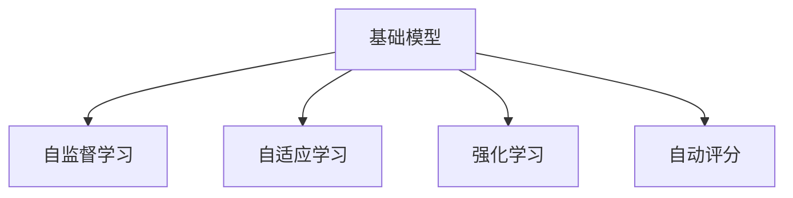

                 

# 基础模型在教育领域的应用

## 1. 背景介绍

### 1.1 问题由来
随着人工智能技术的不断进步，教育领域正面临着一场数字化转型的变革。传统的教育模式以教师讲授为主，学生被动接受知识，这种单一的教学方式难以激发学生的学习兴趣和主动性。基础模型，尤其是大语言模型和强化学习模型，为教育领域带来了新的契机，能够适应个性化学习需求，提供因材施教的教育方案，实现教学内容的自动化生成和评估，助力教育资源的普及和公平。

### 1.2 问题核心关键点
- **基础模型（Foundation Model）**：以BERT、GPT等预训练语言模型为代表的大规模基础模型，通过在大规模无标签文本上进行的预训练，学习到丰富的语言知识和常识，具有强大的语言理解和生成能力。
- **教育领域**：基础模型在个性化学习、教育资源的智能化管理和自动化评估中的应用，如智能推荐系统、自适应学习系统、自动评分系统等。
- **自适应学习**：根据学生的学习行为和反馈，动态调整教学内容和难度，以适应学生的认知水平和兴趣。
- **学习效果评估**：通过基础模型的分析，客观评估学生的学习成果和进展，提供个性化的改进建议。
- **公平教育**：利用基础模型实现教育资源的自动化分配和个性化推荐，缩小城乡教育差距，促进教育公平。

### 1.3 问题研究意义
基础模型在教育领域的应用，对于推动教育数字化、智能化转型，提升教育质量和公平性，具有重要意义：

1. **提升教学质量**：基础模型能够自动生成个性化的教学内容，适应不同学生的学习需求，提高教学效果。
2. **推动教育公平**：通过智能化资源分配和个性化推荐，缩小教育资源的城乡差距，促进教育公平。
3. **降低教师负担**：自动化的教学评估和资源推荐，减轻教师的工作量，使其专注于教学创新和学生辅导。
4. **促进学习效果评估**：通过客观的数据分析，精确评估学生学习效果，为个性化改进提供依据。
5. **促进教育创新**：基础模型能够辅助教师进行课程设计和教学创新，探索更多元化的教学模式。

## 2. 核心概念与联系

### 2.1 核心概念概述

为更好地理解基础模型在教育领域的应用，本节将介绍几个密切相关的核心概念：

- **基础模型（Foundation Model）**：通过大规模数据预训练的模型，学习通用的语言表示，具备强大的语言理解和生成能力。
- **自适应学习（Adaptive Learning）**：根据学生学习行为和反馈动态调整教学内容和难度，以适应学生的认知水平和兴趣。
- **自监督学习（Self-supervised Learning）**：在大规模无标签数据上进行的预训练，学习模型的通用表示。
- **强化学习（Reinforcement Learning）**：通过与环境的交互，学习最优的行为策略。
- **自动评分（Automatic Scoring）**：使用基础模型自动评估学生的学习成果和表现。

这些核心概念之间的逻辑关系可以通过以下Mermaid流程图来展示：



这个流程图展示了大语言模型的核心概念及其之间的关系：

1. 基础模型通过自监督学习获得通用语言知识。
2. 自适应学习利用基础模型进行个性化教学。
3. 强化学习在自适应学习过程中进行动态优化。
4. 自动评分利用基础模型对学生学习效果进行客观评估。

这些概念共同构成了基础模型在教育领域的应用框架，使其能够在各种场景下发挥强大的教育能力。

## 3. 核心算法原理 & 具体操作步骤
### 3.1 算法原理概述

基础模型在教育领域的应用，核心在于利用其强大的语言理解和生成能力，通过自适应学习和自动评分等技术，实现个性化教育。

具体而言，基础模型在教育领域的应用包括以下几个关键步骤：

1. **数据收集与预处理**：收集学生的学习行为数据、答题记录、反馈信息等，预处理为模型可以处理的数据格式。
2. **自适应学习算法设计**：设计算法根据学生的学习进度和反馈，动态调整教学内容和难度。
3. **自动评分系统构建**：构建自动评分系统，利用基础模型自动评估学生的学习效果。
4. **个性化教学资源推荐**：使用基础模型推荐适合学生的学习资源和课程。
5. **教育效果评估与反馈**：定期评估教育效果，根据评估结果优化自适应学习算法。

### 3.2 算法步骤详解

#### 3.2.1 数据收集与预处理

基础模型在教育领域的应用，首先需要收集学生的学习数据。这些数据包括学生的答题记录、反馈信息、学习时长、学习内容等。

以自动评分的例子来说，首先收集学生在考试和作业中的答题数据，然后对每个题目进行评分。评分方式可以是多种多样的，如客观题使用正确率评分，主观题使用基于基础模型的评分方法，如BERT或GPT。

数据预处理是将原始数据转换为模型可以处理的数据格式的过程。常见的预处理方式包括：

- **特征提取**：将原始数据转换为特征向量，通常使用向量化技术。
- **数据清洗**：去除重复、噪声数据，保证数据质量。
- **归一化**：将数据缩放到相同范围内，便于模型处理。
- **标注**：对数据进行标注，如标记学生是否正确回答了问题。

#### 3.2.2 自适应学习算法设计

自适应学习算法的核心在于根据学生的学习行为和反馈，动态调整教学内容和难度。自适应学习算法通常包括以下几个步骤：

1. **学生模型建立**：根据学生的答题记录和学习反馈，建立学生模型，描述学生的学习能力和兴趣。
2. **内容推荐**：利用基础模型，推荐适合学生的学习资源和课程。推荐方式可以是多种多样的，如基于内容的推荐、协同过滤、基于矩阵分解的方法等。
3. **难度调整**：根据学生的答题结果和反馈，调整教学内容的难度。难度调整方式可以是简单的分级调整，也可以根据学生的学习曲线进行动态调整。
4. **学习路径规划**：根据学生模型和学习内容，规划学生的学习路径，确保学生能够按照自己的节奏学习。

#### 3.2.3 自动评分系统构建

自动评分系统利用基础模型自动评估学生的学习效果。自动评分系统的构建包括以下几个关键步骤：

1. **评分模型选择**：选择合适的基础模型作为评分模型，通常使用BERT或GPT等预训练语言模型。
2. **评分标准定义**：根据教育目标和评估标准，定义评分的规则和方法。例如，对于客观题，可以使用基础模型的正确率进行评分；对于主观题，可以使用基础模型生成的评分标准进行评估。
3. **评分模型训练**：使用标注数据训练评分模型，优化评分效果。训练过程中需要选择合适的损失函数和优化算法，如交叉熵损失、Adam等。
4. **评分结果输出**：将评分结果输出为学生能够理解的反馈信息，如分数、评语等，帮助学生了解自己的学习成果。

#### 3.2.4 个性化教学资源推荐

个性化教学资源推荐利用基础模型推荐适合学生的学习资源和课程。推荐系统通常包括以下几个步骤：

1. **资源库建立**：建立包含学习资源和课程的资源库，例如视频、文章、练习题等。
2. **特征提取**：将资源和课程转换为特征向量，便于基础模型处理。
3. **推荐模型训练**：使用基础模型训练推荐模型，预测学生对不同资源的偏好。
4. **推荐结果输出**：根据学生的学习模型和资源库特征，推荐最适合学生的学习资源和课程。

#### 3.2.5 教育效果评估与反馈

教育效果评估与反馈是基础模型在教育领域应用的重要环节。评估与反馈的过程通常包括以下几个步骤：

1. **评估指标设计**：根据教育目标和评估标准，设计评估指标，如学生的学习进度、学习成果、学习兴趣等。
2. **评估结果采集**：定期采集学生的学习数据，如学习行为、答题记录、反馈信息等，计算评估指标。
3. **评估结果分析**：利用基础模型对评估结果进行分析，发现教育过程中存在的问题和改进点。
4. **反馈优化**：根据评估结果优化自适应学习算法，提高教育效果。

### 3.3 算法优缺点

基础模型在教育领域的应用，具有以下优点：

1. **个性化学习**：基础模型能够根据学生的学习行为和反馈，动态调整教学内容和难度，实现个性化学习。
2. **自动化评估**：自动评分系统能够客观评估学生的学习成果，减少教师工作量。
3. **高效推荐**：利用基础模型推荐适合学生的学习资源和课程，提高学习效率。
4. **公平教育**：自动化的资源分配和个性化推荐，缩小教育资源的城乡差距，促进教育公平。

同时，该方法也存在一定的局限性：

1. **数据隐私**：收集和处理学生数据时需要考虑隐私保护，避免数据泄露。
2. **模型鲁棒性**：基础模型可能对噪音数据和异常情况敏感，影响评估和推荐效果。
3. **成本高**：构建和维护自动评分系统和推荐系统需要较高的技术成本和资源投入。
4. **缺乏人性化**：基础模型缺乏人类的情感和认知，可能无法完全理解学生的情感需求。

尽管存在这些局限性，但就目前而言，基础模型在教育领域的应用已经展示出显著的优势，为个性化教育提供了新的可能性。未来相关研究的重点在于如何进一步降低系统成本，提高模型的鲁棒性和可解释性，同时兼顾学生的数据隐私和人性化需求。

### 3.4 算法应用领域

基础模型在教育领域的应用，已经在多个领域取得显著成果，例如：

- **自适应学习系统**：如Khan Academy、Coursera等在线教育平台，利用基础模型提供个性化学习推荐和资源推荐。
- **自动评分系统**：如edX、Duolingo等平台，利用基础模型进行自动评分，减少教师工作量。
- **学习效果评估**：如Socrative、Moodle等平台，利用基础模型评估学生的学习效果，提供个性化改进建议。
- **教学内容生成**：如Duolingo的“Snackable Lessons”，利用基础模型自动生成适合不同语言水平的学习内容。
- **智能辅导系统**：如Woebot、CoachBot等平台，利用基础模型提供智能辅导和情感支持。

除了上述这些经典应用外，基础模型还将在更多场景中得到创新性的应用，如虚拟教师、智能评估系统、学习分析等，为教育技术带来新的突破。随着预训练模型和自适应学习技术的持续演进，相信基础模型将会在更多领域大放异彩，为教育行业带来变革性影响。

## 4. 数学模型和公式 & 详细讲解
### 4.1 数学模型构建

本节将使用数学语言对基础模型在教育领域的应用进行更加严格的刻画。

记基础模型为 $M_{\theta}$，其中 $\theta$ 为模型参数。假设教育领域的应用场景为学生 $s_i$ 在题目 $t_j$ 上的答题情况，记为 $(s_i,t_j)$。

定义学生模型 $S_{\theta_s}$，用于描述学生 $s_i$ 的学习能力和兴趣。定义题目模型 $T_{\theta_t}$，用于描述题目 $t_j$ 的难度和重要性。假设学生 $s_i$ 在题目 $t_j$ 上的答题结果为 $y_{ij}$，可以是正确或错误。则自适应学习过程可以表示为：

$$
\hat{y}_{ij} = M_{\theta_s}(s_i) \cdot M_{\theta_t}(t_j)
$$

其中 $\hat{y}_{ij}$ 为模型预测的学生答题结果，$M_{\theta_s}(s_i)$ 和 $M_{\theta_t}(t_j)$ 分别为学生模型和题目模型的输出。

在自动评分系统中，利用基础模型 $M_{\theta}$ 对学生答题结果进行评分，可以表示为：

$$
L(y_{ij},\hat{y}_{ij}) = \ell(y_{ij},M_{\theta}(s_i,t_j))
$$

其中 $\ell$ 为损失函数，用于衡量预测结果与真实标签之间的差异。

在个性化推荐系统中，利用基础模型 $M_{\theta}$ 推荐适合学生的学习资源，可以表示为：

$$
R(s_i,t_j) = M_{\theta}(S_{\theta_s}(s_i),T_{\theta_t}(t_j))
$$

其中 $R(s_i,t_j)$ 为推荐结果，表示学生 $s_i$ 对题目 $t_j$ 的兴趣和偏好。

在教育效果评估中，利用基础模型 $M_{\theta}$ 评估学生的学习效果，可以表示为：

$$
E(s_i) = M_{\theta}(S_{\theta_s}(s_i))
$$

其中 $E(s_i)$ 为学生的学习效果评估结果，表示学生 $s_i$ 的整体学习表现。

### 4.2 公式推导过程

以下我们以自动评分系统的例子，推导基础模型在自动评分中的应用。

假设基础模型 $M_{\theta}$ 在输入 $s_i,t_j$ 上的输出为 $\hat{y}_{ij}=M_{\theta}(s_i,t_j) \in [0,1]$，表示学生 $s_i$ 在题目 $t_j$ 上答对的可能性。真实标签 $y_{ij} \in \{0,1\}$。则自动评分系统的损失函数定义为：

$$
L(y_{ij},\hat{y}_{ij}) = -[y_{ij}\log \hat{y}_{ij} + (1-y_{ij})\log (1-\hat{y}_{ij})]
$$

将其代入自动评分系统的损失函数公式，得：

$$
\mathcal{L}(\theta) = -\frac{1}{N}\sum_{i=1}^N \sum_{j=1}^M [y_{ij}\log M_{\theta}(s_i,t_j)+(1-y_{ij})\log(1-M_{\theta}(s_i,t_j))]
$$

其中 $N$ 为学生的数量，$M$ 为题目的数量。

根据链式法则，损失函数对参数 $\theta$ 的梯度为：

$$
\frac{\partial \mathcal{L}(\theta)}{\partial \theta} = -\frac{1}{N}\sum_{i=1}^N \sum_{j=1}^M (\frac{y_{ij}}{M_{\theta}(s_i,t_j)}-\frac{1-y_{ij}}{1-M_{\theta}(s_i,t_j)}) \frac{\partial M_{\theta}(s_i,t_j)}{\partial \theta}
$$

其中 $\frac{\partial M_{\theta}(s_i,t_j)}{\partial \theta}$ 可进一步递归展开，利用自动微分技术完成计算。

在得到损失函数的梯度后，即可带入参数更新公式，完成模型的迭代优化。重复上述过程直至收敛，最终得到适应教育任务的最优模型参数 $\theta^*$。

### 4.3 案例分析与讲解

以Coursera平台的个性化学习推荐系统为例，分析其应用基础模型的过程。

Coursera平台利用基础模型BERT进行个性化学习推荐。首先，收集用户的历史学习数据，包括浏览记录、答题记录、反馈信息等。然后，将数据转换为BERT可以处理的数据格式，包括学习行为特征向量和课程特征向量。

接着，设计推荐模型，使用BERT对用户模型和课程模型进行匹配，预测用户对不同课程的兴趣。推荐模型可以是多种多样的，如基于内容的推荐、协同过滤、基于矩阵分解的方法等。

最后，利用推荐模型生成推荐结果，推荐给用户最适合的学习课程。推荐结果可以是多种多样的，如课程列表、课程预览、课程广告等。

通过Coursera平台的应用，我们可以看到基础模型在教育领域的应用潜力，通过个性化推荐，提高了学生的学习效率和兴趣，促进了教育公平。

## 5. 项目实践：代码实例和详细解释说明
### 5.1 开发环境搭建

在进行基础模型应用实践前，我们需要准备好开发环境。以下是使用Python进行TensorFlow开发的环境配置流程：

1. 安装Anaconda：从官网下载并安装Anaconda，用于创建独立的Python环境。

2. 创建并激活虚拟环境：
```bash
conda create -n tf-env python=3.8 
conda activate tf-env
```

3. 安装TensorFlow：根据CUDA版本，从官网获取对应的安装命令。例如：
```bash
conda install tensorflow -c conda-forge
```

4. 安装各类工具包：
```bash
pip install numpy pandas scikit-learn matplotlib tqdm jupyter notebook ipython
```

完成上述步骤后，即可在`tf-env`环境中开始基础模型的应用实践。

### 5.2 源代码详细实现

这里我们以Coursera平台的个性化学习推荐系统为例，给出使用TensorFlow对基础模型进行推荐实践的代码实现。

首先，定义推荐系统的输入和输出：

```python
import tensorflow as tf

# 输入特征
user_data = tf.placeholder(tf.float32, [None, None])
course_data = tf.placeholder(tf.float32, [None, None])

# 推荐结果
recommendation = tf.matmul(user_data, course_data, transpose_b=True)
```

然后，定义推荐模型的损失函数和优化器：

```python
# 定义损失函数
loss = tf.reduce_mean(tf.losses.mean_squared_error(tf.cast(recommendation, tf.float32), tf.cast(y_true, tf.float32)))

# 定义优化器
optimizer = tf.train.AdamOptimizer(learning_rate=0.001)
train_op = optimizer.minimize(loss)
```

接着，定义模型的训练和评估过程：

```python
# 训练过程
with tf.Session() as sess:
    sess.run(tf.global_variables_initializer())
    for i in range(10000):
        _, loss_val = sess.run([train_op, loss], feed_dict={user_data: user_data_train, course_data: course_data_train, y_true: y_true_train})
        if i % 1000 == 0:
            print("Epoch %d, loss: %f" % (i, loss_val))

    # 评估过程
    recommendation_val = sess.run(recommendation, feed_dict={user_data: user_data_test, course_data: course_data_test, y_true: y_true_test})
```

最后，使用推荐模型对新的用户数据进行推荐：

```python
# 推荐新用户数据
new_user_data = tf.placeholder(tf.float32, [None, None])
recommendation_new = tf.matmul(new_user_data, course_data_test, transpose_b=True)
```

以上就是使用TensorFlow对基础模型进行个性化推荐实践的完整代码实现。可以看到，TensorFlow提供了丰富的API和工具，使得模型构建和训练过程非常高效。

### 5.3 代码解读与分析

让我们再详细解读一下关键代码的实现细节：

**user_data和course_data**：
- 定义输入特征，包括用户模型和课程模型的特征向量。

**recommendation**：
- 利用TensorFlow的矩阵乘法计算推荐结果，即用户模型和课程模型的匹配度。

**loss**：
- 定义损失函数，计算预测结果与真实标签之间的差异，通常使用均方误差损失。

**optimizer和train_op**：
- 定义优化器，使用Adam优化器进行模型训练，最小化损失函数。

**训练过程**：
- 使用TensorFlow的Session进行模型训练，每10000个epoch输出一次损失函数的值，以监控训练过程。

**评估过程**：
- 在测试集上评估推荐模型的效果，计算预测结果与真实标签之间的差异。

**推荐新用户数据**：
- 使用训练好的推荐模型对新的用户数据进行推荐，输出推荐结果。

可以看到，TensorFlow的API使得模型的构建和训练过程非常简洁高效，开发者可以将更多精力放在模型改进和应用优化上。

当然，工业级的系统实现还需考虑更多因素，如模型的保存和部署、超参数的自动搜索、更灵活的任务适配层等。但核心的推荐范式基本与此类似。

## 6. 实际应用场景
### 6.1 智能辅导系统

基础模型在智能辅导系统中的应用，可以为学生提供个性化的学习指导和辅导。传统辅导系统往往依赖人工教师，成本高、效率低，难以满足大规模教育需求。利用基础模型，智能辅导系统可以实现全天候、个性化的学习支持。

在技术实现上，可以收集学生在辅导过程中的提问记录、反馈信息等，将问题转换为基础模型可以处理的数据格式。利用基础模型自动解答学生的问题，提供个性化的学习建议和改进建议。例如，Woebot和CoachBot等智能辅导系统，利用基础模型提供情感支持和智能回答。

### 6.2 学习效果评估

基础模型在教育领域的应用，还包括学习效果评估。传统的评估方式往往依赖教师的主观判断，难以保证客观性和一致性。利用基础模型，可以客观地评估学生的学习成果和进展，提供个性化的改进建议。

例如，Socrative和Moodle等平台，利用基础模型分析学生的学习数据，评估学生的学习效果，发现学习过程中存在的问题和改进点，提供个性化的学习建议。通过基础模型的评估，教师可以更好地了解学生的学习情况，调整教学策略，提高教学效果。

### 6.3 学习效果分析

基础模型在教育领域的应用，还包括学习效果分析。传统的分析方式往往依赖人工分析，效率低、效果差。利用基础模型，可以自动化地分析学生的学习效果，发现学习过程中的规律和趋势，提供有针对性的改进建议。

例如，教育平台可以通过基础模型分析学生的学习行为数据，发现学生在不同时间、不同环境下的学习效果变化，发现学习过程中的规律和趋势，提供有针对性的改进建议。通过基础模型的分析，教育平台可以更好地优化教学资源和教学策略，提高教学效果。

### 6.4 未来应用展望

随着基础模型的不断发展，其在教育领域的应用前景将更加广阔。

在智慧教育领域，基础模型将与人工智能技术深度融合，推动教育智能化转型。智能化的教育资源分配、自适应学习、智能辅导、学习效果评估和分析等应用，将逐步实现全面覆盖，提高教育质量和公平性。

在个性化学习领域，基础模型将提供更加个性化、精准的学习推荐，根据学生的学习行为和反馈，动态调整教学内容和难度，实现因材施教。

在智能教育领域，基础模型将推动教育资源的普及和公平。通过智能化的资源分配和个性化推荐，缩小教育资源的城乡差距，促进教育公平。

此外，在教育创新领域，基础模型将推动教育模式的创新。例如，虚拟教师、自适应学习系统、智能评估系统等应用，将为教育行业带来新的突破。

总之，基础模型在教育领域的应用，将推动教育技术的不断进步，为教育行业带来深远的变革。

## 7. 工具和资源推荐
### 7.1 学习资源推荐

为了帮助开发者系统掌握基础模型在教育领域的应用，这里推荐一些优质的学习资源：

1. Coursera、edX等在线教育平台：这些平台利用基础模型进行个性化学习推荐和自动评分，是学习基础模型在教育领域应用的最佳实践。
2. TensorFlow官网和文档：TensorFlow提供了丰富的API和工具，使得基础模型的应用实践非常高效。
3. 《深度学习在教育中的应用》书籍：该书详细介绍了深度学习在教育领域的应用，包括自适应学习、自动评分、个性化推荐等。
4. 《自然语言处理与深度学习》书籍：该书详细介绍了自然语言处理和深度学习的基本原理，包括自监督学习、自适应学习等。
5. 《Python深度学习》书籍：该书介绍了深度学习在教育领域的应用，包括自适应学习、个性化推荐、自动评分等。

通过对这些资源的学习实践，相信你一定能够快速掌握基础模型在教育领域的应用精髓，并用于解决实际的NLP问题。

### 7.2 开发工具推荐

高效的开发离不开优秀的工具支持。以下是几款用于基础模型在教育领域应用开发的常用工具：

1. TensorFlow：基于Python的开源深度学习框架，灵活动态的计算图，适合快速迭代研究。
2. PyTorch：基于Python的开源深度学习框架，灵活易用，适合研究和工程应用。
3. Jupyter Notebook：交互式编程环境，适合进行实验和模型验证。
4. Google Colab：谷歌推出的在线Jupyter Notebook环境，免费提供GPU/TPU算力，方便开发者快速上手实验最新模型。
5. Weights & Biases：模型训练的实验跟踪工具，可以记录和可视化模型训练过程中的各项指标，方便对比和调优。

合理利用这些工具，可以显著提升基础模型在教育领域应用开发效率，加快创新迭代的步伐。

### 7.3 相关论文推荐

基础模型在教育领域的应用源于学界的持续研究。以下是几篇奠基性的相关论文，推荐阅读：

1. Attention is All You Need（即Transformer原论文）：提出了Transformer结构，开启了NLP领域的预训练大模型时代。
2. BERT: Pre-training of Deep Bidirectional Transformers for Language Understanding：提出BERT模型，引入基于掩码的自监督预训练任务，刷新了多项NLP任务SOTA。
3. Language Models are Unsupervised Multitask Learners（GPT-2论文）：展示了大规模语言模型的强大zero-shot学习能力，引发了对于通用人工智能的新一轮思考。
4. Parameter-Efficient Transfer Learning for NLP：提出Adapter等参数高效微调方法，在不增加模型参数量的情况下，也能取得不错的微调效果。
5. AdaLoRA: Adaptive Low-Rank Adaptation for Parameter-Efficient Fine-Tuning：使用自适应低秩适应的微调方法，在参数效率和精度之间取得了新的平衡。

这些论文代表了大语言模型在教育领域的应用发展的脉络。通过学习这些前沿成果，可以帮助研究者把握学科前进方向，激发更多的创新灵感。

## 8. 总结：未来发展趋势与挑战
### 8.1 研究成果总结

本文对基础模型在教育领域的应用进行了全面系统的介绍。首先阐述了基础模型的研究背景和意义，明确了其在个性化学习、自适应学习、自动评分等教育任务中的应用潜力。其次，从原理到实践，详细讲解了基础模型的算法原理和操作步骤，给出了基础模型在教育领域应用实践的完整代码实例。同时，本文还广泛探讨了基础模型在智能辅导、学习效果评估、学习效果分析等多个教育领域的应用场景，展示了基础模型的广泛应用前景。

通过本文的系统梳理，可以看到，基础模型在教育领域的应用已经展示出显著的优势，为个性化教育提供了新的可能性。未来相关研究的重点在于如何进一步降低系统成本，提高模型的鲁棒性和可解释性，同时兼顾学生的数据隐私和人性化需求。

### 8.2 未来发展趋势

展望未来，基础模型在教育领域的应用将呈现以下几个发展趋势：

1. 模型规模持续增大。随着算力成本的下降和数据规模的扩张，基础模型的参数量还将持续增长。超大规模基础模型蕴含的丰富语言知识，有望支撑更加复杂多变的教育任务。
2. 自适应学习算法日趋多样。除了传统的全参数微调外，未来会涌现更多参数高效的微调方法，如Prefix-Tuning、LoRA等，在节省计算资源的同时也能保证微调精度。
3. 持续学习成为常态。随着数据分布的不断变化，基础模型也需要持续学习新知识以保持性能。如何在不遗忘原有知识的同时，高效吸收新样本信息，将成为重要的研究课题。
4. 标注样本需求降低。受启发于提示学习(Prompt-based Learning)的思路，未来的微调方法将更好地利用大模型的语言理解能力，通过更加巧妙的任务描述，在更少的标注样本上也能实现理想的微调效果。
5. 模型通用性增强。经过海量数据的预训练和多领域任务的微调，基础模型将具备更强大的常识推理和跨领域迁移能力，逐步迈向通用人工智能(AGI)的目标。
6. 学习效果分析更加精细。基础模型将提供更加个性化、精准的学习效果分析，发现学习过程中的规律和趋势，提供有针对性的改进建议。

以上趋势凸显了大语言模型在教育领域的应用前景。这些方向的探索发展，必将进一步提升教育系统的性能和公平性，为教育行业带来深远的变革。

### 8.3 面临的挑战

尽管基础模型在教育领域的应用已经取得显著进展，但在迈向更加智能化、普适化应用的过程中，仍然面临诸多挑战：

1. 数据隐私。收集和处理学生数据时需要考虑隐私保护，避免数据泄露。
2. 模型鲁棒性。基础模型可能对噪音数据和异常情况敏感，影响评估和推荐效果。
3. 成本高。构建和维护自动评分系统和推荐系统需要较高的技术成本和资源投入。
4. 缺乏人性化。基础模型缺乏人类的情感和认知，可能无法完全理解学生的情感需求。
5. 知识整合能力不足。现有的基础模型往往局限于任务内数据，难以灵活吸收和运用更广泛的先验知识。
6. 安全性有待保障。预训练基础模型难免会学习到有偏见、有害的信息，通过微调传递到下游任务，产生误导性、歧视性的输出，给实际应用带来安全隐患。

尽管存在这些挑战，但基础模型在教育领域的应用已经展示出显著的优势，为个性化教育提供了新的可能性。未来相关研究的重点在于如何进一步降低系统成本，提高模型的鲁棒性和可解释性，同时兼顾学生的数据隐私和人性化需求。

### 8.4 研究展望

面对基础模型在教育领域面临的挑战，未来的研究需要在以下几个方面寻求新的突破：

1. 探索无监督和半监督学习范式。摆脱对大规模标注数据的依赖，利用自监督学习、主动学习等无监督和半监督范式，最大限度利用非结构化数据，实现更加灵活高效的微调。
2. 研究参数高效和计算高效的微调方法。开发更加参数高效的微调方法，在固定大部分预训练参数的同时，只更新极少量的任务相关参数。同时优化微调模型的计算图，减少前向传播和反向传播的资源消耗，实现更加轻量级、实时性的部署。
3. 融合因果和对比学习范式。通过引入因果推断和对比学习思想，增强基础模型建立稳定因果关系的能力，学习更加普适、鲁棒的语言表征，从而提升模型泛化性和抗干扰能力。
4. 引入更多先验知识。将符号化的先验知识，如知识图谱、逻辑规则等，与神经网络模型进行巧妙融合，引导基础模型进行学习。同时加强不同模态数据的整合，实现视觉、语音等多模态信息与文本信息的协同建模。
5. 结合因果分析和博弈论工具。将因果分析方法引入基础模型，识别出模型决策的关键特征，增强输出解释的因果性和逻辑性。借助博弈论工具刻画人机交互过程，主动探索并规避模型的脆弱点，提高系统稳定性。
6. 纳入伦理道德约束。在模型训练目标中引入伦理导向的评估指标，过滤和惩罚有偏见、有害的输出倾向。同时加强人工干预和审核，建立模型行为的监管机制，确保输出符合人类价值观和伦理道德。

这些研究方向的探索，必将引领基础模型在教育领域的应用走向更高的台阶，为构建安全、可靠、可解释、可控的智能教育系统铺平道路。面向未来，基础模型将在教育领域继续发挥重要作用，推动教育技术的不断进步和创新。

## 9. 附录：常见问题与解答
### 附录标题

**Q1：基础模型在教育领域是否适用于所有教育任务？**

A: 基础模型在大多数教育任务上都能取得不错的效果，特别是对于数据量较小的任务。但对于一些特定领域的任务，如医学、法律等，仅仅依靠通用语料预训练的模型可能难以很好地适应。此时需要在特定领域语料上进一步预训练，再进行微调，才能获得理想效果。

**Q2：如何选择合适的学习率？**

A: 基础模型的学习率一般要比预训练时小1-2个数量级，如果使用过大的学习率，容易破坏预训练权重，导致过拟合。一般建议从1e-5开始调参，逐步减小学习率，直至收敛。也可以使用warmup策略，在开始阶段使用较小的学习率，再逐渐过渡到预设值。需要注意的是，不同的优化器(如AdamW、Adafactor等)以及不同的学习率调度策略，可能需要设置不同的学习率阈值。

**Q3：基础模型在应用时需要注意哪些问题？**

A: 基础模型在应用时需要注意以下问题：
1. 数据隐私：收集和处理学生数据时需要考虑隐私保护，避免数据泄露。
2. 模型鲁棒性：基础模型可能对噪音数据和异常情况敏感，影响评估和推荐效果。
3. 成本高：构建和维护自动评分系统和推荐系统需要较高的技术成本和资源投入。
4. 缺乏人性化：基础模型缺乏人类的情感和认知，可能无法完全理解学生的情感需求。
5. 知识整合能力不足：现有的基础模型往往局限于任务内数据，难以灵活吸收和运用更广泛的先验知识。
6. 安全性有待保障：预训练基础模型难免会学习到有偏见、有害的信息，通过微调传递到下游任务，产生误导性、歧视性的输出，给实际应用带来安全隐患。

尽管存在这些问题，但基础模型在教育领域的应用已经展示出显著的优势，为个性化教育提供了新的可能性。未来相关研究的重点在于如何进一步降低系统成本，提高模型的鲁棒性和可解释性，同时兼顾学生的数据隐私和人性化需求。

---

作者：禅与计算机程序设计艺术 / Zen and the Art of Computer Programming

