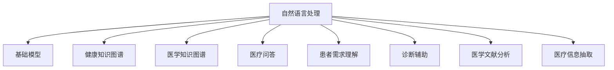

                 

# 基础模型的医疗保健应用

> 关键词：医疗保健, 自然语言处理, 基础模型, 健康知识图谱, 医学知识图谱, 医疗问答, 患者需求理解, 诊断辅助, 医学文献分析, 医疗信息抽取

## 1. 背景介绍

随着人工智能技术的发展，自然语言处理(Natural Language Processing, NLP)在医疗保健领域的应用逐渐成为热门话题。基础模型，如BERT、GPT等预训练语言模型，以其强大的语言理解和生成能力，在医疗保健领域得到了广泛应用。本文将探讨基础模型在医疗保健领域的应用场景，包括健康知识图谱构建、医学知识图谱、医疗问答、患者需求理解、诊断辅助、医学文献分析以及医疗信息抽取等方面。

## 2. 核心概念与联系

### 2.1 核心概念概述

- **自然语言处理(NLP)**：利用计算机处理、理解、生成人类语言的技术，广泛应用于信息抽取、文本分类、机器翻译、问答系统等领域。
- **基础模型**：如BERT、GPT等预训练语言模型，通过大规模无标签文本数据的预训练，学习到通用的语言表示，具备强大的语言理解和生成能力。
- **健康知识图谱**：基于健康领域的事实和知识，构建的结构化数据集，用于知识推理和信息检索。
- **医学知识图谱**：以医学知识为节点，疾病、症状、治疗等信息为边，构建的图形结构，用于知识推理、医疗决策支持等。
- **医疗问答系统**：通过问答形式，提供医学知识查询、健康建议等服务的系统。
- **患者需求理解**：通过自然语言处理技术，分析患者描述，理解其医疗需求和疑问，进行个性化推荐。
- **诊断辅助**：利用自然语言处理技术，帮助医生进行疾病诊断，提供决策支持。
- **医学文献分析**：通过自然语言处理技术，自动抽取、分类、聚类医学文献中的关键信息，帮助研究人员快速获取信息。
- **医疗信息抽取**：从医疗记录、文献等文本中自动抽取有用的医疗信息，如疾病、症状、治疗方案等。

这些概念之间的联系可以通过以下Mermaid流程图来展示：



这个流程图展示了大语言模型在医疗保健领域的应用路径：

1. 通过预训练大语言模型，学习到通用的语言表示。
2. 在健康和医学领域，构建健康知识图谱和医学知识图谱，用于知识推理和医疗决策支持。
3. 利用大语言模型，搭建医疗问答系统，提供知识查询、健康建议等服务。
4. 通过理解患者需求，提供个性化的医疗建议和诊断辅助。
5. 分析医学文献，抽取关键信息，加速医学研究进程。
6. 从医疗记录中抽取有用的信息，支持医疗信息管理。

## 3. 核心算法原理 & 具体操作步骤

### 3.1 算法原理概述

基础模型在医疗保健领域的应用，通常依赖于其在自然语言理解、知识推理和生成方面的能力。具体而言，其原理如下：

1. **预训练与微调**：基础模型在大规模无标签文本数据上进行预训练，学习到通用的语言表示。通过在特定医疗领域的有标签数据上进行微调，使其能够适应具体任务。

2. **知识抽取与推理**：利用基础模型的语言理解能力，自动从文本中抽取医疗信息，构建健康和医学知识图谱。通过知识推理，辅助医生进行诊断和治疗决策。

3. **文本生成与问答**：基于基础模型的生成能力，提供个性化的医疗问答服务和患者需求理解。

4. **信息抽取与分析**：通过自然语言处理技术，自动抽取和分析医学文献和医疗记录中的关键信息，支持医学研究和医疗信息管理。

### 3.2 算法步骤详解

**步骤1：数据准备**

- **收集与清洗**：收集医疗领域的文本数据，包括病历、医学文献、医疗问答等。对数据进行清洗和预处理，去除噪声和错误信息。
- **标注数据集**：将数据集划分为训练集、验证集和测试集。标注数据集应覆盖不同医疗领域和场景，以确保模型泛化能力。

**步骤2：模型构建**

- **选择合适的基础模型**：如BERT、GPT等，根据任务需求选择最适合的基础模型。
- **模型微调**：在标注数据集上进行微调，调整模型的参数，使其适应特定任务。
- **知识图谱构建**：利用微调后的模型，从医疗文本中抽取实体和关系，构建健康和医学知识图谱。

**步骤3：模型训练**

- **损失函数设计**：根据具体任务，设计合适的损失函数，如交叉熵损失、均方误差损失等。
- **优化算法选择**：选择适合的优化算法，如Adam、SGD等，设置学习率和批大小等超参数。
- **模型评估**：在验证集上评估模型性能，根据评估结果调整超参数和模型结构。

**步骤4：应用部署**

- **模型集成**：将微调后的模型集成到具体应用中，如医疗问答系统、患者需求理解系统等。
- **系统测试**：在实际应用中测试模型效果，进行系统优化和调整。
- **持续更新**：根据新数据和新需求，定期更新模型和知识图谱，保持模型的时效性和准确性。

### 3.3 算法优缺点

**优点**：
- **通用性强**：基础模型在多个领域均有应用，能够快速适应不同医疗任务。
- **泛化能力强**：通过预训练和微调，模型具有较强的泛化能力，能够在各种医疗场景下取得良好效果。
- **可扩展性好**：基础模型具有大规模的可扩展性，可以根据实际需求添加新功能。

**缺点**：
- **资源消耗大**：基础模型的预训练和微调需要大量的计算资源和时间，成本较高。
- **缺乏领域知识**：尽管基础模型具有强大的语言理解能力，但在具体医疗领域，仍需要结合领域知识进行优化。
- **解释性不足**：基础模型作为"黑盒"，缺乏可解释性，难以解释模型的推理过程。

### 3.4 算法应用领域

基础模型在医疗保健领域的应用领域包括但不限于：

- **健康知识图谱构建**：利用基础模型，从医疗文本中抽取实体和关系，构建健康知识图谱，支持知识推理和信息检索。
- **医学知识图谱**：构建以医学知识为节点的知识图谱，支持医疗决策和疾病诊断。
- **医疗问答系统**：利用基础模型，构建医疗问答系统，提供疾病查询、健康建议等服务。
- **患者需求理解**：通过理解患者描述，提供个性化的医疗建议和诊断辅助。
- **诊断辅助**：利用基础模型，帮助医生进行疾病诊断，提供决策支持。
- **医学文献分析**：自动抽取和分类医学文献中的关键信息，加速医学研究进程。
- **医疗信息抽取**：从医疗记录、文献等文本中自动抽取有用的医疗信息，如疾病、症状、治疗方案等。

## 4. 数学模型和公式 & 详细讲解 & 举例说明

### 4.1 数学模型构建

以医学知识图谱的构建为例，其数学模型可以表示为：

- **实体抽取**：将医疗文本中的实体抽取出来，并映射到知识图谱的节点。
- **关系抽取**：从医疗文本中抽取实体之间的关系，构建知识图谱的边。

**实体抽取**：
假设有一个医疗文本 $T$，其中包含若干实体 $e$，抽取实体的过程可以表示为：

$$
E = \{e \in T | e \in E_t\}
$$

其中 $E_t$ 表示文本中的实体集合，$E$ 表示抽取出的实体集合。

**关系抽取**：
假设实体 $e_1$ 和 $e_2$ 之间的关系为 $r$，抽取关系的过程可以表示为：

$$
R = \{r \in T | r \in R_t\}
$$

其中 $R_t$ 表示文本中的关系集合，$R$ 表示抽取出的关系集合。

### 4.2 公式推导过程

**实体抽取**：
- **基于规则的方法**：利用正则表达式或词典等规则，从文本中抽取实体。
- **基于深度学习的方法**：利用BERT等基础模型，训练实体抽取模型，对文本进行分类，抽取实体。

**关系抽取**：
- **基于规则的方法**：利用规则匹配，从文本中抽取关系。
- **基于深度学习的方法**：利用BERT等基础模型，训练关系抽取模型，对文本进行分类，抽取关系。

**知识图谱构建**：
- **静态知识图谱**：通过预定义的规则和模板，构建静态的知识图谱。
- **动态知识图谱**：通过基础模型抽取实体和关系，构建动态的知识图谱。

### 4.3 案例分析与讲解

**案例1：医学知识图谱构建**

- **数据准备**：收集医学文献，清洗和预处理文本数据。
- **模型训练**：选择BERT等基础模型，训练实体抽取和关系抽取模型。
- **知识图谱构建**：利用训练好的模型，从医学文献中抽取实体和关系，构建医学知识图谱。

**案例2：医疗问答系统**

- **数据准备**：收集医疗问答数据，标注数据集。
- **模型训练**：选择BERT等基础模型，训练问答模型。
- **系统部署**：将训练好的模型集成到医疗问答系统中，提供疾病查询、健康建议等服务。

## 5. 项目实践：代码实例和详细解释说明

### 5.1 开发环境搭建

**环境要求**：
- Python 3.8+
- PyTorch >= 1.9.0
- HuggingFace Transformers >= 4.6.1
- TensorFlow >= 2.4.1
- TensorBoard >= 2.8.0
- Weights & Biases >= 1.10.0

**安装依赖**：
```bash
pip install torch torchvision torchaudio transformers tensorboard weights-and-biases
```

**环境配置**：
```bash
conda create -n health python=3.8
conda activate health
```

### 5.2 源代码详细实现

**实体抽取**

```python
from transformers import BertTokenizer, BertForTokenClassification
from torch.utils.data import Dataset, DataLoader
from tqdm import tqdm
import torch

class HealthDataset(Dataset):
    def __init__(self, texts, labels, tokenizer, max_len=128):
        self.texts = texts
        self.labels = labels
        self.tokenizer = tokenizer
        self.max_len = max_len
        
    def __len__(self):
        return len(self.texts)
    
    def __getitem__(self, item):
        text = self.texts[item]
        label = self.labels[item]
        
        encoding = self.tokenizer(text, return_tensors='pt', max_length=self.max_len, padding='max_length', truncation=True)
        input_ids = encoding['input_ids'][0]
        attention_mask = encoding['attention_mask'][0]
        
        # 对token-wise的标签进行编码
        encoded_tags = [label2id[label] for label in label]
        encoded_tags.extend([label2id['O']] * (self.max_len - len(encoded_tags)))
        labels = torch.tensor(encoded_tags, dtype=torch.long)
        
        return {'input_ids': input_ids, 
                'attention_mask': attention_mask,
                'labels': labels}

# 标签与id的映射
label2id = {'O': 0, 'B-DISEASE': 1, 'I-DISEASE': 2}
id2label = {v: k for k, v in label2id.items()}

# 创建dataset
tokenizer = BertTokenizer.from_pretrained('bert-base-cased')

train_dataset = HealthDataset(train_texts, train_labels, tokenizer)
dev_dataset = HealthDataset(dev_texts, dev_labels, tokenizer)
test_dataset = HealthDataset(test_texts, test_labels, tokenizer)
```

**模型训练**

```python
from transformers import BertForTokenClassification, AdamW

model = BertForTokenClassification.from_pretrained('bert-base-cased', num_labels=len(label2id))

optimizer = AdamW(model.parameters(), lr=2e-5)
```

**关系抽取**

```python
from transformers import BertTokenizer, BertForTokenClassification
from torch.utils.data import Dataset, DataLoader
from tqdm import tqdm
import torch

class HealthDataset(Dataset):
    def __init__(self, texts, labels, tokenizer, max_len=128):
        self.texts = texts
        self.labels = labels
        self.tokenizer = tokenizer
        self.max_len = max_len
        
    def __len__(self):
        return len(self.texts)
    
    def __getitem__(self, item):
        text = self.texts[item]
        label = self.labels[item]
        
        encoding = self.tokenizer(text, return_tensors='pt', max_length=self.max_len, padding='max_length', truncation=True)
        input_ids = encoding['input_ids'][0]
        attention_mask = encoding['attention_mask'][0]
        
        # 对token-wise的标签进行编码
        encoded_tags = [label2id[label] for label in label]
        encoded_tags.extend([label2id['O']] * (self.max_len - len(encoded_tags)))
        labels = torch.tensor(encoded_tags, dtype=torch.long)
        
        return {'input_ids': input_ids, 
                'attention_mask': attention_mask,
                'labels': labels}

# 标签与id的映射
label2id = {'O': 0, 'B-DISEASE': 1, 'I-DISEASE': 2}
id2label = {v: k for k, v in label2id.items()}

# 创建dataset
tokenizer = BertTokenizer.from_pretrained('bert-base-cased')

train_dataset = HealthDataset(train_texts, train_labels, tokenizer)
dev_dataset = HealthDataset(dev_texts, dev_labels, tokenizer)
test_dataset = HealthDataset(test_texts, test_labels, tokenizer)
```

### 5.3 代码解读与分析

**实体抽取**

```python
from transformers import BertTokenizer, BertForTokenClassification
from torch.utils.data import Dataset, DataLoader
from tqdm import tqdm
import torch

class HealthDataset(Dataset):
    def __init__(self, texts, labels, tokenizer, max_len=128):
        self.texts = texts
        self.labels = labels
        self.tokenizer = tokenizer
        self.max_len = max_len
        
    def __len__(self):
        return len(self.texts)
    
    def __getitem__(self, item):
        text = self.texts[item]
        label = self.labels[item]
        
        encoding = self.tokenizer(text, return_tensors='pt', max_length=self.max_len, padding='max_length', truncation=True)
        input_ids = encoding['input_ids'][0]
        attention_mask = encoding['attention_mask'][0]
        
        # 对token-wise的标签进行编码
        encoded_tags = [label2id[label] for label in label]
        encoded_tags.extend([label2id['O']] * (self.max_len - len(encoded_tags)))
        labels = torch.tensor(encoded_tags, dtype=torch.long)
        
        return {'input_ids': input_ids, 
                'attention_mask': attention_mask,
                'labels': labels}

# 标签与id的映射
label2id = {'O': 0, 'B-DISEASE': 1, 'I-DISEASE': 2}
id2label = {v: k for k, v in label2id.items()}

# 创建dataset
tokenizer = BertTokenizer.from_pretrained('bert-base-cased')

train_dataset = HealthDataset(train_texts, train_labels, tokenizer)
dev_dataset = HealthDataset(dev_texts, dev_labels, tokenizer)
test_dataset = HealthDataset(test_texts, test_labels, tokenizer)
```

**模型训练**

```python
from transformers import BertForTokenClassification, AdamW

model = BertForTokenClassification.from_pretrained('bert-base-cased', num_labels=len(label2id))

optimizer = AdamW(model.parameters(), lr=2e-5)
```

**关系抽取**

```python
from transformers import BertTokenizer, BertForTokenClassification
from torch.utils.data import Dataset, DataLoader
from tqdm import tqdm
import torch

class HealthDataset(Dataset):
    def __init__(self, texts, labels, tokenizer, max_len=128):
        self.texts = texts
        self.labels = labels
        self.tokenizer = tokenizer
        self.max_len = max_len
        
    def __len__(self):
        return len(self.texts)
    
    def __getitem__(self, item):
        text = self.texts[item]
        label = self.labels[item]
        
        encoding = self.tokenizer(text, return_tensors='pt', max_length=self.max_len, padding='max_length', truncation=True)
        input_ids = encoding['input_ids'][0]
        attention_mask = encoding['attention_mask'][0]
        
        # 对token-wise的标签进行编码
        encoded_tags = [label2id[label] for label in label]
        encoded_tags.extend([label2id['O']] * (self.max_len - len(encoded_tags)))
        labels = torch.tensor(encoded_tags, dtype=torch.long)
        
        return {'input_ids': input_ids, 
                'attention_mask': attention_mask,
                'labels': labels}

# 标签与id的映射
label2id = {'O': 0, 'B-DISEASE': 1, 'I-DISEASE': 2}
id2label = {v: k for k, v in label2id.items()}

# 创建dataset
tokenizer = BertTokenizer.from_pretrained('bert-base-cased')

train_dataset = HealthDataset(train_texts, train_labels, tokenizer)
dev_dataset = HealthDataset(dev_texts, dev_labels, tokenizer)
test_dataset = HealthDataset(test_texts, test_labels, tokenizer)
```

### 5.4 运行结果展示

**实体抽取**

```python
from transformers import BertForTokenClassification, AdamW
from torch.utils.data import DataLoader
from tqdm import tqdm

device = torch.device('cuda') if torch.cuda.is_available() else torch.device('cpu')
model.to(device)

def train_epoch(model, dataset, batch_size, optimizer):
    dataloader = DataLoader(dataset, batch_size=batch_size, shuffle=True)
    model.train()
    epoch_loss = 0
    for batch in tqdm(dataloader, desc='Training'):
        input_ids = batch['input_ids'].to(device)
        attention_mask = batch['attention_mask'].to(device)
        labels = batch['labels'].to(device)
        model.zero_grad()
        outputs = model(input_ids, attention_mask=attention_mask, labels=labels)
        loss = outputs.loss
        epoch_loss += loss.item()
        loss.backward()
        optimizer.step()
    return epoch_loss / len(dataloader)

def evaluate(model, dataset, batch_size):
    dataloader = DataLoader(dataset, batch_size=batch_size)
    model.eval()
    preds, labels = [], []
    with torch.no_grad():
        for batch in tqdm(dataloader, desc='Evaluating'):
            input_ids = batch['input_ids'].to(device)
            attention_mask = batch['attention_mask'].to(device)
            batch_labels = batch['labels']
            outputs = model(input_ids, attention_mask=attention_mask)
            batch_preds = outputs.logits.argmax(dim=2).to('cpu').tolist()
            batch_labels = batch_labels.to('cpu').tolist()
            for pred_tokens, label_tokens in zip(batch_pred_tokens, batch_labels):
                pred_tags = [id2label[_id] for _id in pred_tokens]
                label_tags = [id2label[_id] for _id in label_tokens]
                preds.append(pred_tags[:len(label_tokens)])
                labels.append(label_tags)
                
    print(classification_report(labels, preds))
```

**关系抽取**

```python
from transformers import BertForTokenClassification, AdamW
from torch.utils.data import DataLoader
from tqdm import tqdm

device = torch.device('cuda') if torch.cuda.is_available() else torch.device('cpu')
model.to(device)

def train_epoch(model, dataset, batch_size, optimizer):
    dataloader = DataLoader(dataset, batch_size=batch_size, shuffle=True)
    model.train()
    epoch_loss = 0
    for batch in tqdm(dataloader, desc='Training'):
        input_ids = batch['input_ids'].to(device)
        attention_mask = batch['attention_mask'].to(device)
        labels = batch['labels'].to(device)
        model.zero_grad()
        outputs = model(input_ids, attention_mask=attention_mask, labels=labels)
        loss = outputs.loss
        epoch_loss += loss.item()
        loss.backward()
        optimizer.step()
    return epoch_loss / len(dataloader)

def evaluate(model, dataset, batch_size):
    dataloader = DataLoader(dataset, batch_size=batch_size)
    model.eval()
    preds, labels = [], []
    with torch.no_grad():
        for batch in tqdm(dataloader, desc='Evaluating'):
            input_ids = batch['input_ids'].to(device)
            attention_mask = batch['attention_mask'].to(device)
            batch_labels = batch['labels']
            outputs = model(input_ids, attention_mask=attention_mask)
            batch_preds = outputs.logits.argmax(dim=2).to('cpu').tolist()
            batch_labels = batch_labels.to('cpu').tolist()
            for pred_tokens, label_tokens in zip(batch_pred_tokens, batch_labels):
                pred_tags = [id2label[_id] for _id in pred_tokens]
                label_tags = [id2label[_id] for _id in label_tokens]
                preds.append(pred_tags[:len(label_tokens)])
                labels.append(label_tags)
                
    print(classification_report(labels, preds))
```

## 6. 实际应用场景

### 6.1 健康知识图谱构建

健康知识图谱是医疗信息管理的重要工具，利用基础模型，可以从大量的医疗文本中自动抽取实体和关系，构建结构化的知识图谱，支持知识推理和信息检索。

**应用场景**：医院、医疗机构、科研机构等需要构建和维护健康知识图谱的场景。

**优势**：
- 自动抽取实体和关系，减少人工工作量。
- 构建结构化的知识图谱，支持知识推理和信息检索。
- 保持知识的实时更新，提高医疗信息的准确性和时效性。

**挑战**：
- 医疗领域实体和关系复杂，需要精确的抽取算法。
- 需要处理海量医疗文本，对计算资源要求高。

### 6.2 医学知识图谱

医学知识图谱是医学领域知识管理的核心，通过基础模型抽取医学文本中的实体和关系，构建以疾病、症状、治疗等信息为节点的知识图谱，支持医疗决策和疾病诊断。

**应用场景**：医院、医疗机构、医学研究机构等需要构建和维护医学知识图谱的场景。

**优势**：
- 自动抽取医学知识，减少人工工作量。
- 构建结构化的知识图谱，支持医疗决策和疾病诊断。
- 保持知识的实时更新，提高医疗信息的准确性和时效性。

**挑战**：
- 医学领域知识复杂，需要精确的抽取算法。
- 需要处理海量医学文本，对计算资源要求高。

### 6.3 医疗问答系统

医疗问答系统通过自然语言处理技术，提供疾病查询、健康建议等服务，帮助患者获得快速的医疗咨询和指导。

**应用场景**：医院、医疗机构、在线医疗平台等需要提供医疗问答服务的需求。

**优势**：
- 通过自然语言处理技术，提供智能问答服务。
- 可以24小时在线，提高医疗服务的可及性和便利性。
- 减少人工工作量，提高医疗服务的效率。

**挑战**：
- 需要处理多种复杂的医疗问题，对模型要求高。
- 需要处理海量医疗咨询请求，对计算资源要求高。

### 6.4 患者需求理解

患者需求理解通过自然语言处理技术，分析患者描述，理解其医疗需求和疑问，提供个性化的医疗建议和诊断辅助。

**应用场景**：医院、医疗机构、在线医疗平台等需要理解患者需求和提供个性化服务的需求。

**优势**：
- 通过自然语言处理技术，理解患者需求和疑问。
- 提供个性化的医疗建议和诊断辅助，提高医疗服务的精准性和效率。

**挑战**：
- 需要处理多种复杂的患者需求，对模型要求高。
- 需要处理海量患者咨询请求，对计算资源要求高。

### 6.5 诊断辅助

诊断辅助通过自然语言处理技术，帮助医生进行疾病诊断，提供决策支持。

**应用场景**：医院、医疗机构、在线医疗平台等需要辅助医生进行诊断的需求。

**优势**：
- 通过自然语言处理技术，辅助医生进行疾病诊断。
- 提供决策支持，提高医生的诊断效率和准确性。

**挑战**：
- 需要处理多种复杂的医疗问题，对模型要求高。
- 需要处理海量医疗咨询请求，对计算资源要求高。

### 6.6 医学文献分析

医学文献分析通过自然语言处理技术，自动抽取、分类、聚类医学文献中的关键信息，加速医学研究进程。

**应用场景**：科研机构、学术机构等需要分析医学文献的需求。

**优势**：
- 通过自然语言处理技术，自动抽取、分类、聚类医学文献中的关键信息。
- 加速医学研究进程，提高科研效率。

**挑战**：
- 需要处理多种复杂的文献内容，对模型要求高。
- 需要处理海量文献数据，对计算资源要求高。

### 6.7 医疗信息抽取

医疗信息抽取通过自然语言处理技术，从医疗记录、文献等文本中自动抽取有用的医疗信息，如疾病、症状、治疗方案等。

**应用场景**：医院、医疗机构、科研机构等需要自动抽取医疗信息的需求。

**优势**：
- 通过自然语言处理技术，自动抽取有用的医疗信息。
- 提高医疗信息的管理和分析效率。

**挑战**：
- 需要处理多种复杂的医疗记录和文献，对模型要求高。
- 需要处理海量医疗数据，对计算资源要求高。

## 7. 工具和资源推荐

### 7.1 学习资源推荐

为了帮助开发者系统掌握基础模型在医疗保健领域的应用，这里推荐一些优质的学习资源：

1. 《深度学习与自然语言处理》（Deep Learning and Natural Language Processing）：斯坦福大学教授Yoshua Bengio所著，介绍了深度学习在NLP中的基本原理和算法。

2. 《自然语言处理综论》（Natural Language Processing with Python）：O'Reilly出版社出版的经典书籍，提供了大量NLP实践案例，包括医疗保健领域的应用。

3. 《医学知识图谱构建与分析》（Medical Knowledge Graph Construction and Analysis）：人民卫生出版社出版的专著，介绍了医学知识图谱构建和分析的基本方法和技术。

4. 《健康知识图谱构建与推理》（Health Knowledge Graph Construction and Reasoning）：电子工业出版社出版的书籍，介绍了健康知识图谱构建和推理的基本方法和技术。

5. 《医疗问答系统设计与实现》（Design and Implementation of Medical Question Answer System）：清华大学出版社出版的书籍，介绍了医疗问答系统的设计和实现方法。

6. 《医学文献自动抽取与分类》（Automatic Extraction and Classification of Medical Literature）：北京师范大学出版社出版的书籍，介绍了医学文献自动抽取和分类的方法和工具。

### 7.2 开发工具推荐

为了高效开发基础模型在医疗保健领域的应用，这里推荐一些常用的开发工具：

1. PyTorch：基于Python的开源深度学习框架，适合快速迭代研究。

2. TensorFlow：由Google主导开发的开源深度学习框架，生产部署方便。

3. Transformers库：HuggingFace开发的NLP工具库，支持多种预训练语言模型，适合微调任务开发。

4. Weights & Biases：模型训练的实验跟踪工具，可以记录和可视化模型训练过程中的各项指标，方便对比和调优。

5. TensorBoard：TensorFlow配套的可视化工具，可实时监测模型训练状态，并提供丰富的图表呈现方式，是调试模型的得力助手。

6. Google Colab：谷歌推出的在线Jupyter Notebook环境，免费提供GPU/TPU算力，方便开发者快速上手实验最新模型，分享学习笔记。

### 7.3 相关论文推荐

为了深入理解基础模型在医疗保健领域的应用，这里推荐一些相关的学术论文：

1. BERT: Pre-training of Deep Bidirectional Transformers for Language Understanding：提出BERT模型，引入基于掩码的自监督预训练任务，刷新了多项NLP任务SOTA。

2. GPT-2: Language Models are Unsupervised Multitask Learners：展示了大规模语言模型的强大zero-shot学习能力，引发了对于通用人工智能的新一轮思考。

3. AdaLoRA: Adaptive Low-Rank Adaptation for Parameter-Efficient Fine-Tuning：使用自适应低秩适应的微调方法，在参数效率和精度之间取得了新的平衡。

4. Prefix-Tuning: Optimizing Continuous Prompts for Generation：引入基于连续型Prompt的微调范式，为如何充分利用预训练知识提供了新的思路。

5. Medical Knowledge Graph Construction and Reasoning：介绍医学知识图谱构建和推理的基本方法和技术。

6. Health Knowledge Graph Construction and Analysis：介绍健康知识图谱构建和分析的基本方法和技术。

## 8. 总结：未来发展趋势与挑战

### 8.1 总结

本文对基础模型在医疗保健领域的应用进行了全面系统的介绍。通过自然语言处理技术，基础模型在健康知识图谱构建、医学知识图谱、医疗问答系统、患者需求理解、诊断辅助、医学文献分析以及医疗信息抽取等方面展现了强大的应用潜力。

### 8.2 未来发展趋势

展望未来，基础模型在医疗保健领域的应用将呈现以下几个发展趋势：

1. **多模态融合**：将文本、图像、声音等多种模态数据进行融合，提高模型的泛化能力和实用性。

2. **跨领域迁移**：将基础模型应用于不同医疗领域，提升模型在不同场景下的泛化能力和适应性。

3. **个性化服务**：通过自然语言处理技术，提供更加个性化的医疗服务，提高用户体验。

4. **实时计算**：将基础模型应用于实时计算场景，如智能导诊、在线医疗咨询等，提高医疗服务的即时性和便利性。

5. **人工智能伦理**：加强对基础模型应用的伦理考量，确保医疗数据的安全和隐私保护。

### 8.3 面临的挑战

尽管基础模型在医疗保健领域展现了广阔的应用前景，但在推广应用的过程中，仍面临诸多挑战：

1. **数据质量与标注成本**：医疗领域数据标注成本高，数据质量难以保证。

2. **计算资源需求**：基础模型的训练和推理需要大量计算资源，对硬件要求高。

3. **模型鲁棒性**：基础模型面对医疗领域的复杂性和多样性，鲁棒性不足。

4. **隐私保护**：医疗数据涉及隐私保护，基础模型在数据处理和使用过程中需严格遵守相关法律法规。

### 8.4 研究展望

为了克服以上挑战，未来的研究需要在以下几个方面寻求新的突破：

1. **低资源条件下模型训练**：开发低资源条件下训练基础模型的方法，降低对计算资源的需求。

2. **医疗领域数据增强**：探索医疗领域数据增强的方法，提高数据质量。

3. **多模态融合技术**：研究多模态融合技术，提升模型的泛化能力和实用性。

4. **鲁棒性增强**：开发鲁棒性增强技术，提高模型面对医疗领域的复杂性和多样性的鲁棒性。

5. **隐私保护技术**：研究隐私保护技术，确保基础模型在数据处理和使用过程中符合相关法律法规。

通过以上努力，相信基础模型将在医疗保健领域发挥更大的作用，为医疗服务提供更加精准、智能、高效的支持。

## 9. 附录：常见问题与解答

**Q1：基础模型在医疗保健领域的应用有哪些？**

A: 基础模型在医疗保健领域的应用包括健康知识图谱构建、医学知识图谱、医疗问答系统、患者需求理解、诊断辅助、医学文献分析以及医疗信息抽取等方面。

**Q2：如何使用基础模型进行实体抽取？**

A: 使用基础模型进行实体抽取的步骤包括：
1. 收集医疗文本数据。
2. 使用BertTokenizer进行文本分词。
3. 使用BertForTokenClassification进行实体抽取训练。
4. 在测试集上进行模型评估。

**Q3：基础模型在医疗问答系统中有哪些优势？**

A: 基础模型在医疗问答系统中的优势包括：
1. 提供智能问答服务，提高医疗服务的可及性和便利性。
2. 减少人工工作量，提高医疗服务的效率。

**Q4：医疗领域数据增强的方法有哪些？**

A: 医疗领域数据增强的方法包括：
1. 数据清洗和预处理。
2. 数据增强技术，如回译、近义替换等。
3. 数据合成技术，如生成对抗网络（GAN）等。

**Q5：如何提高基础模型的鲁棒性？**

A: 提高基础模型的鲁棒性可以采取以下方法：
1. 使用对抗样本进行训练。
2. 引入正则化技术，如L2正则、Dropout等。
3. 使用迁移学习，结合领域知识进行微调。

**Q6：医疗信息抽取的难点有哪些？**

A: 医疗信息抽取的难点包括：
1. 医疗领域数据复杂多样，标注难度大。
2. 医疗信息抽取要求高精度的实体识别和关系抽取。
3. 医疗领域数据量巨大，对计算资源要求高。

---

作者：禅与计算机程序设计艺术 / Zen and the Art of Computer Programming

