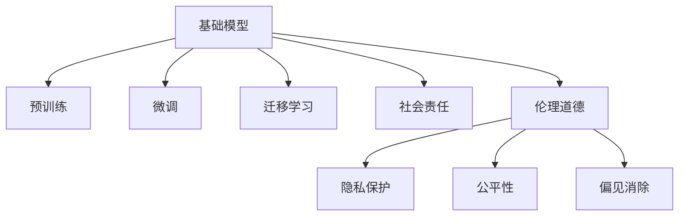

                 

# 基础模型的技术研究与社会责任

在人工智能（AI）时代，基础模型是推动技术创新的核心引擎。它们不仅是算法优化、工程实践的结晶，更是社会责任、伦理道德的承担者。本文将深入探讨基础模型的技术研究，并揭示其在社会责任方面的使命与挑战。

## 1. 背景介绍

### 1.1 问题由来

随着深度学习技术的不断成熟，基础模型如BERT、GPT等，已经在自然语言处理（NLP）、计算机视觉、语音识别等领域取得了突破性进展。这些模型不仅提升了数据处理和分析的能力，更在推动自动化、个性化服务的发展上发挥了重要作用。然而，基础模型的广泛应用也带来了新的挑战，尤其是如何在提升技术能力的同时，兼顾社会责任、维护伦理道德。

### 1.2 问题核心关键点

基础模型面临的核心挑战在于：

- **技术能力的提升**：如何通过技术创新提升模型性能，解决复杂问题。
- **社会责任的履行**：如何在技术创新中兼顾社会利益，避免技术滥用。
- **伦理道德的维护**：如何在模型设计、训练和应用中，尊重和保护用户隐私、公平性。

## 2. 核心概念与联系

### 2.1 核心概念概述

- **基础模型（Foundation Models）**：指在大量无标签数据上预训练得到的通用模型，如BERT、GPT等。这些模型通过自监督学习任务学习通用的语言、视觉、声音表示。

- **预训练（Pre-training）**：指在大规模无标签数据上训练基础模型，学习通用的知识表示。

- **微调（Fine-tuning）**：指在预训练模型基础上，使用下游任务的少量标注数据进行有监督训练，调整模型以适应特定任务。

- **迁移学习（Transfer Learning）**：指将一个任务学到的知识迁移到另一个相关任务中。

- **社会责任（Social Responsibility）**：指技术开发者在模型开发和使用中，应考虑对社会的影响和贡献。

- **伦理道德（Ethics and Morality）**：指在技术应用中，应尊重个人隐私、确保数据公平、避免偏见和歧视。

这些概念之间相互联系，共同构成了基础模型的技术研究和应用框架。

### 2.2 核心概念原理和架构的 Mermaid 流程图



## 3. 核心算法原理 & 具体操作步骤

### 3.1 算法原理概述

基础模型的核心算法原理主要基于自监督学习和迁移学习的范式。通过在大规模无标签数据上进行预训练，学习通用的知识表示。预训练完成后，使用少量标注数据进行微调，适应下游任务的特定需求。此外，为了提升模型的公平性和可解释性，还需要在模型设计、训练和应用过程中，兼顾社会责任和伦理道德的考量。

### 3.2 算法步骤详解

1. **数据准备**：收集大规模无标签数据，用于基础模型的预训练。
2. **模型构建**：选择或设计基础模型架构，如Transformer、BERT等。
3. **预训练**：在大规模无标签数据上训练基础模型，学习通用的知识表示。
4. **微调**：在少量标注数据上，使用微调技术调整模型参数，适应下游任务的特定需求。
5. **社会责任与伦理道德考量**：在模型设计、训练和应用中，确保用户隐私保护、数据公平、偏见消除等。

### 3.3 算法优缺点

**优点**：

- **通用性**：基础模型在大量无标签数据上进行预训练，学习到通用的知识表示，可以适应多种下游任务。
- **高效性**：预训练和微调的过程可以在大规模数据集上进行，快速提升模型性能。
- **可解释性**：通过模型解释技术，可以揭示模型内部决策机制，增加透明度。

**缺点**：

- **数据依赖**：预训练和微调过程需要大量数据，数据获取和处理成本高。
- **过拟合风险**：在少量标注数据上进行微调，容易发生过拟合。
- **社会责任问题**：模型在应用中可能产生偏见、侵害隐私等社会问题。

### 3.4 算法应用领域

基础模型在NLP、计算机视觉、语音识别等多个领域都有广泛应用，例如：

- **NLP**：文本分类、情感分析、问答系统、机器翻译等。
- **计算机视觉**：图像识别、对象检测、图像生成等。
- **语音识别**：语音转文字、语音合成、情感分析等。

## 4. 数学模型和公式 & 详细讲解

### 4.1 数学模型构建

基础模型通常基于Transformer架构，使用自监督学习任务进行预训练。以BERT为例，其预训练任务包括掩码语言模型（Masked Language Model, MLM）和下一句预测（Next Sentence Prediction, NSP）。

- **掩码语言模型**：在输入序列中随机掩盖部分单词，模型需预测被掩盖的单词。
- **下一句预测**：随机选择两个连续的句子，模型需预测它们是否为连续的两句。

### 4.2 公式推导过程

对于掩码语言模型，公式如下：

$$
\mathcal{L}_{MLM} = -\frac{1}{N} \sum_{i=1}^{N} \sum_{k=1}^{T} \log P(\hat{x}_i^{k})
$$

其中，$P(\hat{x}_i^{k})$ 为模型预测被掩盖的单词的概率，$T$ 为输入序列长度。

### 4.3 案例分析与讲解

以BERT为例，其微调过程通常使用下游任务的标注数据进行有监督训练。例如，在情感分析任务中，使用标注好的电影评论作为微调数据。模型输入为评论文本，输出为目标情感标签。通过微调，模型能够学习到评论情感与特定词语之间的关系，提升情感分类的准确性。

## 5. 项目实践：代码实例和详细解释说明

### 5.1 开发环境搭建

1. **安装Python**：在操作系统上安装Python 3.x版本。
2. **安装TensorFlow和Keras**：使用pip安装TensorFlow和Keras库。
3. **安装BERT模型**：使用Hugging Face的transformers库，下载预训练的BERT模型。

### 5.2 源代码详细实现

```python
from transformers import BertTokenizer, TFBertForSequenceClassification
import tensorflow as tf

# 加载预训练模型和分词器
tokenizer = BertTokenizer.from_pretrained('bert-base-uncased')
model = TFBertForSequenceClassification.from_pretrained('bert-base-uncased', num_labels=2)

# 准备训练数据
train_data = ['This movie is good.', 'This movie is bad.']
train_labels = [1, 0]

# 将文本转换为token ids
train_encodings = tokenizer(train_data, truncation=True, padding='max_length', max_length=512)

# 定义训练数据集
train_dataset = tf.data.Dataset.from_tensor_slices((
    dict(train_encodings),
    train_labels))
train_dataset = train_dataset.batch(16).shuffle(100).repeat()

# 定义优化器和损失函数
optimizer = tf.keras.optimizers.Adam(learning_rate=3e-5)
loss_fn = tf.keras.losses.SparseCategoricalCrossentropy(from_logits=True)

# 定义模型训练函数
@tf.function
def train_step(text, labels):
    with tf.GradientTape() as tape:
        outputs = model(text, labels=labels, training=True)
        loss = loss_fn(labels, outputs.logits)
    gradients = tape.gradient(loss, model.trainable_variables)
    optimizer.apply_gradients(zip(gradients, model.trainable_variables))
    return loss

# 训练模型
for epoch in range(5):
    epoch_loss = 0
    for batch in train_dataset:
        text, labels = batch['input_ids'], batch['labels']
        loss = train_step(text, labels)
        epoch_loss += loss
    print(f"Epoch {epoch+1}, train loss: {epoch_loss/len(train_dataset)}")
```

### 5.3 代码解读与分析

- **分词器（Tokenizer）**：将输入文本转换为模型可以处理的token ids，并进行padding和truncation。
- **模型加载**：使用Hugging Face的transformers库，加载预训练的BERT模型。
- **训练数据准备**：将文本转换为token ids，并定义训练数据集。
- **优化器和损失函数**：选择合适的优化器和损失函数，用于模型训练和评估。
- **训练函数**：定义训练函数，计算损失并进行反向传播，更新模型参数。

### 5.4 运行结果展示

模型训练结束后，可以对新的未见过的评论进行情感分类，评估模型的性能。

## 6. 实际应用场景

### 6.1 智能客服系统

基础模型在智能客服系统中发挥重要作用。通过对大量客服对话数据的预训练，模型能够理解用户的意图，并自动生成回复。这不仅提升了客服效率，还减少了人力成本。

### 6.2 金融舆情监测

基础模型在金融舆情监测中也有广泛应用。通过对金融新闻、评论等文本数据的预训练，模型能够快速识别市场趋势，预测股票价格波动，为金融决策提供数据支持。

### 6.3 个性化推荐系统

基础模型在个性化推荐系统中，通过对用户行为数据的预训练，能够理解用户偏好，推荐合适的产品或服务。这不仅提升了用户体验，还提高了销售转化率。

### 6.4 未来应用展望

未来，基础模型将在更多领域得到应用，如智慧医疗、智能制造、智慧城市等。通过预训练和微调，模型能够解决实际问题，推动各行业的数字化转型升级。

## 7. 工具和资源推荐

### 7.1 学习资源推荐

- **《深度学习》课程**：斯坦福大学开设的深度学习课程，涵盖基础模型和深度学习的基本概念。
- **《自然语言处理综述》**：学术论文综述，介绍了基础模型的前沿研究进展。
- **TensorFlow官方文档**：提供基础模型和深度学习的详细教程和样例。

### 7.2 开发工具推荐

- **TensorFlow**：支持基础模型和深度学习的开源框架，易于集成和部署。
- **Keras**：提供简单易用的API，方便快速构建和训练模型。
- **Jupyter Notebook**：支持交互式编程，方便模型训练和调试。

### 7.3 相关论文推荐

- **BERT: Pre-training of Deep Bidirectional Transformers for Language Understanding**：BERT模型及其预训练任务的论文。
- **Attention is All You Need**：Transformer架构的论文，奠定了基础模型架构的基础。
- **Improving Language Understanding by Generative Pre-training**：GPT模型及其预训练任务的论文，展示了大规模语言模型的潜力。

## 8. 总结：未来发展趋势与挑战

### 8.1 研究成果总结

基础模型在提升技术能力的同时，也面临社会责任和伦理道德的挑战。通过技术创新和社会治理的结合，模型能够在提升性能的同时，保障用户隐私、确保数据公平、避免偏见和歧视。

### 8.2 未来发展趋势

未来，基础模型将在提升性能的同时，更多地关注社会责任和伦理道德。通过多模态数据的整合、跨领域的迁移学习、更高效的模型压缩等技术，基础模型将更好地服务于社会。

### 8.3 面临的挑战

- **数据隐私保护**：如何在模型训练和使用中保护用户隐私，防止数据滥用。
- **数据公平性**：如何确保不同用户群体获得公平的模型输出，避免偏见和歧视。
- **模型透明性**：如何增加模型的可解释性，让用户理解模型决策机制。

### 8.4 研究展望

- **多模态数据的整合**：将视觉、语音、文本等多模态数据进行融合，提升模型的综合能力。
- **跨领域的迁移学习**：将基础模型应用于更多领域的任务，提升模型的通用性。
- **模型透明性和公平性**：提升模型的可解释性，确保模型的公平性。

## 9. 附录：常见问题与解答

**Q1：基础模型为何需要预训练？**

A: 预训练通过大规模无标签数据训练模型，学习通用的知识表示，能够提升模型在不同任务上的性能。

**Q2：基础模型在应用中如何避免偏见？**

A: 在模型设计、训练和应用中，应确保数据公平、消除偏见，避免歧视性的输出。

**Q3：基础模型的社会责任体现在哪些方面？**

A: 社会责任体现在保护用户隐私、确保数据公平、避免偏见和歧视等方面。

**Q4：基础模型如何兼顾技术能力和社会责任？**

A: 在模型设计和应用中，应兼顾技术能力和社会责任，确保模型在提升性能的同时，不会带来负面影响。

作者：禅与计算机程序设计艺术 / Zen and the Art of Computer Programming

