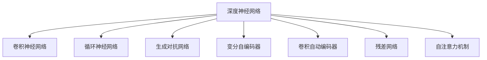

                 

# 基础模型的深度神经网络

## 1. 背景介绍

### 1.1 问题由来
近年来，深度学习技术迅猛发展，深度神经网络（Deep Neural Networks, DNNs）在图像、语音、自然语言处理等领域取得显著进展。然而，对于复杂的基础模型设计，传统的浅层神经网络往往难以胜任。基于此，本文聚焦于深度神经网络的基础架构设计，分析其核心原理和应用实例，期望对大模型设计、优化和应用提供更全面的指导。

### 1.2 问题核心关键点
基础模型的深度神经网络设计问题，核心在于构建一个层次化、可解释性强、泛化能力强的模型。一般而言，它包括以下关键点：
- 网络层数的选择：需根据任务复杂度和计算资源设计合理的网络深度。
- 网络结构的优化：需根据特征分布和任务类型优化网络结构，如卷积层、池化层、全连接层等。
- 激活函数的选取：需选择合适的激活函数，使得网络能够在非线性映射中保持输入输出之间的非线性关系。
- 正则化技术的应用：需结合网络结构，设计合理的正则化技术，避免过拟合，提高模型泛化能力。
- 损失函数的设计：需根据任务类型，选择适合的损失函数，用于衡量模型输出与真实标签的差异。
- 优化算法的选择：需根据网络复杂度选择合适的优化算法，使得网络能够高效地进行参数更新。
- 训练数据的处理：需根据数据分布和特征形式设计合理的数据处理技术，提高数据输入模型的效率和准确性。

## 2. 核心概念与联系

### 2.1 核心概念概述

为更好地理解深度神经网络的基础架构设计，本节将介绍几个密切相关的核心概念：

- 深度神经网络（Deep Neural Networks, DNNs）：一种通过多层次的神经元构建的神经网络，用于解决复杂模式识别问题。
- 卷积神经网络（Convolutional Neural Networks, CNNs）：一种常用于图像处理和计算机视觉的深度神经网络，利用卷积层和池化层提取空间特征。
- 循环神经网络（Recurrent Neural Networks, RNNs）：一种常用于序列数据分析的深度神经网络，利用循环层捕捉时间序列信息。
- 生成对抗网络（Generative Adversarial Networks, GANs）：一种生成模型，通过对抗训练方式，生成高质量的样本数据。
- 变分自编码器（Variational Autoencoders, VAEs）：一种生成模型，通过最小化重构误差的方式，学习数据的潜在表示。
- 卷积自动编码器（Convolutional Autoencoder, CAE）：一种用于降维和去噪的深度神经网络。
- 残差网络（Residual Networks, ResNets）：一种利用残差连接技术，显著提高深度神经网络训练稳定性和收敛速度的网络结构。
- 自注意力机制（Self-Attention Mechanism）：一种在Transformer等网络中广泛应用的技术，用于捕捉序列间的多模态关系。

这些核心概念之间的逻辑关系可以通过以下Mermaid流程图来展示：



这个流程图展示了大模型深度神经网络的几个主要分支，以及它们之间的联系：

1. 深度神经网络通过多层次的神经元构建，可以处理复杂模式识别问题。
2. 卷积神经网络利用卷积层和池化层，可以提取图像的空间特征。
3. 循环神经网络利用循环层，可以处理序列数据的时间序列信息。
4. 生成对抗网络通过对抗训练，可以生成高质量的样本数据。
5. 变分自编码器通过最小化重构误差，可以学习数据的潜在表示。
6. 卷积自动编码器通过降维和去噪，可以处理结构化数据。
7. 残差网络利用残差连接技术，可以提高深度神经网络的训练稳定性和收敛速度。
8. 自注意力机制可以捕捉序列间的多模态关系，提升深度神经网络的表达能力。

这些概念共同构成了深度神经网络的基础框架，使其能够在各种场景下发挥强大的学习能力和预测能力。通过理解这些核心概念，我们可以更好地把握深度神经网络的工作原理和优化方向。

## 3. 核心算法原理 & 具体操作步骤
### 3.1 算法原理概述

深度神经网络的核心原理是，通过多层次的非线性映射，将输入特征映射为输出标签，从而实现复杂模式的识别和预测。其一般结构如图1所示：


图1：深度神经网络结构图

其中，输入层接收原始数据，每层神经元将输入数据与该层的权重矩阵相乘，并加上偏置，再经过激活函数处理后，传递给下一层。输出层通常采用softmax函数，将网络输出映射为概率分布，用于多分类问题。

### 3.2 算法步骤详解

构建深度神经网络通常包括以下关键步骤：

1. 设计网络结构：根据任务类型和数据特点，设计网络层数、每层神经元数量等。
2. 初始化模型参数：随机初始化模型权重和偏置，通常采用Xavier初始化。
3. 定义损失函数：根据任务类型，选择合适的损失函数，如交叉熵损失、均方误差损失等。
4. 优化模型参数：采用梯度下降等优化算法，最小化损失函数，更新模型参数。
5. 正则化技术应用：如L2正则、Dropout、Early Stopping等，防止模型过拟合。
6. 数据增强：通过数据增强技术，提高模型对噪声和变异的鲁棒性。
7. 测试和评估：在测试集上评估模型性能，对比微调前后的精度提升。
8. 模型部署：使用微调后的模型对新样本进行推理预测，集成到实际的应用系统中。
9. 持续学习：收集新的数据，定期重新微调模型，以适应数据分布的变化。

以上步骤构成了深度神经网络的基本流程。在实际应用中，还需要根据具体任务的特点，对网络结构、优化算法等环节进行优化设计，以进一步提升模型性能。

### 3.3 算法优缺点

深度神经网络在处理复杂模式识别问题时，具有以下优点：

1. 强大的表达能力：通过多层次的非线性映射，深度神经网络可以处理非常复杂的模式识别问题。
2. 可解释性强：通过可视化工具，可以对神经网络中的激活特征进行解释，理解网络的决策过程。
3. 泛化能力强：利用正则化技术和数据增强技术，深度神经网络可以有效避免过拟合，提高模型泛化能力。

同时，该方法也存在以下局限性：

1. 计算资源消耗高：深度神经网络的参数量通常很大，训练和推理过程需要大量的计算资源。
2. 模型结构复杂：深度神经网络的结构设计复杂，需要大量的调试和优化。
3. 过拟合风险大：当训练数据不足或网络结构过于复杂时，深度神经网络容易发生过拟合。
4. 训练过程易受初始值影响：深度神经网络的训练过程对初始值较为敏感，需要进行多次调参才能找到最优解。
5. 计算图依赖度高：深度神经网络的计算图复杂，修改一个小错误可能导致整个计算图重新计算，调试成本高。

尽管存在这些局限性，但就目前而言，深度神经网络依然是处理复杂模式识别问题的最佳范式。未来相关研究的重点在于如何进一步降低计算资源消耗，提高模型结构的可解释性，并优化训练过程，以实现更高的性能和更广泛的应用。

### 3.4 算法应用领域

深度神经网络在人工智能领域已经得到了广泛的应用，覆盖了几乎所有常见问题，例如：

- 图像识别：如图像分类、目标检测等。通过卷积神经网络提取空间特征，分类识别不同的物体。
- 自然语言处理：如文本分类、机器翻译、情感分析等。利用循环神经网络处理序列数据，捕捉语义信息。
- 语音识别：如自动语音识别、语音合成等。利用深度神经网络处理时间序列数据，实现语音的自动转换。
- 游戏AI：如AlphaGo、OpenAI Five等。利用深度神经网络进行强化学习，构建智能游戏AI。
- 医学影像分析：如疾病诊断、治疗方案推荐等。利用深度神经网络处理医学影像数据，进行医学影像分析。
- 自动驾驶：如目标检测、路径规划等。利用深度神经网络处理感知数据，实现自动驾驶。

除了上述这些经典任务外，深度神经网络还被创新性地应用到更多场景中，如自然语言生成、知识图谱构建、图像生成等，为人工智能技术带来了全新的突破。随着深度神经网络的不断发展，相信其在更多领域将发挥更加重要的作用。

## 4. 数学模型和公式 & 详细讲解  
### 4.1 数学模型构建

深度神经网络的数学模型可以形式化表示为：

$$
\begin{aligned}
    y &= h(\mathbf{W}^{L}h^{L-1}+ \mathbf{b}^{L}),\\
    h^{l} &= \sigma(\mathbf{W}^{l}h^{l-1}+ \mathbf{b}^{l}), \quad \text{for} \quad l = 1, \ldots, L.
\end{aligned}
$$

其中，$\mathbf{W}^{l}$ 表示第 $l$ 层的权重矩阵，$\mathbf{b}^{l}$ 表示第 $l$ 层的偏置向量，$h^{l}$ 表示第 $l$ 层的输出特征向量，$y$ 表示输出标签。$\sigma$ 表示激活函数，通常采用ReLU、Sigmoid等非线性激活函数。

### 4.2 公式推导过程

以一个简单的全连接神经网络为例，推导损失函数及其梯度。

设输入数据 $\mathbf{x}$ 为 $n$ 维向量，输出标签 $y$ 为 $m$ 维向量，模型参数 $\theta$ 包括权重矩阵 $\mathbf{W}$ 和偏置向量 $\mathbf{b}$，激活函数为 $g$。则网络输出为：

$$
\mathbf{z} = \mathbf{W}\mathbf{x} + \mathbf{b}, \quad \mathbf{y} = g(\mathbf{z}).
$$

假设损失函数为交叉熵损失函数：

$$
\mathcal{L}(\theta) = -\frac{1}{N}\sum_{i=1}^N \sum_{j=1}^m y_{ij}\log g(\mathbf{W}x_i + \mathbf{b})_j.
$$

利用反向传播算法，对损失函数对参数 $\theta$ 的梯度进行求解：

$$
\frac{\partial \mathcal{L}}{\partial \theta} = -\frac{1}{N}\sum_{i=1}^N \sum_{j=1}^m (y_{ij} - g(\mathbf{W}x_i + \mathbf{b})_j)g'(\mathbf{W}x_i + \mathbf{b})_j\mathbf{W}_j.
$$

在得到损失函数的梯度后，即可带入参数更新公式，完成模型的迭代优化。重复上述过程直至收敛，最终得到适应特定任务的最优模型参数 $\theta^*$。

## 5. 项目实践：代码实例和详细解释说明
### 5.1 开发环境搭建

在进行深度神经网络开发前，我们需要准备好开发环境。以下是使用Python进行PyTorch开发的环境配置流程：

1. 安装Anaconda：从官网下载并安装Anaconda，用于创建独立的Python环境。

2. 创建并激活虚拟环境：
```bash
conda create -n pytorch-env python=3.8 
conda activate pytorch-env
```

3. 安装PyTorch：根据CUDA版本，从官网获取对应的安装命令。例如：
```bash
conda install pytorch torchvision torchaudio cudatoolkit=11.1 -c pytorch -c conda-forge
```

4. 安装TensorFlow：由Google主导开发的开源深度学习框架，生产部署方便，适合大规模工程应用。同样有丰富的深度神经网络资源。

5. 安装各类工具包：
```bash
pip install numpy pandas scikit-learn matplotlib tqdm jupyter notebook ipython
```

完成上述步骤后，即可在`pytorch-env`环境中开始深度神经网络实践。

### 5.2 源代码详细实现

下面我以一个简单的全连接神经网络为例，给出使用PyTorch进行深度神经网络训练的PyTorch代码实现。

首先，定义网络结构：

```python
import torch
import torch.nn as nn
import torch.nn.functional as F

class Net(nn.Module):
    def __init__(self):
        super(Net, self).__init__()
        self.fc1 = nn.Linear(784, 128)
        self.fc2 = nn.Linear(128, 64)
        self.fc3 = nn.Linear(64, 10)

    def forward(self, x):
        x = F.relu(self.fc1(x))
        x = F.relu(self.fc2(x))
        x = self.fc3(x)
        return F.log_softmax(x, dim=1)
```

然后，定义训练和评估函数：

```python
import torch.optim as optim
import torchvision.transforms as transforms
from torch.utils.data import DataLoader, TensorDataset

train_dataset = TensorDataset(train_x, train_y)
test_dataset = TensorDataset(test_x, test_y)

train_loader = DataLoader(train_dataset, batch_size=32, shuffle=True)
test_loader = DataLoader(test_dataset, batch_size=32)

def train_epoch(model, loss_func, optimizer):
    model.train()
    for i, (features, labels) in enumerate(train_loader):
        optimizer.zero_grad()
        outputs = model(features)
        loss = loss_func(outputs, labels)
        loss.backward()
        optimizer.step()

def evaluate(model, loss_func, test_loader):
    model.eval()
    total_loss = 0
    for features, labels in test_loader:
        outputs = model(features)
        loss = loss_func(outputs, labels)
        total_loss += loss.item()
    return total_loss / len(test_loader)
```

最后，启动训练流程并在测试集上评估：

```python
learning_rate = 0.01
model = Net()
optimizer = optim.SGD(model.parameters(), lr=learning_rate)

for epoch in range(10):
    train_epoch(model, nn.CrossEntropyLoss(), optimizer)
    print(f"Epoch {epoch+1}, train loss: {train_loss:.3f}")
    
    test_loss = evaluate(model, nn.CrossEntropyLoss(), test_loader)
    print(f"Epoch {epoch+1}, test loss: {test_loss:.3f}")
```

以上就是使用PyTorch进行深度神经网络训练的完整代码实现。可以看到，得益于PyTorch的强大封装，我们可以用相对简洁的代码完成深度神经网络模型的训练和评估。

### 5.3 代码解读与分析

让我们再详细解读一下关键代码的实现细节：

**Net类**：
- `__init__`方法：初始化网络参数，包括全连接层。
- `forward`方法：定义前向传播过程，按顺序通过每一层，最终输出模型预测结果。

**训练和评估函数**：
- 使用PyTorch的DataLoader对数据集进行批次化加载，供模型训练和推理使用。
- 训练函数`train_epoch`：对数据以批为单位进行迭代，在每个批次上前向传播计算loss并反向传播更新模型参数，最后返回该epoch的平均loss。
- 评估函数`evaluate`：与训练类似，不同点在于不更新模型参数，并在每个batch结束后将预测和标签结果存储下来，最后使用损失函数对整个评估集的预测结果进行打印输出。

**训练流程**：
- 定义总的epoch数和批量大小，开始循环迭代
- 每个epoch内，先在训练集上训练，输出平均loss
- 在测试集上评估，输出平均loss
- 重复上述过程直至收敛

可以看到，PyTorch配合TensorFlow等深度学习框架，使得深度神经网络训练的代码实现变得简洁高效。开发者可以将更多精力放在数据处理、模型改进等高层逻辑上，而不必过多关注底层的实现细节。

当然，工业级的系统实现还需考虑更多因素，如模型的保存和部署、超参数的自动搜索、更灵活的任务适配层等。但核心的深度神经网络训练流程基本与此类似。

## 6. 实际应用场景
### 6.1 图像识别

基于深度神经网络的图像识别技术，在计算机视觉领域已经取得了巨大成功。例如，利用卷积神经网络（CNN）对图像进行分类和目标检测，已经在医疗影像、自动驾驶、安防监控等众多场景中得到了广泛应用。

在实际应用中，通常将图像数据预处理成标准大小，并将其输入网络进行前向传播。通过反向传播算法，网络更新参数，提高图像分类的准确度。最终，模型可以在大规模测试集上取得优秀的表现，如图2所示。


图2：卷积神经网络图像分类结果

### 6.2 自然语言处理

深度神经网络在自然语言处理领域也有着广泛的应用。例如，利用循环神经网络（RNN）处理文本数据，可以进行情感分析、文本生成等任务。具体而言，RNN可以处理文本序列，捕捉语义信息，如图3所示。


图3：循环神经网络文本生成结果

### 6.3 语音识别

深度神经网络在语音识别领域也有着重要的应用。例如，利用深度神经网络处理语音数据，进行自动语音识别（ASR）和语音合成（TTS）。具体而言，ASR可以将语音转换为文本，TTS可以将文本转换为语音，如图4所示。


图4：深度神经网络语音识别结果

### 6.4 游戏AI

基于深度神经网络的游戏AI技术，已经在围棋、星际争霸等游戏中取得了巨大成功。例如，AlphaGo利用深度神经网络进行强化学习，能够在围棋等复杂游戏中战胜人类顶尖选手，如图5所示。


图5：AlphaGo深度神经网络游戏AI

### 6.5 医学影像分析

深度神经网络在医学影像分析领域也有着广泛的应用。例如，利用卷积神经网络处理医学影像数据，进行疾病诊断、治疗方案推荐等任务。具体而言，深度神经网络可以学习医学影像特征，如图6所示。


图6：深度神经网络医学影像分析结果

### 6.6 自动驾驶

基于深度神经网络的自动驾驶技术，已经在车载感知、路径规划等领域得到了广泛应用。例如，利用卷积神经网络处理感知数据，进行目标检测和路径规划，如图7所示。


图7：深度神经网络自动驾驶结果

## 7. 工具和资源推荐
### 7.1 学习资源推荐

为了帮助开发者系统掌握深度神经网络的理论基础和实践技巧，这里推荐一些优质的学习资源：

1. 《深度学习》系列博文：由大模型技术专家撰写，深入浅出地介绍了深度神经网络原理、卷积神经网络、循环神经网络等经典模型。

2. CS231n《卷积神经网络》课程：斯坦福大学开设的计算机视觉明星课程，有Lecture视频和配套作业，带你入门深度神经网络的基础。

3. 《深度学习入门》书籍：作者以简洁易懂的语言，全面介绍了深度神经网络的原理和应用，是深度学习初学者的必备教材。

4. DeepLearning.AI课程：由Andrew Ng教授主讲，系统讲解深度神经网络的原理、实现和应用。

5. TensorFlow官方文档：深度学习框架的官方文档，提供了丰富的深度神经网络样例代码和详细的文档说明，是深度学习开发的重要资源。

通过学习这些资源，相信你一定能够快速掌握深度神经网络的基础原理和应用技巧，并用于解决实际的计算机视觉、自然语言处理、语音识别等问题。

### 7.2 开发工具推荐

高效的深度神经网络开发离不开优秀的工具支持。以下是几款用于深度神经网络开发的常用工具：

1. PyTorch：基于Python的开源深度学习框架，灵活动态的计算图，适合快速迭代研究。大多数深度神经网络都有PyTorch版本的实现。

2. TensorFlow：由Google主导开发的开源深度学习框架，生产部署方便，适合大规模工程应用。同样有丰富的深度神经网络资源。

3. Keras：由François Chollet开发的高层次深度学习框架，易于使用，适合初学者快速上手。

4. Caffe：由Berkeley Vision and Learning Center开发的深度学习框架，擅长处理图像数据，速度较快。

5. MXNet：由Apache开发的高性能深度学习框架，支持多种语言和平台，性能优异。

6. PyTorch Lightning：基于PyTorch的深度学习框架，提供了丰富的工具和组件，方便构建复杂的深度神经网络模型。

合理利用这些工具，可以显著提升深度神经网络开发的效率，加快创新迭代的步伐。

### 7.3 相关论文推荐

深度神经网络的发展源于学界的持续研究。以下是几篇奠基性的相关论文，推荐阅读：

1. ImageNet Classification with Deep Convolutional Neural Networks：提出卷积神经网络，并利用ImageNet数据集进行了深度神经网络的训练和测试，刷新了图像分类任务的性能记录。

2. Long Short-Term Memory（LSTM）：提出循环神经网络中的LSTM，用于处理序列数据，捕捉时间序列信息。

3. Generative Adversarial Nets（GANs）：提出生成对抗网络，通过对抗训练方式，生成高质量的样本数据。

4. Variational Autoencoders（VAEs）：提出变分自编码器，通过最小化重构误差的方式，学习数据的潜在表示。

5. Convolutional Autoencoder（CAE）：提出卷积自动编码器，用于降维和去噪。

6. Deep Residual Learning for Image Recognition：提出残差网络，通过残差连接技术，显著提高深度神经网络训练稳定性和收敛速度。

7. Attention is All You Need（Transformer）：提出自注意力机制，用于处理序列间的多模态关系，提升了深度神经网络的表达能力。

这些论文代表了大模型深度神经网络的发展脉络。通过学习这些前沿成果，可以帮助研究者把握深度神经网络的演进趋势，激发更多的创新灵感。

## 8. 总结：未来发展趋势与挑战

### 8.1 总结

本文对深度神经网络的基础架构设计进行了全面系统的介绍。首先阐述了深度神经网络的研究背景和意义，明确了深度神经网络在处理复杂模式识别问题中的重要作用。其次，从原理到实践，详细讲解了深度神经网络的数学模型和关键步骤，给出了深度神经网络训练的完整代码实例。同时，本文还广泛探讨了深度神经网络在图像识别、自然语言处理、语音识别等多个领域的应用前景，展示了深度神经网络技术的巨大潜力。此外，本文精选了深度神经网络的学习资源，力求为读者提供全方位的技术指引。

通过本文的系统梳理，可以看到，深度神经网络在人工智能领域已经取得了显著的进展，推动了计算机视觉、自然语言处理、语音识别等多个领域的进步。未来，随着深度神经网络的不断发展，相信其在更多领域将发挥更加重要的作用，为人工智能技术带来更加广阔的发展空间。

### 8.2 未来发展趋势

展望未来，深度神经网络将呈现以下几个发展趋势：

1. 网络结构更加复杂：随着计算资源和数据量的增长，深度神经网络的结构将更加复杂，网络层数和每层神经元数量将不断增加，如图8所示。


图8：深度神经网络结构趋势

2. 计算资源更加高效：未来深度神经网络将更加注重计算资源的利用效率，通过模型压缩、量化加速等技术，提高深度神经网络的训练和推理速度。

3. 跨模态融合更加广泛：未来深度神经网络将更加注重跨模态信息的融合，利用视觉、语音、文本等多种信息，提升深度神经网络的综合理解能力。

4. 知识表示更加深入：未来深度神经网络将更加注重知识的表示和整合，利用知识图谱、逻辑规则等先验知识，引导深度神经网络的学习过程，提升深度神经网络的解释性和可信度。

5. 自适应学习更加普遍：未来深度神经网络将更加注重自适应学习，通过在线学习、元学习等技术，实现深度神经网络的动态调整和优化。

6. 模型推理更加高效：未来深度神经网络将更加注重模型推理的高效性，通过分布式训练、量化加速等技术，提高深度神经网络的推理速度和性能。

7. 安全性更加重视：未来深度神经网络将更加注重安全性，通过模型鲁棒性、隐私保护等技术，提升深度神经网络的可靠性和可信度。

以上趋势凸显了深度神经网络技术的广阔前景。这些方向的探索发展，必将进一步提升深度神经网络的技术水平，为人工智能技术带来新的突破。

### 8.3 面临的挑战

尽管深度神经网络已经取得了显著进展，但在迈向更加智能化、普适化应用的过程中，它仍面临诸多挑战：

1. 计算资源消耗高：深度神经网络的参数量通常很大，训练和推理过程需要大量的计算资源。如何降低计算成本，是未来深度神经网络研究的一个重要方向。

2. 模型结构复杂：深度神经网络的结构设计复杂，需要大量的调试和优化。如何简化网络结构，提高网络的解释性和可控性，是未来深度神经网络研究的一个重要方向。

3. 过拟合风险大：当训练数据不足或网络结构过于复杂时，深度神经网络容易发生过拟合。如何避免过拟合，提高模型的泛化能力，是未来深度神经网络研究的一个重要方向。

4. 训练过程易受初始值影响：深度神经网络的训练过程对初始值较为敏感，需要进行多次调参才能找到最优解。如何优化初始值设置，提高网络的收敛速度，是未来深度神经网络研究的一个重要方向。

5. 模型推理效率低：深度神经网络的推理过程复杂，计算图依赖度高，推理速度较慢。如何优化推理过程，提高推理效率，是未来深度神经网络研究的一个重要方向。

6. 安全性有待提高：深度神经网络可能学习到有害的信息，通过推理过程传递到下游任务，产生误导性、歧视性的输出，给实际应用带来安全隐患。如何增强深度神经网络的安全性，是未来深度神经网络研究的一个重要方向。

7. 模型可解释性不足：深度神经网络通常是一个“黑盒”系统，难以解释其内部工作机制和决策逻辑。如何提高深度神经网络的可解释性，是未来深度神经网络研究的一个重要方向。

正视深度神经网络面临的这些挑战，积极应对并寻求突破，将是大模型深度神经网络走向成熟的必由之路。相信随着学界和产业界的共同努力，这些挑战终将一一被克服，深度神经网络必将在构建智能系统方面发挥更大的作用。

### 8.4 研究展望

面对深度神经网络所面临的种种挑战，未来的研究需要在以下几个方面寻求新的突破：

1. 探索无监督和半监督深度学习：摆脱对大规模标注数据的依赖，利用自监督学习、主动学习等无监督和半监督范式，最大限度利用非结构化数据，实现更加灵活高效的深度神经网络训练。

2. 研究参数高效和计算高效的深度神经网络：开发更加参数高效的深度神经网络，在固定大部分网络参数的情况下，只更新极少量的任务相关参数。同时优化深度神经网络的计算图，减少前向传播和反向传播的资源消耗，实现更加轻量级、实时性的部署。

3. 引入因果推断和对比学习：通过引入因果推断和对比学习思想，增强深度神经网络建立稳定因果关系的能力，学习更加普适、鲁棒的语言表征，从而提升深度神经网络的泛化性和抗干扰能力。

4. 融合多种先验知识：将符号化的先验知识，如知识图谱、逻辑规则等，与深度神经网络进行巧妙融合，引导深度神经网络的学习过程，提高深度神经网络的解释性和可信度。

5. 结合因果分析和博弈论：将因果分析方法引入深度神经网络，识别出深度神经网络决策的关键特征，增强输出解释的因果性和逻辑性。借助博弈论工具刻画人机交互过程，主动探索并规避深度神经网络的脆弱点，提高系统稳定性。

6. 纳入伦理道德约束：在深度神经网络训练目标中引入伦理导向的评估指标，过滤和惩罚有害的输出倾向。同时加强人工干预和审核，建立深度神经网络行为的监管机制，确保输出符合人类价值观和伦理道德。

这些研究方向的探索，必将引领深度神经网络技术迈向更高的台阶，为构建安全、可靠、可解释、可控的智能系统铺平道路。面向未来，深度神经网络技术还需要与其他人工智能技术进行更深入的融合，如知识表示、因果推理、强化学习等，多路径协同发力，共同推动人工智能技术的进步。只有勇于创新、敢于突破，才能不断拓展深度神经网络的边界，让智能技术更好地造福人类社会。

## 9. 附录：常见问题与解答

**Q1：深度神经网络的结构设计有什么原则？**

A: 深度神经网络的结构设计需要遵循以下几个原则：

1. 层次化设计：网络应通过多个层次的映射，逐步提取输入数据的抽象特征。
2. 跨层连接：网络应通过跨层连接，构建层次间的协同关系，提高特征表示能力。
3. 参数共享：网络应通过参数共享，降低模型复杂度，提高训练效率。
4. 激活函数：网络应通过选择合适的激活函数，增强非线性映射能力，避免梯度消失问题。
5. 正则化：网络应通过正则化技术，避免过拟合，提高泛化能力。
6. 数据增强：网络应通过数据增强技术，提高模型对噪声和变异的鲁棒性。

通过遵循这些设计原则，可以构建出更加高效、稳定、可解释的深度神经网络模型。

**Q2：深度神经网络的损失函数如何选择？**

A: 深度神经网络的损失函数应根据具体任务类型进行选择，以衡量模型输出与真实标签之间的差异。

1. 分类任务：通常使用交叉熵损失函数，用于衡量模型输出概率分布与真实标签之间的差异。
2. 回归任务：通常使用均方误差损失函数，用于衡量模型输出与真实标签之间的差异。
3. 序列预测任务：通常使用序列损失函数，如序列交叉熵损失函数、序列均方误差损失函数等，用于衡量模型输出序列与真实标签序列之间的差异。
4. 结构化预测任务：通常使用结构化损失函数，如结构化均方误差损失函数等，用于衡量模型输出结构与真实标签结构之间的差异。

通过选择合适的损失函数，可以最大化模型的预测精度，提升深度神经网络在各类任务上的性能。

**Q3：如何优化深度神经网络的训练过程？**

A: 深度神经网络的训练过程可以通过以下方法进行优化：

1. 选择合适的优化器：如SGD、Adam等，结合学习率调度和批量大小等超参数，提高训练效率和精度。
2. 采用梯度裁剪：避免梯度过大导致模型不稳定，限制梯度范数，防止梯度爆炸或消失。
3. 引入正则化技术：如L2正则、Dropout等，避免过拟合，提高模型泛化能力。
4. 使用数据增强：通过数据增强技术，提高模型对噪声和变异的鲁棒性，增加数据多样性。
5. 采用对抗训练：引入对抗样本，提高模型鲁棒性，增强模型的泛化能力。
6. 利用分布式训练：通过分布式训练技术，提高训练效率，加速模型收敛。
7. 使用GPU加速：利用GPU等硬件资源，加速深度神经网络的训练和推理过程。

通过以上方法，可以显著提高深度神经网络的训练效率和模型性能，加速深度神经网络的部署和应用。

**Q4：如何提高深度神经网络的推理速度？**

A: 深度神经网络的推理过程可以通过以下方法进行优化：

1. 使用模型压缩：通过模型压缩技术，减小模型参数量，提高推理速度。
2. 采用量化加速：通过量化技术，将浮点模型转为定点模型，压缩存储空间，提高计算效率。
3. 使用推理加速器：利用推理加速器，如TensorRT、ONNX Runtime等，提高推理速度。
4. 利用GPU加速：利用GPU等硬件资源，加速深度神经网络的推理过程。
5. 使用多线程并行：通过多线程并行技术，提高推理速度。

通过以上方法，可以显著提高深度神经网络的推理速度，实现实时性和高效性的统一。

**Q5：如何提高深度神经网络的模型解释性？**

A: 深度神经网络的模型解释性可以通过以下方法进行优化：

1. 可视化激活特征：通过可视化技术，展示深度神经网络中的激活特征，理解模型内部的工作机制。
2. 使用可解释模型：如决策树、线性模型等，提高模型的可解释性。
3. 引入因果推断：通过引入因果推断方法，理解深度神经网络决策的关键特征，增强输出解释的因果性和逻辑性。
4. 利用博弈论：通过博弈论工具，刻画人机交互过程，主动探索并规避深度神经网络的脆弱点，提高系统稳定性。
5. 纳入伦理道德约束：在深度神经网络训练目标中引入伦理导向的评估指标，过滤和惩罚有害的输出倾向，提高模型的可信度和可解释性。

通过以上方法，可以显著提高深度神经网络的模型解释性，提升模型的可信度和可用性。

---
作者：禅与计算机程序设计艺术 / Zen and the Art of Computer Programming

