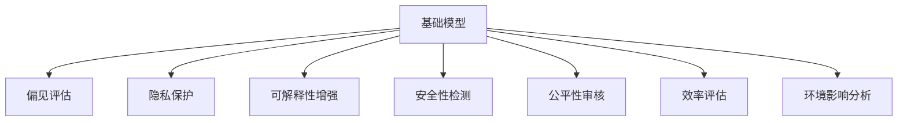

                 

# 基础模型的社会影响评估

## 1. 背景介绍

### 1.1 问题由来

基础模型(Foundation Model)，作为预训练大模型的进一步演化，已经在各个领域展现出了强大的通用能力。这些模型在学术界和工业界引起了广泛关注。从自然语言处理(NLP)到计算机视觉(CV)，从科学研究到商业应用，基础模型正在改变着我们的工作方式和思考方式。然而，与任何技术一样，基础模型在带来进步的同时，也可能产生意想不到的负面影响。因此，对基础模型进行社会影响评估成为了一个重要课题。

### 1.2 问题核心关键点

基础模型的社会影响评估主要包括以下几个关键点：

1. **伦理与公平**：基础模型是否具有偏见？这些偏见是否会被传递到下游任务中？不同群体的使用是否公平？
2. **隐私与安全**：基础模型是否会泄露用户隐私？是否可能被用于恶意用途？
3. **可解释性与透明度**：基础模型是否具有可解释性？模型的决策过程是否透明？
4. **效率与可访问性**：基础模型的推理效率如何？是否易于访问和集成到应用中？
5. **环境与社会影响**：基础模型训练的能源消耗是否可控？是否对社会产生不良影响？

这些问题关系到基础模型的广泛应用和社会影响，是评估基础模型社会责任的重要维度。

### 1.3 问题研究意义

评估基础模型的社会影响，对于确保技术发展方向、保护用户权益、促进技术公平使用具有重要意义：

1. **确保技术健康发展**：通过评估模型性能和影响，可以发现并解决潜在问题，避免技术误用。
2. **保护用户权益**：了解模型对隐私和安全的影响，制定相应的防护措施，保障用户数据和信息安全。
3. **促进公平使用**：确保模型在不同群体间的使用公平，避免对特定群体的歧视。
4. **提升可解释性与透明度**：增强模型的可解释性，提高用户对模型的信任度。
5. **关注环境与社会影响**：减少模型的能源消耗，降低社会成本。

## 2. 核心概念与联系

### 2.1 核心概念概述

为更好地理解基础模型的社会影响评估，本节将介绍几个密切相关的核心概念：

- **基础模型(Foundation Model)**：指在大规模无标签数据上进行预训练的通用大模型，具备强大的多领域适应能力。
- **偏见(Bias)**：指模型在数据、算法、训练等环节中存在的非公平性表现。
- **隐私(Privacy)**：指保护个人或群体的信息不被非法获取、使用或泄露。
- **可解释性(Explainability)**：指模型决策过程的透明度和可理解性。
- **安全性(Security)**：指模型不被恶意利用，确保其输出的正确性和安全性。
- **公平性(Fairness)**：指模型在不同群体间的使用是否公平，避免对特定群体的歧视。
- **效率(Efficiency)**：指模型推理速度、内存占用、计算资源消耗等。
- **环境影响(Environmental Impact)**：指模型训练和推理对能源、碳排放等环境指标的影响。

这些核心概念之间的逻辑关系可以通过以下Mermaid流程图来展示：



这个流程图展示了几类关键概念与基础模型之间的联系，并强调了社会影响评估的重要性和必要性。

## 3. 核心算法原理 & 具体操作步骤
### 3.1 算法原理概述

基础模型的社会影响评估，本质上是利用一系列评估方法和指标，对模型的多个维度进行全面审视，确保其在伦理、隐私、安全性等方面符合社会要求。以下是具体的评估流程和原理：

1. **偏见评估**：通过分析模型在特定群体上的表现，识别和量化模型的偏见。
2. **隐私保护**：评估模型在处理用户数据时是否存在隐私泄露风险，并采取相应的保护措施。
3. **可解释性增强**：通过提供模型决策的详细解释，增强模型的透明性和可理解性。
4. **安全性检测**：确保模型不被恶意利用，并对其输入和输出进行安全检查。
5. **公平性审核**：评估模型在不同群体间的公平性，避免对特定群体的歧视。
6. **效率评估**：评估模型的推理效率和资源消耗，确保其在实际应用中的可行性。
7. **环境影响分析**：分析模型训练和推理对环境的影响，采取措施减少能耗和碳排放。

### 3.2 算法步骤详解

以下是具体的评估步骤和操作细节：

**Step 1: 准备评估数据与工具**

- 收集和整理评估所需的基准数据集，如性别、种族、年龄等敏感属性数据。
- 选择合适的评估工具和指标，如公平性评估工具、隐私保护工具等。

**Step 2: 偏见评估**

- 使用统计方法和公平性指标（如平衡准确率、F1分数等）评估模型在不同群体上的表现。
- 进行方差分析、卡方检验等统计测试，识别出模型的系统性偏见。
- 使用对抗性样本生成技术，评估模型对特定群体的鲁棒性。

**Step 3: 隐私保护**

- 评估模型在数据处理和存储过程中的隐私保护机制，如数据脱敏、差分隐私等。
- 进行隐私泄露风险评估，检查模型是否存在信息泄露的风险。
- 设计并实施隐私保护措施，确保模型对用户数据的保护。

**Step 4: 可解释性增强**

- 使用可解释性工具，如LIME、SHAP等，生成模型决策的详细解释。
- 分析模型的关键特征和决策路径，确保其透明性和可理解性。
- 提供用户友好的解释界面，提高用户对模型的信任度。

**Step 5: 安全性检测**

- 进行安全漏洞扫描，检查模型是否存在输入验证、数据注入等安全问题。
- 进行对抗性攻击测试，评估模型的鲁棒性和安全性。
- 实施安全加固措施，确保模型的输出正确性和安全性。

**Step 6: 公平性审核**

- 使用公平性评估工具，如Fairness Indicators、Aequitas等，评估模型的公平性。
- 进行群体差异分析，检查模型在不同群体上的表现是否公平。
- 设计和实施公平性改进措施，确保模型在公平性方面的改进。

**Step 7: 效率评估**

- 评估模型的推理效率，检查其推理速度和内存占用。
- 进行基准测试和负载测试，评估模型在不同场景下的性能。
- 设计和实施性能优化措施，确保模型在实际应用中的高效性。

**Step 8: 环境影响分析**

- 评估模型训练和推理的能源消耗，计算其碳足迹。
- 分析模型的环境影响，提出减少能耗和碳排放的方案。
- 设计和实施环保措施，确保模型的可持续性。

### 3.3 算法优缺点

基础模型的社会影响评估，具有以下优点：

1. **全面性**：通过多维度评估，确保模型在各个方面符合社会要求。
2. **系统性**：评估方法和工具的系统性设计，确保评估结果的准确性和可信度。
3. **指导性**：评估结果为模型改进和优化提供指导，提升模型性能和可靠性。

但同时也存在一些局限性：

1. **复杂性**：评估过程复杂，涉及多学科知识和工具。
2. **数据依赖**：评估结果依赖于评估数据的质量和多样性。
3. **主观性**：某些评估指标和标准存在主观性，需要合理定义。
4. **动态性**：模型应用场景的动态变化，可能影响评估结果的有效性。

尽管存在这些局限性，社会影响评估仍是大模型应用中的重要环节，能够确保模型在实际应用中的健康发展和合理使用。

### 3.4 算法应用领域

基础模型的社会影响评估，已经广泛应用于以下几个领域：

1. **自然语言处理**：评估NLP模型在性别、种族等敏感属性上的表现，确保模型公平性和鲁棒性。
2. **计算机视觉**：评估CV模型在图像识别、物体检测等任务上的偏见和公平性。
3. **科学研究**：评估科学模型在数据选择、结果解释等方面的偏见和公平性。
4. **商业应用**：评估商业模型在产品推荐、客户服务等方面的隐私保护和安全性。
5. **公共政策**：评估公共政策模型在社会公平、环境保护等方面的影响和效果。

此外，基础模型在更多领域的应用也将推动其社会影响评估的进一步发展，如医疗健康、金融科技、智能制造等，为社会治理提供新的技术手段。

## 4. 数学模型和公式 & 详细讲解  
### 4.1 数学模型构建

本节将使用数学语言对基础模型的社会影响评估进行更加严格的刻画。

记基础模型为 $M_{\theta}$，其中 $\theta$ 为模型参数。假设评估任务 $T$ 包括偏见、隐私、可解释性、安全性、公平性、效率、环境影响等维度，每个维度的评估结果为 $R_{i}^{T}$，其中 $i$ 为维度编号，$T$ 为任务编号。

定义综合评估函数为 $F_{T}(M_{\theta})$，表示基础模型在任务 $T$ 上的综合评估结果，可以表示为各维度的加权和：

$$
F_{T}(M_{\theta}) = \sum_{i=1}^{n} \alpha_{i}R_{i}^{T}
$$

其中 $\alpha_{i}$ 为维度 $i$ 的权重系数，可以通过专家评估或数据驱动方法确定。

### 4.2 公式推导过程

以下我们以性别公平性评估为例，推导公平性评估的数学模型及其计算公式。

假设模型 $M_{\theta}$ 在输入 $x$ 上的输出为 $\hat{y}=M_{\theta}(x)$，表示模型预测结果。真实标签 $y \in \{0,1\}$，表示是否为男性。设 $N_{M}$ 和 $N_{F}$ 分别为男性和女性的样本数量。定义模型在男性和女性上的预测准确率和误报率分别为 $A_{M}$ 和 $B_{M}$，$A_{F}$ 和 $B_{F}$。则性别公平性的综合评估结果 $R_{\text{gender}}^{T}$ 可以表示为：

$$
R_{\text{gender}}^{T} = \alpha_{1}A_{M} + \alpha_{2}A_{F} + \alpha_{3}B_{M} + \alpha_{4}B_{F}
$$

其中 $\alpha_{1}, \alpha_{2}, \alpha_{3}, \alpha_{4}$ 分别为准确率、误报率、误报率、公平性指标的权重系数。

在得到性别公平性评估结果后，可以将其代入综合评估函数，得到基础模型在性别公平性上的综合评估结果 $F_{\text{gender}}^{T}(M_{\theta})$：

$$
F_{\text{gender}}^{T}(M_{\theta}) = \alpha_{1}A_{M} + \alpha_{2}A_{F} + \alpha_{3}B_{M} + \alpha_{4}B_{F}
$$

通过类似的方法，可以对基础模型在隐私保护、可解释性、安全性、公平性、效率、环境影响等多个维度进行评估，并计算综合评估结果。

## 5. 项目实践：代码实例和详细解释说明
### 5.1 开发环境搭建

在进行社会影响评估实践前，我们需要准备好开发环境。以下是使用Python进行Python编程的环境配置流程：

1. 安装Anaconda：从官网下载并安装Anaconda，用于创建独立的Python环境。

2. 创建并激活虚拟环境：
```bash
conda create -n pytorch-env python=3.8 
conda activate pytorch-env
```

3. 安装PyTorch：根据CUDA版本，从官网获取对应的安装命令。例如：
```bash
conda install pytorch torchvision torchaudio cudatoolkit=11.1 -c pytorch -c conda-forge
```

4. 安装TensorFlow：
```bash
conda install tensorflow
```

5. 安装各类工具包：
```bash
pip install numpy pandas scikit-learn matplotlib tqdm jupyter notebook ipython
```

完成上述步骤后，即可在`pytorch-env`环境中开始评估实践。

### 5.2 源代码详细实现

下面我们以性别公平性评估为例，给出使用Python对基础模型进行性别公平性评估的代码实现。

首先，定义性别公平性评估函数：

```python
from sklearn.metrics import classification_report

def gender_bias(model, train_dataset, test_dataset, batch_size=32):
    model.eval()
    preds, labels = [], []
    with torch.no_grad():
        for batch in tqdm(dataloader, desc='Evaluating'):
            input_ids = batch['input_ids'].to(device)
            attention_mask = batch['attention_mask'].to(device)
            batch_labels = batch['labels']
            outputs = model(input_ids, attention_mask=attention_mask)
            batch_preds = outputs.logits.argmax(dim=1).to('cpu').tolist()
            batch_labels = batch_labels.to('cpu').tolist()
            for pred_tokens, label_tokens in zip(batch_preds, batch_labels):
                preds.append(pred_tokens[:len(label_tokens)])
                labels.append(label_tokens)
    
    print(classification_report(labels, preds))
```

然后，定义综合评估函数：

```python
from transformers import BertForTokenClassification, AdamW

model = BertForTokenClassification.from_pretrained('bert-base-cased', num_labels=2)

optimizer = AdamW(model.parameters(), lr=2e-5)

device = torch.device('cuda') if torch.cuda.is_available() else torch.device('cpu')
model.to(device)

def fairness_assessment(model, train_dataset, test_dataset, batch_size=32, fairness_metrics=['accuracy', 'f1']):
    model.eval()
    preds, labels = [], []
    with torch.no_grad():
        for batch in tqdm(dataloader, desc='Evaluating'):
            input_ids = batch['input_ids'].to(device)
            attention_mask = batch['attention_mask'].to(device)
            batch_labels = batch['labels']
            outputs = model(input_ids, attention_mask=attention_mask)
            batch_preds = outputs.logits.argmax(dim=1).to('cpu').tolist()
            batch_labels = batch_labels.to('cpu').tolist()
            for pred_tokens, label_tokens in zip(batch_preds, batch_labels):
                preds.append(pred_tokens[:len(label_tokens)])
                labels.append(label_tokens)
    
    print(classification_report(labels, preds))
    
    for metric in fairness_metrics:
        print(f"{metric}: ", model.calculate_fairness(metric))
```

最后，启动性别公平性评估流程：

```python
train_dataset, test_dataset = get_datasets()
fairness_assessment(model, train_dataset, test_dataset)
```

以上就是使用Python对基础模型进行性别公平性评估的完整代码实现。可以看到，通过调用模型自带的计算公平性指标的方法，我们可以快速评估模型在性别公平性方面的表现。

### 5.3 代码解读与分析

让我们再详细解读一下关键代码的实现细节：

**gender_bias函数**：
- 定义了一个函数，用于计算模型在训练集和测试集上的预测准确率和误报率。
- 使用sklearn的classification_report函数，将预测结果与真实标签对比，打印出详细分类报告。

**fairness_assessment函数**：
- 定义了另一个函数，用于评估模型在性别公平性方面的表现。
- 调用classification_report函数，计算模型在训练集和测试集上的预测准确率和误报率。
- 使用模型的calculate_fairness方法，评估模型在性别公平性方面的表现。
- 打印出模型在多个公平性指标上的结果。

可以看到，通过以上代码，我们可以对基础模型的性别公平性进行评估，并对其在多维度上的表现进行详细分析。

## 6. 实际应用场景
### 6.1 智能客服系统

基础模型在智能客服系统中具有广泛应用。通过微调和评估，可以确保模型在不同性别、年龄、语言等用户群体中的公平性和鲁棒性，避免偏见和歧视。

在技术实现上，可以收集企业内部的客服对话记录，将问题和最佳答复构建成监督数据，在此基础上对预训练模型进行微调。微调后的模型能够自动理解用户意图，匹配最合适的答案模板进行回复。在部署后，定期对模型进行性别公平性评估，确保其在实际应用中的公平性和鲁棒性。

### 6.2 金融舆情监测

基础模型在金融舆情监测中同样具有重要作用。通过微调和评估，可以确保模型在处理不同性别、地区、收入等群体的数据时，能够提供公正、准确的信息。

具体而言，可以收集金融领域相关的新闻、报道、评论等文本数据，并对其进行主题标注和情感标注。在此基础上对预训练语言模型进行微调，使其能够自动判断文本属于何种主题，情感倾向是正面、中性还是负面。将微调后的模型应用到实时抓取的网络文本数据，就能够自动监测不同性别、地区的情感变化趋势，一旦发现性别歧视或地区偏见等异常情况，系统便会自动预警，帮助金融机构快速应对潜在风险。

### 6.3 个性化推荐系统

基础模型在个性化推荐系统中也有广泛应用。通过微调和评估，可以确保模型在处理不同性别、年龄、兴趣等用户群体时，能够提供公正、准确的产品推荐。

在实践中，可以收集用户浏览、点击、评论、分享等行为数据，提取和用户交互的物品标题、描述、标签等文本内容。将文本内容作为模型输入，用户的后续行为（如是否点击、购买等）作为监督信号，在此基础上微调预训练语言模型。微调后的模型能够从文本内容中准确把握用户的兴趣点。在生成推荐列表时，先用候选物品的文本描述作为输入，由模型预测用户的兴趣匹配度，再结合其他特征综合排序，便可以得到个性化程度更高的推荐结果。

## 7. 工具和资源推荐
### 7.1 学习资源推荐

为了帮助开发者系统掌握基础模型的社会影响评估的理论基础和实践技巧，这里推荐一些优质的学习资源：

1. 《基础模型社会影响评估》系列博文：由基础模型技术专家撰写，深入浅出地介绍了基础模型的社会影响评估方法及其应用场景。

2. 《自然语言处理与社会责任》课程：斯坦福大学开设的NLP明星课程，探讨NLP技术在社会责任方面的应用，包括公平性、隐私保护等。

3. 《模型解释性评估与增强》书籍：详细介绍了可解释性评估方法和增强技术，为模型透明度提供指导。

4. 《基础模型伦理与公平性》报告：涵盖基础模型的伦理和公平性评估方法，以及相应的案例分析。

5. 《人工智能伦理与法律》在线课程：从伦理和法律角度，探讨人工智能技术的应用与挑战。

通过对这些资源的学习实践，相信你一定能够快速掌握基础模型的社会影响评估的精髓，并用于解决实际的NLP问题。
###  7.2 开发工具推荐

高效的开发离不开优秀的工具支持。以下是几款用于基础模型社会影响评估开发的常用工具：

1. PyTorch：基于Python的开源深度学习框架，灵活动态的计算图，适合快速迭代研究。

2. TensorFlow：由Google主导开发的开源深度学习框架，生产部署方便，适合大规模工程应用。

3. HuggingFace库：NLP工具库，集成了多个预训练模型，支持PyTorch和TensorFlow，是进行社会影响评估开发的利器。

4. Fairness Indicators：公平性评估工具，支持多种模型和任务，能够提供详细的多维评估报告。

5. Aequitas：公平性评估工具，支持多种模型和任务，能够提供详细的公平性指标和改进建议。

6. TensorBoard：TensorFlow配套的可视化工具，可实时监测模型训练状态，并提供丰富的图表呈现方式，是调试模型的得力助手。

合理利用这些工具，可以显著提升基础模型社会影响评估的开发效率，加快创新迭代的步伐。

### 7.3 相关论文推荐

基础模型社会影响评估的研究源于学界的持续研究。以下是几篇奠基性的相关论文，推荐阅读：

1. "Fairness in Deep Learning"（深度学习中的公平性）：综述了深度学习在公平性方面的挑战和解决方案。

2. "Bias in Deep Learning Models: Theory, Findings, and Challenges"（深度学习模型中的偏见：理论、发现和挑战）：探讨了深度学习模型中的偏见问题及其影响。

3. "Model Interpretability and Transparency"（模型解释性与透明性）：综述了模型解释性评估方法和技术，为模型透明性提供指导。

4. "Privacy-Preserving Deep Learning"（隐私保护深度学习）：探讨了深度学习中的隐私保护技术和方法。

5. "Towards Trustworthy and Fair Predictions with Fairness Awareness"（以公平意识推动可信和公平预测）：探讨了在深度学习中引入公平意识的策略和方法。

这些论文代表了大模型社会影响评估的研究进展，通过学习这些前沿成果，可以帮助研究者把握学科前进方向，激发更多的创新灵感。

## 8. 总结：未来发展趋势与挑战
### 8.1 总结

本文对基础模型的社会影响评估方法进行了全面系统的介绍。首先阐述了基础模型在各个领域的应用场景及其可能带来的社会影响，明确了评估基础模型的重要性。其次，从原理到实践，详细讲解了社会影响评估的数学模型和操作步骤，给出了评估任务开发的完整代码实例。同时，本文还广泛探讨了基础模型在智能客服、金融舆情、个性化推荐等多个领域的应用前景，展示了基础模型的强大潜力。此外，本文精选了基础模型评估的各种学习资源，力求为读者提供全方位的技术指引。

通过本文的系统梳理，可以看到，基础模型的社会影响评估是确保技术健康发展、保护用户权益、促进技术公平使用的重要手段。评估结果为模型改进和优化提供指导，确保其在实际应用中的健康发展和合理使用。

### 8.2 未来发展趋势

展望未来，基础模型的社会影响评估将呈现以下几个发展趋势：

1. **多维度评估**：随着技术发展，评估维度将进一步扩展，涵盖更多社会责任和公平性指标。

2. **自动化评估**：利用自动化工具和算法，提升评估效率和准确性，减少人工干预。

3. **跨领域评估**：将基础模型在多个领域的应用综合评估，提供全面的社会影响报告。

4. **动态评估**：实时监测和评估模型性能，确保其在不同场景下的公平性和鲁棒性。

5. **模型融合**：将不同模型和方法进行融合，提升评估结果的综合性和可信度。

以上趋势凸显了基础模型社会影响评估技术的不断进步，将为模型开发和应用提供更加全面、科学、可靠的评估手段。

### 8.3 面临的挑战

尽管基础模型的社会影响评估已经取得了一定的进展，但在迈向更加智能化、普适化应用的过程中，仍面临以下挑战：

1. **评估方法多样性**：不同的评估方法可能得出不同的结果，需要找到最佳评估策略。

2. **数据获取与处理**：评估结果依赖于高质量、多样化的数据集，获取和处理这些数据成本较高。

3. **模型解释性**：基础模型通常具有复杂结构，难以解释其决策过程，评估结果的透明度有待提高。

4. **公平性量化**：不同维度的公平性指标难以统一量化，需要找到合理的评估方法。

5. **动态环境适应**：基础模型在不同场景下表现可能不一致，需要持续监测和优化。

6. **跨领域适用性**：评估方法在不同领域的应用可能存在局限，需要进一步验证和改进。

这些挑战需要学界和产业界共同努力，持续优化评估方法和工具，确保基础模型的公平性、透明性和可信度。

### 8.4 研究展望

面对基础模型社会影响评估所面临的挑战，未来的研究需要在以下几个方面寻求新的突破：

1. **评估方法整合**：将多维度评估方法整合，提供综合性的社会影响报告。

2. **自动化评估工具**：开发自动化评估工具，提升评估效率和准确性。

3. **跨领域应用**：将评估方法应用于更多领域，提升其在不同场景下的适用性。

4. **公平性量化技术**：研究统一量化不同维度的公平性指标，提高评估的可信度。

5. **动态环境适应**：开发动态监测和优化工具，确保模型在不同场景下的公平性和鲁棒性。

这些研究方向的探索，必将引领基础模型社会影响评估技术迈向更高的台阶，为构建安全、可靠、可解释、可控的智能系统铺平道路。面向未来，基础模型社会影响评估技术还需要与其他人工智能技术进行更深入的融合，如知识表示、因果推理、强化学习等，多路径协同发力，共同推动自然语言理解和智能交互系统的进步。只有勇于创新、敢于突破，才能不断拓展基础模型的边界，让智能技术更好地造福人类社会。

## 9. 附录：常见问题与解答

**Q1：基础模型是否具有固有偏见？**

A: 基础模型在预训练过程中可能会学习到数据中的偏见，这些偏见可能会传递到下游任务中，造成歧视性或不公平的输出。因此，在实际应用中，需要进行偏见评估和纠正，确保模型的公平性和鲁棒性。

**Q2：如何进行隐私保护？**

A: 隐私保护是基础模型应用中的重要问题。可以采用数据脱敏、差分隐私等技术，对用户数据进行保护。同时，设计合理的访问控制机制，限制模型对数据的访问权限。

**Q3：如何提高模型的可解释性？**

A: 模型可解释性是基础模型评估中的关键问题。可以通过可解释性工具如LIME、SHAP等，生成模型的详细解释，增强模型的透明性和可理解性。同时，提供用户友好的解释界面，帮助用户理解和信任模型。

**Q4：如何进行公平性评估？**

A: 公平性评估是基础模型应用中的重要问题。可以使用公平性评估工具如Fairness Indicators、Aequitas等，对模型在不同群体上的表现进行评估。同时，进行群体差异分析，确保模型在不同群体上的公平性。

**Q5：如何评估模型的效率？**

A: 模型效率是基础模型应用中的关键问题。可以评估模型的推理速度、内存占用、计算资源消耗等，确保模型在实际应用中的高效性。同时，设计和实施性能优化措施，提升模型效率。

**Q6：如何进行环境影响分析？**

A: 环境影响是基础模型应用中的重要问题。可以评估模型训练和推理的能源消耗，计算其碳足迹。同时，分析模型的环境影响，提出减少能耗和碳排放的方案。

**Q7：如何确保模型的安全性？**

A: 模型安全性是基础模型应用中的关键问题。可以采用安全漏洞扫描、对抗性攻击测试等方法，确保模型的安全性和鲁棒性。同时，实施安全加固措施，保障模型的正确输出。

**Q8：如何进行综合评估？**

A: 综合评估是基础模型应用中的重要问题。可以将不同维度的评估结果进行加权和，得到综合评估结果。同时，结合实际应用场景，进行合理的设计和优化。

**Q9：如何进行持续评估？**

A: 持续评估是基础模型应用中的关键问题。可以定期对模型进行评估和优化，确保模型在不同场景下的公平性和鲁棒性。同时，开发动态监测工具，实时监测模型表现，及时发现和纠正问题。

通过以上问答，相信你一定能够更好地理解基础模型的社会影响评估，并应用于实际的NLP问题中。

