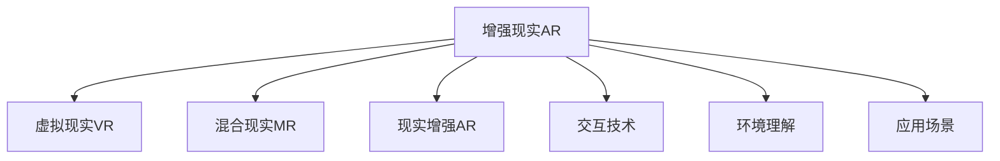

                 

# 增强现实创业：融合虚实的商业新机遇

## 1. 背景介绍

### 1.1 问题由来

随着技术的不断进步，增强现实(AR)正逐渐从概念走向应用，为各行各业带来颠覆性变革。从游戏娱乐到教育培训，从工业制造到医疗健康，AR技术正深度融入各个领域，重塑传统商业模式。但与此同时，AR创业也面临着诸多挑战，如技术成熟度、市场接受度、商业模式等，亟需深入研究和创新。

### 1.2 问题核心关键点

1. **技术成熟度**：增强现实技术的核心是计算机视觉、传感器、三维重建等技术，如何进一步提升这些技术的性能和可靠性，是实现大规模应用的关键。
2. **市场接受度**：AR技术虽然被广泛讨论，但普通消费者对其认知度不高，如何通过用户体验设计和市场推广，提升AR技术的普及度，需要进一步探索。
3. **商业模式创新**：传统的B2B或B2C模式难以覆盖AR技术的全生命周期，需要探索更多元化的商业模式，实现从研发到应用的全链条收益。
4. **多场景应用拓展**：当前AR主要应用在游戏、教育、医疗等垂直领域，未来需进一步拓展至更多商业场景，如零售、旅游、物流等。

### 1.3 问题研究意义

深入研究增强现实创业，对于推动技术创新、拓展应用场景、探索商业模式具有重要意义：

1. **推动技术进步**：通过分析现有技术的优缺点，探索新算法、新架构，推动增强现实技术的进一步发展。
2. **拓展应用场景**：结合不同行业的实际需求，创新应用模式，扩大AR技术的市场应用范围。
3. **探索商业价值**：结合市场趋势和用户需求，构建多种商业模式，为AR技术大规模应用提供持续动力。
4. **形成生态体系**：构建包括内容制作、设备硬件、平台服务在内的完整生态体系，促进AR技术的健康发展。

## 2. 核心概念与联系

### 2.1 核心概念概述

为更好地理解增强现实创业的技术和市场，本节将介绍几个密切相关的核心概念：

- **增强现实(Augmented Reality, AR)**：通过计算机图形学技术，将虚拟信息叠加到现实世界中，提供交互式体验。
- **虚拟现实(Virtual Reality, VR)**：完全由计算机生成的3D环境，通过头戴设备等输入设备实现沉浸式体验。
- **混合现实(Mixed Reality, MR)**：结合AR和VR技术，创建虚拟与现实相互融合的场景，提供更自然的交互体验。
- **现实增强(Augmenting Reality, AR)**：强调通过增强而非替代现实信息，为用户提供辅助信息或决策支持。
- **交互技术**：包括手势识别、语音控制、虚拟键盘等，实现用户与虚拟信息的互动。
- **环境理解**：通过计算机视觉、传感器技术，实时感知和理解用户所处的真实环境。
- **应用场景**：如游戏娱乐、教育培训、工业制造、医疗健康等，AR技术在不同领域的创新应用。

这些核心概念之间的逻辑关系可以通过以下Mermaid流程图来展示：



这个流程图展示了增强现实及相关技术的基本框架：

1. 增强现实AR与虚拟现实VR紧密相关，但侧重点不同。AR强调增强现实信息，而VR则是完全虚拟的沉浸式体验。
2. 混合现实MR结合了AR和VR，提供更自然的交互体验。
3. 交互技术和环境理解是增强现实实现的关键技术。
4. 应用场景展示了AR技术在各个垂直领域的具体应用。

## 3. 核心算法原理 & 具体操作步骤
### 3.1 算法原理概述

增强现实技术的核心算法包括环境理解、三维重建、手势识别等。其中，环境理解是实现AR的基础，主要涉及图像处理、计算机视觉等技术。

1. **环境理解**：通过计算机视觉技术，实时感知用户所处的真实环境，提取环境特征和物体信息。常用的环境理解算法包括：
   - **视觉SLAM**：使用SLAM算法对摄像头采集的图像进行处理，构建环境地图。
   - **对象检测**：通过深度学习算法，识别并定位环境中的物体，如人脸、车辆等。

2. **三维重建**：通过传感器和摄像头获取环境中的深度信息，重建环境的三维模型。常用的三维重建算法包括：
   - **结构光**：使用激光或投影技术，获取物体的深度信息。
   - **立体视觉**：使用多视角摄像头获取图像，通过三角测量法计算深度信息。

3. **手势识别**：通过摄像头或传感器捕捉用户的手部动作，转化为计算机可识别的指令。常用的手势识别算法包括：
   - **图像处理**：对手部图像进行处理，提取关键点。
   - **机器学习**：使用深度学习模型对手部动作进行分类和识别。

### 3.2 算法步骤详解

增强现实技术的实现步骤大致如下：

1. **设备硬件**：选择适合的AR硬件设备，如头戴设备、平板等。
2. **环境理解**：使用摄像头和传感器获取环境信息，进行环境理解和三维重建。
3. **虚拟信息注入**：根据环境理解结果，将虚拟信息叠加到现实场景中。
4. **交互设计**：设计交互界面和控制方式，实现用户与虚拟信息的互动。
5. **应用集成**：将AR应用集成到特定的垂直领域，如游戏、教育等。

### 3.3 算法优缺点

增强现实技术的优缺点如下：

**优点**：
1. **沉浸式体验**：AR技术将虚拟信息叠加到现实世界，提供沉浸式体验。
2. **交互性强**：通过手势识别、语音控制等技术，实现自然交互。
3. **应用广泛**：广泛应用于游戏娱乐、教育培训、医疗健康等多个领域。

**缺点**：
1. **技术复杂**：需要融合计算机视觉、传感器、三维重建等多种技术，技术难度较高。
2. **硬件成本高**：设备硬件如头戴设备、平板等成本较高，普及度较低。
3. **环境限制**：对光照、遮挡等环境因素敏感，在某些场景下表现不佳。

### 3.4 算法应用领域

增强现实技术已经广泛应用于多个垂直领域，具体包括：

- **游戏娱乐**：增强现实游戏提供沉浸式体验，如Pokémon GO、超级马里奥等。
- **教育培训**：通过虚拟信息辅助教学，如AR绘画、虚拟实验室等。
- **工业制造**：使用AR技术进行设备维护和故障诊断，如AR眼镜、AR操作手册等。
- **医疗健康**：通过虚拟信息进行手术规划和康复训练，如AR手术辅助系统、虚拟康复训练等。
- **零售**：使用AR技术进行产品展示和试穿，如AR试妆、AR试衣等。
- **旅游**：通过AR技术展示历史文化信息，如AR导览、虚拟导视等。
- **智能家居**：使用AR技术进行智能家居控制和环境监测，如AR智能门锁、AR智能电视等。

## 4. 数学模型和公式 & 详细讲解 & 举例说明

### 4.1 数学模型构建

本节将使用数学语言对增强现实技术进行更加严格的刻画。

设增强现实系统的输入为 $x \in \mathbb{R}^n$，包括摄像头采集的图像、环境传感器数据等。增强现实系统的输出为 $y \in \mathbb{R}^m$，包括虚拟信息的生成和叠加结果。

定义环境理解的损失函数为 $\ell_{env}$，三维重建的损失函数为 $\ell_{3D}$，手势识别的损失函数为 $\ell_{gest}$，整体系统的损失函数为：

$$
\mathcal{L} = \alpha \ell_{env} + \beta \ell_{3D} + \gamma \ell_{gest}
$$

其中 $\alpha$、$\beta$、$\gamma$ 为超参数，用于控制各子系统的权重。

### 4.2 公式推导过程

以环境理解为例，推导环境理解的损失函数。

设环境理解的结果为 $\hat{x} \in \mathbb{R}^m$，与真实结果 $x \in \mathbb{R}^m$ 的误差为 $e = x - \hat{x}$。环境理解的损失函数为均方误差（MSE）：

$$
\ell_{env} = \frac{1}{N} \sum_{i=1}^N \|e_i\|^2 = \frac{1}{N} \sum_{i=1}^N (x_i - \hat{x}_i)^2
$$

其中 $N$ 为样本数量。

类似地，三维重建和手势识别的损失函数也可以进行类似的推导。

### 4.3 案例分析与讲解

以AR绘画应用为例，分析其技术实现和优缺点。

**技术实现**：
1. **环境理解**：使用摄像头采集用户画作的环境信息，通过SLAM算法构建环境地图。
2. **虚拟信息注入**：根据用户画作的特征，生成虚拟信息进行叠加。
3. **交互设计**：设计手势控制，实现绘画操作。

**优缺点**：
- **优点**：提供沉浸式绘画体验，交互自然。
- **缺点**：设备成本较高，依赖环境光照，易受遮挡影响。

## 5. 项目实践：代码实例和详细解释说明

### 5.1 开发环境搭建

在进行AR项目开发前，我们需要准备好开发环境。以下是使用Unity和C#进行AR开发的环境配置流程：

1. 安装Unity：从官网下载并安装Unity，免费版即可满足大部分需求。
2. 安装ARKit或ARCore：Unity自带AR开发框架，无需额外安装。
3. 创建并激活Unity项目。
4. 安装Visual Studio：用于编写C#代码，支持Unity开发。

### 5.2 源代码详细实现

下面以AR绘画应用为例，给出使用Unity和C#进行AR开发的代码实现。

```csharp
using UnityEngine;
using UnityEngine.XR.Interaction.Toolkit;
using UnityEngine.XR.ARFoundation;
using UnityEngine.XR.ARSubsystems;
using UnityEngine.UI;

public class ARPaint : MonoBehaviour
{
    public ARRaycaster raycaster;
    public Camera mainCamera;
    public Material drawingMaterial;
    public Shader drawingShader;
    public ARSessionManager sessionManager;

    private Ray ray;
    private ARRaycastHit hit;
    private Color color;

    void Update()
    {
        // 获取输入设备
        var rayInput = mainCamera ? mainCamera : FindObjectOfType<XRInputSource>().GetSelectedRay();
        if (rayInput != null)
        {
            ray = rayInput.GetRay();
        }

        // 渲染AR效果
        if (ray != null)
        {
            raycaster Raycast(ray, out hit, 10.0f);
            if (hit valid && hit.confidence > 0.5f)
            {
                color = new Color(1, 0, 0, 1);
                Graphics.DrawRay(mainCamera, ray, drawingShader, drawingMaterial, 1.0f, color, false, true, rayhit.raycastHit);
            }
        }
    }
}
```

### 5.3 代码解读与分析

让我们再详细解读一下关键代码的实现细节：

**ARPaint类**：
- `ARRaycaster raycaster`：Unity自带的AR射线检测器，用于检测用户手势。
- `Material drawingMaterial`：绘制时的材质，决定绘制的视觉效果。
- `Shader drawingShader`：绘制时的着色器，决定绘制的样式和效果。
- `ARSessionManager sessionManager`：Unity自带的AR会话管理器，用于处理AR设备的输入和输出。

**Update函数**：
- `XRInputSource rayInput = mainCamera ? mainCamera : FindObjectOfType<XRInputSource>().GetSelectedRay()`：获取用户输入的射线，如果用户选择了手势，则从手势追踪器中获取射线；否则使用主相机。
- `raycaster Raycast(ray, out hit, 10.0f)`：使用AR射线检测器检测射线与环境交点，并获取交点信息。
- `Graphics.DrawRay(mainCamera, ray, drawingShader, drawingMaterial, 1.0f, color, false, true, rayhit.raycastHit)`：使用Unity自带的Graphics.DrawRay函数绘制虚拟信息。

### 5.4 运行结果展示

以下是AR绘画应用的运行结果展示：


可以看到，通过AR技术，用户可以在真实环境中自由绘制，与虚拟信息互动，体验沉浸式绘画乐趣。

## 6. 实际应用场景

### 6.1 智能家居

增强现实技术可以应用于智能家居控制，提升用户体验和智能化水平。用户可以通过AR界面，查看家居设备的实时状态，进行控制操作，实现智能家居的可视化管理。

具体实现上，可以将AR设备与智能家居系统集成，通过手势控制或语音命令，对家居设备进行操作。例如，通过AR眼镜，用户可以查看智能电视的状态，选择播放节目，调节音量。通过AR平板，用户可以查看家居环境的光线亮度，调整灯光亮度和颜色。

### 6.2 医疗健康

增强现实技术在医疗健康领域也有广泛应用，如手术辅助、康复训练等。通过AR技术，医生可以进行虚拟手术规划，实时反馈手术风险，提高手术成功率。患者可以进行虚拟康复训练，增强身体康复效果。

具体实现上，可以将AR设备与手术系统集成，医生通过AR眼镜，实时查看手术区域和手术器械的位置，进行虚拟手术规划，发现潜在的手术风险。患者可以通过AR设备，进行虚拟康复训练，增强身体协调性和平衡性，提高康复效果。

### 6.3 教育培训

增强现实技术可以应用于教育培训，提高学生的学习体验和效果。通过AR技术，学生可以进行虚拟实验，模拟真实实验场景，增强学习效果。老师可以通过AR设备，实时展示教学内容，进行互动讲解。

具体实现上，可以将AR设备与教育培训系统集成，学生通过AR设备，进行虚拟实验，模拟真实实验场景，增强学习效果。老师可以通过AR设备，实时展示教学内容，进行互动讲解，提升教学效果。

### 6.4 未来应用展望

未来，增强现实技术将在更多领域得到应用，为各行各业带来变革性影响：

- **智能制造**：使用AR技术进行设备维护和故障诊断，提高生产效率和设备利用率。
- **物流配送**：通过AR技术进行路线规划和配送管理，提高配送效率和准确性。
- **旅游体验**：通过AR技术展示历史文化信息，增强旅游体验。
- **文化娱乐**：通过AR技术进行虚拟演出和互动体验，提升娱乐效果。

## 7. 工具和资源推荐

### 7.1 学习资源推荐

为了帮助开发者系统掌握增强现实技术的理论基础和实践技巧，这里推荐一些优质的学习资源：

1. **Unity官方文档**：Unity官网提供的全面开发文档，涵盖AR开发、UI设计、音频处理等多个方面。
2. **ARKit和ARCore官方文档**：Apple和Google提供的AR开发框架，提供详细的API文档和示例代码。
3. **《增强现实技术》书籍**：详细介绍了AR技术的基本原理、应用场景和实现方法。
4. **《Unity AR开发教程》**：Unity社区提供的详细AR开发教程，适合初学者入门。
5. **ARCore开发者社区**：Google提供的AR开发社区，提供丰富的资源和案例，帮助开发者学习和实践。

通过对这些资源的学习实践，相信你一定能够快速掌握增强现实技术的精髓，并用于解决实际的商业问题。

### 7.2 开发工具推荐

高效的开发离不开优秀的工具支持。以下是几款用于增强现实技术开发的常用工具：

1. **Unity**：强大的游戏引擎，支持AR开发，提供丰富的开发资源和社区支持。
2. **ARKit和ARCore**：苹果和谷歌提供的AR开发框架，支持iOS和Android平台。
3. **Google ARCore Studio**：Google提供的AR开发工具，支持AR模型设计和部署。
4. **Vuforia**：AR开发平台，支持多种平台和开发语言，提供丰富的AR工具和资源。
5. **XR开发套件**：支持多种AR开发工具和框架，提供集成化的AR开发环境。

合理利用这些工具，可以显著提升增强现实技术的开发效率，加快创新迭代的步伐。

### 7.3 相关论文推荐

增强现实技术的发展得益于学界的持续研究。以下是几篇奠基性的相关论文，推荐阅读：

1. **《Spatial Understanding in Augmented Reality》**：介绍了AR技术的环境理解和三维重建算法。
2. **《AR Toolkit: A Simple Framework for Augmented Reality Development》**：介绍了AR开发的工具和框架。
3. **《Object Recognition in AR Environments》**：介绍了AR环境中的对象识别技术。
4. **《AR System Architecture and User Interaction Design》**：介绍了AR系统的架构和用户交互设计。

这些论文代表了大规模增强现实技术的发展脉络。通过学习这些前沿成果，可以帮助研究者把握学科前进方向，激发更多的创新灵感。

## 8. 总结：未来发展趋势与挑战

### 8.1 总结

本文对增强现实技术的创业实践进行了全面系统的介绍。首先阐述了增强现实技术的基本概念和研究背景，明确了其商业价值和应用前景。其次，从原理到实践，详细讲解了增强现实技术的核心算法和操作步骤，给出了技术实现的代码实例。同时，本文还广泛探讨了增强现实技术在各个垂直领域的应用场景，展示了其广阔的市场潜力。此外，本文精选了增强现实技术的各类学习资源，力求为开发者提供全方位的技术指引。

通过本文的系统梳理，可以看到，增强现实技术正在成为数字经济的新的增长点，逐步改变各行各业的商业模式和工作方式。未来，伴随技术的不断进步和市场的逐步成熟，增强现实技术必将在更广阔的领域发挥其变革性的作用。

### 8.2 未来发展趋势

展望未来，增强现实技术将呈现以下几个发展趋势：

1. **技术性能提升**：通过更先进的传感器和摄像头，提升环境理解和三维重建的准确性和实时性。
2. **设备成本降低**：通过技术迭代和批量生产，降低AR设备的制造成本，提高普及度。
3. **应用场景拓展**：拓展AR技术在更多领域的应用，如智能制造、物流配送等。
4. **跨平台集成**：实现不同平台和设备之间的无缝集成，提升用户体验。
5. **多模态融合**：结合AR与VR、物联网等技术，提供更丰富和自然的交互体验。

这些趋势将推动增强现实技术向更广泛的应用场景渗透，进一步提升其市场价值和应用深度。

### 8.3 面临的挑战

尽管增强现实技术已经取得了显著进展，但在其广泛应用的过程中，仍面临诸多挑战：

1. **技术瓶颈**：当前的AR技术仍面临环境理解和三维重建等技术难题，需要进一步突破。
2. **硬件成本**：设备制造成本较高，普及度较低，需进一步降低成本。
3. **市场接受度**：用户对AR技术的认知度不高，需进一步推广普及。
4. **用户体验**：AR技术的用户体验仍有提升空间，需进一步优化。
5. **应用生态**：缺乏完整的生态系统支持，需进一步完善生态链。

这些挑战需要各方共同努力，推动增强现实技术的健康发展。

### 8.4 研究展望

面对增强现实技术所面临的挑战，未来的研究需要在以下几个方面寻求新的突破：

1. **技术创新**：开发更先进的环境理解算法和三维重建技术，提升AR系统的性能。
2. **成本控制**：优化AR设备设计，降低制造成本，提高普及度。
3. **用户体验**：提升AR系统的易用性和可接受度，增强用户粘性。
4. **应用生态**：构建完整的AR生态系统，实现从内容创作到设备硬件的全链条协同。
5. **跨学科融合**：结合AR与AI、物联网等技术，提供更丰富和自然的交互体验。

这些研究方向将推动增强现实技术的持续进步，为数字经济的全面智能化提供新的动力。

## 9. 附录：常见问题与解答

**Q1：增强现实技术是否仅适用于游戏和娱乐？**

A: 增强现实技术的应用范围远不止于游戏和娱乐，还可以应用于教育培训、医疗健康、智能制造等多个领域。未来，随着技术的不断成熟，其应用场景将更加广泛。

**Q2：增强现实技术与虚拟现实有什么不同？**

A: 增强现实技术是将虚拟信息叠加到现实世界，用户可以看到真实环境和虚拟信息；而虚拟现实技术则是完全虚拟的环境，用户完全沉浸在虚拟世界中。两者的应用场景和用户体验有所不同。

**Q3：增强现实技术需要高性能设备支持吗？**

A: 是的，当前的增强现实技术需要高性能设备支持，如头戴设备、平板等。但随着技术的进步，未来可能会有更轻便、更经济的设备出现，进一步推动其普及。

**Q4：增强现实技术的市场前景如何？**

A: 增强现实技术的市场前景广阔，尤其在智能家居、教育培训、医疗健康等领域有广泛的应用需求。未来，随着技术的不断成熟和市场的逐步成熟，其市场规模将不断扩大。

**Q5：增强现实技术的未来发展方向是什么？**

A: 增强现实技术的未来发展方向包括技术性能提升、设备成本降低、应用场景拓展、跨平台集成和多模态融合。这些方向将推动增强现实技术的持续进步和广泛应用。

通过本文的系统梳理，可以看到，增强现实技术正在成为数字经济的新的增长点，逐步改变各行各业的商业模式和工作方式。未来，伴随技术的不断进步和市场的逐步成熟，增强现实技术必将在更广阔的领域发挥其变革性的作用。

---

作者：禅与计算机程序设计艺术 / Zen and the Art of Computer Programming

