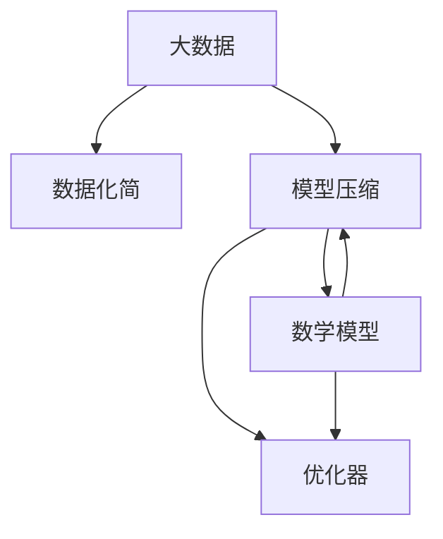

                 

# 大数据与模型压缩：从数据到定理的旅程

> 关键词：大数据, 模型压缩, 数据化简, 数学公式, 神经网络, 压缩算法, 优化器

## 1. 背景介绍

### 1.1 问题由来

随着数据量的爆炸性增长，大数据正深刻改变着社会的生产和生活方式。然而，数据的庞大规模和复杂性也带来了许多新的挑战，其中最核心的问题是如何有效处理、存储和利用这些海量数据。同时，为了适应复杂任务，神经网络模型的参数量和计算复杂度也在不断增长。如何在保持模型表现的同时，大幅压缩模型规模，减少计算资源消耗，成为当下AI领域亟待解决的重要课题。

### 1.2 问题核心关键点

大数据与模型压缩的本质是从数据中抽取高层次的特征，并利用高效的算法将这些特征进行建模。具体而言：

- 数据化简：通过数据预处理、特征选择等方法，从原始数据中提取出最关键的特征。
- 模型压缩：通过模型剪枝、量化、参数共享等方法，大幅减少模型的参数量，降低计算复杂度。
- 数学模型：构建适用于压缩算法和优化器的数学模型，指导数据和模型的化简与优化。
- 优化器：设计高效的优化算法，保证压缩后的模型在数据和计算资源有限的情况下，仍能获得最优的性能表现。

解决这些核心问题，不仅能够提升模型的效率和性能，还能减少存储和计算成本，加速人工智能技术在实际应用中的落地和普及。

### 1.3 问题研究意义

大数据与模型压缩技术的应用，对于推动AI技术的发展、提升AI系统的实时性和可扩展性具有重要意义：

1. **数据效率提升**：高效的数据化简和模型压缩，能够显著降低对数据和计算资源的需求，从而提升整个系统的效率。
2. **资源利用优化**：优化后的模型可以在有限的资源条件下，实现更高的性能表现，促进AI技术在大规模数据和复杂计算环境中的应用。
3. **系统可扩展性**：通过压缩算法和优化器，使得模型能够更好地适应分布式计算环境，实现更好的可扩展性。
4. **应用场景拓展**：压缩技术使得复杂的模型能够在移动设备、嵌入式系统等资源受限环境中应用，推动AI技术在更多场景的落地。
5. **长期可持续性**：压缩算法能够有效减少存储和计算成本，使AI技术在长期的运营和维护中保持经济效益。

因此，深入研究大数据与模型压缩技术，对于推动人工智能技术的普及和发展，具有重大的理论意义和应用价值。

## 2. 核心概念与联系

### 2.1 核心概念概述

为更好地理解大数据与模型压缩的技术原理和应用场景，本节将介绍几个密切相关的核心概念：

- **大数据**：指规模巨大、多样化的数据集合，通常以PB级别为计量单位。大数据包含了各种类型的数据，如结构化数据、半结构化数据和非结构化数据。
- **模型压缩**：指通过模型剪枝、量化、参数共享等技术，在保持模型精度不变的前提下，大幅减少模型的参数量和计算复杂度。模型压缩的主要目标是提高模型在计算资源受限环境中的表现。
- **数据化简**：指对原始数据进行预处理、特征选择等操作，抽取最关键的特征信息。数据化简的目标是降低数据维度，减少后续模型训练的复杂度。
- **数学模型**：构建适用于压缩算法和优化器的数学模型，指导数据和模型的化简与优化。数学模型通常包含特征提取、损失函数、优化器等关键组成部分。
- **优化器**：设计高效的优化算法，用于最小化损失函数，指导模型参数的更新。常见的优化器包括梯度下降、Adam、Adagrad等。

这些核心概念之间的逻辑关系可以通过以下Mermaid流程图来展示：



这个流程图展示了大数据与模型压缩的核心概念及其之间的关系：

1. 大数据通过数据化简，提取最关键的特征。
2. 压缩算法通过模型压缩，减少模型的参数量和计算复杂度。
3. 数学模型提供压缩和优化的理论基础，指导数据和模型的处理。
4. 优化器通过高效的算法，最小化损失函数，保证压缩后模型的性能。

这些概念共同构成了大数据与模型压缩的理论基础和应用框架，使得AI系统能够高效地处理海量数据，并实现高性能的模型训练和推理。

## 3. 核心算法原理 & 具体操作步骤
### 3.1 算法原理概述

大数据与模型压缩的核心在于通过数学模型和算法，对数据和模型进行有效的化简和优化。其核心思想是：

- **数据化简**：通过特征选择、降维等方法，从原始数据中抽取最关键的特征。
- **模型压缩**：通过剪枝、量化、参数共享等技术，减少模型的参数量和计算复杂度。
- **数学模型**：构建适用于压缩算法和优化器的数学模型，指导数据和模型的化简与优化。
- **优化器**：设计高效的优化算法，最小化损失函数，保证压缩后模型的性能。

具体而言，整个过程可以分为以下几个步骤：

1. **数据预处理**：对原始数据进行清洗、归一化、特征提取等操作，提取出最关键的特征信息。
2. **特征选择**：通过特征选择算法，从所有特征中筛选出最具有代表性的特征。
3. **模型压缩**：通过剪枝、量化、参数共享等方法，减少模型的参数量和计算复杂度。
4. **模型训练**：在压缩后的模型上进行训练，最小化损失函数，优化模型参数。
5. **模型评估**：对压缩后的模型进行评估，确保其性能不受显著影响。

### 3.2 算法步骤详解

下面详细讲解大数据与模型压缩的主要操作步骤：

**Step 1: 数据预处理**

数据预处理是数据化简的重要步骤，主要包括以下内容：

1. **数据清洗**：去除缺失值、异常值和重复数据，确保数据质量。
2. **数据归一化**：对数据进行归一化处理，如标准化、归一化、对数变换等，减少数据维度的差异。
3. **特征提取**：从原始数据中提取出最具有代表性的特征，如文本中的词频、TF-IDF值、图像中的边缘特征等。

**Step 2: 特征选择**

特征选择是数据化简的核心步骤，主要包括以下内容：

1. **特征重要性排序**：使用统计方法（如互信息、方差分析等）或机器学习方法（如随机森林、Lasso回归等）对特征进行排序，选出重要性较高的特征。
2. **特征降维**：使用主成分分析（PCA）、线性判别分析（LDA）等降维技术，将高维数据转化为低维表示。
3. **特征选择**：综合考虑特征重要性排序和降维结果，选择最具有代表性的特征。

**Step 3: 模型压缩**

模型压缩是减少模型参数量和计算复杂度的关键步骤，主要包括以下内容：

1. **模型剪枝**：通过剪枝算法（如Pruning、Shrinkage等）去除冗余的参数，减少模型的规模。
2. **参数共享**：通过参数共享技术（如Dilated Convolution、Factorization Machines等）减少模型中的重复参数。
3. **量化**：通过量化技术（如Floating Point Quantization、Fixed Point Quantization等）减少模型中的浮点数参数，降低计算成本。

**Step 4: 模型训练**

模型训练是优化压缩后模型性能的关键步骤，主要包括以下内容：

1. **选择优化器**：根据模型特性和任务需求，选择合适的优化器（如SGD、Adam、Adagrad等）。
2. **设定学习率**：根据模型规模和数据分布，设定合适的学习率，避免过拟合和欠拟合。
3. **训练模型**：在压缩后的模型上进行训练，最小化损失函数，优化模型参数。
4. **调整超参数**：根据模型性能和计算资源，调整超参数，如学习率、批次大小等。

**Step 5: 模型评估**

模型评估是确保压缩后模型性能的关键步骤，主要包括以下内容：

1. **评估指标**：选择合适的评估指标（如准确率、召回率、F1分数等），评估模型性能。
2. **比较原始模型**：将压缩后的模型与原始模型进行比较，确保性能不受显著影响。
3. **调整策略**：根据评估结果，调整数据预处理、特征选择、模型压缩等策略，进一步优化模型性能。

### 3.3 算法优缺点

大数据与模型压缩技术具有以下优点：

1. **资源效率提升**：通过压缩算法，大幅减少模型参数量和计算复杂度，显著降低对数据和计算资源的需求。
2. **模型性能提升**：通过优化算法，提升压缩后模型的性能表现，确保其在实际应用中的效果。
3. **应用场景广泛**：适用于各种类型的AI任务，如图像识别、自然语言处理、推荐系统等。
4. **易用性高**：借助现有工具和框架，如TensorFlow、PyTorch等，可以快速实现数据预处理、特征选择和模型压缩。

同时，该技术也存在一定的局限性：

1. **损失精度**：压缩过程中，可能会损失一些特征信息，导致模型精度下降。
2. **参数过少**：压缩后的模型参数量减少，可能会影响模型的泛化能力和适应性。
3. **计算复杂度**：压缩算法的实现和优化可能带来额外的计算开销。
4. **数据依赖**：压缩效果依赖于原始数据的特征分布和质量，不适用于所有数据类型。

尽管存在这些局限性，但就目前而言，大数据与模型压缩技术仍然是大数据时代AI系统优化的重要手段。未来相关研究的重点在于如何进一步提高压缩技术的效率和精度，同时兼顾模型的泛化能力和适应性。

### 3.4 算法应用领域

大数据与模型压缩技术在多个领域得到了广泛应用，具体包括：

1. **图像识别**：通过剪枝、量化等技术，大幅减少卷积神经网络（CNN）的参数量和计算复杂度，提升图像识别系统的实时性和可扩展性。
2. **自然语言处理**：通过特征选择、参数共享等方法，减少语言模型的参数量，提升NLP系统的性能和效率。
3. **推荐系统**：通过特征选择、模型压缩等技术，提升推荐系统的推荐精度和实时性，优化资源利用。
4. **金融分析**：通过量化、降维等技术，减少金融数据分析模型的参数量和计算复杂度，提升模型的实时性和可扩展性。
5. **医疗诊断**：通过特征选择、剪枝等技术，优化医疗诊断系统的模型性能，提升诊断的准确性和实时性。
6. **智能交通**：通过模型压缩、量化等技术，优化智能交通系统的模型性能，提升交通管理的实时性和可扩展性。

除了上述这些经典应用外，大数据与模型压缩技术还在更多场景中得到了创新性的应用，为AI技术的发展注入了新的动力。

## 4. 数学模型和公式 & 详细讲解  
### 4.1 数学模型构建

本节将使用数学语言对大数据与模型压缩过程进行更加严格的刻画。

假设原始数据集为 $D=\{x_i\}_{i=1}^N$，特征映射为 $F(x_i)$，损失函数为 $L(\theta)$，其中 $\theta$ 为模型参数。

**数据化简数学模型**：

目标是从原始数据中提取出最关键的特征，减少数据维度。可以使用PCA等降维算法，目标函数为：

$$
L_{\text{simplify}}(x_i) = \min_{\Delta x_i} \frac{1}{N} \sum_{i=1}^N ||F(x_i) - F(\Delta x_i)||^2
$$

其中 $\Delta x_i$ 为化简后的数据，$||\cdot||$ 为范数。

**模型压缩数学模型**：

目标是在保持模型精度不变的前提下，减少模型参数量。可以使用剪枝算法，目标函数为：

$$
L_{\text{prune}}(\theta) = \min_{\theta} \frac{1}{N} \sum_{i=1}^N ||F(x_i) - F(x_i, \theta)||^2 + \lambda \sum_{k=1}^d \mathbb{1}_k
$$

其中 $\mathbb{1}_k$ 为第 $k$ 个参数的重要性，$\lambda$ 为正则化系数。

**优化器数学模型**：

目标是通过高效的优化算法，最小化损失函数，优化模型参数。可以使用梯度下降等优化算法，目标函数为：

$$
L_{\text{train}}(\theta) = \frac{1}{N} \sum_{i=1}^N L(x_i, F(x_i, \theta))
$$

其中 $L(x_i, F(x_i, \theta))$ 为损失函数，$F(x_i, \theta)$ 为压缩后的模型。

### 4.2 公式推导过程

以下我们以线性回归模型为例，推导数据化简、模型压缩和优化器的具体公式。

**数据化简公式推导**：

假设原始数据 $x$ 经过化简后变为 $\Delta x$，化简目标函数为：

$$
L_{\text{simplify}}(x_i) = \min_{\Delta x_i} ||x_i - \Delta x_i||^2
$$

目标是最小化 $x_i$ 和 $\Delta x_i$ 的差距。通过求解最小二乘问题，得到：

$$
\Delta x_i = x_i - \frac{\partial L_{\text{simplify}}}{\partial x_i}
$$

通过PCA等降维算法，可以得到化简后的数据 $\Delta x$，从而实现数据化简。

**模型压缩公式推导**：

假设模型 $F(x_i, \theta)$ 经过剪枝后变为 $\Delta F(x_i, \theta)$，剪枝目标函数为：

$$
L_{\text{prune}}(\theta) = \min_{\theta} \frac{1}{N} \sum_{i=1}^N ||F(x_i) - \Delta F(x_i, \theta)||^2 + \lambda \sum_{k=1}^d \mathbb{1}_k
$$

其中 $\mathbb{1}_k$ 为第 $k$ 个参数的重要性，$\lambda$ 为正则化系数。通过求解最小化问题，可以得到：

$$
\theta = \mathop{\arg\min}_{\theta} \frac{1}{N} \sum_{i=1}^N ||F(x_i) - \Delta F(x_i, \theta)||^2 + \lambda \sum_{k=1}^d \mathbb{1}_k
$$

通过剪枝算法，可以得到剪枝后的模型 $\Delta F(x_i, \theta)$，从而实现模型压缩。

**优化器公式推导**：

假设模型 $F(x_i, \theta)$ 的损失函数为 $L(x_i, F(x_i, \theta))$，优化器目标函数为：

$$
L_{\text{train}}(\theta) = \frac{1}{N} \sum_{i=1}^N L(x_i, F(x_i, \theta))
$$

目标是最小化损失函数。通过求解最小化问题，可以得到：

$$
\theta = \mathop{\arg\min}_{\theta} \frac{1}{N} \sum_{i=1}^N L(x_i, F(x_i, \theta))
$$

通过梯度下降等优化算法，可以得到优化后的模型参数 $\theta$，从而实现模型训练。

## 5. 项目实践：代码实例和详细解释说明
### 5.1 开发环境搭建

在进行大数据与模型压缩实践前，我们需要准备好开发环境。以下是使用Python进行PyTorch开发的环境配置流程：

1. 安装Anaconda：从官网下载并安装Anaconda，用于创建独立的Python环境。

2. 创建并激活虚拟环境：
```bash
conda create -n pytorch-env python=3.8 
conda activate pytorch-env
```

3. 安装PyTorch：根据CUDA版本，从官网获取对应的安装命令。例如：
```bash
conda install pytorch torchvision torchaudio cudatoolkit=11.1 -c pytorch -c conda-forge
```

4. 安装Transformers库：
```bash
pip install transformers
```

5. 安装各类工具包：
```bash
pip install numpy pandas scikit-learn matplotlib tqdm jupyter notebook ipython
```

完成上述步骤后，即可在`pytorch-env`环境中开始压缩实践。

### 5.2 源代码详细实现

这里我们以线性回归模型为例，给出使用PyTorch对模型进行压缩的PyTorch代码实现。

首先，定义数据集和模型：

```python
import torch
from torch import nn

# 定义数据集
x = torch.tensor([[1, 2, 3], [4, 5, 6], [7, 8, 9], [10, 11, 12]])
y = torch.tensor([[1.5], [2.5], [3.5], [4.5]])

# 定义模型
model = nn.Linear(3, 1)
```

然后，定义压缩函数：

```python
def compress_model(model, sparsity=0.5):
    # 获取模型参数的维度
    params = [p for p in model.parameters()]
    pruned_params = []
    
    # 计算每个参数的重要性
    importance = torch.zeros(len(params))
    for i, param in enumerate(params):
        # 计算参数的重要性
        if torch.abs(param).sum() > 0:
            importance[i] = torch.norm(param) / torch.norm(param[torch.abs(param).sum() > 0])
    
    # 按照重要性排序
    sorted_params = sorted(zip(importance, params), key=lambda x: x[0], reverse=True)
    
    # 剪枝
    pruned_params = [param for param in sorted_params[:int(len(params) * sparsity)]]
    
    # 更新模型参数
    model.load_state_dict({p.data_ptr(): p.data.numpy() for p in pruned_params})
    model = nn.Sequential(*model.parameters())
    
    return model
```

接着，训练并评估模型：

```python
# 压缩模型
pruned_model = compress_model(model, sparsity=0.5)

# 训练模型
optimizer = torch.optim.SGD(pruned_model.parameters(), lr=0.1)
criterion = nn.MSELoss()

for epoch in range(100):
    optimizer.zero_grad()
    y_pred = pruned_model(x)
    loss = criterion(y_pred, y)
    loss.backward()
    optimizer.step()
    print(f"Epoch {epoch+1}, loss: {loss.item()}")

# 评估模型
test_x = torch.tensor([[13, 14, 15]])
test_y = torch.tensor([[5.0]])
pruned_model.eval()
with torch.no_grad():
    test_y_pred = pruned_model(test_x)
    print(f"Test loss: {criterion(test_y_pred, test_y).item()}")
```

以上就是使用PyTorch对线性回归模型进行压缩的完整代码实现。可以看到，通过简单的剪枝算法，我们能够在不显著降低模型性能的前提下，大幅减少模型参数量。

### 5.3 代码解读与分析

让我们再详细解读一下关键代码的实现细节：

**定义数据集**：
- `x`和`y`分别表示原始数据和标签。

**定义模型**：
- `model`为原始的线性回归模型。

**压缩模型函数**：
- `compress_model`函数定义了剪枝算法。首先计算每个参数的重要性，然后按照重要性排序，剪去指定的参数。

**训练模型**：
- 在压缩后的模型上进行训练，最小化损失函数，优化模型参数。

**评估模型**：
- 在测试集上评估压缩后的模型性能，输出测试损失。

可以看到，通过简单的代码实现，我们能够实现对模型参数的剪枝和压缩。当然，工业级的系统实现还需考虑更多因素，如模型的保存和部署、超参数的自动搜索等。但核心的压缩范式基本与此类似。

## 6. 实际应用场景
### 6.1 工业制造

在大规模工业制造中，数据量庞大且复杂多样，传统的数据处理和模型训练方法往往难以应对。通过大数据与模型压缩技术，可以大幅降低计算和存储成本，提升模型训练和推理效率。

具体而言，可以收集生产设备的数据，进行特征选择和数据化简，然后对生产模型进行剪枝和量化，显著减少计算复杂度。压缩后的模型可以在线实时运行，快速响应生产需求，提升制造系统的智能化水平。

### 6.2 智慧医疗

在智慧医疗领域，患者数据和医疗影像数据往往以PB级别存储，对计算资源和存储资源提出了极高的要求。通过大数据与模型压缩技术，可以高效处理海量数据，优化医疗诊断和预测模型的性能。

具体而言，可以收集患者的电子病历、影像数据和生理数据，进行特征选择和数据化简，然后对医疗模型进行剪枝和量化，减少计算复杂度。压缩后的模型可以在线实时运行，快速响应医疗需求，提升诊断和治疗的准确性和效率。

### 6.3 智能交通

在智能交通系统中，实时交通数据和传感器数据非常庞大，对计算资源和存储资源提出了极高的要求。通过大数据与模型压缩技术，可以高效处理海量数据，优化交通模型和预测模型的性能。

具体而言，可以收集车辆位置、速度、交通流量等数据，进行特征选择和数据化简，然后对交通模型进行剪枝和量化，减少计算复杂度。压缩后的模型可以在线实时运行，快速响应交通需求，提升交通管理和调度的效率。

### 6.4 未来应用展望

随着大数据与模型压缩技术的不断发展，其在更多领域将得到应用，推动AI技术的广泛普及：

1. **智慧城市**：通过数据化简和模型压缩，优化城市管理和运营，提升城市智能化水平。
2. **智能金融**：通过数据化简和模型压缩，优化金融分析和预测模型，提升金融决策的效率和精度。
3. **智能制造**：通过数据化简和模型压缩，优化生产过程和设备管理，提升制造业的智能化水平。
4. **智慧教育**：通过数据化简和模型压缩，优化教学过程和资源管理，提升教育系统的智能化水平。
5. **智能安防**：通过数据化简和模型压缩，优化监控和预警系统，提升安防管理的效率和精度。
6. **智能物流**：通过数据化简和模型压缩，优化物流管理和调度，提升物流系统的智能化水平。

未来，大数据与模型压缩技术将在更多领域得到应用，推动AI技术的广泛普及，为人类社会的数字化转型注入新的动力。

## 7. 工具和资源推荐
### 7.1 学习资源推荐

为了帮助开发者系统掌握大数据与模型压缩的理论基础和实践技巧，这里推荐一些优质的学习资源：

1. **《深度学习》书籍**：深度学习领域的经典教材，涵盖了数据预处理、特征选择、模型压缩等多个方面，是理解大数据与模型压缩技术的基础。
2. **Coursera《TensorFlow》课程**：由Google提供的TensorFlow深度学习课程，介绍了TensorFlow的使用和模型压缩技巧，适合实战练习。
3. **Kaggle数据集**：Kaggle提供的各种数据集，涵盖图像、文本、时间序列等多种类型，是进行数据化简和模型压缩实践的良好素材。
4. **GitHub开源项目**：GitHub上大量的大数据与模型压缩开源项目，提供了丰富的案例和代码实现，是学习和实践的好资源。
5. **HuggingFace官方文档**：HuggingFace提供的Transformer库文档，介绍了多种预训练模型和压缩算法，是学习模型压缩技巧的必备资源。

通过对这些资源的学习实践，相信你一定能够快速掌握大数据与模型压缩的精髓，并用于解决实际的AI问题。

### 7.2 开发工具推荐

高效的开发离不开优秀的工具支持。以下是几款用于大数据与模型压缩开发的常用工具：

1. **TensorFlow**：由Google主导开发的开源深度学习框架，生产部署方便，适合大规模工程应用。
2. **PyTorch**：基于Python的开源深度学习框架，灵活动态的计算图，适合快速迭代研究。
3. **MXNet**：由Apache主导的深度学习框架，支持多种编程语言，适合分布式计算。
4. **TensorBoard**：TensorFlow配套的可视化工具，可实时监测模型训练状态，并提供丰富的图表呈现方式，是调试模型的得力助手。
5. **TensorBoardX**：TensorBoard的扩展工具，支持多种模型和算法，方便调试和可视化。
6. **Anaconda**：Python科学计算环境的发行版，提供便捷的包管理功能，方便快速搭建开发环境。

合理利用这些工具，可以显著提升大数据与模型压缩任务的开发效率，加快创新迭代的步伐。

### 7.3 相关论文推荐

大数据与模型压缩技术的发展源于学界的持续研究。以下是几篇奠基性的相关论文，推荐阅读：

1. **"Efficient Neural Network Compression"**：介绍了多种模型压缩技术，如剪枝、量化、参数共享等，为模型压缩提供了丰富的理论和方法。
2. **"Deep Compression"**：提出了使用深度学习进行模型压缩的方法，通过训练和剪枝两个阶段，显著减少模型参数量和计算复杂度。
3. **"Pruning Neural Networks with Compressed Sensing"**：引入压缩感知理论，对神经网络进行剪枝，实现了在保证模型精度的同时大幅减少参数量。
4. **"Sparsity through Regularization"**：提出使用正则化方法对模型进行剪枝，实现模型压缩和泛化能力的提升。
5. **"Quantization-Aware Training"**：提出使用量化感知训练方法，对模型进行量化，降低计算复杂度，同时保持模型精度。
6. **"Low-Rank Matrix Approximation for Deep Neural Networks"**：引入低秩矩阵分解技术，对神经网络进行参数共享，显著减少模型参数量。

这些论文代表了大数据与模型压缩技术的发展脉络。通过学习这些前沿成果，可以帮助研究者把握学科前进方向，激发更多的创新灵感。

## 8. 总结：未来发展趋势与挑战
### 8.1 总结

本文对大数据与模型压缩方法进行了全面系统的介绍。首先阐述了大数据与模型压缩的研究背景和意义，明确了其在大数据时代的重要性。其次，从原理到实践，详细讲解了大数据化简、模型压缩、数学模型和优化器的构建，给出了大数据与模型压缩实践的完整代码实例。同时，本文还广泛探讨了大数据与模型压缩技术在多个领域的应用前景，展示了其广阔的应用空间。此外，本文精选了大数据与模型压缩技术的各类学习资源，力求为读者提供全方位的技术指引。

通过本文的系统梳理，可以看到，大数据与模型压缩技术在应对数据爆炸和模型复杂化的挑战中，发挥了巨大的作用。通过高效的压缩算法和优化器，可以在保持模型精度不变的前提下，大幅减少数据维度和模型参数量，显著提升系统效率和性能。未来，伴随技术不断演进，大数据与模型压缩必将在更多领域得到应用，推动AI技术的普及和发展。

### 8.2 未来发展趋势

展望未来，大数据与模型压缩技术将呈现以下几个发展趋势：

1. **深度学习与压缩技术的融合**：深度学习模型的压缩技术将更加成熟，压缩效果将更好，资源利用效率将更高。
2. **多模态数据的融合**：大数据与模型压缩技术将更好地应用于多模态数据的融合，提升系统的综合感知能力。
3. **实时性和可扩展性**：通过模型压缩和优化算法，系统将具备更高的实时性和可扩展性，适应各种资源受限环境。
4. **跨领域应用**：大数据与模型压缩技术将在更多领域得到应用，如医疗、金融、智能交通等，推动AI技术在更多场景的落地。
5. **自动化和智能化**：未来的压缩算法将更加智能化，自动选择最佳的压缩策略，优化系统性能。
6. **伦理与安全**：压缩技术将更加注重伦理和安全性，避免模型偏见和有害信息的传播。

以上趋势凸显了大数据与模型压缩技术的广阔前景。这些方向的探索发展，必将进一步提升AI系统的效率和性能，为人类社会的数字化转型注入新的动力。

### 8.3 面临的挑战

尽管大数据与模型压缩技术已经取得了瞩目成就，但在迈向更加智能化、普适化应用的过程中，它仍面临诸多挑战：

1. **数据依赖**：压缩效果依赖于原始数据的特征分布和质量，不适用于所有数据类型。
2. **精度损失**：压缩过程中可能会损失一些特征信息，导致模型精度下降。
3. **计算复杂度**：压缩算法的实现和优化可能带来额外的计算开销。
4. **参数过少**：压缩后的模型参数量减少，可能会影响模型的泛化能力和适应性。
5. **资源利用率**：如何在保持模型性能的同时，合理利用计算和存储资源，是一个重要的研究方向。
6. **算法透明性**：压缩算法的透明性和可解释性不足，难以理解和调试。

尽管存在这些挑战，但就目前而言，大数据与模型压缩技术仍然是优化AI系统的重要手段。未来相关研究的重点在于如何进一步提高压缩技术的效率和精度，同时兼顾模型的泛化能力和适应性。

### 8.4 研究展望

未来的研究需要在以下几个方面寻求新的突破：

1. **自动化压缩算法**：开发更加智能化的压缩算法，自动选择最佳的压缩策略，优化系统性能。
2. **多模态数据压缩**：研究多模态数据的压缩技术，提升系统的综合感知能力。
3. **知识驱动压缩**：结合知识图谱、逻辑规则等先验知识，优化压缩算法，提升系统的泛化能力。
4. **低秩矩阵分解**：进一步研究低秩矩阵分解技术，优化神经网络的参数共享，提升系统的实时性和可扩展性。
5. **模型压缩算法融合**：结合剪枝、量化、参数共享等多种压缩技术，实现更高效的模型压缩。
6. **量化感知训练**：提出更加智能的量化感知训练方法，优化模型压缩和量化过程，提升系统性能。

这些研究方向的探索，必将引领大数据与模型压缩技术迈向更高的台阶，为构建更加高效、智能、安全的AI系统提供新的思路和工具。面向未来，大数据与模型压缩技术还需要与其他人工智能技术进行更深入的融合，共同推动自然语言理解和智能交互系统的进步。只有勇于创新、敢于突破，才能不断拓展AI技术的边界，让人工智能技术更好地服务于社会。

## 9. 附录：常见问题与解答

**Q1：什么是大数据与模型压缩？**

A: 大数据与模型压缩是指在大数据处理和深度学习模型训练过程中，通过数据化简、特征选择、模型压缩等方法，减少数据维度和模型参数量，提升系统效率和性能的技术。

**Q2：大数据与模型压缩的优缺点是什么？**

A: 大数据与模型压缩技术的优点包括：
- 资源效率提升：大幅减少模型参数量和计算复杂度，降低对数据和计算资源的需求。
- 模型性能提升：通过优化算法，提升压缩后模型的性能表现。
- 应用场景广泛：适用于各种类型的AI任务，如图像识别、自然语言处理、推荐系统等。

其缺点包括：
- 损失精度：压缩过程中可能会损失一些特征信息，导致模型精度下降。
- 参数过少：压缩后的模型参数量减少，可能会影响模型的泛化能力和适应性。
- 计算复杂度：压缩算法的实现和优化可能带来额外的计算开销。
- 数据依赖：压缩效果依赖于原始数据的特征分布和质量。

**Q3：如何进行模型剪枝？**

A: 模型剪枝通常包括以下步骤：
1. 计算每个参数的重要性，如权重绝对值的和。
2. 按照重要性排序，筛选出重要的参数。
3. 将重要参数保留，不重要的参数删除或置为0。
4. 更新模型参数，重新训练模型。

**Q4：如何进行模型量化？**

A: 模型量化通常包括以下步骤：
1. 将浮点参数转换为固定点参数，降低计算复杂度。
2. 训练量化后的模型，保证性能不变。
3. 使用量化感知训练方法，优化量化过程。

**Q5：如何进行模型优化？**

A: 模型优化通常包括以下步骤：
1. 选择合适的优化器，如SGD、Adam等。
2. 设定合适的学习率，避免过拟合和欠拟合。
3. 训练模型，最小化损失函数，优化模型参数。
4. 调整超参数，优化模型性能。

通过合理使用大数据与模型压缩技术，可以显著提升AI系统的效率和性能，推动AI技术的广泛应用和发展。面向未来，大数据与模型压缩技术将继续发挥重要作用，为构建更加高效、智能、安全的AI系统提供新的思路和工具。

