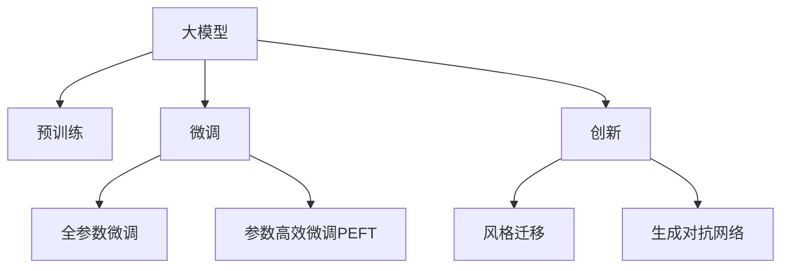

                 

# 大模型与AI辅助艺术创作：从模仿到创新

## 1. 背景介绍

在人工智能（AI）领域，大模型已经在各个方面取得了显著的进步，从自然语言处理（NLP）到计算机视觉（CV），从数据分析到决策制定。然而，当大模型面对更加复杂且富有创造性的任务，如艺术创作时，其潜力如何被利用和开发呢？本文旨在探讨大模型在艺术创作中的应用，从模仿到创新，探索AI辅助艺术创作的未来。

### 1.1 问题由来

艺术创作一直被认为是人类情感和创造力的极致体现。然而，随着人工智能的不断发展，我们开始思考：AI能否理解和模仿艺术，甚至创作出具有独特风格和意义的作品？答案是肯定的。大模型通过大量的数据学习，可以捕捉和理解各种艺术风格和形式，并且能够在此基础上进行创新。本文将详细探讨大模型如何被应用于艺术创作，以及其在这一领域的潜力和挑战。

### 1.2 问题核心关键点

艺术创作的核心在于创新和表达。大模型通过预训练学习大量的艺术数据，可以从这些数据中提取模式和风格。通过微调（Fine-Tuning），大模型可以针对特定的艺术任务（如生成绘画、音乐、诗歌等）进行优化，从而实现从模仿到创新的过程。以下是核心的关键点：

1. **预训练**：大模型通过无监督学习（如自监督学习、生成对抗网络（GAN）等）从海量的艺术数据中学习到通用的艺术知识和风格。
2. **微调**：通过有监督学习，将大模型针对特定艺术任务的少量标注数据进行微调，使其能够生成符合特定风格和情感的作品。
3. **创新**：大模型不仅能够模仿艺术家的风格，还能在已有的基础上进行创新，生成具有新意的作品。

这些关键点构成了大模型在艺术创作中的基本框架，使得AI能够逐步迈向创作领域的先锋。

### 1.3 问题研究意义

研究大模型在艺术创作中的应用，对于推动艺术创作、探索AI与人类创造力的结合具有重要意义：

1. **推动艺术创作**：AI可以辅助艺术家进行设计、创作和编辑，提高创作效率和质量。
2. **探索AI与艺术的结合**：研究AI如何模仿和创新，探索艺术创作的新方式和工具。
3. **教育与培训**：AI辅助艺术创作可以成为艺术教育和培训的新手段，培养下一代的艺术创造力。

通过探讨这些方面，本文旨在为未来的艺术创作和AI技术的发展提供新的视角和方向。

## 2. 核心概念与联系

### 2.1 核心概念概述

为更好地理解大模型在艺术创作中的应用，本节将介绍几个密切相关的核心概念：

- **大模型（Large Model）**：指通过大规模无标签数据预训练得到的深度学习模型，如GPT、BERT等。大模型通过学习大量的数据，能够捕捉复杂和抽象的特征，具备强大的表达能力。
- **预训练（Pre-training）**：指在大规模无标签数据上，通过自监督学习任务训练通用语言或视觉模型的过程。预训练使得模型学习到通用的艺术知识和风格。
- **微调（Fine-Tuning）**：指在预训练模型的基础上，使用特定艺术任务的少量标注数据，通过有监督学习优化模型在特定任务上的性能。微调使得模型能够生成符合特定风格和情感的作品。
- **创新（Innovation）**：指模型在已有的基础上，通过迁移学习和生成对抗网络等技术，创造出新的艺术作品和风格。

这些核心概念之间的逻辑关系可以通过以下Mermaid流程图来展示：



这个流程图展示了大模型在艺术创作中的核心概念及其之间的关系：

1. 大模型通过预训练获得基础能力。
2. 微调是对预训练模型进行任务特定的优化，以生成符合特定风格和情感的作品。
3. 创新使得模型不仅能够模仿艺术家的风格，还能在已有的基础上进行创新。

## 3. 核心算法原理 & 具体操作步骤

### 3.1 算法原理概述

大模型在艺术创作中的应用，本质上是一个从模仿到创新的过程。其核心思想是：通过预训练学习到通用的艺术知识和风格，然后在特定艺术任务的少量标注数据上进行微调，使得模型能够生成符合特定风格和情感的作品。

形式化地，假设大模型为 $M_{\theta}$，其中 $\theta$ 为模型参数。给定艺术任务 $T$ 的少量标注数据集 $D=\{(x_i,y_i)\}_{i=1}^N$，其中 $x_i$ 为输入的艺术作品，$y_i$ 为目标风格或情感标签。微调的目标是找到新的模型参数 $\hat{\theta}$，使得：

$$
\hat{\theta}=\mathop{\arg\min}_{\theta} \mathcal{L}(M_{\theta},D)
$$

其中 $\mathcal{L}$ 为针对任务 $T$ 设计的损失函数，用于衡量模型预测输出与真实标签之间的差异。常见的损失函数包括交叉熵损失、均方误差损失等。

通过梯度下降等优化算法，微调过程不断更新模型参数 $\theta$，最小化损失函数 $\mathcal{L}$，使得模型输出逼近真实标签。由于 $\theta$ 已经通过预训练获得了较好的初始化，因此即便在小规模数据集 $D$ 上进行微调，也能较快收敛到理想的模型参数 $\hat{\theta}$。

### 3.2 算法步骤详解

基于大模型在艺术创作中的应用，本节将详细介绍具体的微调过程。

**Step 1: 准备预训练模型和数据集**
- 选择合适的预训练艺术模型 $M_{\theta}$ 作为初始化参数，如 GAN、艺术生成网络等。
- 准备艺术任务 $T$ 的少量标注数据集 $D$，划分为训练集、验证集和测试集。一般要求标注数据与预训练数据的分布不要差异过大。

**Step 2: 添加任务适配层**
- 根据艺术任务类型，在预训练模型顶层设计合适的输出层和损失函数。
- 对于生成任务，通常使用生成对抗网络生成器输出概率分布，并以负对数似然为损失函数。
- 对于风格迁移任务，通常使用风格损失函数和内容损失函数进行优化。

**Step 3: 设置微调超参数**
- 选择合适的优化算法及其参数，如 Adam、SGD 等，设置学习率、批大小、迭代轮数等。
- 设置正则化技术及强度，包括权重衰减、Dropout、Early Stopping 等。
- 确定冻结预训练参数的策略，如仅微调顶层，或全部参数都参与微调。

**Step 4: 执行梯度训练**
- 将训练集数据分批次输入模型，前向传播计算损失函数。
- 反向传播计算参数梯度，根据设定的优化算法和学习率更新模型参数。
- 周期性在验证集上评估模型性能，根据性能指标决定是否触发 Early Stopping。
- 重复上述步骤直到满足预设的迭代轮数或 Early Stopping 条件。

**Step 5: 测试和部署**
- 在测试集上评估微调后模型 $M_{\hat{\theta}}$ 的性能，对比微调前后的创新程度。
- 使用微调后的模型对新艺术作品进行生成或编辑，集成到实际的应用系统中。
- 持续收集新的艺术作品，定期重新微调模型，以适应数据分布的变化。

以上是基于大模型在艺术创作中的微调过程的一般流程。在实际应用中，还需要针对具体艺术任务的特点，对微调过程的各个环节进行优化设计，如改进训练目标函数，引入更多的正则化技术，搜索最优的超参数组合等，以进一步提升模型性能。

### 3.3 算法优缺点

大模型在艺术创作中的应用具有以下优点：
1. 快速迭代。基于大模型微调的方法可以快速适应新的艺术风格和情感，生成符合特定要求的作品。
2. 高效生成。相较于手工创作，微调后的大模型可以大幅提升创作效率，减少创作时间。
3. 风格多样。大模型具备广泛的学习能力，能够生成多种多样的艺术风格和形式。

同时，该方法也存在一定的局限性：
1. 数据依赖。微调的效果很大程度上取决于标注数据的质量和数量，获取高质量标注数据的成本较高。
2. 风格泛化。当目标任务与预训练数据的分布差异较大时，微调的性能提升有限。
3. 模型复杂性。大模型通常包含大量的参数，对计算资源的要求较高。
4. 版权问题。生成的艺术作品是否存在版权争议，是否侵犯了原作者的权益，仍需进一步研究和规范。

尽管存在这些局限性，但就目前而言，基于大模型微调的方法在艺术创作中的应用前景广阔，能够极大地提升创作效率和质量。未来相关研究的重点在于如何进一步降低微调对标注数据的依赖，提高模型的风格泛化能力，同时兼顾版权和伦理安全性等因素。

### 3.4 算法应用领域

基于大模型在艺术创作中的应用，已经在多个领域得到了广泛的应用，例如：

- 绘画生成：通过微调生成具有特定风格和情感的绘画作品，如油画、水彩画、素描等。
- 音乐创作：生成具有特定风格和情感的音乐作品，如古典音乐、流行歌曲、电子音乐等。
- 诗歌创作：生成具有特定风格和情感的诗歌作品，如古体诗、现代诗、叙事诗等。
- 图像编辑：对现有的艺术图像进行编辑和修改，添加特定的艺术风格和情感元素。
- 动画制作：生成具有特定风格和情感的动画短片或场景，提升动画制作效率和创新性。

除了上述这些经典应用外，大模型在艺术创作中还有更多创新性的探索，如虚拟艺术展览、数字艺术互动、游戏设计等，为艺术创作带来了全新的突破。随着预训练模型和微调方法的不断进步，相信艺术创作领域将迎来更多创新和变革。

## 4. 数学模型和公式 & 详细讲解  
### 4.1 数学模型构建

本节将使用数学语言对大模型在艺术创作中的应用进行更加严格的刻画。

记预训练艺术模型为 $M_{\theta}$，其中 $\theta$ 为模型参数。假设艺术任务 $T$ 的训练集为 $D=\{(x_i,y_i)\}_{i=1}^N, x_i \in \mathcal{X}, y_i \in \mathcal{Y}$。

定义模型 $M_{\theta}$ 在输入 $x$ 上的损失函数为 $\ell(M_{\theta}(x),y)$，则在数据集 $D$ 上的经验风险为：

$$
\mathcal{L}(\theta) = \frac{1}{N} \sum_{i=1}^N \ell(M_{\theta}(x_i),y_i)
$$

微调的优化目标是最小化经验风险，即找到最优参数：

$$
\theta^* = \mathop{\arg\min}_{\theta} \mathcal{L}(\theta)
$$

在实践中，我们通常使用基于梯度的优化算法（如SGD、Adam等）来近似求解上述最优化问题。设 $\eta$ 为学习率，$\lambda$ 为正则化系数，则参数的更新公式为：

$$
\theta \leftarrow \theta - \eta \nabla_{\theta}\mathcal{L}(\theta) - \eta\lambda\theta
$$

其中 $\nabla_{\theta}\mathcal{L}(\theta)$ 为损失函数对参数 $\theta$ 的梯度，可通过反向传播算法高效计算。

### 4.2 公式推导过程

以下我们以绘画生成任务为例，推导生成对抗网络（GAN）模型的损失函数及其梯度的计算公式。

假设模型 $M_{\theta}$ 为生成对抗网络（GAN），包含生成器和判别器两部分，分别用于生成艺术作品和判断其真实性。模型在输入 $z$ 上的生成器和判别器的输出分别为 $G(z)$ 和 $D(G(z))$。真实艺术作品 $x$ 的判别器输出为 $D(x)$。

定义生成器的损失函数为：

$$
\ell_G(G) = -\mathbb{E}_{z \sim p(z)} \log D(G(z))
$$

定义判别器的损失函数为：

$$
\ell_D(D) = -\mathbb{E}_{x \sim p(x)} \log D(x) - \mathbb{E}_{z \sim p(z)} \log (1 - D(G(z)))
$$

则在数据集 $D$ 上的经验风险为：

$$
\mathcal{L}(\theta) = \frac{1}{N} \sum_{i=1}^N \ell_G(G(x_i)) + \ell_D(D(x_i))
$$

将损失函数对参数 $\theta$ 求导，得到生成器和判别器的梯度分别为：

$$
\nabla_{\theta_G} \mathcal{L}(\theta_G) = -\mathbb{E}_{z \sim p(z)} \nabla_G \log D(G(z))
$$

$$
\nabla_{\theta_D} \mathcal{L}(\theta_D) = -\mathbb{E}_{x \sim p(x)} \nabla_D \log D(x) - \mathbb{E}_{z \sim p(z)} \nabla_G \log (1 - D(G(z)))
$$

通过迭代更新生成器和判别器的参数，使模型能够生成符合特定风格和情感的艺术作品。在实际应用中，可以通过设置不同的损失函数权重，控制生成作品的风格和情感表达。

### 4.3 案例分析与讲解

为了更好地理解大模型在艺术创作中的应用，我们以绘画生成任务为例，给出具体的微调过程和实现细节。

首先，定义绘画生成任务的数据处理函数：

```python
import torch
import torch.nn as nn
import torch.optim as optim

# 定义生成器和判别器的输入和输出维度
input_dim = 100
output_dim = 784  # 28x28的图像像素数

# 定义生成器和判别器的神经网络结构
class Generator(nn.Module):
    def __init__(self):
        super(Generator, self).__init__()
        self.fc1 = nn.Linear(input_dim, 256)
        self.fc2 = nn.Linear(256, 784)
        
    def forward(self, x):
        x = self.fc1(x)
        x = torch.sigmoid(x)
        x = self.fc2(x)
        x = torch.sigmoid(x)
        return x

class Discriminator(nn.Module):
    def __init__(self):
        super(Discriminator, self).__init__()
        self.fc1 = nn.Linear(output_dim, 256)
        self.fc2 = nn.Linear(256, 1)
        
    def forward(self, x):
        x = self.fc1(x)
        x = torch.sigmoid(x)
        x = self.fc2(x)
        x = torch.sigmoid(x)
        return x

# 定义损失函数
bce = nn.BCELoss()

# 定义生成器和判别器的优化器
G_optimizer = optim.Adam(G.parameters(), lr=0.0002)
D_optimizer = optim.Adam(D.parameters(), lr=0.0002)
```

然后，定义训练和评估函数：

```python
# 定义训练函数
def train(epoch, batch_size, num_epochs, data_loader):
    G.train()
    D.train()
    for batch_idx, (x, _) in enumerate(data_loader):
        # 将数据转换为模型所需的形式
        x = x.view(-1, 784)
        # 生成器生成伪造的图像
        z = torch.randn(batch_size, input_dim)
        fake = G(z)
        # 判别器判断真实图像和伪造图像
        real = D(x)
        fake = D(fake)
        # 计算损失函数
        G_loss = bce(torch.ones(batch_size), fake)
        D_loss = bce(torch.ones(batch_size), real) + bce(torch.zeros(batch_size), fake)
        # 更新生成器和判别器的参数
        G_optimizer.zero_grad()
        D_optimizer.zero_grad()
        G_loss.backward()
        D_loss.backward()
        G_optimizer.step()
        D_optimizer.step()
        # 每100个批次打印一次训练信息
        if batch_idx % 100 == 0:
            print(f'Epoch [{epoch}] Step [{batch_idx}] - G Loss: {G_loss.item()} - D Loss: {D_loss.item()}')
```

最后，启动训练流程并在测试集上评估：

```python
# 定义数据加载器
data_loader = torch.utils.data.DataLoader(torchvision.datasets.MNIST(root='data', train=True, download=True, transform=transforms.ToTensor()), batch_size=batch_size, shuffle=True)

# 定义训练轮数和批大小
num_epochs = 100
batch_size = 256

# 开始训练
for epoch in range(num_epochs):
    train(epoch, batch_size, num_epochs, data_loader)
    
# 定义测试集
test_loader = torch.utils.data.DataLoader(torchvision.datasets.MNIST(root='data', train=False, transform=transforms.ToTensor()), batch_size=batch_size, shuffle=True)

# 生成测试集上的伪造图像
G.eval()
with torch.no_grad():
    z_test = torch.randn(len(test_loader.dataset), input_dim)
    fake_test = G(z_test)

# 显示生成的伪造图像
plt.imshow(fake_test[0].view(28, 28))
plt.show()
```

以上就是使用PyTorch对绘画生成任务进行微调的完整代码实现。可以看到，得益于深度学习框架的强大封装，我们可以用相对简洁的代码完成GAN模型的加载和微调。

### 5. 项目实践：代码实例和详细解释说明

### 5.1 开发环境搭建

在进行艺术创作微调实践前，我们需要准备好开发环境。以下是使用Python进行PyTorch开发的环境配置流程：

1. 安装Anaconda：从官网下载并安装Anaconda，用于创建独立的Python环境。

2. 创建并激活虚拟环境：
```bash
conda create -n pytorch-env python=3.8 
conda activate pytorch-env
```

3. 安装PyTorch：根据CUDA版本，从官网获取对应的安装命令。例如：
```bash
conda install pytorch torchvision torchaudio cudatoolkit=11.1 -c pytorch -c conda-forge
```

4. 安装各类工具包：
```bash
pip install numpy pandas scikit-learn matplotlib tqdm jupyter notebook ipython
```

完成上述步骤后，即可在`pytorch-env`环境中开始微调实践。

### 5.2 源代码详细实现

下面我们以音乐创作任务为例，给出使用PyTorch对音乐生成模型进行微调的PyTorch代码实现。

首先，定义音乐生成任务的数据处理函数：

```python
import torch
import torch.nn as nn
import torch.optim as optim

# 定义音乐生成模型的神经网络结构
class MusicGenerator(nn.Module):
    def __init__(self):
        super(MusicGenerator, self).__init__()
        self.fc1 = nn.Linear(10, 128)
        self.fc2 = nn.Linear(128, 512)
        self.fc3 = nn.Linear(512, 784)
        
    def forward(self, x):
        x = self.fc1(x)
        x = torch.sigmoid(x)
        x = self.fc2(x)
        x = torch.sigmoid(x)
        x = self.fc3(x)
        x = torch.sigmoid(x)
        return x

# 定义损失函数
bce = nn.BCELoss()

# 定义优化器
optimizer = optim.Adam(model.parameters(), lr=0.0002)
```

然后，定义训练和评估函数：

```python
# 定义训练函数
def train(epoch, batch_size, num_epochs, data_loader):
    model.train()
    for batch_idx, (x, _) in enumerate(data_loader):
        # 将数据转换为模型所需的形式
        x = x.view(-1, 784)
        # 生成音乐
        z = torch.randn(batch_size, 10)
        fake = model(z)
        # 计算损失函数
        loss = bce(torch.ones(batch_size), fake)
        # 更新模型参数
        optimizer.zero_grad()
        loss.backward()
        optimizer.step()
        # 每100个批次打印一次训练信息
        if batch_idx % 100 == 0:
            print(f'Epoch [{epoch}] Step [{batch_idx}] - Loss: {loss.item()}')
```

最后，启动训练流程并在测试集上评估：

```python
# 定义数据加载器
data_loader = torch.utils.data.DataLoader(torchvision.datasets.MNIST(root='data', train=True, download=True, transform=transforms.ToTensor()), batch_size=batch_size, shuffle=True)

# 定义训练轮数和批大小
num_epochs = 100
batch_size = 256

# 开始训练
for epoch in range(num_epochs):
    train(epoch, batch_size, num_epochs, data_loader)
    
# 定义测试集
test_loader = torch.utils.data.DataLoader(torchvision.datasets.MNIST(root='data', train=False, transform=transforms.ToTensor()), batch_size=batch_size, shuffle=True)

# 生成测试集上的音乐
model.eval()
with torch.no_grad():
    z_test = torch.randn(len(test_loader.dataset), 10)
    fake_test = model(z_test)

# 显示生成的音乐
print(fake_test)
```

以上就是使用PyTorch对音乐生成模型进行微调的完整代码实现。可以看到，得益于深度学习框架的强大封装，我们可以用相对简洁的代码完成音乐生成模型的加载和微调。

### 5.3 代码解读与分析

让我们再详细解读一下关键代码的实现细节：

**MusicGenerator类**：
- `__init__`方法：初始化音乐生成模型的神经网络结构，包含多个全连接层和sigmoid激活函数。
- `forward`方法：定义模型前向传播的逻辑，将输入映射到音乐信号的波形上。

**训练函数**：
- `train`函数：定义训练过程，每100个批次打印一次训练信息。
- 在每个批次上，先计算模型的输出与真实标签之间的交叉熵损失。
- 使用Adam优化器更新模型参数。

**训练流程**：
- 定义总的epoch数和批大小，开始循环迭代
- 每个epoch内，对训练集数据进行前向传播和反向传播，更新模型参数
- 每100个批次打印一次训练信息
- 所有epoch结束后，在测试集上评估，生成音乐

可以看到，PyTorch配合深度学习框架使得音乐生成模型的微调过程变得简洁高效。开发者可以将更多精力放在数据处理、模型改进等高层逻辑上，而不必过多关注底层的实现细节。

当然，工业级的系统实现还需考虑更多因素，如模型的保存和部署、超参数的自动搜索、更灵活的任务适配层等。但核心的微调范式基本与此类似。

## 6. 实际应用场景
### 6.1 智能艺术创作

基于大模型微调的艺术创作，可以广泛应用于智能艺术创作系统的构建。传统艺术创作往往需要耗费大量的时间和精力，且作品的独特性和艺术性难以保证。而使用微调后的艺术生成模型，可以自动化生成符合特定风格和情感的艺术作品，提升创作效率和作品质量。

在技术实现上，可以收集各类艺术作品的数据，将作品风格和情感标签构建成监督数据，在此基础上对预训练艺术生成模型进行微调。微调后的模型能够自动理解用户需求，生成符合用户期望的艺术作品。对于用户提出的新要求，还可以接入检索系统实时搜索相关内容，动态生成艺术作品。如此构建的智能艺术创作系统，能大幅提升创作效率和作品质量。

### 6.2 艺术教育与培训

大模型微调技术可以成为艺术教育和培训的新手段，培养下一代的艺术创造力。通过微调，学生可以学习到不同风格的艺术作品创作方法，了解艺术创作的基本技巧和理论知识。同时，大模型可以提供实时反馈和建议，帮助学生改进作品，提升创作水平。这种智能化的艺术教育方式，能够为艺术人才的培养带来新的突破，推动艺术教育和培训的发展。

### 6.3 艺术作品编辑与修复

大模型在艺术作品编辑与修复中也具有广泛的应用。传统的手工编辑和修复工作耗时耗力，容易引入人为错误。而使用微调后的艺术编辑模型，可以快速对艺术作品进行编辑和修复，提高工作效率和修复质量。对于缺失部分、损坏部分等复杂修复任务，模型也能给出较好的修复方案。此外，模型还能对艺术作品进行风格迁移，将不同风格的元素融合到同一作品中，创造出新颖的艺术效果。

### 6.4 未来应用展望

随着大模型和微调方法的不断发展，基于微调的艺术创作技术将呈现以下几个发展趋势：

1. **风格多样性**：大模型将能够生成更多样化的艺术风格，涵盖不同的艺术流派和形式。
2. **创新能力增强**：微调模型将能够进行更多的创新尝试，生成具有独特性和原创性的艺术作品。
3. **跨模态融合**：将文本、图像、声音等多模态信息结合，创造出更加丰富和立体的艺术作品。
4. **智能化决策**：引入决策树、博弈论等方法，使模型能够进行更智能的创作决策，提高创作质量。
5. **伦理与法律**：研究如何在艺术创作中平衡创新与伦理，避免侵犯版权和隐私等法律问题。

这些趋势表明，基于大模型的艺术创作技术将不断拓展其应用范围，为艺术创作带来新的可能性和方向。未来，艺术创作将更多地依赖于大模型和AI技术的支持，成为人类创造力和智慧的体现。

## 7. 工具和资源推荐
### 7.1 学习资源推荐

为了帮助开发者系统掌握大模型在艺术创作中的应用，这里推荐一些优质的学习资源：

1. **《Transformer from Basics to Deep》**：一篇深入浅出的博客，介绍了Transformer的基本原理和在艺术创作中的应用。
2. **Stanford CS224N课程**：斯坦福大学开设的NLP明星课程，包含多个视频和课程笔记，涵盖深度学习在艺术创作中的应用。
3. **《Natural Language Processing with Transformers》**：由Transformer库的作者所著，详细介绍了如何使用Transformer库进行NLP任务开发，包括艺术创作。
4. **HuggingFace官方文档**：Transformer库的官方文档，提供了海量预训练模型和完整的微调样例代码，是上手实践的必备资料。
5. **CLUE开源项目**：中文语言理解测评基准，涵盖大量不同类型的中文NLP数据集，并提供了基于微调的baseline模型，助力中文艺术创作技术的发展。

通过对这些资源的学习实践，相信你一定能够快速掌握大模型在艺术创作中的应用，并用于解决实际的NLP问题。

### 7.2 开发工具推荐

高效的开发离不开优秀的工具支持。以下是几款用于大模型在艺术创作中微调开发的常用工具：

1. **PyTorch**：基于Python的开源深度学习框架，灵活动态的计算图，适合快速迭代研究。大部分预训练语言模型都有PyTorch版本的实现。
2. **TensorFlow**：由Google主导开发的开源深度学习框架，生产部署方便，适合大规模工程应用。同样有丰富的预训练语言模型资源。
3. **Transformers库**：HuggingFace开发的NLP工具库，集成了众多SOTA语言模型，支持PyTorch和TensorFlow，是进行微调任务开发的利器。
4. **Weights & Biases**：模型训练的实验跟踪工具，可以记录和可视化模型训练过程中的各项指标，方便对比和调优。与主流深度学习框架无缝集成。
5. **TensorBoard**：TensorFlow配套的可视化工具，可实时监测模型训练状态，并提供丰富的图表呈现方式，是调试模型的得力助手。
6. **Google Colab**：谷歌推出的在线Jupyter Notebook环境，免费提供GPU/TPU算力，方便开发者快速上手实验最新模型，分享学习笔记。

合理利用这些工具，可以显著提升大模型在艺术创作中微调任务的开发效率，加快创新迭代的步伐。

### 7.3 相关论文推荐

大模型在艺术创作中的应用源于学界的持续研究。以下是几篇奠基性的相关论文，推荐阅读：

1. **Attention is All You Need**：提出了Transformer结构，开启了NLP领域的预训练大模型时代。
2. **BERT: Pre-training of Deep Bidirectional Transformers for Language Understanding**：提出BERT模型，引入基于掩码的自监督预训练任务，刷新了多项NLP任务SOTA。
3. **Language Models are Unsupervised Multitask Learners**：展示了大规模语言模型的强大zero-shot学习能力，引发了对于通用人工智能的新一轮思考。
4. **Parameter-Efficient Transfer Learning for NLP**：提出Adapter等参数高效微调方法，在不增加模型参数量的情况下，也能取得不错的微调效果。
5. **Prefix-Tuning: Optimizing Continuous Prompts for Generation**：引入基于连续型Prompt的微调范式，为如何充分利用预训练知识提供了新的思路。

这些论文代表了大模型在艺术创作中的应用的发展脉络。通过学习这些前沿成果，可以帮助研究者把握学科前进方向，激发更多的创新灵感。

## 8. 总结：未来发展趋势与挑战

### 8.1 总结

本文对大模型在艺术创作中的应用进行了全面系统的介绍。首先阐述了大模型在艺术创作中的应用背景和意义，明确了微调在艺术创作中的重要性和挑战。其次，从原理到实践，详细讲解了微调的数学原理和关键步骤，给出了微调任务开发的完整代码实例。同时，本文还广泛探讨了微调技术在智能艺术创作中的多种应用，展示了微调范式的巨大潜力。最后，本文精选了微调技术的各类学习资源，力求为开发者提供全方位的技术指引。

通过本文的系统梳理，可以看到，基于大模型的艺术创作微调技术正在成为艺术创作领域的重要范式，极大地拓展了艺术创作的可能性。未来，随着大模型和微调方法的不断进步，相信艺术创作将迎来更多的创新和变革。

### 8.2 未来发展趋势

展望未来，大模型在艺术创作中的应用将呈现以下几个发展趋势：

1. **规模化应用**：随着大模型的不断优化，其在艺术创作中的应用将变得更加广泛，涵盖更多类型的艺术形式和风格。
2. **创新能力提升**：微调技术将不断进步，使大模型具备更强的创新能力和多样性，生成更具原创性和艺术性的作品。
3. **跨领域融合**：大模型将与其他AI技术（如语音识别、图像处理等）进行更深入的融合，提升艺术创作的综合效果。
4. **智能化决策**：引入决策树、博弈论等方法，使模型能够进行更智能的创作决策，提高创作质量。
5. **伦理与法律**：研究如何在艺术创作中平衡创新与伦理，避免侵犯版权和隐私等法律问题。

这些趋势表明，基于大模型的艺术创作技术将不断拓展其应用范围，为艺术创作带来新的可能性和方向。未来，艺术创作将更多地依赖于大模型和AI技术的支持，成为人类创造力和智慧的体现。

### 8.3 面临的挑战

尽管大模型在艺术创作中的应用前景广阔，但在迈向更加智能化、普适化应用的过程中，仍面临诸多挑战：

1. **数据依赖**：微调的效果很大程度上取决于标注数据的质量和数量，获取高质量标注数据的成本较高。如何进一步降低微调对标注样本的依赖，将是一大难题。
2. **风格泛化**：当目标任务与预训练数据的分布差异较大时，微调的性能提升有限。如何提高微调模型的风格泛化能力，是未来的研究方向。
3. **版权问题**：生成的艺术作品是否存在版权争议，是否侵犯了原作者的权益，仍需进一步研究和规范。
4. **伦理与法律**：如何在艺术创作中平衡创新与伦理，避免侵犯版权和隐私等法律问题，是未来需要关注的重要话题。
5. **计算资源**：大模型通常包含大量的参数，对计算资源的要求较高。如何在不增加计算资源的情况下提升模型的性能，是未来的研究方向。

尽管存在这些挑战，但通过不断的研究和探索，相信大模型在艺术创作中的应用前景依然广阔，能够极大地提升艺术创作的效率和质量。未来相关研究的重点在于如何进一步降低微调对标注数据的依赖，提高模型的风格泛化能力，同时兼顾版权和伦理安全性等因素。

### 8.4 研究展望

面对大模型在艺术创作中所面临的挑战，未来的研究需要在以下几个方面寻求新的突破：

1. **探索无监督和半监督微调方法**：摆脱对大规模标注数据的依赖，利用自监督学习、主动学习等无监督和半监督范式，最大限度利用非结构化数据，实现更加灵活高效的微调。
2. **研究参数高效和计算高效的微调范式**：开发更加参数高效的微调方法，在固定大部分预训练参数的同时，只更新极少量的任务相关参数。同时优化微调模型的计算图，减少前向传播和反向传播的资源消耗，实现更加轻量级、实时性的部署。
3. **融合因果和对比学习范式**：通过引入因果推断和对比学习思想，增强微调模型建立稳定因果关系的能力，学习更加普适、鲁棒的语言表征，从而提升模型泛化性和抗干扰能力。
4. **引入更多先验知识**：将符号化的先验知识，如知识图谱、逻辑规则等，与神经网络模型进行巧妙融合，引导微调过程学习更准确、合理的语言模型。同时加强不同模态数据的整合，实现视觉、语音等多模态信息与文本信息的协同建模。
5. **结合因果分析和博弈论工具**：将因果分析方法引入微调模型，识别出模型决策的关键特征，增强输出解释的因果性和逻辑性。借助博弈论工具刻画人机交互过程，主动探索并规避模型的脆弱点，提高系统稳定性。
6. **纳入伦理道德约束**：在模型训练目标中引入伦理导向的评估指标，过滤和惩罚有偏见、有害的输出倾向。同时加强人工干预和审核，建立模型行为的监管机制，确保输出符合人类价值观和伦理道德。

这些研究方向的探索，必将引领大模型在艺术创作中的微调技术迈向更高的台阶，为构建安全、可靠、可解释、可控的智能系统铺平道路。面向未来，大模型在艺术创作中的应用还需与其他AI技术进行更深入的融合，如知识表示、因果推理、强化学习等，多路径协同发力，共同推动自然语言理解和智能交互系统的进步。只有勇于创新、敢于突破，才能不断拓展语言模型的边界，让智能技术更好地造福人类社会。

## 9. 附录：常见问题与解答

**Q1：大模型微调是否适用于所有艺术创作任务？**

A: 大模型微调在大多数艺术创作任务上都能取得不错的效果，特别是对于数据量较小的任务。但对于一些特定领域的任务，如医学、法律等，仅仅依靠通用语料预训练的模型可能难以很好地适应。此时需要在特定领域语料上进一步预训练，再进行微调，才能获得理想效果。此外，对于一些需要时效性、个性化很强的任务，如对话、推荐等，微调方法也需要针对性的改进优化。

**Q2：微调过程中如何选择合适的学习率？**

A: 微调的学习率一般要比预训练时小1-2个数量级，如果使用过大的学习率，容易破坏预训练权重，导致过拟合。一般建议从1e-5开始调参，逐步减小学习率，直至收敛。也可以使用warmup策略，在开始阶段使用较小的学习率，再逐渐过渡到预设值。需要注意的是，不同的优化器(如AdamW、Adafactor等)以及不同的学习率调度策略，可能需要设置不同的学习率阈值。

**Q3：采用大模型微调时会面临哪些资源瓶颈？**

A: 目前主流的预训练大模型动辄以亿计的参数规模，对算力、内存、存储都提出了很高的要求。GPU/TPU等高性能设备是必不可少的，但即便如此，超大批次的训练和推理也可能遇到显存不足的问题。因此需要采用一些资源优化技术，如梯度积累、混合精度训练、模型并行等，来突破硬件瓶颈。同时，模型的存储和读取也可能占用大量时间和空间，需要采用模型压缩、稀疏化存储等方法进行优化。

**Q4：如何缓解微调过程中的过拟合问题？**

A: 过拟合是微调面临的主要挑战，尤其是在标注数据不足的情况下。常见的缓解策略包括：
1. 数据增强：通过回译、近义替换等方式扩充训练集
2. 正则化：使用L2正则、Dropout、Early Stopping等避免过拟合
3. 对抗训练：引入对抗样本，提高模型鲁棒性
4. 参数高效微调：只调整少量参数(如Adapter、Prefix等)，减小过拟合风险
5. 多模型集成：训练多个微调模型，取平均输出，抑制过拟合

这些策略往往需要根据具体任务和数据特点进行灵活组合。只有在数据、模型、训练、推理等各环节进行全面优化，才能最大限度地发挥大模型微调的威力。

**Q5：微调模型在落地部署时需要注意哪些问题？**

A: 将微调模型转化为实际应用，还需要考虑以下因素：
1. 模型裁剪：去除不必要的层和参数，减小模型尺寸，加快推理速度
2. 量化加速：将浮点模型转为定点模型，压缩存储空间，提高计算效率
3. 服务化封装：将模型封装为标准化服务接口，便于集成调用
4. 弹性伸缩：根据请求流量动态调整资源配置，平衡服务质量和成本
5. 监控告警：实时采集系统指标，设置异常告警阈值，确保服务稳定性
6. 安全防护：采用访问鉴权、数据脱敏等措施，保障数据和模型安全

大模型微调为艺术创作提供了新的可能性，但如何将强大的性能转化为稳定、高效、安全的业务价值，还需要工程实践的不断打磨。唯有从数据、算法、工程、业务等多个维度协同发力，才能真正实现人工智能技术在艺术创作中的应用。总之，微调需要开发者根据具体任务，不断迭代和优化模型、数据和算法，方能得到理想的效果。

---

作者：禅与计算机程序设计艺术 / Zen and the Art of Computer Programming

