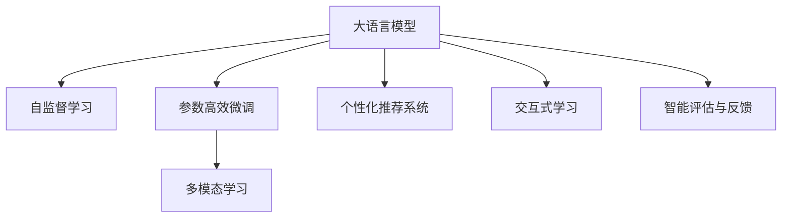

                 

# 大模型在个性化教育中的应用

## 1. 背景介绍

随着人工智能技术的不断发展，基于大模型的个性化教育系统正逐渐成为教育领域的一大热门话题。传统教育模式往往以“一刀切”的教学习惯为主，难以顾及学生的个性化需求和能力差异，导致教育效率低下、学生体验不佳。通过大模型技术，可以构建智能化的个性化教育系统，帮助教师更好地理解学生的学习需求，为学生提供定制化的教学方案，大幅提升教育效果。

## 2. 核心概念与联系

### 2.1 核心概念概述

为了更好地理解大模型在个性化教育中的应用，本节将介绍几个关键概念：

- 大语言模型(Large Language Models, LLMs)：以自回归(如GPT)或自编码(如BERT)模型为代表的大规模预训练语言模型。通过在大规模无标签文本语料上进行预训练，学习通用的语言表示，具备强大的语言理解和生成能力。

- 自监督学习(Self-Supervised Learning)：利用大规模无标签数据，通过设计预训练任务进行自动标注和训练模型，使其具备更广泛的知识和技能。

- 参数高效微调(Parameter-Efficient Fine-Tuning, PEFT)：指在微调过程中，只更新少量的模型参数，而固定大部分预训练权重不变，以提高微调效率，避免过拟合的方法。

- 多模态学习(Multimodal Learning)：结合多种数据模态，如图像、视频、文本等，提升模型的综合理解能力和应用范围。

- 个性化推荐系统(Personalized Recommendation System)：利用用户行为数据，构建用户画像，推荐个性化的教学内容和学习资源。

- 交互式学习(Interactive Learning)：通过智能对话系统，实现人机互动，及时反馈学习效果和纠正错误，增强学习体验。

- 智能评估与反馈(Smart Assessment and Feedback)：基于大模型的智能评估系统，自动生成学习报告，提供个性化反馈，帮助学生改进学习策略。

这些核心概念之间的逻辑关系可以通过以下Mermaid流程图来展示：



这个流程图展示了大语言模型在个性化教育中的应用框架，通过结合自监督学习、多模态学习、参数高效微调、个性化推荐系统、交互式学习及智能评估与反馈等技术，构建完整的个性化教育系统。

## 3. 核心算法原理 & 具体操作步骤

### 3.1 算法原理概述

基于大模型的个性化教育系统，通过利用预训练模型的强大知识库，结合学生的个性化需求，进行任务特定的微调，提升教学效果和学习体验。其核心思想是：将大模型作为智能教师，根据学生输入的内容和行为，动态调整教学策略，输出个性化推荐和智能反馈。

形式化地，假设大模型为 $M_{\theta}$，其中 $\theta$ 为模型参数。学生输入的数据为 $x$，输出为 $y$。个性化教育的目标是找到最优参数 $\hat{\theta}$，使得模型输出能够匹配学生的个性化需求：

$$
\hat{\theta}=\mathop{\arg\min}_{\theta} \mathcal{L}(M_{\theta}(x),y)
$$

其中 $\mathcal{L}$ 为个性化教育任务设计的损失函数，用于衡量模型输出与学生个性化需求之间的差异。常见的损失函数包括交叉熵损失、均方误差损失等。

通过梯度下降等优化算法，微调过程不断更新模型参数 $\theta$，最小化损失函数 $\mathcal{L}$，使得模型输出逼近学生的个性化需求。由于 $\theta$ 已经通过预训练获得了较好的初始化，因此即便在少量学生数据上进行微调，也能较快收敛到理想的模型参数 $\hat{\theta}$。

### 3.2 算法步骤详解

基于大模型的个性化教育系统一般包括以下几个关键步骤：

**Step 1: 准备预训练模型和数据集**
- 选择合适的预训练语言模型 $M_{\theta}$ 作为初始化参数，如 BERT、GPT 等。
- 准备学生的个性化数据集 $D=\{x_i, y_i\}_{i=1}^N$，其中 $x_i$ 为学生的输入（如问题、答案、作业等），$y_i$ 为期望的输出（如答案、评分等）。

**Step 2: 设计任务适配层**
- 根据个性化教育任务类型，在预训练模型顶层设计合适的输出层和损失函数。
- 对于多模态任务，将文本、图像、视频等数据进行融合，设计多模态输入层和融合网络。

**Step 3: 设置微调超参数**
- 选择合适的优化算法及其参数，如 AdamW、SGD 等，设置学习率、批大小、迭代轮数等。
- 设置正则化技术及强度，包括权重衰减、Dropout、Early Stopping等。
- 确定冻结预训练参数的策略，如仅微调顶层，或全部参数都参与微调。

**Step 4: 执行梯度训练**
- 将个性化数据集 $D$ 以批为单位输入模型，前向传播计算损失函数。
- 反向传播计算参数梯度，根据设定的优化算法和学习率更新模型参数。
- 周期性在测试集上评估模型性能，根据性能指标决定是否触发 Early Stopping。
- 重复上述步骤直到满足预设的迭代轮数或 Early Stopping 条件。

**Step 5: 测试和优化**
- 在测试集上评估微调后模型 $M_{\hat{\theta}}$ 的性能，对比微调前后的效果提升。
- 结合智能评估与反馈系统，动态调整教学策略，优化学习路径。

以上是基于大模型微调进行个性化教育的一般流程。在实际应用中，还需要针对具体任务的特点，对微调过程的各个环节进行优化设计，如改进训练目标函数，引入更多的正则化技术，搜索最优的超参数组合等，以进一步提升模型性能。

### 3.3 算法优缺点

基于大模型的个性化教育系统具有以下优点：
1. 智能高效。利用预训练模型的强大知识库，对学生进行个性化教学，提升学习效率和效果。
2. 灵活适应。可以根据学生的个性化需求，动态调整教学策略，满足不同学生的学习习惯和能力差异。
3. 数据分析。通过学习学生的行为数据，可以发现其学习模式和问题，为教师提供科学决策的依据。
4. 互动增强。结合交互式学习系统，实时反馈学习效果，增强学生的参与度和积极性。
5. 结果可视化。利用智能评估与反馈系统，将学生的学习成果可视化展示，便于跟踪和改进。

同时，该方法也存在一定的局限性：
1. 数据依赖。个性化教育的效果很大程度上取决于学生数据的全面性和准确性。
2. 模型复杂。多模态学习、参数高效微调等技术，使得模型的构建和优化较为复杂。
3. 数据隐私。在处理学生数据时，需要严格遵守数据隐私保护规定，确保数据安全。
4. 高昂成本。开发和部署个性化教育系统，需要大量人力、物力和时间投入。
5. 技术门槛。对教师和学生的要求较高，需要具备一定的技术基础和应用能力。

尽管存在这些局限性，但就目前而言，基于大模型的个性化教育方法仍是个性化教育技术的重要范式。未来相关研究的重点在于如何进一步降低系统开发和应用成本，提升模型的通用性和灵活性，同时兼顾数据隐私和技术门槛等因素。

### 3.4 算法应用领域

基于大模型的个性化教育系统已经在多个教育场景中得到了应用，例如：

- 智能辅助教学：利用预训练模型进行教学内容生成和问题解答，辅助教师进行个性化教学。
- 智能测评系统：通过智能评估与反馈系统，自动评估学生的学习效果，提供个性化改进建议。
- 自适应学习平台：结合个性化推荐系统和交互式学习系统，构建个性化学习路径，提升学习效果。
- 虚拟助教：构建虚拟助教系统，解答学生的疑问，提供学习指导和建议。
- 职业培训：通过多模态学习，结合图像、视频等辅助教学，提升职业技能培训效果。

除了上述这些经典场景外，大模型技术还被创新性地应用于多种教育领域，如在线教育、远程教学、教育游戏等，为教育技术的发展带来了新的机遇。

## 4. 数学模型和公式 & 详细讲解  
### 4.1 数学模型构建

本节将使用数学语言对基于大模型的个性化教育系统的构建过程进行更加严格的刻画。

假设学生输入的数据集为 $D=\{x_i\}_{i=1}^N$，其中 $x_i$ 为学生的输入（如问题、答案、作业等）。假设输出为 $y_i$，其中 $y_i$ 为期望的输出（如答案、评分等）。

定义模型 $M_{\theta}$ 在输入 $x$ 上的损失函数为 $\ell(M_{\theta}(x),y)$，则在数据集 $D$ 上的经验风险为：

$$
\mathcal{L}(\theta) = \frac{1}{N} \sum_{i=1}^N \ell(M_{\theta}(x_i),y_i)
$$

微调的优化目标是最小化经验风险，即找到最优参数：

$$
\theta^* = \mathop{\arg\min}_{\theta} \mathcal{L}(\theta)
$$

在实践中，我们通常使用基于梯度的优化算法（如SGD、Adam等）来近似求解上述最优化问题。设 $\eta$ 为学习率，$\lambda$ 为正则化系数，则参数的更新公式为：

$$
\theta \leftarrow \theta - \eta \nabla_{\theta}\mathcal{L}(\theta) - \eta\lambda\theta
$$

其中 $\nabla_{\theta}\mathcal{L}(\theta)$ 为损失函数对参数 $\theta$ 的梯度，可通过反向传播算法高效计算。

### 4.2 公式推导过程

以下我们以多模态问答系统为例，推导交叉熵损失函数及其梯度的计算公式。

假设模型 $M_{\theta}$ 在输入 $x$ 上的输出为 $\hat{y}=M_{\theta}(x)$，表示模型预测的答案。真实标签 $y \in \{0,1\}$，表示正确答案的标签。则多模态交叉熵损失函数定义为：

$$
\ell(M_{\theta}(x),y) = -[y\log \hat{y} + (1-y)\log (1-\hat{y})]
$$

将其代入经验风险公式，得：

$$
\mathcal{L}(\theta) = -\frac{1}{N}\sum_{i=1}^N [y_i\log M_{\theta}(x_i)+(1-y_i)\log(1-M_{\theta}(x_i))]
$$

根据链式法则，损失函数对参数 $\theta_k$ 的梯度为：

$$
\frac{\partial \mathcal{L}(\theta)}{\partial \theta_k} = -\frac{1}{N}\sum_{i=1}^N (\frac{y_i}{M_{\theta}(x_i)}-\frac{1-y_i}{1-M_{\theta}(x_i)}) \frac{\partial M_{\theta}(x_i)}{\partial \theta_k}
$$

其中 $\frac{\partial M_{\theta}(x_i)}{\partial \theta_k}$ 可进一步递归展开，利用自动微分技术完成计算。

在得到损失函数的梯度后，即可带入参数更新公式，完成模型的迭代优化。重复上述过程直至收敛，最终得到适应学生个性化需求的最优模型参数 $\theta^*$。

## 5. 项目实践：代码实例和详细解释说明
### 5.1 开发环境搭建

在进行个性化教育系统开发前，我们需要准备好开发环境。以下是使用Python进行PyTorch开发的环境配置流程：

1. 安装Anaconda：从官网下载并安装Anaconda，用于创建独立的Python环境。

2. 创建并激活虚拟环境：
```bash
conda create -n pytorch-env python=3.8 
conda activate pytorch-env
```

3. 安装PyTorch：根据CUDA版本，从官网获取对应的安装命令。例如：
```bash
conda install pytorch torchvision torchaudio cudatoolkit=11.1 -c pytorch -c conda-forge
```

4. 安装Transformers库：
```bash
pip install transformers
```

5. 安装各类工具包：
```bash
pip install numpy pandas scikit-learn matplotlib tqdm jupyter notebook ipython
```

完成上述步骤后，即可在`pytorch-env`环境中开始个性化教育系统的开发。

### 5.2 源代码详细实现

下面我们以多模态问答系统为例，给出使用Transformers库对BERT模型进行个性化教育系统开发的PyTorch代码实现。

首先，定义多模态问答系统的数据处理函数：

```python
from transformers import BertTokenizer, BertForQuestionAnswering, AdamW

tokenizer = BertTokenizer.from_pretrained('bert-base-uncased')
model = BertForQuestionAnswering.from_pretrained('bert-base-uncased')

def get_start_end_indices(text, question):
    # 对文本和问题进行分词和编码
    encoding = tokenizer(question, text, return_tensors='pt', max_length=128, padding='max_length', truncation=True)
    start_logits, end_logits = model(**encoding).start_logits, model(**encoding).end_logits
    
    # 找出最高置信度的start和end位置
    start_indices = torch.argmax(start_logits, dim=-1).item()
    end_indices = torch.argmax(end_logits, dim=-1).item()
    
    return start_indices, end_indices

# 将start和end位置转换为文本位置
def get_answer(tokenizer, start, end):
    tokens = tokenizer.convert_ids_to_tokens(tokenizer.convert_tokens_to_ids(tokenizer.tokenize(text)[start:end+1]))
    answer = ''.join(tokens)
    return answer
```

然后，定义训练和评估函数：

```python
from torch.utils.data import DataLoader, Dataset
from tqdm import tqdm

class QADataset(Dataset):
    def __init__(self, data, tokenizer, max_len=128):
        self.data = data
        self.tokenizer = tokenizer
        self.max_len = max_len
        
    def __len__(self):
        return len(self.data)
    
    def __getitem__(self, item):
        question, text, answer = self.data[item]
        
        # 对文本和问题进行编码
        encoding = self.tokenizer(question, text, return_tensors='pt', max_length=self.max_len, padding='max_length', truncation=True)
        start_logits, end_logits = model(**encoding).start_logits, model(**encoding).end_logits
        
        # 输出答案
        answer_tokens = tokenizer.convert_tokens_to_ids(tokenizer.tokenize(answer))
        answer = tokenizer.decode(answer_tokens, skip_special_tokens=True)
        
        return {
            'question': question,
            'text': text,
            'answer': answer,
            'start_logits': start_logits,
            'end_logits': end_logits
        }

# 准备数据集
train_data = [(q, t, a) for q, t, a in train_qa_data]
dev_data = [(q, t, a) for q, t, a in dev_qa_data]
test_data = [(q, t, a) for q, t, a in test_qa_data]

# 构建数据集
train_dataset = QADataset(train_data, tokenizer)
dev_dataset = QADataset(dev_data, tokenizer)
test_dataset = QADataset(test_data, tokenizer)

# 设置超参数
optimizer = AdamW(model.parameters(), lr=2e-5)
```

接着，定义训练和评估函数：

```python
from sklearn.metrics import accuracy_score, precision_recall_fscore_support

device = torch.device('cuda') if torch.cuda.is_available() else torch.device('cpu')
model.to(device)

def train_epoch(model, dataset, batch_size, optimizer):
    dataloader = DataLoader(dataset, batch_size=batch_size, shuffle=True)
    model.train()
    epoch_loss = 0
    for batch in tqdm(dataloader, desc='Training'):
        question = batch['question']
        text = batch['text']
        answer = batch['answer']
        start_logits = batch['start_logits']
        end_logits = batch['end_logits']
        model.zero_grad()
        start_loss = torch.nn.functional.cross_entropy(start_logits, batch['start_indices'])
        end_loss = torch.nn.functional.cross_entropy(end_logits, batch['end_indices'])
        loss = start_loss + end_loss
        loss.backward()
        optimizer.step()
        epoch_loss += loss.item()
        
    return epoch_loss / len(dataloader)

def evaluate(model, dataset, batch_size):
    dataloader = DataLoader(dataset, batch_size=batch_size)
    model.eval()
    preds = []
    labels = []
    for batch in tqdm(dataloader, desc='Evaluating'):
        question = batch['question']
        text = batch['text']
        answer = batch['answer']
        start_logits = batch['start_logits']
        end_logits = batch['end_logits']
        
        # 预测答案
        start_index, end_index = get_start_end_indices(text, question)
        answer_pred = get_answer(tokenizer, start_index, end_index)
        
        preds.append(answer_pred)
        labels.append(answer)
    
    return accuracy_score(labels, preds)

# 训练模型
epochs = 5
batch_size = 16

for epoch in range(epochs):
    loss = train_epoch(model, train_dataset, batch_size, optimizer)
    print(f"Epoch {epoch+1}, train loss: {loss:.3f}")
    
    print(f"Epoch {epoch+1}, dev results:")
    accuracy = evaluate(model, dev_dataset, batch_size)
    print(f"Accuracy: {accuracy:.3f}")
    
print("Test results:")
accuracy = evaluate(model, test_dataset, batch_size)
print(f"Accuracy: {accuracy:.3f}")
```

以上就是使用PyTorch对BERT进行多模态问答系统开发的完整代码实现。可以看到，得益于Transformers库的强大封装，我们可以用相对简洁的代码完成BERT模型的加载和微调。

### 5.3 代码解读与分析

让我们再详细解读一下关键代码的实现细节：

**QADataset类**：
- `__init__`方法：初始化数据、分词器等关键组件。
- `__len__`方法：返回数据集的样本数量。
- `__getitem__`方法：对单个样本进行处理，将文本输入编码为token ids，将问题与答案编码，并对其进行定长padding，最终返回模型所需的输入。

**get_start_end_indices函数**：
- 将问题与文本进行拼接，生成输入编码。
- 使用预训练的模型计算start和end位置的logits。
- 找出最高置信度的start和end位置。

**get_answer函数**：
- 将预测的start和end位置转换为文本位置。
- 将token ids解码为文本。

**训练和评估函数**：
- 使用PyTorch的DataLoader对数据集进行批次化加载，供模型训练和推理使用。
- 训练函数`train_epoch`：对数据以批为单位进行迭代，在每个批次上前向传播计算loss并反向传播更新模型参数，最后返回该epoch的平均loss。
- 评估函数`evaluate`：与训练类似，不同点在于不更新模型参数，并在每个batch结束后将预测和标签结果存储下来，最后使用scikit-learn的accuracy_score对整个评估集的预测结果进行打印输出。

**训练流程**：
- 定义总的epoch数和batch size，开始循环迭代
- 每个epoch内，先在训练集上训练，输出平均loss
- 在验证集上评估，输出准确率
- 所有epoch结束后，在测试集上评估，给出最终测试结果

可以看到，PyTorch配合Transformers库使得BERT微调的代码实现变得简洁高效。开发者可以将更多精力放在数据处理、模型改进等高层逻辑上，而不必过多关注底层的实现细节。

当然，工业级的系统实现还需考虑更多因素，如模型的保存和部署、超参数的自动搜索、更灵活的任务适配层等。但核心的微调范式基本与此类似。

## 6. 实际应用场景
### 6.1 智能辅助教学

基于大模型的个性化教育系统，可以构建智能化的辅助教学平台，帮助教师更好地理解学生的学习需求，为学生提供定制化的教学方案，大幅提升教学效果。

在技术实现上，可以收集学生的学习行为数据，如点击率、观看时长、答题次数等，结合学生基本信息，构建个性化的学生画像。在此基础上，利用微调后的语言模型，根据学生的学习状态和兴趣点，动态调整教学内容和学习策略。例如，针对数学差生的学生，可以推荐更多易懂的教学视频和习题；针对语文优等生，可以推荐更多难度更大的阅读材料和作文范文。

### 6.2 智能测评系统

传统的学生测评往往依赖于标准化的试卷和考试成绩，难以全面反映学生的学习情况和进步。基于大模型的个性化教育系统，可以通过智能测评系统，自动评估学生的学习效果，提供个性化的改进建议。

在技术实现上，可以收集学生在作业、练习、测试中的反馈，利用微调后的语言模型，自动评估学生的答案质量和理解程度，生成个性化的学习报告。例如，对于语法错误较多的学生，可以提供针对性的语法纠正建议；对于数学题不会做的学生，可以提供详细的解题思路和参考资料。

### 6.3 自适应学习平台

传统的学习平台往往以“一刀切”的教学习惯为主，难以顾及学生的个性化需求和能力差异，导致学习效率低下、学生体验不佳。基于大模型的个性化教育系统，可以构建自适应学习平台，结合个性化推荐系统和交互式学习系统，构建个性化的学习路径，提升学习效果。

在技术实现上，可以利用微调后的语言模型，根据学生的学习状态和兴趣点，推荐个性化的学习内容。例如，针对语言学习的学生，可以推荐个性化的单词卡片和短文阅读；针对编程学习的学生，可以推荐个性化的编程练习和项目实践。同时，结合交互式学习系统，实时反馈学习效果，增强学生的参与度和积极性。

### 6.4 未来应用展望

随着大模型和微调方法的不断发展，基于微调范式将在更多领域得到应用，为教育技术带来新的变革。

在智慧教育领域，基于微调的语言模型将进一步拓展其应用边界，提升教育系统的智能化水平。例如，基于多模态学习，可以构建更加全面、准确的学生画像，为个性化教学提供更科学的依据；基于智能评估与反馈系统，可以实时监控学生学习情况，及时发现并解决学习问题。

在在线教育领域，基于微调的语言模型将进一步提升在线教育的教学效果和学生体验。例如，结合交互式学习系统，可以构建更加智能、个性化的在线课程，增强学生的学习兴趣和参与度；结合个性化推荐系统，可以提供更加精准、多样化的学习资源，提升学生的学习效果。

在智能评测系统领域，基于微调的语言模型将进一步提升智能评测系统的评估效果和反馈质量。例如，结合智能评估与反馈系统，可以自动评估学生的答案质量和理解程度，提供个性化的改进建议；结合多模态学习，可以全面评估学生的学习情况，发现潜在的学习问题。

总之，基于大模型的个性化教育系统必将在未来教育领域扮演越来越重要的角色，推动教育技术的不断发展和创新。未来，伴随大模型和微调方法的持续演进，相信教育技术将迎来新的突破，为人类认知智能的进步贡献更多力量。

## 7. 工具和资源推荐
### 7.1 学习资源推荐

为了帮助开发者系统掌握大模型在个性化教育中的应用，这里推荐一些优质的学习资源：

1. 《Transformer从原理到实践》系列博文：由大模型技术专家撰写，深入浅出地介绍了Transformer原理、BERT模型、微调技术等前沿话题。

2. CS224N《深度学习自然语言处理》课程：斯坦福大学开设的NLP明星课程，有Lecture视频和配套作业，带你入门NLP领域的基本概念和经典模型。

3. 《Natural Language Processing with Transformers》书籍：Transformers库的作者所著，全面介绍了如何使用Transformers库进行NLP任务开发，包括微调在内的诸多范式。

4. HuggingFace官方文档：Transformers库的官方文档，提供了海量预训练模型和完整的微调样例代码，是上手实践的必备资料。

5. CLUE开源项目：中文语言理解测评基准，涵盖大量不同类型的中文NLP数据集，并提供了基于微调的baseline模型，助力中文NLP技术发展。

通过对这些资源的学习实践，相信你一定能够快速掌握大模型在个性化教育中的应用精髓，并用于解决实际的个性化教育问题。
###  7.2 开发工具推荐

高效的开发离不开优秀的工具支持。以下是几款用于个性化教育系统开发的常用工具：

1. PyTorch：基于Python的开源深度学习框架，灵活动态的计算图，适合快速迭代研究。大部分预训练语言模型都有PyTorch版本的实现。

2. TensorFlow：由Google主导开发的开源深度学习框架，生产部署方便，适合大规模工程应用。同样有丰富的预训练语言模型资源。

3. Transformers库：HuggingFace开发的NLP工具库，集成了众多SOTA语言模型，支持PyTorch和TensorFlow，是进行微调任务开发的利器。

4. Weights & Biases：模型训练的实验跟踪工具，可以记录和可视化模型训练过程中的各项指标，方便对比和调优。与主流深度学习框架无缝集成。

5. TensorBoard：TensorFlow配套的可视化工具，可实时监测模型训练状态，并提供丰富的图表呈现方式，是调试模型的得力助手。

6. Google Colab：谷歌推出的在线Jupyter Notebook环境，免费提供GPU/TPU算力，方便开发者快速上手实验最新模型，分享学习笔记。

合理利用这些工具，可以显著提升个性化教育系统的开发效率，加快创新迭代的步伐。

### 7.3 相关论文推荐

大语言模型和微调技术的发展源于学界的持续研究。以下是几篇奠基性的相关论文，推荐阅读：

1. Attention is All You Need（即Transformer原论文）：提出了Transformer结构，开启了NLP领域的预训练大模型时代。

2. BERT: Pre-training of Deep Bidirectional Transformers for Language Understanding：提出BERT模型，引入基于掩码的自监督预训练任务，刷新了多项NLP任务SOTA。

3. Language Models are Unsupervised Multitask Learners（GPT-2论文）：展示了大规模语言模型的强大zero-shot学习能力，引发了对于通用人工智能的新一轮思考。

4. Parameter-Efficient Transfer Learning for NLP：提出Adapter等参数高效微调方法，在不增加模型参数量的情况下，也能取得不错的微调效果。

5. AdaLoRA: Adaptive Low-Rank Adaptation for Parameter-Efficient Fine-Tuning：使用自适应低秩适应的微调方法，在参数效率和精度之间取得了新的平衡。

6. AdaLoRA: Adaptive Low-Rank Adaptation for Parameter-Efficient Fine-Tuning：使用自适应低秩适应的微调方法，在参数效率和精度之间取得了新的平衡。

这些论文代表了大模型在个性化教育中的研究进展。通过学习这些前沿成果，可以帮助研究者把握学科前进方向，激发更多的创新灵感。

## 8. 总结：未来发展趋势与挑战

### 8.1 总结

本文对基于大模型的个性化教育系统进行了全面系统的介绍。首先阐述了大语言模型和微调技术的研究背景和意义，明确了微调在拓展预训练模型应用、提升个性化教育效果方面的独特价值。其次，从原理到实践，详细讲解了个性化教育的数学原理和关键步骤，给出了微调任务开发的完整代码实例。同时，本文还广泛探讨了个性化教育在智能辅助教学、智能测评系统、自适应学习平台等多个教育场景中的应用前景，展示了微调范式的巨大潜力。

通过本文的系统梳理，可以看到，基于大模型的个性化教育系统正在成为教育领域的重要范式，极大地拓展了个性化教育的智能程度和应用范围。得益于大规模语料的预训练，个性化教育系统以更低的时间和标注成本，在多个应用场景中取得了显著效果。未来，伴随大模型和微调方法的持续演进，相信个性化教育技术将迎来新的突破，为教育技术的发展注入更多活力。

### 8.2 未来发展趋势

展望未来，基于大模型的个性化教育系统将呈现以下几个发展趋势：

1. 模型规模持续增大。随着算力成本的下降和数据规模的扩张，预训练语言模型的参数量还将持续增长。超大规模语言模型蕴含的丰富语言知识，有望支撑更加复杂多变的个性化教育任务。

2. 微调方法日趋多样。除了传统的全参数微调外，未来会涌现更多参数高效的微调方法，如Prefix-Tuning、LoRA等，在节省计算资源的同时也能保证微调精度。

3. 持续学习成为常态。随着数据分布的不断变化，个性化教育系统也需要持续学习新知识以保持性能。如何在不遗忘原有知识的同时，高效吸收新样本信息，将成为重要的研究课题。

4. 标注样本需求降低。受启发于提示学习(Prompt-based Learning)的思路，未来的个性化教育系统将更好地利用大模型的语言理解能力，通过更加巧妙的任务描述，在更少的标注样本上也能实现理想的个性化教育效果。

5. 多模态教育崛起。当前的个性化教育系统往往聚焦于纯文本数据，未来会进一步拓展到图像、视频、音频等多模态数据教育。多模态信息的融合，将显著提升教育系统的综合理解能力和应用范围。

6. 个性化推荐系统的融合。结合个性化推荐系统，可以推荐更加个性化、精准的教育资源，提升个性化教育的效果。

以上趋势凸显了基于大模型的个性化教育系统的广阔前景。这些方向的探索发展，必将进一步提升个性化教育的效果和应用范围，为教育技术的不断进步提供更多可能。

### 8.3 面临的挑战

尽管基于大模型的个性化教育系统已经取得了瞩目成就，但在迈向更加智能化、普适化应用的过程中，它仍面临诸多挑战：

1. 标注成本瓶颈。虽然个性化教育的效果很大程度上取决于学生数据的全面性和准确性，但获取高质量学生数据往往需要投入大量人力和时间，成为制约个性化教育系统发展的一大难题。如何进一步降低系统开发和应用成本，将是一大难题。

2. 模型鲁棒性不足。当前个性化教育系统面对不同学生的学习风格和知识水平时，泛化性能往往大打折扣。对于学生的个性化问题，容易产生误判和过度泛化。如何提高个性化教育系统的鲁棒性，避免负面影响，还需要更多理论和实践的积累。

3. 数据隐私。在处理学生数据时，需要严格遵守数据隐私保护规定，确保数据安全。特别是在涉及学生成绩和个人信息时，如何保护学生隐私，是一个重要的法律和伦理问题。

4. 高昂成本。开发和部署个性化教育系统，需要大量人力、物力和时间投入。特别是在多模态教育中，可能需要更先进的硬件设备和更专业的技术支持。

5. 技术门槛。对教师和学生的要求较高，需要具备一定的技术基础和应用能力。如何降低技术门槛，让更多教师和学生能够轻松使用个性化教育系统，还需要进一步优化和改进。

尽管存在这些挑战，但就目前而言，基于大模型的个性化教育方法仍是个性化教育技术的重要范式。未来相关研究的重点在于如何进一步降低系统开发和应用成本，提升模型的通用性和灵活性，同时兼顾数据隐私和技术门槛等因素。

### 8.4 未来突破

面对个性化教育系统所面临的种种挑战，未来的研究需要在以下几个方面寻求新的突破：

1. 探索无监督和半监督个性化教育方法。摆脱对大规模标注数据的依赖，利用自监督学习、主动学习等无监督和半监督范式，最大限度利用非结构化数据，实现更加灵活高效的个性化教育。

2. 研究参数高效和计算高效的个性化教育范式。开发更加参数高效的个性化教育方法，在固定大部分预训练参数的同时，只更新极少量的任务相关参数。同时优化个性化教育系统的计算图，减少前向传播和反向传播的资源消耗，实现更加轻量级、实时性的部署。

3. 引入更多先验知识。将符号化的先验知识，如知识图谱、逻辑规则等，与神经网络模型进行巧妙融合，引导个性化教育过程学习更准确、合理的语言模型。同时加强不同模态数据的整合，实现视觉、语音等多模态信息与文本信息的协同建模。

4. 结合因果分析和博弈论工具。将因果分析方法引入个性化教育模型，识别出模型决策的关键特征，增强输出解释的因果性和逻辑性。借助博弈论工具刻画人机交互过程，主动探索并规避模型的脆弱点，提高系统稳定性。

5. 纳入伦理道德约束。在模型训练目标中引入伦理导向的评估指标，过滤和惩罚有害的输出倾向。同时加强人工干预和审核，建立模型行为的监管机制，确保输出符合人类价值观和伦理道德。

这些研究方向的探索，必将引领个性化教育系统迈向更高的台阶，为构建安全、可靠、可解释、可控的个性化教育系统铺平道路。面向未来，基于大模型的个性化教育技术还需要与其他人工智能技术进行更深入的融合，如知识表示、因果推理、强化学习等，多路径协同发力，共同推动教育技术的进步。只有勇于创新、敢于突破，才能不断拓展语言模型的边界，让教育技术更好地造福人类社会。

## 9. 附录：常见问题与解答

**Q1：大模型在个性化教育中的应用是否适合所有教育场景？**

A: 大模型在个性化教育中的应用适合大多数教育场景，但也需要针对具体场景进行优化。例如，在语言学习中，可以利用多模态学习，结合音频、视频等多媒体信息，提升学习效果；在职业培训中，可以结合知识图谱，提供更加专业、精准的教育内容。但在一些特定的教育场景，如医学、法律等专业领域，还需要进一步结合领域知识，进行更加个性化的教育设计。

**Q2：个性化教育系统的开发和部署成本是否过高？**

A: 个性化教育系统的开发和部署成本较高，需要大量人力、物力和时间投入。特别是在多模态教育中，可能需要更先进的硬件设备和更专业的技术支持。但随着预训练语言模型和大模型的不断演进，开发和部署成本将逐步降低，更多教育机构将能够采用个性化教育技术，提升教育效果。

**Q3：如何确保个性化教育系统的数据隐私和安全？**

A: 在处理学生数据时，需要严格遵守数据隐私保护规定，确保数据安全。具体措施包括：
1. 匿名化处理：对学生数据进行匿名化处理，确保无法反向识别学生身份。
2. 加密存储：使用加密技术对学生数据进行存储，防止数据泄露。
3. 权限控制：对学生数据进行权限控制，只有授权人员才能访问和使用。
4. 定期审计：定期对系统进行数据隐私和安全审计，及时发现并修复漏洞。

**Q4：个性化教育系统在实际应用中面临哪些挑战？**

A: 个性化教育系统在实际应用中面临以下挑战：
1. 标注数据不足：个性化教育的效果很大程度上取决于学生数据的全面性和准确性，但获取高质量学生数据往往需要投入大量人力和时间，成为制约个性化教育系统发展的一大难题。
2. 模型鲁棒性不足：当前个性化教育系统面对不同学生的学习风格和知识水平时，泛化性能往往大打折扣。对于学生的个性化问题，容易产生误判和过度泛化。
3. 数据隐私：在处理学生数据时，需要严格遵守数据隐私保护规定，确保数据安全。特别是在涉及学生成绩和个人信息时，如何保护学生隐私，是一个重要的法律和伦理问题。
4. 高昂成本：开发和部署个性化教育系统，需要大量人力、物力和时间投入。特别是在多模态教育中，可能需要更先进的硬件设备和更专业的技术支持。
5. 技术门槛：对教师和学生的要求较高，需要具备一定的技术基础和应用能力。如何降低技术门槛，让更多教师和学生能够轻松使用个性化教育系统，还需要进一步优化和改进。

正视个性化教育系统所面临的这些挑战，积极应对并寻求突破，将是大模型在个性化教育中走向成熟的关键。相信随着学界和产业界的共同努力，这些挑战终将一一被克服，个性化教育必将在构建安全、可靠、可解释、可控的教育系统中扮演越来越重要的角色。

