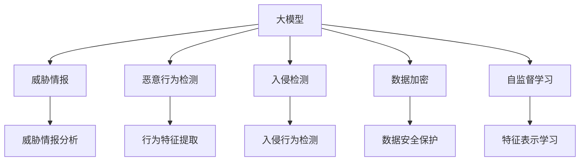

                 

# 大模型在网络安全领域的应用探索

> 关键词：网络安全,深度学习,大模型,恶意行为检测,入侵检测,威胁情报,数据加密

## 1. 背景介绍

### 1.1 问题由来
随着网络技术的不断发展和普及，网络安全问题日益凸显。传统的基于规则和特征匹配的安全防护手段，已无法应对日益复杂和多样化的网络攻击。而深度学习技术在图像、语音、自然语言处理等领域已展现出卓越的性能，也为网络安全领域带来了新的突破。

近年来，大模型技术逐渐被引入网络安全领域，主要用于威胁情报分析、恶意行为检测、入侵检测等任务。这些大模型通过大规模无标签数据预训练，学习到复杂的模式和语义，并利用标注数据进行微调，从而具备强大的泛化能力和威胁识别能力。

### 1.2 问题核心关键点
大模型在网络安全领域的应用，其核心关键点包括：

- 高效威胁情报分析：通过分析大量网络流量、日志等数据，自动生成威胁情报，辅助安全分析师进行威胁评估和策略制定。
- 实时恶意行为检测：利用大模型对网络流量进行实时分析，自动检测各类恶意行为，如DDoS攻击、恶意软件传播等。
- 自动化入侵检测：在网络边界部署大模型，自动识别入侵行为，减少人工干预，提高响应速度和准确率。
- 数据加密与解密：利用大模型进行数据加密和解密，保护数据传输安全，防止数据泄露和篡改。

## 2. 核心概念与联系

### 2.1 核心概念概述

为更好地理解大模型在网络安全领域的应用，本节将介绍几个密切相关的核心概念：

- 大模型(Large Model)：以Transformer、BERT、GPT等深度学习模型为代表，通过大规模数据预训练获得丰富知识储备的语言模型。具有强大的特征提取和泛化能力。

- 威胁情报(Threat Intelligence)：基于网络攻击行为和趋势分析，生成的安全威胁信息。为安全防护和响应提供重要参考。

- 恶意行为检测(Malware Detection)：利用机器学习技术，自动识别和分析恶意软件的行为特征，发现网络攻击行为。

- 入侵检测(IDS)：通过分析网络流量，自动检测和报告网络入侵行为，以保护网络安全。

- 数据加密(Data Encryption)：利用加密算法对数据进行加密，防止数据在传输和存储过程中被窃取或篡改。

- 自监督学习(Self-Supervised Learning)：在大规模无标签数据上，通过自训练任务，学习模型的特征表示。

这些核心概念之间的逻辑关系可以通过以下Mermaid流程图来展示：



这个流程图展示了大模型在网络安全领域的主要应用场景和关键技术。

## 3. 核心算法原理 & 具体操作步骤
### 3.1 算法原理概述

大模型在网络安全领域的应用，通常基于监督学习或自监督学习两种范式。其核心思想是：通过大规模无标签数据预训练，学习通用的安全特征，并在标注数据上进行微调，优化模型在特定任务上的性能。

具体而言，以恶意行为检测为例，假设有标注数据集 $\{(x_i,y_i)\}_{i=1}^N$，其中 $x_i$ 为网络流量样本，$y_i$ 为行为标签。定义模型 $M_{\theta}$，其中 $\theta$ 为模型参数。模型在训练集上进行有监督学习，最小化损失函数：

$$
\mathcal{L}(\theta) = \frac{1}{N}\sum_{i=1}^N \ell(M_{\theta}(x_i),y_i)
$$

其中 $\ell$ 为损失函数，如交叉熵损失。训练过程中，通过反向传播算法更新参数 $\theta$，直至模型收敛。

### 3.2 算法步骤详解

基于监督学习的大模型在网络安全领域的应用，通常包括以下关键步骤：

**Step 1: 准备数据集**
- 收集网络流量、日志等数据，标注出各类恶意行为。
- 划分训练集、验证集和测试集。

**Step 2: 选择模型架构**
- 选择合适的深度学习模型架构，如BERT、GPT等。
- 确定模型层数、神经元数量、卷积核大小等关键超参数。

**Step 3: 进行预训练**
- 在大规模无标签数据上，使用自监督学习任务（如掩码语言模型、上下文预测等）对模型进行预训练。
- 获取预训练模型参数。

**Step 4: 微调模型**
- 在标注数据集上进行微调，调整模型参数以适应特定任务。
- 使用适当的优化算法（如AdamW、SGD等），设置合适的学习率和正则化参数。

**Step 5: 评估与部署**
- 在测试集上评估模型性能。
- 将模型部署到生产环境，实时分析网络流量，检测恶意行为。

### 3.3 算法优缺点

基于大模型在网络安全领域的应用，具有以下优点：

- 模型泛化能力强。大模型在预训练阶段已经学习到丰富的安全特征，能够在不同场景下表现稳定。
- 可解释性强。通过分析模型的输出，可以深入了解恶意行为的模式和特征。
- 实时性高。大模型可以实时分析网络流量，及时发现和响应恶意行为。

同时，该方法也存在一定的局限性：

- 数据依赖性强。大模型需要大量标注数据进行微调，标注成本较高。
- 模型资源消耗大。大模型通常需要较高的计算资源进行训练和推理。
- 容易过拟合。大规模网络流量和日志数据可能存在噪声，模型容易过拟合。

尽管存在这些局限性，但就目前而言，大模型在网络安全领域的应用前景广阔，正逐渐成为网络安全防护的重要手段。

### 3.4 算法应用领域

大模型在网络安全领域的应用，主要集中在以下几个方面：

- 威胁情报分析：通过分析网络攻击数据，自动生成威胁情报，辅助安全分析师进行威胁评估和决策。
- 恶意行为检测：利用大模型自动检测和分析恶意软件和攻击行为，提高恶意行为检测的准确率和效率。
- 入侵检测：在网络边界部署大模型，自动识别入侵行为，减少人工干预，提高响应速度和准确率。
- 数据加密与解密：利用大模型进行数据加密和解密，保护数据传输安全，防止数据泄露和篡改。

## 4. 数学模型和公式 & 详细讲解  
### 4.1 数学模型构建

以下将以恶意行为检测为例，详细讲解基于大模型的恶意行为检测数学模型构建。

设网络流量样本 $x \in \mathbb{R}^n$，模型输出为 $M_{\theta}(x)$，定义行为标签 $y \in \{0,1\}$，其中 $0$ 表示正常行为，$1$ 表示恶意行为。定义二分类交叉熵损失函数：

$$
\ell(M_{\theta}(x),y) = -y\log M_{\theta}(x) - (1-y)\log(1-M_{\theta}(x))
$$

则模型在训练集上的损失函数为：

$$
\mathcal{L}(\theta) = \frac{1}{N}\sum_{i=1}^N \ell(M_{\theta}(x_i),y_i)
$$

通过梯度下降等优化算法，不断更新模型参数 $\theta$，最小化损失函数 $\mathcal{L}(\theta)$，直至模型收敛。

### 4.2 公式推导过程

以BERT模型为例，其输入为网络流量样本 $x$，输出为行为标签 $y$。BERT模型在恶意行为检测任务上的输出为：

$$
M_{\theta}(x) = \text{CLS}(x) \in \mathbb{R}
$$

其中 $\text{CLS}$ 为BERT的分类器层，输出行为分类概率。通过计算损失函数 $\ell$ 对模型参数 $\theta$ 的梯度，可得：

$$
\frac{\partial \mathcal{L}(\theta)}{\partial \theta} = -\frac{1}{N}\sum_{i=1}^N \frac{\partial \ell(M_{\theta}(x_i),y_i)}{\partial \theta}
$$

通过反向传播算法，可以高效计算梯度，更新模型参数 $\theta$。

### 4.3 案例分析与讲解

以BERT模型在恶意行为检测任务上的应用为例，其输入为网络流量样本，经过BERT模型的编码和分类器层的处理，得到行为分类概率。通过与真实标签对比，计算交叉熵损失函数，更新模型参数，使模型逐步学习到恶意行为的特征。

例如，在恶意软件传播检测任务中，网络流量样本可能包含大量的数据包信息，通过BERT模型提取特征，分类器层判断是否存在恶意行为特征。在训练过程中，通过标注的恶意行为数据进行微调，优化模型性能。最终，部署到网络边界，实时检测网络流量，发现和响应恶意行为。

## 5. 项目实践：代码实例和详细解释说明
### 5.1 开发环境搭建

在进行大模型在网络安全领域的应用实践前，我们需要准备好开发环境。以下是使用Python进行TensorFlow开发的教程：

1. 安装Anaconda：从官网下载并安装Anaconda，用于创建独立的Python环境。

2. 创建并激活虚拟环境：
```bash
conda create -n tf-env python=3.8 
conda activate tf-env
```

3. 安装TensorFlow：
```bash
pip install tensorflow==2.6
```

4. 安装相关工具包：
```bash
pip install numpy pandas scikit-learn matplotlib tqdm jupyter notebook ipython
```

完成上述步骤后，即可在`tf-env`环境中开始模型开发。

### 5.2 源代码详细实现

以下是使用TensorFlow实现大模型在恶意行为检测任务上的代码实现：

```python
import tensorflow as tf
from tensorflow.keras.layers import Input, Dense, Dropout
from tensorflow.keras.models import Model
from tensorflow.keras.optimizers import Adam
from tensorflow.keras.losses import BinaryCrossentropy
from tensorflow.keras.callbacks import EarlyStopping

def create_model(input_dim, hidden_dim):
    inputs = Input(shape=(input_dim,))
    x = Dense(hidden_dim, activation='relu')(inputs)
    x = Dropout(0.5)(x)
    x = Dense(hidden_dim, activation='relu')(x)
    x = Dropout(0.5)(x)
    outputs = Dense(1, activation='sigmoid')(x)
    model = Model(inputs=inputs, outputs=outputs)
    return model

input_dim = 512
hidden_dim = 128

model = create_model(input_dim, hidden_dim)
model.compile(optimizer=Adam(lr=1e-4), loss=BinaryCrossentropy(), metrics=['accuracy'])

# 准备数据集
train_data = ...
train_labels = ...
val_data = ...
val_labels = ...

# 划分训练集和验证集
train_dataset = tf.data.Dataset.from_tensor_slices((train_data, train_labels))
train_dataset = train_dataset.shuffle(buffer_size=10000).batch(batch_size=32)
val_dataset = tf.data.Dataset.from_tensor_slices((val_data, val_labels))
val_dataset = val_dataset.shuffle(buffer_size=1000).batch(batch_size=32)

# 训练模型
early_stopping = EarlyStopping(monitor='val_loss', patience=10)
model.fit(train_dataset, epochs=100, validation_data=val_dataset, callbacks=[early_stopping])

# 评估模型
test_data = ...
test_labels = ...

test_dataset = tf.data.Dataset.from_tensor_slices((test_data, test_labels))
test_dataset = test_dataset.shuffle(buffer_size=10000).batch(batch_size=32)

test_loss, test_acc = model.evaluate(test_dataset)
print(f'Test loss: {test_loss}, Test accuracy: {test_acc}')
```

在实际应用中，需要根据具体的任务需求，调整模型架构和超参数，以及选择合适的数据集和优化算法。

### 5.3 代码解读与分析

代码中，我们使用了TensorFlow搭建了一个简单的神经网络模型，用于二分类任务（恶意行为检测）。具体实现过程如下：

**create_model函数**：定义了模型的架构，包括输入层、隐藏层、输出层等。
- 输入层：定义输入数据的维度。
- 隐藏层：定义模型层数和神经元数量，激活函数使用ReLU。
- 输出层：定义输出数据的维度，激活函数使用Sigmoid。
- Model类：封装输入和输出，创建模型。

**编译模型**：
- 设置优化器为Adam，学习率为1e-4。
- 设置损失函数为BinaryCrossentropy，适用于二分类任务。
- 设置评估指标为准确率。

**准备数据集**：
- 使用TensorFlow的Dataset类，将数据和标签转换为可以批量处理的格式。
- 使用shuffle和batch方法对数据集进行随机化处理和批次划分。

**训练模型**：
- 使用EarlyStopping回调函数，监控验证集损失，设置最大等待轮数。
- 调用model.fit方法，进行模型训练，指定训练集和验证集。

**评估模型**：
- 使用模型.evaluate方法，评估模型在测试集上的表现。
- 输出测试集上的损失和准确率。

## 6. 实际应用场景
### 6.1 威胁情报分析

大模型在威胁情报分析中的应用，主要用于生成基于大量网络流量数据的威胁情报。通过训练模型，分析不同类型的网络流量数据，自动识别潜在的安全威胁。例如，针对DDoS攻击，可以从网络流量中提取出流量峰值、协议分布、攻击源IP地址等信息，进行威胁情报生成和分析。

### 6.2 恶意行为检测

利用大模型对网络流量进行实时分析，自动检测各类恶意行为。例如，在恶意软件传播检测中，从网络流量中提取出恶意软件特征，如文件类型、行为模式、传播路径等，进行威胁检测和预警。

### 6.3 入侵检测

在网络边界部署大模型，自动识别入侵行为，减少人工干预，提高响应速度和准确率。例如，利用大模型分析网络流量，识别出异常行为，如非法访问、违规操作等，进行入侵检测和防护。

### 6.4 数据加密与解密

利用大模型进行数据加密和解密，保护数据传输安全，防止数据泄露和篡改。例如，在数据加密任务中，通过训练模型学习加密算法，对数据进行加密和解密，确保数据在传输过程中的安全性和隐私保护。

## 7. 工具和资源推荐
### 7.1 学习资源推荐

为了帮助开发者系统掌握大模型在网络安全领域的应用，这里推荐一些优质的学习资源：

1. TensorFlow官方文档：TensorFlow的官方文档，提供了详细的API说明和样例代码，是学习TensorFlow的重要资源。

2. PyTorch官方文档：PyTorch的官方文档，提供了大量的深度学习模型和优化算法，适用于不同的任务和应用场景。

3. Coursera《深度学习》课程：由斯坦福大学教授Andrew Ng开设的深度学习课程，深入浅出地介绍了深度学习的原理和应用。

4. 《网络安全深度学习实践》书籍：介绍了深度学习在网络安全领域的各种应用，包括威胁情报分析、恶意行为检测等。

5. GitHub开源项目：如OpenAI的GPT-2、Google的BERT等，提供了丰富的预训练模型和代码示例，是学习和应用深度学习的优质资源。

通过对这些资源的学习实践，相信你一定能够快速掌握大模型在网络安全领域的应用，并用于解决实际的安全问题。

### 7.2 开发工具推荐

高效的开发离不开优秀的工具支持。以下是几款用于大模型在网络安全领域应用开发的常用工具：

1. TensorFlow：由Google主导开发的开源深度学习框架，生产部署方便，适用于大规模工程应用。

2. PyTorch：基于Python的开源深度学习框架，灵活的计算图，适合快速迭代研究。

3. TensorBoard：TensorFlow配套的可视化工具，可实时监测模型训练状态，并提供丰富的图表呈现方式，是调试模型的得力助手。

4. Weights & Biases：模型训练的实验跟踪工具，可以记录和可视化模型训练过程中的各项指标，方便对比和调优。

5. Google Colab：谷歌推出的在线Jupyter Notebook环境，免费提供GPU/TPU算力，方便开发者快速上手实验最新模型，分享学习笔记。

合理利用这些工具，可以显著提升大模型在网络安全领域的应用开发效率，加快创新迭代的步伐。

### 7.3 相关论文推荐

大模型在网络安全领域的应用，近年来得到了越来越多的关注。以下是几篇奠基性的相关论文，推荐阅读：

1. Secure Word Embeddings via Pretraining（安全词嵌入）：提出通过预训练学习安全的词嵌入，防止恶意攻击。

2. BigQuery Malware Scanning Using Transfer Learning（使用迁移学习进行BigQuery恶意软件扫描）：使用BERT模型进行恶意行为检测，显著提高了恶意软件检测的准确率。

3. GAN-based Network Intrusion Detection System（基于GAN的入侵检测系统）：使用GAN生成正常网络流量，训练入侵检测模型，提高了入侵检测的鲁棒性和准确率。

4. A Survey on Deep Learning-Based Anomaly Detection in Network Intrusion Detection Systems（基于深度学习的异常检测综述）：综述了深度学习在网络入侵检测中的各种应用，提供了详细的对比和分析。

5. Transfer Learning for Malware Analysis（迁移学习在恶意软件分析中的应用）：提出使用迁移学习进行恶意软件分析，提高了恶意行为检测的泛化能力和效率。

这些论文代表了大模型在网络安全领域的应用前沿，通过学习这些前沿成果，可以帮助研究者把握学科前进方向，激发更多的创新灵感。

## 8. 总结：未来发展趋势与挑战
### 8.1 总结

本文对大模型在网络安全领域的应用进行了全面系统的介绍。首先阐述了大模型在网络安全领域的应用背景和重要性，明确了其在威胁情报分析、恶意行为检测、入侵检测等任务中的独特价值。其次，从原理到实践，详细讲解了大模型在网络安全领域的数学模型和关键步骤，给出了具体的应用代码实现。同时，本文还广泛探讨了大模型在网络安全领域的应用前景，展示了其巨大的应用潜力。

通过本文的系统梳理，可以看到，大模型在网络安全领域的应用已经迈出了坚实的步伐，未来必将有更加广泛和深入的发展。

### 8.2 未来发展趋势

展望未来，大模型在网络安全领域的应用将呈现以下几个发展趋势：

1. 数据驱动的威胁情报分析：基于大数据分析技术，利用深度学习模型生成更精准的威胁情报，辅助安全分析师进行威胁评估和决策。

2. 实时恶意行为检测：利用大模型对网络流量进行实时分析，自动检测各类恶意行为，提高恶意行为检测的实时性和准确率。

3. 自动化入侵检测：在网络边界部署大模型，自动识别入侵行为，减少人工干预，提高响应速度和准确率。

4. 数据加密与解密：利用大模型进行数据加密和解密，保护数据传输安全，防止数据泄露和篡改。

5. 跨模态安全防护：将深度学习模型应用于图像、视频、音频等多模态数据的安全防护，提高安全防护的全面性和准确性。

6. 动态知识图谱：利用深度学习模型构建动态知识图谱，实时更新网络威胁信息，提供更全面的威胁情报支持。

以上趋势凸显了大模型在网络安全领域的广阔前景。这些方向的探索发展，必将进一步提升网络安全系统的性能和应用范围，为构建更加安全可靠的网络环境提供新的技术路径。

### 8.3 面临的挑战

尽管大模型在网络安全领域的应用前景广阔，但在迈向更加智能化、普适化应用的过程中，它仍面临诸多挑战：

1. 数据依赖性强。大模型需要大量标注数据进行微调，标注成本较高。如何降低对标注数据的依赖，减少标注成本，将是一大难题。

2. 模型鲁棒性不足。大模型面对域外数据时，泛化性能往往大打折扣。对于测试样本的微小扰动，大模型的预测也容易发生波动。如何提高大模型的鲁棒性，避免灾难性遗忘，还需要更多理论和实践的积累。

3. 资源消耗大。大模型通常需要较高的计算资源进行训练和推理。如何在保证性能的同时，优化资源使用，降低计算成本，将是重要的优化方向。

4. 模型可解释性不足。大模型作为"黑盒"系统，难以解释其内部工作机制和决策逻辑。对于高风险应用，算法的可解释性和可审计性尤为重要。如何赋予大模型更强的可解释性，将是亟待攻克的难题。

5. 数据隐私和安全问题。大模型在处理大量网络流量和日志数据时，可能存在数据隐私和安全问题。如何保护用户隐私，确保数据安全，将是大模型应用的重要课题。

这些挑战凸显了大模型在网络安全领域的应用仍然有许多需要解决的问题。只有持续优化模型、优化资源使用、提高模型鲁棒性，才能真正实现大模型在网络安全领域的应用。

### 8.4 研究展望

未来，大模型在网络安全领域的应用还需要在以下几个方面进行深入研究和探索：

1. 增强模型的泛化能力和鲁棒性：通过引入更多先验知识，如知识图谱、规则库等，增强模型的泛化能力和鲁棒性。

2. 开发更高效的模型压缩和优化算法：优化模型结构和参数配置，降低计算资源消耗，提高推理速度。

3. 引入跨模态和多模态数据融合技术：利用深度学习模型处理多模态数据，提高网络安全系统的全面性和准确性。

4. 强化模型的可解释性和可审计性：通过模型解释技术，增强模型的可解释性，确保模型的透明性和可信性。

5. 研究和应用数据隐私保护技术：在模型训练和应用过程中，加强数据隐私保护，确保用户数据的安全性和隐私性。

这些研究方向将进一步推动大模型在网络安全领域的应用发展，为构建更加安全可靠的网络环境提供坚实的技术基础。相信随着技术的发展，大模型必将在网络安全领域发挥更大的作用，为人类信息安全保驾护航。

## 9. 附录：常见问题与解答
**Q1: 大模型在网络安全领域的主要应用是什么？**

A: 大模型在网络安全领域的主要应用包括威胁情报分析、恶意行为检测、入侵检测和数据加密与解密等。通过训练模型，自动识别和分析网络流量和日志数据中的安全威胁，提供实时的威胁情报和防护策略。

**Q2: 在网络安全领域应用大模型，有哪些数据依赖性问题？**

A: 在网络安全领域应用大模型，主要面临以下数据依赖性问题：

1. 标注成本高：网络安全任务通常需要大量标注数据进行微调，标注成本较高。
2. 数据噪声多：网络流量和日志数据中可能存在大量噪声，模型容易过拟合。
3. 数据隐私问题：处理大量网络流量和日志数据时，可能存在数据隐私和安全问题。

**Q3: 大模型在网络安全领域应用时，如何解决数据依赖性问题？**

A: 为了解决大模型在网络安全领域应用时的数据依赖性问题，可以采取以下措施：

1. 使用自监督学习：在大规模无标签数据上进行预训练，减少对标注数据的依赖。
2. 引入对抗样本：利用对抗样本训练模型，提高模型的鲁棒性和泛化能力。
3. 数据增强技术：对网络流量和日志数据进行数据增强，提高训练集的丰富度和多样性。
4. 模型压缩与优化：优化模型结构和参数配置，降低计算资源消耗，提高推理速度。
5. 跨模态融合技术：利用深度学习模型处理多模态数据，提高网络安全系统的全面性和准确性。

通过以上措施，可以在一定程度上减少对标注数据的依赖，提高模型的鲁棒性和泛化能力，确保数据安全和隐私保护。

**Q4: 大模型在网络安全领域应用时，如何提高模型的可解释性和可审计性？**

A: 为了提高大模型在网络安全领域应用的可解释性和可审计性，可以采取以下措施：

1. 使用可解释的模型架构：选择易于解释的模型架构，如线性模型、决策树等，使模型的决策过程透明。
2. 引入模型解释技术：利用模型解释技术，对模型的输出进行解释和可视化，使模型的决策逻辑可解释。
3. 定期审计和评估：对模型进行定期审计和评估，确保模型的透明性和可信性。
4. 引入外部知识：利用专家知识，对模型的输出进行解释和验证，确保模型的合理性和可信性。

通过以上措施，可以提高大模型在网络安全领域应用的可解释性和可审计性，确保模型的透明性和可信性，增强用户的信任和依赖。

**Q5: 大模型在网络安全领域应用时，如何处理数据隐私问题？**

A: 为了处理大模型在网络安全领域应用时的数据隐私问题，可以采取以下措施：

1. 数据匿名化：对网络流量和日志数据进行匿名化处理，防止用户数据泄露。
2. 差分隐私：在数据收集和处理过程中，采用差分隐私技术，保护用户隐私。
3. 加密存储：对用户数据进行加密存储，防止数据泄露和篡改。
4. 访问控制：在模型训练和应用过程中，采用访问控制技术，防止未经授权的访问和数据泄露。

通过以上措施，可以保护用户数据隐私，确保用户数据的安全性和隐私性，增强大模型在网络安全领域应用的信任和依赖。

