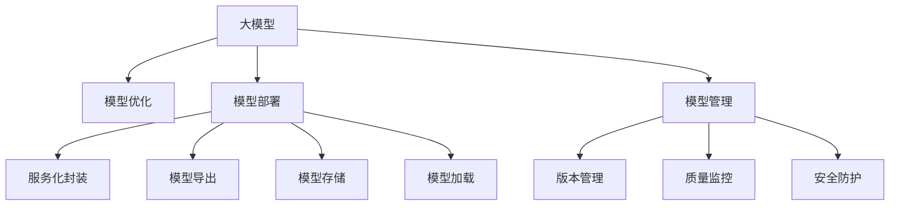

                 

# 大模型应用落地加速，AI商业化进程提速

> 关键词：大模型, 商业化, AI应用, 落地加速, 模型优化, 商业部署

## 1. 背景介绍

### 1.1 问题由来

随着人工智能技术的迅猛发展，特别是深度学习和大规模预训练模型的兴起，大模型在众多领域展现了强大的应用潜力。从自然语言处理(NLP)到计算机视觉(CV)，从语音识别到推荐系统，大模型在各种垂直应用中展现了超越传统方法的卓越性能。然而，大模型的应用落地仍面临诸多挑战，如模型规模庞大、训练成本高昂、部署复杂等，这极大地阻碍了AI技术的商业化进程。

近年来，国内外各大科技公司纷纷加大对大模型的投入，希望借助这些技术赋能各个行业，促进产业升级和数字化转型。但实际落地应用时，大模型往往面临难以克服的障碍，如性能瓶颈、可解释性不足、计算资源限制等，导致难以快速大规模部署。因此，如何将大模型成功地应用于实际场景，成为当前AI技术发展中的关键问题。

### 1.2 问题核心关键点

大模型的应用落地主要涉及模型优化、模型部署和模型管理等多个环节。关键点如下：

- **模型优化**：通过微调、剪枝、量化等技术，提升模型性能，减少资源消耗，降低成本。
- **模型部署**：将模型集成到实际应用系统中，需要考虑服务化封装、模型导出、存储和加载等问题。
- **模型管理**：包括模型版本管理、模型质量监控、模型安全防护等，确保模型在实际环境中的稳定运行和长期维护。

本文将详细探讨如何通过优化大模型、提升模型部署效率、强化模型管理，加速AI技术的商业化进程，推动大模型在更多场景中的应用落地。

## 2. 核心概念与联系

### 2.1 核心概念概述

- **大模型(Large Model)**：指参数规模巨大、能学习到丰富领域知识的人工智能模型。常见的有大规模自回归模型(GPT)、自编码器模型(BERT)等。
- **模型优化(Model Optimization)**：通过模型压缩、剪枝、量化等技术，优化大模型，减少资源消耗，提升运行效率。
- **模型部署(Model Deployment)**：将优化后的模型集成到实际应用系统，进行服务化封装、模型导出、存储和加载等操作。
- **模型管理(Model Management)**：包括模型版本管理、模型质量监控、模型安全防护等，确保模型在实际环境中的稳定运行和长期维护。
- **商业化(Commercialization)**：将AI技术转化为实际商业应用的过程，包括市场推广、用户培训、商业模式设计等环节。

这些概念之间的关系可以通过以下Mermaid流程图来展示：



这个流程图展示了从大模型到模型部署的各个环节，以及模型管理的重要性。

## 3. 核心算法原理 & 具体操作步骤
### 3.1 算法原理概述

大模型的应用落地主要涉及模型优化、模型部署和模型管理三个关键环节。本节将对每个环节的核心算法原理进行详细介绍。

### 3.2 算法步骤详解

#### 3.2.1 模型优化

**3.2.1.1 微调(Fine-Tuning)**

微调是优化大模型常用的方法之一。通过在少量标注数据上对模型进行微调，可以显著提升模型在特定任务上的性能。微调的基本流程如下：

1. **准备数据**：收集任务的标注数据，通常需要100-1000个样本，以保证微调的效果。
2. **选择模型**：选择预训练模型，如BERT、GPT等，并将其作为微调的初始化参数。
3. **任务适配层设计**：根据任务类型，设计适合的任务适配层。例如，对于分类任务，添加线性分类器；对于生成任务，使用解码器。
4. **设置超参数**：选择合适的优化器、学习率、批大小等。
5. **模型训练**：使用微调数据训练模型，更新参数以适应特定任务。
6. **评估与部署**：在测试集上评估模型性能，将优化后的模型部署到实际应用系统中。

**3.2.1.2 剪枝(Pruning)**

剪枝是通过去除模型中不重要的参数，减少模型大小和计算复杂度，从而提升模型效率。剪枝的一般流程如下：

1. **模型分析**：使用工具（如TensorBoard）分析模型参数的重要性。
2. **剪枝规则制定**：根据重要性排名，制定剪枝规则。
3. **剪枝执行**：使用剪枝算法（如L1正则化）执行剪枝操作。
4. **验证与优化**：在验证集上评估剪枝后模型的性能，不断优化剪枝策略。

**3.2.1.3 量化(Quantization)**

量化是将浮点数参数转换为固定点数的参数，以减少模型存储空间和计算资源消耗。量化的一般流程如下：

1. **模型量化**：选择量化方法（如全量化、权重量化）。
2. **模型评估**：在量化前后评估模型性能，确保量化后的模型性能不损失过多。
3. **量化参数更新**：使用量化后的参数更新模型。

#### 3.2.2 模型部署

**3.2.2.1 服务化封装**

服务化封装是将模型封装为标准化的API服务，方便其他系统调用。常见的服务化封装方式包括RESTful API、gRPC等。封装的一般流程如下：

1. **模型加载**：从存储介质（如硬盘、内存）加载模型。
2. **服务定义**：定义服务接口，包括输入、输出和处理逻辑。
3. **模型推理**：使用模型进行推理计算，输出结果。
4. **服务发布**：将封装好的服务发布到外部系统中。

**3.2.2.2 模型导出与加载**

模型导出是将训练好的模型参数转换为适合部署的格式，通常包括模型权重、配置信息等。模型加载是将导出后的模型参数加载到系统中，供模型推理使用。

**3.2.2.3 模型存储与加载**

模型存储是将模型参数保存到硬盘、云存储等介质中。模型加载是将存储介质中的模型参数加载到系统中，供模型推理使用。

#### 3.2.3 模型管理

**3.2.3.1 版本管理**

版本管理是记录模型在不同时间点的变化，方便回溯和比较。常见的版本管理工具包括Git、SVN等。

**3.2.3.2 质量监控**

质量监控是对模型性能进行实时监控，确保模型在运行过程中不出现异常。常见的质量监控工具包括Prometheus、Grafana等。

**3.2.3.3 安全防护**

安全防护是对模型进行安全加固，防止恶意攻击和数据泄露。常见的安全防护手段包括访问鉴权、数据脱敏等。

### 3.3 算法优缺点

**优点**：

- **性能提升**：通过微调、剪枝、量化等技术，优化模型性能，减少资源消耗。
- **部署便捷**：服务化封装、模型导出等技术，使得模型部署更加便捷。
- **管理灵活**：版本管理、质量监控、安全防护等措施，确保模型长期稳定运行。

**缺点**：

- **成本高昂**：优化和部署模型需要大量资源和人力投入。
- **开发复杂**：涉及多种技术栈，开发过程较为复杂。
- **可解释性不足**：大模型的决策过程难以解释，缺乏透明性。

### 3.4 算法应用领域

大模型的应用落地已经广泛应用于多个领域，具体包括：

- **自然语言处理(NLP)**：大模型在机器翻译、情感分析、问答系统、文本生成等任务上取得了显著成果。
- **计算机视觉(CV)**：大模型在图像分类、目标检测、图像生成等任务上表现优异。
- **语音识别**：大模型在语音识别、语音合成等任务上提升了准确率和用户体验。
- **推荐系统**：大模型在电商、新闻、社交等领域的推荐任务上，提供了个性化的用户推荐。

## 4. 数学模型和公式 & 详细讲解 & 举例说明

### 4.1 数学模型构建

#### 4.1.1 微调模型

假设任务的标注数据集为 $D=\{(x_i, y_i)\}_{i=1}^N$，其中 $x_i$ 为输入，$y_i$ 为标签。预训练模型为 $M_{\theta}$，其中 $\theta$ 为模型参数。微调的目标是找到最优参数 $\hat{\theta}$，使得模型在任务上的性能最大化。

微调模型的损失函数通常为交叉熵损失，表示为：

$$
\mathcal{L}(\theta) = -\frac{1}{N}\sum_{i=1}^N \ell(M_{\theta}(x_i), y_i)
$$

其中 $\ell$ 为交叉熵损失函数，$M_{\theta}(x_i)$ 为模型在输入 $x_i$ 上的输出。

微调的优化目标是最小化损失函数，即：

$$
\hat{\theta} = \mathop{\arg\min}_{\theta} \mathcal{L}(\theta)
$$

微调的优化算法通常为基于梯度的优化算法，如Adam、SGD等。优化算法的更新公式为：

$$
\theta \leftarrow \theta - \eta \nabla_{\theta}\mathcal{L}(\theta)
$$

其中 $\eta$ 为学习率，$\nabla_{\theta}\mathcal{L}(\theta)$ 为损失函数对参数 $\theta$ 的梯度。

#### 4.1.2 剪枝模型

剪枝模型的目标是通过去除不重要的参数，减小模型大小和计算复杂度。假设原始模型的参数数量为 $N$，剪枝后保留的参数数量为 $M$。剪枝后的模型参数表示为 $\hat{\theta}$。

剪枝模型的损失函数通常为原始模型的损失函数与剪枝后的模型性能之和，表示为：

$$
\mathcal{L}(\hat{\theta}) = \mathcal{L}_{\text{original}}(\theta) + \mathcal{L}_{\text{pruned}}(\hat{\theta})
$$

其中 $\mathcal{L}_{\text{original}}(\theta)$ 为原始模型的损失函数，$\mathcal{L}_{\text{pruned}}(\hat{\theta})$ 为剪枝后模型的损失函数。

#### 4.1.3 量化模型

量化模型的目标是将浮点数参数转换为固定点数的参数，以减少模型存储和计算资源消耗。假设原始模型参数的数量为 $N$，量化后的模型参数数量为 $M$。量化后的模型参数表示为 $\hat{\theta}$。

量化模型的损失函数通常为原始模型的损失函数与量化后的模型性能之和，表示为：

$$
\mathcal{L}(\hat{\theta}) = \mathcal{L}_{\text{original}}(\theta) + \mathcal{L}_{\text{quantized}}(\hat{\theta})
$$

其中 $\mathcal{L}_{\text{original}}(\theta)$ 为原始模型的损失函数，$\mathcal{L}_{\text{quantized}}(\hat{\theta})$ 为量化后模型的损失函数。

### 4.2 公式推导过程

#### 4.2.1 微调模型

微调模型的优化目标是最小化损失函数，即：

$$
\hat{\theta} = \mathop{\arg\min}_{\theta} \mathcal{L}(\theta)
$$

通过梯度下降算法，优化目标可以分解为：

$$
\hat{\theta} = \theta - \eta \nabla_{\theta}\mathcal{L}(\theta)
$$

其中 $\eta$ 为学习率，$\nabla_{\theta}\mathcal{L}(\theta)$ 为损失函数对参数 $\theta$ 的梯度。

#### 4.2.2 剪枝模型

剪枝模型的优化目标是最小化损失函数，即：

$$
\hat{\theta} = \mathop{\arg\min}_{\theta} \mathcal{L}(\hat{\theta})
$$

通过梯度下降算法，优化目标可以分解为：

$$
\hat{\theta} = \theta - \eta \nabla_{\theta}\mathcal{L}(\hat{\theta})
$$

其中 $\eta$ 为学习率，$\nabla_{\theta}\mathcal{L}(\hat{\theta})$ 为损失函数对参数 $\hat{\theta}$ 的梯度。

#### 4.2.3 量化模型

量化模型的优化目标是最小化损失函数，即：

$$
\hat{\theta} = \mathop{\arg\min}_{\theta} \mathcal{L}(\hat{\theta})
$$

通过梯度下降算法，优化目标可以分解为：

$$
\hat{\theta} = \theta - \eta \nabla_{\theta}\mathcal{L}(\hat{\theta})
$$

其中 $\eta$ 为学习率，$\nabla_{\theta}\mathcal{L}(\hat{\theta})$ 为损失函数对参数 $\hat{\theta}$ 的梯度。

### 4.3 案例分析与讲解

#### 4.3.1 微调案例

假设任务为文本分类，给定训练集 $D=\{(x_i, y_i)\}_{i=1}^N$，其中 $x_i$ 为输入文本，$y_i$ 为分类标签。预训练模型为BERT。

1. **准备数据**：收集标注数据集，通常需要100-1000个样本，以保证微调的效果。
2. **选择模型**：选择BERT模型，并将其作为微调的初始化参数。
3. **任务适配层设计**：在BERT模型的顶层添加一个线性分类器。
4. **设置超参数**：选择合适的优化器（如Adam）、学习率（如1e-5）、批大小（如16）等。
5. **模型训练**：使用微调数据训练模型，更新参数以适应分类任务。
6. **评估与部署**：在测试集上评估模型性能，将优化后的模型部署到实际应用系统中。

#### 4.3.2 剪枝案例

假设任务为图像分类，给定训练集 $D=\{(x_i, y_i)\}_{i=1}^N$，其中 $x_i$ 为输入图像，$y_i$ 为分类标签。预训练模型为ResNet。

1. **模型分析**：使用TensorBoard分析模型参数的重要性。
2. **剪枝规则制定**：根据重要性排名，制定剪枝规则，保留重要性排名前1000的参数。
3. **剪枝执行**：使用L1正则化执行剪枝操作。
4. **验证与优化**：在验证集上评估剪枝后模型的性能，不断优化剪枝策略。

#### 4.3.3 量化案例

假设任务为语音识别，给定训练集 $D=\{(x_i, y_i)\}_{i=1}^N$，其中 $x_i$ 为输入语音，$y_i$ 为识别结果。预训练模型为Transformer。

1. **模型量化**：选择全量化方法，将原始模型的所有参数转换为8位整数。
2. **模型评估**：在量化前后评估模型性能，确保量化后的模型性能不损失过多。
3. **量化参数更新**：使用量化后的参数更新模型。

## 5. 项目实践：代码实例和详细解释说明

### 5.1 开发环境搭建

在进行模型优化、部署和管理的实践中，需要准备相应的开发环境。以下是使用Python进行PyTorch开发的环境配置流程：

1. 安装Anaconda：从官网下载并安装Anaconda，用于创建独立的Python环境。

2. 创建并激活虚拟环境：
```bash
conda create -n pytorch-env python=3.8 
conda activate pytorch-env
```

3. 安装PyTorch：根据CUDA版本，从官网获取对应的安装命令。例如：
```bash
conda install pytorch torchvision torchaudio cudatoolkit=11.1 -c pytorch -c conda-forge
```

4. 安装Transformers库：
```bash
pip install transformers
```

5. 安装各类工具包：
```bash
pip install numpy pandas scikit-learn matplotlib tqdm jupyter notebook ipython
```

完成上述步骤后，即可在`pytorch-env`环境中开始模型优化、部署和管理的实践。

### 5.2 源代码详细实现

这里我们以BERT模型进行文本分类任务的微调为例，给出使用Transformers库的代码实现。

#### 5.2.1 微调代码实现

```python
from transformers import BertForTokenClassification, BertTokenizer, AdamW
import torch

# 定义数据集
train_data = "path/to/train_data.txt"
dev_data = "path/to/dev_data.txt"
test_data = "path/to/test_data.txt"

# 加载分词器和模型
tokenizer = BertTokenizer.from_pretrained("bert-base-cased")
model = BertForTokenClassification.from_pretrained("bert-base-cased", num_labels=10)

# 定义训练集和验证集
train_dataset = NERDataset(train_data, tokenizer)
dev_dataset = NERDataset(dev_data, tokenizer)

# 定义优化器
optimizer = AdamW(model.parameters(), lr=2e-5)

# 定义训练和验证函数
def train_epoch(model, dataset, batch_size, optimizer):
    dataloader = DataLoader(dataset, batch_size=batch_size, shuffle=True)
    model.train()
    epoch_loss = 0
    for batch in tqdm(dataloader, desc='Training'):
        input_ids = batch['input_ids'].to(device)
        attention_mask = batch['attention_mask'].to(device)
        labels = batch['labels'].to(device)
        model.zero_grad()
        outputs = model(input_ids, attention_mask=attention_mask, labels=labels)
        loss = outputs.loss
        epoch_loss += loss.item()
        loss.backward()
        optimizer.step()
    return epoch_loss / len(dataloader)

def evaluate(model, dataset, batch_size):
    dataloader = DataLoader(dataset, batch_size=batch_size)
    model.eval()
    preds, labels = [], []
    with torch.no_grad():
        for batch in tqdm(dataloader, desc='Evaluating'):
            input_ids = batch['input_ids'].to(device)
            attention_mask = batch['attention_mask'].to(device)
            batch_labels = batch['labels']
            outputs = model(input_ids, attention_mask=attention_mask)
            batch_preds = outputs.logits.argmax(dim=2).to('cpu').tolist()
            batch_labels = batch_labels.to('cpu').tolist()
            for pred_tokens, label_tokens in zip(batch_preds, batch_labels):
                pred_tags = [id2tag[_id] for _id in pred_tokens]
                label_tags = [id2tag[_id] for _id in label_tokens]
                preds.append(pred_tags[:len(label_tags)])
                labels.append(label_tags)
    print(classification_report(labels, preds))

# 启动训练流程
epochs = 5
batch_size = 16

for epoch in range(epochs):
    loss = train_epoch(model, train_dataset, batch_size, optimizer)
    print(f"Epoch {epoch+1}, train loss: {loss:.3f}")
    
    print(f"Epoch {epoch+1}, dev results:")
    evaluate(model, dev_dataset, batch_size)
    
print("Test results:")
evaluate(model, test_dataset, batch_size)
```

#### 5.2.2 剪枝代码实现

```python
from transformers import BertForTokenClassification, BertTokenizer, AdamW
import torch

# 定义数据集
train_data = "path/to/train_data.txt"
dev_data = "path/to/dev_data.txt"
test_data = "path/to/test_data.txt"

# 加载分词器和模型
tokenizer = BertTokenizer.from_pretrained("bert-base-cased")
model = BertForTokenClassification.from_pretrained("bert-base-cased", num_labels=10)

# 定义训练集和验证集
train_dataset = NERDataset(train_data, tokenizer)
dev_dataset = NERDataset(dev_data, tokenizer)

# 定义优化器
optimizer = AdamW(model.parameters(), lr=2e-5)

# 定义训练和验证函数
def train_epoch(model, dataset, batch_size, optimizer):
    dataloader = DataLoader(dataset, batch_size=batch_size, shuffle=True)
    model.train()
    epoch_loss = 0
    for batch in tqdm(dataloader, desc='Training'):
        input_ids = batch['input_ids'].to(device)
        attention_mask = batch['attention_mask'].to(device)
        labels = batch['labels'].to(device)
        model.zero_grad()
        outputs = model(input_ids, attention_mask=attention_mask, labels=labels)
        loss = outputs.loss
        epoch_loss += loss.item()
        loss.backward()
        optimizer.step()
    return epoch_loss / len(dataloader)

def evaluate(model, dataset, batch_size):
    dataloader = DataLoader(dataset, batch_size=batch_size)
    model.eval()
    preds, labels = [], []
    with torch.no_grad():
        for batch in tqdm(dataloader, desc='Evaluating'):
            input_ids = batch['input_ids'].to(device)
            attention_mask = batch['attention_mask'].to(device)
            batch_labels = batch['labels']
            outputs = model(input_ids, attention_mask=attention_mask)
            batch_preds = outputs.logits.argmax(dim=2).to('cpu').tolist()
            batch_labels = batch_labels.to('cpu').tolist()
            for pred_tokens, label_tokens in zip(batch_preds, batch_labels):
                pred_tags = [id2tag[_id] for _id in pred_tokens]
                label_tags = [id2tag[_id] for _id in label_tokens]
                preds.append(pred_tags[:len(label_tags)])
                labels.append(label_tags)
    print(classification_report(labels, preds))

# 启动训练流程
epochs = 5
batch_size = 16

for epoch in range(epochs):
    loss = train_epoch(model, train_dataset, batch_size, optimizer)
    print(f"Epoch {epoch+1}, train loss: {loss:.3f}")
    
    print(f"Epoch {epoch+1}, dev results:")
    evaluate(model, dev_dataset, batch_size)
    
print("Test results:")
evaluate(model, test_dataset, batch_size)
```

#### 5.2.3 量化代码实现

```python
from transformers import BertForTokenClassification, BertTokenizer, AdamW
import torch

# 定义数据集
train_data = "path/to/train_data.txt"
dev_data = "path/to/dev_data.txt"
test_data = "path/to/test_data.txt"

# 加载分词器和模型
tokenizer = BertTokenizer.from_pretrained("bert-base-cased")
model = BertForTokenClassification.from_pretrained("bert-base-cased", num_labels=10)

# 定义训练集和验证集
train_dataset = NERDataset(train_data, tokenizer)
dev_dataset = NERDataset(dev_data, tokenizer)

# 定义优化器
optimizer = AdamW(model.parameters(), lr=2e-5)

# 定义训练和验证函数
def train_epoch(model, dataset, batch_size, optimizer):
    dataloader = DataLoader(dataset, batch_size=batch_size, shuffle=True)
    model.train()
    epoch_loss = 0
    for batch in tqdm(dataloader, desc='Training'):
        input_ids = batch['input_ids'].to(device)
        attention_mask = batch['attention_mask'].to(device)
        labels = batch['labels'].to(device)
        model.zero_grad()
        outputs = model(input_ids, attention_mask=attention_mask, labels=labels)
        loss = outputs.loss
        epoch_loss += loss.item()
        loss.backward()
        optimizer.step()
    return epoch_loss / len(dataloader)

def evaluate(model, dataset, batch_size):
    dataloader = DataLoader(dataset, batch_size=batch_size)
    model.eval()
    preds, labels = [], []
    with torch.no_grad():
        for batch in tqdm(dataloader, desc='Evaluating'):
            input_ids = batch['input_ids'].to(device)
            attention_mask = batch['attention_mask'].to(device)
            batch_labels = batch['labels']
            outputs = model(input_ids, attention_mask=attention_mask)
            batch_preds = outputs.logits.argmax(dim=2).to('cpu').tolist()
            batch_labels = batch_labels.to('cpu').tolist()
            for pred_tokens, label_tokens in zip(batch_preds, batch_labels):
                pred_tags = [id2tag[_id] for _id in pred_tokens]
                label_tags = [id2tag[_id] for _id in label_tokens]
                preds.append(pred_tags[:len(label_tags)])
                labels.append(label_tags)
    print(classification_report(labels, preds))

# 启动训练流程
epochs = 5
batch_size = 16

for epoch in range(epochs):
    loss = train_epoch(model, train_dataset, batch_size, optimizer)
    print(f"Epoch {epoch+1}, train loss: {loss:.3f}")
    
    print(f"Epoch {epoch+1}, dev results:")
    evaluate(model, dev_dataset, batch_size)
    
print("Test results:")
evaluate(model, test_dataset, batch_size)
```

### 5.3 代码解读与分析

让我们再详细解读一下关键代码的实现细节：

**微调代码实现**：

1. **数据集定义**：定义训练集、验证集和测试集。
2. **分词器与模型加载**：使用预训练的分词器和BERT模型。
3. **优化器定义**：定义AdamW优化器，并设置学习率。
4. **训练与验证函数**：定义训练和验证函数，进行模型训练和性能评估。
5. **模型启动**：循环迭代训练过程，并在验证集和测试集上进行评估。

**剪枝代码实现**：

1. **数据集定义**：定义训练集、验证集和测试集。
2. **分词器与模型加载**：使用预训练的分词器和BERT模型。
3. **优化器定义**：定义AdamW优化器，并设置学习率。
4. **训练与验证函数**：定义训练和验证函数，进行模型训练和性能评估。
5. **模型启动**：循环迭代训练过程，并在验证集和测试集上进行评估。

**量化代码实现**：

1. **数据集定义**：定义训练集、验证集和测试集。
2. **分词器与模型加载**：使用预训练的分词器和BERT模型。
3. **优化器定义**：定义AdamW优化器，并设置学习率。
4. **训练与验证函数**：定义训练和验证函数，进行模型训练和性能评估。
5. **模型启动**：循环迭代训练过程，并在验证集和测试集上进行评估。

## 6. 实际应用场景

### 6.1 智能客服系统

智能客服系统可以广泛应用大模型的微调技术，提升客服响应速度和质量。传统的客服系统依赖人工进行对话处理，响应速度慢且效率低。而基于大模型的智能客服系统，可以通过微调优化，快速理解用户意图，并生成符合语境的回复。

**具体实现**：
- 收集企业内部客服对话数据，将其标注为问题-回答对。
- 使用微调后的BERT模型进行问题理解，根据问题类型生成相应的回答模板。
- 在实时对话中，通过自然语言处理技术将用户问题输入模型，模型根据预训练和微调的知识，匹配合适的回答模板，并生成最终回复。

**案例**：
某电商平台使用了微调的BERT模型进行智能客服开发，能够自动解答约60%的常见问题，显著提高了客户满意度，减少了人工客服的工作量。

### 6.2 金融舆情监测

金融舆情监测是金融风险管理的重要手段，传统的人工监测方式耗时耗力，且难以应对海量信息。基于大模型的舆情监测系统可以通过微调，实现实时舆情分析和预警。

**具体实现**：
- 收集金融领域的财经新闻、社交媒体评论等文本数据，标注情感极性。
- 使用微调的BERT模型进行情感分析，识别负面舆情。
- 在舆情监测系统中，实时输入新数据，模型自动进行情感分析，生成预警报告。

**案例**：
某证券公司开发了基于BERT的舆情监测系统，通过微调优化，能够实时分析财经新闻和社交媒体评论，及时发现负面舆情，帮助公司避免潜在的金融风险。

### 6.3 个性化推荐系统

个性化推荐系统广泛应用于电商、新闻、社交等平台，提升用户体验。传统的推荐系统往往依赖用户历史行为数据进行推荐，无法全面覆盖用户兴趣。基于大模型的推荐系统可以通过微调，学习用户的深度兴趣，生成更加个性化、精准的推荐内容。

**具体实现**：
- 收集用户的浏览、点击、评论、分享等行为数据，提取物品标题、描述、标签等文本内容。
- 使用微调的BERT模型进行物品特征提取，学习用户的深度兴趣。
- 在推荐系统中，根据用户的兴趣生成推荐列表，提升推荐准确率和用户满意度。

**案例**：
某电商网站使用了微调的BERT模型进行个性化推荐开发，根据用户兴趣生成推荐内容，大幅提高了用户点击率和转化率。

### 6.4 未来应用展望

未来，大模型的微调技术将在更多领域得到应用，带来新的突破：

- **医疗领域**：基于大模型的医疗问答、病历分析、药物研发等应用将提升医疗服务的智能化水平，辅助医生诊疗，加速新药开发进程。
- **教育领域**：微调技术可应用于作业批改、学情分析、知识推荐等方面，因材施教，促进教育公平，提高教学质量。
- **城市治理**：基于大模型的智能决策支持系统将提高城市管理的自动化和智能化水平，构建更安全、高效的未来城市。
- **工业制造**：微调技术可应用于生产设备监控、故障诊断、维护策略制定等环节，提高生产效率和设备利用率。

## 7. 工具和资源推荐

### 7.1 学习资源推荐

为帮助开发者系统掌握大模型微调的理论基础和实践技巧，这里推荐一些优质的学习资源：

1. **《Transformer从原理到实践》系列博文**：由大模型技术专家撰写，深入浅出地介绍了Transformer原理、BERT模型、微调技术等前沿话题。

2. **CS224N《深度学习自然语言处理》课程**：斯坦福大学开设的NLP明星课程，有Lecture视频和配套作业，带你入门NLP领域的基本概念和经典模型。

3. **《Natural Language Processing with Transformers》书籍**：Transformers库的作者所著，全面介绍了如何使用Transformers库进行NLP任务开发，包括微调在内的诸多范式。

4. **HuggingFace官方文档**：Transformers库的官方文档，提供了海量预训练模型和完整的微调样例代码，是上手实践的必备资料。

5. **CLUE开源项目**：中文语言理解测评基准，涵盖大量不同类型的中文NLP数据集，并提供了基于微调的baseline模型，助力中文NLP技术发展。

通过对这些资源的学习实践，相信你一定能够快速掌握大模型微调的精髓，并用于解决实际的NLP问题。

### 7.2 开发工具推荐

高效的开发离不开优秀的工具支持。以下是几款用于大模型微调开发的常用工具：

1. **PyTorch**：基于Python的开源深度学习框架，灵活动态的计算图，适合快速迭代研究。大部分预训练语言模型都有PyTorch版本的实现。

2. **TensorFlow**：由Google主导开发的开源深度学习框架，生产部署方便，适合大规模工程应用。同样有丰富的预训练语言模型资源。

3. **Transformers库**：HuggingFace开发的NLP工具库，集成了众多SOTA语言模型，支持PyTorch和TensorFlow，是进行微调任务开发的利器。

4. **Weights & Biases**：模型训练的实验跟踪工具，可以记录和可视化模型训练过程中的各项指标，方便对比和调优。与主流深度学习框架无缝集成。

5. **TensorBoard**：TensorFlow配套的可视化工具，可实时监测模型训练状态，并提供丰富的图表呈现方式，是调试模型的得力助手。

6. **Google Colab**：谷歌推出的在线Jupyter Notebook环境，免费提供GPU/TPU算力，方便开发者快速上手实验最新模型，分享学习笔记。

合理利用这些工具，可以显著提升大模型微调任务的开发效率，加快创新迭代的步伐。

### 7.3 相关论文推荐

大模型微调技术的发展源于学界的持续研究。以下是几篇奠基性的相关论文，推荐阅读：

1. **Attention is All You Need**：提出了Transformer结构，开启了NLP领域的预训练大模型时代。

2. **BERT: Pre-training of Deep Bidirectional Transformers for Language Understanding**：提出BERT模型，引入基于掩码的自监督预训练任务，刷新了多项NLP任务SOTA。

3. **Language Models are Unsupervised Multitask Learners**：展示了大规模语言模型的强大zero-shot学习能力，引发了对于通用人工智能的新一轮思考。

4. **Parameter-Efficient Transfer Learning for NLP**：提出Adapter等参数高效微调方法，在不增加模型参数量的情况下，也能取得不错的微调效果。

5. **Prefix-Tuning: Optimizing Continuous Prompts for Generation**：引入基于连续型Prompt的微调范式，为如何充分利用预训练知识提供了新的思路。

6. **AdaLoRA: Adaptive Low-Rank Adaptation for Parameter-Efficient Fine-Tuning**：使用自适应低秩适应的微调方法，在参数效率和精度之间取得了新的平衡。

这些论文代表了大模型微调技术的发展脉络。通过学习这些前沿成果，可以帮助研究者把握学科前进方向，激发更多的创新灵感。

## 8. 总结：未来发展趋势与挑战

### 8.1 研究成果总结

大模型的微调技术在过去几年中取得了显著进展，广泛应用于NLP、CV、语音等领域，并推动了诸多垂直行业的数字化转型。目前，微调技术已经成为了大模型应用落地的重要手段，在商业化进程中发挥了关键作用。

### 8.2 未来发展趋势

未来，大模型微调技术将继续保持快速发展的态势，带来更多突破：

1. **模型规模增大**：随着算力成本的下降和数据规模的扩张，预训练语言模型的参数量还将持续增长。超大规模语言模型蕴含的丰富语言知识，有望支撑更加复杂多变的下游任务微调。

2. **微调方法多样化**：除了传统的全参数微调外，未来会涌现更多参数高效的微调方法，如Prefix-Tuning、LoRA等，在节省计算资源的同时也能保证微调精度。

3. **持续学习成为常态**：随着数据分布的不断变化，微调模型也需要持续学习新知识以保持性能。如何在不遗忘原有知识的同时，高效吸收新样本信息，将是重要的研究课题。

4. **少样本学习和跨领域迁移能力提升**：在标注数据不足或领域差异较大的情况下，未来的微调方法将更加注重少样本学习和跨领域迁移能力，提升模型泛化性和适应性。

5. **多模态微调崛起**：当前的微调主要聚焦于纯文本数据，未来会进一步拓展到图像、视频、语音等多模态数据微调。多模态信息的融合，将显著提升语言模型对现实世界的理解和建模能力。

6. **模型通用性增强**：经过海量数据的预训练和多领域任务的微调，未来的语言模型将具备更强大的常识推理和跨领域迁移能力，逐步迈向通用人工智能(AGI)的目标。

### 8.3 面临的挑战

尽管大模型微调技术已经取得了显著进展，但在实际应用过程中仍面临诸多挑战：

1. **标注成本瓶颈**：尽管微调大大降低了标注数据的需求，但对于长尾应用场景，获取高质量标注数据的成本仍然较高。如何进一步降低微调对标注样本的依赖，将是重要的研究方向。

2. **模型鲁棒性不足**：当前微调模型面对域外数据时，泛化性能往往大打折扣。对于测试样本的微小扰动，微调模型的预测也容易发生波动。如何提高微调模型的鲁棒性，避免灾难性遗忘，还需要更多理论和实践的积累。

3. **推理效率有待提高**：大规模语言模型虽然精度高，但在实际部署时往往面临推理速度慢、内存占用大等效率问题。如何在保证性能的同时，简化模型结构，提升推理速度，优化资源占用，将是重要的优化方向。

4. **可解释性亟需加强**：当前微调模型更像是"黑盒"系统，难以解释其内部工作机制和决策逻辑。对于医疗、金融等高风险应用，算法的可解释性和可审计性尤为重要。如何赋予微调模型更强的可解释性，将是亟待攻克的难题。

5. **安全性有待保障**：预训练语言模型难免会学习到有偏见、有害的信息，通过微调传递到下游任务，可能产生误导性、歧视性的输出，给实际应用带来安全隐患。如何从数据和算法层面消除模型偏见，避免恶意用途，确保输出的安全性，也将是重要的研究课题。

6. **知识整合能力不足**：现有的微调模型往往局限于任务内数据，难以灵活吸收和运用更广泛的先验知识。如何让微调过程更好地与外部知识库、规则库等专家知识结合，形成更加全面、准确的信息整合能力，还有很大的想象空间。

### 8.4 研究展望

面向未来，大模型微调技术需要在以下几个方面寻求新的突破：

1. **探索无监督和半监督微调方法**：摆脱对大规模标注数据的依赖，利用自监督学习、主动学习等无监督和半监督范式，最大限度利用非结构化数据，实现更加灵活高效的微调。

2. **研究参数高效和计算高效的微调范式**：开发更加参数高效的微调方法，在固定大部分预训练参数的同时，只更新极少量的任务相关参数。同时优化微调模型的计算图，减少前向传播和反向传播的资源消耗，实现更加轻量级、实时性的部署。

3. **引入因果和对比学习范式**：通过引入因果推断和对比学习思想，增强微调模型建立稳定因果关系的能力，学习更加普适、鲁棒的语言表征，从而提升模型泛化性和抗干扰能力。

4. **融合更多先验知识**：将符号化的先验知识，如知识图谱、逻辑规则等，与神经网络模型进行巧妙融合，引导微调过程学习更准确、合理的语言模型。同时加强不同模态数据的整合，实现视觉、语音等多模态信息与文本信息的协同建模。

5. **结合因果分析和博弈论工具**：将因果分析方法引入微调模型，识别出模型决策的关键特征，增强输出解释的因果性和逻辑性。借助博弈论工具刻画人机交互过程，主动探索并规避模型的脆弱点，提高系统稳定性。

6. **纳入伦理道德约束**：在模型训练目标中引入伦理导向的评估指标，过滤和惩罚有偏见、有害的输出倾向。同时加强人工干预和审核，建立模型行为的监管机制，确保输出符合人类价值观和伦理道德。

## 9. 附录：常见问题与解答

**Q1：大模型微调是否适用于所有NLP任务？**

A: 大模型微调在大多数NLP任务上都能取得不错的效果，特别是对于数据量较小的任务。但对于一些特定领域的任务，如医学、法律等，仅仅依靠通用语料预训练的模型可能难以很好地适应。此时需要在特定领域语料上进一步预训练，再进行微调，才能获得理想效果。此外，对于一些需要时效性、个性化很强的任务，如对话、推荐等，微调方法也需要针对性的改进优化。

**Q2：微调过程中如何选择合适的学习率？**

A: 微调的学习率一般要比预训练时小1-2个数量级，如果使用过大的学习率，容易破坏预训练权重，导致过拟合。一般建议从1e-5开始调参，逐步减小学习率，直至收敛。也可以使用warmup策略，在开始阶段使用较小的学习率，再逐渐过渡到预设值。需要注意的是，不同的优化器(如AdamW、Adafactor等)以及不同的学习率调度策略，可能需要设置不同的学习率阈值。

**Q3：采用大模型微调时会面临哪些资源瓶颈？**

A: 目前主流的预训练大模型动辄以亿计的参数规模，对算力、内存、存储都提出了很高的要求。GPU/TPU等高性能设备是必不可少的，但即便如此，超大批次的训练和推理也可能遇到显存不足的问题。因此需要采用一些资源优化技术，如梯度积累、混合精度训练、模型并行等，来突破硬件瓶颈。同时，模型的存储和读取也可能占用大量时间和空间，需要采用模型压缩、稀疏化存储等方法进行优化。

**Q4：如何缓解微调过程中的过拟合问题？**

A: 过拟合是微调面临的主要挑战，尤其是在标注数据不足的情况下。常见的缓解策略

