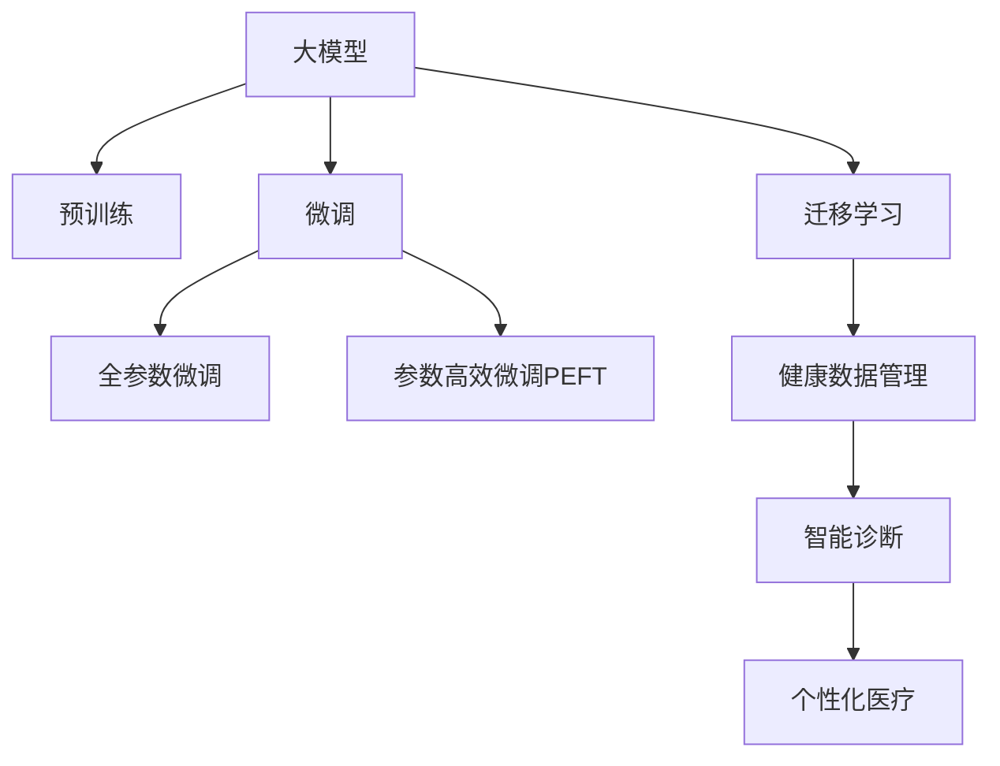

                 

# 大模型时代下的新型健康管理模式

> 关键词：健康管理, 数据驱动, 个性化医疗, 大模型, 医疗影像, 自然语言处理, 智能诊断

## 1. 背景介绍

### 1.1 问题由来
随着人工智能技术的飞速发展，大模型在医疗健康领域的应用日益受到关注。在大模型的助力下，医生可以更加高效、准确地处理患者数据，提升诊断和治疗效果。但传统的医疗数据管理方式已无法满足现代医疗需求，亟需新的模式进行突破。

### 1.2 问题核心关键点
在医疗健康领域，如何利用大模型实现高效、精准的健康管理，提高医疗服务质量，降低医疗成本，成为亟需解决的问题。本文将探讨如何基于大模型构建新型健康管理模式，旨在为医疗机构、健康管理公司及个人用户提供更多元、高效、安全的健康管理服务。

## 2. 核心概念与联系

### 2.1 核心概念概述

为更好地理解新型健康管理模式，本节将介绍几个密切相关的核心概念：

- **大模型(大模型)**：以自回归(如GPT)或自编码(如BERT)模型为代表的大规模预训练语言模型。通过在大规模无标签文本语料上进行预训练，学习通用的语言表示，具备强大的语言理解和生成能力。

- **预训练(Pre-training)**：指在大规模无标签文本语料上，通过自监督学习任务训练通用语言模型的过程。常见的预训练任务包括言语建模、遮挡语言模型等。预训练使得模型学习到语言的通用表示。

- **微调(Fine-tuning)**：指在预训练模型的基础上，使用下游任务的少量标注数据，通过有监督学习优化模型在特定任务上的性能。通常只需要调整顶层分类器或解码器，并以较小的学习率更新全部或部分的模型参数。

- **迁移学习(Transfer Learning)**：指将一个领域学习到的知识，迁移应用到另一个不同但相关的领域的学习范式。大模型的预训练-微调过程即是一种典型的迁移学习方式。

- **健康数据管理**：通过收集和处理各类健康数据，包括但不限于患者的生理指标、医疗影像、病历记录等，为个性化医疗和精准医疗提供支持。

- **智能诊断**：利用机器学习、深度学习等技术，对医疗影像、病历记录等数据进行分析，辅助医生进行疾病诊断和治疗决策。

- **个性化医疗**：根据患者的基因信息、病史、生活习惯等个性化数据，制定个性化的治疗方案和健康管理策略。

这些核心概念之间的逻辑关系可以通过以下Mermaid流程图来展示：



这个流程图展示了大模型在健康管理中的应用框架，包括预训练-微调和迁移学习方式，以及与健康数据管理和智能诊断的紧密联系。

## 3. 核心算法原理 & 具体操作步骤
### 3.1 算法原理概述

基于大模型构建新型健康管理模式的核心思想是：利用预训练模型学习通用语言表示，通过微调和迁移学习，将其应用于健康数据管理、智能诊断和个性化医疗中。其核心算法流程包括数据预处理、模型微调和应用场景部署三个阶段：

1. **数据预处理**：收集健康数据，进行清洗、标注、分片等预处理操作，转化为模型可接受的形式。
2. **模型微调**：在特定医疗数据上对预训练模型进行微调，以适应该领域的任务需求。
3. **应用场景部署**：将微调后的模型部署到实际应用场景中，实现健康数据管理、智能诊断和个性化医疗等功能。

### 3.2 算法步骤详解

**Step 1: 数据预处理**
- 收集健康数据：包括但不限于患者生理指标、医疗影像、病历记录等。
- 数据清洗：去除噪声、缺失数据，确保数据质量。
- 数据标注：对部分数据进行标注，供模型微调使用。
- 数据分片：将数据划分为训练集、验证集和测试集，供模型训练和评估使用。

**Step 2: 模型微调**
- 选择合适的预训练模型 $M_{\theta}$ 作为初始化参数，如 BERT、GPT等。
- 设计任务适配层，根据医疗任务需求调整输出层和损失函数。
- 设置微调超参数，包括学习率、批大小、迭代轮数等。
- 执行梯度训练，在医疗数据上微调模型，最小化损失函数。
- 周期性在验证集上评估模型性能，根据性能指标决定是否触发 Early Stopping。
- 重复上述步骤直到满足预设的迭代轮数或 Early Stopping 条件。

**Step 3: 应用场景部署**
- 在测试集上评估微调后模型 $M_{\hat{\theta}}$ 的性能，对比微调前后的效果。
- 使用微调后的模型对新样本进行推理预测，集成到健康管理系统中。
- 持续收集新的健康数据，定期重新微调模型，以适应数据分布的变化。

### 3.3 算法优缺点

基于大模型构建新型健康管理模式具有以下优点：
1. 高效准确：预训练模型具备强大的语言理解和生成能力，微调后能够在医疗数据上快速学习新任务，提升诊断和治疗效果。
2. 泛化能力强：大模型通过大规模数据预训练，能够较好地泛化到不同医疗领域和数据分布。
3. 可扩展性强：预训练模型可以作为通用组件，根据不同医疗需求进行快速配置和部署。
4. 数据驱动：利用数据驱动的方法，可以更准确地捕捉和利用医疗数据中的信息，提升医疗决策的科学性。

但该方法也存在一定的局限性：
1. 数据隐私问题：医疗数据涉及患者隐私，对数据处理和存储提出了较高要求。
2. 模型复杂性：预训练模型参数量较大，对计算资源和存储资源要求较高。
3. 模型的可解释性不足：黑盒模型难以解释其内部工作机制，可能影响医生和患者的信任度。
4. 伦理和法律问题：模型应用涉及伦理和法律问题，需要严格遵守相关规定。

尽管存在这些局限性，但就目前而言，基于大模型的健康管理模式仍是大数据和人工智能技术在医疗领域应用的典型范式。未来相关研究将重点关注数据隐私保护、模型可解释性和伦理法律合规性等方面的问题。

### 3.4 算法应用领域

基于大模型的健康管理模式，已经在医疗影像诊断、电子病历处理、健康咨询等多个领域得到应用，具体包括：

- **医疗影像诊断**：利用深度学习技术，对医学影像进行分类、分割和标注，辅助医生进行精准诊断。
- **电子病历处理**：对电子病历文本进行情感分析、实体识别等处理，提取关键信息，辅助医生制定治疗方案。
- **健康咨询**：利用自然语言处理技术，对用户咨询进行智能回答和推荐，提升用户体验和医疗服务效率。
- **个性化医疗**：通过分析患者基因信息、病史和生活习惯等数据，提供个性化健康管理和治疗建议。
- **智能诊断**：利用模型对医疗数据进行分析，辅助医生进行疾病诊断和治疗决策，提升诊断准确率。
- **健康数据管理**：对各类健康数据进行收集、清洗和整合，提供多维度健康分析报告，支持健康管理决策。

这些领域的应用，展示了基于大模型的健康管理模式的广阔前景，为医疗健康领域带来了新的突破和机遇。

## 4. 数学模型和公式 & 详细讲解 & 举例说明

### 4.1 数学模型构建

本节将使用数学语言对基于大模型的健康管理模式进行更加严格的刻画。

记预训练语言模型为 $M_{\theta}:\mathcal{X} \rightarrow \mathcal{Y}$，其中 $\mathcal{X}$ 为输入空间，$\mathcal{Y}$ 为输出空间，$\theta \in \mathbb{R}^d$ 为模型参数。假设健康数据集为 $D=\{(x_i,y_i)\}_{i=1}^N, x_i \in \mathcal{X}, y_i \in \mathcal{Y}$。

定义模型 $M_{\theta}$ 在数据样本 $(x,y)$ 上的损失函数为 $\ell(M_{\theta}(x),y)$，则在数据集 $D$ 上的经验风险为：

$$
\mathcal{L}(\theta) = \frac{1}{N} \sum_{i=1}^N \ell(M_{\theta}(x_i),y_i)
$$

微调的优化目标是最小化经验风险，即找到最优参数：

$$
\theta^* = \mathop{\arg\min}_{\theta} \mathcal{L}(\theta)
$$

在实践中，我们通常使用基于梯度的优化算法（如SGD、Adam等）来近似求解上述最优化问题。设 $\eta$ 为学习率，$\lambda$ 为正则化系数，则参数的更新公式为：

$$
\theta \leftarrow \theta - \eta \nabla_{\theta}\mathcal{L}(\theta) - \eta\lambda\theta
$$

其中 $\nabla_{\theta}\mathcal{L}(\theta)$ 为损失函数对参数 $\theta$ 的梯度，可通过反向传播算法高效计算。

### 4.2 公式推导过程

以下我们以医疗影像分类任务为例，推导交叉熵损失函数及其梯度的计算公式。

假设模型 $M_{\theta}$ 在输入 $x$ 上的输出为 $\hat{y}=M_{\theta}(x) \in [0,1]$，表示样本属于某一类别的概率。真实标签 $y \in \{0,1\}$。则二分类交叉熵损失函数定义为：

$$
\ell(M_{\theta}(x),y) = -[y\log \hat{y} + (1-y)\log (1-\hat{y})]
$$

将其代入经验风险公式，得：

$$
\mathcal{L}(\theta) = -\frac{1}{N}\sum_{i=1}^N [y_i\log M_{\theta}(x_i)+(1-y_i)\log(1-M_{\theta}(x_i))]
$$

根据链式法则，损失函数对参数 $\theta_k$ 的梯度为：

$$
\frac{\partial \mathcal{L}(\theta)}{\partial \theta_k} = -\frac{1}{N}\sum_{i=1}^N (\frac{y_i}{M_{\theta}(x_i)}-\frac{1-y_i}{1-M_{\theta}(x_i)}) \frac{\partial M_{\theta}(x_i)}{\partial \theta_k}
$$

其中 $\frac{\partial M_{\theta}(x_i)}{\partial \theta_k}$ 可进一步递归展开，利用自动微分技术完成计算。

### 4.3 案例分析与讲解

以医疗影像分类任务为例，分析基于大模型的健康管理模式的实际应用。

假设模型 $M_{\theta}$ 为预训练的BERT模型，医疗影像数据集 $D$ 包含不同器官的X光影像。我们将其中的部分影像进行标注，作为微调的监督信号。在模型微调过程中，我们使用交叉熵损失函数进行训练，最小化模型输出与真实标签之间的差异。

训练步骤如下：

1. 收集医疗影像数据，进行预处理，如归一化、尺寸调整等，转换为模型输入格式。
2. 在医疗影像数据上，使用微调后的BERT模型进行分类任务，预测影像类别。
3. 计算预测结果与真实标签之间的交叉熵损失，使用AdamW优化器更新模型参数。
4. 周期性在验证集上评估模型性能，根据性能指标决定是否触发 Early Stopping。
5. 重复上述步骤直到满足预设的迭代轮数或 Early Stopping 条件。

在模型训练完成后，我们对测试集上的医疗影像进行分类预测，输出模型预测结果和对应的损失值。通过分析预测结果和损失值，评估模型在不同医疗影像上的分类准确率和鲁棒性。

## 5. 项目实践：代码实例和详细解释说明

### 5.1 开发环境搭建

在进行健康管理模式开发前，我们需要准备好开发环境。以下是使用Python进行TensorFlow开发的环境配置流程：

1. 安装Anaconda：从官网下载并安装Anaconda，用于创建独立的Python环境。

2. 创建并激活虚拟环境：
```bash
conda create -n tf-env python=3.8 
conda activate tf-env
```

3. 安装TensorFlow：根据CUDA版本，从官网获取对应的安装命令。例如：
```bash
conda install tensorflow tensorflow-gpu=cuda11.1 -c pytorch -c conda-forge
```

4. 安装Keras和TensorFlow Addons等工具包：
```bash
pip install keras tensorflow-addons
```

5. 安装各类工具包：
```bash
pip install numpy pandas scikit-learn matplotlib tqdm jupyter notebook ipython
```

完成上述步骤后，即可在`tf-env`环境中开始健康管理模式的开发。

### 5.2 源代码详细实现

下面我们以医疗影像分类任务为例，给出使用TensorFlow对BERT模型进行微调的代码实现。

首先，定义数据处理函数：

```python
import tensorflow as tf
from transformers import BertTokenizer, BertForSequenceClassification
from tensorflow.keras.preprocessing.image import ImageDataGenerator
from tensorflow.keras.utils import to_categorical

class DataGenerator(tf.keras.preprocessing.image.ImageDataGenerator):
    def __init__(self, train_dir, val_dir, test_dir, batch_size=32):
        super(DataGenerator, self).__init__(rescale=1./255, batch_size=batch_size)
        self.train_generator = ImageDataGenerator(train_dir, validation_split=0.2)
        self.val_generator = ImageDataGenerator(val_dir)
        self.test_generator = ImageDataGenerator(test_dir)

    def get_train_data(self):
        return self.train_generator.flow_from_directory(train_dir, target_size=(224, 224), batch_size=batch_size)

    def get_val_data(self):
        return self.val_generator.flow_from_directory(val_dir, target_size=(224, 224), batch_size=batch_size)

    def get_test_data(self):
        return self.test_generator.flow_from_directory(test_dir, target_size=(224, 224), batch_size=batch_size)
```

然后，定义模型和优化器：

```python
from transformers import BertForSequenceClassification

model = BertForSequenceClassification.from_pretrained('bert-base-cased', num_labels=2)

optimizer = tf.keras.optimizers.Adam(learning_rate=2e-5)
```

接着，定义训练和评估函数：

```python
import numpy as np

def train_epoch(model, train_data, batch_size, optimizer):
    model.compile(optimizer=optimizer, loss='binary_crossentropy', metrics=['accuracy'])
    model.fit(train_data, epochs=1, batch_size=batch_size)
    return model.evaluate(train_data)

def evaluate(model, val_data, batch_size):
    model.compile(optimizer=optimizer, loss='binary_crossentropy', metrics=['accuracy'])
    return model.evaluate(val_data, batch_size)
```

最后，启动训练流程并在测试集上评估：

```python
epochs = 5
batch_size = 16

for epoch in range(epochs):
    train_loss, train_acc = train_epoch(model, train_data, batch_size, optimizer)
    print(f"Epoch {epoch+1}, train loss: {train_loss:.3f}, train acc: {train_acc:.3f}")
    
    print(f"Epoch {epoch+1}, dev results:")
    dev_loss, dev_acc = evaluate(model, val_data, batch_size)
    print(f"dev loss: {dev_loss:.3f}, dev acc: {dev_acc:.3f}")
    
print("Test results:")
test_loss, test_acc = evaluate(model, test_data, batch_size)
print(f"test loss: {test_loss:.3f}, test acc: {test_acc:.3f}")
```

以上就是使用TensorFlow对BERT进行医疗影像分类任务微调的完整代码实现。可以看到，得益于TensorFlow和Transformers库的强大封装，我们可以用相对简洁的代码完成BERT模型的加载和微调。

### 5.3 代码解读与分析

让我们再详细解读一下关键代码的实现细节：

**DataGenerator类**：
- `__init__`方法：初始化训练、验证和测试数据生成器，并进行归一化、尺寸调整等预处理。
- `get_train_data`方法：返回训练数据生成器。
- `get_val_data`方法：返回验证数据生成器。
- `get_test_data`方法：返回测试数据生成器。

**模型和优化器**：
- `BertForSequenceClassification`：加载预训练的BERT模型，并设置分类任务。
- `Adam`：定义优化器，学习率为2e-5。

**训练和评估函数**：
- 使用TensorFlow的`compile`和`fit`方法，进行模型的训练和评估。
- `train_epoch`函数：对数据以批为单位进行迭代，在每个批次上前向传播计算损失并反向传播更新模型参数，最后返回该epoch的平均loss和acc。
- `evaluate`函数：与训练类似，不同点在于不更新模型参数，并在每个batch结束后将预测和标签结果存储下来，最后使用模型的`evaluate`方法输出评估结果。

**训练流程**：
- 定义总的epoch数和batch size，开始循环迭代
- 每个epoch内，先在训练集上训练，输出平均loss和acc
- 在验证集上评估，输出评估结果
- 所有epoch结束后，在测试集上评估，给出最终测试结果

可以看到，TensorFlow配合Transformers库使得BERT微调的代码实现变得简洁高效。开发者可以将更多精力放在数据处理、模型改进等高层逻辑上，而不必过多关注底层的实现细节。

当然，工业级的系统实现还需考虑更多因素，如模型的保存和部署、超参数的自动搜索、更灵活的任务适配层等。但核心的微调范式基本与此类似。

## 6. 实际应用场景
### 6.1 智能体检系统

基于大模型的健康管理模式，可以实现智能体检系统的构建。传统的体检方式耗时长、效率低，且体检结果解读复杂，无法实时反馈。智能体检系统通过结合医疗影像、生理指标等多维度数据，利用大模型进行实时分析和反馈，提升体检效率和准确性。

在技术实现上，可以收集体检用户的各类生理指标数据和医疗影像数据，使用大模型进行智能分析和诊断，生成个性化的体检报告。在用户体检结束后，智能系统还可以实时监测用户的健康数据，提供健康预警和建议，促进健康管理。

### 6.2 慢性病管理

基于大模型的健康管理模式，可以应用于慢性病管理领域，帮助患者更好地控制和管理疾病。传统的慢性病管理依赖于医生的手动记录和定期检查，无法实时监测和管理患者的健康状况。智能慢性病管理系统通过实时收集患者的生理指标数据，利用大模型进行分析和预测，提供个性化的健康建议和治疗方案，提升患者的健康管理效果和生活质量。

具体而言，可以开发智能慢性病管理系统，通过移动应用收集患者的健康数据，如血压、血糖、心率等，利用大模型进行分析和预测，生成个性化的健康建议和预警信息，辅助患者进行自我管理。系统还可以与医疗机构协同工作，及时调整治疗方案，提升慢性病管理的科学性和有效性。

### 6.3 智慧养老

基于大模型的健康管理模式，可以应用于智慧养老领域，提升老年人的健康管理和生活质量。传统的养老方式依赖于人工服务，服务效率低、成本高，且无法实时监测和管理老年人的健康状况。智能养老管理系统通过结合医疗影像、生理指标等多维度数据，利用大模型进行分析和预测，提供个性化的健康建议和治疗方案，提升老年人的健康管理效果和生活质量。

具体而言，可以开发智能养老管理系统，通过智能手环、智能床等设备收集老年人的健康数据，如心率、血压、睡眠质量等，利用大模型进行分析和预测，生成个性化的健康建议和预警信息，辅助老年人进行自我管理。系统还可以与医疗机构协同工作，及时调整治疗方案，提升老年人的健康管理效果和生活质量。

### 6.4 未来应用展望

随着大模型和微调方法的不断发展，基于健康管理模式的应用前景将更加广阔。

在智慧医疗领域，基于大模型的健康管理模式可以应用于医疗影像分析、电子病历处理、智能诊断等多个环节，提升医疗服务的智能化水平，辅助医生进行疾病诊断和治疗决策。

在智能健康管理领域，基于大模型的健康管理模式可以应用于个性化健康管理、慢性病管理、智慧养老等多个方向，提升健康管理的个性化、智能化和实时性，为患者提供更好的健康服务。

在企业健康管理领域，基于大模型的健康管理模式可以应用于员工健康管理、员工心理健康分析、企业健康预警等多个方向，提升企业健康管理水平，增强企业竞争力。

总之，大模型在健康管理领域的应用将带来新的突破和变革，为医疗健康行业带来新的发展机遇。

## 7. 工具和资源推荐
### 7.1 学习资源推荐

为了帮助开发者系统掌握基于大模型的健康管理模式的理论基础和实践技巧，这里推荐一些优质的学习资源：

1. 《深度学习与医疗健康》书籍：介绍深度学习在医疗健康领域的应用，包括医疗影像分类、电子病历处理等任务。

2. TensorFlow官方文档：TensorFlow官方文档提供了丰富的使用指南和示例代码，是学习TensorFlow的必备资源。

3. Keras官方文档：Keras官方文档提供了简单易用的API，适合快速上手深度学习项目。

4. Transformers官方文档：Transformers官方文档介绍了各种预训练语言模型，包括BERT、GPT等，并提供了丰富的微调样例代码。

5. HuggingFace博客：HuggingFace博客提供了大量关于大模型在医疗健康领域应用的案例分析和技术分享。

通过对这些资源的学习实践，相信你一定能够快速掌握基于大模型的健康管理模式的精髓，并用于解决实际的医疗健康问题。
###  7.2 开发工具推荐

高效的开发离不开优秀的工具支持。以下是几款用于健康管理模式开发的常用工具：

1. TensorFlow：基于Python的开源深度学习框架，灵活动态的计算图，适合快速迭代研究。大量预训练语言模型都有TensorFlow版本的实现。

2. Keras：基于TensorFlow的高级神经网络API，简单易用，适合快速搭建和调试深度学习模型。

3. Transformers库：HuggingFace开发的NLP工具库，集成了各种SOTA语言模型，支持TensorFlow和PyTorch，是进行健康管理模式微调的重要工具。

4. Weights & Biases：模型训练的实验跟踪工具，可以记录和可视化模型训练过程中的各项指标，方便对比和调优。与主流深度学习框架无缝集成。

5. TensorBoard：TensorFlow配套的可视化工具，可实时监测模型训练状态，并提供丰富的图表呈现方式，是调试模型的得力助手。

6. Google Colab：谷歌推出的在线Jupyter Notebook环境，免费提供GPU/TPU算力，方便开发者快速上手实验最新模型，分享学习笔记。

合理利用这些工具，可以显著提升基于大模型的健康管理模式的开发效率，加快创新迭代的步伐。

### 7.3 相关论文推荐

大模型和健康管理模式的结合，为医疗健康领域带来了新的研究方向和应用前景。以下是几篇奠基性的相关论文，推荐阅读：

1. Attention is All You Need：提出Transformer结构，开启了NLP领域的预训练大模型时代。

2. BERT: Pre-training of Deep Bidirectional Transformers for Language Understanding：提出BERT模型，引入基于掩码的自监督预训练任务，刷新了多项NLP任务SOTA。

3. ImageNet Classification with Deep Convolutional Neural Networks：提出卷积神经网络(CNN)，广泛应用于医疗影像分类等任务。

4. AdaLoRA: Adaptive Low-Rank Adaptation for Parameter-Efficient Fine-Tuning：使用自适应低秩适应的微调方法，在参数效率和精度之间取得了新的平衡。

5. Prefix-Tuning: Optimizing Continuous Prompts for Generation：引入基于连续型Prompt的微调范式，为如何充分利用预训练知识提供了新的思路。

这些论文代表了大模型在健康管理领域的应用前景。通过学习这些前沿成果，可以帮助研究者把握学科前进方向，激发更多的创新灵感。

## 8. 总结：未来发展趋势与挑战

### 8.1 总结

本文对基于大模型的健康管理模式进行了全面系统的介绍。首先阐述了大模型和健康管理模式的研究背景和意义，明确了微调在拓展预训练模型应用、提升医疗服务质量方面的独特价值。其次，从原理到实践，详细讲解了基于大模型的健康管理模式的数学原理和关键步骤，给出了微调任务开发的完整代码实例。同时，本文还广泛探讨了基于大模型的健康管理模式在智能体检、慢性病管理、智慧养老等多个领域的应用前景，展示了微调范式的巨大潜力。此外，本文精选了微调技术的各类学习资源，力求为读者提供全方位的技术指引。

通过本文的系统梳理，可以看到，基于大模型的健康管理模式在提升医疗服务效率和质量方面具有广阔的应用前景，为医疗健康行业带来了新的突破和机遇。

### 8.2 未来发展趋势

展望未来，基于大模型的健康管理模式将呈现以下几个发展趋势：

1. 模型规模持续增大。随着算力成本的下降和数据规模的扩张，预训练语言模型的参数量还将持续增长。超大规模语言模型蕴含的丰富语言知识，有望支撑更加复杂多变的健康管理任务。

2. 微调方法日趋多样。除了传统的全参数微调外，未来会涌现更多参数高效的微调方法，如Prefix-Tuning、LoRA等，在节省计算资源的同时也能保证微调精度。

3. 持续学习成为常态。随着数据分布的不断变化，微调模型也需要持续学习新知识以保持性能。如何在不遗忘原有知识的同时，高效吸收新样本信息，将成为重要的研究课题。

4. 标注样本需求降低。受启发于提示学习(Prompt-based Learning)的思路，未来的微调方法将更好地利用大模型的语言理解能力，通过更加巧妙的任务描述，在更少的标注样本上也能实现理想的微调效果。

5. 多模态微调崛起。当前的微调主要聚焦于纯文本数据，未来会进一步拓展到图像、视频、语音等多模态数据微调。多模态信息的融合，将显著提升语言模型对现实世界的理解和建模能力。

6. 模型通用性增强。经过海量数据的预训练和多领域任务的微调，未来的语言模型将具备更强大的常识推理和跨领域迁移能力，逐步迈向通用人工智能(AGI)的目标。

以上趋势凸显了大模型在健康管理领域的应用前景。这些方向的探索发展，必将进一步提升基于大模型的健康管理模式的性能和应用范围，为医疗健康行业带来新的发展机遇。

### 8.3 面临的挑战

尽管基于大模型的健康管理模式已经取得了瞩目成就，但在迈向更加智能化、普适化应用的过程中，它仍面临着诸多挑战：

1. 数据隐私问题。医疗数据涉及患者隐私，对数据处理和存储提出了较高要求。如何在保护患者隐私的前提下，合理利用健康数据，是未来需要解决的重要问题。

2. 模型鲁棒性不足。当前微调模型面对域外数据时，泛化性能往往大打折扣。对于测试样本的微小扰动，微调模型的预测也容易发生波动。如何提高微调模型的鲁棒性，避免灾难性遗忘，还需要更多理论和实践的积累。

3. 推理效率有待提高。大规模语言模型虽然精度高，但在实际部署时往往面临推理速度慢、内存占用大等效率问题。如何在保证性能的同时，简化模型结构，提升推理速度，优化资源占用，将是重要的优化方向。

4. 可解释性亟需加强。当前微调模型更像是"黑盒"系统，难以解释其内部工作机制和决策逻辑。对于医疗、金融等高风险应用，算法的可解释性和可审计性尤为重要。如何赋予微调模型更强的可解释性，将是亟待攻克的难题。

5. 安全性有待保障。预训练语言模型难免会学习到有偏见、有害的信息，通过微调传递到下游任务，产生误导性、歧视性的输出，给实际应用带来安全隐患。如何从数据和算法层面消除模型偏见，避免恶意用途，确保输出的安全性，也将是重要的研究课题。

6. 知识整合能力不足。现有的微调模型往往局限于任务内数据，难以灵活吸收和运用更广泛的先验知识。如何让微调过程更好地与外部知识库、规则库等专家知识结合，形成更加全面、准确的信息整合能力，还有很大的想象空间。

正视基于大模型的健康管理模式面临的这些挑战，积极应对并寻求突破，将是大模型在医疗健康领域走向成熟的必由之路。相信随着学界和产业界的共同努力，这些挑战终将一一被克服，基于大模型的健康管理模式必将在构建安全、可靠、可解释、可控的智能系统上取得更大的进展。

### 8.4 研究展望

面向未来，基于大模型的健康管理模式的研究方向主要集中在以下几个方面：

1. 探索无监督和半监督微调方法。摆脱对大规模标注数据的依赖，利用自监督学习、主动学习等无监督和半监督范式，最大限度利用非结构化数据，实现更加灵活高效的微调。

2. 研究参数高效和计算高效的微调范式。开发更加参数高效的微调方法，在固定大部分预训练参数的同时，只更新极少量的任务相关参数。同时优化微调模型的计算图，减少前向传播和反向传播的资源消耗，实现更加轻量级、实时性的部署。

3. 融合因果和对比学习范式。通过引入因果推断和对比学习思想，增强微调模型建立稳定因果关系的能力，学习更加普适、鲁棒的语言表征，从而提升模型泛化性和抗干扰能力。

4. 引入更多先验知识。将符号化的先验知识，如知识图谱、逻辑规则等，与神经网络模型进行巧妙融合，引导微调过程学习更准确、合理的语言模型。同时加强不同模态数据的整合，实现视觉、语音等多模态信息与文本信息的协同建模。

5. 结合因果分析和博弈论工具。将因果分析方法引入微调模型，识别出模型决策的关键特征，增强输出解释的因果性和逻辑性。借助博弈论工具刻画人机交互过程，主动探索并规避模型的脆弱点，提高系统稳定性。

6. 纳入伦理道德约束。在模型训练目标中引入伦理导向的评估指标，过滤和惩罚有偏见、有害的输出倾向。同时加强人工干预和审核，建立模型行为的监管机制，确保输出符合人类价值观和伦理道德。

这些研究方向将进一步推动基于大模型的健康管理模式的发展，为医疗健康行业带来新的突破和机遇。未来，随着技术的不断进步，基于大模型的健康管理模式必将在大数据、人工智能等技术支持下，实现更加智能化、个性化和高效化的应用，为人类健康带来更深刻的变革。

## 9. 附录：常见问题与解答

**Q1：如何确保基于大模型的健康管理模式的安全性？**

A: 确保基于大模型的健康管理模式的安全性，可以从以下几个方面入手：

1. 数据隐私保护：在数据收集和处理过程中，采取严格的隐私保护措施，如数据匿名化、加密等，确保患者隐私不被泄露。

2. 模型鲁棒性提升：利用对抗训练等技术，增强模型对抗输入扰动的鲁棒性，避免模型被恶意攻击。

3. 可解释性和透明性：通过引入因果分析和博弈论工具，增强模型的可解释性和透明性，便于医生和患者理解模型的决策过程和输出结果。

4. 伦理和法律合规：在模型训练和应用过程中，严格遵守相关伦理和法律规定，确保模型的输出和行为符合道德规范和法律法规。

5. 定期更新和维护：定期对模型进行更新和维护，及时修复漏洞和缺陷，确保模型的安全性和可靠性。

总之，确保基于大模型的健康管理模式的安全性，需要从数据隐私保护、模型鲁棒性提升、可解释性和透明性、伦理和法律合规等多个维度进行综合考虑和应对。

**Q2：基于大模型的健康管理模式在实际应用中如何提高效率？**

A: 提高基于大模型的健康管理模式的效率，可以从以下几个方面入手：

1. 参数高效微调：采用参数高效微调技术，如Prefix-Tuning、LoRA等，在固定大部分预训练参数的同时，只更新极少量的任务相关参数，减少计算资源消耗。

2. 模型压缩和优化：利用模型压缩和优化技术，如模型裁剪、量化加速等，减小模型大小和推理速度，提高系统效率。

3. 推理加速：利用深度学习框架提供的优化算法和工具，如TensorRT、ONNX Runtime等，进行推理加速，提升系统响应速度。

4. 异构计算：利用异构计算技术，如GPU、TPU等硬件加速器，进行分布式并行计算，提高模型训练和推理效率。

5. 模型集成：通过模型集成技术，如模型融合、模型蒸馏等，提升模型的泛化能力和鲁棒性，提高系统效率。

总之，提高基于大模型的健康管理模式的效率，需要从参数高效微调、模型压缩和优化、推理加速、异构计算、模型集成等多个维度进行综合考虑和优化，提升系统的计算能力和响应速度。

**Q3：基于大模型的健康管理模式在应用过程中需要注意哪些问题？**

A: 基于大模型的健康管理模式在应用过程中，需要注意以下几个问题：

1. 数据隐私和安全：确保健康数据在传输和存储过程中不被泄露和篡改，保护患者隐私。

2. 模型可解释性：在医生和患者对模型输出的理解上，应尽量提供可解释的决策依据，增加信任度。

3. 数据质量和标注：确保数据质量和标注的准确性，避免模型在噪声数据上产生错误的决策。

4. 模型鲁棒性和泛化能力：确保模型在面对复杂多变的健康数据时，具备良好的鲁棒性和泛化能力，避免过拟合和灾难性遗忘。

5. 伦理和法律合规：在模型应用过程中，严格遵守相关伦理和法律规定，确保模型的输出和行为符合道德规范和法律法规。

6. 实时性和响应速度：确保系统具备实时响应能力，能够快速处理和分析健康数据，提供实时反馈。

总之，基于大模型的健康管理模式在应用过程中，需要注意数据隐私和安全、模型可解释性、数据质量和标注、模型鲁棒性和泛化能力、伦理和法律合规以及实时性和响应速度等多个问题，确保系统的安全性和可靠性。

---

作者：禅与计算机程序设计艺术 / Zen and the Art of Computer Programming

