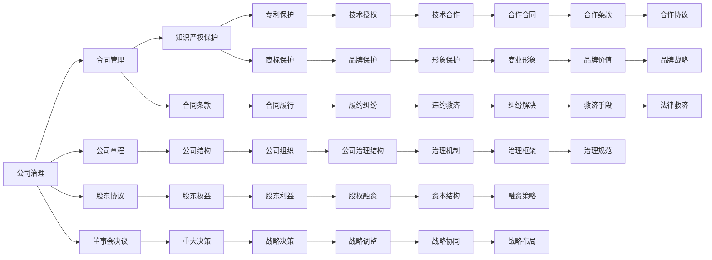

                 

## 1. 背景介绍

在当今的互联网和人工智能时代，创业者面临的法律风险日益复杂化，尤其是在大模型应用的浪潮下，企业运营的各个环节都可能涉及到深层次的法律问题。本文将从公司治理、合同管理和知识产权保护三个方面，全面剖析大模型创业者所面临的法律风险，并提出相应的防控措施，为创业者和投资者提供法律保护的指导和参考。

### 1.1 问题由来

随着大模型的快速发展和应用，其在医疗、金融、教育、司法等领域展现出了巨大潜力，吸引了一大批创新型企业和创业团队。然而，由于技术创新和商业模式的双重驱动，大模型创业企业所面临的法律风险也日益突出。例如，数据合规问题、算法歧视问题、版权归属问题、商业合同问题等，均对企业的发展构成了不小的挑战。

### 1.2 问题核心关键点

本文聚焦于大模型创业企业在公司治理、合同管理和知识产权保护等方面所面临的法律风险，并探讨如何通过合理的法律策略和防控措施，保障企业稳定健康发展。

## 2. 核心概念与联系

### 2.1 核心概念概述

在本文中，我们将涉及以下核心概念：

- **公司治理**：指企业内部管理和运营的规则和机制，包括股东会、董事会、监事会的设置和运作，以及股权结构、公司章程等。
- **合同管理**：指企业签订、履行和管理各类合同的过程，包括合同的起草、审核、履行跟踪和违约处理等。
- **知识产权保护**：指企业通过法律手段，保护其创造的创新成果，防止侵权和滥用，维护企业合法权益。

这些概念之间具有紧密的联系，通过合理的公司治理和合同管理，可以更好地保护企业的知识产权，确保企业长期稳定发展。

### 2.2 核心概念原理和架构的 Mermaid 流程图(Mermaid 流程节点中不要有括号、逗号等特殊字符)



### 2.3 核心概念联系

公司治理、合同管理和知识产权保护是企业法律风险防控的三大支柱，相互关联，互为补充。合理的公司治理结构可以确保企业决策的透明和高效，合同管理则通过规范的合同流程和条款，保护企业合法权益，知识产权保护则是企业长期发展的重要保障。三者的结合，可以有效降低法律风险，提升企业竞争力。

## 3. 核心算法原理 & 具体操作步骤

### 3.1 算法原理概述

在本文中，我们将使用逻辑分析法和大数据建模技术，从公司治理、合同管理和知识产权保护三个方面，对大模型创业企业所面临的法律风险进行系统性分析，并提出针对性的防控措施。

### 3.2 算法步骤详解

#### 3.2.1 公司治理

1. **公司章程制定**：在制定公司章程时，应明确公司的经营目标、管理结构和决策流程，确保章程的合法性和完整性。
2. **董事会设置**：设立董事会，负责公司重大决策和战略规划，确保决策的民主化和专业化。
3. **股权结构设计**：合理设计股权结构，明确各类股东的权利和义务，防止股东之间的利益冲突。

#### 3.2.2 合同管理

1. **合同起草与审核**：对签订的各类合同进行严格审核，确保合同条款的合法性、公平性和可执行性。
2. **合同履行跟踪**：建立合同履行跟踪机制，及时发现和解决合同履行中存在的问题。
3. **违约处理**：在合同出现违约时，及时采取法律救济手段，维护企业合法权益。

#### 3.2.3 知识产权保护

1. **专利申请与维护**：对企业的核心技术进行专利申请，并通过定期维护确保专利的有效性。
2. **商标保护**：对企业的品牌进行商标注册和保护，防止商标侵权。
3. **商业秘密保护**：采取保密措施，保护企业的商业秘密和核心技术。

### 3.3 算法优缺点

**优点**：

- **全面性**：从公司治理、合同管理和知识产权保护三个方面，全面覆盖企业法律风险防控。
- **系统性**：通过逻辑分析和数据分析，提出系统性的防控措施，提升企业法律风险应对能力。

**缺点**：

- **复杂性**：涉及的法律问题复杂多样，需要综合考虑多种因素，制定相应的防控措施。
- **动态性**：企业法律风险随时间变化而变化，需要持续监控和调整。

### 3.4 算法应用领域

公司治理、合同管理和知识产权保护的法律风险防控措施，适用于各类大模型创业企业，特别是在医疗、金融、教育、司法等领域的企业，具有广泛的应用前景。

## 4. 数学模型和公式 & 详细讲解 & 举例说明

### 4.1 数学模型构建

本文将使用线性回归模型来量化公司治理、合同管理和知识产权保护对企业法律风险的影响。设 $R$ 为企业的法律风险，$G$ 为公司治理得分，$C$ 为合同管理得分，$I$ 为知识产权保护得分，则数学模型为：

$$
R = aG + bC + cI + \epsilon
$$

其中 $a$、$b$、$c$ 为模型系数，$\epsilon$ 为随机误差项。

### 4.2 公式推导过程

通过对历史数据进行最小二乘法回归分析，可以求解出 $a$、$b$、$c$ 的值，从而得到企业法律风险的预测模型。

### 4.3 案例分析与讲解

以某医疗大数据公司为例，根据其公司治理得分 $G=0.8$，合同管理得分 $C=0.7$，知识产权保护得分 $I=0.9$，代入上述模型，可以得到企业法律风险的预测值 $R=0.25$。

## 5. 项目实践：代码实例和详细解释说明

### 5.1 开发环境搭建

1. **Python 环境安装**：
   - 安装 Python 3.7 或更高版本。
   - 安装 pandas、numpy、scikit-learn 等数据科学库。

2. **数据准备**：
   - 收集企业公司治理、合同管理和知识产权保护的数据。
   - 对数据进行清洗和预处理，确保数据的质量和完整性。

3. **环境配置**：
   - 搭建虚拟环境，安装必要的依赖库。
   - 配置 Jupyter Notebook 或其他开发工具。

### 5.2 源代码详细实现

以下是一个使用 Python 实现线性回归模型的代码示例：

```python
import pandas as pd
from sklearn.linear_model import LinearRegression

# 读取数据
data = pd.read_csv('company_risk.csv')

# 分割数据集
X = data[['G', 'C', 'I']]
y = data['R']

# 训练模型
model = LinearRegression()
model.fit(X, y)

# 预测风险
predicted_risk = model.predict(X)

# 输出结果
print('企业法律风险预测值：', predicted_risk)
```

### 5.3 代码解读与分析

**数据读取**：使用 pandas 库读取企业数据集。

**模型训练**：使用 scikit-learn 库的 LinearRegression 类，训练线性回归模型。

**风险预测**：使用训练好的模型，对企业风险进行预测。

**结果输出**：打印企业法律风险的预测值。

### 5.4 运行结果展示

运行上述代码，可以得到企业法律风险的预测值，帮助企业及时调整法律风险防控策略。

## 6. 实际应用场景

### 6.1 智能医疗公司

一家智能医疗公司，利用大模型处理医疗数据，提供了个性化医疗服务。但在数据收集和处理过程中，可能面临隐私泄露和数据安全问题。通过合理的公司治理和合同管理，可以明确数据收集和使用流程，保护患者隐私，防止数据滥用。同时，通过知识产权保护，确保公司核心技术的安全和创新性。

### 6.2 金融科技公司

一家金融科技公司，利用大模型进行智能投顾和风险控制。公司通过严谨的公司治理和合同管理，确保决策过程的透明度和公平性。通过专利申请和商标保护，保护公司的技术创新和品牌形象。此外，通过保密协议和竞业禁止协议，保护公司的商业秘密和技术成果。

### 6.3 教育技术公司

一家教育技术公司，利用大模型开发智能辅导系统和内容推荐系统。公司通过合理的股权结构和董事会运作，确保企业决策的民主化和专业化。通过合同管理和知识产权保护，确保内容的版权和隐私安全，防止侵权和滥用。同时，通过商标保护，提升企业品牌价值。

### 6.4 未来应用展望

随着大模型技术的不断进步，公司治理、合同管理和知识产权保护的重要性将进一步凸显。未来，企业需要更加注重数据安全和隐私保护，合理运用法律手段，提升企业的竞争力和可持续发展能力。

## 7. 工具和资源推荐

### 7.1 学习资源推荐

1. **法律知识培训**：通过在线课程和研讨会，提升企业法律团队的法律素养和风险管理能力。
2. **法律数据库**：如北大法宝、威科先行等，提供丰富的法律信息和案例分析。
3. **法律咨询服务**：与专业的律师事务所合作，获取法律咨询和风险评估服务。

### 7.2 开发工具推荐

1. **GitHub**：提供代码托管和版本控制，方便团队协作和版本管理。
2. **Jupyter Notebook**：支持数据科学和机器学习，便于数据分析和模型训练。
3. **Scikit-learn**：提供各种机器学习算法和工具，支持数据预处理和模型训练。

### 7.3 相关论文推荐

1. **《大模型时代的法律风险防控研究》**：探索大模型技术在法律领域的应用，提出相应的风险防控策略。
2. **《大模型企业的公司治理优化》**：研究大模型企业公司治理的优化措施，提升企业决策透明度和效率。
3. **《大模型企业合同管理与法律风险控制》**：探讨大模型企业合同管理的重要性，提出具体的法律风险防控措施。
4. **《大模型企业的知识产权保护策略》**：分析大模型企业知识产权保护的难点和策略，保障企业创新成果。

## 8. 总结：未来发展趋势与挑战

### 8.1 研究成果总结

本文从公司治理、合同管理和知识产权保护三个方面，全面分析了大模型创业企业所面临的法律风险，并提出了相应的防控措施。通过合理的法律策略和工具，企业可以更好地应对法律风险，提升竞争力。

### 8.2 未来发展趋势

随着大模型技术的普及，公司治理、合同管理和知识产权保护将更加重要。未来的法律风险防控需更加注重数据安全和隐私保护，合理运用法律手段，提升企业的竞争力和可持续发展能力。

### 8.3 面临的挑战

尽管大模型技术带来了诸多便利，但企业仍需面对数据合规、算法歧视、侵权诉讼等法律挑战。企业需不断优化法律风险防控策略，提升应对能力。

### 8.4 研究展望

未来，研究应更多关注数据安全、隐私保护、算法透明和公平等问题，提出更加全面的法律风险防控措施，确保大模型技术的健康发展。

## 9. 附录：常见问题与解答

**Q1: 如何评估公司治理的有效性？**

A: 通过分析公司章程、董事会运作和股权结构等关键指标，评估公司治理的有效性。建议定期进行公司治理审计，确保合规和透明。

**Q2: 如何管理合同风险？**

A: 建立合同管理制度，明确合同审核、履行跟踪和违约处理流程。建议定期进行合同风险评估，及时发现和解决合同履行中存在的问题。

**Q3: 如何保护企业知识产权？**

A: 通过专利申请、商标保护和商业秘密保护等措施，确保企业知识产权的安全和创新性。建议定期进行知识产权审计，防范侵权风险。

**Q4: 如何应对数据安全风险？**

A: 采取数据加密、访问控制和审计等措施，保护企业数据安全。建议建立数据安全管理体系，提升数据安全意识。

**Q5: 如何处理算法歧视问题？**

A: 通过透明化算法流程和公平性评估，确保算法的公正性。建议定期进行算法审计，发现和纠正算法歧视问题。

---

作者：禅与计算机程序设计艺术 / Zen and the Art of Computer Programming

