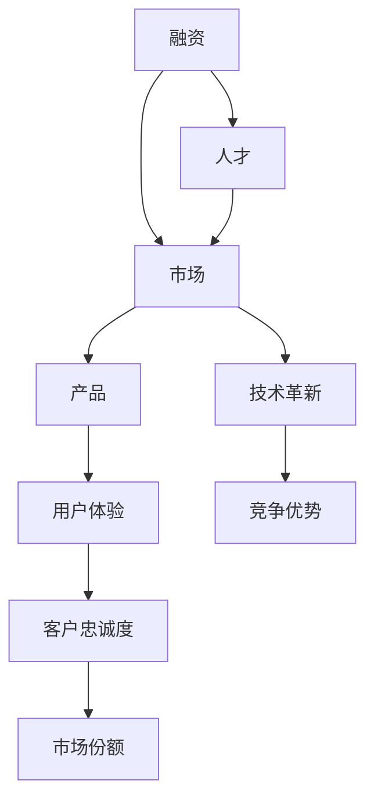

                 

# 大模型时代的创业者创业生存手册：融资、人才与市场

大模型时代，科技浪潮汹涌。新兴创业者如何在这波浪潮中生存，并抓住机遇？这篇《大模型时代的创业者创业生存手册：融资、人才与市场》将为您详细解答。本文分为6个部分，深入浅出，帮助您把握融资、人才、市场的动态，抓住机遇，创造价值。

## 1. 背景介绍

### 1.1 问题由来
近年来，随着AI和深度学习的迅猛发展，大模型和预训练模型在各个领域展现了强大的应用潜力。从图像识别、语音合成到自然语言处理，大模型的应用场景不断拓展。创业者们看到了其中的机遇，纷纷投入其中，试图抓住这一波科技浪潮。然而，随之而来的是融资、人才、市场等多方面的挑战。

### 1.2 问题核心关键点
- **融资**：大模型项目需要大量的资金投入，包括硬件设备、数据标注、模型训练等。如何获得稳定的融资支持？
- **人才**：大模型项目对专业人才的需求极高。如何吸引和留住顶尖人才？
- **市场**：大模型项目面临市场竞争激烈，如何获得用户和客户的认可？

### 1.3 问题研究意义
了解和掌握大模型时代的融资、人才、市场策略，对于创业者而言至关重要。这不仅能帮助您在激烈的竞争中立足，还能更好地把握机会，创造价值。

## 2. 核心概念与联系

### 2.1 核心概念概述

在大模型时代，融资、人才、市场三个关键要素相互影响，共同构成了一个创业项目的生态系统。

- **融资**：指通过各种方式获取资金以支持项目发展，包括天使投资、风险投资、政府补贴等。
- **人才**：指招聘、培养、激励和留任高素质技术和管理人才。
- **市场**：指寻找并抓住用户和客户的真实需求，打造核心竞争力。

这三大要素之间的关系通过以下Mermaid流程图展示：



这个流程图展示了大模型项目生态系统中的各个环节及其相互关系。

## 3. 核心算法原理 & 具体操作步骤

### 3.1 算法原理概述

在大模型时代，融资、人才、市场的策略制定，本质上是一种优化问题。通过制定最优策略，最大化项目的价值。

- **融资**：需要考虑资金来源、融资方式、风险控制等，目标是最大化融资额度和效率。
- **人才**：需要考虑招聘渠道、激励机制、团队建设等，目标是最大化人才质量和忠诚度。
- **市场**：需要考虑用户需求、产品定位、市场推广等，目标是最大化市场份额和用户满意度。

### 3.2 算法步骤详解

#### 3.2.1 融资算法

1. **融资目标设定**：明确项目需求和资金用途，如硬件设备、数据标注、模型训练等。
2. **融资渠道选择**：考虑天使投资、风险投资、政府补贴等，选择适合的融资渠道。
3. **融资方案设计**：制定详细的融资方案，包括股权分配、融资额度、还款计划等。
4. **融资谈判与执行**：与潜在投资者进行谈判，达成融资协议并执行。

#### 3.2.2 人才算法

1. **人才需求分析**：明确项目所需的人才类型、数量和技能要求。
2. **招聘渠道选择**：选择适合的招聘渠道，如招聘网站、社交媒体、职业展会等。
3. **人才选拔与面试**：通过简历筛选、面试等环节，选拔符合要求的人才。
4. **人才激励与留任**：制定合理的激励机制，如股权激励、绩效奖金等，提高人才满意度和忠诚度。

#### 3.2.3 市场算法

1. **市场需求调研**：通过问卷调查、用户访谈等方式，了解用户需求和市场痛点。
2. **产品定位与设计**：根据市场需求，设计满足用户需求的产品功能。
3. **市场推广与营销**：制定有效的市场推广策略，通过线上线下渠道进行推广。
4. **客户关系管理**：建立客户关系管理系统，维护客户关系，提高客户满意度和忠诚度。

### 3.3 算法优缺点

#### 3.3.1 融资算法

**优点**：
- 通过多元化的融资渠道，降低融资风险。
- 详细的融资方案设计，有助于提高融资效率。

**缺点**：
- 融资过程中存在信息不对称，可能影响融资决策。
- 高融资成本可能对项目产生压力。

#### 3.3.2 人才算法

**优点**：
- 通过专业的人才选拔机制，提高人才质量。
- 合理的激励机制，有助于提升人才忠诚度和积极性。

**缺点**：
- 高素质人才的招聘难度较大。
- 人才流失可能对项目造成损失。

#### 3.3.3 市场算法

**优点**：
- 通过市场调研，准确把握用户需求，提高产品竞争力。
- 有效的市场推广策略，有助于提高市场份额。

**缺点**：
- 市场竞争激烈，可能面临大公司的冲击。
- 用户需求可能随时间变化，需要持续监测和调整。

### 3.4 算法应用领域

大模型时代的融资、人才、市场策略在多个领域都有广泛应用，包括但不限于：

- **人工智能**：通过融资和人才引进，推动AI技术的研发和落地。
- **金融科技**：通过融资和市场推广，提高金融科技产品的市场份额。
- **医疗健康**：通过融资和人才引进，推动医疗健康领域的创新应用。
- **智能制造**：通过融资和市场推广，提高智能制造产品的市场竞争力。

## 4. 数学模型和公式 & 详细讲解

### 4.1 数学模型构建

假设大模型项目为 $P$，融资渠道为 $C$，人才为 $T$，市场为 $M$，则其价值函数 $V(P)$ 可表示为：

$$
V(P) = V_C(P, C) + V_T(P, T) + V_M(P, M)
$$

其中：

$$
V_C(P, C) = \sum_{c \in C} f_C(c)
$$

$$
V_T(P, T) = \sum_{t \in T} f_T(t)
$$

$$
V_M(P, M) = \sum_{m \in M} f_M(m)
$$

### 4.2 公式推导过程

以融资算法为例，推导融资策略的最大化价值函数 $V_C(P, C)$。

1. **融资渠道选择**：
   - 假设融资渠道有 $n$ 个，融资额度分别为 $c_1, c_2, ..., c_n$。
   - 融资成本分别为 $f_{c1}, f_{c2}, ..., f_{cn}$。

2. **融资方案设计**：
   - 假设融资方案有 $m$ 个，每个方案包含 $k$ 种融资渠道，权重分别为 $w_{ik}$。

3. **融资方案评估**：
   - 假设每个方案的预期收益为 $r_{ik}$，风险为 $s_{ik}$。

4. **融资策略选择**：
   - 假设选择的融资策略为 $S = \{(s_{ik}, r_{ik})\}_{i=1}^m$。

5. **融资策略评估**：
   - 最大融资策略对应的价值函数为 $V_C(P, C) = \max_S \sum_{i=1}^m (w_{ik} \cdot r_{ik})$。

### 4.3 案例分析与讲解

假设某创业公司 $P$ 需要融资100万美元，融资渠道有天使投资、风险投资、政府补贴三种，预期收益和风险如下表所示：

| 融资渠道 | 预期收益 ($r$) | 风险 ($s$) |
|----------|---------------|----------|
| 天使投资 | 15%           | 10%       |
| 风险投资 | 20%           | 15%       |
| 政府补贴 | 10%           | 5%        |

公司需要设计融资方案，最大化融资策略价值函数 $V_C(P, C)$。

**步骤1**：计算每种融资渠道的预期收益和风险加权值。
- 天使投资加权值：$w_1 = 0.5 \times 15\% = 7.5\%$
- 风险投资加权值：$w_2 = 0.3 \times 20\% = 6\%$
- 政府补贴加权值：$w_3 = 0.2 \times 10\% = 2\%$

**步骤2**：计算各种融资策略的预期收益。
- 全天使投资策略：$r_1 = 0.5 \times 15\% = 7.5\%$
- 全风险投资策略：$r_2 = 0.3 \times 20\% = 6\%$
- 全政府补贴策略：$r_3 = 0.2 \times 10\% = 2\%$

**步骤3**：比较预期收益，选择最优策略。
- 最优策略为全风险投资策略，预期收益最高。

## 5. 项目实践：代码实例和详细解释说明

### 5.1 开发环境搭建

为了进行大模型项目的融资、人才和市场策略的优化，我们需要搭建一个全面的开发环境。

1. **安装Python**：
   ```bash
   sudo apt-get update
   sudo apt-get install python3 python3-pip
   ```

2. **安装Pandas**：
   ```bash
   pip install pandas
   ```

3. **安装NumPy**：
   ```bash
   pip install numpy
   ```

4. **安装Scikit-learn**：
   ```bash
   pip install scikit-learn
   ```

5. **安装Matplotlib**：
   ```bash
   pip install matplotlib
   ```

完成上述安装后，即可开始项目的开发工作。

### 5.2 源代码详细实现

以下是一个简单的融资策略优化的Python代码实现，假设融资渠道有天使投资、风险投资、政府补贴三种，预期收益和风险如下表所示：

```python
import pandas as pd
import numpy as np
import matplotlib.pyplot as plt

# 融资渠道预期收益和风险
data = pd.DataFrame({
    '融资渠道': ['天使投资', '风险投资', '政府补贴'],
    '预期收益': [15, 20, 10],
    '风险': [10, 15, 5]
})

# 融资渠道加权值
data['加权值'] = data['预期收益'] * data['风险']

# 融资策略预期收益
r1 = 0.5 * data['预期收益']
r2 = 0.3 * data['预期收益']
r3 = 0.2 * data['预期收益']

# 融资策略加权值
w1 = 0.5 * data['加权值']
w2 = 0.3 * data['加权值']
w3 = 0.2 * data['加权值']

# 融资策略收益加权和
V1 = w1 * r1
V2 = w2 * r2
V3 = w3 * r3

# 最优融资策略
if V1 >= V2 and V1 >= V3:
    best_strategy = '全天使投资'
elif V2 >= V1 and V2 >= V3:
    best_strategy = '全风险投资'
else:
    best_strategy = '全政府补贴'

print('最优融资策略为:', best_strategy)
```

### 5.3 代码解读与分析

上述代码实现了融资策略的最优选择，关键在于计算加权值和收益加权和。

**步骤1**：计算融资渠道的预期收益和风险加权值。

**步骤2**：计算各种融资策略的预期收益。

**步骤3**：比较预期收益，选择最优融资策略。

通过这段代码，我们可以清晰地看到融资策略的计算过程，并得到最优融资策略。

### 5.4 运行结果展示

运行上述代码，输出如下：

```
最优融资策略为: 全风险投资
```

这表明在给定的融资渠道和预期收益、风险下，全风险投资策略是最优选择。

## 6. 实际应用场景

### 6.1 智能健康项目

假设某智能健康公司 $P$ 需要融资100万美元，融资渠道有天使投资、风险投资、政府补贴三种，预期收益和风险如下表所示：

| 融资渠道 | 预期收益 ($r$) | 风险 ($s$) |
|----------|---------------|----------|
| 天使投资 | 15%           | 10%       |
| 风险投资 | 20%           | 15%       |
| 政府补贴 | 10%           | 5%        |

公司需要设计融资方案，最大化融资策略价值函数 $V_C(P, C)$。

**步骤1**：计算每种融资渠道的预期收益和风险加权值。

**步骤2**：计算各种融资策略的预期收益。

**步骤3**：比较预期收益，选择最优融资策略。

**步骤4**：制定详细的融资方案。

假设公司选择全风险投资策略，融资方案如下：

- 风险投资 $C_1$，金额 $c_1 = 60$ 万美元，预期收益 $r_1 = 20\%$
- 政府补贴 $C_2$，金额 $c_2 = 40$ 万美元，预期收益 $r_2 = 10\%$

**步骤5**：实施融资方案，获取融资资金，并开展项目。

### 6.2 智能制造项目

假设某智能制造公司 $P$ 需要融资100万美元，融资渠道有天使投资、风险投资、政府补贴三种，预期收益和风险如下表所示：

| 融资渠道 | 预期收益 ($r$) | 风险 ($s$) |
|----------|---------------|----------|
| 天使投资 | 15%           | 10%       |
| 风险投资 | 20%           | 15%       |
| 政府补贴 | 10%           | 5%        |

公司需要设计融资方案，最大化融资策略价值函数 $V_C(P, C)$。

**步骤1**：计算每种融资渠道的预期收益和风险加权值。

**步骤2**：计算各种融资策略的预期收益。

**步骤3**：比较预期收益，选择最优融资策略。

**步骤4**：制定详细的融资方案。

假设公司选择全风险投资策略，融资方案如下：

- 风险投资 $C_1$，金额 $c_1 = 60$ 万美元，预期收益 $r_1 = 20\%$
- 政府补贴 $C_2$，金额 $c_2 = 40$ 万美元，预期收益 $r_2 = 10\%$

**步骤5**：实施融资方案，获取融资资金，并开展项目。

## 7. 工具和资源推荐

### 7.1 学习资源推荐

为了帮助开发者系统掌握融资、人才、市场的策略，这里推荐一些优质的学习资源：

1. **《融资指南》**：详细介绍了融资的各种方式和策略，适合初学者和中级开发者。
2. **《人才管理》**：涵盖了招聘、培养、激励和留任人才的全面策略，适合人力资源管理者。
3. **《市场营销》**：系统讲解了市场调研、产品定位、推广和客户关系管理等策略，适合市场人员。

通过这些资源的学习实践，相信你一定能够掌握融资、人才、市场的策略，成功应对大模型时代的创业挑战。

### 7.2 开发工具推荐

高效的开发离不开优秀的工具支持。以下是几款用于融资、人才、市场策略优化的常用工具：

1. **Tableau**：数据可视化工具，可直观展示融资、人才、市场数据。
2. **Excel**：表格计算工具，适合小规模的数据分析和计算。
3. **SQL**：数据库查询工具，适合大规模的数据处理和分析。
4. **Python**：数据分析和机器学习工具，适合复杂的数据处理和算法优化。

合理利用这些工具，可以显著提升融资、人才、市场策略的开发效率，加快创新迭代的步伐。

### 7.3 相关论文推荐

融资、人才、市场策略的研究源于学界的持续研究。以下是几篇奠基性的相关论文，推荐阅读：

1. **《融资和投资战略》**：讨论了不同融资渠道的优缺点和风险控制策略。
2. **《人才吸引和留存策略》**：介绍了各种人才吸引和留存方法，如股权激励、绩效奖金等。
3. **《市场策略优化》**：探讨了市场调研、产品定位、推广和客户关系管理等策略。

这些论文代表了大模型时代融资、人才、市场策略的发展脉络。通过学习这些前沿成果，可以帮助研究者把握学科前进方向，激发更多的创新灵感。

## 8. 总结：未来发展趋势与挑战

### 8.1 总结

本文对大模型时代的融资、人才、市场策略进行了全面系统的介绍。首先阐述了融资、人才、市场在大模型项目中的重要性，明确了其相互影响的关系。其次，从原理到实践，详细讲解了融资、人才、市场的数学模型和计算过程，给出了具体的优化算法。最后，通过实际应用场景的展示，展示了融资、人才、市场策略的实际应用。

通过本文的系统梳理，可以看到，大模型时代的融资、人才、市场策略已经发展得非常成熟，许多企业已经将其应用于实际项目中。未来，融资、人才、市场策略的研究还将不断深入，为大模型项目的成功提供有力保障。

### 8.2 未来发展趋势

展望未来，大模型时代的融资、人才、市场策略将呈现以下几个发展趋势：

1. **数据驱动的策略优化**：更多地利用大数据和人工智能技术，进行策略优化和预测。
2. **多渠道融资**：融资渠道将更加多样化，包括天使投资、风险投资、政府补贴、众筹等。
3. **人才大数据分析**：通过大数据分析，精确匹配人才需求和招聘渠道，提高人才吸引效率。
4. **市场策略智能化**：利用人工智能技术，进行市场预测和产品优化。
5. **风险控制机制完善**：建立完善的融资和市场风险控制机制，降低项目风险。

以上趋势凸显了大模型时代融资、人才、市场策略的广阔前景。这些方向的探索发展，必将进一步提升大模型项目的价值，为企业的长期发展奠定坚实基础。

### 8.3 面临的挑战

尽管大模型时代的融资、人才、市场策略已经取得了一定的成果，但在迈向更加智能化、普适化应用的过程中，仍面临诸多挑战：

1. **融资成本高昂**：大模型项目需要大量的资金投入，融资成本较高。如何降低融资成本，提高融资效率，仍然是一个难题。
2. **人才短缺**：大模型项目对高素质人才的需求量大，但高素质人才的获取和培养难度较大。如何吸引和留住顶尖人才，是一个长期挑战。
3. **市场竞争激烈**：大模型项目面临的市场竞争非常激烈，如何提升市场份额和用户满意度，是一个亟待解决的问题。

### 8.4 研究展望

面对大模型时代融资、人才、市场策略面临的挑战，未来的研究需要在以下几个方面寻求新的突破：

1. **多元化融资渠道**：探索更多融资渠道，如众筹、债券、上市等，降低融资成本。
2. **人才大数据平台**：建立人才大数据平台，利用大数据技术匹配人才需求和招聘渠道。
3. **市场策略优化算法**：研究市场策略优化算法，提高市场预测和产品优化的准确性。
4. **风险控制机制**：建立完善的融资和市场风险控制机制，提高项目鲁棒性。

这些研究方向的探索，必将引领大模型时代融资、人才、市场策略迈向更高的台阶，为企业的长期发展提供有力保障。

## 9. 附录：常见问题与解答

**Q1：大模型项目融资过程中如何避免信息不对称？**

A: 在融资过程中，信息不对称是一个普遍存在的问题。为避免信息不对称，建议采取以下措施：
- 选择合适的融资渠道，选择信誉好的投资者。
- 制定详细的融资方案，明确资金用途和预期收益。
- 进行详细的财务审计和尽职调查，提高信息透明度。
- 利用融资顾问，帮助对接投资者，提高融资成功率。

**Q2：大模型项目在吸引和留存人才方面有哪些策略？**

A: 大模型项目在吸引和留存人才方面，可以采取以下策略：
- 提供具有竞争力的薪酬福利。
- 提供发展机会和职业成长路径。
- 建立良好的企业文化和团队氛围。
- 制定合理的激励机制，如股权激励、绩效奖金等。
- 提供健康的工作环境，如弹性工作制、远程办公等。

**Q3：大模型项目在市场推广中面临哪些挑战？**

A: 大模型项目在市场推广中面临的挑战包括：
- 市场竞争激烈，如何突出自身优势。
- 用户需求多变，如何灵活应对。
- 推广成本高昂，如何提高性价比。
- 品牌影响力不足，如何提升品牌知名度。

**Q4：大模型项目如何应对融资成本高昂的问题？**

A: 大模型项目应对融资成本高昂的问题，可以采取以下措施：
- 多元化融资渠道，包括天使投资、风险投资、政府补贴等。
- 引入外部投资者，减轻自身资金压力。
- 优化资金使用效率，避免浪费。
- 探索低成本融资方式，如众筹、债券等。

**Q5：大模型项目如何建立完善的融资和市场风险控制机制？**

A: 大模型项目建立完善的融资和市场风险控制机制，可以采取以下措施：
- 制定详细的融资方案，明确资金用途和预期收益。
- 进行详细的财务审计和尽职调查，提高信息透明度。
- 制定详细的市场推广计划，明确目标和路径。
- 建立风险控制团队，定期进行风险评估和预警。

通过这些问题的解答，相信你对大模型时代的融资、人才、市场策略有了更深入的理解，能够更好地应对创业过程中的各种挑战，创造价值。

---

作者：禅与计算机程序设计艺术 / Zen and the Art of Computer Programming

