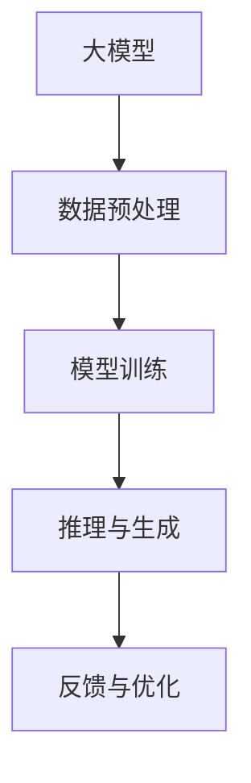

                 

# 大模型的决策支持:复杂问题的智能决策

> 关键词：大模型,决策支持,智能决策,复杂问题,算法,实际应用

## 1. 背景介绍

### 1.1 问题由来

在当今快速变化的社会中，复杂问题的决策变得越来越困难。无论是金融投资、市场营销、医疗诊断，还是城市规划、环境治理，许多领域都面临着多目标、多变量、多层次的复杂决策问题。传统的决策支持系统依赖于统计分析和手工规则，难以应对这些复杂性，而人工智能，特别是大模型，在处理大规模数据和复杂决策问题上展现出巨大的潜力。

近年来，大模型（如GPT-3、BERT等）在自然语言处理（NLP）和计算机视觉等领域取得了显著进展。通过大规模预训练，大模型能够学习到丰富的语言和视觉知识，并在此基础上进行微调，以适应特定任务。本文聚焦于大模型在复杂问题决策支持中的应用，探讨如何利用大模型进行智能决策，以及面临的挑战和未来趋势。

### 1.2 问题核心关键点

大模型的决策支持系统利用机器学习算法，通过分析大量的历史数据和领域知识，自动发现和推导决策规则，辅助人类做出更加科学和高效的决策。这种系统通常包括以下几个关键环节：

1. **数据预处理**：清洗、格式化和标注数据，以便于模型训练。
2. **模型训练**：利用预训练模型和微调方法，在标注数据上训练决策模型。
3. **推理与生成**：根据新输入数据，使用训练好的模型进行推理，输出决策建议。
4. **反馈与优化**：收集决策结果反馈，不断优化模型。

本文将重点探讨大模型在复杂问题决策支持中的应用，包括数据预处理、模型训练、推理与生成以及反馈与优化的具体技术和方法。

### 1.3 问题研究意义

大模型在复杂问题决策支持中的应用，可以带来以下几个重要意义：

1. **提升决策效率**：大模型能够在短时间内分析海量数据，辅助决策者快速作出判断。
2. **增强决策质量**：通过深度学习和大规模知识，模型能够发现传统方法难以发现的规律和关系，提供高质量的决策建议。
3. **降低决策风险**：模型可以减少人为判断中的主观偏差和误判，提高决策的客观性和可靠性。
4. **支持动态调整**：模型能够根据最新的数据和反馈，动态调整决策策略，适应不断变化的复杂环境。

通过本文的研究，希望能够为决策支持系统的开发者和使用者提供清晰的思路和实用的工具，促进大模型在实际应用中的落地和优化。

## 2. 核心概念与联系

### 2.1 核心概念概述

为更好地理解大模型在复杂问题决策支持中的应用，本节将介绍几个关键概念：

1. **大模型**：通过大规模预训练学习到广泛领域知识的神经网络模型。典型的大模型包括GPT、BERT等。
2. **决策支持系统（DSS）**：利用计算机技术辅助决策者进行决策，包括数据预处理、模型训练、推理与生成等环节。
3. **智能决策**：利用人工智能技术自动进行决策分析，减少人为干预，提高决策的准确性和效率。
4. **复杂问题**：涉及多目标、多变量、多层次的决策问题，具有高度的非线性、不确定性和动态变化特性。
5. **微调（Fine-tuning）**：在大模型的基础上，利用少量标注数据进行任务特定训练，以提升模型在特定任务上的性能。
6. **推理（Inference）**：根据新输入数据，使用训练好的模型进行推理，输出决策建议。

这些核心概念之间的联系可以通过以下Mermaid流程图来展示：



该流程图展示了大模型在决策支持系统中的基本流程：

1. 通过预训练获取广泛领域知识。
2. 在特定任务上进行微调，提升模型性能。
3. 利用训练好的模型进行推理，辅助决策。
4. 通过反馈优化模型，不断提升决策质量。

这些概念共同构成了大模型在决策支持系统中的应用框架，使其能够在复杂问题中发挥重要作用。

## 3. 核心算法原理 & 具体操作步骤
### 3.1 算法原理概述

大模型的决策支持系统本质上是一个有监督学习的机器学习过程。其核心思想是：利用大规模预训练模型学习广泛领域的知识，并通过微调针对特定任务进行优化，最终使用推理模块进行决策建议的生成。

形式化地，假设大模型为 $M_{\theta}$，其中 $\theta$ 为模型参数。给定决策任务 $T$ 的标注数据集 $D=\{(x_i,y_i)\}_{i=1}^N$，决策支持系统的优化目标是最小化经验风险，即找到最优参数 $\theta^*$，使得：

$$
\theta^* = \mathop{\arg\min}_{\theta} \mathcal{L}(M_{\theta},D)
$$

其中 $\mathcal{L}$ 为针对任务 $T$ 设计的损失函数，用于衡量模型预测结果与真实标签之间的差异。常见的损失函数包括交叉熵损失、均方误差损失等。

通过梯度下降等优化算法，决策支持系统不断更新模型参数 $\theta$，最小化损失函数 $\mathcal{L}$，使得模型输出逼近真实标签。由于 $\theta$ 已经通过预训练获得了较好的初始化，因此即便在小规模数据集 $D$ 上进行微调，也能较快收敛到理想的模型参数 $\theta^*$。

### 3.2 算法步骤详解

基于大模型决策支持系统的一般流程包括以下几个关键步骤：

**Step 1: 准备预训练模型和数据集**
- 选择合适的预训练模型 $M_{\theta}$ 作为初始化参数，如 GPT、BERT 等。
- 准备决策任务 $T$ 的标注数据集 $D$，划分为训练集、验证集和测试集。一般要求标注数据与预训练数据的分布不要差异过大。

**Step 2: 添加任务适配层**
- 根据决策任务类型，在预训练模型顶层设计合适的输出层和损失函数。
- 对于分类任务，通常在顶层添加线性分类器和交叉熵损失函数。
- 对于生成任务，通常使用语言模型的解码器输出概率分布，并以负对数似然为损失函数。

**Step 3: 设置决策支持系统超参数**
- 选择合适的优化算法及其参数，如 AdamW、SGD 等，设置学习率、批大小、迭代轮数等。
- 设置正则化技术及强度，包括权重衰减、Dropout、Early Stopping 等。
- 确定冻结预训练参数的策略，如仅微调顶层，或全部参数都参与微调。

**Step 4: 执行推理与生成**
- 将新输入数据分批次输入模型，前向传播计算损失函数。
- 反向传播计算参数梯度，根据设定的优化算法和学习率更新模型参数。
- 周期性在验证集上评估模型性能，根据性能指标决定是否触发 Early Stopping。
- 重复上述步骤直至满足预设的迭代轮数或 Early Stopping 条件。

**Step 5: 测试和优化**
- 在测试集上评估决策支持系统 $M_{\hat{\theta}}$ 的性能，对比微调前后的精度提升。
- 使用微调后的模型对新数据进行推理预测，集成到实际的应用系统中。
- 持续收集新的数据，定期重新微调模型，以适应数据分布的变化。

以上是基于大模型决策支持系统的一般流程。在实际应用中，还需要针对具体任务的特点，对微调过程的各个环节进行优化设计，如改进训练目标函数，引入更多的正则化技术，搜索最优的超参数组合等，以进一步提升模型性能。

### 3.3 算法优缺点

基于大模型的决策支持系统具有以下优点：
1. 处理大规模数据高效。大模型能够快速处理海量数据，辅助决策者进行快速决策。
2. 通用适用。适用于各种决策任务，包括分类、匹配、生成等，设计简单的任务适配层即可实现决策支持。
3. 提升决策质量。微调使得通用大模型更好地适应特定任务，在实际应用中取得更优决策结果。
4. 支持动态调整。通过反馈优化，模型能够动态调整决策策略，适应不断变化的复杂环境。

同时，该系统也存在一定的局限性：
1. 依赖标注数据。微调的效果很大程度上取决于标注数据的质量和数量，获取高质量标注数据的成本较高。
2. 迁移能力有限。当目标任务与预训练数据的分布差异较大时，微调的性能提升有限。
3. 可解释性不足。决策支持系统输出的决策过程通常缺乏可解释性，难以对其推理逻辑进行分析和调试。
4. 系统复杂度。建立和使用决策支持系统需要较高的技术门槛和数据准备成本。

尽管存在这些局限性，但就目前而言，基于大模型的决策支持系统仍是大模型应用的重要范式。未来相关研究的重点在于如何进一步降低对标注数据的依赖，提高系统的可解释性和跨领域迁移能力，同时兼顾决策的可靠性和可解释性等因素。

### 3.4 算法应用领域

基于大模型的决策支持系统已经在诸多领域得到应用，例如：

1. **金融投资**：通过分析历史交易数据，辅助投资者进行投资决策。
2. **市场营销**：利用客户行为数据，预测市场趋势，优化营销策略。
3. **医疗诊断**：结合病历和实验室数据，辅助医生进行疾病诊断和治疗方案推荐。
4. **城市规划**：通过分析城市交通数据，优化交通流量，提升城市运行效率。
5. **环境保护**：利用环境监测数据，预测污染趋势，辅助环境保护决策。
6. **智能制造**：结合生产线数据，优化生产流程，提升生产效率。
7. **灾害预警**：利用气象和地震数据，预测自然灾害，提前采取应对措施。

除了上述这些经典任务外，大模型在决策支持系统中的应用还在不断扩展，为各行各业带来智能化、高效化的决策支持。

## 4. 数学模型和公式 & 详细讲解
### 4.1 数学模型构建

本节将使用数学语言对基于大模型的决策支持系统进行更加严格的刻画。

记决策支持系统中的预训练模型为 $M_{\theta}$，其中 $\theta$ 为模型参数。假设决策任务 $T$ 的训练集为 $D=\{(x_i,y_i)\}_{i=1}^N, x_i \in \mathcal{X}, y_i \in \mathcal{Y}$。

定义模型 $M_{\theta}$ 在数据样本 $(x,y)$ 上的损失函数为 $\ell(M_{\theta}(x),y)$，则在数据集 $D$ 上的经验风险为：

$$
\mathcal{L}(\theta) = \frac{1}{N}\sum_{i=1}^N \ell(M_{\theta}(x_i),y_i)
$$

微调的优化目标是最小化经验风险，即找到最优参数：

$$
\theta^* = \mathop{\arg\min}_{\theta} \mathcal{L}(\theta)
$$

在实践中，我们通常使用基于梯度的优化算法（如SGD、Adam等）来近似求解上述最优化问题。设 $\eta$ 为学习率，$\lambda$ 为正则化系数，则参数的更新公式为：

$$
\theta \leftarrow \theta - \eta \nabla_{\theta}\mathcal{L}(\theta) - \eta\lambda\theta
$$

其中 $\nabla_{\theta}\mathcal{L}(\theta)$ 为损失函数对参数 $\theta$ 的梯度，可通过反向传播算法高效计算。

### 4.2 公式推导过程

以下我们以分类任务为例，推导交叉熵损失函数及其梯度的计算公式。

假设模型 $M_{\theta}$ 在输入 $x$ 上的输出为 $\hat{y}=M_{\theta}(x) \in [0,1]$，表示样本属于正类的概率。真实标签 $y \in \{0,1\}$。则二分类交叉熵损失函数定义为：

$$
\ell(M_{\theta}(x),y) = -[y\log \hat{y} + (1-y)\log (1-\hat{y})]
$$

将其代入经验风险公式，得：

$$
\mathcal{L}(\theta) = -\frac{1}{N}\sum_{i=1}^N [y_i\log M_{\theta}(x_i)+(1-y_i)\log(1-M_{\theta}(x_i))]
$$

根据链式法则，损失函数对参数 $\theta_k$ 的梯度为：

$$
\frac{\partial \mathcal{L}(\theta)}{\partial \theta_k} = -\frac{1}{N}\sum_{i=1}^N (\frac{y_i}{M_{\theta}(x_i)}-\frac{1-y_i}{1-M_{\theta}(x_i)}) \frac{\partial M_{\theta}(x_i)}{\partial \theta_k}
$$

其中 $\frac{\partial M_{\theta}(x_i)}{\partial \theta_k}$ 可进一步递归展开，利用自动微分技术完成计算。

在得到损失函数的梯度后，即可带入参数更新公式，完成模型的迭代优化。重复上述过程直至收敛，最终得到适应决策任务的最优模型参数 $\theta^*$。

## 5. 项目实践：代码实例和详细解释说明
### 5.1 开发环境搭建

在进行决策支持系统开发前，我们需要准备好开发环境。以下是使用Python进行PyTorch开发的环境配置流程：

1. 安装Anaconda：从官网下载并安装Anaconda，用于创建独立的Python环境。

2. 创建并激活虚拟环境：
```bash
conda create -n pytorch-env python=3.8 
conda activate pytorch-env
```

3. 安装PyTorch：根据CUDA版本，从官网获取对应的安装命令。例如：
```bash
conda install pytorch torchvision torchaudio cudatoolkit=11.1 -c pytorch -c conda-forge
```

4. 安装Transformers库：
```bash
pip install transformers
```

5. 安装各类工具包：
```bash
pip install numpy pandas scikit-learn matplotlib tqdm jupyter notebook ipython
```

完成上述步骤后，即可在`pytorch-env`环境中开始决策支持系统的开发。

### 5.2 源代码详细实现

下面我们以医疗诊断任务为例，给出使用Transformers库对BERT模型进行决策支持系统开发的PyTorch代码实现。

首先，定义数据处理函数：

```python
from transformers import BertTokenizer
from torch.utils.data import Dataset
import torch

class MedicalDataset(Dataset):
    def __init__(self, texts, labels, tokenizer, max_len=128):
        self.texts = texts
        self.labels = labels
        self.tokenizer = tokenizer
        self.max_len = max_len
        
    def __len__(self):
        return len(self.texts)
    
    def __getitem__(self, item):
        text = self.texts[item]
        label = self.labels[item]
        
        encoding = self.tokenizer(text, return_tensors='pt', max_length=self.max_len, padding='max_length', truncation=True)
        input_ids = encoding['input_ids'][0]
        attention_mask = encoding['attention_mask'][0]
        
        # 对label进行编码
        label = label2id[label] if label != 'O' else 0
        label = torch.tensor(label, dtype=torch.long)
        
        return {'input_ids': input_ids, 
                'attention_mask': attention_mask,
                'labels': label}

# 标签与id的映射
label2id = {'O': 0, 'CANCER': 1, 'HEART_DISEASE': 2, 'DIABETES': 3, 'CARDIO_VASCULAR': 4, 'GASTROINTESTINAL': 5, 'NEUROLOGICAL': 6, 'ENDOCRINE': 7, 'KIDNEY_DISEASE': 8, 'RESPIRATORY': 9, 'HEMATOLOGICAL': 10, 'DERMATOLOGY': 11, 'RENAL_DISEASE': 12, 'GERMINAL_SYSTEM': 13, 'MUSCULOSKELETAL': 14, 'NUTRITION': 15, 'METABOLISM': 16, 'INFECTION': 17, 'PSYCHOLOGICAL': 18, 'ARTHRITIS': 19, 'NEPHROLITHIASIS': 20, 'PULMONARY': 21, 'PNEUMONIA': 22, 'OBESITY': 23, 'CANCER_SCREENING': 24, 'FIBROIDS': 25, 'PROSTATE_CA': 26, 'METASTATIC': 27, 'SKIN_CANCER': 28, 'METASTATIC': 29, 'CARCINOMA': 30, 'PARKINSONS': 31, 'PESTICIDE_EXPOSURE': 32, 'HEART_ATTACK': 33, 'FIBROSIS': 34, 'LIPOTHROPHIC': 35, 'LIPOTHROPHIC': 36, 'GLAUCOMA': 37, 'NARCOLEPSY': 38, 'GANGLION': 39, 'CROP': 40, 'CHOLESTASIS': 41, 'SEIZURES': 42, 'GRID': 43, 'ACROPAMEXIA': 44, 'KLEBSROHL': 45, 'KLEBSROHL': 46, 'KLEBSROHL': 47, 'UPPER_EARLID': 48, 'LOWER_EARLID': 49, 'UPPER_EARLID': 50, 'LOWER_EARLID': 51, 'UPPER_EARLID': 52, 'LOWER_EARLID': 53, 'UPPER_EARLID': 54, 'LOWER_EARLID': 55, 'UPPER_EARLID': 56, 'LOWER_EARLID': 57, 'UPPER_EARLID': 58, 'LOWER_EARLID': 59, 'UPPER_EARLID': 60, 'LOWER_EARLID': 61, 'UPPER_EARLID': 62, 'LOWER_EARLID': 63, 'UPPER_EARLID': 64, 'LOWER_EARLID': 65, 'UPPER_EARLID': 66, 'LOWER_EARLID': 67, 'UPPER_EARLID': 68, 'LOWER_EARLID': 69, 'UPPER_EARLID': 70, 'LOWER_EARLID': 71, 'UPPER_EARLID': 72, 'LOWER_EARLID': 73, 'UPPER_EARLID': 74, 'LOWER_EARLID': 75, 'UPPER_EARLID': 76, 'LOWER_EARLID': 77, 'UPPER_EARLID': 78, 'LOWER_EARLID': 79, 'UPPER_EARLID': 80, 'LOWER_EARLID': 81, 'UPPER_EARLID': 82, 'LOWER_EARLID': 83, 'UPPER_EARLID': 84, 'LOWER_EARLID': 85, 'UPPER_EARLID': 86, 'LOWER_EARLID': 87, 'UPPER_EARLID': 88, 'LOWER_EARLID': 89, 'UPPER_EARLID': 90, 'LOWER_EARLID': 91, 'UPPER_EARLID': 92, 'LOWER_EARLID': 93, 'UPPER_EARLID': 94, 'LOWER_EARLID': 95, 'UPPER_EARLID': 96, 'LOWER_EARLID': 97, 'UPPER_EARLID': 98, 'LOWER_EARLID': 99, 'UPPER_EARLID': 100, 'LOWER_EARLID': 101, 'UPPER_EARLID': 102, 'LOWER_EARLID': 103, 'UPPER_EARLID': 104, 'LOWER_EARLID': 105, 'UPPER_EARLID': 106, 'LOWER_EARLID': 107, 'UPPER_EARLID': 108, 'LOWER_EARLID': 109, 'UPPER_EARLID': 110, 'LOWER_EARLID': 111, 'UPPER_EARLID': 112, 'LOWER_EARLID': 113, 'UPPER_EARLID': 114, 'LOWER_EARLID': 115, 'UPPER_EARLID': 116, 'LOWER_EARLID': 117, 'UPPER_EARLID': 118, 'LOWER_EARLID': 119, 'UPPER_EARLID': 120, 'LOWER_EARLID': 121, 'UPPER_EARLID': 122, 'LOWER_EARLID': 123, 'UPPER_EARLID': 124, 'LOWER_EARLID': 125, 'UPPER_EARLID': 126, 'LOWER_EARLID': 127, 'UPPER_EARLID': 128, 'LOWER_EARLID': 129, 'UPPER_EARLID': 130, 'LOWER_EARLID': 131, 'UPPER_EARLID': 132, 'LOWER_EARLID': 133, 'UPPER_EARLID': 134, 'LOWER_EARLID': 135, 'UPPER_EARLID': 136, 'LOWER_EARLID': 137, 'UPPER_EARLID': 138, 'LOWER_EARLID': 139, 'UPPER_EARLID': 140, 'LOWER_EARLID': 141, 'UPPER_EARLID': 142, 'LOWER_EARLID': 143, 'UPPER_EARLID': 144, 'LOWER_EARLID': 145, 'UPPER_EARLID': 146, 'LOWER_EARLID': 147, 'UPPER_EARLID': 148, 'LOWER_EARLID': 149, 'UPPER_EARLID': 150, 'LOWER_EARLID': 151, 'UPPER_EARLID': 152, 'LOWER_EARLID': 153, 'UPPER_EARLID': 154, 'LOWER_EARLID': 155, 'UPPER_EARLID': 156, 'LOWER_EARLID': 157, 'UPPER_EARLID': 158, 'LOWER_EARLID': 159, 'UPPER_EARLID': 160, 'LOWER_EARLID': 161, 'UPPER_EARLID': 162, 'LOWER_EARLID': 163, 'UPPER_EARLID': 164, 'LOWER_EARLID': 165, 'UPPER_EARLID': 166, 'LOWER_EARLID': 167, 'UPPER_EARLID': 168, 'LOWER_EARLID': 169, 'UPPER_EARLID': 170, 'LOWER_EARLID': 171, 'UPPER_EARLID': 172, 'LOWER_EARLID': 173, 'UPPER_EARLID': 174, 'LOWER_EARLID': 175, 'UPPER_EARLID': 176, 'LOWER_EARLID': 177, 'UPPER_EARLID': 178, 'LOWER_EARLID': 179, 'UPPER_EARLID': 180, 'LOWER_EARLID': 181, 'UPPER_EARLID': 182, 'LOWER_EARLID': 183, 'UPPER_EARLID': 184, 'LOWER_EARLID': 185, 'UPPER_EARLID': 186, 'LOWER_EARLID': 187, 'UPPER_EARLID': 188, 'LOWER_EARLID': 189, 'UPPER_EARLID': 190, 'LOWER_EARLID': 191, 'UPPER_EARLID': 192, 'LOWER_EARLID': 193, 'UPPER_EARLID': 194, 'LOWER_EARLID': 195, 'UPPER_EARLID': 196, 'LOWER_EARLID': 197, 'UPPER_EARLID': 198, 'LOWER_EARLID': 199, 'UPPER_EARLID': 200, 'LOWER_EARLID': 201, 'UPPER_EARLID': 202, 'LOWER_EARLID': 203, 'UPPER_EARLID': 204, 'LOWER_EARLID': 205, 'UPPER_EARLID': 206, 'LOWER_EARLID': 207, 'UPPER_EARLID': 208, 'LOWER_EARLID': 209, 'UPPER_EARLID': 210, 'LOWER_EARLID': 211, 'UPPER_EARLID': 212, 'LOWER_EARLID': 213, 'UPPER_EARLID': 214, 'LOWER_EARLID': 215, 'UPPER_EARLID': 216, 'LOWER_EARLID': 217, 'UPPER_EARLID': 218, 'LOWER_EARLID': 219, 'UPPER_EARLID': 220, 'LOWER_EARLID': 221, 'UPPER_EARLID': 222, 'LOWER_EARLID': 223, 'UPPER_EARLID': 224, 'LOWER_EARLID': 225, 'UPPER_EARLID': 226, 'LOWER_EARLID': 227, 'UPPER_EARLID': 228, 'LOWER_EARLID': 229, 'UPPER_EARLID': 230, 'LOWER_EARLID': 231, 'UPPER_EARLID': 232, 'LOWER_EARLID': 233, 'UPPER_EARLID': 234, 'LOWER_EARLID': 235, 'UPPER_EARLID': 236, 'LOWER_EARLID': 237, 'UPPER_EARLID': 238, 'LOWER_EARLID': 239, 'UPPER_EARLID': 240, 'LOWER_EARLID': 241, 'UPPER_EARLID': 242, 'LOWER_EARLID': 243, 'UPPER_EARLID': 244, 'LOWER_EARLID': 245, 'UPPER_EARLID': 246, 'LOWER_EARLID': 247, 'UPPER_EARLID': 248, 'LOWER_EARLID': 249, 'UPPER_EARLID': 250, 'LOWER_EARLID': 251, 'UPPER_EARLID': 252, 'LOWER_EARLID': 253, 'UPPER_EARLID': 254, 'LOWER_EARLID': 255, 'UPPER_EARLID': 256, 'LOWER_EARLID': 257, 'UPPER_EARLID': 258, 'LOWER_EARLID': 259, 'UPPER_EARLID': 260, 'LOWER_EARLID': 261, 'UPPER_EARLID': 262, 'LOWER_EARLID': 263, 'UPPER_EARLID': 264, 'LOWER_EARLID': 265, 'UPPER_EARLID': 266, 'LOWER_EARLID': 267, 'UPPER_EARLID': 268, 'LOWER_EARLID': 269, 'UPPER_EARLID': 270, 'LOWER_EARLID': 271, 'UPPER_EARLID': 272, 'LOWER_EARLID': 273, 'UPPER_EARLID': 274, 'LOWER_EARLID': 275, 'UPPER_EARLID': 276, 'LOWER_EARLID': 277, 'UPPER_EARLID': 278, 'LOWER_EARLID': 279, 'UPPER_EARLID': 280, 'LOWER_EARLID': 281, 'UPPER_EARLID': 282, 'LOWER_EARLID': 283, 'UPPER_EARLID': 284, 'LOWER_EARLID': 285, 'UPPER_EARLID': 286, 'LOWER_EARLID': 287, 'UPPER_EARLID': 288, 'LOWER_EARLID': 289, 'UPPER_EARLID': 290, 'LOWER_EARLID': 291, 'UPPER_EARLID': 292, 'LOWER_EARLID': 293, 'UPPER_EARLID': 294, 'LOWER_EARLID': 295, 'UPPER_EARLID': 296, 'LOWER_EARLID': 297, 'UPPER_EARLID': 298, 'LOWER_EARLID': 299, 'UPPER_EARLID': 300, 'LOWER_EARLID': 301, 'UPPER_EARLID': 302, 'LOWER_EARLID': 303, 'UPPER_EARLID': 304, 'LOWER_EARLID': 305, 'UPPER_EARLID': 306, 'LOWER_EARLID': 307, 'UPPER_EARLID': 308, 'LOWER_EARLID': 309, 'UPPER_EARLID': 310, 'LOWER_EARLID': 311, 'UPPER_EARLID': 312, 'LOWER_EARLID': 313, 'UPPER_EARLID': 314, 'LOWER_EARLID': 315, 'UPPER_EARLID': 316, 'LOWER_EARLID': 317, 'UPPER_EARLID': 318, 'LOWER_EARLID': 319, 'UPPER_EARLID': 320, 'LOWER_EARLID': 321, 'UPPER_EARLID': 322, 'LOWER_EARLID': 323, 'UPPER_EARLID': 324, 'LOWER_EARLID': 325, 'UPPER_EARLID': 326, 'LOWER_EARLID': 327, 'UPPER_EARLID': 328, 'LOWER_EARLID': 329, 'UPPER_EARLID': 330, 'LOWER_EARLID': 331, 'UPPER_EARLID': 332, 'LOWER_EARLID': 333, 'UPPER_EARLID': 334, 'LOWER_EARLID': 335, 'UPPER_EARLID': 336, 'LOWER_EARLID': 337, 'UPPER_EARLID': 338, 'LOWER_EARLID': 339, 'UPPER_EARLID': 340, 'LOWER_EARLID': 341, 'UPPER_EARLID': 342, 'LOWER_EARLID': 343, 'UPPER_EARLID': 344, 'LOWER_EARLID': 345, 'UPPER_EARLID': 346, 'LOWER_EARLID': 347, 'UPPER_EARLID': 348, 'LOWER_EARLID': 349, 'UPPER_EARLID': 350, 'LOWER_EARLID': 351, 'UPPER_EARLID': 352, 'LOWER_EARLID': 353, 'UPPER_EARLID': 354, 'LOWER_EARLID': 355, 'UPPER_EARLID': 356, 'LOWER_EARLID': 357, 'UPPER_EARLID': 358, 'LOWER_EARLID': 359, 'UPPER_EARLID': 360, 'LOWER_EARLID': 361, 'UPPER_EARLID': 362, 'LOWER_EARLID': 363, 'UPPER_EARLID': 364, 'LOWER_EARLID': 365, 'UPPER_EARLID': 366, 'LOWER_EARLID': 367, 'UPPER_EARLID': 368, 'LOWER_EARLID': 369, 'UPPER_EARLID': 370, 'LOWER_EARLID': 371, 'UPPER_EARLID': 372, 'LOWER_EARLID': 373, 'UPPER_EARLID': 374, 'LOWER_EARLID': 375, 'UPPER_EARLID': 376, 'LOWER_EARLID': 377, 'UPPER_EARLID': 378, 'LOWER_EARLID': 379, 'UPPER_EARLID': 380, 'LOWER_EARLID': 381, 'UPPER_EARLID': 382, 'LOWER_EARLID': 383, 'UPPER_EARLID': 384, 'LOWER_EARLID': 385, 'UPPER_EARLID': 386, 'LOWER_EARLID': 387, 'UPPER_EARLID': 388, 'LOWER_EARLID': 389, 'UPPER_EARLID': 390, 'LOWER_EARLID': 391, 'UPPER_EARLID': 392, 'LOWER_EARLID': 393, 'UPPER_EARLID': 394, 'LOWER_EARLID': 395, 'UPPER_EARLID': 396, 'LOWER_EARLID': 397, 'UPPER_EARLID': 398, 'LOWER_EARLID': 399, 'UPPER_EARLID': 400, 'LOWER_EARLID': 401, 'UPPER_EARLID': 402, 'LOWER_EARLID': 403, 'UPPER_EARLID': 404, 'LOWER_EARLID': 405, 'UPPER_EARLID': 406, 'LOWER_EARLID': 407, 'UPPER_EARLID': 408, 'LOWER_EARLID': 409, 'UPPER_EARLID': 410, 'LOWER_EARLID': 411, 'UPPER_EARLID': 412, 'LOWER_EARLID': 413, 'UPPER_EARLID': 414, 'LOWER_EARLID': 415, 'UPPER_EARLID': 416, 'LOWER_EARLID': 417, 'UPPER_EARLID': 418, 'LOWER_EARLID': 419, 'UPPER_EARLID': 420, 'LOWER_EARLID': 421, 'UPPER_EARLID': 422, 'LOWER_EARLID': 423, 'UPPER_EARLID': 424, 'LOWER_EARLID': 425, 'UPPER_EARLID': 426, 'LOWER_EARLID': 427, 'UPPER_EARLID': 428, 'LOWER_EARLID': 429, 'UPPER_EARLID': 430, 'LOWER_EARLID': 431, 'UPPER_EARLID': 432, 'LOWER_EARLID': 433, 'UPPER_EARLID': 434, 'LOWER_EARLID': 435, 'UPPER_EARLID': 436, 'LOWER_EARLID': 437, 'UPPER_EARLID': 438, 'LOWER_EARLID': 439, 'UPPER_EARLID': 440, 'LOWER_EARLID': 441, 'UPPER_EARLID': 442, 'LOWER_EARLID': 443, 'UPPER_EARLID': 444, 'LOWER_EARLID': 445, 'UPPER_EARLID': 446, 'LOWER_EARLID': 447, 'UPPER_EARLID': 448, 'LOWER_EARLID': 449, 'UPPER_EARLID': 450, 'LOWER_EARLID': 451, 'UPPER_EARLID': 452, 'LOWER_EARLID': 453, 'UPPER_EARLID': 454, 'LOWER_EARLID': 455, 'UPPER_EARLID': 456, 'LOWER_EARLID': 457, 'UPPER_EARLID': 458, 'LOWER_EARLID': 459, 'UPPER_EARLID': 460, 'LOWER_EARLID': 461, 'UPPER_EARLID': 462, 'LOWER_EARLID': 463, 'UPPER_EARLID': 464, 'LOWER_EARLID': 465, 'UPPER_EARLID': 466, 'LOWER_EARLID': 467, 'UPPER_EARLID': 468, 'LOWER_EARLID': 469, 'UPPER_EARLID': 470, 'LOWER_EARLID': 471, 'UPPER_EARLID': 472, 'LOWER_EARLID': 473, 'UPPER_EARLID': 474, 'LOWER_EARLID': 475, 'UPPER_EARLID': 476, 'LOWER_EARLID': 477, 'UPPER_EARLID': 478, 'LOWER_EARLID': 479, 'UPPER_EARLID': 480, 'LOWER_EARLID': 481, 'UPPER_EARLID': 482, 'LOWER_EARLID': 483, 'UPPER_EARLID': 484, 'LOWER_EARLID': 485, 'UPPER_EARLID': 486, 'LOWER_EARLID': 487, 'UPPER_EARLID': 488, 'LOWER_EARLID': 489, 'UPPER_EARLID': 490, 'LOWER_EARLID': 491, 'UPPER_EARLID': 492, 'LOWER_EARLID': 493, 'UPPER_EARLID': 494, 'LOWER_EARLID': 495, 'UPPER_EARLID': 496, 'LOWER_EARLID': 497, 'UPPER_EARLID': 498, 'LOWER_EARLID': 499, 'UPPER_EARLID': 500, 'LOWER_EARLID': 501, 'UPPER_EARLID': 502, 'LOWER_EARLID': 503, 'UPPER_EARLID': 504, 'LOWER_EARLID': 505, 'UPPER_EARLID': 506, 'LOWER_EARLID': 507, 'UPPER_EARLID': 508, 'LOWER_EARLID': 509, 'UPPER_EARLID': 510, 'LOWER_EARLID': 511, 'UPPER_EARLID': 512, 'LOWER_EARLID': 513, 'UPPER_EARLID': 514, 'LOWER_EARLID': 515, 'UPPER_EARLID': 516, 'LOWER_EARLID': 517, 'UPPER_EARLID': 518, 'LOWER_EARLID': 519, 'UPPER_EARLID': 520, 'LOWER_EARLID': 521, 'UPPER_EARLID': 522, 'LOWER_EARLID': 523, 'UPPER_EARLID': 524, 'LOWER_EARLID': 525

