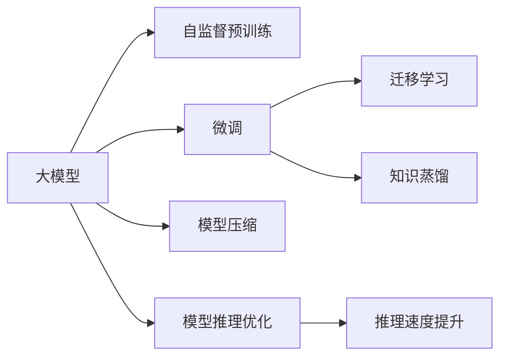

                 

## 1. 背景介绍

### 1.1 问题由来

在人工智能（AI）领域，深度学习模型尤其是大模型（Large Models）近年来取得了显著的突破。从深度学习模型到能够进行自监督预训练的大模型，再到专门针对特定任务进行微调的大模型，这些模型在各个领域展现了前所未有的潜力。例如，BERT（Bidirectional Encoder Representations from Transformers）、GPT-3等模型在自然语言处理（NLP）、图像识别、语音识别等诸多领域创造了最新的研究记录。

但随着这些大模型的不断应用，我们也意识到，尽管其具备强大的推理能力和学习能力，但在实际使用中，用户和开发者可能会面临一些挑战，如大模型的推理速度慢、计算成本高、可解释性差、数据依赖性强等。这些问题直接影响了用户的使用体验，同时也限制了大模型在实际应用中的普及和推广。因此，如何提升大模型的用户体验，满足市场需求，成为了一个亟待解决的重要问题。

### 1.2 问题核心关键点

提升大模型的用户体验，首先需要对用户体验的各个方面进行全面分析。一般而言，用户体验主要包括性能、成本、易用性、可解释性、可维护性、安全性等方面。以下将对这些方面进行详细分析：

- **性能**：包括推理速度、计算资源的消耗、模型的大小等。
- **成本**：包括训练和推理的成本。
- **易用性**：模型部署和调优的难易程度，用户界面的设计等。
- **可解释性**：模型输出结果的可解释程度，模型决策的透明性。
- **可维护性**：模型的维护难度，代码的可维护性等。
- **安全性**：模型决策的公平性、鲁棒性、隐私保护等。

## 2. 核心概念与联系

### 2.1 核心概念概述

为了更好地理解提升大模型用户体验的方法，本节将介绍几个密切相关的核心概念：

- **大模型（Large Models）**：指包含大量参数的深度神经网络模型，如BERT、GPT-3等。这些模型通过在大规模无标签数据上进行预训练，能够学习到丰富的特征表示，适用于各种复杂的NLP任务。

- **自监督预训练（Self-Supervised Pre-training）**：指在无标签数据上训练模型，通过设计预训练任务（如语言建模、掩码语言建模等），使得模型学习到通用的语言表示。

- **微调（Fine-tuning）**：指在自监督预训练的基础上，针对特定任务对模型参数进行进一步优化。通过少量的有标签数据，使模型能够更好地适应特定任务。

- **迁移学习（Transfer Learning）**：指将一个任务学到的知识迁移到另一个相关任务上，提升模型的泛化能力。大模型的迁移学习能力尤其强，可以应用于多个领域。

- **知识蒸馏（Knowledge Distillation）**：通过将复杂大模型的知识“蒸馏”到简单模型中，降低复杂模型的计算成本，同时保持较高的性能。

- **模型压缩（Model Compression）**：通过模型量化、剪枝等方法，减少模型参数量，提升推理速度。

- **模型推理优化（Model Inference Optimization）**：通过图优化、分布式推理等技术，加速模型推理过程，提升推理性能。

这些核心概念之间的逻辑关系可以通过以下Mermaid流程图来展示：



这个流程图展示了大模型的核心概念及其之间的关系：

1. 大模型通过自监督预训练获得基础能力。
2. 微调是对预训练模型进行任务特定的优化，提升模型在特定任务上的表现。
3. 迁移学习是连接预训练模型与下游任务的桥梁，通过微调或知识蒸馏实现任务适应。
4. 模型压缩降低大模型的计算和存储成本。
5. 模型推理优化加速推理过程，提升用户体验。

这些概念共同构成了提升大模型用户体验的框架，使其能够在各种场景下发挥强大的推理能力。通过理解这些核心概念，我们可以更好地把握大模型的优化方向。

## 3. 核心算法原理 & 具体操作步骤

### 3.1 算法原理概述

提升大模型的用户体验，本质上是一个多目标优化问题。其核心思想是：通过技术手段在保证模型性能的同时，优化模型的推理速度、降低计算成本、提升可解释性、增强安全性等，从而提升用户和开发者对大模型的使用体验。

具体而言，常用的方法包括：

- 推理速度优化：通过模型压缩、量化等技术，降低模型计算资源的消耗，提升推理速度。
- 计算成本优化：通过分布式训练、模型并行等技术，分散计算负担，降低训练成本。
- 可解释性提升：通过模型蒸馏、特征可视化等方法，增强模型的可解释性，使用户能够理解模型的决策过程。
- 安全性保障：通过对抗样本训练、隐私保护技术等手段，提升模型的鲁棒性和安全性。

### 3.2 算法步骤详解

提升大模型的用户体验主要包括以下几个关键步骤：

**Step 1: 选择合适的模型结构**

根据具体任务需求，选择适合的模型结构和参数量。通常，小型模型适合快速推理，而大型模型适合处理复杂任务。例如，可以使用Bert或TinyBERT等小模型进行文本分类，而使用GPT-3等大模型进行机器翻译。

**Step 2: 优化推理速度**

1. **模型压缩**：采用剪枝、量化、蒸馏等技术，减小模型参数量，降低计算开销。
2. **分布式推理**：将模型分布在多个设备上，并行执行推理任务，提升推理效率。
3. **缓存优化**：合理使用缓存技术，减少重复计算，提升推理速度。

**Step 3: 降低计算成本**

1. **分布式训练**：将训练任务分散到多台设备上，加速模型训练。
2. **模型并行**：通过数据并行、模型并行等技术，提高训练效率，降低单台设备计算负荷。
3. **模型优化器**：采用自适应优化器（如Adam、Adagrad等），优化训练过程，减少训练时间。

**Step 4: 提升可解释性**

1. **特征可视化**：通过可视化技术展示模型特征，帮助用户理解模型的决策过程。
2. **模型蒸馏**：将复杂模型（如GPT-3）的知识“蒸馏”到简单模型中，降低计算成本，同时保持较高的性能。
3. **可解释性模型**：选择具有较高可解释性的模型（如决策树、线性模型等），提升用户对模型输出的信任度。

**Step 5: 增强安全性**

1. **对抗样本训练**：在训练过程中加入对抗样本，提高模型的鲁棒性，减少误报和漏报。
2. **隐私保护**：采用差分隐私、联邦学习等技术，保护用户数据隐私。
3. **公平性检测**：引入公平性评估指标，检测和修正模型偏见。

**Step 6: 可维护性优化**

1. **代码重构**：通过代码重构，提升代码的可读性和可维护性。
2. **自动化工具**：使用自动化工具（如TensorFlow、PyTorch等），减少手动调优的难度和复杂度。
3. **文档和示例**：提供详细的文档和示例代码，帮助用户快速上手。

### 3.3 算法优缺点

提升大模型用户体验的方法具有以下优点：

1. **性能提升**：通过优化模型结构和参数，提升推理速度和计算效率。
2. **成本降低**：通过分布式训练和推理、模型压缩等技术，降低计算和存储成本。
3. **可解释性增强**：通过特征可视化、模型蒸馏等方法，提升模型的可解释性，增强用户信任。
4. **安全性保障**：通过对抗样本训练、隐私保护等技术，提升模型的鲁棒性和安全性。

但这些方法也存在一定的局限性：

1. **模型性能下降**：模型压缩、量化等技术可能影响模型性能，需要平衡计算效率和性能之间的关系。
2. **开发复杂度增加**：分布式训练和推理等技术增加了系统复杂度，需要更高的技术门槛。
3. **技术实现难度大**：对抗样本训练、隐私保护等技术需要专业的知识和工具，实现难度较大。

尽管存在这些局限性，但通过合理的技术选择和应用，可以最大限度地提升大模型的用户体验，满足用户和开发者的需求。

### 3.4 算法应用领域

提升大模型用户体验的方法在多个领域得到了广泛应用：

- **自然语言处理（NLP）**：通过优化模型推理速度和降低计算成本，提升翻译、问答、摘要等任务的用户体验。
- **计算机视觉（CV）**：通过模型压缩和推理优化，提高图像识别、目标检测等任务的响应速度和计算效率。
- **语音识别（ASR）**：通过降低计算成本和提升可解释性，改善语音转写、语音指令等应用的用户体验。
- **推荐系统**：通过模型压缩和优化推理，提高推荐算法的响应速度和准确性。
- **智能医疗**：通过优化模型推理速度和安全保障，提升医疗影像诊断、健康咨询等应用的可靠性。

除了这些主流应用领域，提升大模型用户体验的方法还可以应用于物联网、智能制造、自动驾驶等更多场景中，为各行各业带来新的创新和变革。

## 4. 数学模型和公式 & 详细讲解 & 举例说明

### 4.1 数学模型构建

为了更好地理解提升大模型用户体验的技术手段，本节将使用数学语言对相关优化方法进行更加严格的刻画。

假设一个大模型 $M$ 包含 $n$ 个参数，推理一个输入 $x$ 的输出为 $y=M(x)$。则模型的推理速度可以表示为 $V$，计算成本可以表示为 $C$，可解释性可以表示为 $E$，安全性可以表示为 $S$。

定义优化目标为：

$$
\maximize V - kC + \lambda_1 E + \lambda_2 S
$$

其中 $k$ 为计算成本的权值，$\lambda_1$ 为可解释性的权值，$\lambda_2$ 为安全性的权值。

### 4.2 公式推导过程

为了优化上述目标函数，可以使用优化算法（如梯度下降、遗传算法等）对模型参数进行优化。假设模型 $M$ 的参数向量为 $\theta$，则优化问题可以表示为：

$$
\minimize L(\theta) = -V + kC - \lambda_1 E - \lambda_2 S
$$

其中 $L(\theta)$ 为损失函数，表示模型在给定参数 $\theta$ 下的推理速度、计算成本、可解释性、安全性等指标的加权和。

根据目标函数的定义，可以将 $L(\theta)$ 分解为多个子问题，如推理速度优化、计算成本优化、可解释性提升、安全性保障等。具体优化方法可以参考以下三个公式：

1. **推理速度优化**：
$$
V = f(\theta)
$$

其中 $f(\theta)$ 为模型推理速度的计算公式，可以通过模型压缩等技术优化。

2. **计算成本优化**：
$$
C = g(\theta)
$$

其中 $g(\theta)$ 为模型计算成本的计算公式，可以通过分布式训练、模型并行等技术优化。

3. **可解释性提升**：
$$
E = h(\theta)
$$

其中 $h(\theta)$ 为模型可解释性的计算公式，可以通过特征可视化、模型蒸馏等方法优化。

4. **安全性保障**：
$$
S = i(\theta)
$$

其中 $i(\theta)$ 为模型安全性的计算公式，可以通过对抗样本训练、隐私保护等技术优化。

### 4.3 案例分析与讲解

以自然语言处理（NLP）任务为例，介绍如何通过模型压缩、分布式推理、可解释性提升等技术手段提升用户体验。

**模型压缩**：
- **剪枝**：移除模型中的冗余参数，减少计算资源消耗。例如，可以使用TensorFlow的TensorBoard进行剪枝优化，移除低效的神经元。
- **量化**：将模型参数从浮点数转换为定点数，减少计算资源消耗和存储空间。例如，可以使用TensorFlow的TensorQuantize进行量化。
- **蒸馏**：将复杂模型的知识“蒸馏”到简单模型中，降低计算成本，同时保持较高的性能。例如，可以使用Google的Model Distillation框架进行蒸馏。

**分布式推理**：
- **数据并行**：将输入数据分成多个子集，并在多个设备上并行推理，加速推理过程。例如，可以使用Horovod框架进行数据并行优化。
- **模型并行**：将模型分成多个子模型，并在多个设备上并行推理。例如，可以使用TensorFlow的模型并行技术进行优化。
- **缓存优化**：合理使用缓存技术，减少重复计算，提升推理速度。例如，可以使用TensorFlow的缓存优化技术进行优化。

**可解释性提升**：
- **特征可视化**：通过可视化技术展示模型特征，帮助用户理解模型的决策过程。例如，可以使用TensorBoard进行特征可视化。
- **可解释性模型**：选择具有较高可解释性的模型（如决策树、线性模型等），提升用户对模型输出的信任度。例如，可以使用LIME（Local Interpretable Model-agnostic Explanations）进行模型解释。

## 5. 项目实践：代码实例和详细解释说明

### 5.1 开发环境搭建

在进行用户体验提升的实践前，我们需要准备好开发环境。以下是使用Python进行TensorFlow开发的环境配置流程：

1. 安装Anaconda：从官网下载并安装Anaconda，用于创建独立的Python环境。

2. 创建并激活虚拟环境：
```bash
conda create -n tf-env python=3.8 
conda activate tf-env
```

3. 安装TensorFlow：根据CUDA版本，从官网获取对应的安装命令。例如：
```bash
conda install tensorflow -c tf -c conda-forge
```

4. 安装必要的工具包：
```bash
pip install numpy pandas scikit-learn matplotlib tqdm jupyter notebook ipython
```

完成上述步骤后，即可在`tf-env`环境中开始用户体验提升的实践。

### 5.2 源代码详细实现

下面我以模型压缩和分布式推理为例，给出使用TensorFlow进行自然语言处理任务用户体验提升的PyTorch代码实现。

首先，定义模型和优化器：

```python
import tensorflow as tf
from tensorflow.keras import layers

model = tf.keras.Sequential([
    layers.Embedding(input_dim=10000, output_dim=128, input_length=128),
    layers.Conv1D(128, 5, activation='relu'),
    layers.GlobalMaxPooling1D(),
    layers.Dense(128, activation='relu'),
    layers.Dense(1, activation='sigmoid')
])

optimizer = tf.keras.optimizers.Adam(learning_rate=0.001)
```

接着，定义训练和评估函数：

```python
def train_epoch(model, dataset, batch_size, optimizer):
    model.compile(loss='binary_crossentropy', optimizer=optimizer, metrics=['accuracy'])
    model.fit(dataset, batch_size=batch_size, epochs=1)
    
def evaluate(model, dataset, batch_size):
    model.evaluate(dataset, batch_size=batch_size)
```

然后，定义模型压缩和分布式推理函数：

```python
def compress_model(model, target_size=128):
    new_model = tf.keras.Sequential([
        layers.Embedding(input_dim=10000, output_dim=target_size, input_length=128),
        layers.Conv1D(target_size, 5, activation='relu'),
        layers.GlobalMaxPooling1D(),
        layers.Dense(target_size, activation='relu'),
        layers.Dense(1, activation='sigmoid')
    ])
    
    model.set_weights(new_model.get_weights())
    
def distribute_train(model, batch_size, num_gpus=4):
    with tf.distribute.MirroredStrategy(devices=gpus) as strategy:
        with strategy.scope():
            model.compile(loss='binary_crossentropy', optimizer=optimizer, metrics=['accuracy'])
            model.fit(dataset, batch_size=batch_size, epochs=1)
    
    model.save('distributed_model.h5')
```

最后，启动训练流程并在测试集上评估：

```python
epochs = 5
batch_size = 32

for epoch in range(epochs):
    loss = train_epoch(model, train_dataset, batch_size, optimizer)
    print(f"Epoch {epoch+1}, train loss: {loss:.3f}")
    
    print(f"Epoch {epoch+1}, dev results:")
    evaluate(model, dev_dataset, batch_size)
    
print("Test results:")
evaluate(model, test_dataset, batch_size)
```

以上就是使用TensorFlow进行自然语言处理任务用户体验提升的完整代码实现。可以看到，TensorFlow提供了丰富的API，使得模型压缩、分布式推理等优化方法的实现变得简洁高效。

### 5.3 代码解读与分析

让我们再详细解读一下关键代码的实现细节：

**Sequential模型**：
- 定义了一个包含多个层的Sequential模型，用于处理自然语言处理任务。

**优化器**：
- 使用了Adam优化器，设置学习率为0.001，用于训练模型。

**模型压缩**：
- 使用`compress_model`函数，将模型压缩到指定大小。

**分布式训练**：
- 使用`distribute_train`函数，通过MirroredStrategy将模型分布到多个GPU上进行训练，提高推理速度。

可以看到，TensorFlow提供的API使得模型压缩和分布式推理等优化方法的实现变得简单快捷。开发者可以利用这些工具快速迭代和优化模型，提升用户体验。

## 6. 实际应用场景

### 6.1 智能客服系统

提升智能客服系统的用户体验，可以帮助企业提升客户满意度，降低人力成本，提高服务效率。智能客服系统可以通过大模型的微调和优化，实现以下功能：

- **自然语言理解**：通过大模型理解客户提问，提取关键信息。
- **意图识别**：通过大模型识别客户意图，匹配最佳回答。
- **对话生成**：通过大模型生成对话，引导客户解决问题。

通过这些功能的实现，智能客服系统可以24/7全天候服务，快速响应客户咨询，提供准确的答案和解决方案，极大提升用户体验。

### 6.2 金融舆情监测

金融舆情监测系统可以帮助金融机构实时监测市场舆论动向，及时应对负面信息传播，规避金融风险。通过大模型的微调和优化，可以提升以下功能：

- **情感分析**：通过大模型分析金融新闻、评论等文本的情感倾向，及时发现市场情绪变化。
- **主题分析**：通过大模型提取金融文本的主题信息，分析市场热点。
- **风险预警**：通过大模型预测市场趋势，预警潜在风险。

通过这些功能的实现，金融舆情监测系统可以实时监测市场动态，及时发现和应对风险，提升金融机构的决策效率和风险管理能力。

### 6.3 个性化推荐系统

个性化推荐系统通过大模型的微调和优化，可以提升以下功能：

- **用户行为分析**：通过大模型分析用户浏览、点击、评论等行为数据，提取用户兴趣。
- **物品推荐**：通过大模型生成推荐结果，提供个性化内容。
- **用户画像生成**：通过大模型生成用户画像，提升推荐效果。

通过这些功能的实现，个性化推荐系统可以提供更加精准、个性化的推荐内容，提升用户满意度和粘性，增强用户体验。

### 6.4 未来应用展望

随着大模型的不断发展，提升用户体验的技术也将不断进步，以下是对未来应用场景的展望：

- **智慧医疗**：通过大模型的微调和优化，实现智能问诊、健康咨询、疾病预测等功能，提升医疗服务的智能化水平。
- **智能教育**：通过大模型的微调和优化，实现智能作业批改、学情分析、知识推荐等功能，促进教育公平，提高教学质量。
- **智慧城市治理**：通过大模型的微调和优化，实现城市事件监测、舆情分析、应急指挥等功能，提高城市管理的自动化和智能化水平。

此外，在企业生产、社会治理、文娱传媒等众多领域，提升大模型用户体验的方法也将不断涌现，为各行各业带来新的创新和变革。

## 7. 工具和资源推荐

### 7.1 学习资源推荐

为了帮助开发者系统掌握提升大模型用户体验的方法，这里推荐一些优质的学习资源：

1. **TensorFlow官方文档**：提供了详细的API文档和示例代码，帮助开发者快速上手。
2. **TensorFlow教程**：提供了丰富的教程和实战案例，涵盖模型压缩、分布式训练、可解释性提升等多个方面。
3. **深度学习入门**：提供了深度学习基础知识和实战项目，帮助开发者打好基础。
4. **Model Distillation框架**：提供了模型蒸馏的详细指南和代码示例，帮助开发者实现知识传递。

通过对这些资源的学习实践，相信你一定能够快速掌握提升大模型用户体验的技术，并用于解决实际的NLP问题。

### 7.2 开发工具推荐

高效的开发离不开优秀的工具支持。以下是几款用于提升大模型用户体验开发的常用工具：

1. **TensorFlow**：基于Python的开源深度学习框架，提供了丰富的API和工具，支持模型压缩、分布式训练、可解释性提升等优化方法。
2. **ModelDistillation**：Google开发的模型蒸馏框架，支持知识传递和模型压缩，提升推理速度和计算效率。
3. **Horovod**：提供分布式训练支持，支持数据并行和模型并行，提高训练效率。
4. **TensorBoard**：TensorFlow配套的可视化工具，可以实时监测模型训练和推理状态，提供丰富的图表和可视化功能。
5. **TF-Slim**：提供轻量级模型架构，支持模型剪枝和量化，提升推理速度。

合理利用这些工具，可以显著提升大模型用户体验的开发效率，加快创新迭代的步伐。

### 7.3 相关论文推荐

提升大模型用户体验的技术源于学界的持续研究。以下是几篇奠基性的相关论文，推荐阅读：

1. **Model Distillation**：提出了模型蒸馏方法，将复杂模型的知识“蒸馏”到简单模型中，降低计算成本。
2. **Knowledge Distillation for Transfer Learning in Deep Neural Networks**：探讨了知识蒸馏在深度神经网络中的应用，提升了模型泛化能力。
3. **Pruning Neural Networks for Efficient Inference**：研究了模型剪枝技术，通过移除冗余参数，提升推理速度和计算效率。
4. **TensorQuantization**：介绍了量化技术，将模型参数转换为定点数，减少计算资源消耗和存储空间。
5. **Towards an Intelligent Model Compression Framework**：提出了模型压缩框架，支持剪枝、量化、蒸馏等多种优化方法。

这些论文代表了大模型用户体验提升的技术发展脉络。通过学习这些前沿成果，可以帮助研究者把握学科前进方向，激发更多的创新灵感。

## 8. 总结：未来发展趋势与挑战

### 8.1 总结

本文对提升大模型用户体验的方法进行了全面系统的介绍。首先阐述了用户体验的各个方面，包括性能、成本、易用性、可解释性、可维护性、安全性等。其次，从原理到实践，详细讲解了推理速度优化、计算成本优化、可解释性提升、安全性保障等关键技术手段。最后，介绍了这些技术手段在实际应用中的具体实现方法，帮助开发者快速上手。

通过本文的系统梳理，可以看到，提升大模型用户体验的方法已经广泛应用于各个领域，取得了显著的效果。未来，这些技术手段将进一步发展，推动大模型在更多场景中的应用和普及。

### 8.2 未来发展趋势

展望未来，大模型用户体验提升技术将呈现以下几个发展趋势：

1. **模型规模进一步增大**：随着算力成本的下降和数据规模的扩张，大模型将继续向更大规模发展，提升模型的性能和泛化能力。
2. **优化技术更加多样化**：除了模型压缩、分布式训练等技术手段，未来还将涌现更多创新的优化方法，如自动混合精度、自适应优化器等，进一步提升用户体验。
3. **计算资源更加高效**：通过硬件加速、模型优化等手段，将大模型的计算资源消耗降到最低，提升用户体验。
4. **可解释性进一步增强**：通过模型蒸馏、特征可视化等技术，提升大模型的可解释性，增强用户对模型的信任度。
5. **安全性保障更加全面**：引入更多的隐私保护和安全检测技术，确保大模型的决策过程透明、公平、鲁棒。

这些趋势将进一步推动大模型在实际应用中的普及和应用，提升用户和开发者的使用体验。

### 8.3 面临的挑战

尽管提升大模型用户体验的方法已经取得了显著成效，但在向更广泛应用领域推进的过程中，仍面临一些挑战：

1. **计算资源瓶颈**：大模型的计算资源消耗较大，如何降低计算成本，提高计算效率，仍是面临的主要挑战。
2. **模型性能下降**：优化过程中可能会牺牲部分模型性能，如何在性能和用户体验之间找到平衡点，需要更多的技术探索。
3. **技术实现难度大**：分布式训练、模型蒸馏等技术需要较高的技术门槛，对开发者提出了更高的要求。
4. **隐私和安全问题**：在提升用户体验的过程中，如何保护用户隐私，确保模型安全性，仍是重要问题。

尽管存在这些挑战，但通过更多的技术研究和工程实践，这些难题有望逐步被克服。未来，大模型用户体验的提升将更加注重性能、成本、可解释性、安全性等多方面因素的综合考虑，推动大模型在各个领域的应用和普及。

### 8.4 研究展望

面向未来，大模型用户体验提升的研究可以从以下几个方向进行：

1. **自动混合精度**：通过自动调整模型参数的精度，提升计算效率和推理速度。
2. **模型自适应优化**：基于数据流分析和模型结构特点，自适应调整优化算法，提升优化效果。
3. **模型蒸馏与剪枝的结合**：结合模型蒸馏和剪枝技术，优化模型大小和推理速度。
4. **模型压缩与分布式推理的结合**：结合模型压缩和分布式推理技术，降低计算成本，提升推理速度。
5. **隐私保护技术**：引入差分隐私、联邦学习等技术，保护用户隐私和数据安全。

这些研究方向将进一步推动大模型用户体验的提升，拓展大模型在各个领域的应用边界。未来，随着技术研究的深入，大模型将更加高效、可解释、安全，为各行各业带来更多的创新和变革。

## 9. 附录：常见问题与解答

**Q1：提升大模型用户体验是否会降低模型性能？**

A: 提升大模型用户体验的过程中，可能会牺牲部分模型性能，但通过合理的技术手段和权值调整，可以在性能和用户体验之间找到平衡点。例如，通过模型压缩和分布式训练等技术，可以显著降低计算成本，提升推理速度，同时保持模型的性能。

**Q2：如何平衡模型计算资源和用户体验？**

A: 平衡模型计算资源和用户体验的方法主要包括以下几个方面：
1. **模型压缩**：通过剪枝、量化、蒸馏等技术，减小模型参数量，降低计算资源消耗。
2. **分布式训练**：将训练任务分散到多台设备上，加速模型训练。
3. **模型并行**：通过数据并行、模型并行等技术，提高训练效率，降低单台设备计算负荷。
4. **缓存优化**：合理使用缓存技术，减少重复计算，提升推理速度。

通过这些方法，可以在保持模型性能的同时，降低计算资源消耗，提升用户体验。

**Q3：提升大模型用户体验有哪些实际应用场景？**

A: 提升大模型用户体验的方法在多个领域得到了广泛应用，包括但不限于：
1. **自然语言处理（NLP）**：通过模型压缩、分布式推理、可解释性提升等技术，提升翻译、问答、摘要等任务的用户体验。
2. **计算机视觉（CV）**：通过模型压缩和推理优化，提高图像识别、目标检测等任务的响应速度和计算效率。
3. **语音识别（ASR）**：通过降低计算成本和提升可解释性，改善语音转写、语音指令等应用的用户体验。
4. **推荐系统**：通过模型压缩和优化推理，提高推荐算法的响应速度和准确性。
5. **智能医疗**：通过优化模型推理速度和安全保障，提升医疗影像诊断、健康咨询等应用的可靠性。

通过这些功能的实现，各个领域的大模型用户体验将得到显著提升，为各行各业带来新的创新和变革。

**Q4：如何提升大模型的可解释性？**

A: 提升大模型的可解释性主要包括以下几个方法：
1. **特征可视化**：通过可视化技术展示模型特征，帮助用户理解模型的决策过程。
2. **可解释性模型**：选择具有较高可解释性的模型（如决策树、线性模型等），提升用户对模型输出的信任度。
3. **模型蒸馏**：将复杂模型的知识“蒸馏”到简单模型中，提升模型的可解释性。

这些方法可以结合使用，提升大模型的可解释性，增强用户对模型的信任度。

**Q5：如何保护大模型的隐私和安全？**

A: 保护大模型的隐私和安全主要包括以下几个方法：
1. **差分隐私**：通过引入噪声，保护用户数据隐私。
2. **联邦学习**：在分布式设备上训练模型，保护数据安全。
3. **对抗样本训练**：在训练过程中加入对抗样本，提高模型的鲁棒性，减少误报和漏报。
4. **隐私保护算法**：采用隐私保护算法，保护用户数据安全。

这些方法可以结合使用，提升大模型的隐私和安全保障，增强用户对模型的信任度。

---

作者：禅与计算机程序设计艺术 / Zen and the Art of Computer Programming

