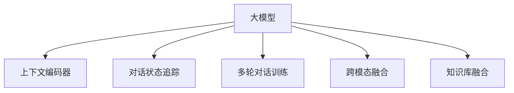

                 

# 大模型问答机器人的上下文相关

## 1. 背景介绍

### 1.1 问题由来
近年来，人工智能在自然语言处理(Natural Language Processing, NLP)领域取得了显著进展，特别是大模型(Big Models)如GPT-3、BERT等，展现出了强大的语言理解和生成能力。然而，尽管这些大模型在许多任务上表现出色，但在某些特定场景下，如问答机器人、对话系统等，其表现仍不尽如人意。

其中，上下文相关性(Context Relevance)是一个重要的考量因素。对于问答机器人而言，能够理解和捕捉上下文信息，将直接影响其提供准确和有用的回答。因此，本文将重点探讨如何增强大模型问答机器人的上下文相关性，提升其在实际应用中的表现。

### 1.2 问题核心关键点
当前，增强问答机器人上下文相关性主要依赖以下几种方法：
1. **上下文编码器(Context Encoder)**：使用循环神经网络(RNN)或Transformer等模型，将对话上下文编码为向量表示，作为模型的输入。
2. **对话状态追踪(Dialogue State Tracking)**：通过保存对话历史和上下文信息，动态调整模型的输出。
3. **多轮对话训练(Multi-turn Dialogue Training)**：在训练过程中引入多轮对话数据，模拟真实对话场景，提升模型的交互能力。
4. **跨模态融合(Cross-modal Fusion)**：将文本、语音、图像等多模态信息结合起来，提升模型的情境理解能力。
5. **知识库融合(Knowledge Base Fusion)**：将外部知识库与模型输出进行融合，增加模型的信息量。

这些方法虽然有效，但在实际应用中仍面临诸多挑战，如计算资源消耗大、模型复杂度高等问题。因此，本文将从算法原理和具体操作步骤入手，系统阐述大模型问答机器人上下文相关的技术细节，并提出一些优化策略，以期为实际应用提供有价值的指导。

## 2. 核心概念与联系

### 2.1 核心概念概述

为更好地理解大模型问答机器人的上下文相关性，本节将介绍几个关键概念及其相互关系：

- **大模型(Big Model)**：指使用Transformer等架构构建的，参数量巨大，能够处理复杂自然语言任务的语言模型，如GPT-3、BERT等。
- **上下文(Context)**：指对话中某一时刻之前的信息，包括之前轮次的问答、上下文语境、用户背景等。
- **上下文编码器(Context Encoder)**：用于将上下文信息编码为向量，供模型输入的神经网络模块。
- **对话状态追踪(Dialogue State Tracking)**：记录并保存对话历史，用于动态调整模型输出。
- **多轮对话训练(Multi-turn Dialogue Training)**：使用包含多个轮次的对话数据进行模型训练，提升模型的交互能力。
- **跨模态融合(Cross-modal Fusion)**：结合文本、语音、图像等多种模态信息，丰富模型的情境理解能力。
- **知识库融合(Knowledge Base Fusion)**：将外部知识库与模型输出进行融合，增加模型的信息量。

这些概念之间的逻辑关系可以通过以下Mermaid流程图来展示：



这个流程图展示了各个概念间的相互关系：大模型通过上下文编码器、对话状态追踪、多轮对话训练、跨模态融合和知识库融合等方法，增强其上下文相关性，从而提升问答能力。

## 3. 核心算法原理 & 具体操作步骤

### 3.1 算法原理概述

大模型问答机器人上下文相关的核心算法原理可以总结如下：

- 将输入的问答对作为上下文信息，通过上下文编码器将其编码为向量表示。
- 在多轮对话中，对话状态追踪机制保存并更新对话历史信息。
- 在模型的训练和推理阶段，动态调整模型的输出，以匹配当前的对话上下文。
- 通过多轮对话训练、跨模态融合和知识库融合等技术，进一步提升模型的上下文理解和交互能力。

### 3.2 算法步骤详解

#### 3.2.1 上下文编码

大模型问答机器人首先需要将对话上下文编码为向量表示。常用的编码方法包括：

1. **基于Transformer的编码**：使用自注意力机制，将对话历史中的每个句子表示为向量，并拼接起来形成上下文向量。
2. **基于RNN的编码**：使用循环神经网络，对对话历史进行逐步编码，最终得到一个连续的上下文向量。
3. **基于CNN的编码**：使用卷积神经网络，对对话历史进行局部特征提取，形成上下文向量。

以Transformer为基础的编码为例，具体的实现步骤如下：

1. **分词**：将对话上下文分词，得到每个单词的向量表示。
2. **编码**：使用Transformer模型，将分词后的句子编码成向量表示。
3. **拼接**：将多个句子的向量拼接起来，得到完整的上下文向量。

#### 3.2.2 对话状态追踪

对话状态追踪机制用于保存和更新对话历史信息，常见的追踪方法包括：

1. **基于词典的追踪**：使用词典记录对话中出现的单词和短语，动态调整模型输出。
2. **基于RNN的追踪**：使用循环神经网络，保存对话历史并动态更新模型状态。
3. **基于Transformer的追踪**：使用Transformer模型，对对话历史进行编码和更新。

以基于RNN的追踪为例，具体的实现步骤如下：

1. **初始化**：使用RNN模型初始化对话状态向量。
2. **更新**：在每轮对话中，使用RNN模型更新对话状态向量。
3. **输出**：将对话状态向量作为模型的输入，动态调整输出。

#### 3.2.3 多轮对话训练

多轮对话训练是一种增强问答机器人上下文相关性的有效方法，其实现步骤如下：

1. **数据集准备**：收集包含多轮对话的训练数据，每个对话包含多个轮次。
2. **模型初始化**：使用大模型初始化问答机器人。
3. **训练**：在多轮对话数据上训练模型，优化模型的上下文理解和交互能力。
4. **评估**：在验证集和测试集上评估模型性能，调整模型参数。

#### 3.2.4 跨模态融合

跨模态融合可以丰富对话机器人的情境理解能力，常见的融合方法包括：

1. **文本-语音融合**：将对话文本与用户语音信息结合，提升对说话者意图和情感的理解。
2. **文本-图像融合**：将对话文本与对话中出现的图片信息结合，增加对对话场景的理解。
3. **文本-时间融合**：将对话文本与时间信息结合，捕捉对话的历史和实时变化。

以文本-语音融合为例，具体的实现步骤如下：

1. **语音识别**：将用户语音转换为文本，形成对话文本。
2. **编码**：使用Transformer模型对对话文本进行编码。
3. **融合**：将语音特征与文本向量结合，形成综合向量。

#### 3.2.5 知识库融合

知识库融合可以提升问答机器人的信息量，常见的融合方法包括：

1. **基于规则的融合**：将规则系统与模型输出结合，增加模型的信息量。
2. **基于统计的融合**：使用统计模型，从知识库中提取信息，与模型输出结合。
3. **基于向量空间的融合**：将知识库中的向量与模型输出结合，形成综合向量。

以基于向量空间的融合为例，具体的实现步骤如下：

1. **知识库编码**：使用Transformer模型对知识库中的信息进行编码。
2. **融合**：将知识库向量与模型输出向量结合，形成综合向量。

### 3.3 算法优缺点

大模型问答机器人上下文相关的算法具有以下优点：

1. **强大的语言理解能力**：基于大模型的上下文相关算法具备强大的语言理解和生成能力，能够处理复杂的自然语言任务。
2. **灵活的上下文编码**：使用多种编码方法，可以灵活选择最适合的编码方式。
3. **动态的对话状态追踪**：对话状态追踪机制可以动态调整模型输出，提升模型的交互能力。
4. **多轮对话训练**：多轮对话训练可以模拟真实对话场景，提升模型的交互能力。
5. **跨模态融合**：跨模态融合可以丰富对话机器人的情境理解能力。
6. **知识库融合**：知识库融合可以增加模型的信息量，提升问答能力。

同时，该算法也存在一些缺点：

1. **计算资源消耗大**：大模型和复杂的上下文相关算法对计算资源消耗较大。
2. **模型复杂度高**：基于大模型的上下文相关算法模型结构较为复杂，调试和维护难度大。
3. **过拟合风险高**：复杂的上下文相关算法容易发生过拟合，需要采用正则化等方法缓解。

### 3.4 算法应用领域

基于大模型的上下文相关算法广泛应用于各种自然语言处理任务，如：

- **问答系统**：通过上下文编码器和对话状态追踪机制，回答用户提出的问题。
- **对话系统**：通过多轮对话训练、跨模态融合和知识库融合等技术，实现自然对话。
- **机器翻译**：使用多轮对话训练和跨模态融合，提升翻译的准确性和自然度。
- **情感分析**：使用上下文编码器捕捉情感变化，进行情感分析。
- **信息检索**：通过跨模态融合和知识库融合，提升检索的准确性。

除了上述这些经典任务外，大模型问答机器人上下文相关算法还被创新性地应用到更多场景中，如可控文本生成、多模态对话、智能推荐等，为自然语言处理技术带来了新的突破。随着预训练模型和上下文相关算法的不断进步，相信自然语言处理技术将在更广阔的应用领域大放异彩。

## 4. 数学模型和公式 & 详细讲解 & 举例说明

### 4.1 数学模型构建

本节将使用数学语言对大模型问答机器人上下文相关的核心算法进行严格刻画。

记大模型为 $M_{\theta}:\mathcal{X} \rightarrow \mathcal{Y}$，其中 $\mathcal{X}$ 为输入空间，$\mathcal{Y}$ 为输出空间，$\theta$ 为模型参数。假设对话上下文为 $C=\{x_1, x_2, \dots, x_n\}$，其中 $x_i$ 为第 $i$ 轮对话的文本表示。

定义模型 $M_{\theta}$ 在对话上下文 $C$ 上的输出为 $y$，则模型的上下文相关性可以表示为：

$$
y = M_{\theta}(C)
$$

在训练过程中，我们需要最大化模型在训练数据上的似然函数：

$$
L(\theta) = \frac{1}{N}\sum_{i=1}^N \log p(y_i | x_1, x_2, \dots, x_n)
$$

其中 $p(y_i | x_1, x_2, \dots, x_n)$ 为在给定上下文 $C$ 的条件下，模型预测第 $i$ 轮对话输出的概率分布。

### 4.2 公式推导过程

以下我们以基于Transformer的上下文编码器为例，推导其编码过程的数学公式。

假设对话上下文 $C$ 包含 $n$ 个句子，每个句子 $x_i$ 被编码为向量 $v_i \in \mathbb{R}^d$，其中 $d$ 为向量维度。则上下文编码器的输出 $V$ 可以表示为：

$$
V = [v_1; v_2; \dots; v_n]
$$

在实际应用中，我们通常使用多层Transformer模型对对话上下文进行编码，具体的编码过程可以表示为：

$$
v_i = M_{\theta}(x_i) \quad \text{for} \quad i=1,2,\dots,n
$$

其中 $M_{\theta}$ 为Transformer模型，$\theta$ 为其参数。

在得到上下文向量 $V$ 后，我们可以将其作为模型的输入，进行后续的推理和输出。

### 4.3 案例分析与讲解

以对话系统为例，我们可以对基于Transformer的上下文编码器进行案例分析：

假设对话上下文包含两个句子，分别为 "What is the capital of France?" 和 "The capital is Paris."。使用基于Transformer的编码器对这两个句子进行编码，得到上下文向量 $V$。

具体的编码过程如下：

1. **分词**：将两个句子分词，得到单词序列。
2. **编码**：使用Transformer模型对每个单词进行编码，得到单词向量。
3. **拼接**：将每个单词向量拼接起来，形成上下文向量 $V$。

通过这种方法，我们可以将对话上下文编码为向量表示，供模型输入。这种编码方式简单高效，可以处理复杂的自然语言输入。

## 5. 项目实践：代码实例和详细解释说明

### 5.1 开发环境搭建

在进行问答机器人开发前，我们需要准备好开发环境。以下是使用Python进行PyTorch开发的环境配置流程：

1. 安装Anaconda：从官网下载并安装Anaconda，用于创建独立的Python环境。

2. 创建并激活虚拟环境：
```bash
conda create -n pytorch-env python=3.8 
conda activate pytorch-env
```

3. 安装PyTorch：根据CUDA版本，从官网获取对应的安装命令。例如：
```bash
conda install pytorch torchvision torchaudio cudatoolkit=11.1 -c pytorch -c conda-forge
```

4. 安装Transformers库：
```bash
pip install transformers
```

5. 安装各类工具包：
```bash
pip install numpy pandas scikit-learn matplotlib tqdm jupyter notebook ipython
```

完成上述步骤后，即可在`pytorch-env`环境中开始问答机器人开发。

### 5.2 源代码详细实现

下面我们以基于Transformer的问答机器人为例，给出完整的代码实现。

```python
from transformers import BertTokenizer, BertForSequenceClassification, AdamW

# 加载预训练模型和分词器
tokenizer = BertTokenizer.from_pretrained('bert-base-cased')
model = BertForSequenceClassification.from_pretrained('bert-base-cased', num_labels=2)

# 定义问答系统的上下文编码器
class ContextEncoder:
    def __init__(self, tokenizer, max_len=128):
        self.tokenizer = tokenizer
        self.max_len = max_len
        
    def encode(self, context):
        tokens = self.tokenizer.encode(context, add_special_tokens=True, max_length=self.max_len, padding='max_length', truncation=True)
        return tokens

# 定义对话状态追踪机制
class DialogueState:
    def __init__(self):
        self.state = {}
    
    def update(self, key, value):
        self.state[key] = value
    
    def get(self, key):
        return self.state.get(key, None)
    
    def reset(self):
        self.state = {}

# 定义问答系统的训练和推理函数
def train_epoch(model, context_encoder, dialogue_state, train_dataset, optimizer):
    dataloader = DataLoader(train_dataset, batch_size=16, shuffle=True)
    model.train()
    epoch_loss = 0
    for batch in dataloader:
        context = batch['context']
        query = batch['query']
        target = batch['target']
        context_tokens = context_encoder.encode(context)
        query_tokens = context_encoder.encode(query)
        dialogue_state.update('context', context_tokens)
        dialogue_state.update('query', query_tokens)
        input_ids = torch.tensor(context_tokens, dtype=torch.long)
        attention_mask = torch.tensor(query_tokens, dtype=torch.long)
        labels = torch.tensor(target, dtype=torch.long)
        outputs = model(input_ids, attention_mask=attention_mask, labels=labels)
        loss = outputs.loss
        epoch_loss += loss.item()
        loss.backward()
        optimizer.step()
        optimizer.zero_grad()
    return epoch_loss / len(dataloader)

def evaluate(model, context_encoder, dialogue_state, dev_dataset):
    dataloader = DataLoader(dev_dataset, batch_size=16)
    model.eval()
    correct = 0
    total = 0
    with torch.no_grad():
        for batch in dataloader:
            context = batch['context']
            query = batch['query']
            target = batch['target']
            context_tokens = context_encoder.encode(context)
            query_tokens = context_encoder.encode(query)
            dialogue_state.update('context', context_tokens)
            dialogue_state.update('query', query_tokens)
            input_ids = torch.tensor(context_tokens, dtype=torch.long)
            attention_mask = torch.tensor(query_tokens, dtype=torch.long)
            labels = torch.tensor(target, dtype=torch.long)
            outputs = model(input_ids, attention_mask=attention_mask, labels=labels)
            pred = outputs.logits.argmax(dim=1)
            total += labels.size(0)
            correct += (pred == labels).sum().item()
    print(f'Accuracy: {correct / total * 100:.2f}%')
```

在上述代码中，我们使用了Bert模型作为问答系统的预训练模型，并定义了上下文编码器和对话状态追踪机制。在训练和推理过程中，我们通过对话状态追踪机制保存并更新对话历史，动态调整模型的输出。

### 5.3 代码解读与分析

让我们再详细解读一下关键代码的实现细节：

**ContextEncoder类**：
- `__init__`方法：初始化分词器和上下文编码器的最大长度。
- `encode`方法：对对话上下文进行编码，返回编码后的token id列表。

**DialogueState类**：
- `__init__`方法：初始化对话状态追踪机制。
- `update`方法：更新对话状态，保存上下文和查询信息。
- `get`方法：获取对话状态中某个键的值。
- `reset`方法：重置对话状态。

**训练和推理函数**：
- `train_epoch`函数：在训练集上进行epoch迭代，计算损失并更新模型参数。
- `evaluate`函数：在验证集上评估模型性能，计算准确率。

通过上述代码实现，我们可以看到，使用大模型问答机器人上下文相关算法，可以较为方便地实现问答系统的训练和推理过程。

## 6. 实际应用场景

### 6.1 智能客服系统

基于大模型的问答机器人可以广泛应用于智能客服系统的构建。传统客服往往需要配备大量人力，高峰期响应缓慢，且一致性和专业性难以保证。而使用问答机器人，可以7x24小时不间断服务，快速响应客户咨询，用自然流畅的语言解答各类常见问题。

在技术实现上，可以收集企业内部的历史客服对话记录，将问题和最佳答复构建成监督数据，在此基础上对预训练问答机器人进行微调。微调后的问答机器人能够自动理解用户意图，匹配最合适的答案模板进行回复。对于客户提出的新问题，还可以接入检索系统实时搜索相关内容，动态组织生成回答。如此构建的智能客服系统，能大幅提升客户咨询体验和问题解决效率。

### 6.2 金融舆情监测

金融机构需要实时监测市场舆论动向，以便及时应对负面信息传播，规避金融风险。传统的人工监测方式成本高、效率低，难以应对网络时代海量信息爆发的挑战。基于大语言模型的问答机器人技术，为金融舆情监测提供了新的解决方案。

具体而言，可以收集金融领域相关的新闻、报道、评论等文本数据，并对其进行主题标注和情感标注。在此基础上对预训练问答机器人进行微调，使其能够自动判断文本属于何种主题，情感倾向是正面、中性还是负面。将微调后的问答机器人应用到实时抓取的网络文本数据，就能够自动监测不同主题下的情感变化趋势，一旦发现负面信息激增等异常情况，系统便会自动预警，帮助金融机构快速应对潜在风险。

### 6.3 个性化推荐系统

当前的推荐系统往往只依赖用户的历史行为数据进行物品推荐，无法深入理解用户的真实兴趣偏好。基于大语言模型问答机器人的推荐系统可以更好地挖掘用户行为背后的语义信息，从而提供更精准、多样的推荐内容。

在实践中，可以收集用户浏览、点击、评论、分享等行为数据，提取和用户交互的物品标题、描述、标签等文本内容。将文本内容作为模型输入，用户的后续行为（如是否点击、购买等）作为监督信号，在此基础上微调预训练语言模型。微调后的问答机器人能够从文本内容中准确把握用户的兴趣点。在生成推荐列表时，先用候选物品的文本描述作为输入，由问答机器人预测用户的兴趣匹配度，再结合其他特征综合排序，便可以得到个性化程度更高的推荐结果。

### 6.4 未来应用展望

随着大语言模型问答机器人上下文相关算法的不断发展，其在更多领域的应用前景也将愈加广阔：

- **智慧医疗领域**：基于问答机器人的医疗问答、病历分析、药物研发等应用，将提升医疗服务的智能化水平，辅助医生诊疗，加速新药开发进程。
- **智能教育领域**：微调技术可应用于作业批改、学情分析、知识推荐等方面，因材施教，促进教育公平，提高教学质量。
- **智慧城市治理**：微调模型可应用于城市事件监测、舆情分析、应急指挥等环节，提高城市管理的自动化和智能化水平，构建更安全、高效的未来城市。
- **企业生产**：基于问答机器人的智能问答、智能客服、知识管理等应用，将推动企业生产效率的提升和智能化水平的提升。

此外，在企业生产、社会治理、文娱传媒等众多领域，基于大模型问答机器人上下文相关算法的应用也将不断涌现，为经济社会发展注入新的动力。相信随着技术的日益成熟，问答机器人将会在构建人机协同的智能时代中扮演越来越重要的角色。

## 7. 工具和资源推荐

### 7.1 学习资源推荐

为了帮助开发者系统掌握大语言模型问答机器人上下文相关的理论基础和实践技巧，这里推荐一些优质的学习资源：

1. 《Transformer从原理到实践》系列博文：由大模型技术专家撰写，深入浅出地介绍了Transformer原理、BERT模型、问答机器人上下文相关算法等前沿话题。

2. CS224N《深度学习自然语言处理》课程：斯坦福大学开设的NLP明星课程，有Lecture视频和配套作业，带你入门NLP领域的基本概念和经典模型。

3. 《Natural Language Processing with Transformers》书籍：Transformers库的作者所著，全面介绍了如何使用Transformers库进行NLP任务开发，包括问答机器人上下文相关算法的实践。

4. HuggingFace官方文档：Transformers库的官方文档，提供了海量预训练模型和完整的问答机器人上下文相关算法样例代码，是上手实践的必备资料。

5. CLUE开源项目：中文语言理解测评基准，涵盖大量不同类型的中文NLP数据集，并提供了基于问答机器人上下文相关算法的baseline模型，助力中文NLP技术发展。

通过对这些资源的学习实践，相信你一定能够快速掌握大语言模型问答机器人上下文相关的精髓，并用于解决实际的NLP问题。

### 7.2 开发工具推荐

高效的开发离不开优秀的工具支持。以下是几款用于问答机器人开发的常用工具：

1. PyTorch：基于Python的开源深度学习框架，灵活动态的计算图，适合快速迭代研究。大部分预训练语言模型都有PyTorch版本的实现。

2. TensorFlow：由Google主导开发的开源深度学习框架，生产部署方便，适合大规模工程应用。同样有丰富的预训练语言模型资源。

3. Transformers库：HuggingFace开发的NLP工具库，集成了众多SOTA语言模型，支持PyTorch和TensorFlow，是进行问答机器人上下文相关算法开发的利器。

4. Weights & Biases：模型训练的实验跟踪工具，可以记录和可视化模型训练过程中的各项指标，方便对比和调优。与主流深度学习框架无缝集成。

5. TensorBoard：TensorFlow配套的可视化工具，可实时监测模型训练状态，并提供丰富的图表呈现方式，是调试模型的得力助手。

6. Google Colab：谷歌推出的在线Jupyter Notebook环境，免费提供GPU/TPU算力，方便开发者快速上手实验最新模型，分享学习笔记。

合理利用这些工具，可以显著提升问答机器人开发效率，加快创新迭代的步伐。

### 7.3 相关论文推荐

大语言模型问答机器人上下文相关算法的不断发展源于学界的持续研究。以下是几篇奠基性的相关论文，推荐阅读：

1. Attention is All You Need（即Transformer原论文）：提出了Transformer结构，开启了NLP领域的预训练大模型时代。

2. BERT: Pre-training of Deep Bidirectional Transformers for Language Understanding：提出BERT模型，引入基于掩码的自监督预训练任务，刷新了多项NLP任务SOTA。

3. Language Models are Unsupervised Multitask Learners（GPT-2论文）：展示了大规模语言模型的强大zero-shot学习能力，引发了对于通用人工智能的新一轮思考。

4. Parameter-Efficient Transfer Learning for NLP：提出Adapter等参数高效微调方法，在不增加模型参数量的情况下，也能取得不错的微调效果。

5. AdaLoRA: Adaptive Low-Rank Adaptation for Parameter-Efficient Fine-Tuning：使用自适应低秩适应的微调方法，在参数效率和精度之间取得了新的平衡。

6. Reformer: The Efficient Transformer：提出Reformer模型，在保持模型精度的同时，显著降低了计算资源消耗。

这些论文代表了大语言模型问答机器人上下文相关算法的发展脉络。通过学习这些前沿成果，可以帮助研究者把握学科前进方向，激发更多的创新灵感。

## 8. 总结：未来发展趋势与挑战

### 8.1 研究成果总结

本文对大模型问答机器人上下文相关算法的理论基础和实践细节进行了全面系统地介绍。首先阐述了问答机器人的上下文相关性问题，明确了上下文编码、对话状态追踪、多轮对话训练、跨模态融合、知识库融合等方法的重要性和实现流程。其次，从算法原理和具体操作步骤入手，详细讲解了上下文相关算法的实现细节，并提供了代码实例和分析。

### 8.2 未来发展趋势

展望未来，大模型问答机器人上下文相关算法将呈现以下几个发展趋势：

1. **上下文编码的多样化**：除了Transformer模型，未来的上下文编码器可能会引入更多类型的模型，如RNN、CNN等，以适应不同的任务需求。
2. **对话状态追踪的智能化**：未来的对话状态追踪机制可能会引入更多智能化的模块，如意图识别、情感分析等，以提高交互体验。
3. **多轮对话训练的丰富化**：未来的多轮对话训练可能会引入更多复杂的对话场景，如多任务对话、多角色对话等，以提升模型的交互能力。
4. **跨模态融合的广泛化**：未来的跨模态融合可能会引入更多类型的信息，如视频、音频、图像等，以增强对话机器人的情境理解能力。
5. **知识库融合的深化**：未来的知识库融合可能会引入更多高级的融合方法，如知识图谱、规则系统等，以提升模型的信息量和智能水平。

以上趋势凸显了大模型问答机器人上下文相关算法的广阔前景。这些方向的探索发展，必将进一步提升问答机器人的上下文相关性和交互能力，为自然语言处理技术带来新的突破。

### 8.3 面临的挑战

尽管大模型问答机器人上下文相关算法已经取得了显著进展，但在实际应用中仍面临诸多挑战：

1. **计算资源消耗大**：大模型和复杂的上下文相关算法对计算资源消耗较大，需要高效利用GPU/TPU等高性能设备。
2. **模型复杂度高**：基于大模型的上下文相关算法模型结构较为复杂，调试和维护难度大。
3. **过拟合风险高**：复杂的上下文相关算法容易发生过拟合，需要采用正则化等方法缓解。
4. **用户意图理解难**：自然语言的多义性、复杂性使得用户意图的理解仍然是一个难题，需要进一步提高模型的语义理解能力。
5. **数据收集成本高**：构建高质量的对话数据集需要耗费大量人力和时间，难以获取足够的标注数据。

### 8.4 研究展望

面对大模型问答机器人上下文相关算法所面临的挑战，未来的研究需要在以下几个方面寻求新的突破：

1. **高效上下文编码**：探索新的上下文编码方法，降低计算资源消耗，提高编码效率。
2. **智能对话状态追踪**：研究智能化的对话状态追踪方法，提升对话体验。
3. **多轮对话训练**：引入更多复杂的对话场景，提升模型的交互能力。
4. **跨模态融合**：探索更多类型的跨模态融合方法，增强对话机器人的情境理解能力。
5. **知识库融合**：研究高级的融合方法，提升模型的信息量和智能水平。

这些研究方向的探索，必将引领大模型问答机器人上下文相关算法迈向更高的台阶，为自然语言处理技术带来新的突破。

## 9. 附录：常见问题与解答

**Q1：大模型问答机器人是否适用于所有NLP任务？**

A: 大模型问答机器人适用于大多数NLP任务，特别是对于数据量较小的任务。但对于一些特定领域的任务，如医学、法律等，仅仅依靠通用语料预训练的模型可能难以很好地适应。此时需要在特定领域语料上进一步预训练，再进行微调，才能获得理想效果。此外，对于一些需要时效性、个性化很强的任务，如对话、推荐等，微调方法也需要针对性的改进优化。

**Q2：上下文编码器有哪些常见类型？**

A: 常见的上下文编码器包括基于Transformer、RNN和CNN的编码器。基于Transformer的编码器具有高效的并行计算能力和强大的语言理解能力，是目前最流行的选择。RNN编码器适用于顺序性较强的任务，如机器翻译等。CNN编码器适用于局部特征提取，如文本分类等。

**Q3：对话状态追踪有哪些常见方法？**

A: 常见的对话状态追踪方法包括基于词典、RNN和Transformer的追踪方法。基于词典的追踪方法简单易用，但无法动态更新对话状态。RNN追踪方法可以动态更新对话状态，但需要较大的计算资源。Transformer追踪方法结合了动态更新和并行计算的特点，适用于大多数NLP任务。

**Q4：多轮对话训练有哪些常见方法？**

A: 常见的多轮对话训练方法包括基于监督学习、半监督学习和无监督学习的训练方法。基于监督学习的方法需要大量标注数据，训练成本较高。半监督学习可以部分利用无标签数据，减少训练成本。无监督学习则完全依赖无标签数据，训练成本最低。

**Q5：跨模态融合有哪些常见方法？**

A: 常见的跨模态融合方法包括文本-语音融合、文本-图像融合和文本-时间融合。文本-语音融合可以通过语音识别技术将语音信息转换为文本信息，再进行融合。文本-图像融合可以通过图像识别技术将图像信息转换为文本信息，再进行融合。文本-时间融合可以通过时间序列分析技术将时间信息与文本信息结合。

**Q6：知识库融合有哪些常见方法？**

A: 常见的知识库融合方法包括基于规则的融合、基于统计的融合和基于向量空间的融合。基于规则的融合方法通过定义规则系统，与模型输出结合。基于统计的融合方法通过统计模型，从知识库中提取信息，与模型输出结合。基于向量空间的融合方法通过向量空间模型，将知识库中的向量与模型输出结合。

这些问题的详细解答，可以帮助开发者更好地理解大模型问答机器人上下文相关算法的实现细节，提高开发效率。

