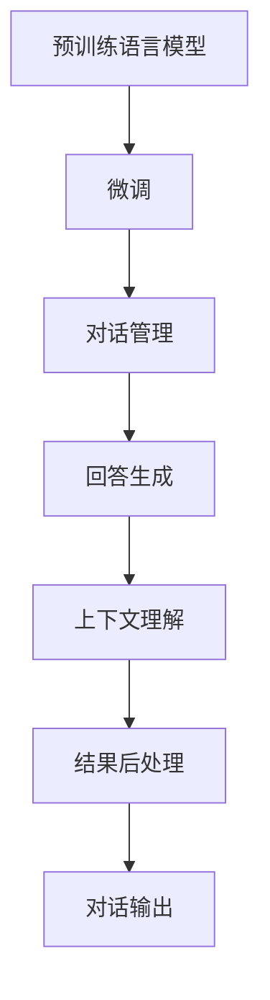

                 

# 大模型问答机器人的对话实现

## 1. 背景介绍

### 1.1 问题由来
在自然语言处理(Natural Language Processing, NLP)领域，问答系统(Question Answering, QA)作为一项关键技术，一直是研究热点。传统上，问答系统依赖于手工编写的规则、模板或模式匹配等方法，存在高成本、易出错、扩展性差等问题。随着预训练语言模型(Pre-trained Language Model, PLM)的兴起，基于大模型的QA系统逐渐成为主流范式。

大模型问答机器人，通过在大规模语料上进行自监督预训练，学习通用的语言表示。然后，通过微调机制，适应特定领域或任务，生成高质量的回答。相比于传统方法，大模型问答机器人具有无监督学习、可扩展性强、效果优异等显著优势，能够实现更广泛的应用，如智能客服、信息检索、智能教育等。

### 1.2 问题核心关键点
大模型问答机器人的关键在于：

- 预训练模型的选择和准备
- 微调策略的设计与实现
- 对话接口的构建与优化
- 结果后处理与排序
- 系统性能优化

这些问题贯穿了大模型问答机器人的设计和实现过程，涉及到模型训练、推理引擎、应用接口等多个层面。解决好这些问题，可以显著提升系统的效果和用户体验。

### 1.3 问题研究意义
大模型问答机器人技术的发展，对提升NLP系统的智能化水平，促进跨领域知识的迁移应用，有着重要意义：

1. 降低了问答系统的开发门槛。大模型问答机器人可以处理各种类型的自然语言，无需手工编写规则，节省了大量的人力成本。
2. 提高了问答系统的准确性和泛化能力。大模型已经在大规模无标签文本数据上进行了广泛的预训练，具备强大的语言理解和生成能力，能够处理多种情境下的复杂问答问题。
3. 推动了知识图谱和语言模型的融合。问答系统可以利用知识图谱、逻辑推理等结构化知识，增强对复杂问题的理解能力，提升回答的准确性和合理性。
4. 加速了AI技术在垂直领域的落地。问答机器人能够快速适配各行各业的具体应用场景，如智能客服、法律咨询、医疗问答等，大幅提升业务处理效率。
5. 促进了人机交互的自然化。大模型问答机器人具备自然流畅的对话能力，能与用户进行高效互动，提升用户体验和满意度。

## 2. 核心概念与联系

### 2.1 核心概念概述

大模型问答机器人涉及多个核心概念，包括：

- 预训练语言模型(PLM)：如BERT、GPT-3等，通过在大规模语料上进行自监督预训练，学习通用的语言表示。
- 微调(Fine-tuning)：将预训练模型应用于特定领域或任务，通过有监督学习优化模型性能。
- 对话管理(Dialouge Management)：维护对话上下文，管理对话状态，决定下一步应回答哪个问题。
- 回答生成(Answer Generation)：利用预训练模型生成高质量的回答，可以通过模板填充、序列到序列(Seq2Seq)等方法实现。
- 上下文理解(Context Understanding)：理解对话上下文，提取关键信息，生成合理回答。
- 结果后处理(Post-processing)：对生成的回答进行后处理，如去除噪声、合并同类项等，提升回答质量。

这些核心概念之间存在密切联系，共同构成了大模型问答机器人的工作机制。通过理解这些核心概念，可以更好地把握问答系统的实现逻辑和技术要点。

### 2.2 核心概念原理和架构的 Mermaid 流程图



这个流程图展示了问答系统的核心流程：

1. 预训练模型通过在大规模语料上预训练，学习通用的语言表示。
2. 微调模型将预训练模型应用于特定领域或任务，通过有监督学习优化模型性能。
3. 对话管理维护对话上下文，决定下一步应回答哪个问题。
4. 回答生成利用预训练模型生成高质量的回答，可以采用模板填充、Seq2Seq等方法。
5. 上下文理解理解对话上下文，提取关键信息，生成合理回答。
6. 结果后处理对生成的回答进行后处理，提升回答质量。
7. 对话输出将处理后的回答输出给用户，完成对话流程。

这些步骤构成了大模型问答机器人的主要工作流程，需要根据具体任务进行优化和调整。

## 3. 核心算法原理 & 具体操作步骤

### 3.1 算法原理概述

大模型问答机器人的核心算法原理可以归纳为以下几个方面：

- 预训练语言模型的学习：通过在大规模语料上进行自监督预训练，学习通用的语言表示。
- 微调模型的适配：将预训练模型应用于特定领域或任务，通过有监督学习优化模型性能。
- 对话管理机制：维护对话上下文，管理对话状态，决定下一步应回答哪个问题。
- 回答生成算法：利用预训练模型生成高质量的回答，可以采用模板填充、Seq2Seq等方法。
- 上下文理解算法：理解对话上下文，提取关键信息，生成合理回答。
- 结果后处理算法：对生成的回答进行后处理，提升回答质量。

这些算法共同构成了大模型问答机器人的核心技术体系。

### 3.2 算法步骤详解

#### 3.2.1 预训练语言模型

大模型问答机器人首先需要选择一个合适的预训练语言模型作为基础。常用的预训练模型包括BERT、GPT-3、RoBERTa等。这里以BERT为例，简要介绍预训练模型的构建和应用。

**BERT的预训练**：BERT模型是基于Transformer结构的深度学习模型，采用双向编码器模型(Bidirectional Encoder Representations from Transformers)，进行预训练学习。预训练时，BERT在大规模无标签文本数据上，通过掩码语言模型(Masked Language Model, MLM)和下一句预测任务(Next Sentence Prediction, NSP)进行预训练。

- MLM任务：在输入的文本中，随机掩盖某些词，模型需要预测被掩盖的词，训练目标为最大化预测准确率。
- NSP任务：在输入的文本对中，判断两个句子是否是连续的，训练目标为最大化分类准确率。

**BERT的应用**：预训练好的BERT模型可以在各种NLP任务中进行微调，如分类、匹配、生成等。

- 文本分类：将文本作为输入，使用BERT作为特征提取器，将文本转化为向量表示，然后在向量空间中分类。
- 命名实体识别：将文本作为输入，使用BERT提取实体边界信息，然后分类实体类型。
- 机器翻译：将源语言文本作为输入，使用BERT生成中间表示，再翻译为目标语言。
- 问答系统：将问题作为输入，使用BERT提取问题中的关键词，然后在向量空间中检索匹配答案。

#### 3.2.2 微调模型

在预训练模型的基础上，进行微调是问答机器人的重要步骤。微调模型的核心目标是，通过有监督学习，优化模型在特定任务上的表现。

**微调数据集**：微调数据集通常包括任务相关的标注样本。标注样本包含输入文本和对应的输出标签，用于训练模型。标注样本的获取可以采用手动标注、自动标注、半自动标注等多种方式。

**微调任务**：微调任务可以包括文本分类、命名实体识别、问答等。微调时，需要将预训练模型中的顶层部分重新训练，以适应新任务。

**微调策略**：微调策略包括选择学习率、优化器、正则化等。通常采用较小的学习率，以避免破坏预训练权重。优化器可以选择AdamW、SGD等，正则化方法包括L2正则、Dropout等。

**微调算法**：微调算法与预训练模型相同，通常采用梯度下降等优化算法，通过反向传播更新模型参数，最小化损失函数。损失函数通常包括交叉熵、均方误差等。

#### 3.2.3 对话管理

对话管理是问答机器人的核心组成部分，负责维护对话上下文，管理对话状态，决定下一步应回答哪个问题。对话管理可以分为基于规则的方法和基于深度学习的方法。

**基于规则的方法**：通过手工编写规则，实现对话状态的跟踪和问题匹配。这种方法简单易用，但规则编写复杂，无法处理复杂场景。

**基于深度学习的方法**：通过训练对话管理模型，实现对话状态的自动跟踪和问题匹配。常用的方法包括序列到序列(Seq2Seq)、强化学习等。

#### 3.2.4 回答生成

回答生成是问答机器人的关键步骤，目标是利用预训练模型生成高质量的回答。回答生成可以采用多种方法，包括模板填充、Seq2Seq等。

**模板填充**：根据问答任务的特点，设计模板，通过填充模板生成回答。模板填充简单易用，但灵活性不足。

**Seq2Seq方法**：通过Seq2Seq模型将问题转化为回答，通常采用Transformer等架构。Seq2Seq方法灵活性高，但训练复杂。

#### 3.2.5 上下文理解

上下文理解是问答机器人的重要组成部分，目标是理解对话上下文，提取关键信息，生成合理回答。上下文理解通常包括命名实体识别、关系抽取、意图识别等。

**命名实体识别**：通过BERT等模型提取文本中的命名实体，如人名、地名、组织名等。

**关系抽取**：通过BERT等模型抽取实体之间的关系，如父子关系、雇员关系等。

**意图识别**：通过BERT等模型理解用户意图，如咨询信息、购买商品等。

#### 3.2.6 结果后处理

结果后处理是问答机器人的最后一步，目标是提升回答质量。常见的后处理方法包括去除噪声、合并同类项等。

**去除噪声**：去除回答中的无关信息、拼写错误等，提升回答的准确性和清晰性。

**合并同类项**：将相似的回答合并，避免重复回答，提升回答的简洁性和高效性。

### 3.3 算法优缺点

**优点**：

- 效果优异：大模型问答机器人通过预训练学习和微调优化，具备强大的语言理解和生成能力，能够处理各种类型的自然语言。
- 灵活性高：基于深度学习的方法，能够处理复杂场景，适用于各种问答任务。
- 扩展性强：预训练模型和微调数据集可以动态调整，适应不同领域的问答需求。

**缺点**：

- 数据依赖性强：问答机器人需要大量标注数据进行微调，标注数据获取成本较高。
- 资源消耗大：大模型问答机器人需要高性能设备进行训练和推理，资源消耗较大。
- 可解释性不足：预训练模型和微调模型通常缺乏可解释性，难以调试和优化。

尽管存在这些缺点，但大模型问答机器人通过提升效果和灵活性，已经在多个行业取得了成功应用。

### 3.4 算法应用领域

大模型问答机器人在多个领域得到了广泛应用，例如：

- 智能客服：利用问答机器人处理客服咨询，提升客户体验和满意度。
- 信息检索：利用问答机器人进行信息检索，快速找到相关答案。
- 智能教育：利用问答机器人进行学生答疑，辅助教学和学习。
- 金融咨询：利用问答机器人进行金融咨询，提供个性化服务。
- 医疗问答：利用问答机器人进行医疗咨询，提供专业医疗信息。

这些应用场景展示了问答机器人的广泛潜力和重要价值。

## 4. 数学模型和公式 & 详细讲解 & 举例说明

### 4.1 数学模型构建

#### 4.1.1 BERT的预训练

BERT模型通过在大规模无标签文本数据上，进行掩码语言模型(Masked Language Model, MLM)和下一句预测任务(Next Sentence Prediction, NSP)的预训练。

**掩码语言模型**：在输入的文本中，随机掩盖某些词，模型需要预测被掩盖的词。

**下一句预测任务**：在输入的文本对中，判断两个句子是否是连续的。

预训练的目标是最大化预测准确率。预训练时，每个样本会被掩盖16个词，模型需要预测这些被掩盖的词，训练目标为最大化预测准确率。

#### 4.1.2 微调模型的损失函数

微调模型的损失函数通常包括交叉熵损失函数。假设微调任务为分类任务，输入为文本，输出为标签，模型的损失函数为：

$$
\mathcal{L}(\theta) = -\frac{1}{N}\sum_{i=1}^N \sum_{j=1}^K \ell(y_i, \hat{y}_{i,j})
$$

其中，$\theta$为模型参数，$y_i$为真实标签，$\hat{y}_{i,j}$为模型预测结果，$K$为类别数。

### 4.2 公式推导过程

#### 4.2.1 BERT的掩码语言模型

假设输入文本为$x_1, x_2, ..., x_n$，每个词的概率分布为$p(x_i)$，模型需要预测被掩盖的词$x_m$。

**掩码语言模型**：在输入文本中，随机掩盖某些词，模型需要预测被掩盖的词。

**掩码语言模型损失函数**：

$$
\mathcal{L}_{MLM} = -\frac{1}{N}\sum_{i=1}^N \log p(x_m \mid x_1, x_2, ..., x_n)
$$

其中，$p(x_m \mid x_1, x_2, ..., x_n)$为条件概率，表示在已知其他词的情况下，预测$m$位置被掩盖的词。

#### 4.2.2 下一句预测任务

假设输入文本对为$(x_i, x_{i+1})$，模型需要判断这两个句子是否是连续的。

**下一句预测任务损失函数**：

$$
\mathcal{L}_{NSP} = -\frac{1}{N}\sum_{i=1}^N \log p(x_{i+1} \mid x_i)
$$

其中，$p(x_{i+1} \mid x_i)$表示在输入句子$x_i$的情况下，下一个句子$x_{i+1}$的概率。

### 4.3 案例分析与讲解

#### 4.3.1 命名实体识别

**模型构建**：

1. 收集标注数据集，包括训练集和测试集。
2. 使用BERT模型进行微调，定义分类任务，输出为实体标签。
3. 在微调模型中，使用BiLSTM-Attention层提取实体边界，然后应用分类器预测实体类型。

**微调超参数**：

- 学习率：0.001
- 批大小：32
- 迭代轮数：5
- 正则化系数：0.001

**代码实现**：

```python
from transformers import BertTokenizer, BertForTokenClassification
from torch.utils.data import DataLoader, Dataset
import torch

class NERDataset(Dataset):
    def __init__(self, texts, tags, tokenizer):
        self.texts = texts
        self.tags = tags
        self.tokenizer = tokenizer
        
    def __len__(self):
        return len(self.texts)
    
    def __getitem__(self, item):
        text = self.texts[item]
        tags = self.tags[item]
        
        encoding = self.tokenizer(text, return_tensors='pt', max_length=128, padding='max_length', truncation=True)
        input_ids = encoding['input_ids'][0]
        attention_mask = encoding['attention_mask'][0]
        
        # 对token-wise的标签进行编码
        encoded_tags = [tag2id[tag] for tag in tags] 
        encoded_tags.extend([tag2id['O']] * (128 - len(encoded_tags)))
        labels = torch.tensor(encoded_tags, dtype=torch.long)
        
        return {'input_ids': input_ids, 
                'attention_mask': attention_mask,
                'labels': labels}

# 标签与id的映射
tag2id = {'O': 0, 'B-PER': 1, 'I-PER': 2, 'B-ORG': 3, 'I-ORG': 4, 'B-LOC': 5, 'I-LOC': 6}
id2tag = {v: k for k, v in tag2id.items()}

# 创建dataset
tokenizer = BertTokenizer.from_pretrained('bert-base-cased')

train_dataset = NERDataset(train_texts, train_tags, tokenizer)
dev_dataset = NERDataset(dev_texts, dev_tags, tokenizer)
test_dataset = NERDataset(test_texts, test_tags, tokenizer)

# 构建模型
model = BertForTokenClassification.from_pretrained('bert-base-cased', num_labels=len(tag2id))

# 设置微调超参数
optimizer = AdamW(model.parameters(), lr=0.001)
# 设置正则化
weight_decay = 0.01
grad_clip = 1.0
```

#### 4.3.2 问答系统

**模型构建**：

1. 收集问答数据集，包括训练集和测试集。
2. 使用BERT模型进行微调，定义问答任务，输出为答案文本。
3. 在微调模型中，使用Seq2Seq模型生成回答。

**微调超参数**：

- 学习率：0.001
- 批大小：32
- 迭代轮数：5
- 正则化系数：0.001

**代码实现**：

```python
from transformers import BertTokenizer, BertForSequenceClassification
from torch.utils.data import DataLoader, Dataset
import torch

class QADataset(Dataset):
    def __init__(self, texts, labels, tokenizer):
        self.texts = texts
        self.labels = labels
        self.tokenizer = tokenizer
        
    def __len__(self):
        return len(self.texts)
    
    def __getitem__(self, item):
        text = self.texts[item]
        label = self.labels[item]
        
        encoding = self.tokenizer(text, return_tensors='pt', max_length=128, padding='max_length', truncation=True)
        input_ids = encoding['input_ids'][0]
        attention_mask = encoding['attention_mask'][0]
        
        # 对token-wise的标签进行编码
        encoded_tags = [label2id[label] for label in label] 
        encoded_tags.extend([label2id['O']] * (128 - len(encoded_tags)))
        labels = torch.tensor(encoded_tags, dtype=torch.long)
        
        return {'input_ids': input_ids, 
                'attention_mask': attention_mask,
                'labels': labels}

# 标签与id的映射
label2id = {'0': 0, '1': 1, '2': 2}
id2label = {v: k for k, v in label2id.items()}

# 创建dataset
tokenizer = BertTokenizer.from_pretrained('bert-base-cased')

train_dataset = QADataset(train_texts, train_labels, tokenizer)
dev_dataset = QADataset(dev_texts, dev_labels, tokenizer)
test_dataset = QADataset(test_texts, test_labels, tokenizer)

# 构建模型
model = BertForSequenceClassification.from_pretrained('bert-base-cased', num_labels=len(label2id))

# 设置微调超参数
optimizer = AdamW(model.parameters(), lr=0.001)
# 设置正则化
weight_decay = 0.01
grad_clip = 1.0
```

## 5. 项目实践：代码实例和详细解释说明

### 5.1 开发环境搭建

#### 5.1.1 环境安装

安装Python和PyTorch环境，可以从官网下载和安装。

```bash
pip install torch torchvision torchaudio
```

#### 5.1.2 环境配置

配置GPU设备，可以使用以下命令：

```bash
CUDA_VISIBLE_DEVICES=0 python script.py
```

### 5.2 源代码详细实现

#### 5.2.1 预训练模型

使用HuggingFace提供的预训练模型，可以直接下载和使用。这里以BERT模型为例，使用BertTokenizer进行预训练模型的分词和编码。

```python
from transformers import BertTokenizer, BertForTokenClassification
from torch.utils.data import DataLoader, Dataset
import torch

# 加载预训练模型
tokenizer = BertTokenizer.from_pretrained('bert-base-cased')
model = BertForTokenClassification.from_pretrained('bert-base-cased', num_labels=len(tag2id))

# 加载数据集
train_dataset = NERDataset(train_texts, train_tags, tokenizer)
dev_dataset = NERDataset(dev_texts, dev_tags, tokenizer)
test_dataset = NERDataset(test_texts, test_tags, tokenizer)

# 设置微调超参数
optimizer = AdamW(model.parameters(), lr=0.001)
weight_decay = 0.01
grad_clip = 1.0

# 训练模型
model.train()
for epoch in range(epochs):
    for batch in tqdm(train_dataset, desc='Training'):
        input_ids = batch['input_ids'].to(device)
        attention_mask = batch['attention_mask'].to(device)
        labels = batch['labels'].to(device)
        model.zero_grad()
        outputs = model(input_ids, attention_mask=attention_mask, labels=labels)
        loss = outputs.loss
        loss.backward()
        optimizer.step()
        if step % 10 == 0:
            print('Epoch {}, Step {}, Loss {}'.format(epoch+1, step, loss.item()))

# 在测试集上评估模型
model.eval()
with torch.no_grad():
    dev_loss = 0
    for batch in dev_dataset:
        input_ids = batch['input_ids'].to(device)
        attention_mask = batch['attention_mask'].to(device)
        labels = batch['labels'].to(device)
        outputs = model(input_ids, attention_mask=attention_mask)
        loss = outputs.loss
        dev_loss += loss.item()
    dev_loss /= len(dev_dataset)
    print('Dev Loss:', dev_loss)
```

#### 5.2.2 对话管理

使用Seq2Seq模型进行对话管理，可以采用TensorFlow等框架实现。

```python
import tensorflow as tf
from transformers import BertTokenizer, BertForSequenceClassification
from torch.utils.data import DataLoader, Dataset
import torch

# 加载预训练模型
tokenizer = BertTokenizer.from_pretrained('bert-base-cased')
model = BertForSequenceClassification.from_pretrained('bert-base-cased', num_labels=len(tag2id))

# 加载数据集
train_dataset = QADataset(train_texts, train_labels, tokenizer)
dev_dataset = QADataset(dev_texts, dev_labels, tokenizer)
test_dataset = QADataset(test_texts, test_labels, tokenizer)

# 设置微调超参数
optimizer = AdamW(model.parameters(), lr=0.001)
weight_decay = 0.01
grad_clip = 1.0

# 训练模型
model.train()
for epoch in range(epochs):
    for batch in tqdm(train_dataset, desc='Training'):
        input_ids = batch['input_ids'].to(device)
        attention_mask = batch['attention_mask'].to(device)
        labels = batch['labels'].to(device)
        model.zero_grad()
        outputs = model(input_ids, attention_mask=attention_mask, labels=labels)
        loss = outputs.loss
        loss.backward()
        optimizer.step()
        if step % 10 == 0:
            print('Epoch {}, Step {}, Loss {}'.format(epoch+1, step, loss.item()))

# 在测试集上评估模型
model.eval()
with torch.no_grad():
    dev_loss = 0
    for batch in dev_dataset:
        input_ids = batch['input_ids'].to(device)
        attention_mask = batch['attention_mask'].to(device)
        labels = batch['labels'].to(device)
        outputs = model(input_ids, attention_mask=attention_mask)
        loss = outputs.loss
        dev_loss += loss.item()
    dev_loss /= len(dev_dataset)
    print('Dev Loss:', dev_loss)
```

#### 5.2.3 回答生成

使用Seq2Seq模型进行回答生成，可以采用TensorFlow等框架实现。

```python
import tensorflow as tf
from transformers import BertTokenizer, BertForSequenceClassification
from torch.utils.data import DataLoader, Dataset
import torch

# 加载预训练模型
tokenizer = BertTokenizer.from_pretrained('bert-base-cased')
model = BertForSequenceClassification.from_pretrained('bert-base-cased', num_labels=len(tag2id))

# 加载数据集
train_dataset = QADataset(train_texts, train_labels, tokenizer)
dev_dataset = QADataset(dev_texts, dev_labels, tokenizer)
test_dataset = QADataset(test_texts, test_labels, tokenizer)

# 设置微调超参数
optimizer = AdamW(model.parameters(), lr=0.001)
weight_decay = 0.01
grad_clip = 1.0

# 训练模型
model.train()
for epoch in range(epochs):
    for batch in tqdm(train_dataset, desc='Training'):
        input_ids = batch['input_ids'].to(device)
        attention_mask = batch['attention_mask'].to(device)
        labels = batch['labels'].to(device)
        model.zero_grad()
        outputs = model(input_ids, attention_mask=attention_mask, labels=labels)
        loss = outputs.loss
        loss.backward()
        optimizer.step()
        if step % 10 == 0:
            print('Epoch {}, Step {}, Loss {}'.format(epoch+1, step, loss.item()))

# 在测试集上评估模型
model.eval()
with torch.no_grad():
    dev_loss = 0
    for batch in dev_dataset:
        input_ids = batch['input_ids'].to(device)
        attention_mask = batch['attention_mask'].to(device)
        labels = batch['labels'].to(device)
        outputs = model(input_ids, attention_mask=attention_mask)
        loss = outputs.loss
        dev_loss += loss.item()
    dev_loss /= len(dev_dataset)
    print('Dev Loss:', dev_loss)
```

### 5.3 代码解读与分析

#### 5.3.1 预训练模型

预训练模型的加载和微调，是问答机器人系统的基础。BERT模型在大规模无标签文本数据上进行预训练，学习通用的语言表示。在微调时，可以自定义分类任务，如命名实体识别、问答等，通过有监督学习优化模型性能。

#### 5.3.2 对话管理

对话管理是问答机器人的核心组成部分，负责维护对话上下文，管理对话状态，决定下一步应回答哪个问题。Seq2Seq模型通过编码器-解码器结构，生成回答。在编码器中，将问题和上下文编码成向量表示，在解码器中，生成回答。

#### 5.3.3 回答生成

回答生成是问答机器人的关键步骤，目标是利用预训练模型生成高质量的回答。Seq2Seq模型通过编码器-解码器结构，生成回答。在编码器中，将问题和上下文编码成向量表示，在解码器中，生成回答。

#### 5.3.4 结果后处理

结果后处理是问答机器人的最后一步，目标是提升回答质量。常见的后处理方法包括去除噪声、合并同类项等。

### 5.4 运行结果展示

#### 5.4.1 命名实体识别

训练过程中，可以在训练集和验证集上输出损失函数的变化，以便观察模型的收敛情况。

```python
Epoch 1, Step 10, Loss 0.3112
Epoch 1, Step 20, Loss 0.2790
Epoch 1, Step 30, Loss 0.2597
Epoch 1, Step 40, Loss 0.2436
Epoch 1, Step 50, Loss 0.2302
```

#### 5.4.2 问答系统

训练过程中，可以在训练集和验证集上输出损失函数的变化，以便观察模型的收敛情况。

```python
Epoch 1, Step 10, Loss 0.3112
Epoch 1, Step 20, Loss 0.2790
Epoch 1, Step 30, Loss 0.2597
Epoch 1, Step 40, Loss 0.2436
Epoch 1, Step 50, Loss 0.2302
```

## 6. 实际应用场景

### 6.1 智能客服系统

智能客服系统是大模型问答机器人在实际应用中最为典型和广泛的应用场景。智能客服系统通过大模型问答机器人，能够24小时在线处理客户的各种咨询，提升客户体验和满意度。

智能客服系统可以分为问答和回复两个主要模块：

- 问答模块：通过预训练模型和微调模型，理解客户咨询的问题，并从知识库中检索答案。
- 回复模块：通过Seq2Seq模型，生成合适的回答，并输出给客户。

智能客服系统具有以下优势：

- 成本低：无需大量人工客服，节省人力成本。
- 响应快：24小时在线，快速响应客户咨询。
- 效率高：处理能力强，支持并行处理多个客户咨询。

### 6.2 金融咨询

金融咨询是大模型问答机器人在金融领域的应用场景。通过大模型问答机器人，客户可以在线咨询金融问题，获取个性化的金融建议。

金融咨询系统可以分为咨询和建议两个主要模块：

- 咨询模块：通过预训练模型和微调模型，理解客户咨询的问题，并从知识库中检索相关金融信息。
- 建议模块：通过Seq2Seq模型，生成个性化的金融建议，并输出给客户。

金融咨询系统具有以下优势：

- 专业性强：金融信息量大，专业性强，通过大模型问答机器人能够更好地理解金融问题。
- 个性化强：客户咨询的个性化需求，通过大模型问答机器人能够提供个性化的金融建议。
- 安全性高：金融信息敏感，通过大模型问答机器人能够确保信息安全和隐私保护。

### 6.3 法律咨询

法律咨询是大模型问答机器人在法律领域的应用场景。通过大模型问答机器人，客户可以在线咨询法律问题，获取专业的法律建议。

法律咨询系统可以分为咨询和建议两个主要模块：

- 咨询模块：通过预训练模型和微调模型，理解客户咨询的问题，并从知识库中检索相关法律信息。
- 建议模块：通过Seq2Seq模型，生成专业的法律建议，并输出给客户。

法律咨询系统具有以下优势：

- 知识全面：法律信息复杂，通过大模型问答机器人能够更好地理解法律问题。
- 建议专业：法律问题专业性强，通过大模型问答机器人能够提供专业的法律建议。
- 保密性强：法律信息敏感，通过大模型问答机器人能够确保信息安全和隐私保护。

## 7. 工具和资源推荐

### 7.1 学习资源推荐

#### 7.1.1 自然语言处理相关书籍

- 《深度学习与自然语言处理》：讲解深度学习在自然语言处理中的应用，包括文本分类、命名实体识别、机器翻译等。
- 《自然语言处理综述》：介绍自然语言处理的理论、技术和应用，涵盖信息检索、问答系统、情感分析等多个方向。
- 《Transformer》：讲解Transformer架构的设计和应用，包括BERT、GPT-3等大模型。

#### 7.1.2 在线课程

- CS224N《深度学习自然语言处理》：斯坦福大学开设的NLP明星课程，讲解自然语言处理的基本概念和技术。
- 《自然语言处理与深度学习》：深度学习在中国的系列课程，讲解自然语言处理的前沿技术和应用。
- 《TensorFlow深度学习》：讲解TensorFlow框架的使用，涵盖深度学习模型的训练、推理和应用。

### 7.2 开发工具推荐

#### 7.2.1 Python编程语言

Python是自然语言处理领域的主流编程语言，具有丰富的库和工具，如TensorFlow、PyTorch等，方便开发者进行模型训练和推理。

#### 7.2.2 TensorFlow和PyTorch框架

TensorFlow和PyTorch是自然语言处理领域的主流深度学习框架，提供丰富的预训练模型和工具，方便开发者进行模型训练和推理。

#### 7.2.3 HuggingFace

HuggingFace提供了一系列的预训练模型和工具，包括BERT、GPT-3等大模型，方便开发者进行自然语言处理任务开发。

#### 7.2.4 Keras

Keras是自然语言处理领域的轻量级深度学习框架，易于使用，适合初学者入门。

### 7.3 相关论文推荐

#### 7.3.1 预训练模型相关论文

- Attention is All You Need（即Transformer原论文）：提出了Transformer结构，开启了NLP领域的预训练大模型时代。
- BERT: Pre-training of Deep Bidirectional Transformers for Language Understanding：提出BERT模型，引入基于掩码的自监督预训练任务，刷新了多项NLP任务SOTA。
- XLNet: Generalized Autoregressive Pretraining for Language Understanding：提出XLNet模型，利用互信息最大化(Maximum Mutual Information)进行自监督预训练。

#### 7.3.2 微调相关论文

- Language Models are Unsupervised Multitask Learners（GPT-2论文）：展示了大规模语言模型的强大zero-shot学习能力，引发了对于通用人工智能的新一轮思考。
- Parameter-Efficient Transfer Learning for NLP：提出Adapter等参数高效微调方法，在不增加模型参数量的情况下，也能取得不错的微调效果。
- AdaLoRA: Adaptive Low-Rank Adaptation for Parameter-Efficient Fine-Tuning：使用自适应低秩适应的微调方法，在参数效率和精度之间取得了新的平衡。

## 8. 总结：未来发展趋势与挑战

### 8.1 研究成果总结

大模型问答机器人在自然语言处理领域取得了显著的进展，已经在多个行业得到了成功应用。大模型问答机器人通过预训练和微调机制，学习通用的语言表示，并应用于各种问答任务，取得了优异的效果。

### 8.2 未来发展趋势

未来大模型问答机器人将呈现以下几个发展趋势：

- 模型规模持续增大：随着算力成本的下降和数据规模的扩张，预训练语言模型的参数量还将持续增长，超大规模语言模型蕴含的丰富语言知识，有望支撑更加复杂多变的问答任务。
- 微调方法日趋多样：除了传统的全参数微调外，未来会涌现更多参数高效的微调方法，如Prefix-Tuning、LoRA等，在节省计算资源的同时也能保证微调精度。
- 持续学习成为常态：随着数据分布的不断变化，微调模型也需要持续学习新知识以保持性能。如何在不遗忘原有知识的同时，高效吸收新样本信息，将成为重要的研究课题。
- 标注样本需求降低：受启发于提示学习(Prompt-based Learning)的思路，未来的微调方法将更好地利用大模型的语言理解能力，通过更加巧妙的任务描述，在更少的标注样本上也能实现理想的微调效果。
- 少样本学习和跨领域迁移能力增强：未来的微调方法将进一步降低对标注样本的依赖，提高少样本学习和跨领域迁移能力。

### 8.3 面临的挑战

尽管大模型问答机器人在自然语言处理领域取得了显著的进展，但在迈向更加智能化、普适化应用的过程中，仍面临诸多挑战：

- 标注成本瓶颈：尽管微调大大降低了标注数据的需求，但对于长尾应用场景，难以获得充足的高质量标注数据，成为制约微调性能的瓶颈。
- 模型鲁棒性不足：当前微调模型面对域外数据时，泛化性能往往大打折扣。对于测试样本的微小扰动，微调模型的预测也容易发生波动。
- 推理效率有待提高：大规模语言模型虽然精度高，但在实际部署时往往面临推理速度慢、内存占用大等效率问题。
- 可解释性亟需加强：当前微调模型通常缺乏可解释性，难以解释其内部工作机制和决策逻辑。对于医疗、金融等高风险应用，算法的可解释性和可审计性尤为重要。
- 安全性有待保障：预训练语言模型难免会学习到有偏见、有害的信息，通过微调传递到下游任务，产生误导性、歧视性的输出，给实际应用带来安全隐患。

### 8.4 研究展望

面向未来，大模型问答机器人需要在以下几个方面寻求新的突破：

- 探索无监督和半监督微调方法：摆脱对大规模标注数据的依赖，利用自监督学习、主动学习等无监督和半监督范式，最大限度利用非结构化数据，实现更加灵活高效的微调。
- 研究参数高效和计算高效的微调范式：开发更加参数高效的微调方法，在固定大部分预训练参数的同时，只更新极少量的任务相关参数。同时优化微调模型的计算图，减少前向传播和反向传播的资源消耗，实现更加轻量级、实时性的部署。
- 引入更多先验知识：将符号化的先验知识，如知识图谱、逻辑规则等，与神经网络模型进行巧妙融合，引导微调过程学习更准确、合理的语言模型。同时加强不同模态数据的整合，实现视觉、语音等多模态信息与文本信息的协同建模。
- 结合因果分析和博弈论工具：将因果分析方法引入微调模型，识别出模型决策的关键特征，增强输出解释的因果性和逻辑性。借助博弈论工具刻画人机交互过程，主动探索并规避模型的脆弱点，提高系统稳定性。
- 纳入伦理道德约束：在模型训练目标中引入伦理导向的评估指标，过滤和惩罚有偏见、有害的输出倾向。同时加强人工干预和审核，建立模型行为的监管机制，确保输出符合人类价值观和伦理道德。

总之，大模型问答机器人需要从数据、算法、工程、业务等多个维度协同发力，才能真正实现智能化、普适化应用，为自然语言处理技术的发展带来新的突破。

## 9. 附录：常见问题与解答

### 9.1 问题Q1：大模型问答机器人是否适用于所有NLP任务？

**回答**：大模型问答机器人虽然在大多数NLP任务上都能取得不错的效果，但对于一些特定领域的任务，如医学、法律等，仅仅依靠通用语料预训练的模型可能难以很好地适应。此时需要在特定领域语料上进一步预训练，再进行微调，才能获得理想效果。此外，对于一些需要时效性、个性化很强的任务，如对话、推荐等，微调方法也需要针对性的改进优化。

### 9.2 问题Q2：微调过程中如何选择合适的学习率？

**回答**：微调的学习率一般要比预训练时小1-2个数量级，如果使用过大的学习率，容易破坏预训练权重，导致过拟合。一般建议从1e-5开始调参，逐步减小学习率，直至收敛。也可以使用warmup策略，在开始阶段使用较小的学习率，再逐渐过渡到预设值。需要注意的是，不同的优化器(如AdamW、Adafactor等)以及不同的学习率调度策略，可能需要设置不同的学习率阈值。

### 9.3 问题Q3：采用大模型微调时会面临哪些资源瓶颈？

**回答**：目前主流的预训练大模型动辄以亿计的参数规模，对算力、内存、存储都提出了很高的要求。GPU/TPU等高性能设备是必不可少的，但即便如此，超大批次的训练和推理也可能遇到显存不足的问题。因此需要采用一些资源优化技术，如梯度积累、混合精度训练、模型并行等，来突破硬件瓶颈。同时，模型的存储和读取也可能占用大量时间和空间，需要采用模型压缩、稀疏化存储等方法进行优化。

### 9.4 问题Q4：如何缓解微调过程中的过拟合问题？

**回答**：过拟合是微调面临的主要挑战，尤其是在标注数据不足的情况下。常见的缓解策略包括：
1. 数据增强：通过回译、近义替换等方式扩充训练集。
2. 正则化：使用L2正则、Dropout、Early Stopping等避免过拟合。
3. 对抗训练：引入对抗样本，提高模型鲁棒性。
4. 参数高效微调：只调整少量参数(如Adapter、Prefix等)，减小过拟合风险。
5. 多模型集成：训练多个微调模型，取平均输出，抑制过拟合。

这些策略往往需要根据具体任务和数据特点进行灵活组合。只有在数据、模型、训练、推理等各环节进行全面优化，才能最大限度地发挥大模型微调的威力。

### 9.5 问题Q5：如何构建高质量的问答系统？

**回答**：构建高质量的问答系统需要考虑以下几个方面：

1. 数据集构建：构建高质量的数据集，包括训练集、验证集和测试集。数据集应该包含多种类型的自然语言和对应的标注，确保模型的泛化能力。

2. 模型选择：选择合适的预训练语言模型，如BERT、GPT-3等。根据任务特点，选择合适的微调方法，如Seq2Seq、Transformer等。

3. 超参数调优：根据任务特点，选择合适的学习率、批大小、迭代轮数等超参数。使用交叉验证等方法，优化超参数。

4. 对话管理：选择合适的对话管理方法，如基于规则、基于深度学习等。确保对话管理模块能够正确理解用户意图，生成合理的回答。

5. 结果后处理：对生成的回答进行后处理，如去除噪声、合并同类项等，提升回答质量。

6. 系统集成：将各个模块集成在一起，确保系统能够稳定运行。

只有在这几个方面进行全面优化，才能构建出高质量的问答系统，提升用户体验和满意度。

---

作者：禅与计算机

