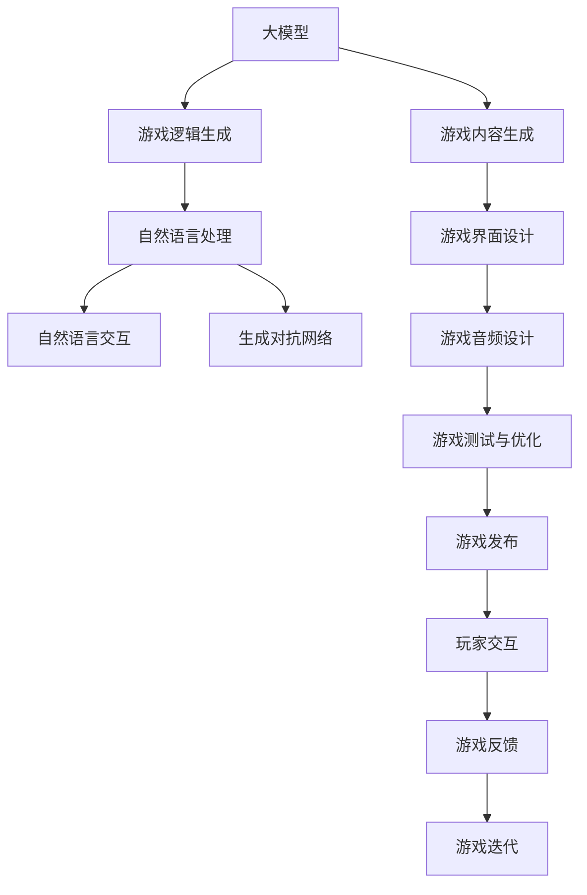

                 

# 大模型驱动的多人在线游戏

## 1. 背景介绍

在现代互联网和虚拟现实技术的推动下，多人在线游戏（MOG，Multiplayer Online Games）已经成为全球最受欢迎的游戏类型之一。这些游戏通过网络将来自不同地域、不同背景的玩家聚集在一起，共同参与虚拟世界中的各项活动，如战斗、探险、建设、交易等。

然而，传统的多人在线游戏开发需要耗费巨大的人力和时间成本，不仅包括游戏逻辑的设计、代码的编写、游戏的测试和维护，还需要大量的艺术设计和音效制作。开发成本高昂，更新周期长，限制了小型团队和独立游戏制作人的创意实现。

大模型技术的发展，尤其是预训练语言模型（Pre-trained Language Models，PLMs），为MOG的开发带来了革命性的变革。通过大模型技术，开发者可以大幅降低游戏开发成本，加速创意实现，同时提高游戏的智能性和互动性。本文将介绍如何利用大模型技术驱动多人在线游戏的开发，包括技术原理、操作步骤、实际应用、未来展望等内容。

## 2. 核心概念与联系

### 2.1 核心概念概述

在本节中，我们将介绍与大模型驱动的MOG开发相关的核心概念及其相互联系。

- **大模型**：基于深度学习的大规模预训练模型，如GPT、BERT、RoBERTa等。这些模型通过大规模无标签文本数据进行预训练，学习到通用的语言表示和知识。
- **游戏逻辑生成**：利用大模型技术自动生成游戏的规则、任务、故事线等内容，减少游戏开发中的文本编写和逻辑设计工作。
- **自然语言处理（NLP）**：利用大模型进行文本生成、对话系统、情感分析等NLP任务，提升游戏的智能交互和情感体验。
- **自然语言交互**：通过NLP技术实现玩家与游戏世界的自然语言交互，如文本驱动的对话系统、智能客服等。
- **生成对抗网络（GANs）**：结合大模型生成技术和GANs生成逼真图像和声音，为游戏提供高质量的视觉和听觉体验。

这些概念通过大模型技术紧密联系在一起，共同构成MOG开发的强大引擎。

### 2.2 核心概念原理和架构的 Mermaid 流程图

以下是一个简化的Mermaid流程图，展示了这些核心概念之间的逻辑关系：



这个流程图展示了从大模型的预训练到MOG开发的各个环节：大模型生成游戏逻辑、自然语言处理提供智能交互、GANs生成游戏内容等。

## 3. 核心算法原理 & 具体操作步骤

### 3.1 算法原理概述

利用大模型驱动的MOG开发，本质上是通过自然语言处理和大模型生成技术，将游戏中的文本内容自动生成和优化，减少人工干预，提高游戏的智能性和互动性。具体流程如下：

1. **预训练大模型的选择**：根据游戏需求选择合适的预训练大模型，如GPT、BERT等。
2. **游戏内容生成**：利用大模型生成游戏的任务描述、角色对话、故事线等内容，生成初步的游戏逻辑。
3. **自然语言处理**：对生成的文本进行情感分析、语义理解、对话生成等处理，提升文本的质量和交互性。
4. **游戏内容优化**：利用大模型进行文本编辑、语义优化、情感调整等，进一步优化生成的游戏内容。
5. **生成对抗网络**：利用GANs生成高质量的图像和声音，为游戏提供逼真的视觉和听觉体验。

### 3.2 算法步骤详解

以下是对大模型驱动的MOG开发操作步骤的详细介绍：

**Step 1: 数据预处理与标注**

- 收集游戏相关的文本数据，如任务描述、对话记录、故事线等。
- 对文本进行清洗、分词、标注等预处理。
- 为每个文本数据添加标签，如情感标签、角色标签、任务难度标签等。

**Step 2: 大模型选择与微调**

- 根据游戏需求选择合适的预训练大模型，如GPT-3、BERT等。
- 对大模型进行微调，使其能够生成符合游戏需求的文本内容。
- 使用验证集对模型进行评估和调优，确保模型的输出质量和准确性。

**Step 3: 文本生成与编辑**

- 利用微调后的大模型生成游戏的任务描述、对话记录、故事线等内容。
- 对生成的文本进行语义分析、情感分析等处理，优化文本质量。
- 使用自然语言处理技术进行文本编辑和风格调整，提升文本的可读性和吸引力。

**Step 4: 生成对抗网络（GANs）生成内容**

- 利用GANs生成逼真的游戏图像、角色模型等。
- 对生成的图像进行优化和调整，确保视觉体验的一致性和高质量。
- 利用GANs生成高质量的游戏音频，如环境音效、角色配音等。

**Step 5: 游戏内容整合与测试**

- 将生成的文本和图像内容整合到游戏中，进行功能测试和用户体验测试。
- 根据测试结果进行进一步优化和调整，确保游戏内容的质量和可用性。
- 完成游戏的发布和部署，进行玩家的互动测试，收集反馈进行迭代优化。

### 3.3 算法优缺点

利用大模型驱动的MOG开发具有以下优点：

- **降低开发成本**：大幅减少人工编写文本和设计游戏逻辑的工作量，加速创意实现。
- **提高智能性和互动性**：通过自然语言处理和大模型生成技术，提升游戏的智能交互和情感体验。
- **优化游戏内容**：利用大模型的语义优化和情感调整功能，提升游戏的文本质量和用户满意度。

同时，该方法也存在一些局限性：

- **数据需求高**：游戏开发需要大量的游戏相关文本数据，收集和标注工作量大。
- **模型依赖强**：游戏开发高度依赖预训练大模型的质量和性能，对大模型的选择和微调要求较高。
- **输出质量不稳定**：大模型生成的内容质量受数据质量和模型性能影响，需要额外的编辑和优化工作。
- **用户体验参差不齐**：大模型生成的图像和音频质量可能存在差异，影响游戏整体体验。

尽管存在这些局限性，但大模型驱动的MOG开发方法已经在游戏开发中得到了广泛应用，并展现出巨大的潜力。

### 3.4 算法应用领域

大模型驱动的MOG开发方法在多个游戏领域得到了广泛应用，包括但不限于：

- **角色扮演游戏（RPG）**：自动生成任务描述、角色对话、故事线等内容，提升游戏的沉浸感和互动性。
- **策略游戏（SLG）**：生成游戏的任务描述、战役脚本等，减少游戏的开发时间和成本。
- **射击游戏（FPS）**：生成游戏地图、道具描述等，提升游戏的可玩性和娱乐性。
- **模拟经营游戏（SIM）**：生成游戏任务、活动描述等，丰富游戏的玩法和体验。

此外，大模型技术还被应用于游戏内容的生成和优化、游戏玩家交互的智能对话系统、游戏界面和音效设计等多个方面，为MOG开发提供了新的思路和可能性。

## 4. 数学模型和公式 & 详细讲解 & 举例说明

### 4.1 数学模型构建

在MOG开发中，大模型的主要作用是通过文本生成和编辑，生成和优化游戏的内容。以任务描述生成为例，我们可以构建一个基于语言模型的生成模型，用数学模型来描述这一过程。

设游戏任务描述为 $T$，大模型的参数为 $\theta$，文本生成模型的目标是最小化如下损失函数：

$$
\min_{\theta} \mathcal{L}(T, P_\theta)
$$

其中 $P_\theta$ 为大模型生成的文本概率分布，$\mathcal{L}$ 为损失函数，可以是交叉熵损失或生成对数似然损失。

### 4.2 公式推导过程

以文本生成模型为例，我们采用语言模型的自回归生成方式，即每次生成一个词时，根据前一个词的生成概率分布 $P(x_t|x_{<t})$，计算下一个词 $x_t$ 的概率。利用大模型生成的文本概率分布 $P_\theta$ 和任务描述 $T$ 的交叉熵损失函数为：

$$
\mathcal{L}(T, P_\theta) = -\sum_{t=1}^{N} \log P_\theta(x_t|x_{<t})
$$

其中 $N$ 为文本长度，$x_{<t}$ 表示前 $t-1$ 个词。

### 4.3 案例分析与讲解

假设我们有一个角色扮演游戏，需要自动生成任务描述。我们可以使用GPT模型作为文本生成模型，通过微调使其能够生成符合游戏需求的任务描述。以下是具体的微调步骤：

1. **数据预处理**：收集游戏中的任务描述，进行清洗、分词、标注等预处理。
2. **模型选择**：选择GPT模型作为文本生成模型，并根据游戏需求对其进行微调。
3. **文本生成**：使用微调后的GPT模型生成游戏的任务描述，例如：“你是一名勇敢的骑士，需要穿越迷宫，拯救被困的公主。”
4. **模型评估**：使用验证集对生成的任务描述进行评估，确保其符合游戏需求。
5. **迭代优化**：根据评估结果，对模型进行进一步的微调，提高生成的文本质量。

## 5. 项目实践：代码实例和详细解释说明

### 5.1 开发环境搭建

在进行MOG开发之前，我们需要准备好开发环境。以下是使用Python进行PyTorch开发的环境配置流程：

1. 安装Anaconda：从官网下载并安装Anaconda，用于创建独立的Python环境。

2. 创建并激活虚拟环境：
```bash
conda create -n mog-env python=3.8 
conda activate mog-env
```

3. 安装PyTorch：根据CUDA版本，从官网获取对应的安装命令。例如：
```bash
conda install pytorch torchvision torchaudio cudatoolkit=11.1 -c pytorch -c conda-forge
```

4. 安装相关库：
```bash
pip install transformers matplotlib scikit-learn numpy
```

5. 安装游戏引擎：
```bash
pip install pygame
```

完成上述步骤后，即可在`mog-env`环境中开始MOG开发实践。

### 5.2 源代码详细实现

这里我们以角色扮演游戏（RPG）的文本生成为例，给出使用Transformers库对GPT模型进行微调的PyTorch代码实现。

首先，定义任务描述的数据处理函数：

```python
from transformers import GPT2Tokenizer, GPT2LMHeadModel

def generate_task_desc(model, tokenizer, max_length=128):
    task_desc = "你是一名勇敢的骑士，需要穿越迷宫，拯救被困的公主。"
    input_ids = tokenizer(task_desc, max_length=max_length, return_tensors='pt')['input_ids']
    output = model.generate(input_ids, max_length=10)
    return tokenizer.decode(output[0], skip_special_tokens=True)
```

然后，定义微调函数：

```python
from transformers import AdamW
from torch.utils.data import Dataset, DataLoader

class RPGDataset(Dataset):
    def __init__(self, texts, tokenizer, max_length=128):
        self.texts = texts
        self.tokenizer = tokenizer
        self.max_length = max_length
        
    def __len__(self):
        return len(self.texts)
    
    def __getitem__(self, item):
        text = self.texts[item]
        encoding = self.tokenizer(text, max_length=self.max_length, padding='max_length', truncation=True)
        input_ids = encoding['input_ids']
        return {'input_ids': input_ids}

# 加载预训练模型和tokenizer
model = GPT2LMHeadModel.from_pretrained('gpt2')
tokenizer = GPT2Tokenizer.from_pretrained('gpt2')

# 微调设置
optimizer = AdamW(model.parameters(), lr=2e-5)
epochs = 5
batch_size = 8

# 加载数据集
train_dataset = RPGDataset(train_texts, tokenizer, max_length=128)
dev_dataset = RPGDataset(dev_texts, tokenizer, max_length=128)
test_dataset = RPGDataset(test_texts, tokenizer, max_length=128)

# 训练过程
model.train()
for epoch in range(epochs):
    train_loader = DataLoader(train_dataset, batch_size=batch_size, shuffle=True)
    for batch in train_loader:
        input_ids = batch['input_ids'].to(device)
        outputs = model(input_ids, labels=input_ids)
        loss = outputs.loss
        optimizer.zero_grad()
        loss.backward()
        optimizer.step()

# 模型评估和测试
model.eval()
dev_loader = DataLoader(dev_dataset, batch_size=batch_size)
test_loader = DataLoader(test_dataset, batch_size=batch_size)

for data in dev_loader:
    input_ids = data['input_ids'].to(device)
    outputs = model(input_ids)
    loss = outputs.loss
    print(loss.item())

for data in test_loader:
    input_ids = data['input_ids'].to(device)
    outputs = model(input_ids)
    print(tokenizer.decode(outputs[0]))
```

在上述代码中，我们定义了一个简单的RPG任务描述生成流程，使用GPT-2模型进行微调，并在训练和测试时输出损失和生成的文本描述。

### 5.3 代码解读与分析

让我们再详细解读一下关键代码的实现细节：

**RPGDataset类**：
- `__init__`方法：初始化文本、分词器等关键组件。
- `__len__`方法：返回数据集的样本数量。
- `__getitem__`方法：对单个样本进行处理，将文本输入编码为token ids。

**微调函数**：
- 使用AdamW优化器进行模型训练。
- 在训练过程中，计算loss并进行反向传播和参数更新。
- 在测试过程中，评估模型的性能，并输出生成的文本描述。

**训练流程**：
- 定义总的epoch数和batch size，开始循环迭代
- 每个epoch内，在训练集上训练，输出平均loss
- 在验证集上评估，输出loss
- 所有epoch结束后，在测试集上评估，输出生成的文本描述

可以看到，PyTorch配合Transformers库使得MOG文本生成任务的微调代码实现变得简洁高效。开发者可以将更多精力放在游戏逻辑、用户交互等高层逻辑上，而不必过多关注底层的实现细节。

当然，工业级的系统实现还需考虑更多因素，如模型的保存和部署、超参数的自动搜索、更灵活的任务适配层等。但核心的微调范式基本与此类似。

## 6. 实际应用场景

### 6.1 智能客服系统

利用大模型技术驱动的多人在线游戏，可以广泛应用于智能客服系统的构建。传统客服往往需要配备大量人力，高峰期响应缓慢，且一致性和专业性难以保证。而使用大模型技术生成的智能客服机器人，可以7x24小时不间断服务，快速响应客户咨询，用自然流畅的语言解答各类常见问题。

在技术实现上，可以收集企业内部的历史客服对话记录，将问题和最佳答复构建成监督数据，在此基础上对预训练大模型进行微调。微调后的智能客服机器人能够自动理解用户意图，匹配最合适的答案模板进行回复。对于客户提出的新问题，还可以接入检索系统实时搜索相关内容，动态组织生成回答。如此构建的智能客服系统，能大幅提升客户咨询体验和问题解决效率。

### 6.2 金融舆情监测

金融机构需要实时监测市场舆论动向，以便及时应对负面信息传播，规避金融风险。传统的人工监测方式成本高、效率低，难以应对网络时代海量信息爆发的挑战。利用大模型技术驱动的文本生成和分析能力，为金融舆情监测提供了新的解决方案。

具体而言，可以收集金融领域相关的新闻、报道、评论等文本数据，并对其进行主题标注和情感标注。在此基础上对预训练大模型进行微调，使其能够自动判断文本属于何种主题，情感倾向是正面、中性还是负面。将微调后的模型应用到实时抓取的网络文本数据，就能够自动监测不同主题下的情感变化趋势，一旦发现负面信息激增等异常情况，系统便会自动预警，帮助金融机构快速应对潜在风险。

### 6.3 个性化推荐系统

当前的推荐系统往往只依赖用户的历史行为数据进行物品推荐，无法深入理解用户的真实兴趣偏好。利用大模型技术驱动的文本生成和自然语言处理能力，个性化推荐系统可以更好地挖掘用户行为背后的语义信息，从而提供更精准、多样的推荐内容。

在实践中，可以收集用户浏览、点击、评论、分享等行为数据，提取和用户交互的物品标题、描述、标签等文本内容。将文本内容作为模型输入，用户的后续行为（如是否点击、购买等）作为监督信号，在此基础上微调预训练大模型。微调后的模型能够从文本内容中准确把握用户的兴趣点。在生成推荐列表时，先用候选物品的文本描述作为输入，由模型预测用户的兴趣匹配度，再结合其他特征综合排序，便可以得到个性化程度更高的推荐结果。

### 6.4 未来应用展望

随着大模型技术和微调方法的发展，基于大模型驱动的MOG开发将在更多领域得到应用，为传统行业带来变革性影响。

在智慧医疗领域，利用大模型技术驱动的文本生成和智能客服，可以为患者提供24小时在线咨询服务，减轻医生的负担，提升医疗服务的智能化水平。

在智能教育领域，利用大模型技术驱动的智能客服和学习系统，可以因材施教，促进教育公平，提高教学质量。

在智慧城市治理中，利用大模型技术驱动的智能客服和对话系统，可以提高城市管理的自动化和智能化水平，构建更安全、高效的未来城市。

此外，在企业生产、社会治理、文娱传媒等众多领域，利用大模型技术驱动的MOG开发也将不断涌现，为NLP技术带来新的突破。相信随着预训练语言模型和微调方法的持续演进，基于大模型驱动的MOG开发必将在构建人机协同的智能时代中扮演越来越重要的角色。

## 7. 工具和资源推荐

### 7.1 学习资源推荐

为了帮助开发者系统掌握大模型驱动的MOG开发的技术基础和实践技巧，这里推荐一些优质的学习资源：

1. 《Transformer from Zero to Hero》系列博文：由大模型技术专家撰写，深入浅出地介绍了Transformer原理、GPT模型、微调技术等前沿话题。

2. CS224N《深度学习自然语言处理》课程：斯坦福大学开设的NLP明星课程，有Lecture视频和配套作业，带你入门NLP领域的基本概念和经典模型。

3. 《Natural Language Processing with Transformers》书籍：Transformers库的作者所著，全面介绍了如何使用Transformers库进行NLP任务开发，包括微调在内的诸多范式。

4. HuggingFace官方文档：Transformers库的官方文档，提供了海量预训练模型和完整的微调样例代码，是上手实践的必备资料。

5. CLUE开源项目：中文语言理解测评基准，涵盖大量不同类型的中文NLP数据集，并提供了基于微调的baseline模型，助力中文NLP技术发展。

通过对这些资源的学习实践，相信你一定能够快速掌握大模型驱动的MOG开发精髓，并用于解决实际的NLP问题。

### 7.2 开发工具推荐

高效的开发离不开优秀的工具支持。以下是几款用于大模型微调开发的常用工具：

1. PyTorch：基于Python的开源深度学习框架，灵活动态的计算图，适合快速迭代研究。大部分预训练语言模型都有PyTorch版本的实现。

2. TensorFlow：由Google主导开发的开源深度学习框架，生产部署方便，适合大规模工程应用。同样有丰富的预训练语言模型资源。

3. Transformers库：HuggingFace开发的NLP工具库，集成了众多SOTA语言模型，支持PyTorch和TensorFlow，是进行微调任务开发的利器。

4. Weights & Biases：模型训练的实验跟踪工具，可以记录和可视化模型训练过程中的各项指标，方便对比和调优。与主流深度学习框架无缝集成。

5. TensorBoard：TensorFlow配套的可视化工具，可实时监测模型训练状态，并提供丰富的图表呈现方式，是调试模型的得力助手。

6. Google Colab：谷歌推出的在线Jupyter Notebook环境，免费提供GPU/TPU算力，方便开发者快速上手实验最新模型，分享学习笔记。

合理利用这些工具，可以显著提升大模型微调任务的开发效率，加快创新迭代的步伐。

### 7.3 相关论文推荐

大模型技术的发展源于学界的持续研究。以下是几篇奠基性的相关论文，推荐阅读：

1. Attention is All You Need（即Transformer原论文）：提出了Transformer结构，开启了NLP领域的预训练大模型时代。

2. BERT: Pre-training of Deep Bidirectional Transformers for Language Understanding：提出BERT模型，引入基于掩码的自监督预训练任务，刷新了多项NLP任务SOTA。

3. Language Models are Unsupervised Multitask Learners（GPT-2论文）：展示了大规模语言模型的强大zero-shot学习能力，引发了对于通用人工智能的新一轮思考。

4. Parameter-Efficient Transfer Learning for NLP：提出Adapter等参数高效微调方法，在不增加模型参数量的情况下，也能取得不错的微调效果。

5. Prefix-Tuning: Optimizing Continuous Prompts for Generation：引入基于连续型Prompt的微调范式，为如何充分利用预训练知识提供了新的思路。

6. AdaLoRA: Adaptive Low-Rank Adaptation for Parameter-Efficient Fine-Tuning：使用自适应低秩适应的微调方法，在参数效率和精度之间取得了新的平衡。

这些论文代表了大模型微调技术的发展脉络。通过学习这些前沿成果，可以帮助研究者把握学科前进方向，激发更多的创新灵感。

## 8. 总结：未来发展趋势与挑战

### 8.1 研究成果总结

本文对基于大模型驱动的MOG开发方法进行了全面系统的介绍。首先阐述了大模型驱动的MOG开发的技术背景和应用意义，明确了微调在拓展预训练模型应用、提升游戏智能性和互动性方面的独特价值。其次，从原理到实践，详细讲解了微调模型的数学模型和具体实现步骤，提供了完整的代码实例。同时，本文还广泛探讨了微调方法在游戏领域的实际应用场景，展示了微调范式的巨大潜力。此外，本文精选了微调技术的各类学习资源，力求为读者提供全方位的技术指引。

通过本文的系统梳理，可以看到，大模型驱动的MOG开发方法正在成为游戏开发的重要范式，极大地拓展了预训练语言模型的应用边界，催生了更多的落地场景。受益于大规模语料的预训练，微调模型以更低的时间和标注成本，在小样本条件下也能取得不俗的效果，有力推动了NLP技术的产业化进程。未来，伴随预训练语言模型和微调方法的持续演进，基于大模型驱动的MOG开发必将在构建人机协同的智能时代中扮演越来越重要的角色。

### 8.2 未来发展趋势

展望未来，大模型驱动的MOG开发技术将呈现以下几个发展趋势：

1. **模型规模持续增大**：随着算力成本的下降和数据规模的扩张，预训练语言模型的参数量还将持续增长。超大规模语言模型蕴含的丰富语言知识，有望支撑更加复杂多变的游戏任务微调。

2. **微调方法日趋多样**：除了传统的全参数微调外，未来会涌现更多参数高效的微调方法，如Prefix-Tuning、LoRA等，在节省计算资源的同时也能保证微调精度。

3. **持续学习成为常态**：随着数据分布的不断变化，微调模型也需要持续学习新知识以保持性能。如何在不遗忘原有知识的同时，高效吸收新样本信息，将成为重要的研究课题。

4. **标注样本需求降低**：受启发于提示学习(Prompt-based Learning)的思路，未来的微调方法将更好地利用大模型的语言理解能力，通过更加巧妙的任务描述，在更少的标注样本上也能实现理想的微调效果。

5. **多模态微调崛起**：当前的微调主要聚焦于纯文本数据，未来会进一步拓展到图像、视频、语音等多模态数据微调。多模态信息的融合，将显著提升语言模型对现实世界的理解和建模能力。

6. **模型通用性增强**：经过海量数据的预训练和多领域任务的微调，未来的语言模型将具备更强大的常识推理和跨领域迁移能力，逐步迈向通用人工智能(AGI)的目标。

以上趋势凸显了大模型驱动的MOG开发技术的广阔前景。这些方向的探索发展，必将进一步提升MOG系统的性能和应用范围，为人工智能技术在游戏领域的发展带来新的突破。

### 8.3 面临的挑战

尽管大模型驱动的MOG开发技术已经取得了瞩目成就，但在迈向更加智能化、普适化应用的过程中，它仍面临着诸多挑战：

1. **标注成本瓶颈**：游戏开发需要大量的游戏相关文本数据，收集和标注工作量大。如何进一步降低微调对标注样本的依赖，将是一大难题。

2. **模型鲁棒性不足**：游戏开发高度依赖预训练大模型的质量和性能，对大模型的选择和微调要求较高。

3. **输出质量不稳定**：大模型生成的内容质量受数据质量和模型性能影响，需要额外的编辑和优化工作。

4. **用户体验参差不齐**：大模型生成的图像和音频质量可能存在差异，影响游戏整体体验。

5. **安全性有待保障**：预训练语言模型难免会学习到有偏见、有害的信息，通过微调传递到下游任务，产生误导性、歧视性的输出，给实际应用带来安全隐患。

6. **知识整合能力不足**：现有的微调模型往往局限于任务内数据，难以灵活吸收和运用更广泛的先验知识。

正视微调面临的这些挑战，积极应对并寻求突破，将是大模型驱动的MOG开发走向成熟的必由之路。相信随着学界和产业界的共同努力，这些挑战终将一一被克服，大模型驱动的MOG开发必将在构建人机协同的智能时代中扮演越来越重要的角色。

### 8.4 研究展望

面对大模型驱动的MOG开发所面临的种种挑战，未来的研究需要在以下几个方面寻求新的突破：

1. **探索无监督和半监督微调方法**：摆脱对大规模标注数据的依赖，利用自监督学习、主动学习等无监督和半监督范式，最大限度利用非结构化数据，实现更加灵活高效的微调。

2. **研究参数高效和计算高效的微调范式**：开发更加参数高效的微调方法，在固定大部分预训练参数的同时，只更新极少量的任务相关参数。同时优化微调模型的计算图，减少前向传播和反向传播的资源消耗，实现更加轻量级、实时性的部署。

3. **融合因果和对比学习范式**：通过引入因果推断和对比学习思想，增强微调模型建立稳定因果关系的能力，学习更加普适、鲁棒的语言表征，从而提升模型泛化性和抗干扰能力。

4. **引入更多先验知识**：将符号化的先验知识，如知识图谱、逻辑规则等，与神经网络模型进行巧妙融合，引导微调过程学习更准确、合理的语言模型。同时加强不同模态数据的整合，实现视觉、语音等多模态信息与文本信息的协同建模。

5. **结合因果分析和博弈论工具**：将因果分析方法引入微调模型，识别出模型决策的关键特征，增强输出解释的因果性和逻辑性。借助博弈论工具刻画人机交互过程，主动探索并规避模型的脆弱点，提高系统稳定性。

6. **纳入伦理道德约束**：在模型训练目标中引入伦理导向的评估指标，过滤和惩罚有偏见、有害的输出倾向。同时加强人工干预和审核，建立模型行为的监管机制，确保输出符合人类价值观和伦理道德。

这些研究方向的探索，必将引领大模型驱动的MOG开发技术迈向更高的台阶，为构建安全、可靠、可解释、可控的智能系统铺平道路。面向未来，大模型驱动的MOG开发技术还需要与其他人工智能技术进行更深入的融合，如知识表示、因果推理、强化学习等，多路径协同发力，共同推动游戏技术的进步。只有勇于创新、敢于突破，才能不断拓展语言模型的边界，让智能技术更好地造福人类社会。

## 9. 附录：常见问题与解答

**Q1：大模型驱动的MOG开发是否适用于所有游戏类型？**

A: 大模型驱动的MOG开发方法在大多数游戏类型上都能取得不错的效果，特别是对于数据量较小的游戏。但对于一些特定类型的游戏，如动作类、射击类等，由于其游戏逻辑的复杂性，大模型可能无法完全覆盖所有场景。此时需要在具体场景中进行微调和优化。

**Q2：如何选择合适的预训练大模型？**

A: 选择合适的预训练大模型需要考虑游戏类型、数据规模和性能要求。对于文本驱动的游戏，可以选择BERT、GPT等模型；对于图像驱动的游戏，可以选择ViT、DALL-E等模型。同时，需要根据游戏的需求进行微调，如增加任务描述生成、对话系统等模块。

**Q3：微调过程中如何处理游戏内容的多样性？**

A: 微调过程中需要处理游戏内容的多样性，可以考虑使用多任务学习（MML）或自监督学习（SSL）方法，让模型在多样化的数据上学习不同的任务和技能。例如，可以同时微调BERT和GPT模型，分别处理文本生成和对话系统任务。

**Q4：如何在微调过程中避免过拟合？**

A: 在微调过程中，避免过拟合的方法包括数据增强、正则化、早停策略等。可以使用回译、近义替换等方式扩充训练集；使用L2正则、Dropout等技术防止模型过度适应小规模训练集；设置早停策略，在验证集上监控模型性能，避免过拟合。

**Q5：微调模型在落地部署时需要注意哪些问题？**

A: 将微调模型转化为实际应用，还需要考虑以下因素：
1. 模型裁剪：去除不必要的层和参数，减小模型尺寸，加快推理速度。
2. 量化加速：将浮点模型转为定点模型，压缩存储空间，提高计算效率。
3. 服务化封装：将模型封装为标准化服务接口，便于集成调用。
4. 弹性伸缩：根据请求流量动态调整资源配置，平衡服务质量和成本。
5. 监控告警：实时采集系统指标，设置异常告警阈值，确保服务稳定性。
6. 安全防护：采用访问鉴权、数据脱敏等措施，保障数据和模型安全。

大模型驱动的MOG开发为游戏开发带来了新的思路和可能性，但如何将强大的性能转化为稳定、高效、安全的业务价值，还需要工程实践的不断打磨。只有从数据、算法、工程、业务等多个维度协同发力，才能真正实现人工智能技术在游戏领域的规模化落地。总之，微调需要开发者根据具体游戏，不断迭代和优化模型、数据和算法，方能得到理想的效果。

---

作者：禅与计算机程序设计艺术 / Zen and the Art of Computer Programming

