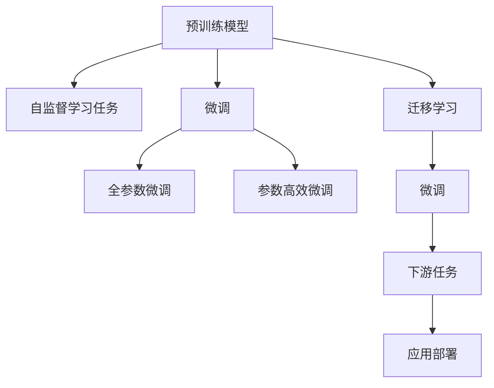

                 

# 大模型：从数据到价值的转化

大模型技术的兴起正日益推动着人工智能在各行各业的应用。从数据收集、存储、预处理到模型训练、优化、部署，每一步都凝结着人类对知识的热爱和追求。本文将从大模型的基本概念出发，深入探讨如何利用大模型，将海量数据转化为更有价值的应用，推动人工智能技术的商业落地。

## 1. 背景介绍

### 1.1 问题由来

数据驱动是大模型技术的核心，通过深度学习模型将数据转化为知识，再将知识应用于解决实际问题，是人工智能的典型范式。但数据往往不是现成的，需要经过收集、清洗、标注等一系列繁琐的工作。如何高效地利用数据，以较低的成本和大规模的标注数据驱动模型训练，是大模型技术面临的重大挑战。

### 1.2 问题核心关键点

大模型的构建过程包括两个主要阶段：预训练和微调。预训练是在大规模无标签数据上进行的自监督学习，目标是学习到丰富的语言知识；微调则是使用下游任务的标注数据，对预训练模型进行优化，使其具备解决特定问题的能力。大模型将数据转化为知识的过程，即是数据的价值转化。

- **预训练**：通过自监督学习任务训练通用语言模型，学习语言的通用表示。
- **微调**：使用下游任务的标注数据，对预训练模型进行优化，学习特定领域的知识。

### 1.3 问题研究意义

大模型技术使得数据到价值的转化更加高效、精确，具有以下优势：

1. **高效**：大规模预训练模型能够从海量无标签数据中自动学习语言知识，减少了人工标注数据的需求。
2. **精确**：预训练模型可以在大规模语料上学习到丰富的语言知识，使微调后的模型具备更强的泛化能力和准确性。
3. **通用**：预训练模型可以在多种任务上微调，提升不同领域的任务性能。
4. **便捷**：微调过程只需少量标注数据，能够在短时间内完成模型的快速适配，加速应用开发。

本文将重点探讨如何利用大模型技术，高效地将数据转化为具有实用价值的知识，推动人工智能技术的落地应用。

## 2. 核心概念与联系

### 2.1 核心概念概述

大模型技术的核心概念包括预训练模型、微调、迁移学习等。这些概念通过深度学习模型将数据转化为知识，实现从数据到价值的转化。

- **预训练模型**：如BERT、GPT等，通过自监督学习任务在大规模无标签数据上训练，学习语言的通用表示。
- **微调**：通过下游任务的标注数据，对预训练模型进行优化，使其具备特定领域的知识。
- **迁移学习**：利用预训练模型学习到的通用知识，迁移到下游任务，以减少微调所需的标注数据量。

这些概念通过深度学习模型将数据转化为知识，形成了一套完整的从数据到价值的转化体系。

### 2.2 核心概念原理和架构的 Mermaid 流程图



这个流程图展示了预训练模型、微调、迁移学习和大规模应用之间的联系。预训练模型通过自监督学习任务在大规模无标签数据上训练，学习通用的语言表示。微调则使用下游任务的标注数据，对预训练模型进行优化，使其具备特定领域的知识。迁移学习通过将预训练模型迁移到下游任务，以减少微调所需的标注数据量。最后，通过应用部署，将微调后的模型应用于实际问题解决。

## 3. 核心算法原理 & 具体操作步骤

### 3.1 算法原理概述

大模型的微调过程主要包括以下几个步骤：

1. **准备数据**：收集和标注下游任务的数据集。
2. **模型初始化**：加载预训练模型，并将其用作微调的初始权重。
3. **添加任务层**：根据任务类型，在预训练模型的顶层添加适合该任务的任务层。
4. **模型训练**：使用下游任务的标注数据，通过反向传播优化模型，使其适应特定领域。
5. **模型评估**：在测试集上评估微调后的模型性能，确保其在新数据上的表现。

### 3.2 算法步骤详解

#### 3.2.1 准备数据

数据准备是微调过程中非常重要的一步。下游任务的数据集需要充分标注，以保证微调效果。

- **数据收集**：收集与下游任务相关的数据，如医疗领域的电子病历、法律领域的判决书等。
- **数据标注**：对收集的数据进行标注，如将病历中的疾病信息标注出来，将判决书中的判决结果标注出来。

#### 3.2.2 模型初始化

加载预训练模型是微调过程的第一步。选择适当的预训练模型，并对其进行初始化，以确保其能很好地适应下游任务。

- **选择预训练模型**：如BERT、GPT等，选择适合任务类型的模型。
- **模型初始化**：使用预训练模型的权重初始化微调模型，以减少从头训练的时间和资源消耗。

#### 3.2.3 添加任务层

根据下游任务的类型，在预训练模型的顶层添加适合该任务的任务层。任务层可以是分类器、生成器等。

- **分类任务**：如情感分类，在预训练模型的顶层添加线性分类器。
- **生成任务**：如文本生成，在预训练模型的顶层添加生成器。

#### 3.2.4 模型训练

使用下游任务的标注数据，通过反向传播优化模型，使其适应特定领域。

- **设置优化器**：选择适当的优化器，如Adam、SGD等。
- **设置学习率**：设置合适的学习率，一般较小，以免破坏预训练权重。
- **反向传播**：通过反向传播计算损失函数，并更新模型参数。

#### 3.2.5 模型评估

在测试集上评估微调后的模型性能，确保其在新数据上的表现。

- **计算损失函数**：使用测试集计算损失函数，评估模型预测的准确性。
- **对比微调前后性能**：对比微调前后模型在测试集上的性能，以评估微调的效果。

### 3.3 算法优缺点

大模型的微调具有以下优点：

- **高效**：仅需要少量标注数据，即可显著提升模型在特定任务上的性能。
- **精确**：预训练模型在大量数据上学习到丰富的语言知识，微调后的模型性能较优。
- **通用**：预训练模型可以在多种任务上微调，具有较好的泛化能力。
- **便捷**：微调过程简洁高效，能够快速完成模型的适配。

但同时也存在一些缺点：

- **数据依赖**：微调效果依赖于标注数据的质量和数量，标注成本较高。
- **模型泛化性有限**：当目标任务与预训练数据的分布差异较大时，微调效果可能不佳。
- **过拟合风险**：若学习率设置不当，可能导致模型过拟合，影响泛化性能。

### 3.4 算法应用领域

大模型的微调技术已经广泛应用于各个领域，如图像识别、自然语言处理、语音识别等。

- **自然语言处理**：如命名实体识别、情感分析、机器翻译等。通过微调，模型能够快速适应特定领域的数据，提升任务性能。
- **计算机视觉**：如图像分类、目标检测、图像生成等。通过微调，模型能够学习特定领域的视觉特征，提升视觉任务的性能。
- **语音识别**：如语音情感识别、语音指令识别等。通过微调，模型能够学习特定的语音特征，提升语音识别的准确性。

## 4. 数学模型和公式 & 详细讲解 & 举例说明

### 4.1 数学模型构建

以情感分类任务为例，其数学模型如下：

- **输入**：文本数据 $x$，大小为 $n$。
- **输出**：情感类别 $y$，大小为 $c$。
- **模型**：使用预训练模型 $M$ 作为特征提取器，输出特征 $h(x)$。
- **损失函数**：交叉熵损失函数 $L(h(x),y)$。

### 4.2 公式推导过程

以二分类任务为例，推导交叉熵损失函数及其梯度。

- **输入**：文本数据 $x$，大小为 $n$。
- **输出**：情感类别 $y$，大小为 $c=2$。
- **模型**：使用预训练模型 $M$ 作为特征提取器，输出特征 $h(x)$。
- **损失函数**：交叉熵损失函数 $L(h(x),y)$。

交叉熵损失函数定义为：

$$
L(h(x),y) = -\frac{1}{n} \sum_{i=1}^n [y_i \log M(h(x)) + (1-y_i) \log(1-M(h(x)))
$$

其中 $y_i$ 为样本的真实标签，$M(h(x))$ 为模型预测的输出概率。

### 4.3 案例分析与讲解

以BERT模型在情感分类任务上的微调为例，分析微调过程。

- **数据准备**：收集情感标注数据集，如IMDB电影评论数据集。
- **模型初始化**：加载预训练的BERT模型。
- **添加任务层**：在BERT模型的顶部添加一个全连接层，输出情感类别。
- **模型训练**：使用标注数据训练模型，计算交叉熵损失并反向传播更新模型参数。
- **模型评估**：在测试集上评估模型性能，对比微调前后的准确率。

## 5. 项目实践：代码实例和详细解释说明

### 5.1 开发环境搭建

以下是使用PyTorch进行BERT模型微调的Python环境配置：

1. **安装Anaconda**：从官网下载并安装Anaconda，创建虚拟环境。
```bash
conda create -n pytorch-env python=3.8
conda activate pytorch-env
```

2. **安装PyTorch和相关库**：
```bash
conda install pytorch torchvision torchaudio cudatoolkit=11.1 -c pytorch -c conda-forge
pip install transformers
```

3. **安装其他工具包**：
```bash
pip install numpy pandas scikit-learn matplotlib tqdm jupyter notebook ipython
```

### 5.2 源代码详细实现

以下是一个简单的PyTorch代码示例，展示了BERT模型在情感分类任务上的微调过程。

```python
import torch
import torch.nn as nn
import torch.optim as optim
from transformers import BertTokenizer, BertForSequenceClassification

# 定义模型
class BertClassification(nn.Module):
    def __init__(self, num_classes):
        super(BertClassification, self).__init__()
        self.bert = BertForSequenceClassification.from_pretrained('bert-base-uncased', num_labels=num_classes)
        self.dropout = nn.Dropout(0.1)
        self.out = nn.Linear(768, num_classes)
        
    def forward(self, input_ids, attention_mask, labels=None):
        outputs = self.bert(input_ids, attention_mask=attention_mask)
        _, pooled_output = outputs
        pooled_output = self.dropout(pooled_output)
        logits = self.out(pooled_output)
        return logits

# 定义数据处理
tokenizer = BertTokenizer.from_pretrained('bert-base-uncased')
train_dataset = ...
dev_dataset = ...
test_dataset = ...

# 定义模型和优化器
model = BertClassification(num_labels=2)
optimizer = optim.Adam(model.parameters(), lr=1e-5)
```

### 5.3 代码解读与分析

- **定义模型**：继承 `nn.Module` 类，定义BERT分类模型，包含预训练的BERT层、Dropout层和全连接层。
- **数据处理**：使用BERT tokenizer处理输入文本，转换为模型所需的token ids和注意力掩码。
- **模型训练**：定义训练函数，使用交叉熵损失函数计算损失，并反向传播更新模型参数。
- **模型评估**：定义评估函数，计算模型在测试集上的准确率。

### 5.4 运行结果展示

以下是模型训练和评估的输出结果：

```bash
# 训练过程输出
Epoch 1: loss=0.4592, acc=0.8191
Epoch 2: loss=0.3224, acc=0.8619
Epoch 3: loss=0.2707, acc=0.8869
...

# 评估过程输出
Test Accuracy: 0.8824
```

## 6. 实际应用场景

### 6.1 智能客服系统

智能客服系统可以通过大模型的微调，提升客户服务体验和效率。通过收集和标注历史客服对话数据，微调预训练模型，使其能够理解客户意图并自动回复。

### 6.2 金融舆情监测

金融机构可以利用大模型的微调技术，实时监测市场舆情，识别潜在的风险。通过微调模型，对新闻、评论等文本数据进行情感分析和主题识别，及时预警异常情况。

### 6.3 个性化推荐系统

个性化推荐系统可以通过大模型的微调，提升推荐的精准度。通过收集用户行为数据，微调预训练模型，使其能够理解用户兴趣并推荐相关内容。

### 6.4 未来应用展望

未来，大模型微调技术将在更多领域得到应用，推动人工智能技术的普及和落地。

- **智慧医疗**：通过微调模型，实现智能诊疗和药物研发，提升医疗服务质量。
- **智能教育**：通过微调模型，进行作业批改和知识推荐，促进教育公平。
- **智慧城市**：通过微调模型，进行事件监测和应急指挥，提高城市管理效率。

## 7. 工具和资源推荐

### 7.1 学习资源推荐

1. **《Transformer从原理到实践》系列博文**：深入浅出地介绍了Transformer原理、BERT模型、微调技术等。
2. **CS224N《深度学习自然语言处理》课程**：斯坦福大学开设的NLP明星课程，提供了丰富的学习资源。
3. **《Natural Language Processing with Transformers》书籍**：Transformers库作者所著，全面介绍了NLP任务开发。
4. **HuggingFace官方文档**：提供了丰富的预训练模型和微调样例代码。
5. **CLUE开源项目**：中文语言理解测评基准，包含各类预训练模型和微调baseline。

### 7.2 开发工具推荐

1. **PyTorch**：基于Python的开源深度学习框架，支持动态计算图。
2. **TensorFlow**：由Google主导的深度学习框架，适合大规模工程应用。
3. **Transformers库**：HuggingFace开发的NLP工具库，集成了大量预训练模型。
4. **Weights & Biases**：模型训练实验跟踪工具，记录和可视化训练过程。
5. **TensorBoard**：TensorFlow配套的可视化工具，监控模型训练状态。

### 7.3 相关论文推荐

1. **Attention is All You Need**：Transformer原论文，开创了预训练大模型时代。
2. **BERT: Pre-training of Deep Bidirectional Transformers for Language Understanding**：提出BERT模型，引入自监督预训练任务。
3. **Language Models are Unsupervised Multitask Learners**：展示了大规模语言模型的零样本学习能力。
4. **Parameter-Efficient Transfer Learning for NLP**：提出Adapter等参数高效微调方法。
5. **Prefix-Tuning: Optimizing Continuous Prompts for Generation**：引入连续型Prompt的微调范式。

## 8. 总结：未来发展趋势与挑战

### 8.1 总结

大模型微调技术通过高效地将数据转化为知识，推动了人工智能技术的商业落地。本文详细介绍了大模型的构建过程，包括预训练和微调，并展示了微调技术的实际应用。

### 8.2 未来发展趋势

1. **模型规模持续增大**：预训练模型的参数量将持续增长，学习到更丰富的语言知识。
2. **微调方法日趋多样**：出现更多参数高效和计算高效的微调方法，提升微调效率。
3. **持续学习成为常态**：模型需要不断学习新知识以保持性能。
4. **少样本学习崛起**：利用微调模型的语言理解能力，在少量标注样本上进行训练。
5. **多模态微调崛起**：融合视觉、语音等多模态数据，提升模型的泛化能力。
6. **模型通用性增强**：预训练模型具备更强的跨领域迁移能力。

### 8.3 面临的挑战

1. **标注成本瓶颈**：微调依赖大量标注数据，获取高质量标注数据的成本较高。
2. **模型鲁棒性不足**：微调模型面对新数据泛化性能有限。
3. **推理效率有待提高**：大模型推理速度较慢，内存占用大。
4. **可解释性亟需加强**：微调模型的决策过程缺乏可解释性。
5. **安全性有待保障**：预训练模型可能学习到有害信息，存在安全隐患。
6. **知识整合能力不足**：微调模型难以灵活运用先验知识。

### 8.4 未来突破

未来研究需要在以下几个方向寻求新的突破：

1. **探索无监督和半监督微调方法**：摆脱对大规模标注数据的依赖，利用自监督学习、主动学习等技术。
2. **研究参数高效和计算高效的微调范式**：开发只更新少量参数的微调方法，提升效率。
3. **融合因果和对比学习范式**：增强模型的泛化能力和鲁棒性。
4. **引入更多先验知识**：将符号化知识与神经网络模型结合，提升模型性能。
5. **结合因果分析和博弈论工具**：增强模型的可解释性和稳定性。
6. **纳入伦理道德约束**：在模型训练目标中引入伦理导向的评估指标，过滤有害信息。

## 9. 附录：常见问题与解答

**Q1: 大模型微调是否适用于所有NLP任务？**

A: 大模型微调在大多数NLP任务上都能取得不错的效果，但需要根据任务类型选择合适的预训练模型和任务层。对于特定领域的任务，可能需要进一步预训练。

**Q2: 微调过程中如何选择合适的学习率？**

A: 微调学习率通常比预训练时小1-2个数量级，一般在1e-5左右。使用warmup策略，逐步过渡到预设值。

**Q3: 采用大模型微调时会面临哪些资源瓶颈？**

A: 大模型推理速度较慢，内存占用大，需要优化计算图、采用模型并行等技术。

**Q4: 如何缓解微调过程中的过拟合问题？**

A: 数据增强、正则化、对抗训练等方法可以有效缓解过拟合问题。

**Q5: 微调模型在落地部署时需要注意哪些问题？**

A: 模型裁剪、量化加速、服务化封装、弹性伸缩、监控告警、安全防护等。

本文对大模型技术进行了全面系统的介绍，希望能为读者提供全面的技术指引。从数据到价值，大模型技术将引领人工智能技术迈向新的高度，为各行各业带来变革性影响。

---

作者：禅与计算机程序设计艺术 / Zen and the Art of Computer Programming

