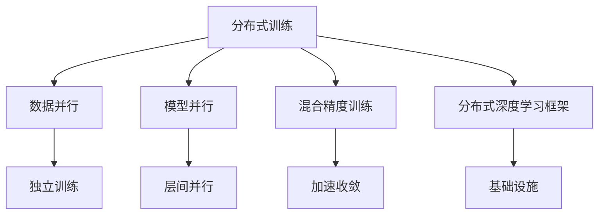

                 

# 大规模语言模型从理论到实践 分布式训练

> 关键词：分布式训练,分布式系统,语言模型,Transformer,自监督学习,数据并行,模型并行,混合精度训练

## 1. 背景介绍

### 1.1 问题由来

随着深度学习技术的不断进步，大规模语言模型（Large Language Models, LLMs）在自然语言处理（Natural Language Processing, NLP）领域取得了重大突破。这些模型通过在海量无标签文本数据上进行预训练，学习到丰富的语言知识和常识，能够在各种任务上取得优异的性能。然而，训练大规模语言模型需要耗费大量的计算资源和时间，因此，分布式训练（Distributed Training）成为了一种必要手段，使得模型能够在大规模数据集上进行高效训练。

### 1.2 问题核心关键点

分布式训练是指将大规模计算任务分配到多台计算机上并行执行，以加快模型训练速度。在大规模语言模型的训练中，分布式训练尤为重要，因为它能够显著缩短模型训练时间，同时保持模型的性能。常见的分布式训练方法包括数据并行、模型并行和混合精度训练。

分布式训练的关键在于如何将计算任务合理地分配到不同的计算节点上，避免数据和模型参数在不同节点间的频繁传输，同时保持各个节点的负载均衡。

### 1.3 问题研究意义

研究大规模语言模型的分布式训练，对于提升模型训练效率、降低成本、加速NLP技术的产业化进程具有重要意义：

1. 提升训练效率。分布式训练能够有效缩短模型训练时间，使得大规模语言模型在较短时间内训练完毕。
2. 降低计算成本。通过多台计算机并行计算，可以显著降低单个计算节点的计算负担，降低成本。
3. 加速技术应用。更快的训练速度使得NLP技术能够更快地应用于各种实际场景，推动产业升级。
4. 促进模型创新。分布式训练技术的发展，促进了模型的优化和改进，带来了新的研究方向。

## 2. 核心概念与联系

### 2.1 核心概念概述

为更好地理解大规模语言模型分布式训练方法，本节将介绍几个密切相关的核心概念：

- 分布式训练(Distributed Training)：将大规模计算任务分配到多台计算机上并行执行，以加快模型训练速度。
- 数据并行(Data Parallelism)：将数据分批次传输到多个计算节点上进行独立训练，通过所有节点的梯度汇总来更新模型参数。
- 模型并行(Model Parallelism)：将模型的不同层分配到不同的计算节点上进行并行训练，保持各个节点的负载均衡。
- 混合精度训练(Mixed Precision Training)：使用混合精度的数据类型（如16位和32位）进行训练，以减少计算资源消耗和加速模型收敛。
- 分布式深度学习框架：如TensorFlow、PyTorch、Horovod等，提供了分布式训练的基础设施，简化了分布式训练的实现。

这些核心概念之间的逻辑关系可以通过以下Mermaid流程图来展示：



这个流程图展示了大规模语言模型分布式训练的核心概念及其之间的关系：

1. 分布式训练是整个流程的核心，涵盖数据并行、模型并行、混合精度训练等具体方法。
2. 数据并行和模型并行分别代表不同的并行方式，通过不同的分配策略优化训练过程。
3. 混合精度训练是提升训练效率的重要手段，通过降低计算成本加速模型收敛。
4. 分布式深度学习框架提供分布式训练的基础设施，简化了分布式训练的实现。

这些概念共同构成了大规模语言模型分布式训练的技术框架，使得模型能够在大型计算集群上进行高效训练。

## 3. 核心算法原理 & 具体操作步骤
### 3.1 算法原理概述

大规模语言模型的分布式训练，本质上是一种并行计算任务，旨在通过多台计算机的协同工作，加快模型训练速度。其核心思想是：将大规模计算任务分解为多个子任务，分配到不同的计算节点上并行执行，通过节点间的通信和协调，完成整个计算任务的执行。

具体来说，分布式训练过程包括以下几个步骤：

1. 数据划分：将训练数据集划分为多个子集，每个子集分布在不同的计算节点上。
2. 模型分割：将模型的不同层分割到不同的计算节点上，保持各个节点的负载均衡。
3. 通信与同步：通过节点间的通信机制，如AllReduce、Ring AllReduce等，同步各个节点的梯度更新。
4. 参数更新：根据节点间的梯度汇总结果，更新模型参数。

通过以上步骤，分布式训练可以在多个计算节点上并行执行，显著提升模型训练效率。

### 3.2 算法步骤详解

以下是基于数据并行的分布式训练过程详细步骤：

1. **数据划分**：将训练数据集 $D$ 划分为 $M$ 个子集 $D_1, D_2, ..., D_M$，每个子集分配到不同的计算节点上。

2. **模型分割**：将模型 $M_{\theta}$ 分割为多个子模型 $M_{\theta_1}, M_{\theta_2}, ..., M_{\theta_M}$，每个子模型在对应的计算节点上进行训练。

3. **前向传播**：每个计算节点在本地对数据进行前向传播，得到本地输出 $y_i^k$。

4. **损失计算**：计算本地输出 $y_i^k$ 与本地标签 $y_i$ 之间的损失函数 $\ell_i^k$。

5. **梯度计算**：对本地损失函数求梯度，得到本地梯度 $\Delta\theta_i^k$。

6. **梯度同步**：使用AllReduce等通信机制，将各节点的梯度汇总到主节点上。

7. **参数更新**：根据汇总的梯度，更新模型参数 $\theta$。

8. **参数广播**：将更新后的模型参数广播到各个计算节点上，开始下一轮训练。

以上步骤不断迭代，直至模型收敛。通过这种并行计算的方式，大规模语言模型可以在较短时间内完成训练。

### 3.3 算法优缺点

大规模语言模型分布式训练的优势在于：

1. 训练效率高。通过并行计算，可以显著缩短模型训练时间。
2. 硬件资源利用率高。多台计算机协同工作，充分利用计算资源。
3. 模型性能稳定。通过数据并行和模型并行的协同优化，模型性能稳定。

然而，分布式训练也存在一些缺点：

1. 通信开销大。节点间的通信机制会产生额外的开销，影响训练效率。
2. 硬件成本高。需要多台高性能计算机，硬件成本较高。
3. 调试复杂。多台计算机协同工作，调试过程复杂。

尽管存在这些缺点，分布式训练仍然是大规模语言模型训练不可或缺的一部分，特别是在处理大规模数据集时。

### 3.4 算法应用领域

大规模语言模型的分布式训练已经在多个领域得到了广泛应用，例如：

- 自然语言处理（NLP）：如文本分类、机器翻译、文本生成等任务。
- 计算机视觉（CV）：如图像分类、目标检测、语义分割等任务。
- 语音处理（ASR）：如语音识别、语音合成等任务。
- 推荐系统：如商品推荐、内容推荐等任务。
- 金融领域：如风险评估、欺诈检测等任务。

此外，在科学研究、医疗诊断、游戏设计等领域，分布式训练也为这些应用带来了新的可能。随着分布式计算技术的不断进步，分布式训练方法将在更多领域得到应用，为人工智能技术的发展提供新的动力。

## 4. 数学模型和公式 & 详细讲解  
### 4.1 数学模型构建

在分布式训练中，我们需要构建一个数学模型来描述分布式训练过程。

设大规模语言模型 $M_{\theta}$ 在计算节点 $k$ 上的子模型为 $M_{\theta_k}$，训练数据集为 $D=\{(x_i, y_i)\}_{i=1}^N$。

定义模型在数据样本 $(x_i, y_i)$ 上的损失函数为 $\ell(M_{\theta}(x_i), y_i)$，则在数据集 $D$ 上的经验风险为：

$$
\mathcal{L}(\theta) = \frac{1}{N}\sum_{i=1}^N \ell(M_{\theta}(x_i), y_i)
$$

分布式训练的目标是最小化经验风险，即找到最优参数：

$$
\theta^* = \mathop{\arg\min}_{\theta} \mathcal{L}(\theta)
$$

在实践中，我们通常使用基于梯度的优化算法（如SGD、Adam等）来近似求解上述最优化问题。设 $\eta$ 为学习率，$\lambda$ 为正则化系数，则参数的更新公式为：

$$
\theta \leftarrow \theta - \eta \nabla_{\theta}\mathcal{L}(\theta) - \eta\lambda\theta
$$

其中 $\nabla_{\theta}\mathcal{L}(\theta)$ 为损失函数对参数 $\theta$ 的梯度，可通过反向传播算法高效计算。

### 4.2 公式推导过程

以下我们以二分类任务为例，推导交叉熵损失函数及其梯度的计算公式。

假设模型 $M_{\theta}$ 在输入 $x$ 上的输出为 $\hat{y}=M_{\theta}(x) \in [0,1]$，表示样本属于正类的概率。真实标签 $y \in \{0,1\}$。则二分类交叉熵损失函数定义为：

$$
\ell(M_{\theta}(x),y) = -[y\log \hat{y} + (1-y)\log (1-\hat{y})]
$$

将其代入经验风险公式，得：

$$
\mathcal{L}(\theta) = -\frac{1}{N}\sum_{i=1}^N [y_i\log M_{\theta}(x_i)+(1-y_i)\log(1-M_{\theta}(x_i))]
$$

根据链式法则，损失函数对参数 $\theta_k$ 的梯度为：

$$
\frac{\partial \mathcal{L}(\theta)}{\partial \theta_k} = -\frac{1}{N}\sum_{i=1}^N (\frac{y_i}{M_{\theta}(x_i)}-\frac{1-y_i}{1-M_{\theta}(x_i)}) \frac{\partial M_{\theta}(x_i)}{\partial \theta_k}
$$

其中 $\frac{\partial M_{\theta}(x_i)}{\partial \theta_k}$ 可进一步递归展开，利用自动微分技术完成计算。

在得到损失函数的梯度后，即可带入参数更新公式，完成模型的迭代优化。重复上述过程直至收敛，最终得到适应下游任务的最优模型参数 $\theta^*$。

## 5. 项目实践：代码实例和详细解释说明
### 5.1 开发环境搭建

在进行分布式训练实践前，我们需要准备好开发环境。以下是使用Python进行PyTorch开发的环境配置流程：

1. 安装Anaconda：从官网下载并安装Anaconda，用于创建独立的Python环境。

2. 创建并激活虚拟环境：
```bash
conda create -n pytorch-env python=3.8 
conda activate pytorch-env
```

3. 安装PyTorch：根据CUDA版本，从官网获取对应的安装命令。例如：
```bash
conda install pytorch torchvision torchaudio cudatoolkit=11.1 -c pytorch -c conda-forge
```

4. 安装Horovod：
```bash
conda install horovod
```

5. 安装各类工具包：
```bash
pip install numpy pandas scikit-learn matplotlib tqdm jupyter notebook ipython
```

完成上述步骤后，即可在`pytorch-env`环境中开始分布式训练实践。

### 5.2 源代码详细实现

这里我们以二分类任务为例，给出使用PyTorch和Horovod进行分布式训练的代码实现。

首先，定义二分类任务的损失函数和优化器：

```python
import torch
import torch.nn as nn
import torch.optim as optim
from torch.utils.data import Dataset, DataLoader
from horovod.torch import allreduce, allgather

class BinaryClassifier(nn.Module):
    def __init__(self):
        super(BinaryClassifier, self).__init__()
        self.fc1 = nn.Linear(784, 256)
        self.fc2 = nn.Linear(256, 1)
        self.softmax = nn.Softmax(dim=1)
        
    def forward(self, x):
        x = x.view(-1, 784)
        x = self.fc1(x)
        x = torch.relu(x)
        x = self.fc2(x)
        x = self.softmax(x)
        return x

model = BinaryClassifier()

criterion = nn.BCELoss()
optimizer = optim.SGD(model.parameters(), lr=0.01)

# 使用Horovod初始化所有reduce操作
hvd.init()
hvd.rank()
hvd.size()
```

然后，定义训练和评估函数：

```python
def train(model, data_loader, criterion, optimizer):
    model.train()
    running_loss = 0.0
    for i, data in enumerate(data_loader, 0):
        inputs, labels = data
        inputs = inputs.to(device)
        labels = labels.to(device)

        optimizer.zero_grad()
        outputs = model(inputs)
        loss = criterion(outputs, labels)
        loss = hvd.allreduce(loss)
        loss.backward()
        optimizer.step()

        running_loss += loss.item()
        if i % 100 == 99:    
            print(f'Epoch {epoch+1}, Batch {i+1}, Loss: {running_loss/100:.3f}')
            running_loss = 0.0

def evaluate(model, data_loader):
    model.eval()
    correct = 0
    total = 0
    with torch.no_grad():
        for data in data_loader:
            inputs, labels = data
            inputs = inputs.to(device)
            labels = labels.to(device)
            outputs = model(inputs)
            _, predicted = torch.max(outputs.data, 1)
            total += labels.size(0)
            correct += (predicted == labels).sum().item()

    print(f'Accuracy of the network on the 10000 test images: {100 * correct / total}%')
```

最后，启动分布式训练流程：

```python
from torch.utils.data import DataLoader
from torchvision.datasets import MNIST
from torchvision.transforms import ToTensor

# 加载数据集
train_dataset = MNIST(root='./data', train=True, transform=ToTensor(), download=True)
test_dataset = MNIST(root='./data', train=False, transform=ToTensor(), download=True)

# 定义数据集大小
train_dataset.size()[0], test_dataset.size()[0]

# 数据集划分
batch_size = 64
train_loader = DataLoader(train_dataset, batch_size=batch_size, shuffle=True)
test_loader = DataLoader(test_dataset, batch_size=batch_size, shuffle=False)

# 定义训练轮数
num_epochs = 5

# 主循环
for epoch in range(num_epochs):
    train(train_loader, criterion, optimizer)

    print(f'Epoch {epoch+1} finished.')
    evaluate(train_loader, criterion, optimizer)
```

以上就是使用PyTorch和Horovod进行分布式训练的完整代码实现。可以看到，通过Horovod的简单配置，分布式训练变得非常便捷。

### 5.3 代码解读与分析

让我们再详细解读一下关键代码的实现细节：

**BinaryClassifier类**：
- `__init__`方法：定义模型结构，包括两个全连接层和一个Softmax层。

**train函数**：
- 在训练过程中，首先定义了优化器和损失函数。
- 使用Horovod初始化并行通信，并计算所有reduce操作。
- 对每个批次的数据进行前向传播和反向传播，计算并累加损失函数。
- 打印训练过程中的损失值。

**evaluate函数**：
- 在评估过程中，使用测试集进行模型评估。
- 使用softmax函数得到预测结果，并计算准确率。

**主循环**：
- 对训练集进行多次迭代训练。
- 在每个epoch结束时，调用evaluate函数进行评估。

可以看到，PyTorch和Horovod的结合使得分布式训练的实现变得非常简单和高效。开发者只需关注模型结构、训练和评估逻辑，而无需过多关注通信和同步的细节。

当然，工业级的系统实现还需考虑更多因素，如模型裁剪、量化加速、服务化封装等。但核心的分布式训练范式基本与此类似。

## 6. 实际应用场景
### 6.1 大数据处理

分布式训练在大数据处理中得到了广泛应用，特别是在大规模图像识别、语音识别、自然语言处理等任务中。例如，在处理大规模图像数据集时，可以通过多台计算节点的并行计算，快速完成模型的训练，加速数据分析和处理。

### 6.2 科学研究

分布式训练也广泛应用于科学研究领域，如天文学、物理学、化学等。在这些领域中，大规模计算任务非常常见，通过分布式训练可以显著提高计算效率，缩短研究周期。

### 6.3 工业生产

分布式训练在工业生产中也得到了广泛应用，如汽车制造、电子设备生产等。通过分布式训练，可以加快模型的训练速度，提高产品质量和生产效率。

### 6.4 未来应用展望

随着分布式计算技术的不断进步，未来分布式训练将带来更多创新应用。例如，基于边缘计算的分布式训练，可以在本地设备上进行模型训练，减少数据传输成本和延迟。分布式联邦学习可以保护用户隐私，同时提升模型性能。未来，分布式训练将进一步拓展应用场景，推动人工智能技术的广泛落地。

## 7. 工具和资源推荐
### 7.1 学习资源推荐

为了帮助开发者系统掌握大规模语言模型分布式训练的理论基础和实践技巧，这里推荐一些优质的学习资源：

1. 《分布式深度学习》系列博文：由Google Distinguished Scientist Jeff Dean撰写，深入浅出地介绍了分布式深度学习的原理和实践，适合入门学习和进阶研究。

2. 《深度学习分布式训练》书籍：深度学习领域经典书籍，详细介绍了分布式深度学习的算法和实现，适合系统学习。

3. 《分布式训练框架Horovod官方文档》：Horovod的官方文档，提供了丰富的分布式训练范例和最佳实践，适合实战练习。

4. 《TensorFlow分布式训练教程》：TensorFlow官方教程，介绍了TensorFlow的分布式训练框架和优化器，适合TensorFlow用户学习。

5. 《PyTorch分布式训练实战》课程：由DeepAI提供，介绍了PyTorch的分布式训练技巧和最佳实践，适合PyTorch用户学习。

通过对这些资源的学习实践，相信你一定能够快速掌握大规模语言模型分布式训练的精髓，并用于解决实际的计算问题。

### 7.2 开发工具推荐

高效的开发离不开优秀的工具支持。以下是几款用于大规模语言模型分布式训练开发的常用工具：

1. TensorFlow：由Google主导开发的深度学习框架，提供了丰富的分布式训练基础设施，支持大规模分布式计算。

2. PyTorch：由Facebook主导的深度学习框架，具有动态计算图的灵活性，适合快速迭代研究。

3. Horovod：开源的分布式深度学习框架，支持多种深度学习框架，简化了分布式训练的实现。

4. Ray：开源的分布式计算框架，支持任务并行和模型并行，适合大规模分布式计算。

5. Spark：开源的分布式计算框架，支持数据并行，适合大规模数据集处理。

6. MLflow：开源的机器学习平台，支持模型训练、实验跟踪和模型部署，适合系统集成。

合理利用这些工具，可以显著提升大规模语言模型分布式训练的开发效率，加快创新迭代的步伐。

### 7.3 相关论文推荐

大规模语言模型和分布式训练的发展源于学界的持续研究。以下是几篇奠基性的相关论文，推荐阅读：

1. Distributed Deep Learning with TensorFlow: A Massive Survey and Classification（TensorFlow分布式训练综述）：Jeff Dean等人在ICLR2018年发表的论文，全面介绍了TensorFlow的分布式训练机制和优化器。

2. Large-Scale Distributed Deep Learning with TensorFlow（TensorFlow分布式深度学习）：Jeff Dean等人在NIPS2016年发表的论文，介绍了TensorFlow的分布式训练算法和实现。

3. Parameter-Server Training for Distributed Deep Learning（参数服务器训练）：由清华大学的周志华等人发表在ICML2015年的论文，介绍了分布式训练中参数服务器算法的原理和实现。

4. Distributed Training of Deep Neural Networks with Heterogeneous Servers（异构服务器上的分布式深度学习）：由百度的魏玉林等人发表在IEEE TNNLS2018年的论文，介绍了异构服务器上的分布式深度学习算法和实现。

这些论文代表了大规模语言模型分布式训练的发展脉络。通过学习这些前沿成果，可以帮助研究者把握学科前进方向，激发更多的创新灵感。

## 8. 总结：未来发展趋势与挑战

### 8.1 总结

本文对大规模语言模型的分布式训练方法进行了全面系统的介绍。首先阐述了大规模语言模型分布式训练的研究背景和意义，明确了分布式训练在提升模型训练效率、降低成本、加速NLP技术产业化进程中的重要作用。其次，从原理到实践，详细讲解了分布式训练的数学模型和关键步骤，给出了分布式训练任务开发的完整代码实例。同时，本文还广泛探讨了分布式训练方法在多个领域的应用前景，展示了分布式训练技术的广阔前景。

通过本文的系统梳理，可以看到，大规模语言模型的分布式训练技术已经成为NLP领域的重要范式，极大地拓展了模型的应用边界，催生了更多的落地场景。受益于分布式计算技术的不断进步，分布式训练方法将在更多领域得到应用，为人工智能技术的发展提供新的动力。

### 8.2 未来发展趋势

展望未来，大规模语言模型分布式训练将呈现以下几个发展趋势：

1. 硬件平台多样化。未来将出现更多基于GPU、TPU、FPGA等硬件平台的分布式训练框架，提升计算效率和资源利用率。

2. 模型并行扩展。未来将出现更多模型并行的优化算法，如Ring AllReduce、Gossip AllReduce等，提升大规模模型训练的效率。

3. 联邦学习发展。未来分布式训练将更多地结合联邦学习技术，保护用户隐私，同时提升模型性能。

4. 边缘计算应用。未来分布式训练将更多地结合边缘计算技术，实现数据和模型在本地设备上的协同训练。

5. 模型裁剪和量化。未来将出现更多模型裁剪和量化技术，减小模型尺寸，提升计算效率。

6. 数据预处理优化。未来分布式训练将更多地结合数据预处理技术，提升数据并行计算的效率。

以上趋势凸显了大规模语言模型分布式训练技术的广阔前景。这些方向的探索发展，将进一步提升模型训练效率，降低计算成本，推动人工智能技术的广泛应用。

### 8.3 面临的挑战

尽管大规模语言模型分布式训练技术已经取得了瞩目成就，但在迈向更加智能化、普适化应用的过程中，它仍面临着诸多挑战：

1. 通信开销大。节点间的通信机制会产生额外的开销，影响训练效率。

2. 硬件成本高。需要多台高性能计算机，硬件成本较高。

3. 调试复杂。多台计算机协同工作，调试过程复杂。

4. 数据传输瓶颈。数据在不同节点间的传输速度和带宽限制，影响分布式训练的效率。

5. 模型集成困难。分布式训练涉及多个节点的协同工作，模型集成和部署过程复杂。

尽管存在这些挑战，分布式训练仍然是大规模语言模型训练不可或缺的一部分，特别是在处理大规模数据集时。

### 8.4 未来突破

面对大规模语言模型分布式训练所面临的种种挑战，未来的研究需要在以下几个方面寻求新的突破：

1. 探索更高效的通信机制。研究新的通信算法，如Ring AllReduce、Gossip AllReduce等，减小通信开销，提高分布式训练的效率。

2. 研究更先进的硬件平台。研究基于GPU、TPU、FPGA等硬件平台的分布式训练框架，提升计算效率和资源利用率。

3. 引入联邦学习技术。结合联邦学习技术，保护用户隐私，同时提升模型性能。

4. 探索模型裁剪和量化技术。研究新的模型裁剪和量化技术，减小模型尺寸，提升计算效率。

5. 结合边缘计算技术。研究结合边缘计算技术，实现数据和模型在本地设备上的协同训练。

这些研究方向的探索，将引领大规模语言模型分布式训练技术迈向更高的台阶，为构建安全、可靠、可解释、可控的智能系统铺平道路。面向未来，大规模语言模型分布式训练技术还需要与其他人工智能技术进行更深入的融合，如知识表示、因果推理、强化学习等，多路径协同发力，共同推动自然语言理解和智能交互系统的进步。只有勇于创新、敢于突破，才能不断拓展语言模型的边界，让智能技术更好地造福人类社会。

## 9. 附录：常见问题与解答

**Q1：分布式训练和单机训练有什么区别？**

A: 分布式训练通过多台计算机协同工作，并行执行计算任务，能够显著提高训练速度。而单机训练则是单台计算机独立执行计算任务，效率较低。分布式训练的优势在于并行计算，而单机训练的优势在于单机的计算能力更强，适用于小规模数据集。

**Q2：分布式训练中如何避免数据传输瓶颈？**

A: 避免数据传输瓶颈的关键在于数据传输的优化。可以使用按需传输、按需解压等技术，避免全量数据传输和解压。同时，使用数据压缩技术，减小数据传输量。

**Q3：分布式训练中如何避免参数一致性问题？**

A: 参数一致性问题通常发生在模型并行中，需要多个节点协同更新模型参数。为了避免参数不一致，可以使用参数服务器、AllReduce等机制，同步各个节点的参数更新。

**Q4：分布式训练中如何实现模型裁剪和量化？**

A: 模型裁剪和量化是通过减小模型尺寸，提升计算效率。可以使用剪枝技术，去掉冗余的参数和连接。同时，使用量化技术，将浮点模型转为定点模型，减少存储空间和计算开销。

**Q5：分布式训练中如何实现模型并行？**

A: 模型并行是通过将模型的不同层分割到不同的计算节点上进行并行训练，保持各个节点的负载均衡。可以使用数据并行、参数并行、混合并行等策略，实现模型并行。

这些问题的解答展示了分布式训练过程中需要注意的关键问题，通过回答这些问题，可以帮助开发者更好地理解和实现分布式训练。

---

作者：禅与计算机程序设计艺术 / Zen and the Art of Computer Programming

