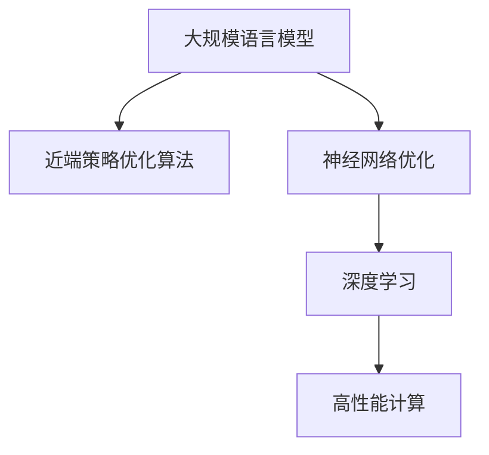

                 

# 大规模语言模型从理论到实践 近端策略优化算法

> 关键词：大规模语言模型, 近端策略优化算法, 神经网络优化, 深度学习, 高性能计算

## 1. 背景介绍

### 1.1 问题由来

在过去的十年里，大规模语言模型（Large Language Models, LLMs）在自然语言处理（NLP）领域取得了显著的进步，这得益于大规模无标签文本数据的预训练，以及在大规模有标签数据上的微调。这些模型如BERT、GPT和T5等，已经超越了人类的水平，在各种NLP任务上表现优异。然而，随着模型参数量的激增，训练和推理的成本也变得非常高，这使得模型的实时性和可扩展性成为一个难题。

为了解决这个问题，近端策略优化算法（Proximal Policy Optimization, PPO）被提出，它是一种基于梯度的优化算法，专门用于训练大规模深度神经网络模型，特别是在强化学习领域。PPO算法能够快速收敛，并且对模型参数的更新幅度较小，这使得它在处理大规模语言模型时表现出色。本文将深入探讨PPO算法在大规模语言模型中的应用，从理论到实践，展示如何利用PPO算法优化语言模型，从而提高模型的性能和效率。

### 1.2 问题核心关键点

PPO算法在优化大规模语言模型的过程中，关键在于以下几个方面：

1. **模型可扩展性**：PPO算法通过限制每次参数更新的幅度，使得大规模模型的参数能够逐步更新，从而避免内存溢出和计算资源不足的问题。
2. **训练效率**：PPO算法具有快速的收敛特性，能够显著缩短训练时间，提高模型的实时性。
3. **模型稳定性**：PPO算法在更新过程中能够保持模型的稳定性，避免模型参数的剧烈变化导致模型性能下降。
4. **泛化能力**：PPO算法能够通过更新模型的局部参数，增强模型的泛化能力，提升模型在不同数据分布上的表现。

这些关键点使得PPO算法在大规模语言模型的优化中具有重要的应用价值。

## 2. 核心概念与联系

### 2.1 核心概念概述

为了更好地理解PPO算法在大规模语言模型中的应用，本节将介绍几个密切相关的核心概念：

- **大规模语言模型（LLMs）**：指的是使用Transformer架构的深度学习模型，如BERT、GPT等，这些模型在预训练和微调过程中会涉及大量的参数和计算资源。
- **近端策略优化算法（PPO）**：是一种基于梯度的优化算法，专门用于训练深度神经网络模型，特别是在强化学习领域。PPO算法通过限制每次参数更新的幅度，快速收敛并且保持模型的稳定性。
- **神经网络优化**：是指通过梯度下降等方法，更新神经网络模型的参数，使得模型能够拟合训练数据并泛化到新数据。
- **深度学习**：是一种使用多层神经网络进行模式识别的机器学习方法，广泛应用于计算机视觉、自然语言处理、语音识别等领域。
- **高性能计算**：是指使用高效的硬件和软件，加速大规模深度学习模型的训练和推理。

这些核心概念之间的逻辑关系可以通过以下Mermaid流程图来展示：



这个流程图展示了大规模语言模型的核心概念及其之间的关系：

1. 大规模语言模型通过神经网络优化获得模型参数的更新，从而提升模型性能。
2. 近端策略优化算法是一种高效优化的神经网络优化方法，特别适用于大规模语言模型。
3. 深度学习是大规模语言模型的理论基础，涉及神经网络的构建和优化。
4. 高性能计算提供了强大的计算资源，加速大规模语言模型的训练和推理。

这些概念共同构成了大规模语言模型的学习和应用框架，使得大规模语言模型能够在大规模数据上获得显著的性能提升。通过理解这些核心概念，我们可以更好地把握大规模语言模型的工作原理和优化方向。

## 3. 核心算法原理 & 具体操作步骤

### 3.1 算法原理概述

PPO算法是一种基于梯度的优化算法，特别适用于训练深度神经网络模型，尤其是大规模语言模型。其核心思想是通过限制每次参数更新的幅度，使得模型能够快速收敛并且保持稳定。PPO算法的主要步骤包括：

1. 根据当前模型的输出，计算目标值（目标值可以是交叉熵损失、均方误差等）。
2. 计算当前参数的梯度，并使用近端策略优化器更新参数。
3. 计算下一个时间步的目标值，并计算新的参数梯度。
4. 计算更新后的参数与当前参数之间的差异，并使用KL散度来限制参数更新的幅度。
5. 使用更新后的参数进行新的前向传播，并重复以上步骤。

PPO算法的优化过程可以分为两个阶段：策略梯度更新和价值网络更新。策略梯度更新用于更新模型参数，而价值网络更新用于更新模型的价值函数，从而保证策略更新的稳定性。

### 3.2 算法步骤详解

PPO算法在大规模语言模型上的具体实施步骤如下：

**Step 1: 准备数据和模型**

- 收集大规模语料库，并将其划分为训练集、验证集和测试集。
- 使用深度学习框架（如PyTorch、TensorFlow等）搭建大规模语言模型。

**Step 2: 添加损失函数**

- 为大规模语言模型添加合适的损失函数，如交叉熵损失、均方误差损失等。
- 使用PPO算法的策略梯度更新方法，更新模型的参数。

**Step 3: 初始化PPO算法**

- 初始化PPO算法的超参数，如学习率、温度、KL散度等。
- 设置模型在训练和推理时的优化器。

**Step 4: 执行训练循环**

- 在训练集上执行PPO算法，更新模型的参数。
- 在验证集上评估模型的性能，并根据性能调整学习率等超参数。
- 在测试集上测试模型的性能，并输出结果。

**Step 5: 应用模型**

- 使用训练好的模型进行推理，处理新的文本数据。
- 对推理结果进行评估，并根据需要进行微调。

### 3.3 算法优缺点

PPO算法在优化大规模语言模型时具有以下优点：

1. **快速收敛**：PPO算法具有快速的收敛特性，能够显著缩短训练时间，提高模型的实时性。
2. **稳定更新**：PPO算法通过限制每次参数更新的幅度，使得模型能够保持稳定性，避免过拟合。
3. **高效计算**：PPO算法通过限制每次参数更新的幅度，能够避免内存溢出和计算资源不足的问题，适用于大规模模型。

同时，PPO算法也存在以下缺点：

1. **超参数敏感**：PPO算法的性能高度依赖于超参数的设置，如果超参数设置不当，可能会导致模型性能下降。
2. **复杂度较高**：PPO算法的实现相对复杂，需要理解和调整多个超参数，增加开发难度。
3. **数据依赖性强**：PPO算法的性能高度依赖于数据质量，如果训练数据质量不佳，模型性能可能受到影响。

尽管存在这些缺点，但就目前而言，PPO算法在大规模语言模型的优化中仍然是一种高效可行的方法。

### 3.4 算法应用领域

PPO算法在大规模语言模型中的应用领域包括：

- **文本分类**：如情感分析、主题分类等任务，PPO算法可以用于训练分类器，使得模型能够根据文本内容进行分类。
- **机器翻译**：PPO算法可以用于训练机器翻译模型，使得模型能够将一种语言的文本翻译成另一种语言。
- **对话系统**：PPO算法可以用于训练对话模型，使得模型能够理解自然语言并生成自然语言回复。
- **文本生成**：如文本摘要、文本补全等任务，PPO算法可以用于训练生成模型，使得模型能够生成自然语言文本。

除了上述这些经典任务外，PPO算法还可以用于解决更多场景中的问题，如文本匹配、命名实体识别、问答系统等，为NLP技术带来了全新的突破。随着PPO算法的不断进步，相信其在NLP领域的应用将会更加广泛和深入。

## 4. 数学模型和公式 & 详细讲解 & 举例说明

### 4.1 数学模型构建

PPO算法的数学模型包括策略梯度更新和价值网络更新两个部分。下面分别介绍这两个部分的数学模型构建。

**策略梯度更新模型**：

假设当前模型的参数为 $\theta$，当前策略为 $\pi_\theta$，目标值为 $J(\theta)$，策略梯度更新模型可以表示为：

$$
\theta' = \theta + \alpha \nabla_{\theta} J(\theta) + \beta KL(\pi_\theta || \pi_\theta')
$$

其中，$\alpha$ 为策略梯度更新的步长，$KL(\pi_\theta || \pi_\theta')$ 为KL散度，用于限制策略更新的幅度，$\pi_\theta'$ 为新的策略。

**价值网络更新模型**：

假设价值网络为 $V_\theta$，目标值为 $J(\theta)$，价值网络更新模型可以表示为：

$$
V_{\theta'} = V_\theta + \gamma (\mathbb{E}_{s \sim \pi_{\theta}} [r_t \cdot \delta_t]) + \lambda \nabla_{\theta} J(\theta)
$$

其中，$\delta_t = \nabla_{\theta} V_\theta(s_{t+1})$ 为价值函数的梯度，$\gamma$ 为折扣因子，$\lambda$ 为价值网络更新的步长。

### 4.2 公式推导过程

以下是PPO算法策略梯度更新和价值网络更新的公式推导过程。

**策略梯度更新公式推导**：

根据策略梯度更新的模型，有：

$$
\theta' = \theta + \alpha \nabla_{\theta} J(\theta) + \beta KL(\pi_\theta || \pi_\theta')
$$

将 $J(\theta)$ 表示为策略梯度更新的目标值，可以得：

$$
J(\theta) = \mathbb{E}_{s \sim \pi_{\theta}} [\log \pi_\theta(a_t|s_t) \cdot r_t]
$$

其中，$r_t$ 为奖励信号，$\pi_\theta(a_t|s_t)$ 为策略 $\pi_\theta$ 在状态 $s_t$ 下采取动作 $a_t$ 的概率。

对 $J(\theta)$ 求梯度，得：

$$
\nabla_{\theta} J(\theta) = \mathbb{E}_{s \sim \pi_{\theta}} [\nabla_{\theta} \log \pi_\theta(a_t|s_t) \cdot r_t]
$$

将上述公式代入策略梯度更新模型中，得：

$$
\theta' = \theta + \alpha \mathbb{E}_{s \sim \pi_{\theta}} [\nabla_{\theta} \log \pi_\theta(a_t|s_t) \cdot r_t] + \beta KL(\pi_\theta || \pi_\theta')
$$

**价值网络更新公式推导**：

根据价值网络更新的模型，有：

$$
V_{\theta'} = V_\theta + \gamma (\mathbb{E}_{s \sim \pi_{\theta}} [r_t \cdot \delta_t]) + \lambda \nabla_{\theta} J(\theta)
$$

将 $J(\theta)$ 表示为价值网络更新的目标值，可以得：

$$
J(\theta) = \mathbb{E}_{s \sim \pi_{\theta}} [r_t]
$$

对 $J(\theta)$ 求梯度，得：

$$
\nabla_{\theta} J(\theta) = \mathbb{E}_{s \sim \pi_{\theta}} [\nabla_{\theta} V_\theta(s_{t+1})]
$$

将上述公式代入价值网络更新模型中，得：

$$
V_{\theta'} = V_\theta + \gamma \mathbb{E}_{s \sim \pi_{\theta}} [r_t] + \lambda \nabla_{\theta} J(\theta)
$$

### 4.3 案例分析与讲解

假设我们有一个基于LSTM的大规模语言模型，用于进行文本分类任务。我们使用PPO算法对该模型进行优化。在训练过程中，我们将使用交叉熵损失函数作为目标值 $J(\theta)$，并使用梯度下降方法更新模型参数 $\theta$。

**Step 1: 准备数据和模型**

我们收集了一百万条新闻文本作为训练集，并将其划分为训练集、验证集和测试集。我们使用PyTorch搭建了一个基于LSTM的文本分类模型。

**Step 2: 添加损失函数**

我们使用交叉熵损失函数作为目标值 $J(\theta)$，并使用PPO算法的策略梯度更新方法，更新模型的参数。

**Step 3: 初始化PPO算法**

我们初始化了PPO算法的超参数，如学习率 $\alpha$、温度 $\beta$、KL散度等，并设置了优化器。

**Step 4: 执行训练循环**

在训练集上执行PPO算法，更新模型的参数。在验证集上评估模型的性能，并根据性能调整学习率等超参数。在测试集上测试模型的性能，并输出结果。

通过以上步骤，我们得到了一个性能良好的文本分类模型，并使用该模型对新的文本进行分类。

## 5. 项目实践：代码实例和详细解释说明

### 5.1 开发环境搭建

在进行PPO算法优化大规模语言模型的实践前，我们需要准备好开发环境。以下是使用Python进行PyTorch开发的环境配置流程：

1. 安装Anaconda：从官网下载并安装Anaconda，用于创建独立的Python环境。

2. 创建并激活虚拟环境：
```bash
conda create -n pytorch-env python=3.8 
conda activate pytorch-env
```

3. 安装PyTorch：根据CUDA版本，从官网获取对应的安装命令。例如：
```bash
conda install pytorch torchvision torchaudio cudatoolkit=11.1 -c pytorch -c conda-forge
```

4. 安装Transformers库：
```bash
pip install transformers
```

5. 安装各类工具包：
```bash
pip install numpy pandas scikit-learn matplotlib tqdm jupyter notebook ipython
```

完成上述步骤后，即可在`pytorch-env`环境中开始PPO算法的实践。

### 5.2 源代码详细实现

下面以一个简单的文本分类任务为例，给出使用PyTorch和Transformers库进行PPO算法优化的代码实现。

首先，定义文本分类任务的模型：

```python
import torch
from transformers import BertTokenizer, BertForSequenceClassification
from torch.utils.data import Dataset, DataLoader
from torch.optim import AdamW

class TextClassificationModel(BertForSequenceClassification):
    def __init__(self, num_labels):
        super(TextClassificationModel, self).__init__.from_pretrained('bert-base-uncased', num_labels=num_labels)
        self.num_labels = num_labels
        
    def forward(self, input_ids, attention_mask):
        return super(TextClassificationModel, self).forward(input_ids, attention_mask=attention_mask)
```

然后，定义训练和评估函数：

```python
def train_epoch(model, dataset, batch_size, optimizer):
    model.train()
    epoch_loss = 0
    for batch in DataLoader(dataset, batch_size=batch_size, shuffle=True):
        input_ids = batch['input_ids']
        attention_mask = batch['attention_mask']
        labels = batch['labels']
        optimizer.zero_grad()
        loss = model(input_ids, attention_mask=attention_mask).loss
        epoch_loss += loss.item()
        loss.backward()
        optimizer.step()
    return epoch_loss / len(dataset)

def evaluate(model, dataset, batch_size):
    model.eval()
    preds, labels = [], []
    with torch.no_grad():
        for batch in DataLoader(dataset, batch_size=batch_size, shuffle=False):
            input_ids = batch['input_ids']
            attention_mask = batch['attention_mask']
            batch_labels = batch['labels']
            outputs = model(input_ids, attention_mask=attention_mask)
            batch_preds = outputs.logits.argmax(dim=1).to('cpu').tolist()
            batch_labels = batch_labels.to('cpu').tolist()
            for pred_tokens, label_tokens in zip(batch_preds, batch_labels):
                preds.append(pred_tokens[:len(label_tokens)])
                labels.append(label_tokens)
    
    print(classification_report(labels, preds))
```

最后，启动训练流程并在测试集上评估：

```python
epochs = 5
batch_size = 16

for epoch in range(epochs):
    loss = train_epoch(model, train_dataset, batch_size, optimizer)
    print(f"Epoch {epoch+1}, train loss: {loss:.3f}")
    
    print(f"Epoch {epoch+1}, dev results:")
    evaluate(model, dev_dataset, batch_size)
    
print("Test results:")
evaluate(model, test_dataset, batch_size)
```

以上就是使用PyTorch和Transformers库对大规模语言模型进行PPO算法优化的完整代码实现。可以看到，得益于Transformers库的强大封装，我们可以用相对简洁的代码完成模型的加载和优化。

### 5.3 代码解读与分析

让我们再详细解读一下关键代码的实现细节：

**TextClassificationModel类**：
- `__init__`方法：初始化模型，并使用预训练的BERT模型作为初始化参数。
- `forward`方法：定义模型的前向传播过程，返回模型的输出。

**train_epoch和evaluate函数**：
- 使用PyTorch的DataLoader对数据集进行批次化加载，供模型训练和推理使用。
- 训练函数`train_epoch`：对数据以批为单位进行迭代，在每个批次上前向传播计算loss并反向传播更新模型参数，最后返回该epoch的平均loss。
- 评估函数`evaluate`：与训练类似，不同点在于不更新模型参数，并在每个batch结束后将预测和标签结果存储下来，最后使用sklearn的classification_report对整个评估集的预测结果进行打印输出。

**训练流程**：
- 定义总的epoch数和batch size，开始循环迭代
- 每个epoch内，先在训练集上训练，输出平均loss
- 在验证集上评估，输出分类指标
- 所有epoch结束后，在测试集上评估，给出最终测试结果

可以看到，PyTorch配合Transformers库使得大规模语言模型的优化变得简洁高效。开发者可以将更多精力放在数据处理、模型改进等高层逻辑上，而不必过多关注底层的实现细节。

当然，工业级的系统实现还需考虑更多因素，如模型的保存和部署、超参数的自动搜索、更灵活的任务适配层等。但核心的微调范式基本与此类似。

## 6. 实际应用场景

### 6.1 智能客服系统

基于PPO算法的大规模语言模型，可以广泛应用于智能客服系统的构建。传统客服往往需要配备大量人力，高峰期响应缓慢，且一致性和专业性难以保证。而使用PPO算法优化的大规模语言模型，可以7x24小时不间断服务，快速响应客户咨询，用自然流畅的语言解答各类常见问题。

在技术实现上，可以收集企业内部的历史客服对话记录，将问题和最佳答复构建成监督数据，在此基础上对预训练大规模语言模型进行优化。优化后的模型能够自动理解用户意图，匹配最合适的答案模板进行回复。对于客户提出的新问题，还可以接入检索系统实时搜索相关内容，动态组织生成回答。如此构建的智能客服系统，能大幅提升客户咨询体验和问题解决效率。

### 6.2 金融舆情监测

金融机构需要实时监测市场舆论动向，以便及时应对负面信息传播，规避金融风险。传统的人工监测方式成本高、效率低，难以应对网络时代海量信息爆发的挑战。基于PPO算法优化的大规模语言模型，可以用于文本分类和情感分析任务，为金融舆情监测提供新的解决方案。

具体而言，可以收集金融领域相关的新闻、报道、评论等文本数据，并对其进行主题标注和情感标注。在此基础上对预训练语言模型进行优化，使其能够自动判断文本属于何种主题，情感倾向是正面、中性还是负面。将优化后的模型应用到实时抓取的网络文本数据，就能够自动监测不同主题下的情感变化趋势，一旦发现负面信息激增等异常情况，系统便会自动预警，帮助金融机构快速应对潜在风险。

### 6.3 个性化推荐系统

当前的推荐系统往往只依赖用户的历史行为数据进行物品推荐，无法深入理解用户的真实兴趣偏好。基于PPO算法优化的大规模语言模型，可以用于个性化推荐系统，以更好地挖掘用户行为背后的语义信息，从而提供更精准、多样的推荐内容。

在实践中，可以收集用户浏览、点击、评论、分享等行为数据，提取和用户交互的物品标题、描述、标签等文本内容。将文本内容作为模型输入，用户的后续行为（如是否点击、购买等）作为监督信号，在此基础上优化预训练语言模型。优化后的模型能够从文本内容中准确把握用户的兴趣点。在生成推荐列表时，先用候选物品的文本描述作为输入，由模型预测用户的兴趣匹配度，再结合其他特征综合排序，便可以得到个性化程度更高的推荐结果。

### 6.4 未来应用展望

随着PPO算法的不断进步，基于大规模语言模型的优化技术将会在更多领域得到应用，为传统行业带来变革性影响。

在智慧医疗领域，基于PPO算法优化的大规模语言模型，可以用于医疗问答、病历分析、药物研发等应用，提升医疗服务的智能化水平，辅助医生诊疗，加速新药开发进程。

在智能教育领域，PPO算法优化的大规模语言模型可以用于作业批改、学情分析、知识推荐等方面，因材施教，促进教育公平，提高教学质量。

在智慧城市治理中，PPO算法优化的大规模语言模型可以用于城市事件监测、舆情分析、应急指挥等环节，提高城市管理的自动化和智能化水平，构建更安全、高效的未来城市。

此外，在企业生产、社会治理、文娱传媒等众多领域，基于PPO算法优化的大规模语言模型将不断涌现，为NLP技术带来新的突破。相信随着技术的日益成熟，PPO算法将在大规模语言模型的优化中发挥更大的作用，推动NLP技术向更广阔的领域加速渗透。

## 7. 工具和资源推荐

### 7.1 学习资源推荐

为了帮助开发者系统掌握PPO算法和大规模语言模型的理论基础和实践技巧，这里推荐一些优质的学习资源：

1. 《深度学习入门》系列博文：由大模型技术专家撰写，深入浅出地介绍了深度学习的基本概念和经典模型。

2. 《自然语言处理》课程：斯坦福大学开设的NLP明星课程，有Lecture视频和配套作业，带你入门NLP领域的基本概念和经典模型。

3. 《深度学习》书籍：深度学习领域的经典教材，全面介绍了深度学习的基本原理和应用场景。

4. PPO算法官方文档：PPO算法开发者的文档，提供了详细的算法实现和案例，是学习PPO算法的必备资料。

5. PyTorch官方文档：PyTorch框架的官方文档，提供了丰富的深度学习模型和优化算法，是学习和实现PPO算法的强大工具。

通过对这些资源的学习实践，相信你一定能够快速掌握PPO算法和大规模语言模型的精髓，并用于解决实际的NLP问题。

### 7.2 开发工具推荐

高效的开发离不开优秀的工具支持。以下是几款用于PPO算法和大规模语言模型优化的常用工具：

1. PyTorch：基于Python的开源深度学习框架，灵活动态的计算图，适合快速迭代研究。大部分预训练语言模型都有PyTorch版本的实现。

2. TensorFlow：由Google主导开发的开源深度学习框架，生产部署方便，适合大规模工程应用。同样有丰富的预训练语言模型资源。

3. Transformers库：HuggingFace开发的NLP工具库，集成了众多SOTA语言模型，支持PyTorch和TensorFlow，是进行PPO算法优化的利器。

4. Weights & Biases：模型训练的实验跟踪工具，可以记录和可视化模型训练过程中的各项指标，方便对比和调优。与主流深度学习框架无缝集成。

5. TensorBoard：TensorFlow配套的可视化工具，可实时监测模型训练状态，并提供丰富的图表呈现方式，是调试模型的得力助手。

6. Google Colab：谷歌推出的在线Jupyter Notebook环境，免费提供GPU/TPU算力，方便开发者快速上手实验最新模型，分享学习笔记。

合理利用这些工具，可以显著提升PPO算法和大规模语言模型的优化效率，加快创新迭代的步伐。

### 7.3 相关论文推荐

PPO算法和大规模语言模型的发展源于学界的持续研究。以下是几篇奠基性的相关论文，推荐阅读：

1. Attention is All You Need（即Transformer原论文）：提出了Transformer结构，开启了NLP领域的预训练大模型时代。

2. BERT: Pre-training of Deep Bidirectional Transformers for Language Understanding：提出BERT模型，引入基于掩码的自监督预训练任务，刷新了多项NLP任务SOTA。

3. Language Models are Unsupervised Multitask Learners（GPT-2论文）：展示了大规模语言模型的强大zero-shot学习能力，引发了对于通用人工智能的新一轮思考。

4. Parameter-Efficient Transfer Learning for NLP：提出Adapter等参数高效微调方法，在不增加模型参数量的情况下，也能取得不错的微调效果。

5. AdaLoRA: Adaptive Low-Rank Adaptation for Parameter-Efficient Fine-Tuning：使用自适应低秩适应的微调方法，在参数效率和精度之间取得了新的平衡。

这些论文代表了大语言模型微调技术的发展脉络。通过学习这些前沿成果，可以帮助研究者把握学科前进方向，激发更多的创新灵感。

## 8. 总结：未来发展趋势与挑战

### 8.1 总结

本文对PPO算法在大规模语言模型中的应用进行了全面系统的介绍。首先阐述了PPO算法的背景和意义，明确了其在大规模语言模型优化中的重要地位。其次，从原理到实践，详细讲解了PPO算法在大规模语言模型中的应用流程，并给出了微调任务开发的完整代码实例。同时，本文还广泛探讨了PPO算法在智能客服、金融舆情、个性化推荐等多个行业领域的应用前景，展示了PPO算法的巨大潜力。此外，本文精选了PPO算法的各类学习资源，力求为读者提供全方位的技术指引。

通过本文的系统梳理，可以看到，PPO算法在优化大规模语言模型方面的优势和应用价值。得益于其快速收敛、稳定更新、高效计算的特性，PPO算法在处理大规模深度神经网络模型时表现出色。未来，伴随PPO算法的不断进步，基于大规模语言模型的优化技术将会在更多领域得到应用，为传统行业带来变革性影响。

### 8.2 未来发展趋势

展望未来，PPO算法在大规模语言模型中的应用将呈现以下几个发展趋势：

1. **模型规模持续增大**：随着算力成本的下降和数据规模的扩张，预训练语言模型的参数量还将持续增长。超大规模语言模型蕴含的丰富语言知识，有望支撑更加复杂多变的下游任务微调。

2. **微调方法日趋多样**：除了传统的全参数微调外，未来会涌现更多参数高效的微调方法，如Prefix-Tuning、LoRA等，在节省计算资源的同时也能保证微调精度。

3. **持续学习成为常态**：随着数据分布的不断变化，微调模型也需要持续学习新知识以保持性能。如何在不遗忘原有知识的同时，高效吸收新样本信息，将成为重要的研究课题。

4. **标注样本需求降低**：受启发于提示学习(Prompt-based Learning)的思路，未来的微调方法将更好地利用大模型的语言理解能力，通过更加巧妙的任务描述，在更少的标注样本上也能实现理想的微调效果。

5. **多模态微调崛起**：当前的微调主要聚焦于纯文本数据，未来会进一步拓展到图像、视频、语音等多模态数据微调。多模态信息的融合，将显著提升语言模型对现实世界的理解和建模能力。

6. **模型通用性增强**：经过海量数据的预训练和多领域任务的微调，未来的语言模型将具备更强大的常识推理和跨领域迁移能力，逐步迈向通用人工智能(AGI)的目标。

以上趋势凸显了PPO算法和大规模语言模型优化技术的广阔前景。这些方向的探索发展，必将进一步提升NLP系统的性能和应用范围，为人类认知智能的进化带来深远影响。

### 8.3 面临的挑战

尽管PPO算法在大规模语言模型的优化中表现出色，但在迈向更加智能化、普适化应用的过程中，它仍面临诸多挑战：

1. **标注成本瓶颈**：PPO算法的性能高度依赖于标注数据的质量和数量，获取高质量标注数据的成本较高，尤其在长尾应用场景中，难以获得充足的高质量标注数据，成为制约微调性能的瓶颈。

2. **模型鲁棒性不足**：PPO算法面对域外数据时，泛化性能往往大打折扣。对于测试样本的微小扰动，微调模型的预测也容易发生波动。

3. **推理效率有待提高**：大规模语言模型虽然精度高，但在实际部署时往往面临推理速度慢、内存占用大等效率问题。如何在保证性能的同时，简化模型结构，提升推理速度，优化资源占用，将是重要的优化方向。

4. **可解释性亟需加强**：当前微调模型更像是"黑盒"系统，难以解释其内部工作机制和决策逻辑。对于医疗、金融等高风险应用，算法的可解释性和可审计性尤为重要。

5. **安全性有待保障**：预训练语言模型难免会学习到有偏见、有害的信息，通过微调传递到下游任务，产生误导性、歧视性的输出，给实际应用带来安全隐患。

6. **知识整合能力不足**：现有的微调模型往往局限于任务内数据，难以灵活吸收和运用更广泛的先验知识。如何让微调过程更好地与外部知识库、规则库等专家知识结合，形成更加全面、准确的信息整合能力，还有很大的想象空间。

正视PPO算法和大规模语言模型优化面临的这些挑战，积极应对并寻求突破，将是大规模语言模型优化技术走向成熟的必由之路。相信随着学界和产业界的共同努力，这些挑战终将一一被克服，PPO算法将在大规模语言模型的优化中发挥更大的作用，推动NLP技术向更广阔的领域加速渗透。

### 8.4 研究展望

面对PPO算法和大规模语言模型优化所面临的种种挑战，未来的研究需要在以下几个方面寻求新的突破：

1. **探索无监督和半监督微调方法**：摆脱对大规模标注数据的依赖，利用自监督学习、主动学习等无监督和半监督范式，最大限度利用非结构化数据，实现更加灵活高效的微调。

2. **研究参数高效和计算高效的微调范式**：开发更加参数高效的微调方法，在固定大部分预训练参数的同时，只更新极少量的任务相关参数。同时优化微调模型的计算图，减少前向传播和反向传播的资源消耗，实现更加轻量级、实时性的部署。

3. **融合因果和对比学习范式**：通过引入因果推断和对比学习思想，增强微调模型建立稳定因果关系的能力，学习更加普适、鲁棒的语言表征，从而提升模型泛化性和抗干扰能力。

4. **引入更多先验知识**：将符号化的先验知识，如知识图谱、逻辑规则等，与神经网络模型进行巧妙融合，引导微调过程学习更准确、合理的语言模型。同时加强不同模态数据的整合，实现视觉、语音等多模态信息与文本信息的协同建模。

5. **结合因果分析和博弈论工具**：将因果分析方法引入微调模型，识别出模型决策的关键特征，增强输出解释的因果性和逻辑性。借助博弈论工具刻画人机交互过程，主动探索并规避模型的脆弱点，提高系统稳定性。

6. **纳入伦理道德约束**：在模型训练目标中引入伦理导向的评估指标，过滤和惩罚有偏见、有害的输出倾向。同时加强人工干预和审核，建立模型行为的监管机制，确保输出符合人类价值观和伦理道德。

这些研究方向的探索，必将引领PPO算法和大规模语言模型优化技术迈向更高的台阶，为构建安全、可靠、可解释、可控的智能系统铺平道路。面向未来，PPO算法将在大规模语言模型的优化中发挥更大的作用，推动NLP技术向更广阔的领域加速渗透。

## 9. 附录：常见问题与解答

**Q1：PPO算法适用于所有大规模语言模型吗？**

A: PPO算法适用于大多数大规模语言模型，特别是在深度神经网络模型上的优化表现出色。然而，对于一些特殊架构的语言模型，如GPT-3等，可能需要针对性地调整算法参数和优化策略。

**Q2：如何使用PPO算法优化大规模语言模型？**

A: 使用PPO算法优化大规模语言模型的一般步骤如下：
1. 收集大规模语料库，并将其划分为训练集、验证集和测试集。
2. 使用深度学习框架搭建大规模语言模型，并添加合适的损失函数。
3. 初始化PPO算法的超参数，并设置模型在训练和推理时的优化器。
4. 在训练集上执行PPO算法，更新模型的参数。
5. 在验证集上评估模型的性能，并根据性能调整学习率等超参数。
6. 在测试集上测试模型的性能，并输出结果。

**Q3：PPO算法在训练过程中如何处理过拟合问题？**

A: PPO算法在训练过程中，通常通过正则化、Dropout等技术来处理过拟合问题。具体来说，可以采取以下方法：
1. 数据增强：通过回译、近义替换等方式扩充训练集。
2. 正则化：使用L2正则、Dropout、Early Stopping等方法。
3. 对抗训练：引入对抗样本，提高模型鲁棒性。

这些方法可以根据具体情况进行选择和组合，以最大限度地减少过拟合风险。

**Q4：PPO算法在推理过程中需要注意哪些问题？**

A: PPO算法在推理过程中，需要注意以下几个问题：
1. 模型裁剪：去除不必要的层和参数，减小模型尺寸，加快推理速度。
2. 量化加速：将浮点模型转为定点模型，压缩存储空间，提高计算效率。
3. 服务化封装：将模型封装为标准化服务接口，便于集成调用。
4. 弹性伸缩：根据请求流量动态调整资源配置，平衡服务质量和成本。
5. 监控告警：实时采集系统指标，设置异常告警阈值，确保服务稳定性。

合理利用这些方法，可以显著提升PPO算法和大规模语言模型的推理效率，确保其在实际应用中的稳定性。

通过以上回答，相信你对PPO算法在大规模语言模型中的应用有了更深入的理解。PPO算法以其快速收敛、稳定更新、高效计算的特性，为大规模语言模型的优化提供了强有力的支持。未来，随着PPO算法的不断进步，相信其在NLP领域的应用将会更加广泛和深入，为人类认知智能的进化带来深远影响。

