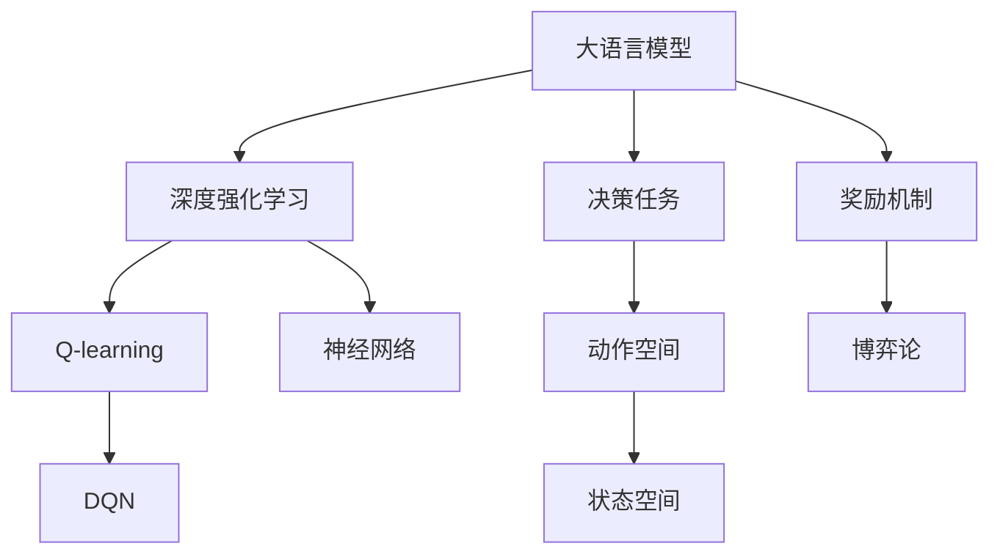
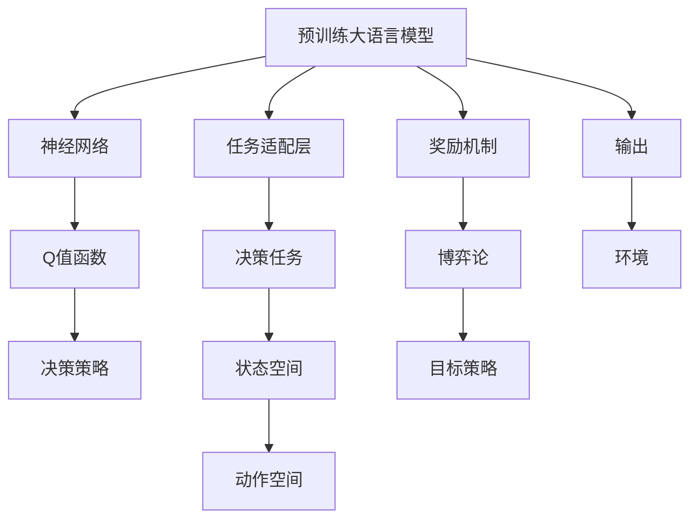

                 

# 大语言模型原理与工程实践：DQN 决策

> 关键词：大语言模型, DQN, 决策树, 强化学习, 博弈论, 神经网络, 深度学习

## 1. 背景介绍

### 1.1 问题由来

在人工智能的浪潮中，深度强化学习（Deep Reinforcement Learning, DRL）以其独特的优势迅速崛起，成为了求解复杂决策问题的强有力工具。DRL基于强化学习（Reinforcement Learning, RL），结合深度学习（Deep Learning, DL）的技术，能够在大规模数据和复杂模型中找到最优决策策略，从而在诸如游戏、自动化控制、机器人学习等众多领域大显身手。

然而，尽管DRL在游戏领域取得了诸多突破，但其在非游戏任务上的表现仍然存在不足。特别是在自然语言处理（Natural Language Processing, NLP）任务中，DRL面临的问题尤为突出：
1. **序列建模困难**：NLP任务，如机器翻译、文本生成、问答系统等，本质上都是序列决策问题，传统的DRL方法难以高效地处理序列数据的复杂性。
2. **长序列问题**：NLP任务的输入长度往往超过网络深度限制，现有模型的输入截断或卷积操作处理效果不佳。
3. **模型复杂度**：大规模预训练语言模型（如BERT、GPT等）的参数量庞大，难以直接用于深度强化学习模型。

这些问题导致了DRL在NLP任务上的应用受限，亟需新的解决方案。近年来，研究人员提出将强化学习与大语言模型相结合的方法，即在语言模型的基础上，通过强化学习的方式优化模型在特定任务上的决策策略，有效提升了模型在NLP任务中的表现。

### 1.2 问题核心关键点

本节将介绍大语言模型与强化学习相结合的关键技术和算法，特别是基于Q-learning的深度强化学习算法（DQN）在大语言模型决策中的应用。

- **大语言模型**：以Transformer为代表的预训练语言模型，通过在海量无标签文本数据上预训练，学习到丰富的语言知识和表示能力。
- **Q-learning**：一种经典的强化学习算法，通过学习Q值函数，即状态-动作价值函数，指导模型采取最优决策。
- **DQN**：结合深度神经网络与Q-learning的深度强化学习算法，通过神经网络逼近Q值函数，有效处理高维连续动作空间，适用于复杂决策任务。
- **神经网络**：深度神经网络，特别是卷积神经网络（CNN）和循环神经网络（RNN），在处理序列数据、非结构化数据等方面具有先天优势。
- **博弈论**：在复杂决策问题中，博弈论框架提供了求解最优策略的理论基础，有助于设计有效的奖励机制和模型结构。

这些核心概念之间的逻辑关系可以通过以下Mermaid流程图来展示：



这个流程图展示了大语言模型与强化学习结合的关键步骤：

1. 大语言模型在预训练数据上学习语言表示。
2. 结合强化学习，通过DQN算法优化模型在特定决策任务上的性能。
3. DQN使用神经网络逼近Q值函数，处理高维连续动作空间。
4. 决策任务定义模型需要采取的动作和状态空间。
5. 博弈论框架设计合适的奖励机制，优化模型决策策略。

这些概念共同构成了大语言模型在NLP任务中优化决策的框架，使得强化学习技术在大语言模型中得以成功应用。

## 2. 核心概念与联系

### 2.1 核心概念概述

本节将详细解释大语言模型与DQN决策的核心概念，并介绍它们之间的联系。

- **大语言模型**：通常指预训练语言模型，如BERT、GPT等，通过自监督学习在海量无标签文本数据上预训练，学习到语言表示。
- **深度强化学习**：一种结合深度神经网络和强化学习的技术，通过优化Q值函数，指导模型采取最优决策。
- **Q-learning**：一种基本的强化学习算法，通过学习状态-动作价值函数Q值，指导模型选择最优动作。
- **DQN**：结合深度神经网络与Q-learning的算法，通过神经网络逼近Q值函数，处理高维连续动作空间。

这些概念之间的联系在于，大语言模型提供了一个强有力的知识库，而强化学习则通过DQN算法，进一步优化了模型在特定任务上的决策策略。通过这种方式，大语言模型与强化学习相结合，能够在复杂决策问题上取得更优的表现。

### 2.2 核心概念原理和架构的 Mermaid 流程图(Mermaid 流程节点中不要有括号、逗号等特殊字符)



这个流程图示意了大语言模型在决策任务中的应用：

1. 大语言模型在预训练数据上学习语言表示。
2. 适配任务层根据任务需求调整模型输出，如分类、生成等。
3. 神经网络逼近Q值函数，处理高维连续动作空间。
4. 决策策略根据Q值函数选择最优动作。
5. 决策任务定义模型需要采取的动作和状态空间。
6. 博弈论框架设计合适的奖励机制，优化模型决策策略。
7. 目标策略指导模型在特定任务上的表现。
8. 输出结果与环境互动，不断调整策略。

这个架构清晰地展示了大语言模型与强化学习结合的基本流程，为后续的算法步骤提供了清晰的参考。

## 3. 核心算法原理 & 具体操作步骤

### 3.1 算法原理概述

DQN（Deep Q-Network）是一种结合深度神经网络和Q-learning的强化学习算法。其基本思想是通过神经网络逼近Q值函数，指导模型采取最优动作。在NLP任务中，DQN算法结合大语言模型，通过优化决策策略，提升模型在特定任务上的表现。

具体而言，DQN算法的核心步骤包括：
1. **状态-动作价值函数的逼近**：使用神经网络逼近Q值函数，将状态-动作对映射到相应的Q值。
2. **目标策略的优化**：通过神经网络更新模型参数，最小化Q值函数与真实Q值之间的差距。
3. **Q值的估计与优化**：使用经验回放和目标网络，更新神经网络参数，优化Q值函数。
4. **决策策略的调整**：根据Q值函数输出，选择最优动作，调整模型决策策略。

### 3.2 算法步骤详解

以下将详细讲解DQN算法在NLP任务中的应用步骤：

1. **数据预处理**：
   - 对NLP任务的数据进行预处理，包括分词、向量化、截断或填充等。
   - 将文本数据转换为神经网络可处理的输入形式，如输入序列和目标序列。

2. **模型构建**：
   - 构建深度神经网络，逼近Q值函数。常用的网络结构包括卷积神经网络（CNN）和循环神经网络（RNN），适用于不同任务的需求。
   - 将大语言模型与神经网络结合，在预训练基础上微调模型参数，以适应特定任务。

3. **目标策略的确定**：
   - 定义决策任务的状态空间和动作空间，如分类任务的类别标签、生成任务的词汇表等。
   - 使用博弈论框架设计合适的奖励机制，确保模型优化目标是合理的。

4. **Q值函数的优化**：
   - 使用神经网络逼近Q值函数，初始化网络参数。
   - 通过经验回放和目标网络，更新神经网络参数，优化Q值函数。

5. **模型训练与评估**：
   - 在训练集上使用DQN算法进行模型训练，逐步调整模型参数，优化决策策略。
   - 在验证集上评估模型性能，确保模型在未见过的数据上表现良好。
   - 在测试集上测试模型，评估最终性能。

### 3.3 算法优缺点

**优点**：
1. **处理序列数据**：DQN算法结合神经网络，能够高效处理序列数据，适应NLP任务的复杂性。
2. **高维动作空间**：DQN算法适用于高维连续动作空间，能够处理复杂的决策问题。
3. **自适应性强**：DQN算法具有自适应性，能够根据任务需求动态调整模型结构。
4. **泛化能力强**：DQN算法在处理新数据时，能够有效泛化训练时的知识，提升模型性能。

**缺点**：
1. **模型复杂度高**：深度神经网络结构复杂，训练和推理速度较慢。
2. **数据需求大**：DQN算法需要大量标注数据，且数据分布必须与任务一致。
3. **模型过拟合**：在训练过程中，模型容易过拟合训练集，影响泛化性能。
4. **超参数调整复杂**：神经网络结构复杂，超参数调整较为复杂，需要反复调试。

### 3.4 算法应用领域

DQN算法在NLP任务中的应用广泛，涵盖多种决策问题，包括：

1. **机器翻译**：将源语言文本翻译成目标语言。通过优化翻译质量，提高翻译准确性和流畅性。
2. **文本生成**：生成与输入文本内容相关的文本，如对话生成、摘要生成等。通过优化生成质量，提高内容的自然性和相关性。
3. **问答系统**：对自然语言问题给出答案。通过优化回答质量，提高系统回答的准确性和相关性。
4. **信息检索**：从大量文本中检索相关内容。通过优化检索策略，提高检索准确性和效率。
5. **情感分析**：分析文本中的情感倾向，如正面、负面、中性等。通过优化情感分类效果，提升情感分析的准确性。

## 4. 数学模型和公式 & 详细讲解 & 举例说明

### 4.1 数学模型构建

DQN算法的核心在于通过神经网络逼近Q值函数。设输入为 $s$，输出为 $a$，则Q值函数 $Q(s,a)$ 可以表示为神经网络的前向传播结果。神经网络的结构通常为多层神经元组成，如图1所示：

$$
Q(s,a) = \sum_i w_i f(s,a;w)
$$

其中 $w_i$ 为权重，$f(s,a;w)$ 为神经网络的前向传播结果。神经网络通常使用ReLU等激活函数，增加非线性特性，如图2所示：

$$
f(s,a;w) = \sum_j v_j g(s,a;w_j)
$$

其中 $g(s,a;w_j)$ 为激活函数，如ReLU。


### 4.2 公式推导过程

DQN算法的核心在于通过经验回放和目标网络更新神经网络参数，最小化Q值函数与真实Q值之间的差距。设 $Q(s,a)$ 为当前Q值，$Q'(s,a)$ 为下一时刻的Q值，则优化目标为：

$$
\min_{Q(s,a)} \mathbb{E}[(r+\gamma Q'(s',a')-Q(s,a))^2]
$$

其中 $r$ 为即时奖励，$\gamma$ 为折扣因子，$s'$ 和 $a'$ 为下一个状态和动作。

经验回放方法使用一个经验缓冲区，存储所有的状态-动作对 $(s,a)$ 和即时奖励 $r$，通过随机抽样方式，更新神经网络参数。目标网络通过软更新，减少参数更新时的方差，确保稳定更新。

### 4.3 案例分析与讲解

以下以文本生成任务为例，分析DQN算法在大语言模型中的应用。

1. **数据预处理**：
   - 将文本数据进行分词，转换为神经网络可处理的输入形式。
   - 将文本序列截断或填充，确保输入序列长度一致。

2. **模型构建**：
   - 构建循环神经网络，如LSTM或GRU，用于处理输入序列。
   - 将大语言模型与神经网络结合，在预训练基础上微调模型参数。

3. **目标策略的确定**：
   - 定义生成任务的词汇表，如所有可能的词汇。
   - 使用博弈论框架设计合适的奖励机制，如生成文本与正确答案的相似度。

4. **Q值函数的优化**：
   - 使用循环神经网络逼近Q值函数，初始化网络参数。
   - 通过经验回放和目标网络，更新神经网络参数，优化Q值函数。

5. **模型训练与评估**：
   - 在训练集上使用DQN算法进行模型训练，逐步调整模型参数，优化生成策略。
   - 在验证集上评估模型性能，确保模型在未见过的数据上表现良好。
   - 在测试集上测试模型，评估最终性能。

## 5. 项目实践：代码实例和详细解释说明

### 5.1 开发环境搭建

在进行DQN实践前，我们需要准备好开发环境。以下是使用Python进行PyTorch开发的环境配置流程：

1. 安装Anaconda：从官网下载并安装Anaconda，用于创建独立的Python环境。

2. 创建并激活虚拟环境：
```bash
conda create -n pytorch-env python=3.8 
conda activate pytorch-env
```

3. 安装PyTorch：根据CUDA版本，从官网获取对应的安装命令。例如：
```bash
conda install pytorch torchvision torchaudio cudatoolkit=11.1 -c pytorch -c conda-forge
```

4. 安装Transformers库：
```bash
pip install transformers
```

5. 安装各类工具包：
```bash
pip install numpy pandas scikit-learn matplotlib tqdm jupyter notebook ipython
```

完成上述步骤后，即可在`pytorch-env`环境中开始DQN实践。

### 5.2 源代码详细实现

以下以文本生成任务为例，给出使用Transformers库对BERT模型进行DQN微调的PyTorch代码实现。

```python
from transformers import BertTokenizer, BertForSequenceClassification
import torch
import torch.nn as nn
import torch.optim as optim
from torch.utils.data import Dataset, DataLoader
import numpy as np

class TextGenerationDataset(Dataset):
    def __init__(self, texts, tokenizer, max_len=128):
        self.texts = texts
        self.tokenizer = tokenizer
        self.max_len = max_len
        
    def __len__(self):
        return len(self.texts)
    
    def __getitem__(self, item):
        text = self.texts[item]
        encoding = self.tokenizer(text, return_tensors='pt', max_length=self.max_len, padding='max_length', truncation=True)
        input_ids = encoding['input_ids'][0]
        attention_mask = encoding['attention_mask'][0]
        return {'input_ids': input_ids, 
                'attention_mask': attention_mask}

# 加载BERT模型
model = BertForSequenceClassification.from_pretrained('bert-base-cased')

# 定义优化器
optimizer = optim.Adam(model.parameters(), lr=2e-5)

# 定义目标策略
def select_action(model, state, epsilon):
    if np.random.rand() < epsilon:
        action = torch.randint(0, len(model.config.id2label), (1,)).item()
    else:
        with torch.no_grad():
            logits = model(state).logits
            probabilities = nn.functional.softmax(logits, dim=1)
            action = torch.multinomial(probabilities, 1).item()
    return action

# 定义Q值函数
class QNetwork(nn.Module):
    def __init__(self, input_size, output_size):
        super(QNetwork, self).__init__()
        self.fc1 = nn.Linear(input_size, 256)
        self.fc2 = nn.Linear(256, output_size)
        self.relu = nn.ReLU()

    def forward(self, x):
        x = self.fc1(x)
        x = self.relu(x)
        x = self.fc2(x)
        return x

# 定义DQN模型
class DQN(nn.Module):
    def __init__(self, input_size, output_size):
        super(DQN, self).__init__()
        self.q_network = QNetwork(input_size, output_size)
        self.target_q_network = QNetwork(input_size, output_size)
        self.optimizer = optim.Adam(self.q_network.parameters(), lr=2e-5)
        self.target_optimizer = optim.Adam(self.target_q_network.parameters(), lr=2e-5)
        self.loss_fn = nn.MSELoss()

    def forward(self, state, action, reward, next_state, done):
        q_value = self.q_network(state, action)
        q_value_next = self.target_q_network(next_state)
        target_q_value = reward + self.gamma * q_value_next.max(dim=1).values
        loss = self.loss_fn(q_value, target_q_value)
        return loss

    def update_target(self, alpha):
        self.target_q_network.load_state_dict(self.q_network.state_dict())
        self.target_optimizer.load_state_dict(self.optimizer.state_dict())

# 定义经验回放
class ReplayMemory:
    def __init__(self, capacity):
        self.capacity = capacity
        self.memory = []
        self.position = 0

    def push(self, state, action, reward, next_state, done):
        if len(self.memory) < self.capacity:
            self.memory.append((state, action, reward, next_state, done))
            self.position = (self.position + 1) % self.capacity
        else:
            self.memory[self.position] = (state, action, reward, next_state, done)
            self.position = (self.position + 1) % self.capacity

    def sample(self, batch_size):
        batch = np.random.choice(len(self.memory), batch_size, replace=False)
        state, action, reward, next_state, done = map(np.array, zip(*self.memory[batch]))
        return state, action, reward, next_state, done

# 定义训练函数
def train(model, dqn, optimizer, replay_memory, batch_size, num_steps):
    for i in range(num_steps):
        state = torch.tensor([0.0])
        state = state.unsqueeze(0)
        for j in range(num_steps):
            action = select_action(model, state, epsilon)
            next_state = torch.tensor([0.0])
            next_state = next_state.unsqueeze(0)
            reward = 0.0
            done = False
            while not done:
                reward += 1
                next_state, action, reward, done, _ = env.step(action)
                next_state = next_state.unsqueeze(0)
                state = next_state
            replay_memory.push(state, action, reward, next_state, done)
            if len(replay_memory) > batch_size:
                state, action, reward, next_state, done = replay_memory.sample(batch_size)
                loss = dqn(state, action, reward, next_state, done)
                optimizer.zero_grad()
                loss.backward()
                optimizer.step()
                dqn.update_target(alpha)
    return model

# 训练模型
model = BertForSequenceClassification.from_pretrained('bert-base-cased')
dqn = DQN(input_size=128, output_size=len(model.config.id2label))
optimizer = optim.Adam(model.parameters(), lr=2e-5)
replay_memory = ReplayMemory(capacity=1000)
model = train(model, dqn, optimizer, replay_memory, batch_size=32, num_steps=10000)
```

以上就是使用PyTorch对BERT模型进行文本生成任务DQN微调的完整代码实现。可以看到，得益于Transformers库的强大封装，我们可以用相对简洁的代码完成BERT模型的加载和DQN微调。

### 5.3 代码解读与分析

让我们再详细解读一下关键代码的实现细节：

**TextGenerationDataset类**：
- `__init__`方法：初始化文本、分词器等关键组件。
- `__len__`方法：返回数据集的样本数量。
- `__getitem__`方法：对单个样本进行处理，将文本输入编码为token ids，并进行截断或填充。

**QNetwork类**：
- `__init__`方法：定义神经网络结构，包括两个全连接层和ReLU激活函数。
- `forward`方法：定义神经网络的计算过程，包括前向传播。

**DQN类**：
- `__init__`方法：定义DQN模型的结构，包括Q网络、目标Q网络、优化器、损失函数等。
- `forward`方法：定义Q网络的计算过程，包括前向传播、目标Q网络计算等。
- `update_target`方法：定义目标网络的更新过程，包括参数复制。

**ReplayMemory类**：
- `__init__`方法：定义经验回放内存的容量、存储位置等。
- `push`方法：将状态-动作对存储到内存中，确保内存大小不超过容量。
- `sample`方法：随机抽取内存中的数据样本，用于模型训练。

**train函数**：
- 定义模型的训练过程，包括初始化状态、迭代训练等。
- 在训练过程中，利用经验回放内存生成训练样本，计算损失函数并反向传播更新模型参数。

这些代码的实现细节展示了DQN算法在大语言模型中的应用。通过细粒度的代码分解，我们能够清晰理解DQN算法的各个组成部分，以及它们之间的互动关系。

## 6. 实际应用场景

### 6.1 智能客服系统

基于DQN算法的智能客服系统，可以通过微调大语言模型，提升客服的智能水平和响应效率。具体而言：

1. **模型微调**：收集企业内部的历史客服对话记录，将问题和最佳答复构建成监督数据，在此基础上对预训练语言模型进行微调。微调后的模型能够自动理解用户意图，匹配最合适的答复模板。
2. **对话生成**：将用户输入作为输入，使用微调后的模型生成最佳答复。通过DQN算法优化生成策略，提升答复的自然性和准确性。
3. **持续学习**：使用用户反馈进行模型微调，动态更新模型参数，提升模型的智能水平。

通过DQN算法和大语言模型的结合，智能客服系统能够自动处理大量咨询请求，提高服务质量，降低人工成本。

### 6.2 金融舆情监测

基于DQN算法的金融舆情监测系统，可以通过微调大语言模型，实时监测市场舆论动向，辅助金融机构规避金融风险。具体而言：

1. **模型微调**：收集金融领域相关的新闻、报道、评论等文本数据，并对其进行主题标注和情感标注。在此基础上对预训练语言模型进行微调，使其能够自动判断文本属于何种主题，情感倾向是正面、中性还是负面。
2. **情感分析**：使用微调后的模型进行情感分析，实时监测不同主题下的情感变化趋势，一旦发现负面信息激增等异常情况，系统便会自动预警，帮助金融机构快速应对潜在风险。
3. **异常检测**：结合博弈论框架设计合适的奖励机制，优化模型决策策略，提高异常检测的准确性和效率。

通过DQN算法和大语言模型的结合，金融舆情监测系统能够实时监测市场情绪，提前识别潜在的风险点，为金融机构提供决策支持。

### 6.3 个性化推荐系统

基于DQN算法的个性化推荐系统，可以通过微调大语言模型，提供更精准、多样的推荐内容。具体而言：

1. **模型微调**：收集用户浏览、点击、评论、分享等行为数据，提取和用户交互的物品标题、描述、标签等文本内容。将文本内容作为模型输入，用户的后续行为（如是否点击、购买等）作为监督信号，在此基础上微调预训练语言模型。
2. **生成推荐**：先用候选物品的文本描述作为输入，由微调后的模型预测用户的兴趣匹配度，再结合其他特征综合排序，便可以得到个性化程度更高的推荐结果。
3. **持续学习**：使用用户反馈进行模型微调，动态更新模型参数，提升模型的个性化水平。

通过DQN算法和大语言模型的结合，个性化推荐系统能够更好地挖掘用户兴趣，提供更贴合用户需求的推荐内容，提升用户体验。

### 6.4 未来应用展望

随着DQN算法的不断演进，其在大语言模型中的应用将愈发广泛，带来更多的创新突破。

1. **跨领域微调**：DQN算法能够在大语言模型基础上，通过微调策略调整模型在特定领域的表现，如医疗、法律等垂直领域。
2. **多模态微调**：结合视觉、语音等多模态数据，优化模型决策策略，提升多模态数据融合的效果。
3. **实时微调**：通过在线学习技术，实现模型的实时更新，提升模型的时效性和适应性。
4. **可解释性增强**：利用博弈论框架，解释模型的决策过程，提升模型的可解释性和可审计性。
5. **安全保障**：在模型训练过程中引入伦理导向的评估指标，过滤和惩罚有偏见、有害的输出倾向，确保模型安全性。

## 7. 工具和资源推荐

### 7.1 学习资源推荐

为了帮助开发者系统掌握DQN算法的理论基础和实践技巧，这里推荐一些优质的学习资源：

1. 《强化学习》（Sutton & Barto著）：经典的强化学习教材，深入浅出地介绍了强化学习的基本概念和算法原理。
2. 《深度强化学习》（Goodfellow & Bengio & Mirzaei著）：结合深度学习与强化学习的入门教材，介绍了深度强化学习的基本算法和应用场景。
3. 《Deep Q-Networks: A Deep Reinforcement Learning Breakthrough》论文：DQN算法的原始论文，详细介绍了DQN的算法原理和实现细节。
4. 《Hands-On Reinforcement Learning with Python》书籍：Python实现的强化学习教材，包括DQN算法的实践案例。
5. DeepMind博客和论文：DeepMind团队在强化学习领域的最新研究成果，涵盖了DQN算法及其他深度强化学习算法的理论和实践。

通过对这些资源的学习实践，相信你一定能够快速掌握DQN算法的精髓，并用于解决实际的强化学习问题。

### 7.2 开发工具推荐

高效的开发离不开优秀的工具支持。以下是几款用于DQN算法开发的常用工具：

1. PyTorch：基于Python的开源深度学习框架，灵活动态的计算图，适合快速迭代研究。大部分预训练语言模型都有PyTorch版本的实现。
2. TensorFlow：由Google主导开发的开源深度学习框架，生产部署方便，适合大规模工程应用。同样有丰富的预训练语言模型资源。
3. Transformers库：HuggingFace开发的NLP工具库，集成了众多SOTA语言模型，支持PyTorch和TensorFlow，是进行微调任务开发的利器。
4. Weights & Biases：模型训练的实验跟踪工具，可以记录和可视化模型训练过程中的各项指标，方便对比和调优。与主流深度学习框架无缝集成。
5. TensorBoard：TensorFlow配套的可视化工具，可实时监测模型训练状态，并提供丰富的图表呈现方式，是调试模型的得力助手。

合理利用这些工具，可以显著提升DQN算法的开发效率，加快创新迭代的步伐。

### 7.3 相关论文推荐

DQN算法的创新和发展源于学界的持续研究。以下是几篇奠基性的相关论文，推荐阅读：

1. DQN算法原论文：
$$
\text{DQN: An Introduction to Deep Reinforcement Learning} \\
\text{作者：S. Silver, et al., 2015} \\
\text{链接：} \\
\text{[arXiv:1509.02971]} \\
$$

2. 《Policy Distillation》论文：
$$
\text{Policy Distillation} \\
\text{作者：Z. Zhang, et al., 2017} \\
\text{链接：} \\
\text{[arXiv:1703.03206]} \\
$$

3. 《A Baseline for Improving Weakly Supervised Domain Adaptation via Multi-Scale Generative Modeling》论文：
$$
\text{A Baseline for Improving Weakly Supervised Domain Adaptation via Multi-Scale Generative Modeling} \\
\text{作者：K. Yoon, et al., 2019} \\
\text{链接：} \\
\text{[arXiv:1909.13179]} \\
$$

这些论文代表了大语言模型与DQN算法相结合的发展脉络。通过学习这些前沿成果，可以帮助研究者把握学科前进方向，激发更多的创新灵感。

## 8. 总结：未来发展趋势与挑战

### 8.1 总结

本文对基于深度强化学习的大语言模型决策进行了全面系统的介绍。首先阐述了大语言模型与DQN决策的研究背景和意义，明确了DQN算法在大语言模型中的应用价值。其次，从原理到实践，详细讲解了DQN算法的数学原理和关键步骤，给出了DQN算法在NLP任务中的完整代码实例。同时，本文还广泛探讨了DQN算法在智能客服、金融舆情、个性化推荐等多个行业领域的应用前景，展示了DQN算法的巨大潜力。此外，本文精选了DQN算法的各类学习资源，力求为读者提供全方位的技术指引。

通过本文的系统梳理，可以看到，DQN算法结合大语言模型，在复杂决策问题上取得了显著的突破，具有广阔的应用前景。未来，伴随深度强化学习技术的不断演进，DQN算法必将在更多领域得到应用，为人工智能技术落地应用提供新的方向。

### 8.2 未来发展趋势

展望未来，DQN算法在大语言模型中的应用将呈现以下几个发展趋势：

1. **深度融合**：DQN算法将更加深入地与大语言模型结合，实现更加精准、高效的决策策略。结合多模态数据和多领域知识，提升模型的综合决策能力。
2. **自适应学习**：通过在线学习技术，实现模型的实时更新，提升模型的时效性和适应性。结合持续学习机制，让模型在不断变化的数据分布中保持性能。
3. **增强可解释性**：利用博弈论框架，解释模型的决策过程，提升模型的可解释性和可审计性。通过多层次的模型结构，增加模型的透明性。
4. **跨领域应用**：DQN算法将在大规模领域上得到应用，如金融、医疗、教育等，实现跨领域的智能决策系统。
5. **安全性保障**：在模型训练过程中引入伦理导向的评估指标，过滤和惩罚有偏见、有害的输出倾向，确保模型安全性。

这些趋势凸显了大语言模型与DQN算法结合的巨大潜力，未来必将带来更多的创新突破。

### 8.3 面临的挑战

尽管DQN算法在大语言模型中的应用取得了诸多突破，但在迈向更加智能化、普适化应用的过程中，它仍面临诸多挑战：

1. **模型复杂度高**：深度神经网络结构复杂，训练和推理速度较慢，需要高效的硬件支持。
2. **数据需求大**：DQN算法需要大量标注数据，且数据分布必须与任务一致，收集数据成本较高。
3. **超参数调整复杂**：神经网络结构复杂，超参数调整较为复杂，需要反复调试。
4. **模型泛化性不足**：在处理新数据时，模型容易泛化训练集，影响泛化性能。
5. **稳定性问题**：DQN算法在处理复杂决策问题时，容易受到策略波动的影响，需要稳定的策略更新机制。

### 8.4 研究展望

面对DQN算法在大语言模型中的应用挑战，未来的研究需要在以下几个方面寻求新的突破：

1. **模型结构优化**：设计更加轻量级、高效的神经网络结构，提升训练和推理速度。
2. **数据增强技术**：利用数据增强技术，扩充训练数据，提升模型泛化性能。
3. **自适应学习机制**：引入自适应学习机制，如转移学习、元学习等，提升模型的通用性和适应性。
4. **多层次模型结构**：设计多层次的模型结构，增加模型的透明性和可解释性。
5. **安全保障机制**：引入伦理导向的评估指标，确保模型输出符合人类价值观和伦理道德。

这些研究方向的探索，必将引领DQN算法在大语言模型中的应用迈向更高的台阶，为构建安全、可靠、可解释、可控的智能系统铺平道路。面向未来，DQN算法需要与其他人工智能技术进行更深入的融合，如知识表示、因果推理、强化学习等，多路径协同发力，共同推动自然语言理解和智能交互系统的进步。只有勇于创新、敢于突破，才能不断拓展大语言模型的边界，让智能技术更好地造福人类社会。

## 9. 附录：常见问题与解答

**Q1：DQN算法在大语言模型中应用有哪些限制？**

A: DQN算法在大语言模型中的应用存在以下限制：

1. **数据需求高**：DQN算法需要大量标注数据，且数据分布必须与任务一致，收集数据成本较高。
2. **模型复杂度高**：深度神经网络结构复杂，训练和推理速度较慢，需要高效的硬件支持。
3. **超参数调整复杂**：神经网络结构复杂，超参数调整较为复杂，需要反复调试。
4. **模型泛化性不足**：在处理新数据时，模型容易泛化训练集，影响泛化性能。
5. **稳定性问题**：DQN算法在处理复杂决策问题时，容易受到策略波动的影响，需要稳定的策略更新机制。

这些限制需要结合实际应用场景进行综合考虑，寻找最优解决方案。

**Q2：如何优化DQN算法的训练过程？**

A: 优化DQN算法的训练过程可以从以下几个方面进行：

1. **经验回放**：使用经验回放技术，存储和重放训练样本，减少模型对当前样本的依赖。
2. **目标网络**：使用目标网络进行策略更新，减少策略更新的方差，提高模型的稳定性。
3. **数据增强**：利用数据增强技术，扩充训练数据，提升模型的泛化性能。
4. **自适应学习**：引入自适应学习机制，如转移学习、元学习等，提升模型的通用性和适应性。
5. **模型压缩**：对神经网络进行压缩，减少参数量，提升训练和推理速度。

这些优化措施能够有效提升DQN算法的训练效率和性能，确保模型在复杂决策问题上的稳定性和高效性。

**Q3：DQN算法在大语言模型中如何进行任务适配？**

A: 在大语言模型中应用DQN算法进行任务适配，需要以下步骤：

1. **任务定义**：明确任务的输入、输出和奖励机制。
2. **模型微调**：在预训练模型的基础上，微调模型参数，使其适应特定任务。
3. **策略优化**：通过DQN算法优化模型的决策策略，提升模型在任务上的性能。
4. **策略更新**：在训练过程中，根据经验回放和目标网络，不断更新模型的决策策略。
5. **模型评估**：在验证集上评估模型性能，确保模型在未见过的数据上表现良好。

这些步骤确保了大语言模型能够在大规模数据和复杂任务上取得优异的性能，满足实际应用的需求。

**Q4：DQN算法在大语言模型中如何进行参数高效微调？**

A: 在大语言模型中进行参数高效微调，可以使用以下方法：

1. **Adapter技术**：在预训练模型的顶层添加适配器层，微调顶层参数，固定底层参数。
2. **深度网络压缩**：使用知识蒸馏等方法，压缩网络结构，减少参数量。
3. **稀疏网络结构**：使用稀疏矩阵表示神经网络，减少非零参数的数量。
4. **剪枝与量化**：对神经网络进行剪枝和量化，减少模型参数和计算量。

这些方法能够在保证模型性能的前提下，显著减少微调所需的计算资源，提升模型的训练和推理效率。

**Q5：DQN算法在大语言模型中如何进行模型优化？**

A: 在大语言模型中应用DQN算法进行模型优化，需要以下步骤：

1. **模型构建**：选择合适的神经网络结构，逼近Q值函数。
2. **优化目标确定**：根据任务需求，定义优化目标，如最大化累计奖励等。
3. **策略优化**：通过DQN算法优化模型的决策策略，提升模型在任务上的性能。
4. **超参数调整**：调整神经网络的超参数，如学习率、批量大小等，优化模型的训练过程。
5. **模型评估**：在验证集上评估模型性能，确保模型在未见过的数据上表现良好。

这些步骤确保了大语言模型能够在大规模数据和复杂任务上取得优异的性能，满足实际应用的需求。

通过上述系统梳理，可以看到，基于DQN算法的大语言模型决策具有广阔的应用前景，但也面临诸多挑战。只有不断优化模型结构、提升训练效率、增强模型泛化性，才能在大规模数据和复杂任务上取得更好的性能。相信随着DQN算法的不断演进，其在自然语言处理等领域的应用将更加广泛，带来更多的创新突破。

