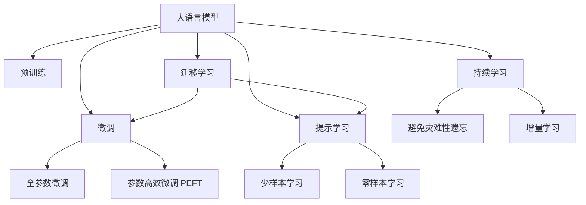

                 

# 大语言模型原理与工程实践：大语言模型微调的挑战和探索

## 1. 背景介绍

### 1.1 问题由来
近年来，深度学习技术在自然语言处理(NLP)领域取得了显著进展。基于大规模预训练语言模型(Large Language Model, LLM)的微调方法，能够显著提升模型在特定下游任务上的性能。例如，在问答、翻译、情感分析等任务上，微调后的BERT、GPT等大模型已经达到了最先进水平。然而，在大规模预训练模型的微调过程中，仍面临诸多挑战。

这些挑战包括：
- 微调过程依赖于少量标注数据，数据获取成本较高。
- 预训练模型可能存在固有偏见，需要防止这些偏见被微调放大。
- 大模型推理速度较慢，如何在保持高精度的同时提升推理效率。
- 微调模型的可解释性差，难以对其进行调试和优化。
- 如何确保微调模型的鲁棒性和安全性，防止潜在风险。

本文将系统介绍大语言模型微调的原理与工程实践，探讨当前面临的挑战与可能的解决策略，并展望未来发展方向。

### 1.2 问题核心关键点
大语言模型微调的核心在于如何将通用大模型的知识迁移到特定任务上，提升模型性能。其主要步骤如下：
1. **预训练模型选择**：选择合适的预训练模型作为微调的起点。
2. **任务适配层设计**：根据任务类型，设计并添加适应该任务的任务适配层。
3. **微调参数更新**：使用标注数据，通过优化算法更新模型参数。
4. **结果评估与部署**：在测试集上评估微调模型性能，并部署到实际应用中。

在微调过程中，需要进行参数更新、正则化、数据增强等操作，以确保模型在少量标注数据上表现良好。

## 2. 核心概念与联系

### 2.1 核心概念概述

为更好地理解大语言模型微调，需明确以下核心概念：

- **大语言模型(LLM)**：通过大规模无标签数据进行预训练，学习通用语言表示的语言模型，如BERT、GPT-3等。
- **预训练(Pre-training)**：在大规模无标签数据上，通过自监督学习任务训练通用语言模型，如 masked language modeling。
- **微调(Fine-tuning)**：在大规模预训练模型的基础上，使用下游任务的少量标注数据，优化模型在该任务上的性能。
- **迁移学习(Transfer Learning)**：将一个领域学到的知识，迁移到另一个领域，如微调过程。
- **参数高效微调(PEFT)**：在微调过程中，只更新少量的模型参数，固定大部分预训练权重不变。
- **提示学习(Prompt Learning)**：通过在输入文本中添加提示模板，引导模型按期望方式输出，减少微调参数。
- **少样本学习(Few-shot Learning)**：在只有少量标注样本的情况下，模型能够快速适应新任务。
- **零样本学习(Zero-shot Learning)**：在模型未见过特定任务的情况下，根据任务描述进行推理。
- **持续学习(Continual Learning)**：模型能够持续从新数据中学习，同时保持已学习的知识。

这些概念通过以下Mermaid流程图进行关联展示：



该流程图展示了大语言模型的核心概念及其相互关系。

## 3. 核心算法原理 & 具体操作步骤

### 3.1 算法原理概述

基于监督学习的大语言模型微调，其本质是将预训练模型视作一个通用的特征提取器，通过有监督学习优化模型在特定任务上的性能。假设预训练模型为 $M_{\theta}$，下游任务的标注数据集为 $D=\{(x_i, y_i)\}_{i=1}^N$，微调的目标是找到最优参数 $\hat{\theta}$，使得模型在任务 $T$ 上表现最佳。

形式化地，微调目标为：

$$
\hat{\theta}=\mathop{\arg\min}_{\theta} \mathcal{L}(M_{\theta},D)
$$

其中 $\mathcal{L}$ 为针对任务 $T$ 设计的损失函数，衡量模型输出与真实标签的差异。

### 3.2 算法步骤详解

1. **准备预训练模型和数据集**：
   - 选择合适的预训练模型 $M_{\theta}$。
   - 准备下游任务 $T$ 的标注数据集 $D=\{(x_i, y_i)\}_{i=1}^N$，分为训练集、验证集和测试集。

2. **添加任务适配层**：
   - 根据任务类型，设计合适的输出层和损失函数。
   - 例如，分类任务使用线性分类器和交叉熵损失。

3. **设置微调超参数**：
   - 选择合适的优化算法及其参数，如 AdamW、SGD。
   - 设置学习率、批大小、迭代轮数等。

4. **执行梯度训练**：
   - 将训练集数据分批次输入模型，计算损失函数。
   - 反向传播计算参数梯度，根据优化算法更新模型参数。
   - 周期性在验证集上评估模型性能，必要时停止训练。

5. **测试和部署**：
   - 在测试集上评估微调后模型 $M_{\hat{\theta}}$ 的性能。
   - 使用微调后的模型进行推理预测，部署到实际应用中。

### 3.3 算法优缺点

基于监督学习的大语言模型微调方法具有以下优点：
1. 简单高效，只需少量标注数据即可快速适配特定任务。
2. 通用性强，适用于各种NLP任务。
3. 参数效率高，部分参数固定，减少微调参数量。
4. 效果显著，在多个任务上取得了最先进性能。

同时，也存在以下缺点：
1. 依赖标注数据，数据获取成本高。
2. 迁移能力有限，模型对数据分布差异敏感。
3. 可能存在偏见，需谨慎处理。
4. 可解释性差，难以调试和优化。

## 4. 数学模型和公式 & 详细讲解

### 4.1 数学模型构建

假设预训练模型 $M_{\theta}$ 在输入 $x$ 上的输出为 $\hat{y}=M_{\theta}(x) \in [0,1]$，表示样本属于正类的概率。假设真实标签 $y \in \{0,1\}$，则二分类交叉熵损失函数为：

$$
\ell(M_{\theta}(x),y) = -[y\log \hat{y} + (1-y)\log (1-\hat{y})]
$$

微调目标函数为：

$$
\mathcal{L}(\theta) = -\frac{1}{N}\sum_{i=1}^N [y_i\log M_{\theta}(x_i)+(1-y_i)\log(1-M_{\theta}(x_i))]
$$

模型参数更新公式为：

$$
\theta \leftarrow \theta - \eta \nabla_{\theta}\mathcal{L}(\theta) - \eta\lambda\theta
$$

其中 $\eta$ 为学习率，$\lambda$ 为正则化系数。

### 4.2 公式推导过程

以二分类任务为例，推导交叉熵损失函数及其梯度的计算公式。假设模型输出为 $\hat{y}=M_{\theta}(x) \in [0,1]$，真实标签为 $y \in \{0,1\}$，则交叉熵损失函数为：

$$
\ell(M_{\theta}(x),y) = -[y\log \hat{y} + (1-y)\log (1-\hat{y})]
$$

将其代入经验风险公式，得：

$$
\mathcal{L}(\theta) = -\frac{1}{N}\sum_{i=1}^N [y_i\log M_{\theta}(x_i)+(1-y_i)\log(1-M_{\theta}(x_i))]
$$

根据链式法则，损失函数对参数 $\theta_k$ 的梯度为：

$$
\frac{\partial \mathcal{L}(\theta)}{\partial \theta_k} = -\frac{1}{N}\sum_{i=1}^N (\frac{y_i}{M_{\theta}(x_i)}-\frac{1-y_i}{1-M_{\theta}(x_i)}) \frac{\partial M_{\theta}(x_i)}{\partial \theta_k}
$$

其中 $\frac{\partial M_{\theta}(x_i)}{\partial \theta_k}$ 可进一步递归展开，利用自动微分技术完成计算。

### 4.3 案例分析与讲解

以情感分析任务为例，构建情感分类模型。假设训练集为 $\{(x_i, y_i)\}_{i=1}^N$，其中 $x_i$ 为文本，$y_i$ 为情感标签（正面、负面、中性）。设计模型为BERT+全连接层，损失函数为交叉熵损失。

首先，使用 BERT 模型对文本 $x_i$ 进行编码，得到上下文表示 $h_i$。然后，使用全连接层对 $h_i$ 进行分类，得到情感概率分布 $p(y|h_i)$。

模型参数更新公式为：

$$
\theta \leftarrow \theta - \eta \nabla_{\theta}\mathcal{L}(\theta) - \eta\lambda\theta
$$

其中 $\nabla_{\theta}\mathcal{L}(\theta)$ 为损失函数对模型参数的梯度，可通过反向传播算法高效计算。

## 5. 项目实践：代码实例和详细解释说明

### 5.1 开发环境搭建

1. 安装 Anaconda，创建虚拟环境。
2. 安装 PyTorch、Transformers 库，以及其他所需工具包。
3. 准备好预训练模型、标注数据集等。

### 5.2 源代码详细实现

以情感分析任务为例，展示使用 Transformers 库对 BERT 进行微调的代码实现。

```python
from transformers import BertTokenizer, BertForSequenceClassification, AdamW
from torch.utils.data import DataLoader
from tqdm import tqdm

# 初始化数据集
tokenizer = BertTokenizer.from_pretrained('bert-base-uncased')
train_dataset = ...
dev_dataset = ...
test_dataset = ...

# 初始化模型和优化器
model = BertForSequenceClassification.from_pretrained('bert-base-uncased', num_labels=3)
optimizer = AdamW(model.parameters(), lr=2e-5)

# 训练过程
epochs = 5
batch_size = 16

for epoch in range(epochs):
    train_loss = 0
    for batch in tqdm(train_dataset, desc='Training'):
        inputs = tokenizer(batch['text'], padding=True, truncation=True, max_length=256)
        labels = batch['label']
        outputs = model(**inputs)
        loss = outputs.loss
        train_loss += loss.item()
        loss.backward()
        optimizer.step()
        optimizer.zero_grad()

    train_loss /= len(train_dataset)
    print(f'Epoch {epoch+1}, train loss: {train_loss:.3f}')

# 评估过程
dev_loss = 0
for batch in tqdm(dev_dataset, desc='Evaluating'):
    inputs = tokenizer(batch['text'], padding=True, truncation=True, max_length=256)
    labels = batch['label']
    outputs = model(**inputs)
    loss = outputs.loss
    dev_loss += loss.item()

dev_loss /= len(dev_dataset)
print(f'Epoch {epoch+1}, dev loss: {dev_loss:.3f}')
```

### 5.3 代码解读与分析

以上代码主要实现以下功能：
1. 数据集处理：使用 BertTokenizer 对文本进行编码，转换为模型输入。
2. 模型初始化：使用 BertForSequenceClassification 加载预训练模型，并添加全连接层。
3. 训练过程：在训练集上进行有监督微调，更新模型参数。
4. 评估过程：在验证集上评估模型性能，输出损失。

## 6. 实际应用场景

### 6.4 未来应用展望

1. **智能客服系统**：通过微调模型，实现7x24小时不间断服务，快速响应客户咨询，提供自然流畅的对话体验。
2. **金融舆情监测**：实时监测市场舆论动向，辅助金融机构快速应对潜在风险。
3. **个性化推荐系统**：结合用户行为和文本信息，提供更精准、多样的推荐内容。
4. **智慧医疗**：微调模型辅助医生诊疗，加速新药开发进程。
5. **智能教育**：通过微调模型，因材施教，促进教育公平。

## 7. 工具和资源推荐

### 7.1 学习资源推荐

1. 《Transformer》书籍：详细介绍了 Transformers 库的使用。
2. 《深度学习自然语言处理》课程：斯坦福大学开设的 NLP 经典课程。
3. 《Natural Language Processing with Transformers》：介绍 Transformers 库的应用。
4. HuggingFace 官方文档：提供了丰富的预训练模型和微调样例。
5. CLUE 开源项目：包含多个 NLP 数据集和微调基准模型。

### 7.2 开发工具推荐

1. PyTorch：深度学习框架，支持动态计算图，适用于快速迭代研究。
2. TensorFlow：Google 开发的深度学习框架，生产部署方便。
3. Transformers 库：HuggingFace 提供的 NLP 工具库。
4. Weights & Biases：实验跟踪工具，用于记录模型训练过程。
5. TensorBoard：可视化工具，用于监测模型训练状态。
6. Google Colab：免费的 Jupyter Notebook 环境，支持 GPU/TPU 算力。

### 7.3 相关论文推荐

1. Attention is All You Need：提出 Transformer 结构，开启预训练语言模型时代。
2. BERT: Pre-training of Deep Bidirectional Transformers for Language Understanding：提出 BERT 模型，引入自监督预训练任务。
3. Language Models are Unsupervised Multitask Learners：展示大语言模型的零样本学习能力。
4. Parameter-Efficient Transfer Learning for NLP：提出 Adapter 等参数高效微调方法。
5. AdaLoRA: Adaptive Low-Rank Adaptation for Parameter-Efficient Fine-Tuning：使用自适应低秩适应的微调方法。
6. Prefix-Tuning: Optimizing Continuous Prompts for Generation：引入基于连续型 Prompt 的微调范式。

## 8. 总结：未来发展趋势与挑战

### 8.1 总结

本文对大语言模型微调的原理与工程实践进行了全面介绍。基于监督学习的大语言模型微调方法在NLP领域已取得显著成果，应用于智能客服、金融舆情监测、个性化推荐等多个领域。未来，大语言模型微调技术将继续拓展，提升模型的泛化能力和可解释性，解决实际应用中的问题。

### 8.2 未来发展趋势

1. **模型规模增大**：预训练模型的参数量将持续增长，带来更丰富的语言知识。
2. **微调方法多样**：引入参数高效、计算高效等方法，提升微调效率。
3. **持续学习常态化**：模型需持续学习新数据，保持性能。
4. **少样本学习提升**：利用 Prompt 技术，减少微调对标注样本的依赖。
5. **多模态微调**：融合视觉、语音等多模态数据，提升模型对现实世界的理解。
6. **通用性增强**：大语言模型将具备更强的常识推理和跨领域迁移能力。

### 8.3 面临的挑战

1. **标注成本高**：微调依赖少量标注数据，数据获取成本高。
2. **鲁棒性不足**：模型面对域外数据泛化能力有限。
3. **推理效率低**：模型推理速度慢，计算资源消耗大。
4. **可解释性差**：模型输出难以解释。
5. **安全性问题**：模型可能输出有害信息。
6. **知识整合能力不足**：模型难以灵活吸收外部知识。

### 8.4 研究展望

1. **无监督和半监督微调**：摆脱标注数据依赖，利用自监督学习。
2. **参数高效和计算高效微调**：优化微调模型，提升效率。
3. **因果学习和对比学习**：增强模型泛化能力和鲁棒性。
4. **知识表示和融合**：结合知识图谱、逻辑规则等专家知识。
5. **因果分析和博弈论**：优化模型行为，增强鲁棒性。
6. **伦理和安全约束**：确保模型输出符合伦理道德。

未来研究将在大规模数据、多模态融合、因果推理等领域取得突破，推动大语言模型微调技术的发展。

## 9. 附录：常见问题与解答

**Q1: 大语言模型微调是否适用于所有NLP任务？**

A: 大语言模型微调在大多数NLP任务上都能取得不错的效果，特别是数据量较小的任务。但特殊领域任务需进一步预训练，并针对任务进行适配。

**Q2: 微调过程中如何选择合适的学习率？**

A: 微调的学习率通常比预训练时小，从 $1 \times 10^{-5}$ 开始调参，逐步减小。

**Q3: 微调模型在落地部署时需要注意哪些问题？**

A: 模型裁剪、量化加速、服务化封装、弹性伸缩、监控告警、安全防护等。

**Q4: 如何缓解微调过程中的过拟合问题？**

A: 数据增强、正则化、对抗训练、参数高效微调等。

**Q5: 大语言模型微调面临的挑战有哪些？**

A: 标注成本高、鲁棒性不足、推理效率低、可解释性差、安全性问题、知识整合能力不足。

---

作者：禅与计算机程序设计艺术 / Zen and the Art of Computer Programming

