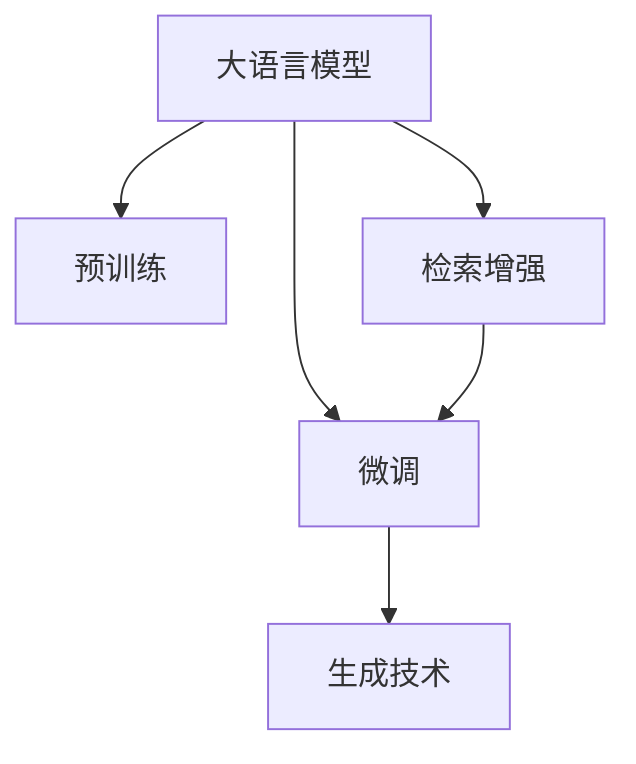

                 

# 大语言模型原理与工程实践：检索增强生成技术

> 关键词：大语言模型,检索增强,生成技术,自然语言处理(NLP),深度学习,代码实现,应用场景

## 1. 背景介绍

### 1.1 问题由来

随着深度学习技术的迅速发展，大语言模型(LLMs)在自然语言处理(NLP)领域取得了显著的突破。预训练大语言模型如GPT、BERT等，通过在大规模无标签文本数据上进行自监督预训练，学习到了通用的语言表示能力，能够处理各种复杂的语言理解和生成任务。然而，由于预训练数据的广泛性和泛化能力的不足，这些通用模型在特定领域的应用效果可能不尽如人意。因此，如何提升大语言模型在特定领域的性能，成为一个重要研究课题。

### 1.2 问题核心关键点

检索增强生成技术是一种在特定领域对大语言模型进行微调的有效方法，其核心在于利用大规模预训练模型在通用文本数据上学习到的知识，结合领域内的小规模标注数据，提升模型在特定领域的表现。具体来说，检索增强生成技术包含以下几个关键点：

1. 使用预训练大语言模型作为初始化参数。
2. 在特定领域内构建小规模的标注数据集。
3. 通过检索技术从通用语料中提取相关文本，增强模型的知识库。
4. 在增强后的知识库上进行有监督的微调，提升模型在特定领域的性能。

## 2. 核心概念与联系

### 2.1 核心概念概述

为了更好地理解检索增强生成技术，本节将介绍一些核心概念及其相互关系：

- 大语言模型(LLM)：如GPT、BERT等，通过在大规模无标签文本数据上自监督预训练，学习通用的语言表示能力。
- 预训练：在大规模无标签文本数据上，通过自监督学习任务训练通用语言模型的过程。
- 微调(Fine-tuning)：在预训练模型的基础上，使用特定领域的小规模标注数据，通过有监督学习优化模型在该领域的表现。
- 检索增强(IR)：通过检索技术从通用语料中提取相关文本，增强模型的知识库，提升模型在特定领域的表现。
- 生成技术：利用大语言模型的语言生成能力，进行文本生成、摘要、翻译等任务。

这些概念之间的逻辑关系可以通过以下Mermaid流程图来展示：



这个流程图展示了大语言模型的核心概念及其之间的关系：

1. 大语言模型通过预训练获得基础能力。
2. 微调是对预训练模型进行特定领域的优化，以提升模型在该领域的表现。
3. 检索增强技术通过从通用语料中提取相关文本，增强模型的知识库。
4. 生成技术利用大语言模型的语言生成能力，进行文本生成、摘要、翻译等任务。

这些概念共同构成了大语言模型的学习和应用框架，使其能够在各种场景下发挥强大的语言理解和生成能力。通过理解这些核心概念，我们可以更好地把握检索增强生成技术的原理和应用方向。

## 3. 核心算法原理 & 具体操作步骤

### 3.1 算法原理概述

检索增强生成技术的基本思想是利用大语言模型的语言生成能力，结合领域内的相关文本信息，进行有针对性的微调，以提升模型在特定领域的表现。其核心在于两个步骤：

1. 检索：从大规模通用语料中，检索与特定领域相关的文本，构建领域知识库。
2. 生成：利用大语言模型的语言生成能力，结合领域知识库，生成高质量的文本内容。

### 3.2 算法步骤详解

#### 3.2.1 检索步骤

1. **构建领域知识库**：
   - 收集特定领域的大量文本数据，如医学文献、法律文书、财经新闻等。
   - 对文本进行预处理，如分词、去除停用词、构建倒排索引等。
   - 构建领域知识库，将检索后的文本索引存储，供后续检索使用。

2. **检索相关文本**：
   - 对于新的输入文本，通过倒排索引检索出相关的文本信息。
   - 可以选择不同的检索策略，如基于词频的检索、基于语义的检索等。
   - 对检索出的文本进行排序，选择最相关的文本作为增强的知识库。

#### 3.2.2 生成步骤

1. **模型加载与预处理**：
   - 加载预训练的大语言模型，如GPT、BERT等。
   - 对输入文本进行预处理，如分词、构建词向量表示等。

2. **增强知识库**：
   - 将检索出的相关文本信息，与输入文本拼接在一起，形成增强的知识库。
   - 对增强后的知识库进行预处理，如去除重复文本、排序、合并等。

3. **生成文本**：
   - 利用大语言模型的语言生成能力，结合增强的知识库，生成高质量的文本内容。
   - 可以根据生成任务的特定需求，设置不同的生成目标和约束条件，如生成文章的长度、风格、情感等。

#### 3.2.3 微调步骤

1. **模型微调**：
   - 在增强后的知识库上进行有监督的微调，优化模型在特定领域的表现。
   - 可以选择不同的微调目标，如分类、匹配、生成等。
   - 可以使用不同的微调算法，如全参数微调、参数高效微调等。

2. **性能评估**：
   - 在验证集上评估微调后模型的性能，选择最佳的微调参数和超参数组合。
   - 可以使用不同的评估指标，如准确率、召回率、F1-score等。

3. **部署与应用**：
   - 将微调后的模型集成到实际应用系统中，提供文本生成、摘要、翻译等服务。
   - 持续收集新数据，定期重新微调模型，以适应数据分布的变化。

### 3.3 算法优缺点

#### 3.3.1 优点

1. **高效性**：利用预训练模型在通用语料上学习到的通用知识，结合领域内的小规模标注数据，可以在较少的标注样本上实现微调。
2. **适应性强**：可以适用于各种NLP任务，如文本生成、摘要、翻译等，通过不同的微调目标和约束条件，提升模型在特定领域的表现。
3. **扩展性**：通过不断积累和更新领域知识库，可以持续提升模型的性能。
4. **生成质量高**：利用大语言模型的语言生成能力，结合领域知识库，可以生成高质量的文本内容。

#### 3.3.2 缺点

1. **资源消耗大**：检索技术需要消耗大量的计算资源和时间，特别是在处理大规模语料时。
2. **知识库构建复杂**：需要构建高质量的领域知识库，包括文本预处理、索引构建等。
3. **微调效果依赖数据**：微调效果依赖于领域内的小规模标注数据，数据质量直接影响微调性能。
4. **对抗样本敏感**：模型在处理对抗样本时，可能产生不稳定的输出。
5. **可解释性差**：微调后的模型通常缺乏可解释性，难以理解其内部工作机制。

### 3.4 算法应用领域

检索增强生成技术已经在多个领域得到应用，例如：

1. **医学文本生成**：利用医疗文献知识库，生成医学论文、病例摘要等。
2. **法律文本摘要**：利用法律文书知识库，生成法律案件摘要、判决书等。
3. **财经新闻生成**：利用财经新闻知识库，生成财经新闻报道、市场分析等。
4. **文学作品创作**：利用文学作品知识库，生成小说、诗歌等文学作品。
5. **科技论文生成**：利用科技文献知识库，生成科技论文、专利摘要等。

除了上述这些应用外，检索增强生成技术还可以应用于更多场景，如自然灾害预测、新闻事件分析、机器翻译等，为各类行业提供高效的文本生成解决方案。

## 4. 数学模型和公式 & 详细讲解 & 举例说明

### 4.1 数学模型构建

为了更严格地描述检索增强生成技术的数学原理，本节将构建一个简化的数学模型。

假设输入文本为 $x$，预训练大语言模型的语言生成能力为 $P_{\theta}(x)$，检索出的相关文本为 $D_x$。检索增强后的知识库为 $D'_x$，模型在领域 $T$ 上的微调目标为 $L_{T}(y, M_{\theta})$。

### 4.2 公式推导过程

检索增强生成技术的核心在于利用检索技术增强知识库，提升模型的生成能力。具体公式推导如下：

$$
P_{\theta}(x) = P_{\theta}(x|D'_x)
$$

$$
D'_x = \{d_x|x \in D_x\}
$$

其中 $D_x$ 表示领域 $x$ 的相关文本集合，$D'_x$ 表示通过检索增强后的知识库，$P_{\theta}(x)$ 表示模型在知识库 $D'_x$ 上的语言生成能力。

在微调过程中，可以使用交叉熵损失函数进行优化：

$$
L_{T}(y, M_{\theta}) = -\sum_{y_i \in T} y_i \log M_{\theta}(x)
$$

其中 $y$ 表示领域 $T$ 的标注数据，$M_{\theta}$ 表示微调后的模型。

### 4.3 案例分析与讲解

以医学文本生成为例，展示检索增强生成技术的具体应用。

1. **构建领域知识库**：
   - 收集大量医学文献，如临床试验报告、病例研究、医学教科书等。
   - 对文本进行预处理，如分词、去除停用词、构建倒排索引等。
   - 构建领域知识库，将检索后的文本索引存储。

2. **检索相关文本**：
   - 对于输入文本 $x$，如临床症状描述，通过倒排索引检索出相关的文本信息。
   - 选择最相关的文本信息，如医学论文、病例摘要等，作为增强的知识库。

3. **生成文本**：
   - 利用大语言模型，如GPT，结合增强的知识库 $D'_x$，生成医学论文、病例摘要等文本。
   - 根据生成任务的特定需求，设置不同的生成目标和约束条件，如生成文章的长度、风格、情感等。

4. **微调模型**：
   - 在增强后的知识库上进行有监督的微调，优化模型在医学领域的表现。
   - 可以选择不同的微调目标，如分类、匹配、生成等。

## 5. 项目实践：代码实例和详细解释说明

### 5.1 开发环境搭建

在进行检索增强生成技术实践前，我们需要准备好开发环境。以下是使用Python进行PyTorch开发的环境配置流程：

1. 安装Anaconda：从官网下载并安装Anaconda，用于创建独立的Python环境。

2. 创建并激活虚拟环境：
```bash
conda create -n pytorch-env python=3.8 
conda activate pytorch-env
```

3. 安装PyTorch：根据CUDA版本，从官网获取对应的安装命令。例如：
```bash
conda install pytorch torchvision torchaudio cudatoolkit=11.1 -c pytorch -c conda-forge
```

4. 安装Transformers库：
```bash
pip install transformers
```

5. 安装各类工具包：
```bash
pip install numpy pandas scikit-learn matplotlib tqdm jupyter notebook ipython
```

完成上述步骤后，即可在`pytorch-env`环境中开始检索增强生成技术的实践。

### 5.2 源代码详细实现

这里以医学文本生成为例，给出使用Transformers库对BERT模型进行检索增强微调的PyTorch代码实现。

首先，定义医学文本生成任务的数据处理函数：

```python
from transformers import BertTokenizer
from torch.utils.data import Dataset
import torch

class MedicalTextDataset(Dataset):
    def __init__(self, texts, tags, tokenizer, max_len=128):
        self.texts = texts
        self.tags = tags
        self.tokenizer = tokenizer
        self.max_len = max_len
        
    def __len__(self):
        return len(self.texts)
    
    def __getitem__(self, item):
        text = self.texts[item]
        tags = self.tags[item]
        
        encoding = self.tokenizer(text, return_tensors='pt', max_length=self.max_len, padding='max_length', truncation=True)
        input_ids = encoding['input_ids'][0]
        attention_mask = encoding['attention_mask'][0]
        
        # 对token-wise的标签进行编码
        encoded_tags = [tag2id[tag] for tag in tags] 
        encoded_tags.extend([tag2id['O']] * (self.max_len - len(encoded_tags)))
        labels = torch.tensor(encoded_tags, dtype=torch.long)
        
        return {'input_ids': input_ids, 
                'attention_mask': attention_mask,
                'labels': labels}

# 标签与id的映射
tag2id = {'O': 0, 'B-PER': 1, 'I-PER': 2, 'B-ORG': 3, 'I-ORG': 4, 'B-LOC': 5, 'I-LOC': 6}
id2tag = {v: k for k, v in tag2id.items()}

# 创建dataset
tokenizer = BertTokenizer.from_pretrained('bert-base-cased')

train_dataset = MedicalTextDataset(train_texts, train_tags, tokenizer)
dev_dataset = MedicalTextDataset(dev_texts, dev_tags, tokenizer)
test_dataset = MedicalTextDataset(test_texts, test_tags, tokenizer)
```

然后，定义模型和优化器：

```python
from transformers import BertForTokenClassification, AdamW

model = BertForTokenClassification.from_pretrained('bert-base-cased', num_labels=len(tag2id))

optimizer = AdamW(model.parameters(), lr=2e-5)
```

接着，定义训练和评估函数：

```python
from torch.utils.data import DataLoader
from tqdm import tqdm
from sklearn.metrics import classification_report

device = torch.device('cuda') if torch.cuda.is_available() else torch.device('cpu')
model.to(device)

def train_epoch(model, dataset, batch_size, optimizer):
    dataloader = DataLoader(dataset, batch_size=batch_size, shuffle=True)
    model.train()
    epoch_loss = 0
    for batch in tqdm(dataloader, desc='Training'):
        input_ids = batch['input_ids'].to(device)
        attention_mask = batch['attention_mask'].to(device)
        labels = batch['labels'].to(device)
        model.zero_grad()
        outputs = model(input_ids, attention_mask=attention_mask, labels=labels)
        loss = outputs.loss
        epoch_loss += loss.item()
        loss.backward()
        optimizer.step()
    return epoch_loss / len(dataloader)

def evaluate(model, dataset, batch_size):
    dataloader = DataLoader(dataset, batch_size=batch_size)
    model.eval()
    preds, labels = [], []
    with torch.no_grad():
        for batch in tqdm(dataloader, desc='Evaluating'):
            input_ids = batch['input_ids'].to(device)
            attention_mask = batch['attention_mask'].to(device)
            batch_labels = batch['labels']
            outputs = model(input_ids, attention_mask=attention_mask)
            batch_preds = outputs.logits.argmax(dim=2).to('cpu').tolist()
            batch_labels = batch_labels.to('cpu').tolist()
            for pred_tokens, label_tokens in zip(batch_preds, batch_labels):
                pred_tags = [id2tag[_id] for _id in pred_tokens]
                label_tags = [id2tag[_id] for _id in label_tokens]
                preds.append(pred_tags[:len(label_tokens)])
                labels.append(label_tags)
                
    print(classification_report(labels, preds))
```

最后，启动训练流程并在测试集上评估：

```python
epochs = 5
batch_size = 16

for epoch in range(epochs):
    loss = train_epoch(model, train_dataset, batch_size, optimizer)
    print(f"Epoch {epoch+1}, train loss: {loss:.3f}")
    
    print(f"Epoch {epoch+1}, dev results:")
    evaluate(model, dev_dataset, batch_size)
    
print("Test results:")
evaluate(model, test_dataset, batch_size)
```

以上就是使用PyTorch对BERT进行检索增强医学文本生成任务微调的完整代码实现。可以看到，得益于Transformers库的强大封装，我们可以用相对简洁的代码完成BERT模型的加载和微调。

### 5.3 代码解读与分析

让我们再详细解读一下关键代码的实现细节：

**MedicalTextDataset类**：
- `__init__`方法：初始化文本、标签、分词器等关键组件。
- `__len__`方法：返回数据集的样本数量。
- `__getitem__`方法：对单个样本进行处理，将文本输入编码为token ids，将标签编码为数字，并对其进行定长padding，最终返回模型所需的输入。

**tag2id和id2tag字典**：
- 定义了标签与数字id之间的映射关系，用于将token-wise的预测结果解码回真实的标签。

**训练和评估函数**：
- 使用PyTorch的DataLoader对数据集进行批次化加载，供模型训练和推理使用。
- 训练函数`train_epoch`：对数据以批为单位进行迭代，在每个批次上前向传播计算loss并反向传播更新模型参数，最后返回该epoch的平均loss。
- 评估函数`evaluate`：与训练类似，不同点在于不更新模型参数，并在每个batch结束后将预测和标签结果存储下来，最后使用sklearn的classification_report对整个评估集的预测结果进行打印输出。

**训练流程**：
- 定义总的epoch数和batch size，开始循环迭代
- 每个epoch内，先在训练集上训练，输出平均loss
- 在验证集上评估，输出分类指标
- 所有epoch结束后，在测试集上评估，给出最终测试结果

可以看到，PyTorch配合Transformers库使得BERT微调的代码实现变得简洁高效。开发者可以将更多精力放在数据处理、模型改进等高层逻辑上，而不必过多关注底层的实现细节。

当然，工业级的系统实现还需考虑更多因素，如模型的保存和部署、超参数的自动搜索、更灵活的任务适配层等。但核心的微调范式基本与此类似。

## 6. 实际应用场景

### 6.1 智能医疗

基于检索增强生成技术的智能医疗系统，可以实时回答医生的咨询，辅助诊疗决策，甚至生成医学论文和病例摘要。在技术实现上，可以收集大量医学文献，构建领域知识库，利用检索增强技术增强模型，结合医生的输入文本，生成医学知识或自然语言摘要，提供智能辅助。

### 6.2 法律文书

在法律领域，检索增强生成技术可以用于生成法律文书、案件摘要、判决书等。通过收集大量法律文书，构建领域知识库，利用检索增强技术，结合律师的输入文本，生成高质量的法律文书，提高法律服务的效率和准确性。

### 6.3 新闻报道

在新闻领域，检索增强生成技术可以用于生成新闻报道、文章摘要、市场分析等。通过收集大量新闻文章，构建领域知识库，利用检索增强技术，结合记者的输入文本，生成高质量的新闻报道，提高新闻生产的效率和质量。

### 6.4 教育辅助

在教育领域，检索增强生成技术可以用于生成教育资料、教学视频、作业解答等。通过收集大量教育资源，构建领域知识库，利用检索增强技术，结合学生的输入文本，生成教育辅助内容，提高教育资源的利用效率和教学质量。

## 7. 工具和资源推荐

### 7.1 学习资源推荐

为了帮助开发者系统掌握检索增强生成技术的理论基础和实践技巧，这里推荐一些优质的学习资源：

1. 《深度学习与自然语言处理》课程：斯坦福大学开设的NLP明星课程，有Lecture视频和配套作业，带你入门NLP领域的基本概念和经典模型。

2. 《Natural Language Processing with Transformers》书籍：Transformers库的作者所著，全面介绍了如何使用Transformers库进行NLP任务开发，包括检索增强技术在内的诸多范式。

3. 《Transformers》论文：Transformer原论文，介绍了Transformer的结构和预训练技术，是理解检索增强生成技术的重要基础。

4. 《Fine-Tuning BERT for Sequence Labeling Tasks》论文：介绍了BERT在大语言模型微调中的应用，是检索增强生成技术的经典案例。

5. 《A Survey on Transfer Learning and Fine-Tuning for NLP》论文：综述了NLP领域中各类预训练模型和微调技术，是检索增强生成技术的理论基础。

通过对这些资源的学习实践，相信你一定能够快速掌握检索增强生成技术的精髓，并用于解决实际的NLP问题。

### 7.2 开发工具推荐

高效的开发离不开优秀的工具支持。以下是几款用于检索增强生成技术开发的常用工具：

1. PyTorch：基于Python的开源深度学习框架，灵活动态的计算图，适合快速迭代研究。大部分预训练语言模型都有PyTorch版本的实现。

2. TensorFlow：由Google主导开发的开源深度学习框架，生产部署方便，适合大规模工程应用。同样有丰富的预训练语言模型资源。

3. Transformers库：HuggingFace开发的NLP工具库，集成了众多SOTA语言模型，支持PyTorch和TensorFlow，是进行检索增强技术开发的利器。

4. Weights & Biases：模型训练的实验跟踪工具，可以记录和可视化模型训练过程中的各项指标，方便对比和调优。与主流深度学习框架无缝集成。

5. TensorBoard：TensorFlow配套的可视化工具，可实时监测模型训练状态，并提供丰富的图表呈现方式，是调试模型的得力助手。

6. Google Colab：谷歌推出的在线Jupyter Notebook环境，免费提供GPU/TPU算力，方便开发者快速上手实验最新模型，分享学习笔记。

合理利用这些工具，可以显著提升检索增强生成技术的开发效率，加快创新迭代的步伐。

### 7.3 相关论文推荐

检索增强生成技术的发展源于学界的持续研究。以下是几篇奠基性的相关论文，推荐阅读：

1. Attention is All You Need：提出了Transformer结构，开启了NLP领域的预训练大模型时代。

2. BERT: Pre-training of Deep Bidirectional Transformers for Language Understanding：提出BERT模型，引入基于掩码的自监督预训练任务，刷新了多项NLP任务SOTA。

3. Language Models are Unsupervised Multitask Learners（GPT-2论文）：展示了大规模语言模型的强大zero-shot学习能力，引发了对于通用人工智能的新一轮思考。

4. Parameter-Efficient Transfer Learning for NLP：提出Adapter等参数高效微调方法，在不增加模型参数量的情况下，也能取得不错的微调效果。

5. Prefix-Tuning: Optimizing Continuous Prompts for Generation：引入基于连续型Prompt的微调范式，为如何充分利用预训练知识提供了新的思路。

6. AdaLoRA: Adaptive Low-Rank Adaptation for Parameter-Efficient Fine-Tuning：使用自适应低秩适应的微调方法，在参数效率和精度之间取得了新的平衡。

这些论文代表了大语言模型检索增强生成技术的发展脉络。通过学习这些前沿成果，可以帮助研究者把握学科前进方向，激发更多的创新灵感。

## 8. 总结：未来发展趋势与挑战

### 8.1 总结

本文对检索增强生成技术进行了全面系统的介绍。首先阐述了检索增强生成技术的研究背景和意义，明确了检索增强技术在特定领域微调大语言模型时的优势和应用场景。其次，从原理到实践，详细讲解了检索增强生成技术的数学模型和核心步骤，给出了检索增强技术任务开发的完整代码实例。同时，本文还广泛探讨了检索增强生成技术在医疗、法律、新闻、教育等多个领域的应用前景，展示了检索增强技术的巨大潜力。此外，本文精选了检索增强技术的各类学习资源，力求为读者提供全方位的技术指引。

通过本文的系统梳理，可以看到，检索增强生成技术正在成为NLP领域的重要范式，极大地拓展了预训练语言模型的应用边界，催生了更多的落地场景。受益于检索增强生成技术的发展，预训练语言模型可以更好地适应特定领域的需求，提升模型在特定任务上的表现，加速NLP技术的产业化进程。未来，伴随预训练语言模型和检索增强生成技术的不断演进，相信检索增强生成技术将在构建人机协同的智能系统过程中扮演越来越重要的角色。

### 8.2 未来发展趋势

展望未来，检索增强生成技术将呈现以下几个发展趋势：

1. 模型规模持续增大。随着算力成本的下降和数据规模的扩张，预训练语言模型的参数量还将持续增长。超大规模语言模型蕴含的丰富语言知识，有望支撑更加复杂多变的领域任务微调。

2. 检索增强技术日趋多样。除了传统的基于文本检索的技术外，未来将涌现更多基于图像、视频、音频等多模态数据的检索增强方法，进一步提升模型的生成能力和泛化能力。

3. 领域知识库的构建更加智能。利用知识图谱、逻辑推理等技术，构建更加结构化和精细化的领域知识库，提高检索效率和生成质量。

4. 生成质量不断提升。通过引入更多先验知识，结合因果推断和对比学习等技术，生成更加自然、流畅、高质量的文本内容。

5. 微调效果的泛化性更强。通过引入对抗训练、正则化等技术，提高微调模型的鲁棒性和泛化能力，减少微调过程中的过拟合风险。

6. 模型部署更加灵活。通过优化模型结构、采用混合精度训练等技术，提高检索增强生成模型的计算效率和内存利用率，支持实时、高效、轻量级的部署。

### 8.3 面临的挑战

尽管检索增强生成技术已经取得了显著成果，但在迈向更加智能化、普适化应用的过程中，它仍面临诸多挑战：

1. 数据质量与获取难度。高质量领域知识库的构建，需要耗费大量时间和人力，且数据获取难度较大。如何高效构建和更新领域知识库，是未来的一个重要研究方向。

2. 检索效率与准确性。在大规模语料上进行高效检索，需要优化检索算法和索引结构，提高检索速度和准确性。

3. 对抗样本与异常输入。模型在处理对抗样本和异常输入时，可能产生不稳定或不合理的输出。如何增强模型的鲁棒性，避免对抗样本攻击，是未来的一个重要研究方向。

4. 可解释性与公平性。微调后的模型通常缺乏可解释性，难以理解其内部工作机制和决策逻辑。同时，模型在处理敏感信息时，可能产生偏见和歧视。如何提高模型的可解释性和公平性，是未来的一个重要研究方向。

5. 资源消耗与计算成本。检索增强生成技术需要消耗大量的计算资源和时间，特别是在处理大规模语料时。如何优化计算资源使用，降低计算成本，是未来的一个重要研究方向。

6. 模型更新与持续学习。在数据分布不断变化的情况下，模型需要持续学习新知识以保持性能。如何实现高效、可控的模型更新和持续学习，是未来的一个重要研究方向。

### 8.4 研究展望

面对检索增强生成技术所面临的挑战，未来的研究需要在以下几个方面寻求新的突破：

1. 探索多模态检索增强方法。结合图像、视频、音频等多模态数据，构建更加多样化和精细化的领域知识库，提高检索效率和生成质量。

2. 研究因果推断与对抗训练技术。通过引入因果推断和对抗训练思想，增强模型的泛化能力和鲁棒性，避免对抗样本攻击，提高模型的可解释性和公平性。

3. 开发高效检索算法与数据结构。利用高效的数据结构和检索算法，优化检索速度和准确性，降低计算资源使用。

4. 引入先验知识与逻辑推理。将符号化的先验知识，如知识图谱、逻辑规则等，与神经网络模型进行巧妙融合，提高模型的生成质量和可解释性。

5. 利用知识图谱与逻辑推理。利用知识图谱、逻辑推理等技术，构建更加结构化和精细化的领域知识库，提高检索效率和生成质量。

6. 结合对抗样本与异常输入。结合对抗样本与异常输入，进行模型鲁棒性和公平性研究，确保模型在各种场景下都能稳定运行。

这些研究方向的探索，必将引领检索增强生成技术迈向更高的台阶，为构建安全、可靠、可解释、可控的智能系统铺平道路。面向未来，检索增强生成技术还需要与其他人工智能技术进行更深入的融合，如知识表示、因果推理、强化学习等，多路径协同发力，共同推动自然语言理解和智能交互系统的进步。只有勇于创新、敢于突破，才能不断拓展语言模型的边界，让智能技术更好地造福人类社会。

## 9. 附录：常见问题与解答

**Q1：检索增强生成技术适用于哪些领域？**

A: 检索增强生成技术适用于需要大量领域相关知识，且数据规模较小的领域。如医疗、法律、金融、教育等。通过对领域知识库的构建和检索，可以在较少的标注样本上实现微调，提升模型在特定领域的表现。

**Q2：检索增强生成技术在微调过程中需要注意哪些问题？**

A: 检索增强生成技术在微调过程中需要注意以下几个问题：
1. 数据质量和数量：高质量的领域知识库是检索增强技术的基础，需要收集足够数量的相关文本数据。
2. 检索效率：高效检索算法和索引结构，能够提高检索速度和准确性。
3. 对抗样本：模型在处理对抗样本时，可能产生不稳定或不合理的输出。
4. 异常输入：模型在处理异常输入时，可能产生偏见和歧视。
5. 可解释性：微调后的模型通常缺乏可解释性，难以理解其内部工作机制和决策逻辑。
6. 公平性：模型在处理敏感信息时，可能产生偏见和歧视。

**Q3：如何使用检索增强生成技术进行文本生成？**

A: 使用检索增强生成技术进行文本生成的一般步骤如下：
1. 收集领域相关文本数据，构建领域知识库。
2. 对输入文本进行预处理，如分词、去除停用词、构建倒排索引等。
3. 利用检索技术，从领域知识库中检索出相关的文本信息。
4. 将检索出的文本信息与输入文本拼接在一起，形成增强的知识库。
5. 利用大语言模型的语言生成能力，结合增强的知识库，生成高质量的文本内容。

**Q4：如何构建高质量的领域知识库？**

A: 构建高质量的领域知识库需要以下几个步骤：
1. 收集领域相关文本数据，如医学文献、法律文书、财经新闻等。
2. 对文本进行预处理，如分词、去除停用词、构建倒排索引等。
3. 利用检索技术，从大规模通用语料中检索出与领域相关的文本信息。
4. 对检索出的文本信息进行排序和过滤，选择最相关的文本作为增强的知识库。
5. 持续更新和优化领域知识库，保持其时效性和多样性。

**Q5：检索增强生成技术在实际应用中需要注意哪些问题？**

A: 检索增强生成技术在实际应用中需要注意以下几个问题：
1. 领域知识库的构建：高质量的领域知识库是检索增强技术的基础，需要收集足够数量的相关文本数据。
2. 检索效率：高效检索算法和索引结构，能够提高检索速度和准确性。
3. 对抗样本：模型在处理对抗样本时，可能产生不稳定或不合理的输出。
4. 异常输入：模型在处理异常输入时，可能产生偏见和歧视。
5. 可解释性：微调后的模型通常缺乏可解释性，难以理解其内部工作机制和决策逻辑。
6. 公平性：模型在处理敏感信息时，可能产生偏见和歧视。
7. 数据质量与获取难度：高质量领域知识库的构建，需要耗费大量时间和人力，且数据获取难度较大。

正视检索增强生成技术所面临的这些挑战，积极应对并寻求突破，将是大语言模型检索增强生成技术走向成熟的必由之路。相信随着学界和产业界的共同努力，这些挑战终将一一被克服，检索增强生成技术必将在构建人机协同的智能系统过程中扮演越来越重要的角色。

