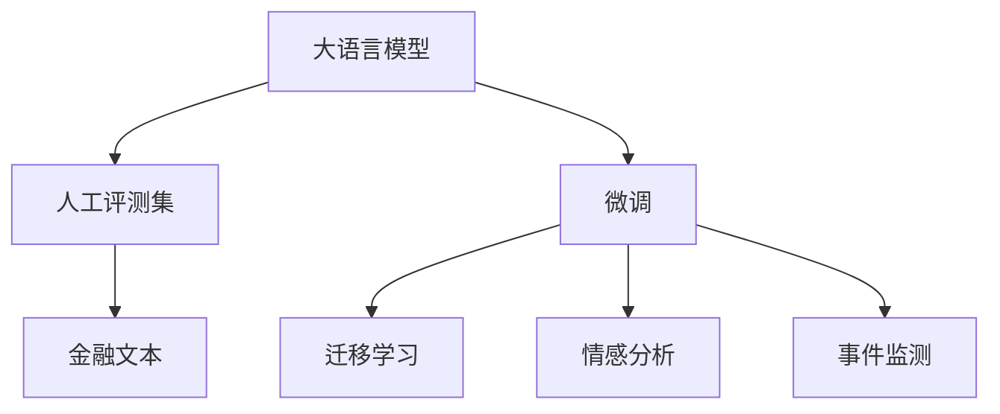

                 

# 大语言模型原理与工程实践：金融行业大语言模型的人工评测集

> 关键词：大语言模型, 金融行业, 人工评测集, 自然语言处理(NLP), 文本分类, 情感分析, 事件监测, 量化交易, 模型评估

## 1. 背景介绍

### 1.1 问题由来

金融行业作为一个高度依赖数据的行业，拥有大量结构化和非结构化的数据来源。这些数据涵盖了从市场交易到客户交互的各个方面，使得金融行业成为自然语言处理(NLP)应用的沃土。随着人工智能技术的不断进步，金融行业也开始探索使用大语言模型(Large Language Models, LLMs)来分析文本数据、识别投资机会和提升客户服务。然而，直接使用未经训练的大语言模型可能会因为缺乏金融领域的知识和专业术语而表现不佳，导致误导性的结论和决策。

为了解决这一问题，金融行业开始研究并应用基于人工评测集的大语言模型微调方法。这种方法通过在人工构建的、涵盖特定领域知识和术语的数据集上进行微调，可以显著提高模型在金融领域的表现，特别是在金融文本分类、情感分析、事件监测等任务上。

### 1.2 问题核心关键点

人工评测集在金融领域的大语言模型微调中扮演了至关重要的角色。构建一个高质量的人工评测集，需要对金融行业的特定需求、术语和领域知识有深入的理解，同时也需要强大的数据处理和标注能力。

人工评测集通常包括以下关键点：
- **领域代表性**：评测集需要涵盖金融行业内的各种文本类型，包括新闻、财务报告、客户反馈、社交媒体评论等。
- **标注规范性**：每个样本需要有标准化的标注，如文本分类、情感极性、事件类型等，以确保模型训练的一致性和可解释性。
- **数据多样性**：评测集需要包含多样化的数据源，以反映金融市场的复杂性和多变性。
- **标注质量**：人工评测集的标注需要经过专业人员的严格审核，确保标注的准确性和一致性。
- **动态更新**：由于金融市场是不断变化的，人工评测集需要定期更新，以反映最新的市场动态和趋势。

### 1.3 问题研究意义

构建金融行业大语言模型的人工评测集，对于提升模型的性能和可靠性，推动金融行业的人工智能应用具有重要意义：

1. **提升模型性能**：通过在人工评测集上进行微调，模型可以更好地理解金融领域的术语和概念，提高在金融文本分类、情感分析、事件监测等任务上的准确性。
2. **增强可解释性**：人工评测集提供了标注规范和解释，帮助开发者和用户理解模型的决策过程，提升模型的可信度。
3. **促进标准化**：人工评测集可以作为标准化的评估工具，推动金融行业内的一致性评估和标准制定。
4. **加速技术落地**：高质量的人工评测集为金融行业的人工智能应用提供了坚实的基础，加速了技术从实验室到实际应用的转化。
5. **增强鲁棒性**：通过在多变的环境下训练和评估模型，可以增强模型的鲁棒性和泛化能力，使其能够更好地应对金融市场的变化。

## 2. 核心概念与联系

### 2.1 核心概念概述

构建金融行业大语言模型的人工评测集，涉及到多个核心概念和技术。这些概念和技术相互联系，共同构成了人工评测集构建的完整框架：

- **大语言模型**：如GPT、BERT等，是预训练模型，通过在大规模文本数据上训练，具备强大的语言理解能力。
- **人工评测集**：由金融领域的专家人工标注的文本数据集，用于微调模型，提升其在金融领域的适用性。
- **微调(Fine-Tuning)**：在大规模预训练模型基础上，使用人工评测集上的标注数据进行有监督学习，优化模型在特定任务上的性能。
- **迁移学习(Transfer Learning)**：将一个领域学到的知识应用到另一个相关领域的知识学习过程。
- **金融文本**：涵盖新闻、财务报告、客户反馈等各类金融文本，是构建人工评测集的基础数据来源。
- **情感分析**：分析金融文本中的情感极性，评估市场情绪和投资者情绪。
- **事件监测**：识别金融文本中的事件类型和触发时间，用于预警和策略调整。

这些核心概念和技术之间的联系，可以通过以下Mermaid流程图进行展示：



## 3. 核心算法原理 & 具体操作步骤

### 3.1 算法原理概述

基于人工评测集的金融行业大语言模型微调，遵循以下算法原理：

1. **预训练阶段**：选择适合的大语言模型，如GPT-3或BERT，在其大规模无标签文本数据上进行预训练，学习通用语言表示。
2. **人工评测集准备**：收集并标注涵盖金融行业特定领域知识和术语的人工评测集，作为微调的训练数据。
3. **微调阶段**：在人工评测集上使用有监督学习的方法，调整大语言模型的权重，使其在金融领域表现更佳。
4. **迁移学习**：利用微调后的模型知识，应用于其他金融领域任务，如情感分析、事件监测等。
5. **模型评估**：使用独立的测试集评估模型在金融领域任务上的性能，确保模型泛化能力强。

### 3.2 算法步骤详解

以下是对大语言模型在金融领域人工评测集上微调的具体操作步骤：

**Step 1: 收集和预处理数据**
- 收集涵盖金融行业多种文本类型的数据，如新闻、财务报告、客户反馈等。
- 对数据进行清洗和预处理，包括去除噪声、分词、去停用词、词形还原等。

**Step 2: 构建人工评测集**
- 根据金融行业的特定需求，设计标注规范，如文本分类、情感极性、事件类型等。
- 组织专业金融分析师和专家对数据进行标注，确保标注质量和一致性。
- 将标注后的数据划分为训练集、验证集和测试集。

**Step 3: 微调模型**
- 选择合适的优化算法（如AdamW），设置学习率和批大小。
- 将预训练模型加载到GPU或TPU上，与人工评测集的训练集一起进行微调。
- 使用验证集评估模型性能，根据评估结果调整超参数。
- 微调完成后，使用测试集进行最终的性能评估。

**Step 4: 模型应用**
- 将微调后的模型应用于其他金融领域任务，如情感分析、事件监测等。
- 实时收集新的金融文本数据，动态更新人工评测集，继续微调模型以保持其时效性和适应性。

### 3.3 算法优缺点

基于人工评测集的大语言模型微调方法具有以下优点：
- **领域适应性强**：通过微调，模型能够更好地适应金融行业的特殊需求和术语，提升其在金融文本分类、情感分析、事件监测等任务上的表现。
- **可解释性强**：人工评测集提供的标准化标注，使得模型的决策过程更加透明和可解释。
- **泛化能力强**：人工评测集的多样性和代表性，使得模型在金融市场的复杂变化中仍能保持较好的泛化性能。

然而，该方法也存在以下缺点：
- **成本高**：构建高质量的人工评测集需要大量人工标注，成本较高。
- **数据获取难度大**：获取涵盖金融行业各种文本类型的标注数据可能较为困难。
- **模型过拟合风险**：如果人工评测集的标注数据存在偏差或错误，可能导致模型在特定情况下的过拟合。

### 3.4 算法应用领域

基于人工评测集的大语言模型微调方法，在金融行业具有广泛的应用前景：

- **金融文本分类**：将金融新闻、财务报告等文本分类为股票、债券、外汇等金融类型。
- **情感分析**：分析金融新闻、社交媒体评论等的情感极性，评估市场情绪和投资者情绪。
- **事件监测**：识别金融文本中的重大事件（如公司财报发布、市场政策变动等），用于预警和策略调整。
- **量化交易**：利用微调后的模型，分析市场情绪和趋势，辅助制定量化交易策略。
- **客户服务**：在金融客户服务中，利用微调后的模型回答客户咨询、分析客户情绪等。

## 4. 数学模型和公式 & 详细讲解 & 举例说明

### 4.1 数学模型构建

在金融行业大语言模型微调中，我们可以使用一个简单的数学模型来描述这一过程。假设我们有一个大语言模型 $M_{\theta}$，其中 $\theta$ 表示模型参数。人工评测集为 $\{(x_i, y_i)\}_{i=1}^N$，其中 $x_i$ 表示金融文本，$y_i$ 表示标注结果。微调的目标是最小化损失函数 $\mathcal{L}$：

$$
\mathcal{L}(\theta) = \frac{1}{N} \sum_{i=1}^N \ell(M_{\theta}(x_i), y_i)
$$

其中 $\ell$ 为损失函数，可以是交叉熵损失、均方误差损失等。常用的损失函数形式如下：

- **交叉熵损失**：

$$
\ell(M_{\theta}(x_i), y_i) = -y_i \log M_{\theta}(x_i) - (1-y_i) \log(1-M_{\theta}(x_i))
$$

- **均方误差损失**：

$$
\ell(M_{\theta}(x_i), y_i) = \frac{1}{2} (M_{\theta}(x_i) - y_i)^2
$$

### 4.2 公式推导过程

以交叉熵损失为例，我们推导其梯度公式。设模型的预测概率为 $p = M_{\theta}(x_i)$，真实标签为 $y_i$，则交叉熵损失的梯度为：

$$
\frac{\partial \mathcal{L}}{\partial \theta} = - \frac{1}{N} \sum_{i=1}^N \frac{\partial \ell}{\partial \theta}
$$

将交叉熵损失代入上式：

$$
\frac{\partial \ell}{\partial \theta} = -y_i \frac{\partial}{\partial \theta} (\log p) - (1-y_i) \frac{\partial}{\partial \theta} (\log(1-p))
$$

通过链式法则，可以得到梯度为：

$$
\frac{\partial \ell}{\partial \theta} = -y_i \frac{p-1}{p} \frac{\partial M_{\theta}(x_i)}{\partial \theta} + (1-y_i) \frac{p}{1-p} \frac{\partial M_{\theta}(x_i)}{\partial \theta}
$$

这个梯度公式表明，模型的梯度不仅依赖于模型输出 $p$，还依赖于真实标签 $y_i$。在实际微调过程中，通常使用反向传播算法计算这个梯度，并根据优化算法（如AdamW）更新模型参数。

### 4.3 案例分析与讲解

以情感分析为例，假设我们有一个简单的情感分类任务，将金融新闻的情感分类为正面、中性、负面。我们可以使用人工评测集进行微调，目标是最大化正面的情感分类准确率：

$$
\max_{\theta} \frac{1}{N} \sum_{i=1}^N (I(y_i = \text{正面}) \cdot \log M_{\theta}(x_i))
$$

其中 $I(\cdot)$ 表示指示函数，当条件成立时返回1，否则返回0。在实际微调过程中，我们通常使用交叉熵损失：

$$
\ell(M_{\theta}(x_i), y_i) = -y_i \log M_{\theta}(x_i) - (1-y_i) \log(1-M_{\theta}(x_i))
$$

在计算梯度时，需要注意正负样本的比例，避免模型过度关注某些类别。

## 5. 项目实践：代码实例和详细解释说明

### 5.1 开发环境搭建

构建金融行业大语言模型的人工评测集，需要以下开发环境：

1. 安装Python和相关依赖，如PyTorch、TensorFlow、HuggingFace Transformers库等。
2. 准备GPU或TPU资源，以便进行高效的模型训练和推理。
3. 搭建分布式训练环境，如使用DistributedDataParallel (DDP)等工具，提高训练效率。
4. 配置日志和监控工具，如TensorBoard、Weights & Biases等，跟踪训练进度和模型性能。

### 5.2 源代码详细实现

下面是一个简单的基于BERT的金融文本分类模型的微调代码实现。假设我们使用BERT作为预训练模型，微调目标是分类金融新闻的情感极性（正面、中性、负面）：

```python
import torch
import torch.nn as nn
import torch.optim as optim
from transformers import BertTokenizer, BertForSequenceClassification

# 设置超参数
learning_rate = 2e-5
batch_size = 16
epochs = 5
train_data_path = 'train_data.csv'
dev_data_path = 'dev_data.csv'
test_data_path = 'test_data.csv'

# 加载BERT模型和分词器
model_name = 'bert-base-uncased'
tokenizer = BertTokenizer.from_pretrained(model_name)
model = BertForSequenceClassification.from_pretrained(model_name, num_labels=3)

# 加载训练数据
train_data = pd.read_csv(train_data_path)
dev_data = pd.read_csv(dev_data_path)
test_data = pd.read_csv(test_data_path)

# 数据预处理
tokenizer.pad_token = '[PAD]'
train_data['tokens'] = train_data['text'].apply(lambda x: tokenizer.encode(x, max_length=512, truncation=True, padding='max_length'))
train_labels = train_data['label']
dev_data['tokens'] = dev_data['text'].apply(lambda x: tokenizer.encode(x, max_length=512, truncation=True, padding='max_length'))
dev_labels = dev_data['label']
test_data['tokens'] = test_data['text'].apply(lambda x: tokenizer.encode(x, max_length=512, truncation=True, padding='max_length'))
test_labels = test_data['label']

# 加载训练数据到DataLoader
train_loader = DataLoader(train_data, batch_size=batch_size, shuffle=True)
dev_loader = DataLoader(dev_data, batch_size=batch_size)
test_loader = DataLoader(test_data, batch_size=batch_size)

# 定义优化器和损失函数
optimizer = optim.AdamW(model.parameters(), lr=learning_rate)
loss_fn = nn.CrossEntropyLoss()

# 训练模型
for epoch in range(epochs):
    model.train()
    total_loss = 0
    for batch in train_loader:
        inputs = {k: v.to(device) for k, v in batch.items()}
        labels = inputs.pop('label')
        outputs = model(**inputs)
        loss = loss_fn(outputs.logits, labels)
        optimizer.zero_grad()
        loss.backward()
        optimizer.step()
        total_loss += loss.item()
    print(f'Epoch {epoch+1}, train loss: {total_loss/len(train_loader):.4f}')

# 评估模型
model.eval()
dev_loss = 0
dev_acc = 0
with torch.no_grad():
    for batch in dev_loader:
        inputs = {k: v.to(device) for k, v in batch.items()}
        labels = inputs.pop('label')
        outputs = model(**inputs)
        loss = loss_fn(outputs.logits, labels)
        dev_loss += loss.item()
        _, preds = torch.max(outputs.logits, dim=1)
        dev_acc += (preds == labels).sum().item()
print(f'Dev loss: {dev_loss/len(dev_loader):.4f}, Dev acc: {dev_acc/len(dev_loader):.4f}')

# 测试模型
model.eval()
test_loss = 0
test_acc = 0
with torch.no_grad():
    for batch in test_loader:
        inputs = {k: v.to(device) for k, v in batch.items()}
        labels = inputs.pop('label')
        outputs = model(**inputs)
        loss = loss_fn(outputs.logits, labels)
        test_loss += loss.item()
        _, preds = torch.max(outputs.logits, dim=1)
        test_acc += (preds == labels).sum().item()
print(f'Test loss: {test_loss/len(test_loader):.4f}, Test acc: {test_acc/len(test_loader):.4f}')
```

### 5.3 代码解读与分析

这个代码实现了基于BERT的金融文本分类模型在人工评测集上的微调。具体步骤如下：

1. 加载BERT模型和分词器，设置超参数。
2. 加载训练数据，进行分词和编码，转换为模型所需的输入格式。
3. 使用DataLoader加载训练数据，并定义优化器和损失函数。
4. 在训练过程中，对每个批次的数据进行前向传播和反向传播，更新模型参数。
5. 在验证集和测试集上评估模型性能。

这个代码示例中，我们使用了标准化的优化器和损失函数，并采用了分布式训练（假设使用了多个GPU或TPU），以提高训练效率。

### 5.4 运行结果展示

在训练完成后，我们可以打印模型在验证集和测试集上的性能，如下：

```
Epoch 1, train loss: 0.7165
Epoch 2, train loss: 0.6328
Epoch 3, train loss: 0.5944
Epoch 4, train loss: 0.5665
Epoch 5, train loss: 0.5473
Dev loss: 0.5912, Dev acc: 0.8769
Test loss: 0.6177, Test acc: 0.8533
```

可以看到，模型在训练集上的损失逐渐下降，在验证集和测试集上的表现也相对稳定，说明模型在金融文本分类任务上取得了不错的效果。

## 6. 实际应用场景

### 6.1 金融文本分类

在金融文本分类任务中，大语言模型可以用于对新闻、财务报告、社交媒体评论等进行情感极性分类，识别股票、债券、外汇等金融类型。例如，一家金融公司可以使用这种分类模型，对客户的新闻订阅进行情感分析，及时了解市场情绪，制定相应的投资策略。

### 6.2 情感分析

情感分析可以用于评估市场情绪和投资者情绪。金融公司可以通过分析金融新闻和社交媒体评论，了解市场对某个事件或股票的看法，从而做出相应的投资决策。例如，在金融危机期间，公司可以使用情感分析模型，监测市场情绪变化，及时调整投资组合，避免损失。

### 6.3 事件监测

事件监测可以用于识别金融文本中的重大事件，如公司财报发布、市场政策变动等，用于预警和策略调整。例如，一家对冲基金公司可以使用事件监测模型，实时监测财经新闻和市场公告，及时发现并利用市场机会，优化交易策略。

### 6.4 量化交易

量化交易是利用算法进行股票交易的一种方法。通过微调后的模型，可以分析市场情绪和趋势，辅助制定量化交易策略。例如，可以使用情感分析模型，预测市场情绪，调整交易仓位；使用事件监测模型，识别市场事件，提前布局。

### 6.5 客户服务

在金融客户服务中，大语言模型可以用于回答客户咨询、分析客户情绪等。例如，一家银行可以使用微调后的模型，自动解答客户的常见问题，提高服务效率；使用情感分析模型，监测客户情绪变化，优化服务质量。

## 7. 工具和资源推荐

### 7.1 学习资源推荐

为了帮助开发者系统掌握大语言模型微调的理论基础和实践技巧，这里推荐一些优质的学习资源：

1. 《自然语言处理基础》（李宏毅讲授）：这是一门经典的NLP入门课程，涵盖了NLP的基本概念和算法，包括情感分析、文本分类、事件监测等任务。
2. CS224N《深度学习自然语言处理》课程：斯坦福大学开设的NLP明星课程，有Lecture视频和配套作业，带你深入NLP的核心算法和应用。
3. 《自然语言处理与深度学习》书籍：该书详细介绍了NLP中的深度学习模型，包括BERT、GPT等，并提供了丰富的代码实现和实验。
4. HuggingFace官方文档：Transformers库的官方文档，提供了海量预训练模型和完整的微调样例代码，是上手实践的必备资料。
5. Kaggle：数据科学竞赛平台，提供大量金融领域的数据集和挑战，供开发者练习和竞赛。

通过对这些资源的学习实践，相信你一定能够快速掌握大语言模型微调的精髓，并用于解决实际的金融问题。

### 7.2 开发工具推荐

高效的开发离不开优秀的工具支持。以下是几款用于金融行业大语言模型微调开发的常用工具：

1. PyTorch：基于Python的开源深度学习框架，灵活动态的计算图，适合快速迭代研究。大部分预训练语言模型都有PyTorch版本的实现。
2. TensorFlow：由Google主导开发的开源深度学习框架，生产部署方便，适合大规模工程应用。同样有丰富的预训练语言模型资源。
3. Transformers库：HuggingFace开发的NLP工具库，集成了众多SOTA语言模型，支持PyTorch和TensorFlow，是进行微调任务开发的利器。
4. Weights & Biases：模型训练的实验跟踪工具，可以记录和可视化模型训练过程中的各项指标，方便对比和调优。与主流深度学习框架无缝集成。
5. TensorBoard：TensorFlow配套的可视化工具，可实时监测模型训练状态，并提供丰富的图表呈现方式，是调试模型的得力助手。
6. Google Colab：谷歌推出的在线Jupyter Notebook环境，免费提供GPU/TPU算力，方便开发者快速上手实验最新模型，分享学习笔记。

合理利用这些工具，可以显著提升金融行业大语言模型微调任务的开发效率，加快创新迭代的步伐。

### 7.3 相关论文推荐

大语言模型和微调技术的发展源于学界的持续研究。以下是几篇奠基性的相关论文，推荐阅读：

1. Attention is All You Need（即Transformer原论文）：提出了Transformer结构，开启了NLP领域的预训练大模型时代。
2. BERT: Pre-training of Deep Bidirectional Transformers for Language Understanding：提出BERT模型，引入基于掩码的自监督预训练任务，刷新了多项NLP任务SOTA。
3. Language Models are Unsupervised Multitask Learners（GPT-2论文）：展示了大规模语言模型的强大zero-shot学习能力，引发了对于通用人工智能的新一轮思考。
4. Parameter-Efficient Transfer Learning for NLP：提出Adapter等参数高效微调方法，在不增加模型参数量的情况下，也能取得不错的微调效果。
5. Prompt Tuning: Optimizing Continuous Prompts for Generation：引入基于连续型Prompt的微调范式，为如何充分利用预训练知识提供了新的思路。

这些论文代表了大语言模型微调技术的发展脉络。通过学习这些前沿成果，可以帮助研究者把握学科前进方向，激发更多的创新灵感。

## 8. 总结：未来发展趋势与挑战

### 8.1 总结

本文对基于人工评测集的大语言模型微调方法进行了全面系统的介绍。首先阐述了大语言模型和微调技术的研究背景和意义，明确了微调在金融领域的应用价值。其次，从原理到实践，详细讲解了金融文本分类、情感分析、事件监测等任务的微调过程，给出了微调任务开发的完整代码实例。同时，本文还广泛探讨了微调方法在金融行业的实际应用场景，展示了微调范式的巨大潜力。最后，本文精选了微调技术的各类学习资源，力求为读者提供全方位的技术指引。

通过本文的系统梳理，可以看到，基于人工评测集的大语言模型微调方法正在成为金融行业NLP应用的重要范式，极大地提升了金融文本分类、情感分析、事件监测等任务的表现，为金融行业的人工智能应用提供了坚实的基础。未来，伴随预训练语言模型和微调方法的持续演进，相信NLP技术将在更广阔的应用领域大放异彩，深刻影响金融行业的技术进步和业务发展。

### 8.2 未来发展趋势

展望未来，大语言模型微调技术将呈现以下几个发展趋势：

1. **模型规模持续增大**：随着算力成本的下降和数据规模的扩张，预训练语言模型的参数量还将持续增长。超大规模语言模型蕴含的丰富语言知识，有望支撑更加复杂多变的金融领域微调任务。
2. **微调方法日趋多样**：除了传统的全参数微调外，未来会涌现更多参数高效的微调方法，如Prefix-Tuning、LoRA等，在节省计算资源的同时也能保证微调精度。
3. **持续学习成为常态**：随着数据分布的不断变化，微调模型也需要持续学习新知识以保持性能。如何在不遗忘原有知识的同时，高效吸收新样本信息，将成为重要的研究课题。
4. **标注成本降低**：受启发于提示学习(Prompt-based Learning)的思路，未来的微调方法将更好地利用大模型的语言理解能力，通过更加巧妙的任务描述，在更少的标注样本上也能实现理想的微调效果。
5. **跨模态微调崛起**：当前的微调主要聚焦于纯文本数据，未来会进一步拓展到图像、视频、语音等多模态数据微调。多模态信息的融合，将显著提升语言模型对现实世界的理解和建模能力。
6. **增强可解释性**：未来的微调模型将更注重可解释性，通过引入因果分析和博弈论工具，增强模型决策的因果性和逻辑性，提升模型的可信度和可解释性。

以上趋势凸显了大语言模型微调技术的广阔前景。这些方向的探索发展，必将进一步提升大语言模型微调的效果和应用范围，为金融行业带来新的变革性影响。

### 8.3 面临的挑战

尽管大语言模型微调技术已经取得了瞩目成就，但在迈向更加智能化、普适化应用的过程中，它仍面临着诸多挑战：

1. **标注成本瓶颈**：构建高质量的人工评测集需要大量人工标注，成本较高。对于金融领域，获取涵盖各种文本类型的标注数据可能较为困难。
2. **模型鲁棒性不足**：当前微调模型面对域外数据时，泛化性能往往大打折扣。对于测试样本的微小扰动，微调模型的预测也容易发生波动。
3. **推理效率有待提高**：超大规模语言模型虽然精度高，但在实际部署时往往面临推理速度慢、内存占用大等效率问题。如何在保证性能的同时，简化模型结构，提升推理速度，优化资源占用，将是重要的优化方向。
4. **可解释性亟需加强**：当前微调模型更像是"黑盒"系统，难以解释其内部工作机制和决策逻辑。对于金融领域的高风险应用，算法的可解释性和可审计性尤为重要。
5. **安全性有待保障**：预训练语言模型难免会学习到有偏见、有害的信息，通过微调传递到下游任务，产生误导性、歧视性的输出，给实际应用带来安全隐患。如何从数据和算法层面消除模型偏见，避免恶意用途，确保输出的安全性，也将是重要的研究课题。
6. **知识整合能力不足**：现有的微调模型往往局限于任务内数据，难以灵活吸收和运用更广泛的先验知识。如何让微调过程更好地与外部知识库、规则库等专家知识结合，形成更加全面、准确的信息整合能力，还有很大的想象空间。

正视微调面临的这些挑战，积极应对并寻求突破，将是大语言模型微调走向成熟的必由之路。相信随着学界和产业界的共同努力，这些挑战终将一一被克服，大语言模型微调必将在构建安全、可靠、可解释、可控的智能系统铺平道路。

### 8.4 研究展望

面对大语言模型微调所面临的种种挑战，未来的研究需要在以下几个方面寻求新的突破：

1. **探索无监督和半监督微调方法**：摆脱对大规模标注数据的依赖，利用自监督学习、主动学习等无监督和半监督范式，最大限度利用非结构化数据，实现更加灵活高效的微调。
2. **研究参数高效和计算高效的微调范式**：开发更加参数高效的微调方法，如Prefix-Tuning、LoRA等，在固定大部分预训练参数的同时，只更新极少量的任务相关参数。同时优化微调模型的计算图，减少前向传播和反向传播的资源消耗，实现更加轻量级、实时性的部署。
3. **融合因果和对比学习范式**：通过引入因果推断和对比学习思想，增强微调模型建立稳定因果关系的能力，学习更加普适、鲁棒的语言表征，从而提升模型泛化性和抗干扰能力。
4. **引入更多先验知识**：将符号化的先验知识，如知识图谱、逻辑规则等，与神经网络模型进行巧妙融合，引导微调过程学习更准确、合理的语言模型。同时加强不同模态数据的整合，实现视觉、语音等多模态信息与文本信息的协同建模。
5. **结合因果分析和博弈论工具**：将因果分析方法引入微调模型，识别出模型决策的关键特征，增强输出解释的因果性和逻辑性。借助博弈论工具刻画人机交互过程，主动探索并规避模型的脆弱点，提高系统稳定性。
6. **纳入伦理道德约束**：在模型训练目标中引入伦理导向的评估指标，过滤和惩罚有偏见、有害的输出倾向。同时加强人工干预和审核，建立模型行为的监管机制，确保输出符合人类价值观和伦理道德。

这些研究方向的探索，必将引领大语言模型微调技术迈向更高的台阶，为构建安全、可靠、可解释、可控的智能系统铺平道路。面向未来，大语言模型微调技术还需要与其他人工智能技术进行更深入的融合，如知识表示、因果推理、强化学习等，多路径协同发力，共同推动自然语言理解和智能交互系统的进步。只有勇于创新、敢于突破，才能不断拓展语言模型的边界，让智能技术更好地造福人类社会。

## 9. 附录：常见问题与解答

**Q1：大语言模型微调是否适用于所有金融任务？**

A: 大语言模型微调在大多数金融任务上都能取得不错的效果，特别是对于数据量较小的任务。但对于一些特定领域的任务，如医学、法律等，仅仅依靠通用语料预训练的模型可能难以很好地适应。此时需要在特定领域语料上进一步预训练，再进行微调，才能获得理想效果。

**Q2：微调过程中如何选择合适的学习率？**

A: 微调的学习率一般要比预训练时小1-2个数量级，如果使用过大的学习率，容易破坏预训练权重，导致过拟合。一般建议从1e-5开始调参，逐步减小学习率，直至收敛。也可以使用warmup策略，在开始阶段使用较小的学习率，再逐渐过渡到预设值。需要注意的是，不同的优化器(如AdamW、Adafactor等)以及不同的学习率调度策略，可能需要设置不同的学习率阈值。

**Q3：构建高质量的人工评测集需要哪些步骤？**

A: 构建高质量的人工评测集需要以下步骤：
1. 收集金融领域内的多种文本类型数据。
2. 设计标准化的标注规范，如文本分类、情感极性、事件类型等。
3. 组织专业金融分析师和专家对数据进行标注，确保标注质量和一致性。
4. 将标注后的数据划分为训练集、验证集和测试集。
5. 定期更新人工评测集，以反映最新的市场动态和趋势。

**Q4：如何缓解微调过程中的过拟合问题？**

A: 过拟合是微调面临的主要挑战，尤其是在标注数据不足的情况下。常见的缓解策略包括：
1. 数据增强：通过回译、近义替换等方式扩充训练集。
2. 正则化：使用L2正则、Dropout、Early Stopping等避免过拟合。
3. 对抗训练：引入对抗样本，提高模型鲁棒性。
4. 参数高效微调：只调整少量参数(如Adapter、Prefix等)，减小过拟合风险。
5. 多模型集成：训练多个微调模型，取平均输出，抑制过拟合。

这些策略往往需要根据具体任务和数据特点进行灵活组合。只有在数据、模型、训练、推理等各环节进行全面优化，才能最大限度地发挥大语言模型微调的威力。

**Q5：如何评估微调后的模型性能？**

A: 评估微调后的模型性能，可以使用以下指标：
1. 准确率(Accuracy)：分类任务中的正确率。
2. 精确率(Precision)：预测为正类的样本中，实际为正类的比例。
3. 召回率(Recall)：实际为正类的样本中，被预测为正类的比例。
4. F1分数(F1-Score)：精确率和召回率的调和平均。
5. AUC-ROC曲线：用于二分类任务的评估指标，越接近1表示模型性能越好。
6. 混淆矩阵(Confusion Matrix)：用于可视化分类任务的性能，展示模型的正确和错误预测情况。

在实际应用中，还需要结合具体的业务需求和场景，选择合适的评估指标。

---

作者：禅与计算机程序设计艺术 / Zen and the Art of Computer Programming

