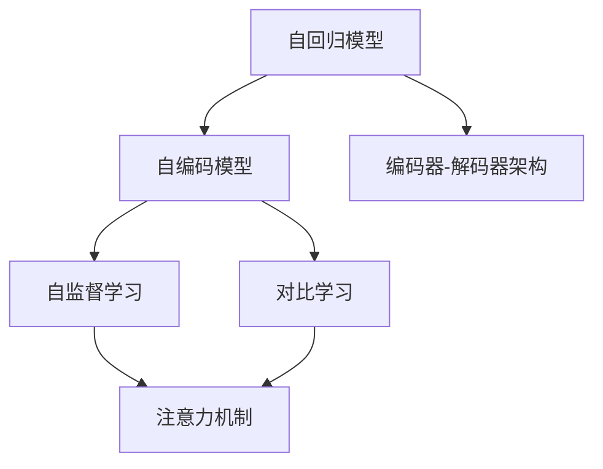

                 

# 大语言模型原理基础与前沿 编码器-解码器架构

> 关键词：大语言模型, Transformer, 编码器-解码器架构, 自回归模型, 自编码模型, 自监督学习, 对比学习, 注意力机制, 解码器模型, 编码器模型

## 1. 背景介绍

### 1.1 问题由来

近年来，自然语言处理(Natural Language Processing, NLP)领域的飞速发展，尤其是在预训练语言模型(Pre-trained Language Model, PLM)方面的突破性进展，推动了大语言模型(Large Language Model, LLM)的兴起。这一系列模型的共同特点是基于大规模无标签数据进行自监督预训练，然后通过有监督微调来适应特定的任务需求。

这些模型，如BERT、GPT-3、XLNet等，通过深层次的神经网络结构和大规模数据训练，获得了强大的语言理解和生成能力，极大提升了NLP任务的效果。然而，预训练模型通常需要耗费大量计算资源和标注数据，而微调过程也需要大量的标注数据，这限制了大模型的应用范围。

### 1.2 问题核心关键点

大语言模型在NLP任务中应用的核心在于其编码器-解码器架构。这种架构通过编码器提取输入文本的语义表示，然后解码器将这一表示转化为目标文本，从而实现对文本的生成、分类、匹配等任务。

核心点包括：
- 编码器-解码器架构的设计和实现。
- 自回归和自编码模型的选择与比较。
- 注意力机制的引入与优化。
- 自监督学习、对比学习等训练方法的应用。

这些关键点共同构成了大语言模型的核心原理和架构，使其能够高效地从无标签数据中学习到语言表征，并在下游任务中灵活运用这些表征。

## 2. 核心概念与联系

### 2.1 核心概念概述

为更好地理解大语言模型中的编码器-解码器架构，本节将介绍几个密切相关的核心概念：

- **编码器-解码器架构**：大语言模型的核心架构，由编码器提取输入文本的语义表示，解码器基于该表示生成目标文本或分类结果。

- **自回归模型(Autoregressive Model)**：模型按照时间顺序，先预测前一个时间步的条件概率，再基于该条件概率预测后一个时间步的条件概率。例如GPT模型就属于自回归模型。

- **自编码模型(Autocoding Model)**：模型在编码器部分学习输入到表示的映射，在解码器部分学习表示到输出的映射，如BERT模型就属于自编码模型。

- **自监督学习(Self-Supervised Learning)**：利用未标注数据通过一些自设计的任务（如掩码语言模型、句子相似度、文本分类等）进行训练，学习语言的表征。

- **对比学习(Contrastive Learning)**：通过构建正样本和负样本之间的对比，促使模型学习更具区分性的特征表示。

- **注意力机制(Attention Mechanism)**：通过计算输入序列中各个位置与当前位置的相关性，决定哪些信息在解码时需要重点关注，提升模型的表征能力和性能。

这些概念之间的逻辑关系可以通过以下Mermaid流程图来展示：



这个流程图展示了自回归模型、自编码模型和自监督学习、对比学习之间的关系，以及它们如何共同作用于大语言模型的编码器-解码器架构。

## 3. 核心算法原理 & 具体操作步骤
### 3.1 算法原理概述

大语言模型中的编码器-解码器架构，通常由编码器(self-encoder)和解码器(self-decoder)两部分组成。编码器负责将输入的文本序列转化为高维语义表示，解码器则基于这一表示生成目标文本或分类结果。

自回归模型如GPT系列模型中，编码器和解码器共享同一套神经网络结构，通过反向传播更新参数，最小化目标序列与模型生成序列之间的差异。自编码模型如BERT模型中，则分为独立的编码器和解码器，编码器将输入文本转化为语义表示，解码器基于这一表示进行分类或生成任务。

### 3.2 算法步骤详解

以下将详细介绍基于编码器-解码器架构的大语言模型微调的具体步骤：

**Step 1: 数据准备与预处理**

1. 收集下游任务的相关数据，包括标注数据和未标注数据。标注数据用于有监督微调，未标注数据用于自监督预训练。
2. 对文本数据进行分词、标注、编码等预处理，将其转化为模型所需的输入格式。

**Step 2: 构建编码器和解码器**

1. 选择适合模型的架构（如LSTM、GRU、Transformer等），并设计编码器和解码器的结构。
2. 定义损失函数，如交叉熵损失、均方误差损失等。

**Step 3: 进行自监督预训练**

1. 在未标注数据上进行自监督预训练，如掩码语言模型、句子相似度等任务。
2. 通过反向传播更新模型参数，最小化预训练任务与模型输出之间的差距。

**Step 4: 微调模型**

1. 将预训练后的模型作为初始化参数，加载到微调环境。
2. 在标注数据上进行有监督微调，更新模型参数。
3. 使用验证集评估模型性能，避免过拟合。

**Step 5: 测试与部署**

1. 在测试集上测试微调后的模型性能，评估其在新数据上的表现。
2. 将模型部署到实际应用中，进行推理预测。

### 3.3 算法优缺点

基于编码器-解码器架构的大语言模型微调具有以下优点：

1. 通用性强。无论是自回归模型还是自编码模型，都可以应用于各种NLP任务，如文本分类、生成、匹配等。
2. 高效性。编码器-解码器架构能够高效地从大规模数据中学习语言表征，提升下游任务的性能。
3. 可解释性强。由于编码器-解码器架构的独立设计，每个组件的功能清晰明确，模型决策过程更加透明。

但同时，这种架构也存在一些局限性：

1. 需要较大的标注数据。有监督微调需要大量的标注数据，标注成本较高。
2. 模型复杂度高。特别是自回归模型，结构复杂，训练和推理成本高。
3. 易受输入噪声影响。自回归模型容易受到输入噪声的影响，导致输出不稳定。

### 3.4 算法应用领域

编码器-解码器架构的大语言模型已经在诸多NLP任务中得到应用，例如：

- 机器翻译：通过编码器-解码器架构，将源语言文本翻译为目标语言。
- 文本生成：通过自回归模型生成连贯的文本内容。
- 文本分类：通过自编码模型分类输入文本。
- 问答系统：通过编码器-解码器架构生成问题答案。

除了这些常见任务，编码器-解码器架构还在情感分析、文本摘要、对话系统等更多NLP任务中发挥作用，推动了NLP技术的广泛应用。

## 4. 数学模型和公式 & 详细讲解  
### 4.1 数学模型构建

假设编码器-解码器架构中的编码器是一个由多层神经网络组成的序列到序列(Seq2Seq)模型，其输入为文本序列 $X=\{x_1, x_2, \dots, x_n\}$，输出为语义表示 $H=\{h_1, h_2, \dots, h_n\}$。解码器同样由多层神经网络组成，输入为语义表示 $H$，输出为文本序列 $Y=\{y_1, y_2, \dots, y_n\}$。

编码器-解码器架构的优化目标为：

$$
\min_{\theta} \mathcal{L}(M_\theta(X), Y) = \min_{\theta} \sum_{i=1}^N \mathcal{L}(M_\theta(x_i), y_i)
$$

其中 $\mathcal{L}$ 为损失函数，$\theta$ 为模型参数。

### 4.2 公式推导过程

对于自回归模型，如GPT模型，其编码器和解码器共享同一套神经网络，可以表示为：

$$
H_i = \text{Encoder}(x_1, x_2, \dots, x_i)
$$
$$
\hat{y}_i = \text{Decoder}(h_1, h_2, \dots, h_i)
$$

其中 $\text{Encoder}$ 和 $\text{Decoder}$ 分别为编码器和解码器，$h_i$ 为编码器第 $i$ 层的输出，$\hat{y}_i$ 为解码器对 $y_i$ 的预测。

自回归模型的训练过程可以表示为：

$$
\theta \leftarrow \theta - \eta \nabla_{\theta} \mathcal{L}(\hat{y}_1, y_1) - \eta \nabla_{\theta} \mathcal{L}(\hat{y}_2, y_2) - \dots - \eta \nabla_{\theta} \mathcal{L}(\hat{y}_n, y_n)
$$

其中 $\eta$ 为学习率，$\nabla_{\theta} \mathcal{L}(\hat{y}_i, y_i)$ 为损失函数对模型参数的梯度，可以通过反向传播算法计算。

对于自编码模型，如BERT模型，编码器和解码器分别独立设计，可以表示为：

$$
H = \text{Encoder}(x_1, x_2, \dots, x_n)
$$
$$
Y = \text{Decoder}(H)
$$

其中 $H$ 为编码器输出，$Y$ 为解码器输出。

自编码模型的训练过程可以表示为：

$$
\theta_E \leftarrow \theta_E - \eta_E \nabla_{\theta_E} \mathcal{L}(H, X)
$$
$$
\theta_D \leftarrow \theta_D - \eta_D \nabla_{\theta_D} \mathcal{L}(Y, X)
$$

其中 $\eta_E$ 和 $\eta_D$ 分别为编码器和解码器的学习率，$\nabla_{\theta_E} \mathcal{L}(H, X)$ 和 $\nabla_{\theta_D} \mathcal{L}(Y, X)$ 分别为编码器和解码器的损失函数对参数的梯度。

### 4.3 案例分析与讲解

以BERT模型为例，其编码器部分是一个多层Transformer结构，解码器部分则设计为一个多层自注意力机制的分类器。BERT模型的自监督预训练任务包括掩码语言模型和下一句预测任务。

在掩码语言模型任务中，模型需要预测输入序列中某些位置上的掩码词，以学习单词的上下文信息。具体实现为：
1. 将输入序列中的某些词替换为[MASK]符号，模型需要预测这些[MASK]位置的真实单词。
2. 通过反向传播更新模型参数，最小化掩码位置真实单词与模型预测单词之间的差距。

在下一句预测任务中，模型需要判断两个句子是否为连续的，即判断句子A是否为句子B的前一句。具体实现为：
1. 将两个句子分别输入编码器，得到它们的表示向量。
2. 解码器对这两个向量进行分类，输出它们是否为连续的。
3. 通过反向传播更新模型参数，最小化预测结果与真实结果之间的差距。

通过上述两个自监督任务的训练，BERT模型能够学习到单词和句子级别的语言表示，这些表示可以作为微调任务的初始化参数。

## 5. 项目实践：代码实例和详细解释说明
### 5.1 开发环境搭建

在进行大语言模型编码器-解码器架构的实践时，我们需要准备好开发环境。以下是使用Python进行PyTorch开发的环境配置流程：

1. 安装Anaconda：从官网下载并安装Anaconda，用于创建独立的Python环境。

2. 创建并激活虚拟环境：
```bash
conda create -n pytorch-env python=3.8 
conda activate pytorch-env
```

3. 安装PyTorch：根据CUDA版本，从官网获取对应的安装命令。例如：
```bash
conda install pytorch torchvision torchaudio cudatoolkit=11.1 -c pytorch -c conda-forge
```

4. 安装Transformer库：
```bash
pip install transformers
```

5. 安装各类工具包：
```bash
pip install numpy pandas scikit-learn matplotlib tqdm jupyter notebook ipython
```

完成上述步骤后，即可在`pytorch-env`环境中开始实践。

### 5.2 源代码详细实现

下面我们以机器翻译为例，给出使用Transformers库对BERT模型进行微调的PyTorch代码实现。

首先，定义机器翻译任务的数据处理函数：

```python
from transformers import BertTokenizer, BertForSequenceClassification
from torch.utils.data import Dataset
import torch

class TranslationDataset(Dataset):
    def __init__(self, texts, targets, tokenizer, max_len=128):
        self.texts = texts
        self.targets = targets
        self.tokenizer = tokenizer
        self.max_len = max_len
        
    def __len__(self):
        return len(self.texts)
    
    def __getitem__(self, item):
        text = self.texts[item]
        target = self.targets[item]
        
        encoding = self.tokenizer(text, return_tensors='pt', max_length=self.max_len, padding='max_length', truncation=True)
        input_ids = encoding['input_ids'][0]
        attention_mask = encoding['attention_mask'][0]
        
        # 对token-wise的标签进行编码
        encoded_targets = [target2id[target] for target in target_tokens] 
        encoded_targets.extend([tag2id['[PAD]']] * (self.max_len - len(encoded_targets)))
        targets = torch.tensor(encoded_targets, dtype=torch.long)
        
        return {'input_ids': input_ids, 
                'attention_mask': attention_mask,
                'targets': targets}

# 标签与id的映射
tag2id = {'<PAD>': 0, 'O': 1, 'B': 2, 'I': 3, 'E': 4}
id2tag = {v: k for k, v in tag2id.items()}

# 创建dataset
tokenizer = BertTokenizer.from_pretrained('bert-base-cased')

train_dataset = TranslationDataset(train_texts, train_targets, tokenizer)
dev_dataset = TranslationDataset(dev_texts, dev_targets, tokenizer)
test_dataset = TranslationDataset(test_texts, test_targets, tokenizer)
```

然后，定义模型和优化器：

```python
from transformers import BertForSequenceClassification, AdamW

model = BertForSequenceClassification.from_pretrained('bert-base-cased', num_labels=len(tag2id))

optimizer = AdamW(model.parameters(), lr=2e-5)
```

接着，定义训练和评估函数：

```python
from torch.utils.data import DataLoader
from tqdm import tqdm
from sklearn.metrics import classification_report

device = torch.device('cuda') if torch.cuda.is_available() else torch.device('cpu')
model.to(device)

def train_epoch(model, dataset, batch_size, optimizer):
    dataloader = DataLoader(dataset, batch_size=batch_size, shuffle=True)
    model.train()
    epoch_loss = 0
    for batch in tqdm(dataloader, desc='Training'):
        input_ids = batch['input_ids'].to(device)
        attention_mask = batch['attention_mask'].to(device)
        targets = batch['targets'].to(device)
        model.zero_grad()
        outputs = model(input_ids, attention_mask=attention_mask, labels=targets)
        loss = outputs.loss
        epoch_loss += loss.item()
        loss.backward()
        optimizer.step()
    return epoch_loss / len(dataloader)

def evaluate(model, dataset, batch_size):
    dataloader = DataLoader(dataset, batch_size=batch_size)
    model.eval()
    preds, labels = [], []
    with torch.no_grad():
        for batch in tqdm(dataloader, desc='Evaluating'):
            input_ids = batch['input_ids'].to(device)
            attention_mask = batch['attention_mask'].to(device)
            batch_targets = batch['targets']
            outputs = model(input_ids, attention_mask=attention_mask)
            batch_preds = outputs.logits.argmax(dim=2).to('cpu').tolist()
            batch_targets = batch_targets.to('cpu').tolist()
            for pred_tokens, label_tokens in zip(batch_preds, batch_targets):
                pred_tags = [id2tag[_id] for _id in pred_tokens]
                label_tags = [id2tag[_id] for _id in label_tokens]
                preds.append(pred_tags[:len(label_tags)])
                labels.append(label_tags)
                
    print(classification_report(labels, preds))
```

最后，启动训练流程并在测试集上评估：

```python
epochs = 5
batch_size = 16

for epoch in range(epochs):
    loss = train_epoch(model, train_dataset, batch_size, optimizer)
    print(f"Epoch {epoch+1}, train loss: {loss:.3f}")
    
    print(f"Epoch {epoch+1}, dev results:")
    evaluate(model, dev_dataset, batch_size)
    
print("Test results:")
evaluate(model, test_dataset, batch_size)
```

以上就是使用PyTorch对BERT模型进行机器翻译任务微调的完整代码实现。可以看到，得益于Transformers库的强大封装，我们可以用相对简洁的代码完成BERT模型的加载和微调。

### 5.3 代码解读与分析

让我们再详细解读一下关键代码的实现细节：

**TranslationDataset类**：
- `__init__`方法：初始化文本、目标、分词器等关键组件。
- `__len__`方法：返回数据集的样本数量。
- `__getitem__`方法：对单个样本进行处理，将文本输入编码为token ids，将目标标签编码为数字，并对其进行定长padding，最终返回模型所需的输入。

**tag2id和id2tag字典**：
- 定义了标签与数字id之间的映射关系，用于将token-wise的预测结果解码回真实的标签。

**训练和评估函数**：
- 使用PyTorch的DataLoader对数据集进行批次化加载，供模型训练和推理使用。
- 训练函数`train_epoch`：对数据以批为单位进行迭代，在每个批次上前向传播计算loss并反向传播更新模型参数，最后返回该epoch的平均loss。
- 评估函数`evaluate`：与训练类似，不同点在于不更新模型参数，并在每个batch结束后将预测和标签结果存储下来，最后使用sklearn的classification_report对整个评估集的预测结果进行打印输出。

**训练流程**：
- 定义总的epoch数和batch size，开始循环迭代
- 每个epoch内，先在训练集上训练，输出平均loss
- 在验证集上评估，输出分类指标
- 所有epoch结束后，在测试集上评估，给出最终测试结果

可以看到，PyTorch配合Transformers库使得BERT微调的代码实现变得简洁高效。开发者可以将更多精力放在数据处理、模型改进等高层逻辑上，而不必过多关注底层的实现细节。

当然，工业级的系统实现还需考虑更多因素，如模型的保存和部署、超参数的自动搜索、更灵活的任务适配层等。但核心的微调范式基本与此类似。

## 6. 实际应用场景
### 6.1 智能客服系统

基于大语言模型编码器-解码器架构的对话技术，可以广泛应用于智能客服系统的构建。传统客服往往需要配备大量人力，高峰期响应缓慢，且一致性和专业性难以保证。而使用微调后的对话模型，可以7x24小时不间断服务，快速响应客户咨询，用自然流畅的语言解答各类常见问题。

在技术实现上，可以收集企业内部的历史客服对话记录，将问题和最佳答复构建成监督数据，在此基础上对预训练对话模型进行微调。微调后的对话模型能够自动理解用户意图，匹配最合适的答案模板进行回复。对于客户提出的新问题，还可以接入检索系统实时搜索相关内容，动态组织生成回答。如此构建的智能客服系统，能大幅提升客户咨询体验和问题解决效率。

### 6.2 金融舆情监测

金融机构需要实时监测市场舆论动向，以便及时应对负面信息传播，规避金融风险。传统的人工监测方式成本高、效率低，难以应对网络时代海量信息爆发的挑战。基于大语言模型编码器-解码器架构的文本分类和情感分析技术，为金融舆情监测提供了新的解决方案。

具体而言，可以收集金融领域相关的新闻、报道、评论等文本数据，并对其进行主题标注和情感标注。在此基础上对预训练语言模型进行微调，使其能够自动判断文本属于何种主题，情感倾向是正面、中性还是负面。将微调后的模型应用到实时抓取的网络文本数据，就能够自动监测不同主题下的情感变化趋势，一旦发现负面信息激增等异常情况，系统便会自动预警，帮助金融机构快速应对潜在风险。

### 6.3 个性化推荐系统

当前的推荐系统往往只依赖用户的历史行为数据进行物品推荐，无法深入理解用户的真实兴趣偏好。基于大语言模型编码器-解码器架构的个性化推荐系统可以更好地挖掘用户行为背后的语义信息，从而提供更精准、多样的推荐内容。

在实践中，可以收集用户浏览、点击、评论、分享等行为数据，提取和用户交互的物品标题、描述、标签等文本内容。将文本内容作为模型输入，用户的后续行为（如是否点击、购买等）作为监督信号，在此基础上微调预训练语言模型。微调后的模型能够从文本内容中准确把握用户的兴趣点。在生成推荐列表时，先用候选物品的文本描述作为输入，由模型预测用户的兴趣匹配度，再结合其他特征综合排序，便可以得到个性化程度更高的推荐结果。

### 6.4 未来应用展望

随着大语言模型和编码器-解码器架构的发展，基于微调范式将在更多领域得到应用，为传统行业带来变革性影响。

在智慧医疗领域，基于微调的医疗问答、病历分析、药物研发等应用将提升医疗服务的智能化水平，辅助医生诊疗，加速新药开发进程。

在智能教育领域，微调技术可应用于作业批改、学情分析、知识推荐等方面，因材施教，促进教育公平，提高教学质量。

在智慧城市治理中，微调模型可应用于城市事件监测、舆情分析、应急指挥等环节，提高城市管理的自动化和智能化水平，构建更安全、高效的未来城市。

此外，在企业生产、社会治理、文娱传媒等众多领域，基于大模型微调的人工智能应用也将不断涌现，为经济社会发展注入新的动力。相信随着技术的日益成熟，编码器-解码器架构的大语言模型微调技术必将在构建人机协同的智能时代中扮演越来越重要的角色。

## 7. 工具和资源推荐
### 7.1 学习资源推荐

为了帮助开发者系统掌握大语言模型编码器-解码器架构的理论基础和实践技巧，这里推荐一些优质的学习资源：

1. 《Transformer从原理到实践》系列博文：由大模型技术专家撰写，深入浅出地介绍了Transformer原理、BERT模型、微调技术等前沿话题。

2. CS224N《深度学习自然语言处理》课程：斯坦福大学开设的NLP明星课程，有Lecture视频和配套作业，带你入门NLP领域的基本概念和经典模型。

3. 《Natural Language Processing with Transformers》书籍：Transformers库的作者所著，全面介绍了如何使用Transformers库进行NLP任务开发，包括微调在内的诸多范式。

4. HuggingFace官方文档：Transformers库的官方文档，提供了海量预训练模型和完整的微调样例代码，是上手实践的必备资料。

5. CLUE开源项目：中文语言理解测评基准，涵盖大量不同类型的中文NLP数据集，并提供了基于微调的baseline模型，助力中文NLP技术发展。

通过对这些资源的学习实践，相信你一定能够快速掌握大语言模型编码器-解码器架构的精髓，并用于解决实际的NLP问题。
###  7.2 开发工具推荐

高效的开发离不开优秀的工具支持。以下是几款用于大语言模型编码器-解码器架构微调开发的常用工具：

1. PyTorch：基于Python的开源深度学习框架，灵活动态的计算图，适合快速迭代研究。大部分预训练语言模型都有PyTorch版本的实现。

2. TensorFlow：由Google主导开发的开源深度学习框架，生产部署方便，适合大规模工程应用。同样有丰富的预训练语言模型资源。

3. Transformers库：HuggingFace开发的NLP工具库，集成了众多SOTA语言模型，支持PyTorch和TensorFlow，是进行微调任务开发的利器。

4. Weights & Biases：模型训练的实验跟踪工具，可以记录和可视化模型训练过程中的各项指标，方便对比和调优。与主流深度学习框架无缝集成。

5. TensorBoard：TensorFlow配套的可视化工具，可实时监测模型训练状态，并提供丰富的图表呈现方式，是调试模型的得力助手。

6. Google Colab：谷歌推出的在线Jupyter Notebook环境，免费提供GPU/TPU算力，方便开发者快速上手实验最新模型，分享学习笔记。

合理利用这些工具，可以显著提升大语言模型编码器-解码器架构微调的开发效率，加快创新迭代的步伐。

### 7.3 相关论文推荐

大语言模型和编码器-解码器架构的发展源于学界的持续研究。以下是几篇奠基性的相关论文，推荐阅读：

1. Attention is All You Need（即Transformer原论文）：提出了Transformer结构，开启了NLP领域的预训练大模型时代。

2. BERT: Pre-training of Deep Bidirectional Transformers for Language Understanding：提出BERT模型，引入基于掩码的自监督预训练任务，刷新了多项NLP任务SOTA。

3. Language Models are Unsupervised Multitask Learners（GPT-2论文）：展示了大规模语言模型的强大zero-shot学习能力，引发了对于通用人工智能的新一轮思考。

4. Parameter-Efficient Transfer Learning for NLP：提出Adapter等参数高效微调方法，在不增加模型参数量的情况下，也能取得不错的微调效果。

5. Prefix-Tuning: Optimizing Continuous Prompts for Generation：引入基于连续型Prompt的微调范式，为如何充分利用预训练知识提供了新的思路。

6. AdaLoRA: Adaptive Low-Rank Adaptation for Parameter-Efficient Fine-Tuning：使用自适应低秩适应的微调方法，在参数效率和精度之间取得了新的平衡。

这些论文代表了大语言模型编码器-解码器架构的发展脉络。通过学习这些前沿成果，可以帮助研究者把握学科前进方向，激发更多的创新灵感。

## 8. 总结：未来发展趋势与挑战
### 8.1 总结

本文对基于编码器-解码器架构的大语言模型进行了全面系统的介绍。首先阐述了编码器-解码器架构的设计和实现，展示了其在NLP任务中的强大能力。其次，详细讲解了自回归和自编码模型的选择与比较，以及注意力机制的引入与优化。这些核心算法和架构共同构成了大语言模型的核心原理，使其能够高效地从无标签数据中学习语言表征，并在下游任务中灵活运用这些表征。

通过本文的系统梳理，可以看到，基于编码器-解码器架构的大语言模型在各种NLP任务中表现出色，从机器翻译到文本生成，从文本分类到对话系统，编码器-解码器架构都展现了其强大的语言理解和生成能力。此外，通过对自监督学习、对比学习等训练方法的深入探讨，模型能够在少样本、无标签的情况下也表现出色，进一步拓展了其应用范围。

### 8.2 未来发展趋势

展望未来，编码器-解码器架构的大语言模型将呈现以下几个发展趋势：

1. 模型规模持续增大。随着算力成本的下降和数据规模的扩张，预训练语言模型的参数量还将持续增长。超大模型蕴含的丰富语言知识，有望支撑更加复杂多变的下游任务微调。

2. 微调方法日趋多样。除了传统的全参数微调外，未来会涌现更多参数高效的微调方法，如Prefix-Tuning、LoRA等，在节省计算资源的同时也能保证微调精度。

3. 持续学习成为常态。随着数据分布的不断变化，微调模型也需要持续学习新知识以保持性能。如何在不遗忘原有知识的同时，高效吸收新样本信息，将成为重要的研究课题。

4. 标注样本需求降低。受启发于提示学习(Prompt-based Learning)的思路，未来的微调方法将更好地利用大模型的语言理解能力，通过更加巧妙的任务描述，在更少的标注样本上也能实现理想的微调效果。

5. 多模态微调崛起。当前的微调主要聚焦于纯文本数据，未来会进一步拓展到图像、视频、语音等多模态数据微调。多模态信息的融合，将显著提升语言模型对现实世界的理解和建模能力。

6. 模型通用性增强。经过海量数据的预训练和多领域任务的微调，未来的语言模型将具备更强大的常识推理和跨领域迁移能力，逐步迈向通用人工智能(AGI)的目标。

以上趋势凸显了大语言模型编码器-解码器架构的广阔前景。这些方向的探索发展，必将进一步提升NLP系统的性能和应用范围，为人类认知智能的进化带来深远影响。

### 8.3 面临的挑战

尽管大语言模型编码器-解码器架构已经取得了瞩目成就，但在迈向更加智能化、普适化应用的过程中，它仍面临着诸多挑战：

1. 标注成本瓶颈。虽然微调大大降低了标注数据的需求，但对于长尾应用场景，难以获得充足的高质量标注数据，成为制约微调性能的瓶颈。如何进一步降低微调对标注样本的依赖，将是一大难题。

2. 模型鲁棒性不足。当前微调模型面对域外数据时，泛化性能往往大打折扣。对于测试样本的微小扰动，微调模型的预测也容易发生波动。如何提高微调模型的鲁棒性，避免灾难性遗忘，还需要更多理论和实践的积累。

3. 推理效率有待提高。大规模语言模型虽然精度高，但在实际部署时往往面临推理速度慢、内存占用大等效率问题。如何在保证性能的同时，简化模型结构，提升推理速度，优化资源占用，将是重要的优化方向。

4. 可解释性亟需加强。当前微调模型更像是"黑盒"系统，难以解释其内部工作机制和决策逻辑。对于医疗、金融等高风险应用，算法的可解释性和可审计性尤为重要。如何赋予微调模型更强的可解释性，将是亟待攻克的难题。

5. 安全性有待保障。预训练语言模型难免会学习到有偏见、有害的信息，通过微调传递到下游任务，产生误导性、歧视性的输出，给实际应用带来安全隐患。如何从数据和算法层面消除模型偏见，避免恶意用途，确保输出的安全性，也将是重要的研究课题。

6. 知识整合能力不足。现有的微调模型往往局限于任务内数据，难以灵活吸收和运用更广泛的先验知识。如何让微调过程更好地与外部知识库、规则库等专家知识结合，形成更加全面、准确的信息整合能力，还有很大的想象空间。

正视编码器-解码器架构大语言模型面临的这些挑战，积极应对并寻求突破，将是大语言模型编码器-解码器架构走向成熟的必由之路。相信随着学界和产业界的共同努力，这些挑战终将一一被克服，大语言模型编码器-解码器架构必将在构建人机协同的智能时代中扮演越来越重要的角色。

### 8.4 研究展望

面对编码器-解码器架构大语言模型所面临的种种挑战，未来的研究需要在以下几个方面寻求新的突破：

1. 探索无监督和半监督微调方法。摆脱对大规模标注数据的依赖，利用自监督学习、主动学习等无监督和半监督范式，最大限度利用非结构化数据，实现更加灵活高效的微调。

2. 研究参数高效和计算高效的微调范式。开发更加参数高效的微调方法，在固定大部分预训练参数的同时，只更新极少量的任务相关参数。同时优化微调模型的计算图，减少前向传播和反向传播的资源消耗，实现更加轻量级、实时性的部署。

3. 融合因果和对比学习范式。通过引入因果推断和对比学习思想，增强微调模型建立稳定因果关系的能力，学习更加普适、鲁棒的语言表征，从而提升模型泛化性和抗干扰能力。

4. 引入更多先验知识。将符号化的先验知识，如知识图谱、逻辑规则等，与神经网络模型进行巧妙融合，引导微调过程学习更准确、合理的语言模型。同时加强不同模态数据的整合，实现视觉、语音等多模态信息与文本信息的协同建模。

5. 结合因果分析和博弈论工具。将因果分析方法引入微调模型，识别出模型决策的关键特征，增强输出解释的因果性和逻辑性。借助博弈论工具刻画人机交互过程，主动探索并规避模型的脆弱点，提高系统稳定性。

6. 纳入伦理道德约束。在模型训练目标中引入伦理导向的评估指标，过滤和惩罚有偏见、有害的输出倾向。同时加强人工干预和审核，建立模型行为的监管机制，确保输出符合人类价值观和伦理道德。

这些研究方向的探索，必将引领大语言模型编码器-解码器架构微调技术迈向更高的台阶，为构建安全、可靠、可解释、可控的智能系统铺平道路。面向未来，大语言模型编码器-解码器架构还需要与其他人工智能技术进行更深入的融合，如知识表示、因果推理、强化学习等，多路径协同发力，共同推动自然语言理解和智能交互系统的进步。只有勇于创新、敢于突破，才能不断拓展语言模型的边界，让智能技术更好地造福人类社会。

## 9. 附录：常见问题与解答

**Q1：大语言模型编码器-解码器架构与自回归模型和自编码模型的关系是什么？**

A: 大语言模型中的编码器-解码器架构可以设计为自回归模型或自编码模型。自回归模型如GPT系列模型中，编码器和解码器共享同一套神经网络结构，通过反向传播更新参数。自编码模型如BERT模型中，则分为独立的编码器和解码器，分别学习输入到表示的映射和表示到输出的映射。

**Q2：大语言模型在微调过程中如何避免过拟合？**

A: 避免过拟合是微调过程中的关键问题。通常可以采用以下几种方法：
1. 数据增强：通过回译、近义替换等方式扩充训练集
2. 正则化：使用L2正则、Dropout、Early Stopping等
3. 对抗训练：引入对抗样本，提高模型鲁棒性
4. 参数高效微调：只调整少量参数(如Adapter、Prefix等)，减小过拟合风险
5. 多模型集成：训练多个微调模型，取平均输出，抑制过拟合

这些方法需要根据具体任务和数据特点进行灵活组合。只有在数据、模型、训练、推理等各环节进行全面优化，才能最大限度地发挥大模型的潜力。

**Q3：大语言模型在多模态数据微调中需要注意哪些问题？**

A: 多模态数据的微调相较于纯文本微调更为复杂。需要注意以下几点：
1. 数据格式统一：不同模态的数据需要转换为统一的格式，才能输入到模型中。
2. 特征提取：不同模态的数据需要设计不同的特征提取方法，保证特征的一致性和相关性。
3. 联合训练：不同模态的数据需要联合训练，才能发挥各自的优势，提升整体的泛化能力。
4. 数据增强：通过生成对抗网络(GAN)、图像回译等方式，扩充多模态训练集。
5. 模型融合：通过融合不同的模态信息，提升模型的推理能力和泛化性能。

这些步骤需要精心设计和调试，才能保证多模态数据微调的顺利进行。

**Q4：大语言模型微调中的可解释性问题如何解决？**

A: 大语言模型的可解释性一直是一个重要问题。目前可以通过以下方法解决：
1. 模型可视化：通过可视化的工具，如t-SNE、LIME等，对模型的决策过程进行解释。
2. 局部可解释：通过在输入文本中加入提示模板，使模型输出的结果更加透明和可解释。
3. 知识图谱：将知识图谱与神经网络模型结合，通过上下文推理，提升模型的可解释性。
4. 模型压缩：通过剪枝、量化等技术，简化模型的结构，提高模型的可解释性。

这些方法需要根据具体任务和模型特点进行灵活选择，以提高模型的可解释性和可信度。

**Q5：大语言模型在实际应用中如何保证安全性？**

A: 大语言模型的安全性问题需要从多个方面进行保障：
1. 数据脱敏：对用户输入的数据进行脱敏处理，避免敏感信息泄露。
2. 模型鲁棒性：通过对抗训练、鲁棒损失等方法，提升模型的鲁棒性。
3. 伦理导向：在模型训练目标中引入伦理导向的评估指标，过滤和惩罚有害的输出倾向。
4. 人工审核：通过人工审核机制，及时发现和纠正模型的错误输出。
5. 监管机制：建立模型行为的监管机制，确保输出符合人类价值观和伦理道德。

这些措施需要系统设计和部署，才能保证大语言模型在实际应用中的安全性。

---

作者：禅与计算机程序设计艺术 / Zen and the Art of Computer Programming

