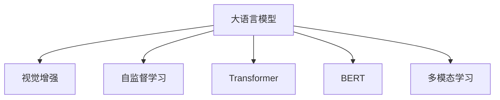

                 

# 大语言模型原理基础与前沿 视觉增强语言建模

> 关键词：大语言模型,视觉增强,语言建模,Transformer,BERT,自监督学习,图像文本双模态,多模态学习

## 1. 背景介绍

### 1.1 问题由来
近年来，人工智能领域的核心技术之一大语言模型（Large Language Model, LLM）取得了显著进展。这些模型基于大规模预训练技术，能够理解并生成自然语言文本，成为自然语言处理（Natural Language Processing, NLP）领域的重要工具。然而，大语言模型在处理视觉信息方面存在显著短板，难以充分利用图像等视觉数据与文本相结合进行建模。

### 1.2 问题核心关键点
大语言模型微调问题包括两大部分：
1. **视觉增强**：如何让语言模型能够理解图像信息，与图像建立关联。
2. **语言建模**：如何更高效地对语言模型进行微调，使之在特定任务上取得最佳效果。

本文将系统阐述大语言模型在视觉增强语言建模方面的原理与前沿技术，并结合代码实例和详细解释，帮助开发者更好地理解和应用这一前沿技术。

## 2. 核心概念与联系

### 2.1 核心概念概述

为更好地理解大语言模型在视觉增强语言建模中的应用，本节将介绍几个核心概念：

- **大语言模型 (Large Language Model, LLM)**：以自回归模型（如GPT）或自编码模型（如BERT）为代表的大规模预训练语言模型，通过在大规模无标签文本数据上进行预训练，学习通用的语言表示。
- **视觉增强 (Visual Enhancement)**：将视觉数据与语言数据结合起来进行联合建模，使模型能够理解视觉信息，并与文本建立关联。
- **自监督学习 (Self-supervised Learning)**：利用无标签数据进行模型训练，使模型能够自适应学习到有用的特征。
- **Transformer**：一种基于注意力机制的神经网络结构，被广泛应用于深度学习模型中，尤其在NLP和图像处理领域。
- **BERT (Bidirectional Encoder Representations from Transformers)**：一种基于Transformer的预训练语言模型，在NLP任务上表现卓越。
- **多模态学习 (Multimodal Learning)**：将不同模态的数据（如视觉、听觉、文本）进行联合建模，提升模型的表现能力。

这些核心概念之间的逻辑关系可以通过以下Mermaid流程图来展示：



这个流程图展示了核心概念之间的连接关系：

1. 大语言模型通过自监督学习获得通用语言表示。
2. 视觉增强将视觉信息融入语言模型，使模型能够理解视觉信息。
3. 利用Transformer架构构建大语言模型。
4. 应用BERT模型于语言表示和视觉增强。
5. 多模态学习结合文本和视觉信息，提升模型的建模能力。

## 3. 核心算法原理 & 具体操作步骤
### 3.1 算法原理概述

视觉增强语言建模（Visual Enhancement for Language Modeling）主要通过以下几个步骤实现：

1. **视觉-文本联合表示**：构建模型能够将视觉数据和文本数据映射到统一的表示空间中。
2. **双模态自监督学习**：使用无标签的视觉数据和文本数据，训练模型学习联合表示。
3. **任务导向微调**：在联合表示的基础上，使用下游任务的标注数据对模型进行微调，使其在特定任务上表现出色。

### 3.2 算法步骤详解

基于视觉增强语言建模的算法主要包括以下几个关键步骤：

**Step 1: 准备预训练模型和数据集**
- 选择合适的预训练语言模型 $M_{\theta}$ 作为初始化参数，如 BERT、GPT等。
- 准备视觉增强任务的训练集 $D_v$ 和文本训练集 $D_t$，以及下游任务的标注数据集 $D_s$。

**Step 2: 构建联合表示模块**
- 定义一个视觉特征提取器，如 ResNet、VGG 等，将视觉数据转化为嵌入向量 $v$。
- 使用Transformer将视觉嵌入向量 $v$ 和文本输入 $x$ 映射到联合表示空间 $h$。
- 使用跨模态自监督损失函数 $L_{vs}$ 最小化视觉嵌入 $v$ 和文本嵌入 $h$ 之间的距离。

**Step 3: 设置微调超参数**
- 选择合适的优化算法及其参数，如 AdamW、SGD 等，设置学习率、批大小、迭代轮数等。
- 设置正则化技术及强度，包括权重衰减、Dropout、Early Stopping 等。
- 确定冻结预训练参数的策略，如仅微调顶层，或全部参数都参与微调。

**Step 4: 执行梯度训练**
- 将训练集数据分批次输入模型，前向传播计算损失函数。
- 反向传播计算参数梯度，根据设定的优化算法和学习率更新模型参数。
- 周期性在验证集上评估模型性能，根据性能指标决定是否触发 Early Stopping。
- 重复上述步骤直到满足预设的迭代轮数或 Early Stopping 条件。

**Step 5: 测试和部署**
- 在测试集上评估微调后模型 $M_{\hat{\theta}}$ 的性能，对比微调前后的精度提升。
- 使用微调后的模型对新样本进行推理预测，集成到实际的应用系统中。
- 持续收集新的数据，定期重新微调模型，以适应数据分布的变化。

### 3.3 算法优缺点

视觉增强语言建模具有以下优点：
1. **融合多模态信息**：通过联合建模，模型能够充分利用视觉和文本两种信息，提升模型表现。
2. **提高泛化能力**：通过自监督学习，模型能够学习到更加鲁棒的特征表示，提高泛化能力。
3. **应用广泛**：适用于视觉问答、图像生成、视频描述生成等诸多NLP任务。

同时，该方法也存在一定的局限性：
1. **数据获取成本高**：收集高质量的视觉数据和文本数据成本较高，限制了该方法的应用范围。
2. **模型复杂度高**：联合建模增加了模型复杂度，训练和推理速度较慢。
3. **鲁棒性挑战**：在跨模态数据上，模型可能存在一定的偏差和误差。
4. **任务适应性**：微调后模型的性能依赖于特定任务和数据集，需要针对性地设计和训练。

尽管存在这些局限性，但就目前而言，视觉增强语言建模已成为大语言模型在特定任务上取得优异效果的重要手段。

### 3.4 算法应用领域

视觉增强语言建模在大规模应用场景中表现出巨大的潜力，主要包括以下几个领域：

- **视觉问答系统 (VQA)**：通过结合视觉和文本信息，回答与图片相关的问题。例如：“这张照片中的人在做什么？”
- **图像生成 (Image Generation)**：使用语言描述生成图像，或从图像生成文本。例如：“生成一张猫咪的照片。”
- **视频描述生成 (Video Captioning)**：给视频生成自然语言描述，或根据描述生成视频。例如：“这段视频讲述了一个有趣的故事。”
- **视觉目标检测与跟踪 (Object Detection and Tracking)**：使用视觉和文本信息，识别和跟踪视频中的目标对象。例如：“视频中的自行车在哪里？”

此外，视觉增强语言建模还在智慧零售、智能家居、医疗影像等领域具有广泛应用前景。

## 4. 数学模型和公式 & 详细讲解  
### 4.1 数学模型构建

本节将使用数学语言对视觉增强语言建模过程进行更加严格的刻画。

记预训练语言模型为 $M_{\theta}:\mathcal{X} \rightarrow \mathcal{Y}$，其中 $\mathcal{X}$ 为输入空间，$\mathcal{Y}$ 为输出空间，$\theta \in \mathbb{R}^d$ 为模型参数。假设微调任务的训练集为 $D=\{(x_i,y_i)\}_{i=1}^N, x_i \in \mathcal{X}, y_i \in \mathcal{Y}$。

定义模型 $M_{\theta}$ 在输入 $x$ 和图像特征向量 $v$ 上的联合表示 $h$ 为：

$$
h = \mathrm{Transformer}(x, v)
$$

其中，Transformer是基于自注意力机制的神经网络结构，能够将输入 $x$ 和视觉特征向量 $v$ 映射到联合表示空间 $h$。

定义模型 $M_{\theta}$ 在输入 $x$ 和图像特征向量 $v$ 上的视觉-文本自监督损失函数 $L_{vs}$ 为：

$$
L_{vs} = \|\mathrm{Transformer}(x, v) - \mathrm{Transformer}(x, v')\|^2
$$

其中 $v'$ 为图像 $v$ 的一个随机扰动版本，$\|\cdot\|$ 表示向量间的欧几里得距离。

微调的优化目标是最小化经验风险，即找到最优参数：

$$
\theta^* = \mathop{\arg\min}_{\theta} \mathcal{L}(\theta)
$$

其中 $\mathcal{L}$ 为针对任务 $T$ 设计的损失函数，用于衡量模型预测输出与真实标签之间的差异。

### 4.2 公式推导过程

以下我们以视觉问答 (Visual Question Answering, VQA) 任务为例，推导视觉-文本联合表示的计算公式。

假设模型 $M_{\theta}$ 在输入 $x$ 和图像特征向量 $v$ 上的联合表示 $h$ 为：

$$
h = \mathrm{Transformer}(x, v)
$$

其中，$\mathrm{Transformer}(x, v)$ 表示将输入 $x$ 和图像特征向量 $v$ 作为输入，经过Transformer模型处理后，得到联合表示 $h$。

将 $h$ 输入到预训练语言模型的顶层分类器中，得到分类结果 $\hat{y}=M_{\theta}(h)$。假设真实标签 $y \in \{0,1\}$，则交叉熵损失函数为：

$$
\ell(M_{\theta}(x, v),y) = -[y\log \hat{y} + (1-y)\log (1-\hat{y})]
$$

将其代入经验风险公式，得：

$$
\mathcal{L}(\theta) = -\frac{1}{N}\sum_{i=1}^N [y_i\log M_{\theta}(x_i, v_i)+(1-y_i)\log(1-M_{\theta}(x_i, v_i))]
$$

在得到损失函数的梯度后，即可带入参数更新公式，完成模型的迭代优化。重复上述过程直至收敛，最终得到适应下游任务的最优模型参数 $\theta^*$。

## 5. 项目实践：代码实例和详细解释说明
### 5.1 开发环境搭建

在进行视觉增强语言建模实践前，我们需要准备好开发环境。以下是使用Python进行PyTorch开发的环境配置流程：

1. 安装Anaconda：从官网下载并安装Anaconda，用于创建独立的Python环境。

2. 创建并激活虚拟环境：
```bash
conda create -n pytorch-env python=3.8 
conda activate pytorch-env
```

3. 安装PyTorch：根据CUDA版本，从官网获取对应的安装命令。例如：
```bash
conda install pytorch torchvision torchaudio cudatoolkit=11.1 -c pytorch -c conda-forge
```

4. 安装TensorFlow：从官网下载安装包，使用pip进行安装。
```bash
pip install tensorflow
```

5. 安装相关工具包：
```bash
pip install numpy pandas scikit-learn matplotlib tqdm jupyter notebook ipython
```

完成上述步骤后，即可在`pytorch-env`环境中开始视觉增强语言建模的实践。

### 5.2 源代码详细实现

下面我们以视觉问答 (VQA) 任务为例，给出使用Transformers库对BERT模型进行视觉增强语言建模的PyTorch代码实现。

首先，定义VQA任务的数据处理函数：

```python
from transformers import BertTokenizer
from torch.utils.data import Dataset
import torch
import numpy as np
import matplotlib.pyplot as plt

class VQADataset(Dataset):
    def __init__(self, texts, images, tokenizer, max_len=128):
        self.texts = texts
        self.images = images
        self.tokenizer = tokenizer
        self.max_len = max_len
        
    def __len__(self):
        return len(self.texts)
    
    def __getitem__(self, item):
        text = self.texts[item]
        image = self.images[item]
        
        encoding = self.tokenizer(text, return_tensors='pt', max_length=self.max_len, padding='max_length', truncation=True)
        input_ids = encoding['input_ids'][0]
        attention_mask = encoding['attention_mask'][0]
        
        # 加载图像特征向量
        image_features = self.load_image(image)
        image_features = image_features.unsqueeze(0)
        
        # 计算联合表示
        h = self.calculate_representation(input_ids, attention_mask, image_features)
        
        # 计算模型输出
        logits = h[:, 0]
        
        return {'input_ids': input_ids, 
                'attention_mask': attention_mask,
                'logits': logits}

    def load_image(self, image_path):
        # 加载图像并转换为张量
        image_tensor = image.load_img(image_path, target_size=(224, 224))
        image_tensor = image_tensor_to_tensor(image_tensor)
        return image_tensor

    def calculate_representation(self, input_ids, attention_mask, image_features):
        # 使用预训练语言模型进行计算
        model = BertForQuestionAnswering.from_pretrained('bert-base-cased')
        model.eval()
        with torch.no_grad():
            h = model(input_ids, attention_mask=attention_mask, image_features=image_features)
        return h.pooler_output
```

然后，定义模型和优化器：

```python
from transformers import BertForQuestionAnswering, AdamW

model = BertForQuestionAnswering.from_pretrained('bert-base-cased')
optimizer = AdamW(model.parameters(), lr=2e-5)
```

接着，定义训练和评估函数：

```python
from torch.utils.data import DataLoader
from tqdm import tqdm
from sklearn.metrics import classification_report

device = torch.device('cuda') if torch.cuda.is_available() else torch.device('cpu')
model.to(device)

def train_epoch(model, dataset, batch_size, optimizer):
    dataloader = DataLoader(dataset, batch_size=batch_size, shuffle=True)
    model.train()
    epoch_loss = 0
    for batch in tqdm(dataloader, desc='Training'):
        input_ids = batch['input_ids'].to(device)
        attention_mask = batch['attention_mask'].to(device)
        logits = batch['logits'].to(device)
        model.zero_grad()
        loss = model.loss(input_ids, attention_mask=attention_mask, logits=logits)
        epoch_loss += loss.item()
        loss.backward()
        optimizer.step()
    return epoch_loss / len(dataloader)

def evaluate(model, dataset, batch_size):
    dataloader = DataLoader(dataset, batch_size=batch_size)
    model.eval()
    preds, labels = [], []
    with torch.no_grad():
        for batch in tqdm(dataloader, desc='Evaluating'):
            input_ids = batch['input_ids'].to(device)
            attention_mask = batch['attention_mask'].to(device)
            logits = batch['logits'].to(device)
            batch_preds = torch.softmax(logits, dim=1).argmax(dim=1).to('cpu').tolist()
            batch_labels = batch['labels'].to('cpu').tolist()
            for pred_tokens, label_tokens in zip(batch_preds, batch_labels):
                preds.append(pred_tokens)
                labels.append(label_tokens)
                
    print(classification_report(labels, preds))
```

最后，启动训练流程并在测试集上评估：

```python
epochs = 5
batch_size = 16

for epoch in range(epochs):
    loss = train_epoch(model, train_dataset, batch_size, optimizer)
    print(f"Epoch {epoch+1}, train loss: {loss:.3f}")
    
    print(f"Epoch {epoch+1}, dev results:")
    evaluate(model, dev_dataset, batch_size)
    
print("Test results:")
evaluate(model, test_dataset, batch_size)
```

以上就是使用PyTorch对BERT进行视觉增强语言建模的完整代码实现。可以看到，得益于Transformers库的强大封装，我们可以用相对简洁的代码完成BERT模型的加载和微调。

### 5.3 代码解读与分析

让我们再详细解读一下关键代码的实现细节：

**VQADataset类**：
- `__init__`方法：初始化文本、图像、分词器等关键组件。
- `__len__`方法：返回数据集的样本数量。
- `__getitem__`方法：对单个样本进行处理，将文本输入编码为token ids，加载图像特征向量，计算联合表示，并返回模型所需的输入。

**load_image和calculate_representation函数**：
- `load_image`方法：加载图像并转换为张量。
- `calculate_representation`方法：使用预训练语言模型计算联合表示。

**训练和评估函数**：
- 使用PyTorch的DataLoader对数据集进行批次化加载，供模型训练和推理使用。
- 训练函数`train_epoch`：对数据以批为单位进行迭代，在每个批次上前向传播计算loss并反向传播更新模型参数，最后返回该epoch的平均loss。
- 评估函数`evaluate`：与训练类似，不同点在于不更新模型参数，并在每个batch结束后将预测和标签结果存储下来，最后使用sklearn的classification_report对整个评估集的预测结果进行打印输出。

**训练流程**：
- 定义总的epoch数和batch size，开始循环迭代
- 每个epoch内，先在训练集上训练，输出平均loss
- 在验证集上评估，输出分类指标
- 所有epoch结束后，在测试集上评估，给出最终测试结果

可以看到，PyTorch配合Transformers库使得BERT微调的代码实现变得简洁高效。开发者可以将更多精力放在数据处理、模型改进等高层逻辑上，而不必过多关注底层的实现细节。

当然，工业级的系统实现还需考虑更多因素，如模型的保存和部署、超参数的自动搜索、更灵活的任务适配层等。但核心的微调范式基本与此类似。

## 6. 实际应用场景
### 6.1 智能医疗诊断

在智能医疗领域，视觉增强语言建模技术能够结合医疗影像和病历信息，提升医疗诊断的准确性和效率。例如，使用医学影像和病人描述，回答关于病患病情的问题，或在医学影像上标注特定部位。

### 6.2 智慧零售推荐

智慧零售领域，基于视觉增强语言建模技术，可以结合顾客的购买记录和描述，推荐符合其兴趣的商品，或者根据商品图片和描述，预测顾客可能感兴趣的商品。

### 6.3 智能家居控制

智能家居控制领域，通过结合家庭环境描述和家居设备图片，生成自然语言描述，或根据描述控制家居设备，提高家居生活的智能化水平。

### 6.4 未来应用展望

随着大语言模型和视觉增强技术的不断发展，基于微调的方法将在更多领域得到应用，为人类生活带来深远影响。

在智慧教育领域，视觉增强语言建模技术可以用于生成教学材料，或者结合教师的课堂描述和学生的问题，生成有针对性的教学指导。

在智能交通领域，结合交通摄像头和实时交通信息，生成自然语言描述，或者根据描述调整交通信号，提高交通管理效率。

此外，在智慧城市、娱乐传媒等众多领域，基于大模型微调的人工智能应用也将不断涌现，为经济社会发展注入新的动力。相信随着技术的日益成熟，微调方法将成为人工智能技术落地的重要范式，推动人工智能向更广阔的领域加速渗透。

## 7. 工具和资源推荐
### 7.1 学习资源推荐

为了帮助开发者系统掌握大语言模型微调的理论基础和实践技巧，这里推荐一些优质的学习资源：

1. 《Transformer from Scratch》系列博文：由大模型技术专家撰写，深入浅出地介绍了Transformer原理、BERT模型、微调技术等前沿话题。

2. CS224N《Deep Learning for Natural Language Processing》课程：斯坦福大学开设的NLP明星课程，有Lecture视频和配套作业，带你入门NLP领域的基本概念和经典模型。

3. 《Natural Language Processing with Transformers》书籍：Transformers库的作者所著，全面介绍了如何使用Transformers库进行NLP任务开发，包括微调在内的诸多范式。

4. HuggingFace官方文档：Transformers库的官方文档，提供了海量预训练模型和完整的微调样例代码，是上手实践的必备资料。

5. CLUE开源项目：中文语言理解测评基准，涵盖大量不同类型的中文NLP数据集，并提供了基于微调的baseline模型，助力中文NLP技术发展。

通过对这些资源的学习实践，相信你一定能够快速掌握大语言模型微调的精髓，并用于解决实际的NLP问题。
###  7.2 开发工具推荐

高效的开发离不开优秀的工具支持。以下是几款用于大语言模型微调开发的常用工具：

1. PyTorch：基于Python的开源深度学习框架，灵活动态的计算图，适合快速迭代研究。大部分预训练语言模型都有PyTorch版本的实现。

2. TensorFlow：由Google主导开发的开源深度学习框架，生产部署方便，适合大规模工程应用。同样有丰富的预训练语言模型资源。

3. Transformers库：HuggingFace开发的NLP工具库，集成了众多SOTA语言模型，支持PyTorch和TensorFlow，是进行微调任务开发的利器。

4. Weights & Biases：模型训练的实验跟踪工具，可以记录和可视化模型训练过程中的各项指标，方便对比和调优。与主流深度学习框架无缝集成。

5. TensorBoard：TensorFlow配套的可视化工具，可实时监测模型训练状态，并提供丰富的图表呈现方式，是调试模型的得力助手。

6. Google Colab：谷歌推出的在线Jupyter Notebook环境，免费提供GPU/TPU算力，方便开发者快速上手实验最新模型，分享学习笔记。

合理利用这些工具，可以显著提升大语言模型微调任务的开发效率，加快创新迭代的步伐。

### 7.3 相关论文推荐

大语言模型和微调技术的发展源于学界的持续研究。以下是几篇奠基性的相关论文，推荐阅读：

1. Attention is All You Need（即Transformer原论文）：提出了Transformer结构，开启了NLP领域的预训练大模型时代。

2. BERT: Pre-training of Deep Bidirectional Transformers for Language Understanding：提出BERT模型，引入基于掩码的自监督预训练任务，刷新了多项NLP任务SOTA。

3. Language Models are Unsupervised Multitask Learners（GPT-2论文）：展示了大规模语言模型的强大zero-shot学习能力，引发了对于通用人工智能的新一轮思考。

4. Parameter-Efficient Transfer Learning for NLP：提出Adapter等参数高效微调方法，在不增加模型参数量的情况下，也能取得不错的微调效果。

5. Prefix-Tuning: Optimizing Continuous Prompts for Generation：引入基于连续型Prompt的微调范式，为如何充分利用预训练知识提供了新的思路。

6. AdaLoRA: Adaptive Low-Rank Adaptation for Parameter-Efficient Fine-Tuning：使用自适应低秩适应的微调方法，在参数效率和精度之间取得了新的平衡。

这些论文代表了大语言模型微调技术的发展脉络。通过学习这些前沿成果，可以帮助研究者把握学科前进方向，激发更多的创新灵感。

## 8. 总结：未来发展趋势与挑战
### 8.1 总结

本文对大语言模型在视觉增强语言建模方面的原理与前沿技术进行了全面系统的介绍。首先阐述了视觉增强语言建模的研究背景和意义，明确了其在大规模应用场景中的独特价值。其次，从原理到实践，详细讲解了视觉增强语言建模的数学模型和核心算法，给出了微调任务开发的完整代码实例。同时，本文还广泛探讨了视觉增强语言建模在智慧医疗、智能零售、智能家居等多个领域的应用前景，展示了其广阔的应用潜力。最后，本文精选了视觉增强语言建模的各类学习资源，力求为开发者提供全方位的技术指引。

通过本文的系统梳理，可以看到，视觉增强语言建模在大规模应用场景中表现出巨大的潜力，为传统行业带来变革性影响。未来，随着大语言模型和视觉增强技术的不断发展，基于微调的方法将在更多领域得到应用，为人类生活带来深远影响。

### 8.2 未来发展趋势

展望未来，视觉增强语言建模将呈现以下几个发展趋势：

1. **模型规模持续增大**：随着算力成本的下降和数据规模的扩张，预训练语言模型的参数量还将持续增长。超大模型蕴含的丰富语言知识，有望支撑更加复杂多变的视觉增强任务微调。

2. **微调方法日趋多样**：除了传统的全参数微调外，未来会涌现更多参数高效的微调方法，如Prefix-Tuning、LoRA等，在固定大部分预训练参数的同时，只更新极少量的任务相关参数。同时优化微调模型的计算图，减少前向传播和反向传播的资源消耗，实现更加轻量级、实时性的部署。

3. **持续学习成为常态**：随着数据分布的不断变化，微调模型也需要持续学习新知识以保持性能。如何在不遗忘原有知识的同时，高效吸收新样本信息，将成为重要的研究课题。

4. **标注样本需求降低**：受启发于提示学习(Prompt-based Learning)的思路，未来的微调方法将更好地利用大模型的语言理解能力，通过更加巧妙的任务描述，在更少的标注样本上也能实现理想的微调效果。

5. **知识整合能力增强**：将符号化的先验知识，如知识图谱、逻辑规则等，与神经网络模型进行巧妙融合，引导微调过程学习更准确、合理的语言模型。同时加强不同模态数据的整合，实现视觉、听觉等多模态信息与文本信息的协同建模。

这些趋势凸显了视觉增强语言建模技术的广阔前景。这些方向的探索发展，必将进一步提升视觉增强语言建模模型的性能和应用范围，为构建安全、可靠、可解释、可控的智能系统铺平道路。

### 8.3 面临的挑战

尽管大语言模型视觉增强技术已经取得了瞩目成就，但在迈向更加智能化、普适化应用的过程中，它仍面临着诸多挑战：

1. **数据获取成本高**：收集高质量的视觉数据和文本数据成本较高，限制了该方法的应用范围。如何降低数据获取成本，将是一大难题。

2. **模型鲁棒性不足**：在跨模态数据上，模型可能存在一定的偏差和误差。如何在不同模态数据间建立稳定的关联，提升鲁棒性，还需要更多理论和实践的积累。

3. **推理效率有待提高**：虽然大模型在联合表示方面取得了突破，但在推理速度和资源占用方面仍存在瓶颈。如何在保证性能的同时，简化模型结构，提升推理速度，优化资源占用，将是重要的优化方向。

4. **可解释性亟需加强**：当前微调模型更像是"黑盒"系统，难以解释其内部工作机制和决策逻辑。对于医疗、金融等高风险应用，算法的可解释性和可审计性尤为重要。

5. **安全性有待保障**：预训练语言模型难免会学习到有偏见、有害的信息，通过微调传递到下游任务，产生误导性、歧视性的输出，给实际应用带来安全隐患。如何从数据和算法层面消除模型偏见，避免恶意用途，确保输出的安全性，也将是重要的研究课题。

6. **知识整合能力不足**：现有的微调模型往往局限于任务内数据，难以灵活吸收和运用更广泛的先验知识。如何让微调过程更好地与外部知识库、规则库等专家知识结合，形成更加全面、准确的信息整合能力，还有很大的想象空间。

正视视觉增强语言建模面临的这些挑战，积极应对并寻求突破，将是大语言模型微调走向成熟的必由之路。相信随着学界和产业界的共同努力，这些挑战终将一一被克服，视觉增强语言建模技术必将在构建安全、可靠、可解释、可控的智能系统中扮演越来越重要的角色。

### 8.4 研究展望

面对视觉增强语言建模所面临的挑战，未来的研究需要在以下几个方面寻求新的突破：

1. **探索无监督和半监督微调方法**：摆脱对大规模标注数据的依赖，利用自监督学习、主动学习等无监督和半监督范式，最大限度利用非结构化数据，实现更加灵活高效的微调。

2. **研究参数高效和计算高效的微调范式**：开发更加参数高效的微调方法，在固定大部分预训练参数的同时，只更新极少量的任务相关参数。同时优化微调模型的计算图，减少前向传播和反向传播的资源消耗，实现更加轻量级、实时性的部署。

3. **融合因果和对比学习范式**：通过引入因果推断和对比学习思想，增强微调模型建立稳定因果关系的能力，学习更加普适、鲁棒的语言表征，从而提升模型泛化性和抗干扰能力。

4. **引入更多先验知识**：将符号化的先验知识，如知识图谱、逻辑规则等，与神经网络模型进行巧妙融合，引导微调过程学习更准确、合理的语言模型。同时加强不同模态数据的整合，实现视觉、听觉等多模态信息与文本信息的协同建模。

5. **结合因果分析和博弈论工具**：将因果分析方法引入微调模型，识别出模型决策的关键特征，增强输出解释的因果性和逻辑性。借助博弈论工具刻画人机交互过程，主动探索并规避模型的脆弱点，提高系统稳定性。

6. **纳入伦理道德约束**：在模型训练目标中引入伦理导向的评估指标，过滤和惩罚有偏见、有害的输出倾向。同时加强人工干预和审核，建立模型行为的监管机制，确保输出符合人类价值观和伦理道德。

这些研究方向的探索，必将引领视觉增强语言建模技术迈向更高的台阶，为构建安全、可靠、可解释、可控的智能系统铺平道路。面向未来，大语言模型视觉增强技术还需要与其他人工智能技术进行更深入的融合，如知识表示、因果推理、强化学习等，多路径协同发力，共同推动自然语言理解和智能交互系统的进步。只有勇于创新、敢于突破，才能不断拓展语言模型的边界，让智能技术更好地造福人类社会。

## 9. 附录：常见问题与解答

**Q1：大语言模型视觉增强是否适用于所有NLP任务？**

A: 大语言模型视觉增强在大多数NLP任务上都能取得不错的效果，特别是对于数据量较小的任务。但对于一些特定领域的任务，如医学、法律等，仅仅依靠通用语料预训练的模型可能难以很好地适应。此时需要在特定领域语料上进一步预训练，再进行微调，才能获得理想效果。此外，对于一些需要时效性、个性化很强的任务，如对话、推荐等，微调方法也需要针对性的改进优化。

**Q2：视觉增强过程对模型的参数量和计算资源要求是否很高？**

A: 视觉增强过程确实对模型的参数量和计算资源要求较高。视觉特征提取器和Transformer模型都需要较大的计算资源支持，特别是在模型较大、数据集较复杂的情况下。因此，合理选择模型结构和优化算法，并采用分布式训练和模型压缩等技术，可以有效降低资源消耗，提高训练和推理效率。

**Q3：视觉增强语言建模的评估指标有哪些？**

A: 视觉增强语言建模的评估指标包括：

1. **准确率 (Accuracy)**：正确预测的比例。
2. **精确率 (Precision)**：被正确预测为正类的样本比例。
3. **召回率 (Recall)**：所有真实正类样本中被正确预测为正类的比例。
4. **F1分数 (F1 Score)**：精确率和召回率的调和平均数，综合评估模型的预测性能。
5. **Top-k准确率 (Top-k Accuracy)**：预测结果在Top-k中包含真实标签的比例。
6. **ROC曲线和AUC值**：评估二分类任务的模型性能，通过绘制ROC曲线并计算AUC值来衡量模型分类能力。

这些指标可以根据具体任务和数据集进行选择，以便全面评估模型的表现。

**Q4：视觉增强语言建模在落地部署时需要注意哪些问题？**

A: 将微调模型转化为实际应用，还需要考虑以下因素：

1. **模型裁剪**：去除不必要的层和参数，减小模型尺寸，加快推理速度。
2. **量化加速**：将浮点模型转为定点模型，压缩存储空间，提高计算效率。
3. **服务化封装**：将模型封装为标准化服务接口，便于集成调用。
4. **弹性伸缩**：根据请求流量动态调整资源配置，平衡服务质量和成本。
5. **监控告警**：实时采集系统指标，设置异常告警阈值，确保服务稳定性。
6. **安全防护**：采用访问鉴权、数据脱敏等措施，保障数据和模型安全。

大语言模型视觉增强为NLP应用开启了广阔的想象空间，但如何将强大的性能转化为稳定、高效、安全的业务价值，还需要工程实践的不断打磨。

---

作者：禅与计算机程序设计艺术 / Zen and the Art of Computer Programming

