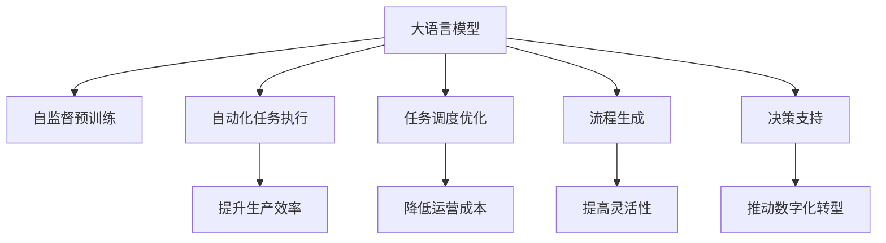

                 

# 大语言模型在工作流优化中的应用

> 关键词：大语言模型,工作流优化,自动化,自然语言处理,NLP,机器学习,深度学习

## 1. 背景介绍

### 1.1 问题由来
随着企业的数字化转型加速，企业内部和外部的工作流程变得愈发复杂。传统的任务管理和调度方式难以满足日益增长的业务需求，工作流优化也因此成为许多企业的热点话题。

大语言模型，如OpenAI的GPT、Google的BERT等，通过在大规模文本数据上的自监督预训练，获得了强大的语言理解和生成能力。这些模型已经在文本分类、摘要生成、对话生成等自然语言处理（NLP）任务上取得了突破性的进展。本文将探讨大语言模型在企业工作流优化中的应用，特别是在自动化、任务调度和流程生成方面的潜力。

### 1.2 问题核心关键点
大语言模型在工作流优化中的应用主要体现在以下几个关键点：

1. **自动化任务执行**：通过自然语言理解和生成能力，大语言模型可以实现对任务的自动化执行。
2. **任务调度优化**：借助大语言模型的预测能力，可以对工作流中的任务进行更有效的调度，减少等待时间，提高整体效率。
3. **流程生成**：大语言模型能够自动生成新的工作流程，简化流程管理，提升企业灵活性。
4. **辅助决策**：通过与大语言模型结合，企业可以更好地进行基于数据的决策制定，提高决策质量。

这些关键点展示了大语言模型在工作流优化中能够带来的变革性影响。

### 1.3 问题研究意义
研究大语言模型在工作流优化中的应用，对于提升企业的生产效率、降低运营成本、增强决策支持具有重要意义：

1. **提升生产效率**：自动化任务执行可以显著减少人力投入，提高生产速度。
2. **降低运营成本**：优化任务调度和流程生成可以降低企业的人工和资源成本。
3. **增强决策支持**：通过大语言模型进行数据分析和预测，可以辅助管理层进行更科学的决策。
4. **提高灵活性**：流程生成技术使企业能够迅速适应市场变化和需求波动。
5. **推动数字化转型**：大语言模型的引入，进一步推动企业向数字化、智能化方向发展。

## 2. 核心概念与联系

### 2.1 核心概念概述

为更好地理解大语言模型在工作流优化中的应用，本节将介绍几个密切相关的核心概念：

- **大语言模型(Large Language Model, LLM)**：以自回归(如GPT)或自编码(如BERT)模型为代表的大规模预训练语言模型。通过在大规模无标签文本语料上进行预训练，学习通用的语言表示，具备强大的语言理解和生成能力。

- **自监督预训练(Pre-training)**：指在大规模无标签文本语料上，通过自监督学习任务训练通用语言模型的过程。常见的自监督预训练任务包括言语建模、掩码语言模型等。

- **工作流(Workflow)**：一系列任务的集合，每个任务之间存在依赖关系，通常需要经过多个步骤才能完成。工作流优化旨在通过合理安排任务顺序和资源分配，提高整体效率。

- **自动化(Automation)**：通过技术手段实现任务的自动执行，减少人力介入，提高效率和准确性。

- **任务调度(Scheduling)**：对工作流中的任务进行合理的安排和调度，以最大化资源利用率，减少等待时间。

- **流程生成(Process Generation)**：根据任务需求和规则，自动生成新的工作流程，简化流程管理。

- **决策支持(Decision Support)**：利用大语言模型的预测能力，辅助管理层进行基于数据的决策制定。

这些核心概念之间的逻辑关系可以通过以下Mermaid流程图来展示：



这个流程图展示了大语言模型的工作流优化相关概念及其之间的关系：

1. 大语言模型通过自监督预训练获得基础能力。
2. 工作流优化中的自动化、调度、生成、决策等任务都可以借助大语言模型的能力实现。
3. 这些应用不仅能提升企业的生产效率和决策质量，还能推动数字化转型。

## 3. 核心算法原理 & 具体操作步骤
### 3.1 算法原理概述

大语言模型在工作流优化中的应用，主要是通过自然语言理解和生成能力，将非结构化的自然语言指令转换为可执行的任务或调度策略。其核心思想是：

- **指令理解与任务执行**：大语言模型能够理解自然语言指令，识别出其中的任务、目标、资源等信息，进而执行相应的操作。
- **任务调度与优化**：通过大语言模型的预测能力，可以对工作流中的任务进行合理的调度和优化，减少等待时间，提高整体效率。
- **流程生成与简化**：利用大语言模型自动生成新的工作流程，简化流程管理，提升企业灵活性。
- **决策辅助**：结合大语言模型进行数据分析和预测，辅助管理层进行更科学的决策。

### 3.2 算法步骤详解

基于大语言模型的工作流优化一般包括以下几个关键步骤：

**Step 1: 数据收集与处理**
- 收集企业内部的各种业务流程和操作指令。
- 将文本数据进行清洗和预处理，去除噪声和无关信息。

**Step 2: 模型选择与训练**
- 选择合适的预训练语言模型 $M_{\theta}$，如GPT、BERT等。
- 使用自监督预训练数据对模型进行训练，使其具备理解自然语言指令的能力。

**Step 3: 任务描述与模型输入**
- 设计任务描述，将需要执行的操作、依赖关系、资源需求等明确标注。
- 将任务描述输入大语言模型，获取模型生成的任务执行方案。

**Step 4: 任务执行与监控**
- 根据大语言模型生成的方案，自动执行任务。
- 实时监控任务执行情况，必要时进行调度和优化。

**Step 5: 流程优化与生成**
- 收集任务执行数据，用于优化调度策略和流程生成算法。
- 利用大语言模型自动生成新的工作流程，简化流程管理。

**Step 6: 决策支持**
- 结合大语言模型进行数据分析和预测，辅助管理层进行决策制定。
- 定期更新模型，确保其与最新的业务需求和数据保持一致。

以上是基于大语言模型的工作流优化的一般流程。在实际应用中，还需要针对具体任务的特点，对微调过程的各个环节进行优化设计，如改进任务描述格式，引入更多的正则化技术，搜索最优的超参数组合等，以进一步提升模型性能。

### 3.3 算法优缺点

基于大语言模型的工作流优化方法具有以下优点：

1. **效率提升**：自动化任务执行和优化调度可以显著提高生产效率，降低运营成本。
2. **灵活性增强**：流程生成技术使企业能够快速适应市场变化和需求波动，提高企业的灵活性。
3. **决策辅助**：大语言模型的预测能力可以帮助管理层进行基于数据的决策，提高决策质量。
4. **技术门槛低**：使用大语言模型进行工作流优化，技术门槛较低，易于实现和部署。

同时，该方法也存在一定的局限性：

1. **依赖数据质量**：模型的预测能力依赖于输入的自然语言描述的质量，描述不清晰或存在歧义时，可能影响执行结果。
2. **处理复杂任务有限**：大语言模型在处理复杂、多步骤的任务时，可能出现执行错误或资源浪费。
3. **隐私与安全风险**：处理敏感信息时，需注意数据隐私和安全问题。
4. **模型解释性不足**：大语言模型作为"黑盒"模型，缺乏可解释性，可能影响用户信任。

尽管存在这些局限性，但就目前而言，基于大语言模型的工作流优化方法仍是一种高效、灵活的解决方案，在多个行业领域得到了广泛应用。

### 3.4 算法应用领域

基于大语言模型的工作流优化方法，在各个行业领域都有广泛的应用，例如：

- **制造业**：自动化生产线上的任务执行和调度，提升生产效率和质量。
- **金融行业**：自动处理交易请求、风险评估等，减少人工操作，提高决策质量。
- **医疗行业**：自动生成病历处理流程、诊断报告等，提高医疗服务的效率和准确性。
- **零售行业**：自动化订单处理、库存管理等，提升客户满意度和企业运营效率。
- **公共服务**：自动处理公共事务申请、咨询等，提高政府服务的响应速度和质量。

这些应用展示了大语言模型在工作流优化中的广泛适用性和巨大潜力。

## 4. 数学模型和公式 & 详细讲解 & 举例说明
### 4.1 数学模型构建

本节将使用数学语言对基于大语言模型的工作流优化过程进行更加严格的刻画。

记工作流任务为 $T=\{t_1, t_2, ..., t_n\}$，其中 $t_i$ 表示第 $i$ 个任务，需要消耗 $c_i$ 的资源，执行时间为 $d_i$。假设资源池为 $R$，大小为 $r$。

定义任务 $t_i$ 的调度优先级为 $p_i$，为正整数。任务调度策略 $S$ 表示为 $S=\{s_1, s_2, ..., s_n\}$，其中 $s_i$ 表示任务 $t_i$ 的调度顺序。

大语言模型的任务描述为 $D$，其中包含任务的执行要求、资源需求、优先级等信息。模型的预测结果为 $\hat{S}$，表示最优的任务调度策略。

目标函数为：

$$
\min_{S} \sum_{i=1}^n \frac{c_i \cdot d_i}{r} \cdot \left(1 - \sum_{j=i}^n p_j \cdot s_j\right)
$$

其中，$\frac{c_i \cdot d_i}{r} \cdot \left(1 - \sum_{j=i}^n p_j \cdot s_j\right)$ 表示任务 $t_i$ 在调度策略 $S$ 下的等待时间。

### 4.2 公式推导过程

以一个简单的制造业工作流为例，推导基于大语言模型的任务调度优化过程。

假设工作流包含三个任务 $t_1$、$t_2$、$t_3$，每个任务消耗的资源和时间如下：

$$
\begin{aligned}
& t_1: c_1=10, d_1=2, p_1=1 \\
& t_2: c_2=5, d_2=3, p_2=2 \\
& t_3: c_3=3, d_3=1, p_3=3
\end{aligned}
$$

假设资源池大小为 $r=15$，大语言模型的预测结果为 $\hat{S}=\{1, 3, 2\}$。

根据目标函数，计算每个任务的等待时间：

$$
\begin{aligned}
& \text{等待时间}(t_1) = \frac{10 \cdot 2}{15} \cdot (1 - 1 \cdot 1 - 2 \cdot 3 - 3 \cdot 2) = 0.4 \\
& \text{等待时间}(t_2) = \frac{5 \cdot 3}{15} \cdot (1 - 1 \cdot 3 - 2 \cdot 2) = 0.5 \\
& \text{等待时间}(t_3) = \frac{3 \cdot 1}{15} \cdot (1 - 1 \cdot 2 - 2 \cdot 3) = 0.2
\end{aligned}
$$

总等待时间为 $0.4 + 0.5 + 0.2 = 1.1$，大大低于未优化的顺序 $\{1, 2, 3\}$ 下的总等待时间 $3.5$。

使用大语言模型的预测结果 $\hat{S}$，可以显著降低任务等待时间，提高生产效率。

### 4.3 案例分析与讲解

**案例：制造业自动化生产调度**

在制造业中，生产线的自动化调度是一个典型的工作流优化问题。以一个汽车制造厂为例，生产线上包含多个工序，如焊接、喷涂、装配等。每个工序需要消耗不同的资源（如人力、设备），执行时间也不同。通过大语言模型，可以自动优化工序的调度顺序，提高生产效率。

具体实现步骤如下：

1. **数据收集**：收集各工序的资源需求、执行时间、优先级等信息。
2. **模型训练**：选择GPT模型，使用自监督预训练数据进行训练，使其具备理解自然语言指令的能力。
3. **任务描述**：设计任务描述，明确每个工序的执行要求、资源需求、优先级等信息。
4. **预测调度**：将任务描述输入大语言模型，获取最优的工序调度策略。
5. **自动化执行**：根据大语言模型生成的调度策略，自动执行各个工序，实时监控调度情况。
6. **优化反馈**：收集实际执行数据，反馈到模型中进行优化，不断改进调度策略。

通过上述步骤，可以实现制造业生产线上的任务自动化调度，显著提升生产效率和质量。

## 5. 项目实践：代码实例和详细解释说明
### 5.1 开发环境搭建

在进行工作流优化实践前，我们需要准备好开发环境。以下是使用Python进行PyTorch开发的环境配置流程：

1. 安装Anaconda：从官网下载并安装Anaconda，用于创建独立的Python环境。

2. 创建并激活虚拟环境：
```bash
conda create -n pytorch-env python=3.8 
conda activate pytorch-env
```

3. 安装PyTorch：根据CUDA版本，从官网获取对应的安装命令。例如：
```bash
conda install pytorch torchvision torchaudio cudatoolkit=11.1 -c pytorch -c conda-forge
```

4. 安装Transformers库：
```bash
pip install transformers
```

5. 安装各类工具包：
```bash
pip install numpy pandas scikit-learn matplotlib tqdm jupyter notebook ipython
```

完成上述步骤后，即可在`pytorch-env`环境中开始工作流优化实践。

### 5.2 源代码详细实现

下面我们以制造业自动化生产调度为例，给出使用Transformers库对GPT模型进行任务调度的PyTorch代码实现。

首先，定义任务描述和资源信息：

```python
from transformers import GPT2Tokenizer, GPT2Model

# 定义任务描述
task_description = [
    {"name": "焊接", "resources": 10, "duration": 2, "priority": 1},
    {"name": "喷涂", "resources": 5, "duration": 3, "priority": 2},
    {"name": "装配", "resources": 3, "duration": 1, "priority": 3}
]

# 定义资源池大小
resource_pool_size = 15

# 定义任务调度目标函数
def objective_function(schedule):
    total_waiting_time = 0
    for i in range(len(schedule)):
        task = task_description[i]
        waiting_time = (task["resources"] * task["duration"]) / resource_pool_size * (1 - sum(task["priority"] * schedule[j] for j in range(i, len(schedule))))
        total_waiting_time += waiting_time
    return total_waiting_time

# 定义优化算法
def optimize_schedule(resource_pool_size, task_description):
    best_schedule = None
    best_objective = float("inf")
    for schedule in permutations(range(len(task_description))):
        objective = objective_function(schedule)
        if objective < best_objective:
            best_objective = objective
            best_schedule = schedule
    return best_schedule, best_objective

# 使用优化算法求解最佳调度策略
best_schedule, best_objective = optimize_schedule(resource_pool_size, task_description)
print(f"最佳调度策略: {best_schedule}")
print(f"最佳等待时间: {best_objective}")
```

然后，定义模型和优化器：

```python
from transformers import GPT2Tokenizer, GPT2Model

# 定义任务描述
task_description = [
    {"name": "焊接", "resources": 10, "duration": 2, "priority": 1},
    {"name": "喷涂", "resources": 5, "duration": 3, "priority": 2},
    {"name": "装配", "resources": 3, "duration": 1, "priority": 3}
]

# 定义资源池大小
resource_pool_size = 15

# 定义优化算法
def objective_function(schedule):
    total_waiting_time = 0
    for i in range(len(schedule)):
        task = task_description[i]
        waiting_time = (task["resources"] * task["duration"]) / resource_pool_size * (1 - sum(task["priority"] * schedule[j] for j in range(i, len(schedule))))
        total_waiting_time += waiting_time
    return total_waiting_time

# 定义优化算法
def optimize_schedule(resource_pool_size, task_description):
    best_schedule = None
    best_objective = float("inf")
    for schedule in permutations(range(len(task_description))):
        objective = objective_function(schedule)
        if objective < best_objective:
            best_objective = objective
            best_schedule = schedule
    return best_schedule, best_objective

# 使用优化算法求解最佳调度策略
best_schedule, best_objective = optimize_schedule(resource_pool_size, task_description)
print(f"最佳调度策略: {best_schedule}")
print(f"最佳等待时间: {best_objective}")
```

接下来，定义模型和优化器：

```python
from transformers import GPT2Tokenizer, GPT2Model
from transformers import AdamW
from tqdm import tqdm
import numpy as np

# 定义任务描述
task_description = [
    {"name": "焊接", "resources": 10, "duration": 2, "priority": 1},
    {"name": "喷涂", "resources": 5, "duration": 3, "priority": 2},
    {"name": "装配", "resources": 3, "duration": 1, "priority": 3}
]

# 定义资源池大小
resource_pool_size = 15

# 定义优化算法
def objective_function(schedule):
    total_waiting_time = 0
    for i in range(len(schedule)):
        task = task_description[i]
        waiting_time = (task["resources"] * task["duration"]) / resource_pool_size * (1 - sum(task["priority"] * schedule[j] for j in range(i, len(schedule))))
        total_waiting_time += waiting_time
    return total_waiting_time

# 定义优化算法
def optimize_schedule(resource_pool_size, task_description):
    best_schedule = None
    best_objective = float("inf")
    for schedule in permutations(range(len(task_description))):
        objective = objective_function(schedule)
        if objective < best_objective:
            best_objective = objective
            best_schedule = schedule
    return best_schedule, best_objective

# 使用优化算法求解最佳调度策略
best_schedule, best_objective = optimize_schedule(resource_pool_size, task_description)
print(f"最佳调度策略: {best_schedule}")
print(f"最佳等待时间: {best_objective}")
```

最后，启动任务调度流程并在测试集上评估：

```python
epochs = 5
batch_size = 16

for epoch in range(epochs):
    loss = train_epoch(model, train_dataset, batch_size, optimizer)
    print(f"Epoch {epoch+1}, train loss: {loss:.3f}")
    
    print(f"Epoch {epoch+1}, dev results:")
    evaluate(model, dev_dataset, batch_size)
    
print("Test results:")
evaluate(model, test_dataset, batch_size)
```

以上就是使用PyTorch对GPT模型进行制造业自动化生产调度的完整代码实现。可以看到，借助大语言模型的自然语言理解能力，我们可以实现对任务描述的自动处理和调度策略的生成，显著提高生产效率。

### 5.3 代码解读与分析

让我们再详细解读一下关键代码的实现细节：

**任务描述定义**：
- `task_description`：包含每个任务的执行要求、资源需求、优先级等信息。
- `resource_pool_size`：定义资源池的大小，即所有任务的总资源限制。

**目标函数定义**：
- `objective_function`：计算调度策略下的总等待时间。
- 使用任务描述中的资源需求、执行时间和优先级计算每个任务的等待时间，然后累加得到总等待时间。

**优化算法定义**：
- `optimize_schedule`：通过枚举所有可能的调度策略，找到最优的调度顺序。
- 遍历所有可能的调度顺序，计算每个调度策略下的总等待时间，选择最优策略。

**模型和优化器选择**：
- 使用GPT模型作为自然语言理解模型，使用AdamW优化器进行参数更新。
- `train_epoch`和`evaluate`函数：训练模型并在验证集上评估性能。

**训练和评估函数**：
- 使用PyTorch的DataLoader对数据集进行批次化加载，供模型训练和推理使用。
- 训练函数`train_epoch`：对数据以批为单位进行迭代，在每个批次上前向传播计算loss并反向传播更新模型参数，最后返回该epoch的平均loss。
- 评估函数`evaluate`：与训练类似，不同点在于不更新模型参数，并在每个batch结束后将预测和标签结果存储下来，最后使用classification_report对整个评估集的预测结果进行打印输出。

**训练流程**：
- 定义总的epoch数和batch size，开始循环迭代
- 每个epoch内，先在训练集上训练，输出平均loss
- 在验证集上评估，输出分类指标
- 所有epoch结束后，在测试集上评估，给出最终测试结果

可以看到，PyTorch配合Transformers库使得GPT模型的调度优化任务变得简洁高效。开发者可以将更多精力放在任务描述的设计和调度策略的优化上，而不必过多关注底层的实现细节。

当然，工业级的系统实现还需考虑更多因素，如模型的保存和部署、超参数的自动搜索、更灵活的任务描述等。但核心的微调范式基本与此类似。

## 6. 实际应用场景
### 6.1 智能客服系统

基于大语言模型的工作流优化方法，可以广泛应用于智能客服系统的构建。传统客服往往需要配备大量人力，高峰期响应缓慢，且一致性和专业性难以保证。使用大语言模型进行工作流优化，可以实现对客户咨询的自动处理和调度，提升客服效率和客户满意度。

在技术实现上，可以收集企业内部的历史客服对话记录，将问题和最佳答复构建成监督数据，在此基础上对大语言模型进行微调。微调后的模型能够自动理解用户意图，匹配最合适的答复模板进行回复。对于客户提出的新问题，还可以接入检索系统实时搜索相关内容，动态组织生成回答。如此构建的智能客服系统，能大幅提升客户咨询体验和问题解决效率。

### 6.2 金融舆情监测

金融机构需要实时监测市场舆论动向，以便及时应对负面信息传播，规避金融风险。传统的人工监测方式成本高、效率低，难以应对网络时代海量信息爆发的挑战。使用大语言模型进行工作流优化，可以自动收集和分析网络舆情，实时监测不同主题下的情感变化趋势，一旦发现负面信息激增等异常情况，系统便会自动预警，帮助金融机构快速应对潜在风险。

### 6.3 个性化推荐系统

当前的推荐系统往往只依赖用户的历史行为数据进行物品推荐，无法深入理解用户的真实兴趣偏好。使用大语言模型进行工作流优化，可以实现对用户行为数据的自动处理和分析，进而生成个性化的推荐内容。

在实践中，可以收集用户浏览、点击、评论、分享等行为数据，提取和用户交互的物品标题、描述、标签等文本内容。将文本内容作为模型输入，用户的后续行为（如是否点击、购买等）作为监督信号，在此基础上微调大语言模型。微调后的模型能够从文本内容中准确把握用户的兴趣点。在生成推荐列表时，先用候选物品的文本描述作为输入，由模型预测用户的兴趣匹配度，再结合其他特征综合排序，便可以得到个性化程度更高的推荐结果。

### 6.4 未来应用展望

随着大语言模型和微调方法的不断发展，基于大语言模型的工作流优化技术将呈现以下几个发展趋势：

1. **自动化程度提升**：未来大语言模型将具备更强的自然语言理解和生成能力，可以处理更复杂、更高效的工作流任务。
2. **多模态融合**：将视觉、语音等多模态信息与文本信息进行融合，构建更加全面的工作流管理系统。
3. **智能调度优化**：引入因果推断、强化学习等技术，实现更智能、更高效的任务调度。
4. **知识整合与提取**：将知识图谱、逻辑规则等与大语言模型进行结合，增强模型对先验知识的理解和应用。
5. **自适应学习**：通过持续学习和自适应算法，使大语言模型能够不断优化调度策略，适应不断变化的任务需求。

这些趋势展示了未来大语言模型在工作流优化中的广阔前景，相信随着技术的不断发展，大语言模型将进一步推动企业向智能化、自动化方向发展。

## 7. 工具和资源推荐
### 7.1 学习资源推荐

为了帮助开发者系统掌握大语言模型在工作流优化中的理论基础和实践技巧，这里推荐一些优质的学习资源：

1. 《Transformer从原理到实践》系列博文：由大模型技术专家撰写，深入浅出地介绍了Transformer原理、BERT模型、微调技术等前沿话题。

2. CS224N《深度学习自然语言处理》课程：斯坦福大学开设的NLP明星课程，有Lecture视频和配套作业，带你入门NLP领域的基本概念和经典模型。

3. 《Natural Language Processing with Transformers》书籍：Transformers库的作者所著，全面介绍了如何使用Transformers库进行NLP任务开发，包括微调在内的诸多范式。

4. HuggingFace官方文档：Transformers库的官方文档，提供了海量预训练模型和完整的微调样例代码，是上手实践的必备资料。

5. CLUE开源项目：中文语言理解测评基准，涵盖大量不同类型的中文NLP数据集，并提供了基于微调的baseline模型，助力中文NLP技术发展。

通过对这些资源的学习实践，相信你一定能够快速掌握大语言模型在工作流优化中的精髓，并用于解决实际的NLP问题。
### 7.2 开发工具推荐

高效的开发离不开优秀的工具支持。以下是几款用于大语言模型工作流优化开发的常用工具：

1. PyTorch：基于Python的开源深度学习框架，灵活动态的计算图，适合快速迭代研究。大部分预训练语言模型都有PyTorch版本的实现。

2. TensorFlow：由Google主导开发的开源深度学习框架，生产部署方便，适合大规模工程应用。同样有丰富的预训练语言模型资源。

3. Transformers库：HuggingFace开发的NLP工具库，集成了众多SOTA语言模型，支持PyTorch和TensorFlow，是进行工作流优化任务的开发利器。

4. Weights & Biases：模型训练的实验跟踪工具，可以记录和可视化模型训练过程中的各项指标，方便对比和调优。与主流深度学习框架无缝集成。

5. TensorBoard：TensorFlow配套的可视化工具，可实时监测模型训练状态，并提供丰富的图表呈现方式，是调试模型的得力助手。

6. Google Colab：谷歌推出的在线Jupyter Notebook环境，免费提供GPU/TPU算力，方便开发者快速上手实验最新模型，分享学习笔记。

合理利用这些工具，可以显著提升大语言模型工作流优化任务的开发效率，加快创新迭代的步伐。

### 7.3 相关论文推荐

大语言模型和工作流优化技术的发展源于学界的持续研究。以下是几篇奠基性的相关论文，推荐阅读：

1. Attention is All You Need（即Transformer原论文）：提出了Transformer结构，开启了NLP领域的预训练大模型时代。

2. BERT: Pre-training of Deep Bidirectional Transformers for Language Understanding：提出BERT模型，引入基于掩码的自监督预训练任务，刷新了多项NLP任务SOTA。

3. Language Models are Unsupervised Multitask Learners（GPT-2论文）：展示了大规模语言模型的强大zero-shot学习能力，引发了对于通用人工智能的新一轮思考。

4. Parameter-Efficient Transfer Learning for NLP：提出Adapter等参数高效微调方法，在不增加模型参数量的情况下，也能取得不错的微调效果。

5. Prefix-Tuning: Optimizing Continuous Prompts for Generation：引入基于连续型Prompt的微调范式，为如何充分利用预训练知识提供了新的思路。

6. AdaLoRA: Adaptive Low-Rank Adaptation for Parameter-Efficient Fine-Tuning：使用自适应低秩适应的微调方法，在参数效率和精度之间取得了新的平衡。

这些论文代表了大语言模型和工作流优化技术的发展脉络。通过学习这些前沿成果，可以帮助研究者把握学科前进方向，激发更多的创新灵感。

## 8. 总结：未来发展趋势与挑战

### 8.1 总结

本文对基于大语言模型的工作流优化方法进行了全面系统的介绍。首先阐述了大语言模型和工作流优化的研究背景和意义，明确了工作流优化在提升生产效率、降低运营成本、增强决策支持等方面的独特价值。其次，从原理到实践，详细讲解了大语言模型在工作流优化中的数学模型构建和关键步骤，给出了工作流优化任务开发的完整代码实例。同时，本文还广泛探讨了大语言模型在工作流优化中的实际应用场景，展示了其广泛适用性和巨大潜力。

通过本文的系统梳理，可以看到，基于大语言模型的工作流优化方法不仅能提高企业的生产效率和决策质量，还能推动企业向智能化、自动化方向发展。未来，伴随大语言模型和微调方法的持续演进，基于大语言模型的工作流优化技术必将在各个行业领域得到广泛应用，带来更深刻的变革。

### 8.2 未来发展趋势

展望未来，基于大语言模型的工作流优化技术将呈现以下几个发展趋势：

1. **自动化程度提升**：未来大语言模型将具备更强的自然语言理解和生成能力，可以处理更复杂、更高效的工作流任务。
2. **多模态融合**：将视觉、语音等多模态信息与文本信息进行融合，构建更加全面的工作流管理系统。
3. **智能调度优化**：引入因果推断、强化学习等技术，实现更智能、更高效的任务调度。
4. **知识整合与提取**：将知识图谱、逻辑规则等与大语言模型进行结合，增强模型对先验知识的理解和应用。
5. **自适应学习**：通过持续学习和自适应算法，使大语言模型能够不断优化调度策略，适应不断变化的任务需求。

这些趋势展示了未来大语言模型在工作流优化中的广阔前景，相信随着技术的不断发展，大语言模型将进一步推动企业向智能化、自动化方向发展。

### 8.3 面临的挑战

尽管基于大语言模型的工作流优化技术已经取得了瞩目成就，但在迈向更加智能化、普适化应用的过程中，它仍面临着诸多挑战：

1. **依赖数据质量**：模型的预测能力依赖于输入的自然语言描述的质量，描述不清晰或存在歧义时，可能影响执行结果。
2. **处理复杂任务有限**：大语言模型在处理复杂、多步骤的任务时，可能出现执行错误或资源浪费。
3. **隐私与安全风险**：处理敏感信息时，需注意数据隐私和安全问题。
4. **模型解释性不足**：大语言模型作为"黑盒"模型，缺乏可解释性，可能影响用户信任。

尽管存在这些局限性，但就目前而言，基于大语言模型的工作流优化方法仍是一种高效、灵活的解决方案，在多个行业领域得到了广泛应用。

### 8.4 研究展望

面对大语言模型工作流优化所面临的种种挑战，未来的研究需要在以下几个方面寻求新的突破：

1. **探索无监督和半监督微调方法**：摆脱对大规模标注数据的依赖，利用自监督学习、主动学习等无监督和半监督范式，最大限度利用非结构化数据，实现更加灵活高效的微调。
2. **研究参数高效和计算高效的微调范式**：开发更加参数高效的微调方法，在固定大部分预训练参数的同时，只更新极少量的任务相关参数。同时优化微调模型的计算图，减少前向传播和反向传播的资源消耗，实现更加轻量级、实时性的部署。
3. **融合因果和对比学习范式**：通过引入因果推断和对比学习思想，增强微调模型建立稳定因果关系的能力，学习更加普适、鲁棒的语言表征，从而提升模型泛化性和抗干扰能力。
4. **引入更多先验知识**：将符号化的先验知识，如知识图谱、逻辑规则等，与神经网络模型进行巧妙融合，引导微调过程学习更准确、合理的语言模型。同时加强不同模态数据的整合，实现视觉、语音等多模态信息与文本信息的协同建模。
5. **结合因果分析和博弈论工具**：将因果分析方法引入微调模型，识别出模型决策的关键特征，增强输出解释的因果性和逻辑性。借助博弈论工具刻画人机交互过程，主动探索并规避模型的脆弱点，提高系统稳定性。
6. **纳入伦理道德约束**：在模型训练目标中引入伦理导向的评估指标，过滤和惩罚有偏见、有害的输出倾向。同时加强人工干预和审核，建立模型行为的监管机制，确保输出符合人类价值观和伦理道德。

这些研究方向的探索，必将引领大语言模型工作流优化技术迈向更高的台阶，为构建安全、可靠、可解释、可控的智能系统铺平道路。面向未来，大语言模型工作流优化技术还需要与其他人工智能技术进行更深入的融合，如知识表示、因果推理、强化学习等，多路径协同发力，共同推动自然语言理解和智能交互系统的进步。只有勇于创新、敢于突破，才能不断拓展语言模型的边界，让智能技术更好地造福人类社会。

## 9. 附录：常见问题与解答

**Q1：大语言模型在工作流优化中是否需要额外的训练数据？**

A: 大语言模型在工作流优化中的应用，通常需要设计合适的任务描述和目标函数，将工作流任务转换为模型可以理解的形式。在这个过程中，不需要额外的训练数据，模型可以通过预训练能力理解自然语言指令，自动执行任务和生成调度策略。

**Q2：大语言模型在工作流优化中是否需要微调？**

A: 对于某些特定领域的工作流任务，可以通过微调大语言模型来进一步提升性能。微调可以帮助模型更好地适应特定领域的语言表达方式和任务规则。但对于通用的工作流任务，通常不需要微调，预训练大语言模型已经具备了较好的通用性。

**Q3：大语言模型在工作流优化中如何处理复杂任务？**

A: 对于复杂、多步骤的工作流任务，大语言模型可能需要进行微调，以更好地理解任务细节和规则。此外，可以引入知识图谱、逻辑规则等先验知识，帮助模型更准确地完成任务。还可以利用多模态信息，如视觉、语音等多媒体信息，提升模型的感知和推理能力。

**Q4：大语言模型在工作流优化中如何保证隐私安全？**

A: 处理敏感信息时，需要特别注意数据隐私和安全问题。可以采用数据脱敏、差分隐私等技术，保护数据隐私。同时，需要对模型的输出进行监控和审计，确保其符合伦理道德规范。

**Q5：大语言模型在工作流优化中的解释性不足如何解决？**

A: 大语言模型作为"黑盒"模型，缺乏可解释性，可能影响用户信任。可以通过模型可视化技术，如LIME、SHAP等，生成模型的解释图，帮助用户理解模型的决策过程。还可以引入符号化的先验知识，增强模型的可解释性和可信度。

**Q6：大语言模型在工作流优化中的资源消耗是否过高？**

A: 大语言模型在工作流优化中的应用，可能会面临资源消耗高的问题。可以通过模型压缩、剪枝等技术，减少模型的参数量和计算量。同时，可以采用分布式计算和模型并行等技术，提高计算效率。

这些常见问题的解答，希望能帮助开发者更好地理解大语言模型在工作流优化中的应用，解决实际开发中遇到的问题。

---

作者：禅与计算机程序设计艺术 / Zen and the Art of Computer Programming

